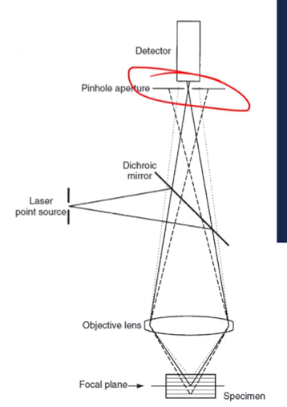

<!-- 20220902T13:08 -->
# Light Microscope Operation

We will be finishing up Chapter 1 today, but will not be getting into light waves. Certainly, know how light affects #SEM and #TEM, but do not need to know the physics behind these concepts in this class.

## Objectives
* describe the processes for generating samples of approrpiate tyupe andquality: idnetify the sources of damage and artifacts and how to avoid them.
* Detail various imaging moees for both type and mechanicsm(s)
* determine the appropriate imaging type for diverse smapel types
* describe the basic diferences between imaging methods and when they are useful

## Sample Preparation
In some cases, an object of interest can be viewed without any alteration: e.g. a dead bug. In most research effort, the examination of materials will require extensive sample preparation. A typical sequence of steps will consist of:
* sectioning mounting, grind, polishing, ane etching

### Sectioning
To make a sample easeier to image, it is often cut down to a smaller size. There may be a portion of interest that is not readily visible without sectioning (i.e. interior). The sample can be roughly cut with an appropriate method:
* High-speed saw (fast, high damage)
* Low-speed saw (medium speed and damage)
* Electrical discharge machining (EDM): slow, precise, causes surface melting, only for conductive materials.
* Water jet: requires programming and set up, cutting is fast, modest damage without heating.
* accessengineeringlibrary.com/content/book/9781260122312/toc-chapter/chapter22...

### Microtomy
Primarily used for soft materials: such as, polymers and biological samples. Uses a very sharp knife to slice thin section from a sample: like a mandolin used in the kitchen. Ultramicrotomy creates *very* thin (20-150 nm) sections for #TEM.

### Mounting
Holds a specimen in place for sectioning, grinding, and polishing: many automated techniques rely on the standardized shape and size. Can be hot or cold-mounted.
* Hot mounting used heat and pressure to mold a polymer (typically phenolic), around the sample: heat is unacceptbale for some sapmles with heat-sensitive features.
* Cold mounting uses a two-part resin/hardnener mixter to create mold around the sample and cures over time (minutes ot hours)
  * Often epoxy or polyester, hardness and clarity vary.
  * Vacuum infiltration will aid in removing air bubbles and created a good bond.
* Additives such as glass filler or conductive powders can be added.

Samples can also be mounted by clamping or adhering to a surface.

### Grinding
The surface created during sectioning is rarely acceptable for analysis. Abrasive smoothing is used to progressively remove damage and generate a flat surface. Each step of grinding/polishing is only intended to remove the damage of a previous step of similar magnitude: a sequence of abrasives is used to incrementally prepare the surface. The grinding process should be done with alternating sample orientations to provide a clear information...

!!! info Storing Sand Paper
    Finer grits should be stored above the coarser grits so that the finer grits are not scratched by the coarser grit which could happen if a coarse grit fell onto a finer grit.

### Polishing
instead of an abrasive paper, final polishing will use a pad to which the abrasive particles are added: the style of the pad will determine the proper polishing particle size. Polishing steps should following a siilar process of progressible reducing the coarseness of grind. Excessive pressure at polishing can plasticaly deform and "smaer" our the surface features. Vibratory polishing uses a fine sliurry with vibration to reduce surface damage. Electropolishing and ion polishing provide damage-free surfaces.

### Etching
to highligth certain features, etching can be used. Etching uses a chemically active solution to selectively remove areas of a sample. The material being etched will determine the appropriate etchant. Grain boundaries and grain contrast are commonly examined by etching: teh etch rate is faster at grain boundaries and for certain grain orientations.

### Imaging Modes
#### Brightfield/Darkfield
By altering the light path, different variations on the features can be highlighted. The alteration may be in amplitude, phase, or angle, and area of illumination. Brightfield is the most common type and is a uniform illumination of the surface (or transmission through). Darkfield uses a central stop to only allow light rays to be used from the outer edge of the optics: this causes surface features to appear bright as they scatter...

#### Phase Contrast
Light can be altered in amplitude or phase to produce imageing contrast. Phase contrast microscoyp uses a condenser annulus and phase plate to induce destructive interference of the light: where the light is scattered, the image appears brigther.

|  |
|:--:|
| When a phase plate is tuned to some frequency of light, light passing through the annulus is shifted in phase to cancel out light of the opposite phase. Light waves that are shifted but not opposite or not shifted are allowed to pass through the annulus which is makes certain features in the image brighter. |

#### Polarized Light
Light has random wave orientations, and a polarizer lbicks all or some of those orientations. This allows certain waves to be passed through. After interacting with the sample, the wave plane may change, and be bocked, producing contrast. Two polarizes (cross-polarization) can be used to further reduce the light transmittance.

#### Polarization of light
The polarization of light can be used to control which plane orientations are available, and they can be shifted as needed. A birefringent crystal has anisotropic refractive properties, and when polarized (planar) light hits it, it is split into two polarized light rays (E wave and O wave) with a phase difference.

##### Nomarski/DIC
Differential interferance contrast uses the E and O wave phase differences to generate shading. These polarized waves can interfere constructively or destructively, and cross-polarization can be used to siolate certain types.

|  |
|:--:|
| The difference in phases of light interacts with grain boundaries in different ways to emphasize the change in height. |

#### Flourescence
The use of light filters and fluorophores/flourchromes can be used to higilight areas of a sample. The light should be of a wavelength suitable to excite the flourorpohres, useuallyd a veryshort wavelength (UV or blue). This is common in bioloical materials where certain features are tagged and lightlighted in the sample.

#### Confocal microscopy
the primariy difference in confocal microscopy is that the sample is scanned with a high-intesnt laser beam. The small spot and focal point allow a single plane to be analyzed, and a  pinhole at the detector elmiinates out of focus areas. The beam is often rastered across the surface at a fixed z-height, then the stage or objective is moved to the next plan and scanned again.

|  |
|:--:|
| The compilation of in=focus images is used to create a 3D image and measure those height differences. |

## Summary
* there are many wasy in which iptical micrsocpy can be performed in order to get the most information forma  sample
* thec techinques use various optics to aheive the best outcome
* commonly the advaned optical arrangements are not use controlled, but knowing how to make the most of the them is valuable.
* the concepts of optical microscope will caryy over to electron microscoyp.

Ideally, we should now konw how to interpet reported microscopy images and what goes into the technique used: limitations, benefits, and fundamental concept.