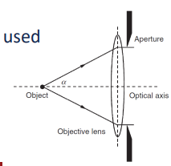

# Numerical Aperture

The numerical aperture (NA) is the gathering ability of the lens and related to the angle acceptance of incoming light: $NA = \mu\sin(\alpha)$.
[Resolution](../engr-743-001-damage-and-fracture/resolution.md) is wavelength dependent, with visible light having a $400 nm$ minimum.
For better [resolution](../engr-743-001-damage-and-fracture/resolution.md), oil immersion (n=1.5) can be used.
Why? A: the oil keeps the [diffraction](snells-law.md) down at the boundary of the lens.
What is the maximum [resolution](../engr-743-001-damage-and-fracture/resolution.md) of light? at alpha = 1, which would be within the lens itself.
Typically, NA = 1.5 at blue light.
M=1000 is the limit of what your human eye can see in #optical-microscopy.
Any higher magnification is better for computer analysis.

