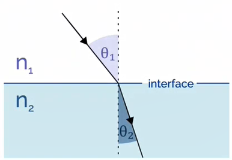

<!-- 220824 -->
# Optical Microscopy Concepts
## Objectives
- Introduce concepts and uses of light microscopy
- Identify the mechanisms of light focusing and lens design
- Specify the way images are formed and how magnification is calculated

## Basics of Optics
Light microscopy uses lenses to focus and magnify an object.
Some general concepts will be helpful to understand how and why this works.
The principle of refraction will be central to lens function.
[Snell’s Law](snells-law.md) gives a geometry relationship: $n_{1}\sin(\theta_{1}) = n_{2}\sin(\theta_{2})$.

|  |
|:--:|
| The rate at which light passes through a material differs from material to material. |

!!! example Snell's Law
    |  |
    |:--:|
    | Solve for $\theta_{1}$, $\theta_{2}$, $\theta_{3}$, and $\theta_{4}$. The index of refraction outside prism is $n = 1$ and inside is $n = 1.56$. |

    $$\begin{split}
    \theta_{1} &= 40\degree \\
    \theta_{2} &= \arcsin(\frac{n_{1}}{n_{2}}\sin(\theta_{1})) \\
    \implies \arcsin(\frac{1}{1.56}\sin(40\degree)) &\approx 24.3\degree \\
    \implies \theta_{3} &= 30\degree + (30\degree - 24.3\degree) \\
    &= 35.7\degree \\
    \theta_{4} &= \arcsin(\frac{n_{3}}{n_{4}}\sin(\theta_{3})) \\
    \implies \arcsin(\frac{1.56}{1}\sin(35.7\degree)) &\approx 65.6\degree
    \end{split}$$

## Convex and Concave Lens
Refraction Rules for a Converging Lens:
- Any incident ray traveling parallel to principal axis of converge lens will refract through lens and travel through focal point on opposite side of lens
- Any incident ray traveling through the focal point on the way to the lens will refract through lens and travel parallel

## Imaging
The purpose of light microscopy is to view an object at increased magnification and/or with some alteration to the light transmitted through or reflected from that object: i.e. to provide information not available with the naked eye.
This requires lens and/or filters that manipulate the light.
The light must be capture by eye or sensor, and the construction of a microscopy must be suited to the purpose: not all microscopes are the same in quality or capability.

## Vision correction
Near and far-sightedness are caused by incorrect focusing of incoming light.
The "detector" must be within the focal plane of the light to get a clear image.
the focal point of most objective lenses (not like a camera) is not variable, so the sample height must be varied.

## Magnification
|  |
|:--:|
| A simple lens magnifies an object in a *virtual* image that *appears* to be coming from a larger object. The real image will be inverted at the focal point on the side of the lens. |

<!-- 20220826T13:05 -->

## Thin lens equation and magnification
Magnification depends on the focal length of the lens ($f$) and the distances from the lens to the object ($u$) and image ($V$).
Triangles ABO and A’B’O are similar (A’B’/AB = OB’/OB).
Triangles A’B’F and OCF are similar (A’B’/OC = FB’/OF).
AB = OC, so OB’/OB = FB’/OF = (Ob’ - OF)/OF.
Let OB = -u, OB’ = v, and OF = f.
$\frac{v}{-u} = \frac{v - f}{f}$ \implies M = \frac{h’}{h}$.
Question: What is M at 2F? A: 1.

## Magnification
The near point of eye focus is conventionally taken as 250 mm (a relaxed focus).
The virtual image is what appears to be the object (enlarged and at a greater distance).
Higher magnification requires a shorter focal length.
Multiple lenses multiply magnification.

## It’s a little more complicated…
Example: a camera “lens”, which is a compound lens consists of numerous elements.
This is similar for microscope objectives.

## Summary
- Light microscopy is a valuable tool to examining a wide rang of objects
- Even basic microscopes use complex lens systems to focus and magnify objects
- The principles of lens design are prevalent in many other light-based observation techniques, such as telescopes and cameras