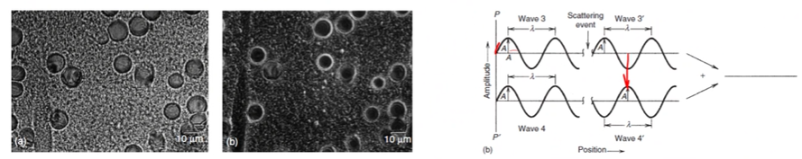

# Phase Contrast

Light can be altered in amplitude or phase to produce [imaging contrast](contrast.md).
Phase contrast microscopy uses a condenser annulus and phase plate to induce destructive interference of the light: where the light is scattered, the image appears brighter.

|  |
|:--:|
| When a phase plate is tuned to some frequency of light, light passing through the annulus is shifted in phase to cancel out light of the opposite phase. Light waves that are shifted but not opposite or not shifted are allowed to pass through the annulus which is makes certain features in the image brighter. |