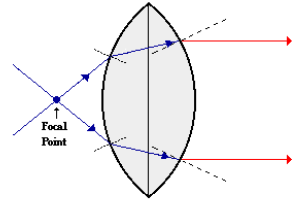

# Refraction Rules for a Converging Lens

- Any incident ray traveling parallel to the principal axis of #converging-lens will refract through lens and travel through focal point on opposite side of lens.
- Any incident ray traveling through the #focal-point on the way to the lens will refract through lens and travel parallel the principal axis.
- An incident ray that passes through the center of the lens will in effect continue in the same direction that it had when it entered the lens.

|  |
|:--:|
| Incident rays which travel through the #focal-point will refract through the lens and travel parallel to the principal axis. |