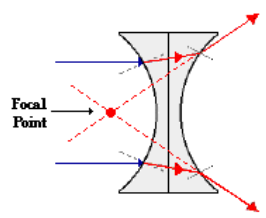

# Refraction Rules for a Diverging Lens

- Any incident ray traveling parallel to the principal axis of a #diverging-lens will refract through the lens and travel in line with the #focal-point: i.e., in a direction such that its extension will pass through the #focal-point.
- Any incident ray traveling towards the #focal-point on the way to the lens will refract through the lens and travel parallel to the principal axis.
- An incident ray that passes through the center of the lens will in effect continue in the same direction that it had when it entered the lens.

|  |
|:--:|
| A #diverging-lens is said to have a negative #focal-length since rays which enter the lens traveling parallel to the principal axis diverge. |