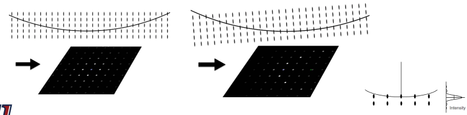

# Relrods

Theoretically, a surface intersecting a point is only satisfied at one possible condition.
In reality, a point is only generated by an infinite lattice, and the real sample dimensions and shape factors spread the point into a rod (incomplete destructive interference, more on this in #XRD).
The reciprocal lattice rod (relrod) gives varying intensity to the #diffraction-pattern.

