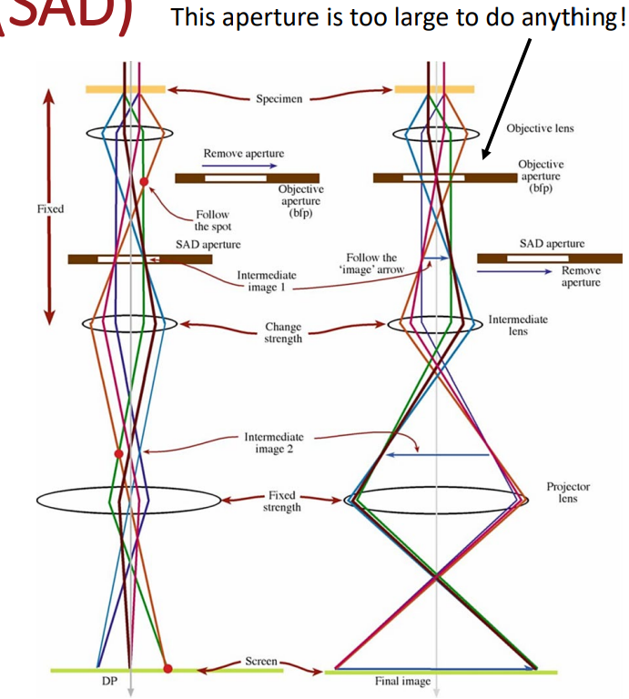

# Selected Area Diffraction

#SAD is a technique for selecting the back #focal-plane of the #electron-beam where a #diffraction-pattern is focused: only produced by #crystalline materials.
[BF](brightfield.md) images are created by putting the objective aperture over the central spot, which is undeflected or weakly deflected.
By moving the [BF](brightfield.md) aperture to strong #diffraction-spots, a [DF](darkfield.md) image is produced.

