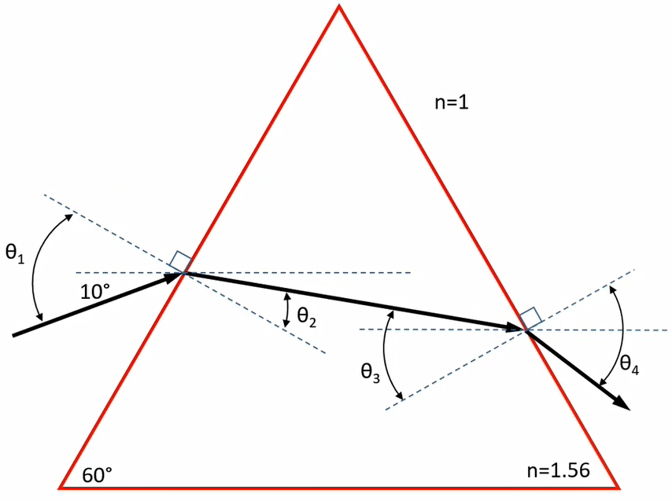

# Snell's Law

...gives a geometry relationship: $n_{1}\sin(\theta_{1}) = n_{2}\sin(\theta_{2})$.

|  |
|:--:|
| The rate at which light passes through a material differs from material to material. |

!!! example Snell's Law
    |  |
    |:--:|
    | Solve for $\theta_{1}$, $\theta_{2}$, $\theta_{3}$, and $\theta_{4}$. The index of refraction outside prism is $n = 1$ and inside is $n = 1.56$. |

    $$\begin{split}
    \theta_{1} &= 40\degree \\
    \theta_{2} &= \arcsin(\frac{n_{1}}{n_{2}}\sin(\theta_{1})) \\
    \implies \arcsin(\frac{1}{1.56}\sin(40\degree)) &\approx 24.3\degree \\
    \implies \theta_{3} &= 30\degree + (30\degree - 24.3\degree) \\
    &= 35.7\degree \\
    \theta_{4} &= \arcsin(\frac{n_{3}}{n_{4}}\sin(\theta_{3})) \\
    \implies \arcsin(\frac{1.56}{1}\sin(35.7\degree)) &\approx 65.6\degree
    \end{split}$$