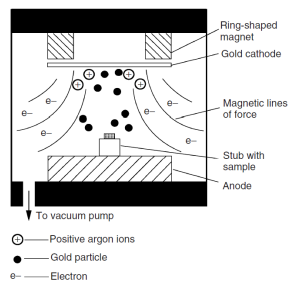

# Sputter Coating

This is the most common way to mitigate charging effects.

A simple means to reduce charging is to coat the sample surface with a thin (<10 nm) layer of conductive material: e.g. carbon, gold, platinum, etcetera.
The most common way to to do this is sputter coating, which uses a plasma to impinge gas molecules upon the target made from the conductive material.
The conductive material is "sputtered" from the target surface and deposits on other surfaces, most importantly, the sample surface.
A modest amount of heating may occur to the sample, and sensitive samples should be carefully processed.

!!! question Is sputtering mostly for topography? <cite> #Sam-Scott
    Rather than just for topography, it is for charging because a thin enough layer would not interfere with #BSE which is important for composition.

!!! note
    Sputter coating introduces uncertainty where composition is of interest; therefore, #VPSEM may be the preferred method.