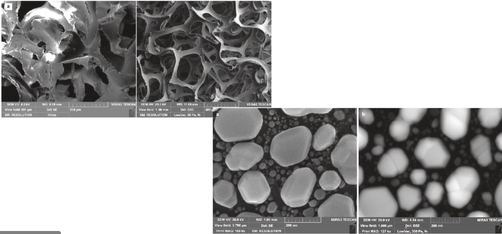
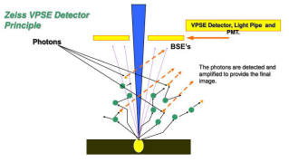

# Variable Pressure SEM

#VPSEM uses a higher chamber pressure (more gas molecules) to reduce charging in a sample.
Many aspects of SEM are incompatible with operation at elevated chamber pressure: high voltages on detectors can cause arcing.
The #electron-beam is also degraded by gas molecule collisions, reducing resolution: higher pressures reduce charging more effectively, but they also increase scattering.
$$R_{s} = (0.364\frac{Z}{E})\sqrt{\frac{p}{T}}\sqrt{L^{3}}$$
where $R_{s}$ is the skirt radius ($m$); $Z$ is the atomic number of the gas; $E$ is the beam energy (ev); $p$ is the pressure (Pa); $T$ is the temperature (K); and L is the #gas-path-length (GPL) ($m$).

## Scattering and Composition
Just as the [resolution](../engr-743-001-damage-and-fracture/resolution.md#probe-size-in-electron-microscopy) of the #electron-beam is compromised for imaging, the area of chemical mapping will be larger.
This results in diffuse looking #phase-interfaces, even if they are not.

!!! warning #phase-interfaces
    Sharp #phase-interfaces will appear diffused and more rounded by this technique.

## Charging and Resolution Reduction

!!! question Why would #BSE be more visible at variable pressure? <cite> #Mark-Atwater
    #SE are more likely to interact with and ionize the gas molecules.
    #BSE are such high energy they follow a straight trajectory.

!!! question Why not get as good [resolution](../engr-743-001-damage-and-fracture/resolution.md) with #BSE? <cite> #Mark-Atwater
    They primarily come from the lower part of the [electron charge volume](interaction-volume.md) which is a wider cross-sectional area that appears as a wider beam.

## High-Pressure Operation
The #SEM must have a variable pumping in the column to avoid #damage to the source (especially #FEG).
The column can be maintained orders of magnitude lower pressure by means of the final aperture and active pumping on the column.
Detectors with high-voltage must be off, and specialized detectors are available: e.g. a detector such as the #VPSEM (Zeiss) will detect photons created by the discharge gas molecules.

