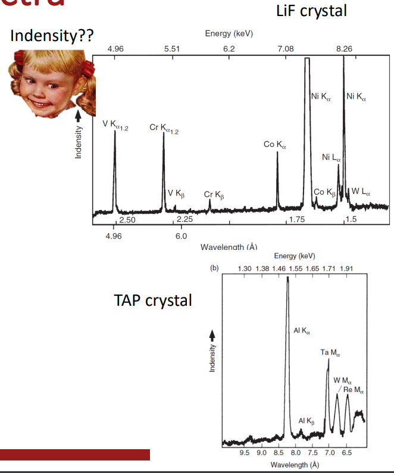

# Wavelength Dispersion Spectrometry

#WDS provides better resolution than #EDS, but the setup is more complicated and costly.
#WDS can detect changes in wavelength of $0.002-0.02$ ($0.01-0.1 keV$), which is an order of magnitude smaller than #EDS.
Element detection is from C (Z = 6) and above.
Element detection is sequential by scanning through a range of angles.

## Spectra
The data generated from #WDS is a plot of intensity for each wavelength: the *relative* peak heights are what is important.
The peaks sets are unique to each element.
Some elements have peaks that are too close together to be resolved.
Other have a wavelength that is a near multiple of another element so that they overlap.

!!! quote <cite> #Mark-Atwater
    Overall intensity is not a measure of what is there but the relation of peaks to what is detected.
    The units do not matter which sometimes feels uncomfortable.