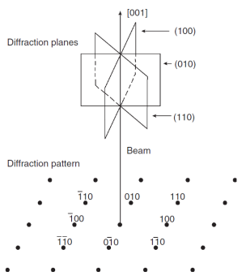

# Zone Axis

If a group of #crystal-planes (crystal zone) all have normal directions perpendicular to another direction --e.g. the #electron-beam --that direction is called zone axis direction.
A sample may need to be tilted to align the zone axis with the beam.

