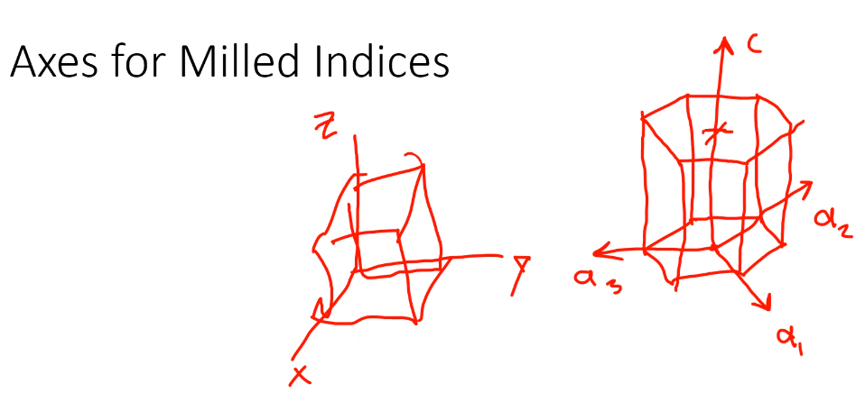
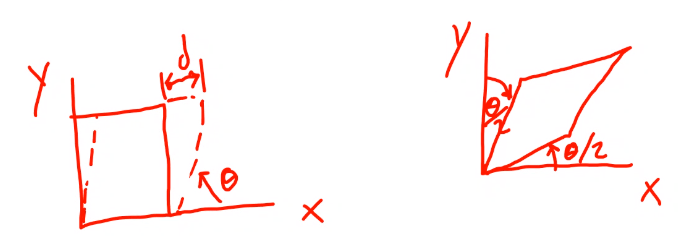
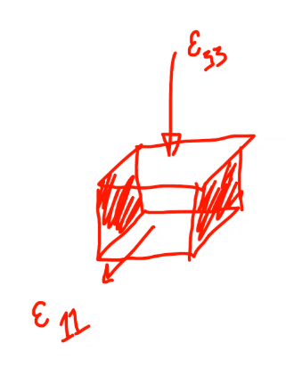
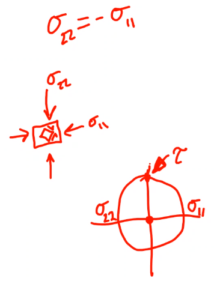
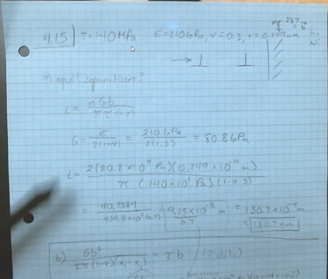
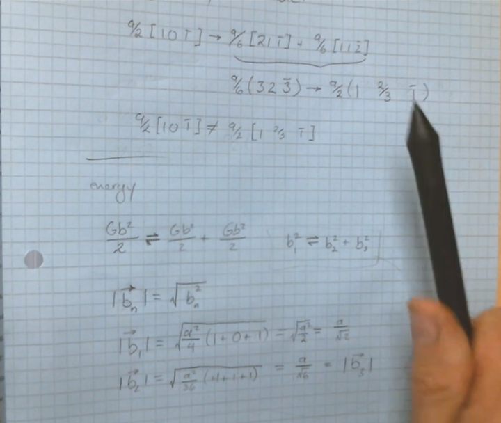
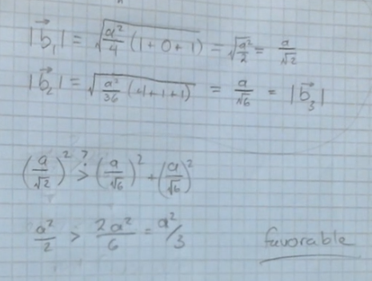
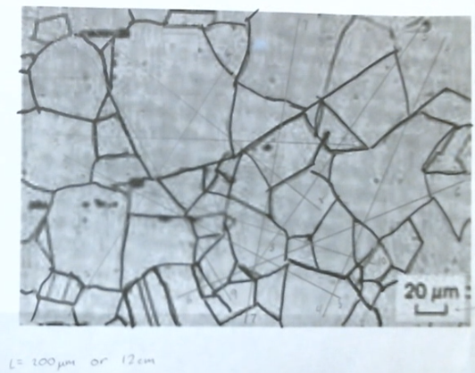
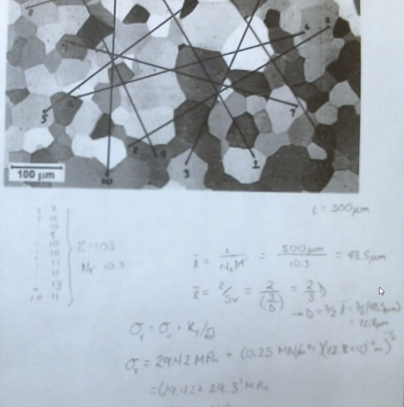
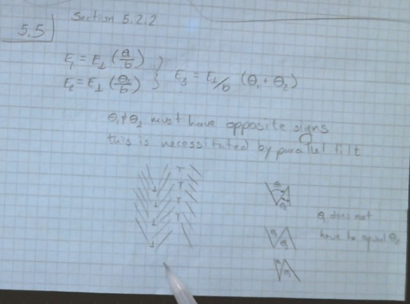

# ENGR 839-001: Mechanical Metallurgy
Table of Contents
- [ENGR 839-001: Mechanical Metallurgy](#engr-839-001-mechanical-metallurgy)
  - [Materials: Structure, Properties, and Performance](#materials-structure-properties-and-performance)
  - [Elasticity](#elasticity)
  - [Exam Review](#exam-review)
  - [Plasticity](#plasticity)
  - [Defects](#defects)
  - [Deformation and Work Hardening](#deformation-and-work-hardening)
  - [Solution and Second-Phase Strengthening](#solution-and-second-phase-strengthening)
  - [Martensitic Transformation](#martensitic-transformation)
  - [Intermetallics](#intermetallics)
  - [Porous Materials](#porous-materials)
  - [Corrosion](#corrosion)

---

*Lecture: August 23, 2021*
## Materials: Structure, Properties, and Performance
[[materials-structure-properties-and-performance]]

---

*Lecture: September 01, 2021*
## Elasticity
[[engr-839-001-mechanical-metallurgy/elasticity]]

---

*Lecture: September 09, 2021*
## Exam Review
**Miller Indices** When drawing Miller indices--coordinates, vectors, and planes--keep to Fig. @fig-milled_index_axis convention.
This makes grading quicker, because a different orientation is not necessarily wrong but are harder to grade.

|  |
|:--:|
| Keep cubes with z-vertical and #hcp with c-vertical. |

#apf will be used in the exam (per the provided table from earlier lectures).
**The content of the homework is the template for the exam: no new content on exams.**
WRT to calculating unit cell mass, follow this algorithm example for iron (Fe):
$$\begin{split}
\rho &= \frac{nA}{V_{c}N_{A}}
\end{split} \\
\begin{split}
\rho_{Fe} &= (55 amu) (\frac{g}{mol}/1 amu) / (N_{A}) \\
\rho_{Fe} &= 3.053e-22 g/atom \\
\rho_{Fe, {\#bcc}} &= \rho_{Fe}*2/a_{0}^{3}
\end{split}$$

**Tensorial vs. Engineering Strain**

|  |
|:--:|
| Engineering strain keeps deformation in one axis. Actual strain is half that, but in two axes. |

Because we know the relation, $\epsilon_{ij} = \frac{\gamma_{ij}}{2}$, we know $G = \frac{\tau}{\gamma} = \frac{E}{2(1 + \nu)}$.
We can then know the deformation on some axis: e.g. $\gamma_{12} = \frac{\sigma_{12}}{G} = -37.1e-6$.
But tensor notation for shear strain, $\gamma_{shear} = \frac{\gamma_{calc}}{2}$.

**Calculating Strains from Poisson's Ratio** Because the compression test is performed in a single axis to squish some specimen, the other lateral strains can be calculated by assuming [plane stress](engr-727-001-advanced-mechanics-of-materials/plane-stress.md): zero stress in the direction normal to the thinnest dimension.

[[pure-shear]] occurs when $\sigma_{22} = -\sigma_{11}$.
The shear stress, $\tau$ is the radius of [[Mohrs-Circle]].
The principal stress are the maximum and minimum of [[Mohrs-Circle]].
A stress tensor is the sum of the [[hydrostatic-stress]] and [[deviatoric-stress]] tensors: $[\sigma] = [\sigma_{hydro}] + [\sigma_{dev}]$, where [[hydrostatic-stress]], $\sigma_{hydro} = \frac{\sigma_{11} + \sigma_{22} + \sigma_{33}}{3}$ goes on the diagonal of the tensor and will cause a change volume, but not the object's shape.
[[deviatoric-stress]]: (elements not on the diagonal) will change an object's shape, but not its volume.

|  |
|:--:|
| Remember that maximum shear on [[Mohrs-Circle]], at $90\degree$, is twice the angle in real space: i.e. [[pure-shear]] occurs $45\degree$ of the actual part. |

---

*Lecture: September 13, 2021*
## Plasticity
[[plasticity]]

## Defects
[[defects]]

!!! attention Critical Review Topic
    ==Due October 15==.
    Be thinking of a topic related to this material, which also correlates to your own research.*

---

*Lecture: October 04, 2021*

!!! summary Exam Review
    One-page formula sheet is permissible.
    Not looking for describing characterizing [[dislocation-motion]], but more so on the equations.
    Will also not focus on drawing [[edge-dislocations]] nor [[screw-dislocations]].
    If there is dislocation interaction of forces, then what is the [[burgers-vector]]? Refer to [[jog]] and [[kink]] concepts.
    If presented with labelled stress-strain curve, what are the different parts? Refer to Fig. @fig-stress_
    What is with the hardening equations for the subscripts? [[Ludwik-Hollomann]] equation (Eq. \eqref{eq:ludwik_hollomann}) has no $\sigma_{0}$. Just focus on this one equation: true uniform strain is [[work-hardening]] exponent, n, which occurs at the engineering #ultimate-tensile-strength (when the curve comes back down, which is aka [[Considere-Criterion]]).
    Know #FRS and its equations, which will likely come from the homeworks.
    Nothing foreign from the homework.
    #bcc more sensitive to temperature, because [[dislocation-motion]] aided by temperature.: double-kink nucleation easier to move slip systems with higher energies.
    How do vacancies affect electronegativity?
    Defects reduce electrical conductivity, but effects are negligible.
    Participants are electron sharing reduce with more inhibiting imperfections.

    |  |
    |:--:|
    | Gold-Schmidt radius related to coordination number and atomic radius; therefore, [[burgers-vector]] is twice that to move from atomic position to the next (p. 287). |

    *Bowing of dislocations will also be in exam.*

    |  |  |
    |:--:|:--:|
    | Favorable to nucleate more dislocations in crystal, because energy required of dislocation to move material infinitely increases with radius of material. | Energetically favorable if magnitude of vector addition of dislocations greater then or equal to that ask. Energy comparison is $\vec{b}^{2}$ (p. 292). $\ref{fig:homework_question_on_energetically_favorable_solution}$ |

    #bcc does not generate partial dislocations, because of high #SFE.

!!! info
    For the *Critical Review* concept, perform the review over something practical with **5** of any of the listed topics. Be as specific as possible.

---

*Lecture: October 11, 2021*

!!! summary Exam Answer Key
    1. True stress-strain moves tension up-left and compression moves down-right.
    2. Necking is not uniform, but local, plastic strain.
    3. Only engineering decreases for increasing strain.
    4. [[Ludwik-Hollomann]] uses true stress-strain; therefore, the engineering stress-strain must be converted to true and that is the exponent. Then find the stress at the highest point of the engineering stress-strain curve in the true stress-strain regime and convert back to engineering.
    5. The "friction hill" is highest at the center of the specimen, which tapers off towards the edges. Can mitigate this with lubricant or ring.
    6. Load and indenter type are only parameters of Rockwell testing.
    7. Order of magnitude too large.
    8. $\gamma = \frac{G\vec{b}^{2}}{2\pi d}$. Solve for d.
    9. Use radius, not pinning distance.
    10. Simply use the information from (9) and plug into (10).
    11. 
    12. Normal stresses and $\tau_{12}$ are 0; therefore, no volume changing.

!!! question Concerning the *Critical Review* assignment, do you want the article we want to review? <cite> Julian
    Share the article and outline what you will discuss. *Mechanical Testing* can include nano-indentation, hardness, etcetera. Explain enough of the material that you show comprehension of the subject matter.

---

*Lecture: October 20, 2021*
## Deformation and Work Hardening
[[deformation-and-work-hardening]]

---

*Lecture: October 29, 2021*
## Solution and Second-Phase Strengthening
[[solution-and-second-phase-strengthening]]

---

*Lecture: November 01, 2021*

!!! summary Homework Overview
    |  |
    |:--:|
    | $L = 200 \mu m = 12cm$ comes out to exactly 600 magnification. Recall that $\bar{l} = \frac{L}{N_{l}M}$, where $M$ is scale ratio of the depicted scalebar to its physical length and length of drawn lines. **Remember to multiply by $\frac{3}{2}$ to get the grain size!** |
    |  |
    |:--:|
    | Looking at Table 5.3 does not give AISI 304 Stainless Steel properties. Refer to Fig. 5.23 for slopes of annealed and work-hardened AISI 304 to solve the [[Hall-Petch-Equation]]. |
    **When speaking on ASTM grain number, look to Example 5.1! $N = 2^{n - 1}$.**
    |  |
    |:--:|
    | Think of planes that are equal, but of opposite signs. Hint: $\ln(\theta_{1}\theta_{2}) = \ln(\theta_{1}) + \ln(\theta{2}) < \ln(\theta_{1} + \theta_{2})$ |

!!! summary Exam Review
    - Lecture 16 (Grain-boundaries)-23 (asdf)
    - Dr. Atwater is not concerned with work equations. Recall the difference between [[tilt-boundary]] and twist dislocations and their dislocation spacing: $D \approx \frac{\burgers}{\theta}$.
    - [[Schmid-Factor]] would also be included (Eq. \eqref{eq:schmid_factor}).
    - Know the generics about stereographic triangles: e.g. knowing which [[slip-system]] is active. Remember that the lens, triangle, and square connote the number of symmetric axes wrt the projection. **There will be drawing of stereographic projections! Only know the basics.** Use $\cos(\theta) = \frac{h_{1}h_{2} + \dots}$ to find the angle between slip-systems.
    - Taylor Hardening, Schmid Factor, pretty much anything from the slides and math from the homeworks. **Eq. 6.5** for dislocation density.

---

*Lecture: November 08, 2021*

!!!  summary Exam Answers
    1. The goal was supposed to be simple...however, the trick was to multiply by $\frac{3}{2}$. If wrong number used in next problem, minimal points lost.
    2. Energy increases with angle with more dislocations and more energy; however, modeled as surface tension for higher angles. The energy drops because coincident lattice sites boundaries are more coherent. $\Sigma$ values are indicative of the coincident lattice sites. $\Sigma3$ is a twin boundary and completely coherent.
    3. A mirror.
    4. Low temperature and high strain rate.
    5. Orowan hardening: twin boundaries block slip and glide.
    6. Simply use the table values: $\sigma_{y} \approx 806 MPa$, $\sigma_{y, twin} \approx 1763 MPa$.
    7. $\tau \approx 597.2 MPa$. Only getting the number really mattered and showed tracking of units.
    8. As long as processed was followed (if wrong number from previous problem), then all was fine; however, Hall-Petch stress was the resolved shear stress: did not need to bring in dislocation density or anything like that.
    Bonus. <100>, <110>, <111> and 4 slip systems at <110>.

    The overall average was $\sim 92$.

## Martensitic Transformation
[[martensitic-transformation]]

---

*Lecture: November 19, 2021*
## Intermetallics
[[intermetallics]]

---

*Lecture: November 29, 2021*

!!! note Critical Review Presentation
    Discuss what the paper topic was and what your main takeaway from the paper was.
    You can go into one of your 5 topics.

!!! attention Final Exam
    Not cummulative, but from the previous exam...

## Porous Materials
[[porous-materials]]

---

*Lecture: December 01, 2021*
## Corrosion
[[corrosion]]