<!-- output:
  pdf_document:
    latex_engine: xelatex
    includes:
      in_header: "C:/Users/jmanthony1/Documents/GitHub/JobyAnthonyIII/LaTeX/preamble.tex"
bibliography: "biblio.bib"
link-citations: true -->
<!-- %%%%%%%% Document Metadata %%%%%%%% -->
# ENGR 839-001: Mechanical Metallurgy

- [ENGR 839-001: Mechanical Metallurgy](#engr-839-001-mechanical-metallurgy)
	- [Materials: Structure, Properties, and Performance](#materials-structure-properties-and-performance)
		- [Introduction](#introduction)
		- [Review](#review)
		- [Metallic Crystal Structure](#metallic-crystal-structure)
			- [Energy and Packing](#energy-and-packing)
			- [Crystalline (Periodic) Structure](#crystalline-periodic-structure)
		- [Density Comparison of Materials](#density-comparison-of-materials)
			- [Polycrystalline Materials](#polycrystalline-materials)
			- [Anistropy](#anistropy)
			- [Istropy](#istropy)
			- [Miller Indices](#miller-indices)
				- [1) Point coordinates Algorithm](#1-point-coordinates-algorithm)
				- [2) Crystallographic Directions Algorithm](#2-crystallographic-directions-algorithm)
				- [3) Crystallographic Planes Algorithm](#3-crystallographic-planes-algorithm)
			- [Crystal Structure and Deformation](#crystal-structure-and-deformation)
			- [[[slip-systems]] ([[fcc]])](#slip-systems-fcc)
			- [Polycrystalline Slip](#polycrystalline-slip)
		- [Summary](#summary)
	- [Elasticity](#elasticity)
		- [Introduction](#introduction-1)
		- [Elastic](#elastic)
			- [Stress](#stress)
			- [Strain](#strain)
			- [Engineering vs True Stress](#engineering-vs-true-stress)
			- [Notation!](#notation)
			- [Strain Energy](#strain-energy)
			- [Shear/Torsion](#sheartorsion)
			- [Poisson's Ratio](#poissons-ratio)
			- [Summary](#summary-1)
		- [Elasticity: Polycrystalline Materials and Bulk Metals](#elasticity-polycrystalline-materials-and-bulk-metals)
			- [Introduction](#introduction-2)
			- [Stress Tensor Revisited](#stress-tensor-revisited)
			- [Hooke's Law Revisited](#hookes-law-revisited)
			- [Simplifications](#simplifications)
			- [[[Mohrs-Circle]] Revisited](#mohrs-circle-revisited)
		- [[[pure-shear]]](#pure-shear)
		- [Elasticity: Atomic Bonds](#elasticity-atomic-bonds)
			- [Introduction](#introduction-3)
			- [Atomic Bonding](#atomic-bonding)
			- [Bond Interaction and Force](#bond-interaction-and-force)
			- [Stress and Strain in Bonds](#stress-and-strain-in-bonds)
			- [Summary](#summary-2)
	- [Exam Review](#exam-review)
	- [Plasticity](#plasticity)
		- [Introduction](#introduction-4)
			- [Engineering and true stress and strain](#engineering-and-true-stress-and-strain)
			- [Work-Hardening Basics](#work-hardening-basics)
			- [Summary](#summary-3)
		- [Tensile Curve Parameters, Necking, and Strain Rate](#tensile-curve-parameters-necking-and-strain-rate)
			- [Introduction](#introduction-5)
			- [Necking](#necking)
			- [Stress-strain and Necking](#stress-strain-and-necking)
				- [Bridgman Correction](#bridgman-correction)
				- [State of Stress in Deformation](#state-of-stress-in-deformation)
			- [Strain Rate](#strain-rate)
			- [Summary](#summary-4)
		- [Compression and Hardness](#compression-and-hardness)
			- [Introduction](#introduction-6)
			- [Practical Considerations](#practical-considerations)
			- [Compression Curve](#compression-curve)
			- [Compression Failure](#compression-failure)
			- [[[Bauschinger-Effect]]](#bauschinger-effect)
			- [Hardness Testing](#hardness-testing)
			- [Hardness-Yield Relationship](#hardness-yield-relationship)
			- [Micro-Indentation Testing](#micro-indentation-testing)
			- [Nano-Indentation Testing](#nano-indentation-testing)
		- [Summary](#summary-5)
	- [Defects](#defects)
		- [Introduction](#introduction-7)
		- [Theoretical Shear Strength](#theoretical-shear-strength)
		- [Point Defects](#point-defects)
			- [Interstitial Defects](#interstitial-defects)
				- [[[fcc]] sites](#fcc-sites)
				- [[[bcc]] sites](#bcc-sites)
				- [[[hcp]] sites](#hcp-sites)
			- [Equilibrium Concentration](#equilibrium-concentration)
			- [Vacancy or Self-Interstitial?](#vacancy-or-self-interstitial)
			- [Equilibrium Concentration](#equilibrium-concentration-1)
			- [Vacancy Formation](#vacancy-formation)
			- [Effect on Mechanical Properties](#effect-on-mechanical-properties)
			- [Summary](#summary-6)
		- [Line Defects](#line-defects)
		- [Types of Dislocations](#types-of-dislocations)
			- [Edge and Screw Character](#edge-and-screw-character)
			- [dislocation-motion](#dislocation-motion)
			- [Bubble Rafts](#bubble-rafts)
			- [Dislocation Confirmation](#dislocation-confirmation)
			- [Dislocation Looping](#dislocation-looping)
			- [Prismatic Loops](#prismatic-loops)
			- [Loop Expansion](#loop-expansion)
			- [Stress Around Dislocations](#stress-around-dislocations)
			- [Stress Equations for Screw Dislocation](#stress-equations-for-screw-dislocation)
			- [Stress Equations for Edge Dislocation](#stress-equations-for-edge-dislocation)
		- [Summary](#summary-7)
		- [Imperfections: Dislocation Energy and Bowing](#imperfections-dislocation-energy-and-bowing)
			- [Energy Around A Dislocation](#energy-around-a-dislocation)
			- [Deformation Energy](#deformation-energy)
			- [Screw Versus Edge Dislocation Energy](#screw-versus-edge-dislocation-energy)
			- [Dislocation Density](#dislocation-density)
			- [Dislocation Bowing](#dislocation-bowing)
			- [Peach-Koehler Equation](#peach-koehler-equation)
		- [Partial Dislocations](#partial-dislocations)
			- [Introduction](#introduction-8)
			- [Real Dislocations](#real-dislocations)
			- [Partial Dislocations in Close-Packed Planes](#partial-dislocations-in-close-packed-planes)
			- [Visualizing fcc Partial Dislocations](#visualizing-fcc-partial-dislocations)
			- [Determining the Partial Direction and Magnitude](#determining-the-partial-direction-and-magnitude)
			- [Decomposition of $\vec{b}_{1}$](#decomposition-of-vecb_1)
			- [Partial Dislocation Energy](#partial-dislocation-energy)
			- [Stacking Faults](#stacking-faults)
			- [Sessile Dislocations](#sessile-dislocations)
			- [Lomer-Cotrell Locks](#lomer-cotrell-locks)
			- [HCP Dislocations](#hcp-dislocations)
			- [BCC Dislocations](#bcc-dislocations)
			- [Summary](#summary-8)
				- [Dislocation density, homogeneous nucleation](#dislocation-density-homogeneous-nucleation)
			- [Dislocation Sources](#dislocation-sources)
			- [Frank-Read Source](#frank-read-source)
			- [Cross-Slip and Dislocation Multiplication](#cross-slip-and-dislocation-multiplication)
			- [Dislocation Pileup](#dislocation-pileup)
			- [Summary](#summary-9)
<!-- %%%%%%%%%%%%%%%%%%%%%%%%%%%%%% -->

<!-- START WRITING BELOW -->

<!-- %%%%%%%%%%%%%%%%%%%%%%%%%%%%%% -->
*Lecture: August 23, 2021*
## Materials: Structure, Properties, and Performance
### Introduction
**Objectives** The course content will enable students to set and meet expectations.
All of this material, in its content and instruction, are new: so, leave room for error.
Be inspired to tackle whatever comes our way.

| 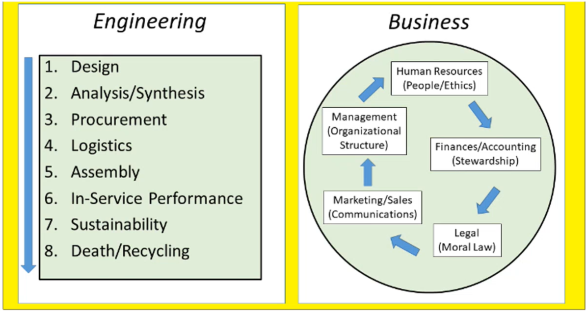 |
|:--:|
| Creationeering diagram. #fig-creationeering_diagram |

|  |
|:--:|
| Cross-shaped Liberty University Creationeer. #fig-creationeering_t_diagram |

**Definitions**
This class will make more familiar the "chemistry-process-structure" portion of the *chemistry-process-structure-property-performance*" ([[CPSPP]]) relationship.
LU seeks to apply these engineering disciplines into entrepreneurship.
**Mechanical**: force response of materials, which includes the underlying principles/effects of microstructure.
**Metallurgy**: microstructural transformations dictated by composition/processing that is the foundation.
**Mechanical Metallurgy**, as a course, studies not *how* materials behave, by *why* they behave a certain way.

**Syllabus:** Homeworks due only before the relevant exams, and graded for the good ol' college try.
If you can do the homeworks, then you can do the tests.
**Final Exam is cummulative.**
Critical Review: "Reverse engineer" an article and explain it with additional comments or inferences.
The accompanying presentation should explain the takeaway from the application articles/comments.

### Review
**[[CPSPP]]:** Relationship for how some chemical composition (e.g: FeC) is processed to produce some structure, which has some property that allows some performance.

|  |
|:--:|
| Iron-Carbon phase diagram. #fig-iron_carbon_phase_diagram |

|  |
|:--:|
| Microstructures in FeC phase diagram. [[phase-diagrams]] pack a lot of information for CPS of CPSPP sequence. Lines denote what structure is found after some process with some chemical composition. *Lever Rule*: ratio of phases proportional to weight percent distance to other phases. #fig-fec_with_microstructure |

|  |
|:--:|
| Crystallographic examples. #fig-crystallographic_types |

>**Crystallographic Types:** simple cubic, face-center cubic ([[fcc]]), body-center cubic ([[bcc]]), hexagonal close-packed ([[hcp]]).
The atomic packing factor, [[apf]], the ratio lattice that is filled, increases down this list.
 [[fcc]] and [[hcp]] are similar, but [[hcp]] is more brittle.

|  |
|:--:|
| Copper phase diagram. #fig-precipitation_hardening |

|  |
|:--:|
| The angle at which one stuffs at burger into his face. #fig-bergers_vector |

>**[[bergers-vector]], $\vec{b}$:** lattice displacement by a dislocation;  vector of dislocation; location, magnitude, and direction of influence on lattice.
Can weaken metals when many dislocations exist.

---

*Lecture: August 25, 2021*

| 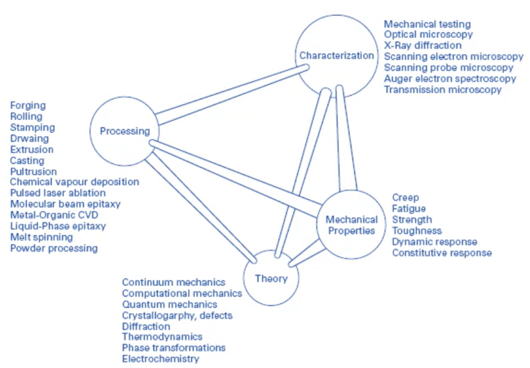 |
|:--:|
| Pictographic way to visual CPSPP relationship according to processing techniques. #fig-thomas_tetrahedron |

>**[[CPSPP]] Example:** includes low-carbon steel; high-carbon steel; and, cast iron.
All same chemistry with different composition ratios and examples of different processing techniques applied/able.

|  |
|:--:|
| Common steels in automotive applications. #fig-cpspp_example |

**Monolithic** Previously explained homogeneous or isotropic, but depends on length scale.
Here, means the same crystal structure throughout: e.g. pearlite.

| 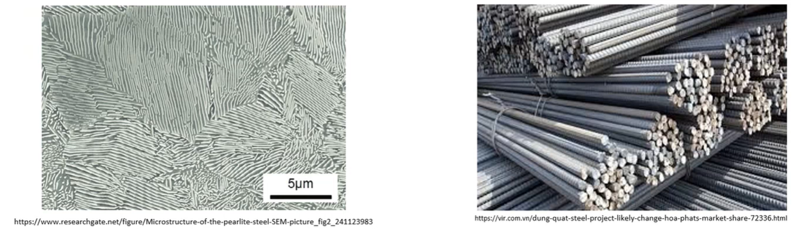 |
|:--:|
| Phase diagram for FeC with microstructure. #fig-pearlite_in_iron |

**Materials Design** Exposed to variety of conditions, but can be designed to suit.
More complex designs may have better performance.
Composites have "rules-of-mixtures" to balance performance.
Hierarchical materials vary structure/composition to enhance functional/structural properties at different length scales.

**Our Focus:** not on manufacturing techniques: e.g. ENGR 835.
Will consider how manufacturing variables affect structure.
We will move up length up from atomistics.

### Metallic Crystal Structure
#### Energy and Packing
|  | 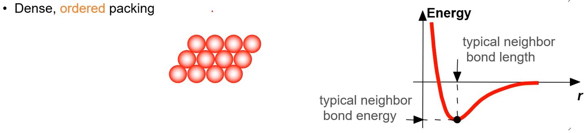 |
|:--:|:--:|
| Non-dense, random packing. #fig-nondense_interatomic_potential_curve | Dense, ordered packing. #fig-dense_interatomic_potential_curve |

Ordered structures tend to be nearer the minimum bonding energy and are more stable.

**Atomic Packing** Dense crystal structures for metals.
Reasons for dense packing: *1)* bonds between metal atoms are non-directional; *2)* nearest neighbor distances tend to be small in order to lower bond energy; *3)* high degree of shielding (of ion cores) provided by free electron cloud; and, *4)* crystal structures for metals simpler than structures for ceramics and polymers.

#### Crystalline (Periodic) Structure
| 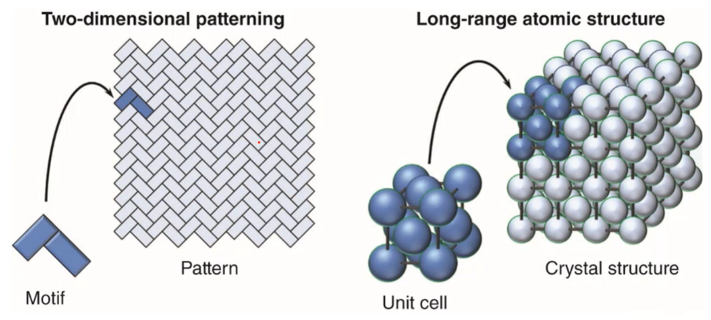 |
|:--:|
| Crystalline (Periodic) Structure. #fig-crystalline_structure_example |

|  | 
|:--:|
| Simple Cubic ([[sc]]) Crystal Structure: centers of atoms at corners and close packed along edges. #fig-simple_cubic_structure |

|  |
|:--:|
| Body-Centered Cubic ([[bcc]]) Structure: atoms located at 8 cube corners with a single atom at cube center. #fig-body_centered_cubic |

|  |
|:--:|
| Face-Centered Cubic ([[fcc]]) Structure: atoms located at 8 cube corners with half atoms at center of 6 cube faces. #fig-face_centered_cubic |

|  |
|:--:|
| Hexagonal Close-Packed ([[hcp]]) Structure: only B or C positions can be filled in a single layer. #fig-fcc_hcp_packing_sequence |

|  |
|:--:|
| Interces in each layer can be filled only according to some pattern: "A" or "B". #fig-hexagonal_close_packed_structure |

**Structure** | **Coor. #** | **$\frac{atoms}{cell}$** | **[[apf]]** | **[[slip-planes]]** | **[[slip-systems]]**
|:-:|:-:|:-:|:-:|:-:|:-:|
[[sc]] | 6 | 1
[[bcc]] | 8 | 2 | 0.68 | 3 | 48
[[fcc]] | 12 | 4 | 0.74 | 1 | 12
[[hcp]] | 12 | 6 | 0.74 | 3 | 12

---

*Lecture: August 27, 2021*

### Density Comparison of Materials
|  |
|:--:|
| #fig-density_comparison_of_materials |

#### Polycrystalline Materials
|  |
|:--:|
| Higher cooling rates at edges make for smaller grains; whereas, slower cooling rate at center make for larger, directionally aligned grains. #fig-polycrystalline_example |

*Most* engineering materials are composed of many, small single crystals.
Each "grain" is a single crystal.
Grain sizes typically range from 1 nm to 2 cm.
Smaller grains usually mean higher strength and lower ductility.

|  |
|:--:|
| Same crystal type that repeat in different orientations. #fig-unit_cell_orientation_in_polycrystal |

#### Anistropy
|  |
|:--:|
| Unit cell of [[bcc]] ($\alpha$) iron. #fig-anistropy_example |

[[anistropy]]: A property value that depends on crystallographic direction of measurement.
Properties depend on direction loading, because of linear density along that direction.
Best observed in single crystals.
The higher linear density means higher stiffness, usually.

#### Istropy

|  |
|:--:|
| Randomly oriented versus textured grains. #fig-isotropy_comparisons |

**Polycrystals:** properties may (not) vary with direction.
If grains randomly oriented, properties are [[isotropic]]: independent of loading direction.
If grains, "textured"--crystallographic orientation--properties are [[anistropic]]: dependent on loading direction.

#### Miller Indices
A method of assigning coordinate values to crystallographic lattice sites.
Used to identify specific points, directions, and planes or families of these.
Used to identify crystallographic information.
Three ways to identify:

##### 1) Point coordinates Algorithm

>**NOTE** A lattice position with a unit cell and determined as fractional multiples of unit cell edge lengths.

|  |  |
|:--:|:--:|
| Determined as fractional multiples of unit cell edge lengths. #fig-point_coordinates_example | #fig-point_coordinate_example_with_annotations |

1. Lattice position is a, b, c.
2. Divide by unit cell edge lengths and remove commas: $\frac{a}{a}\frac{b}{b}\frac{c}{c} = 111$

##### 2) Crystallographic Directions Algorithm

|  |
|:--:|
| #fig-crystallographic_example |

>**NOTE** Remember from calculus the $tip - tail$ method to find vector direction and length.

1. Determine coordinates of vector head and tail: $(x_{2}, y_{2}, z_{2})$ and $(x_{1}, y_{1}, z_{1})$, respectively.
2. Subtract tail coordinates from head coordinates.
3. Normalize this subtraction by lattice parameters of unit cell edge length: $\frac{x_{2} - x_{1}}{a}\frac{y_{2} - y_{1}}{b}\frac{z_{2} - z_{1}}{c}$.
4. Multiply to smallest integer values.
5. Enclose in square brackets with no commas: `[uvw]`.

>**NOTE** Negative indices represented with overbars: $-4, 1, 2 \implies [\bar{4}12]$
A *[[family-of-directions]]* are crystallographically equivalent (same atomic spacing) and indicated by angle brackets, `<>`.

| 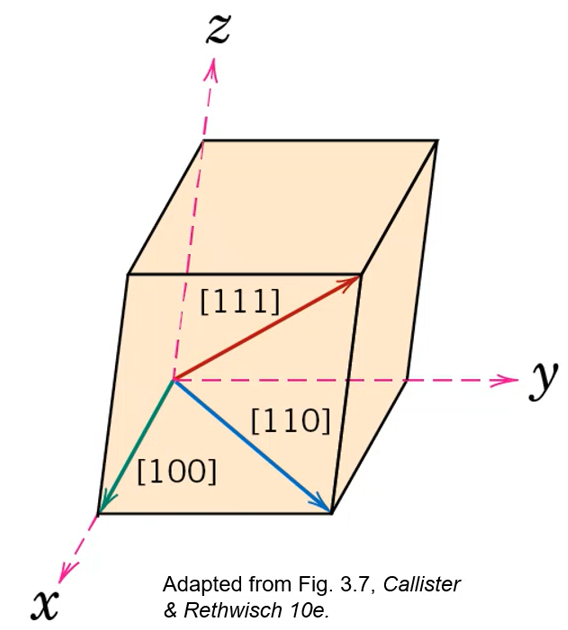 |
|:--:|
| Common crystallographic directions. #fig-common_cystallographic_directions |

##### 3) Crystallographic Planes Algorithm
1. If plane passes through origin, establish a new origin in another unit cell.
2. Read off values of intercepts of plane (designated $A, B, C$) with $x, y, z$ axes in terms of $a, b, c$.
3. Take reciprocals of intercepts.
4. Normalize reciprocals by multiplying lattice parameters $a, b, c$.
5. Reduce to smallest integer values.
6. Enclose resulting indices in parentheses without commas: i.e. `(hkl)`.

|  |
|:--:|
| Resulting Miller Indices: (110). #fig-crystallographic_planes_example_1 |

| 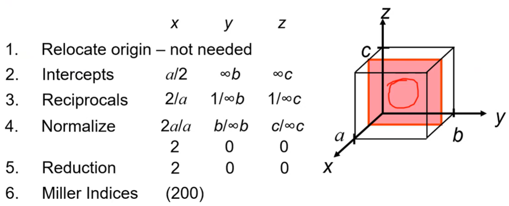 |
|:--:|
| Resulting Miller Indices: (200). #fig-crystallographic_planes_example_2 |

>**NOTE** A #family-of-planes cannot be reduced any simpler than LCM. Family may be parallel to other families and planar densities may be equivalent, but linear density will vary.

|  |
|:--:|
| Pay attention to origin! #fig-plane_families |

|  |
|:--:|
| Resulting Miller Indices: (634). #fig-crystallographic_plane_example_3 |

>**NOTE** A *[[family-of-planes]]* are crystallographically equivalent (same [[apf]]) and are indicated by indices in braces, `{}`.

---

*Lecture: August 30, 2021*

>**EXAMPLE** For [[hcp]], determine intercepts with $a_{1}, a_{2}$ and $z$ axes, then determine the Miller-Bravais indices $h, k, i, l$.

|  |
|:--:|
| Resulting Miller Indices: $(10\bar{1}1)$. #fig-crystallographic_planes_example_4 |

|  |
|:--:|
| Projections are parallel to edge. #fig-dk_question_of_hcp_projection |

|  |
|:--:|
| *Planar Density ([[PD]]) of Atoms*, $PD = \frac{\#~of~atoms~centered~on~plane}{area~of~plane}$. #fig-planar_density_example |

#### Crystal Structure and Deformation
Planar density determine [[slip-planes]]: the more dense, the easier to move.
Unit cell represents single crystal, but the behavior of that structure is not equivalent in all directions.
Permanently deforming materials requires that atoms must shift over one another: *[[slip-planes]]*.
Closely packed (high [[apf]]) do not have to move as much to get by one another.
Not all [[slip-directions]]...
 [[fcc]] materials are generally ductile, because of few [[slip-systems]] and one  [[slip-plane]].
Not many preferred directions to slip and few preferred: e.g. 48 spoons to cut a steak does not equal cutting with a knife.
More of a bad thing does not outweigh few good things.
Coordination number is the number of nearest neighboring atoms.

#### [[slip-systems]] ([[fcc]])

|  |
|:--:|
| #fig-fcc_slip_system |

**Slip system is ${111}<110>$**
 [[dislocation-motion]] on ${111}$ planes.
 [[dislocation-motion]] in $<110>$ directions.
12 independent [[slip-systems]] for [[fcc]].

| 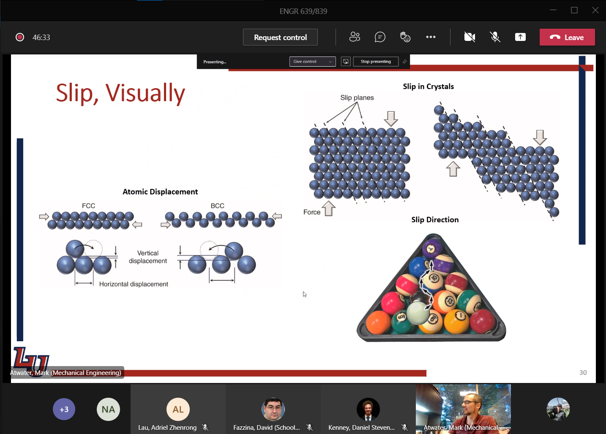 |
|:--:|
| More force over more distance = more work to move [[bcc]] than [[fcc]], which requires less distance because closely packed (dense). #fig-visual_example_of_slip |

#### Polycrystalline Slip
Many grains, often with random crystallographic directions.
Orientation of [[slip-planes]] and [[slip-directions]], $(\phi, \lambda)$ vary from grain to grain.
On application of stress, slip in each grain on most favorable slip system.
With largest $T_{R}$.
When $T_{R} > T_{crss}$.

|  |
|:--:|
| #fig-example_of_polycrystal_slip |

|  |
|:--:|
| Edge of indent shows texture from [[slip-planes]] from moving atoms out of the way of impact. Accumulates with amount of deformation applied. #fig-impact_deformed_monel |

### Summary
Important to have common understanding of vocabulary to describe crystal structure. We focus on *[[bcc]]*, *[[fcc]]*, and *[[hcp]]* structures.
Miller indices give exact orientation or active atoms/planes to determine the associated properties.
The [[apf]] is import to density and [[slip-systems]], but it is not the only critical property.

---

*Lecture: September 01, 2021*

## Elasticity
### Introduction
Stresses occur at varying scales within a material.
Macro-stresses include component design and assemblage.
Micro-stresses are found within the material and include those from defects: dislocations, alloying elements. etcetera.
Stresses at smallest scale act cumulatively to produce the response to the largest scale.
This all relates to the **[[CPSPP]]** relationship.

### Elastic
- Reverse deformation, that instantaneously recovers to its original dimensions after force is removed.
- Analogous to a spring, the relationship was conveniently described by Robert Hooke: $F = k\delta x$

#### Stress
- Stress is the result of applied force and response of material to balance external force.
	- Area resisting force is perpendicular to applied force line of action.
	- Material response is determined by atomic bonds and orientation relative to crystal lattice.
	- >**NOTE** Polycrystalline materials assumed [[anisotropic]].
	- Component response dictated by design and material properties.
	- Tensile stress often positive in sign and compression is negative, by convention.

#### Strain
- Physical result of stress.
- Linear proportional to stress in Hookean material up to its elastic limit/yield stress.
- >**NOTE** [[proportional-limit]] is that when the stress-strain deviates from linear and yield stress is at the 0.02% strain offset.
- Metals often Hookean in nature and assumed until otherwise stated.
- True strain: $\epsilon = \frac{dl}{l}, \epsilon = \int_{l_{0}}^{l_{1}}\frac{dl}{l} = ln(\frac{l_{1}}{l_{0}})$ #eq-true_strain
- Engineering strain: $\epsilon = \frac{\delta l}{l}$ #eq-engineering_strain

#### Engineering vs True Stress
- Comes from initial conditions and easily measured.
- >**NOTE** Area does not change, so the initial area determines the stress throughout the entire deformation.
- True stress and strain are more accurate and use an instantaneous cross-section.
- In the elastic region for metals, deformation is typically small and engineering and true stress-strain values are comparable.
- $\sigma_{T} = \sigma(1 + \epsilon)$
- $\epsilon_{T} = ln(1 + \epsilon)$

|  |
|:--:|
| #fig-stress_strain_curve |

#### Notation!
Notation is not always the same.

$$\begin{bmatrix}
\sigma_{xx}, \tau_{xy}, \tau_{xz} \\
\tau_{yx}, \sigma_{yy}, \tau_{yz} \\
\tau_{zx}, \tau_{zy}, \sigma_{zz}
\end{bmatrix}\begin{bmatrix}
(x) \\
(y) \\
(z)
\end{bmatrix}\equiv\begin{bmatrix}
\sigma_{11}, \tau_{12}, \tau_{13} \\
\tau_{21}, \sigma_{22}, \tau_{23} \\
\tau_{31}, \tau_{32}, \sigma_{33}
\end{bmatrix}\begin{bmatrix}
(1) \\
(2) \\
(3)
\end{bmatrix}$$ #eq-tensor_notation

|  |
|:--:|
| #fig-tensor_notation |

#### Strain Energy
- Work done during deformation is converted to heat and internal energy.
- $W = Fd$, but $F$ is not constant!
- Elastic deformation does not typically produce much heat, so most is stored internally.
- $dU = dQ - dQ$
- $U = W$ (without heat)
- $W = \frac{1}{2}\sigma_{ij}\epsilon_{ij} = \frac{1}{2}E\epsilon_{ij}^{2} = \frac{1}{2E}\sigma_{ij}^{2}$

#### Shear/Torsion
- Shear and torsional stress are handled similarly, but vary by configuration.

|  |
|:--:|
| For a cylindrical punch, the average diameter of the punch and hole can be taken, and the area will be the circumference times the thickness of the material. #fig-shear_stress_example |

|  |
|:--:|
| For torsion of a rod, the stress and strain vary radially and axially. #fig-torsional_stress_example |

- $\tau = \frac{F}{A}$
- $\gamma = \frac{dl}{l} = tan\theta \cong \theta$
- $G = \frac{\tau}{\gamma}$

**Q&A** Why does $\gamma \cong \theta$?
Small angle assumptions in radians mean that $sin\theta = \theta$.

#### Poisson's Ratio
$\nu = -\frac{\epsilon_{11}}{\epsilon_{33}} = -\frac{\epsilon_{22}}{\epsilon_{33}}$ #eq-poisson_ratio

|  |
|:--:|
| #fig-poisson_ratio |

- Describes the consequent strains orthogonal to an applied stress.
- Most metals are 0.3.
- For constant volume without lateral contraction, the ratio is 0.5 (plastic only).

#### Summary
- Elasticity affects everything, because it is initial response to stress.
- Material behavior in elastic region dictates behavior in application.
- Components rarely useful in plastic region, so they will spend their lifetime in the elastic range.
- Although elastic properties are commonly discussed at a continuum scale, we will find it important to atomic scale phenomena.

---

*Lecture: September 03, 2021*

### Elasticity: Polycrystalline Materials and Bulk Metals
#### Introduction
- Stress may be applied in any arrangement, and we can determine the overall conditions of strain.
- This is often reduced to two dimensions, but it does not have to be (it is just simpler).
- We can determine the state of stress as a point in any orientation (not just aligned with the applied stress) by using transformation techniques.
- Certain orientations will result in only normal or shear stresses, which can be important for determining the resulting performance.

#### Stress Tensor Revisited

|  |
|:--:|
| #fig-cauchy_stress_tensor |

- Cuachy stress tensor describes the complete state of stress in three dimensions.
- Valid for small deformations (Eq. @eq-tensor_notation).

#### Hooke's Law Revisited
- Linear elastic response in homogeneous metals and alloys which allows us to relate stress and strain in three dimensions through the [[poisson-ratio]], $\nu$ @eq-poisson_ratio.

$$\begin{align*}
\epsilon_{11} &= \frac{1}{E}[\sigma_{11} - \nu(\sigma_{22} + \sigma_{33})] \\
\epsilon_{22} &= \frac{1}{E}[\sigma_{22} - \nu(\sigma_{11} + \sigma_{33})] \\
\epsilon_{33} &= \frac{1}{E}[\sigma_{33} - \nu(\sigma_{11} + \sigma_{22})] \\
\gamma_{12} &= \frac{\sigma_{12}}{G} \\
\gamma_{13} &= \frac{\sigma_{13}}{G} \\
\gamma_{23} &= \frac{\sigma_{23}}{G}
\end{align*}$$

>**Example 1:** For the following stress tensor, what are the resulting normal strains if $E = 10e3 kip$ and $\nu = 0.3$?
$\sigma = \begin{bmatrix}5, 3, 2 \\ 3, -1, 0 \\ 2, 0, 4\end{bmatrix}kip$
$$\epsilon_{normal} = \begin{bmatrix}\frac{1}{10e3 ksi}[5 ksi - 0.3(-1 + 4)ksi \\ \frac{1}{10e3 ksi}[1 ksi - 0.3(5 + 4)ksi \\ \frac{1}{10e3 ksi}[4 ksi - 0.3(5 + (-1))ksi\end{bmatrix}ksi = \begin{bmatrix}4.1e-4 \\ -3.7e-6 \\ 2.8e-6\end{bmatrix}$$

#### Simplifications
- To avoid complex tridimensional description of stress and strain, especially during plastic deformation, simplifications are possible.
	- [[plane-stress]]: strain and strain go to zero at free surface (normal and shear).
	- [[plane-strain]]: one dimension is considered infinite.
- Conditions of [[pure-shear]] can also be considered, such that no normal forces are present.

$$\begin{bmatrix}
\sigma_{xx}, \tau_{xy} \\
\tau_{yx}, \sigma_{yy}
\end{bmatrix}\begin{bmatrix}
(x) \\
(y)
\end{bmatrix}$$

$$\begin{bmatrix}
\epsilon_{xx}, \gamma_{xy} \\
\gamma_{yx}, \epsilon_{yy}
\end{bmatrix}\begin{bmatrix}
(x) \\
(y)
\end{bmatrix}$$

#### [[Mohrs-Circle]] Revisited
- A graphical way to represent stress transformation to alternative orientations.
- These are set of equations that describe stress transformation, but a graphical solution is often useful.

|  |
|:--:|
| #fig-mohrs_circle_illustration |

- Principal stress: maximum/minimum normal stresses (no shear)

|  |
|:--:|
| #fig-mohrs_circle_transformation_equation_illustration |

- $R = \sqrt{(\frac{\sigma_{11} + \sigma_{22}}{2})^{2} + \tau_{12}^{2}}$
- $\sigma_{11}' = \frac{\sigma_{11} + \sigma_{22}}{2} + \frac{\sigma_{11} - \sigma_{22}}{2}cos(2\theta) + \sigma_{12}sin(2\theta)$
- $\sigma_{12}' = -\frac{\sigma_{11} - \sigma_{22}}{2}sin(2\theta) + \sigma_{12}cos(2\theta)$

>**Example 1:** What is the stress state if rotated $30\text{\textdegree}$ CCW?
|  |
|:--:|
| #fig-mohrs_circle_example_problem_1 |
*Given: $\sigma_{11} = -8 ksi, \sigma_{22} = 12 ksi, \sigma_{12} = -6 ksi$*
Center point, $C = \sigma_{avg} = \frac{\sigma_{11} + \sigma_{22}}{2} = \frac{-8 + 12}{2} = 2 ksi$
|  |
|:--:|
| #fig-mohrs_circle_example_1_problem_step_t_find_r |
$R = \sqrt{10^{2} + 6^{2}} = 11.66$
|  |
|:--:|
| #fig-mohrs_cricle_example_1_problem_step_to_find_angle |
Use trig to find $\phi$ and $\psi$: $\phi = tan^{-1}(\frac{6}{10}) = 30.96\text{\textdegree}, \psi = 60 - \phi = 29.04\text{\textdegree}$
$\sigma_{11}' = 2 - 11.66cos(29.04) = -8.2 ksi$
$\sigma_{12}' = -11.66sin(29.04) = 5.66 ksi$

|  |
|:--:|
| Slight drop increase of normal stress and slight decrease of shear stress. #fig-mohrs_circle_example_1_complete |

|  |
|:--:|
| Basic steps to find all stresses and strains at orientations relative to what you start with. #fig-mohrs_circle_example_1_clean |

---

*Lecture: September 06, 2021*

### [[pure-shear]]
There exists a condition which has only shear stresses and no normal stress. This condition is called *[[pure-shear]]*, which means that $\sigma_{11} = -\sigma_{22}$. This implies that [[Mohrs-Circle]] is centered at the origin, because $\sigma_{avg} = 0$. Graphically, the maximum shear stress possible in this condition is the radius of [[Mohrs-Circle]] and at $90\text{\textdegree}$ from the horizontal. However, recall that angles in [[Mohrs-Circle]] are twice real angles: e.g. if $\theta_{Mohr} = 2*\theta_{real}$ and $\theta_{Mohr} = \text{\textdegree}90$, then $\theta_{real} = 45\text{\textdegree}$.

|  |
|:--:|
| If a component experiences compression in one axis and tension in a perpendicular axis, then elements within the component experience [[pure-shear]]. #fig-pure_shear_depicted |

Using knowledge of this condition, we can find stress and strain information with the following relations:

$$\begin{align*}
\epsilon_{11} &= \frac{1}{E}(\sigma_{1} - \nu\sigma_{2}) = \frac{\sigma_{1}}{E}(1 + \nu) \\
\tau &= -\sigma_{1} (on~circle,~with~sign~convention) \\
\tau &= G\gamma \\
\epsilon_{11} &= -\frac{G\gamma}{E}(1 + \nu) \\
2\epsilon_{11} &= -\gamma \\
G &= \frac{E}{2}(1 + \nu)
\end{align*}$$

"(on circle, with sign convention)" holds true because the radius, $R$ of [[Mohrs-Circle]] is $\sigma_{1} = - \sigma_{1}$. Some of these relationships are not limited to [[pure-shear]], because $E, G \text{and} \nu$ are material properties.

Expressing three-dimensional stress is important, but can be achieved with tensor notation.
Analysis of stress states can be reduced from three to two dimensions if assuming [[plane-stress]] (zero stress in third axis) or [[plane-strain]] (zero strain in third axis).
This simplified analysis can be transformed to desired stress states by equations or [[Mohrs-Circle]].
Recall that [[Mohrs-Circle]] is a graphical representation of all possible stress states, but it must be drawn accurately that trigonometric functions might be used effectively.

### Elasticity: Atomic Bonds
#### Introduction
What preceded was continuum elasticity.
What follows is observing the previously explored behaviors at the atomistic level.
These behaviors determine the way force, stress, and strain occur.
Characterizing these behaviors informs the results of bond strength in materials: we focus on metals.
There exist competing behaviors of attraction and repulsion.

Continuum looks and homogeneous units wherein stress states are described without knowing the exact material makeup.
Here, we can continue to ignore anisotropic conditions, but must observe the source of elasticity: atomic bonds.
Strength of bonds determined by electronic characteristics, but can be influenced by external conditions: heat, magnetic fields, etcetera.

|  |
|:--:|
| We assume only planar, uniaxial attractions. #fig-electronic_bonds_simplified |

#### Atomic Bonding
Electronic bonds govern behavior of all material properties. All mechanical behavior first exhibits elastic behavior.
These effects can be observed with a simple spring model between two atoms.

|  |
|:--:|
| Simplified spring model to visually show attractive and repulsive forces of electronic bonds between atoms. #fig-simple_spring_model |

#### Bond Interaction and Force
Two atoms will have an equilibrium separation, $r_{0}$. We assume this until some external influence is applied.
The minimum bonding energy also occurs here. Repulsion is caused by the *[[Pauli-Exclusion-Principle]]* and attraction is *[[Coulombic-forces]]* in nature.

$$U_{i} = -\frac{A}{r^{m}} + \frac{B}{R^{n}}$$ #eq-bonding_energy

|  |
|:--:|
| Electronic bonding occurs according to these two curves between any two atoms. #fig-interaction_energy_and_force |

>**Example**
Potential energy of $Na^{+}Cl^{-}$, an ionic pair, at distance $r$ where $q_{0} = 1.6e-19~[C]$, $\epsilon_{0} = 8.85e-12~[\frac{C}{N-m^{2}}]$, and $U_{i} = 1.12~[eV]$. If $r_{0} = 0.276~[nm]$, then find: **a)** the value of B; and **b)** the total, attractive, and repulsive forces at $r = 0.25 [nm]$.
$$\begin{align}
U_{i} &= -\frac{A}{r^{m}} + \frac{B}{r^{n}} \\
U &= U_{i} - \frac{q^{2}}{4\pi\epsilon_{0}r} + \frac{B}{r^{9}}
\end{align}$$
Because $\frac{dU}{dr} = 0$ at $r_{0}$,
$$\begin{align}
\frac{dU}{dr} &= 0 = \frac{q^{2}}{4\pi\epsilon_{0}r^{2}} - \frac{9B}{r_{0}^{10}} \\
\frac{q^{2}}{4\pi\epsilon_{0}r^{2}} &= \frac{9B}{r_{0}^{10}} \\
\implies B &= \frac{r_{0}^{8}q^{2}}{36\pi\epsilon_{0}}
\end{align} \\
\begin{align*}
B &= 8.61e-106 [N-m^{10}]
\end{align*}$$
$B$, then, is simply plugged into the following equations to find electronic bond forces at not the equilibrium distance, $r = 0.25 [nm]$.
$$\begin{align}
F &= \frac{dU}{dr} = F_{A} - F_{R} \\
F &= \frac{q^{2}}{4\pi\epsilon_{0}r^{2}} - \frac{9B}{r_{0}^{10}}
\end{align} \\
\begin{align*}
F_{A} &= \frac{q^{2}}{4\pi\epsilon_{0}r^{2}} = 3.68e-4 [N] \\
F_{B} &= \frac{9B}{r_{0}^{10}} = -8.13e-9 [N] \\
\implies F &= 4.44e-9 [N]
\end{align*}$$

#### Stress and Strain in Bonds
Force is proportional to atomic displacement and change in energy.
Stress requires number of atoms involved in some area by estimating atomic spacing at equilibrium, $r_{0}^{2}$.
Strain, then, is the change in spacing divided by the equilibrium spacing.
[[Youngs-modulus]] is a material property of stress over strain. These can be summarized by the following relations:

$$\begin{align}
F &= \frac{dU_{i}}{dr} \\
d\sigma &= NdF \\
d\sigma &= \frac{dF}{r_{0}^{2}} \\
d\epsilon &= \frac{dr}{r_{0}} \\
E &= \frac{Am(n-m)}{r_{0}^{m + 3}} \\
A &= \frac{q^{2}}{4\pi\epsilon_{0}} \\
E &= \frac{kq^{2}}{r_{0}^{4}}
\end{align}$$

|  |
|:--:|
| Stronger bonding can effect melting point, stiffness, etcetera. Understanding these effects informs how higher length scales behave under some condition. #fig-outcomes_of_bonding |

#### Summary
Bulk properties come from atomic bonds.
Treatment of elasticity at atomic scale determines balances of attractive and repulsive forces; therefore, external forces cause a shift from the equilibrium state.
Bond properties can be adjusted to preference with some processing technique: e.g. alloying.

---

*Lecture: September 09, 2021*

## Exam Review
**Miller Indices**
When drawing Miller indices--coordinates, vectors, and planes--keep to Fig. @fig-milled_index_axis convention.
This makes grading quicker, because a different orientation is not necessarily wrong but are harder to grade.

|  |
|:--:|
| Keep cubes with z-vertical and [[hcp with c-vertical. #fig-milled_index_axis |

[[apf]] will be used in the exam (per the provided table from earlier lectures). **The content of the homework is the template for the exam: no new content on exams.** WRT to calculating unit cell mass, follow this algorithm example for iron (Fe):

$$\begin{align}
\rho &= \frac{nA}{V_{c}N_{A}}
\end{align} \\
\begin{align*}
\rho_{Fe} &= (55 amu) (\frac{g}{mol}/1 amu) / (N_{A}) \\
\rho_{Fe} &= 3.053e-22 g/atom \\
\rho_{Fe, {\[[bcc}} &= \rho_{Fe}*2/a_{0}^{3}
\end{align*}$$

**Tensorial vs. Engineering Strain**

|  |
|:--:|
| Engineering strain keeps deformation in one axis. Actual strain is half that, but in two axes. #fig-engineer_vs_tensor_strain |

Because we know the relation, $\epsilon_{ij} = \frac{\gamma_{ij}}{2}$, we know $G = \frac{\tau}{\gamma} = \frac{E}{2(1 + \nu)}$.
We can then know the deformation on some axis: e.g. $\gamma_{12} = \frac{\sigma_{12}}{G} = -37.1e-6$.
But tensor notation for shear strain, $\gamma_{shear} = \frac{\gamma_{calc}}{2}$.

**Calculating Strains from Poisson's Ratio**
Because the compression test is performed in a single axis to squish some specimen, the other lateral strains can be calculated by assuming [[plane-stress]]: zero stress in the direction normal to the thinnest dimension.

|  |
|:--:|
| #fig-plane_stress_example |

[[pure-shear]] occurs when $\sigma_{22} = -\sigma_{11}$. The shear stress, $\tau$ is the radius of [[Mohrs-Circle]].
The principal stress are the maximum and minimum of [[Mohrs-Circle]].
A stress tensor is the sum of the [[hydrostatic-stress]] and [[deviatoric-stress]] tensors: $[\sigma] = [\sigma_{hydro}] + [\sigma_{dev}]$
 [[hydrostatic-stress]], $\sigma_{hydro} = \frac{\sigma_{11} + \sigma_{22} + \sigma_{33}}{3}$ goes on the diagonal of the tensor and will cause a change volume, but not the object's shape.
 [[deviatoric-stress]]: (elements not on the diagonal) will change an object's shape, but not its volume.

|  |
|:--:|
| Remember that maximum shear on [[Mohrs-Circle]], at $90\text{\textdegree}$, is twice the angle in real space: i.e. [[pure-shear]] occurs $45\text{\textdegree}$ of the actual part. #fig-pure_shear |

---

*Lecture: September 13, 2021*

## Plasticity
### Introduction
Plasticity is sometimes involved with engineering design.
It may also prove integral to performance.
This chapter explores the importance the stress-strain behavior and the effects thereof.

Materials always follow elastic to plastic deformation before ultimate failure.
Most applications will operate within the elastic region (ceramics with narrow elastic regimes), but accommodations for work-hardening may be considered.
Not all materials work-harden the same way.
Two yield points in materials: *first yield* is the elastic limit, and *ultimate strength* is ultimate plasticity.
**Plasticity** is imperative for processing and performance of materials.
>*Think of Dr. Atwater's lawn mower!*

**Mechanical Testing** Determines mechanical properties for materials: such as various tension or compression.
Tension is the most popular, but all give same information: *stress-strain* curve.

#### Engineering and true stress and strain
Recall that [[engineering-stress]] is from $A_{0}$ and [[true-stress]] uses $A_{i}$.
*Plastic deformation is volume conservative*, which allows calculating [[true-stress]] and [[true-strain]] from the engineering values.
Stress-strain curves relates initial conditions to overall performance.

|  |
|:--:|
| True stress-strain gives more accurate understanding of stress states, but can be more difficult to interpret. #fig-stress_strain_curve_comparisons_true_to_engineering |

**Q&A**
**DK: Is conversion from engineering to true stress-strain meaningful with necking?** *It depends. We will discuss this later.*

#### Work-Hardening Basics
*[[Ludwik-Hollomann]]* equations: $\sigma = \sigma_{0} + K\epsilon^{n}$ #eq-ludwik_hollomann.
$\sigma_{0}$ is the yield stress, $K$ is experimentally found ($\frac{G}{100}-\frac{G}{1000}$); $\epsilon$ is true strain; and, $n$ is some work hardening coefficient (0.2-0.5).

>**Example** Use the *[[Ludwik-Hollomann]]* equation (Eq. @eq-ludwik_hollomann) to determine work hardening exponent, $n$ in an alloy of true strain at 0.1 and true stress = 415 MPa. Assume $K = 1035 MPa$ and $\sigma_{0} = 0$.
$$\begin{align}
\sigma &= \sigma_{0} + K\epsilon^{n} \\
log[\sigma &= \sigma_{0} + K\epsilon^{n}] \\
log(\sigma) &= log(K) + n*log(\epsilon) \\
\frac{log(\sigma) - log(K)}{log(\epsilon)} &= n
\end{align} \\
\begin{align*}
\implies n &= \frac{log(415) - log(1035)}{log(0.1)} \\
n &\approx 0.397
\end{align*}$$
*The greater, $n$, the more work-hardening can occur.*

**Refined Methods**
*L=H* has limits; therefore, *Voce* equations adds asymmetry.
*[[Johnson-Cook]]* expands with strain-rate and temperature dependence: $\sigma = (\sigma_{0} + K\epsilon^{n})\bigl(1 + C*ln(\frac{\dot{\epsilon}}{\dot{\epsilon_{0}}})\bigr)\bigl[1 - \bigl(\frac{T - T_{r}}{T_{m} - T_{r}}\bigr)^{m}\bigr]$ #eq-johnson_cook.
Each term in the *[[Johnson-Cook]]* equation represents a different failure mechanism.

**Volume Conservation**
Volume is assumed to be constant through deformation; however, volume is not always assumed constant in the elastic region.
*[[poisson-ratio]]*, $\nu$ is constant in the elastic region, but varies in the plastic region.
True and engineering stress-strains considered equivalent up to elastic limit.

|  |
|:--:|
| Steels have upper and lower yield limits to break dislocations apart. #fig-stress_strain_jog |

#### Summary
Plasticity introduces new requirements to calculate stress and strain.
Elastic portion considered inconsequential and plastic deformation is volume constant.

---

*Lecture: September 15, 2021*

### Tensile Curve Parameters, Necking, and Strain Rate
Features of the stress-strain curve indicate when necking occurs, and give insight when correction factors apply: only when cylindrical samples neck.
New equations for material behavior after necking.
Strain-rate affects material response as well.

#### Introduction
Tensile testing is the most basic form to determine material properties.
Parameters of test affect outcome: temperature, etcetera.

|  |
|:--:|
| *A:* $0.2\%$ strain offset yield stress. *B:* [[upper-yield]]. *C:* [[lower-yield]]. *D:* [[proportional-limit]]. *D`:* [[ultimate-tensile-strength]] (UTS). *E:* [[rupture-stress]]. *F:* non-uniform plastic strain limit. *G:* [[rupture-strain]] (strain to failure). *H:* lower yield region. The area under the elastic region is the *[[modulus-of-resilience]]* and *[[toughness]]* is area under entire curve. #fig-tensile_curve_features |

The more dislocations/impurities, the more local stresses exist, and more global force is required to overcome the sum of the internal stress: this is true for plain carbon steels.

**Items of Note**
Yielding is preceded by *micro-yielding*, where  [[dislocation-motion]] can occur below traditional yield stress.
Upper-lower yield behavior is largely seen in plain, low-carbon steels.
Vacancy and dislocation pinning resist initial yielding.
Strain rate will modify the tensile curve and can obscure the upper-lower yield phenomenon when present.

#### Necking
Occurs when localized deformation begins to dominate the strain: *void nucleation, coalescence, and growth*.
This is also known as *[[plastic-instability]]* and is defined by **Considere** criterion: increase in stress relative to strain (work-hardening) reaching a maximum in the engineering stress-strain curve.
*The higher the strain exponent, the more strain you get out of the material.*
Using this criterion, substituting true stress-strain into the derivative and apply Eq. @eq-ludwik_hollomann, you get the relationship $\epsilon_{u} = n$, where $\epsilon_{n}$ is maximum, uniform plastic strain.

Work-hardening exponent from *engineering* stress-strain curve.
Work-hardening decreases during increase of plastic strain until that point at which necking occurs.
A metal unable to work-harden immediately reaches the point of necking after yielding, which is consistent with equations.
*Work-softening*--the more it deforms, the easier it can be deformed (not necessarily from reduced area)--is possible under extreme conditions.
>**Think of void nucleation, coalescence, and growth!**

#### Stress-strain and Necking
After necking, instantaneous cross-sectional area must be continuously determined.
Neck acts as a "second", miniature tensile specimen, so it's strain-rate is higher from shorter length.
Irregular geometry of neck also introduces triaxial flow stress.
Magnitude of transverse stresses depends on sample and neck geometry and strain-rate.

##### Bridgman Correction
This only applies to *cylindrical* samples, because sample area and neck radius must be known.

$$\sigma = \frac{\sigma_{avg}}{(1 + 2\frac{R}{r_{n}})ln(1 + \frac{r_{n}}{2R})}$$ #eq-bridgman_correction

$R$ is radius of curvature of the neck, and $r_{n}$ is the cross-sectional radius at thinnest part of neck.
The further away from necking (higher strains), this correction factor increases.

##### State of Stress in Deformation
Necking is onset of failure in a non-uniform fashion.
Applies only to tensile testing, because compression samples *barrel*.
Necking can be suppressed to achieve higher strains in more complex stress states.

|  |
|:--:|
| Wire drawing shows ability to achieve 7.4 true strain of copper. #fig-wire_drawing_example |

#### Strain Rate
Increasing strain-rate work-hardens faster: **void nucleation controls**!!
This parameter is part of stress-strain rate relationship: $\sigma = K\dot{\epsilon}^{m}$.
$m$ can be found from a jump test between two strain-rates using the [[Ludwik-Hollomann]] equation: $m = \frac{ln(\frac{\sigma_{2}}{\sigma_{1}})}{ln(\frac{\dot{\epsilon_{2}}}{\dot{\epsilon_{1}}})}$.

**Strain-rate In Practice**
Strain-rate can vary from $10^{-6}s^{-1}$ to $10^{6}s^{-1}$.
Tensile tests usually within $10^{-4}s^{-1}$ to $10^{-1}s^{-1}$.
High strain-rate (Hoppy bar) and creep or stress relaxation tests invaluable to determine material behavior under extreme conditions.
Creep and stress relaxation tests incorporate higher temperatures, which is important to material performance.

Strain-rate affects material behavior.
Increasing strain-rate often increases yield stress and the work-hardening rate.
Typically, $0.02<m<0.2$ for $0-0.9T_{H}$.

**Super-plastic Behavior**
Effective strain-rate in necking area increases.
Positive strain-rate sensitivity implies an increased stress and the yield point will shift to the weaker section.
Same concept that assists in distributing strain across tensile specimen length in work-hardening.

#### Summary
Stress-strain curve contains much information, but not all can be known from only the engineering curve.
Necking changes specimen geometry, which affects test results.
Stress states may control onset and progression of necking, which may allow for much higher strains before failure.
Strain-rate affects material response and is dependent on processing and performance applications.

---

*Lecture: September 17, 2021*

### Compression and Hardness
#### Introduction
Many applications use compressive stresses; therefore, testing for compression is more relevant.
Some materials perform well under compression and not tension.
Simpler and more cost-effective to perform compression tests; therefore, metal alloy research heavily utilizes this method.

#### Practical Considerations
Compression is simple but requires care to ensure good data.
Plate alignment and sample parallelism and flatness are imperative.
Lubricant between plates and sample reduce barreling.
*Plates should be much harder than the sample.*
Machine compliance must be removed from measured stress-strain curve, especially at lower strains.
Can also measure strain from video recordings and point markers on sample.

#### Compression Curve
Stress-strain opposite from tensile curve.
Barreling is source of non-uniform plastic strain.

|  |
|:--:|
| True stress-strain moves the curve down and to the right from the engineering stress-strain curve, which is opposite that seen for tension testing. #fig-compression_stress_strain_curve_with_barreling |

Effects of barreling most pronounced at strains exceeding 0.4; therefore, compression testing usually limited to less than that.
Friction is very important when initial $\frac{height}{diameter}$ is reduced: if too tall and thin, the specimen will buckle first.

#### Compression Failure
If perfectly striked, stress state greatly varies through specimen.
Although extreme, ductility allows for stress-strain behavior off the central axis.
Non-uniform stress occurs, then, across top and bottom surfaces (friction hill).

$$p = \sigma_{0}\exp(\frac{2\mu(a - r)}{h})$$ #eq-friction_hill_pressure

$\mu$ is coefficient of friction, $r$ is distance from center, $a$ is radius of sample, and $h$ is height of sample.

|  |
|:--:|
| Friction hill seen at top and bottom surfaces of sample when barreling. #fig-compression_failure_friction_hill |

>**Example** If $\frac{height}{diameter} = 2$, then what is $p_{max}$?
$$\begin{align}
\frac{l}{d} 	&= 2 \\
p 	&= \sigma_{0}\exp(\frac{2\mu(a - r)}{h})
\end{align} \\
\begin{align*}
p &= \sigma_{0}\exp(2(0.15)(\frac{a}{h})), \frac{d}{h} = \frac{1}{2}(\frac{\frac{a}{2}}{h}) = \frac{1}{2} \longrightarrow \frac{a}{h} = \frac{1}{4} \\
\implies p 	&= \sigma_{0}\exp(2(0.15)(\frac{1}{4})) \\
&= \sigma_{0}\exp(\frac{0.3}{4})
\end{align*}$$

#### [[Bauschinger-Effect]]
If you pull something in tension, then switch to compression, the yield point will lower from tension to compression.
The strain in the material from tension weakens the material and causes a lower yield point: the *[[Bauschinger-Effect]]*.

#### Hardness Testing
**Hardness is a material's resistance to plastic flow by indentation.**
Scale of indentation varies with load, which is standardized with the indenter while its displacement is measured.

**Brinell**
Uses a hard sphere of known dimension and known force to measure the size of indent.
Amount of applied force changes size of indention.

$$HB = \frac{P}{\pi Dh} = \frac{2P}{\pi D(D - \sqrt{D^{2} - d^{2}})}$$ #eq-brinell_hardness_number

$$HB_{Meyer} = \frac{4P}{\pi d^{2}}$$ #eq-meyer_hardness_number

**Rockwell**
Testing is simple, provides direct, arbitrary hardness reading, but relatable to known values.
Useful on a wide range of materials.
*Testing Process:*
- Apply pre-load.
- Apply indentation load.
- Remove "major" load from specific indenter and load.
- Measure depth read on scale: 0-100.

Indenter geometry will determine scale: A, B, or C.
*Rockwell-C* is best for harder steels and metals of similar properties.
Superficial scales for thin samples with lower loads to avoid anvil effects.

**Vickers**
Also known as *Diamond Pyramid*, because indenter is pyramid with $136\text{\textdegree}$, which is based on $d_{Brinell} = 0.375D$ relationship.
Can be used on any material.
Indentation size measured by average length across diagonals.
Hardness computed by...

$$HV = \frac{2Psin(\frac{\alpha}{2})}{d^{2}}$$ #eq-vickers_hardness

#### Hardness-Yield Relationship
For Vickers hardness, measured value...

#### Micro-Indentation Testing
Creates indent that 10's of microns in size.

> Vickers is macro- and micro-indent test method: wherein, anything below $200g$ force is considered micro-testing.

Allows testing of small features: particles or areas of grain.
Ability to probe microscale features limited if larger scale features dominate material.

$$KHN = \frac{14.228}{L}$$ #eq-knoop_hardness

#### Nano-Indentation Testing
Highly sensitive force-displacement device, which allows for general microstructural investigation at lowest length scales.
Examine small volume of material with *Berkovich* indenter.
$$H = \frac{P_{max}}{A}$$ #eq-berkovich_hardness

### Summary
Compression testing is opposite tension.
Equations of true stress-strain are same, but have different effects.
Hardness provides simple means...

## Defects
### Introduction
Crystal structure assumes perfect patterns.

### Theoretical Shear Strength
If we consider material failure when a crystal fails, then we must shift the nearest neighbors of all atoms on a  [[slip-plane]] simultaneously.
Each bond must be stretched and broken together, each of which has an associated unit of energy.
According to [[Frenkel]], for two rows of atoms, shear stress follows a sinusoidal shear stress behavior that atoms in equilibrium, $a_{min}$ and metastable equilibrium, $a_{max}$.

**[[fcc]] Strength**
Crystal structure...

### Point Defects
Affects a single lattice site.
Can be a:
- [[vacancy]]: missing atom.
- [[interstitial]]/self-interstitial: an extra atom between lattice sites.
- [[substitutional]]: different atom in regular lattice.

 [[vacancies]] introduce stress fields but are critical to diffusion processes.
In compounds, [[vacancies]] introduce other non-equilibrium conditions: e.g. charge imbalance.

|  |
|:--:|
| #fig-point_defect_examples |

#### Interstitial Defects
Position of [[interstitial]] defects vary by crystal structure.
##### [[fcc]] sites
##### [[bcc]] sites
##### [[hcp]] sites
#### Equilibrium Concentration
 [[vacancies]] and self- [[interstitial]] are thermodynamically favorable.
No work is done creating a point defect, so some heat is required.
Configurational entropy is increased by defect formation but goes to 0 at $0 K$.
Concentration determined by: $$\frac{n}{N} = \exp(-\frac{G_{f}}{kT}), k = 8.62e-5\frac{eV}{K}$$ #eq-equilibrium_concentration

>**Example** Find equilibrium concentration of vacancies at $1000\text{\textdegree} C$ for Cu, where $G_{f} = 0.9 \frac{eV}{atom}$, $A_{Cu} = 63.5 \frac{g}{mol}$, and $\rho_{Cu} = 8.4 \frac{g}{cm^{3}}$.
$$\begin{align*}
\frac{n}{N} &= e^{-\frac{G_{f}}{kT}}, N = \frac{N_{A}\rho}{A_{Cu}} = 7.97e28 \\
\implies n &= Ne^{-\frac{G_{f}}{kT}} \\
&= 7.97e28e^{-\frac{0.9}{8.62e-5(1273)}} \\
&= 2.2e25[\frac{1}{m^{3}}]
\end{align*}$$

#### Vacancy or Self-Interstitial?
Either a [[vacancy]] or self- [[interstitial]] can be formed thermodynamically, but not equal in likelihood or concentration.
Formation energies related by $\frac{G_{i}}{G_{v}}$, but concentrations require calculation: $$\frac{X_{v}}{X_{i}} \approx \exp(\frac{G_{i} - G_{v}}{\dots})$$

#### Equilibrium Concentration
 [[vacancies]]

#### Vacancy Formation
High [[vacancy]] concentration occurs at elevated temperatures and rapidly quenched.
Retaining [[vacancies]] requires no significant sources of sinks to absorb them: grain boundaries, surface area, dislocation, etcetera...
Cold working increases defect concentration, as opposite sign dislocation combine to form rows of [[vacancies]] or [[interstitial]]s.
*[[Climb]]* is  [[dislocation-motion]] not on a [[glide-plane]] but at elevated temperatures.

#### Effect on Mechanical Properties
Point defects not created in isolation by deformation, but high concentration can be made by irradiation.
High-energy bombardments displace atoms to cause self- [[interstitial]]s, which produces [[vacancies]].
Single crystal strength increases orders of magnitude when [[vacancies]] are quenched.
Plastic deformation

#### Summary
Point defects exist in all crystals, but concentration is affected by processing and temperature.
Self-[[interstitial]]s can be increased with plastic strain, which produces other types of defects.
High concentrations of defects...

### Line Defects
|  |
|:--:|
|  [[dislocation-motion]] through material sometimes thought as pushing a kink through a rug, or a caterpillar crawling. #fig-dislocation_caterpillar |

### Types of Dislocations
Basic understanding of dislocation results in two options:
1. Edge dislocations
2. Screw dislocations

|  |  |
|:--:|:--:|
| Often thought as extra "half-plane" of atoms: the ** [[bergers-vector]]**. #fig-edge_dislocation_example | Helical interruptions of the crystal lattice. #fig-screw_dislocation_example |

Continuous variations can exist in a material between these two types of dislocations.

#### Edge and Screw Character
If [[bergers-vector]], $\vec{b}$ is perpendicular to dislocation line, $l$, then it is an edge dislocation.
If [[bergers-vector]], $\vec{b}$ is parallel to dislocation line, $l$, then it is a screw dislocation.
i.e. dislocation character = $\begin{cases}
\vec{b} \perp l,~edge \\
\vec{b} \parallel l,~screw
\end{cases}$
Mixed dislocations are combinations of these.

#### dislocation-motion
Edge and screw dislocations achieve the same thing in various ways.
[[dislocation-motion]] along [[slip-plane]] is called [[glide]].
[[dislocation-motion]] perpendicular to [[slip-plane]] is called [[climb]].
Transfer of dislocation from one [[slip-plane]] to another is called [[cross-slip]].
Immobile dislocations are called [[sessile]], while mobile ones are called [[glissile]].

|  |
|:--:|
| Visualizing how dislocations move is not as important as knowing the equations. #fig-dislocation_motion_types |

#### Bubble Rafts
Dislocations were considered many years before experimentally validated.
| 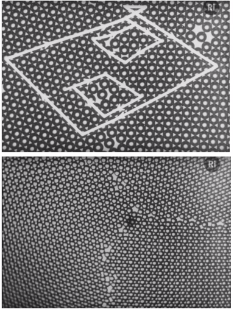 |
|:--:|
| One means #fig-bubble_raft_example |

|  |
|:--:|
| *Video* Experiments with the bubble model of metal structure 1952 - sir lawrence bragg |

---

*Lecture: September 24, 2021*
#### Dislocation Confirmation
[[TEM]] microscope sends electrons to interact with the medium of material that the interaction might be viewed. Variety of characterization techniques reveal their presence, which causes [[crystal-lattice]] distortions. For seeing [[dislocation-motion]] [[glide]] watch EXbiEopDJ_g

#### Dislocation Looping
Dislocations forms loops with both edge and screw dislocation pairs of opposite signs. Positive edge: $\perp$; negative edge: $\iperp$; positive screw: $S$; negative screw; $\backward{S}$.

|  |
|:--:|
| Loops are not square in reality, because it is more energetically favorable to be elliptical. #fig-dislocation_looping_examples |

|  |
|:--:|
| Under shear, loop expands to all edges, which then produces the shear #fig-dislocation_loop_example |

#### Prismatic Loops
[[Prismatic-Loops]] occur when extra disc of atoms are inserted to the [[crystal-structures]] (or removed), and not [[glissile]] like a "common" loop.

|  |
|:--:|
| bar #fig-prismatic_loop_example |

#### Loop Expansion
|  |
|:--:|
| Common dislocation loops have no incompatibility between dislocation moving in loop plane. Dislocation character allows expansion in each direction until loop eventually creates a unit step in the [[crystal-structures]]. #fig-loop_expansion_example |

#### Stress Around Dislocations
Defects introduce stress/strains due to imperfect lattice spacing. If continuum understanding for infinite, straight line is assumed, then calculation is greatly simplified, and a cylinder is sufficient to portray the concept.

| 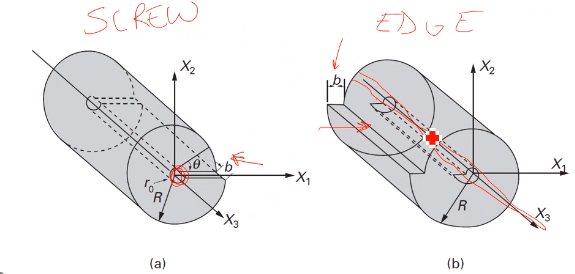 |
|:--:|
| A hollow center is assumed to avoid infinite stress, and it is appropriate since real are not continuous but periodic. #fig-stress_around_dislocations |

#### Stress Equations for Screw Dislocation
Relating stress and strain through [[Hookes-Law]]. $\sigma_{11} = \sigma_{22} = \sigma_{33} = \tau_{12} = \tau_{21} = 0$. $$\begin{align*}\tau_{13} = \tau_{31} &= -\frac{Gbx_{2}}{2\pi(x_{1}^{2} + x_{2}^{2})} \\ \tau_{23} = \tau_{32} &= \frac{Gbx_{1}}{2\pi(x_{1}^{2} + x_{2}^{2})}\end{align*}$$ #eq-screw_dislocation_stress

|  |
|:--:|
| Dislocation motion increments by 1 [[bergers-vector]]. #fig-screw_dislocation_stress_example |

#### Stress Equations for Edge Dislocation
|  |
|:--:|
| $$\begin{align*}\end{align*}$$ #fig-edge_dislocation_stress_equation_example |

### Summary
Dislocations are critical to understanding macroscale deformation and strengthening mechanisms. Dislocations can interact to form loops, which result in same shear on crystal as a dislocation passes through, as long as loop is not prismatic. All of this discussion is for plastic deformation.
*Critical Review Topic is due October 15. Be thinking of a topic related to this material, which also correlates to your own research.*

### Imperfections: Dislocation Energy and Bowing
Quantify energy around dislocations and determines relationships...Take the energy at each dislocation and determine how difficult to move that dislocation. This correlates to [[dislocation-energy]] and [[dislocation-density]], etcetera. Dislocations act like a line, fixed in space and is allowed to bow out: like blowing a bubble.
Dislocations are never alone. Their relation determines their [[dislocation-energy]]. For some number of dislocation, [[volumetric-density]] can be found. Idealized [[dislocation-energy]] applies to a straight dislocation.

#### Energy Around A Dislocation
Each dislocation exhibits elastic deformation energy around it in three dimensions. Those energy distributions vary with orientation and type (normal vs. shear stress).

#### Deformation Energy
Elastic deformation related to magnitude of area displacement under a straight line (ideally). Stress-strain relationship according to [[Hookes-Law]]. Displacement dictated by [[bergers-vector]]. Displacement in-plane relates to distance from dislocation core: $\approx 5b$.

$$\begin{align*}
U &= \frac{1}{2}\sigma_{ij}\epsilon_{ij} \\
	&= \frac{1}{2G}\bigl[\bigr] \\
\end{align*}$$

|  |
|:--:|
| bar #fig-foo |

#### Screw Versus Edge Dislocation Energy
Equations for stress around dislocation vary between screw and edge. Energy of screw dislocation is $\approx\frac{2}{3}$ the edge dislocation energy. $U\longrightarrow \infty~as~R\longrightarrow\infty$, but $R$ is average distance between dislocations.

|  |
|:--:|
| bar #fig-foo |

#### Dislocation Density
Unit area and volume considered to determine [[dislocation-density]] and interaction. The area/volume considered bounded by straight dislocations. From these densities, $R \approx \frac{1}{\sqrt{\rho_dsl}}$. Orientation matters! $$\alpha = \begin{cases}\frac{\pi}{2}, edge \\ 0, screw\end{cases}$$. Energy of core$\dots$

|  |  |
|:--:|:--:|
| Think of these as the "Internet *influencers*" of metals. Dislocations are counted in 4 squares; therefore, only 1 total dislocation: $\rho = \frac{1}{4R^{2}}$. #fig-dislocation_radius_of_influence_example_1 | Each side of the cube is a dislocation line: $\rho = \frac{3}{4R^{3}} \implies R \approx \rho^{-\frac{1}{2}}$. #fig-dislocation_radius_of_influence_example_cube |

If these above examples are not helpful, just think of the equations.

#### Dislocation Bowing
| 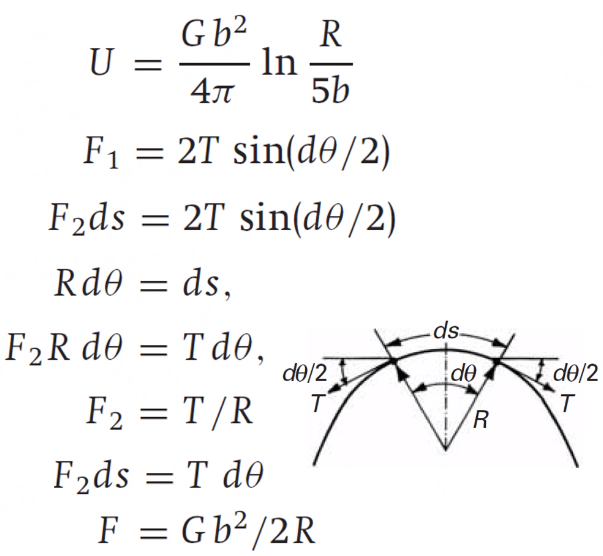 |
|:--:|
| $F_{1}$ is the force to retain shape, and $F_{2}$ is the applied load to cause bowing. #fig-dislocation_bowing_picture |

Dislocations are not straight in practice, but understanding deformation is crucial to other factors: e.g. propogation. Dislocations can be thought to resist bowing by line tension, which is a function of unit length. Remember [[small-angle-assumption]]: $sin(\theta) = \theta,~sin(\frac{d\theta}{2}) = \frac{d\theta}{2}$

#### Peach-Koehler Equation
The [[Peach-Koehler-Equation]] converts force to stress. Considering a unit cube with a dislocation on $x_{1}$ moving some distance in $x_{2}$ in cube height of $x_{3}$. To get the work done, $F$, the force (per unit length) must be multiplied by length $x_{1}$ and distance $x_{2}$. Strain energy equal to work $\dots$

| 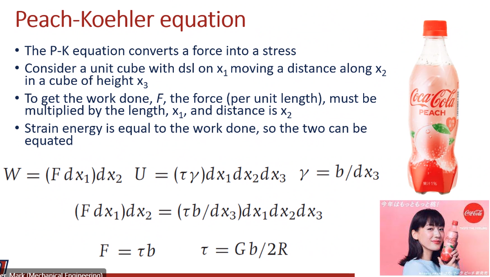 |
|:--:|
| bar #fig-foo |

| 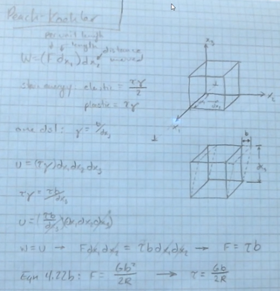 |
|:--:|
| The book has a typo and actually refers to Eq. 4.22b! #fig-peach_koehler_equation_example |

---

*Lecture: September 27, 2021*
### Partial Dislocations
#### Introduction
Dislocations are not as simple as tradtional imagery. There exist import energy considerations.

#### Real Dislocations
Traditional representation of [[dislocation-motion]] is simple, 2D cubic structure where movement of dislocation restores perfect crystal: $\mathbf{b} = a$ in $[100]$. Real crystals, especially [[fcc]], a dislocation may change the structure and is considered a partial/imperfect dislocation. To move from one dislocation to the next, atoms do not necessarily travel over each other, but between each other, to minimize work-energy of motion.

#### Partial Dislocations in Close-Packed Planes
|  |
|:--:|
| Easier for atoms to move along $(111)$ in grooves between atomic positions, not over top. This requires two movements to restore original stacking pattern. #fig-real_dislocation_in_close_packed_plane_example |

|  |
|:--:|
| bar #fig-real_dislocation_in_close_packed_plane_example_move1 |

|  |
|:--:|
| bar #fig-real_dislocation_in_close_packed_plane_example_move2 |

Overall motion of one [[bergers-vector]], $\vec{b}$.

#### Visualizing fcc Partial Dislocations
| 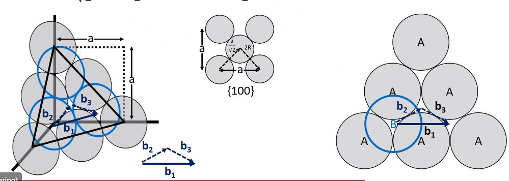 |
|:--:|
| Translation of $\vec{b}_{1} = 2R$. The direction, $\vec{b}_{1} = [\bar{1}10]$, which, in vector notation, is $\vec{b}_{1} = a(i + i + 0k)$. $\|\vec{b}_{1}\| = 2R = \frac{a}{\sqrt{2}} = \frac{a}{2}[\bar{1}10] = \frac{1}{2}[\bar{1}10]$ #fig-visualizing_fcc_partial_dislocations |

$\vec{b}_{2}$ and $\vec{b}_{3}$ will be in same plane for energetically favorable motion.

>**Q&A**
Do partial dislocations stop forming in some metals?
One partial can shift an row of atoms over; therefore, this changes the stacking pattern, which may be corrected later.

#### Determining the Partial Direction and Magnitude
|  |
|:--:|
| Moving from one interstitial site to the next. #fig-partial_dislocation_direction_magnitude_example |

#### Decomposition of $\vec{b}_{1}$
|  |
|:--:|
| [[bergers-vector]], $\vec{b}_{1}$ is mathematically equivalent to addition of two partial dislocations, $\vec{b}_{2}$ and $\vec{b}_{3}$. The scalar product should be zero in a single plane where $[111] \perp (111)$. #fig-decomposition_of_bergers_vector |

#### Partial Dislocation Energy
| 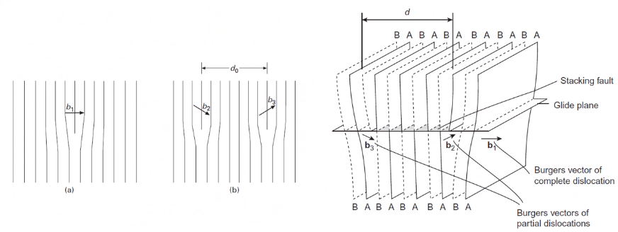 |
|:--:|
| Because $\vec{b}$ is lower $\dots$ #fig-partial_dislocation_energy_example |

#### Stacking Faults
Two partial dislocations repel one another, but the change in stacking sequence causes an increase in energy. Spacing of the partials, $d$ is determined by this energy balance. The [[stacking-fault-free-energy]] ([[SFE]]) is strongly affected by composition, with alloys having a lower SFE than pure metals. Low [[SFE]] metals will be dominated by [[stacking-faults]] with fewer dislocation cells or tangles. $\dots$

| 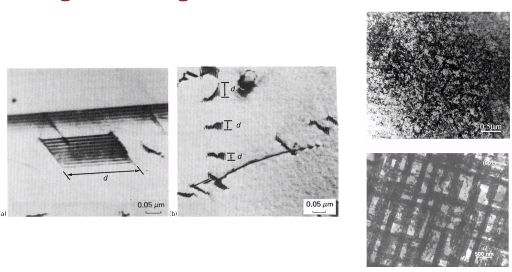 |
|:--:|
| Upper-right is a tangle of dislocation faults. Lower-right (plaid) is different stacking patterns in the stacking faults. #fig-stacking_fault_examples |

#### Sessile Dislocations
Energetically favorable to have dislocations. Addition or subtraction of plane of material causes an immobile [[stacking-fault]], which is not energetically favorable. Removal of layer in *intrinsic*

#### Lomer-Cotrell Locks
| 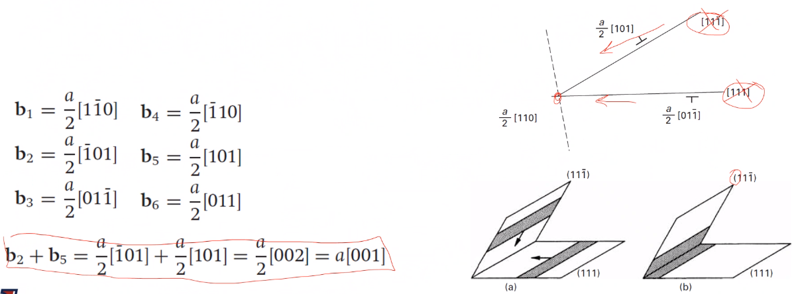 |
|:--:|
| Two [[glissile]] dislocations may interact and produce a [[sessile]] dislocation if they start on intersecting planes. *Think of a headlock.* #fig-lomer_cotrell_lock_example |

#### HCP Dislocations
Close-packed plane is [[basal-plane]], which form *intrinsic* [[stacking-faults]]. [[basal-plane]] is preferred plane$\dots$

#### BCC Dislocations
Not usually energetically favorable, so rarely seen.
|  |
|:--:|
| All share same [[slip-plane]]. #fig-bcc_dislocation_example |

#### Summary
Lowest energy portion is preferable mechanism for [[dislocation-motion]]$\dots$

| 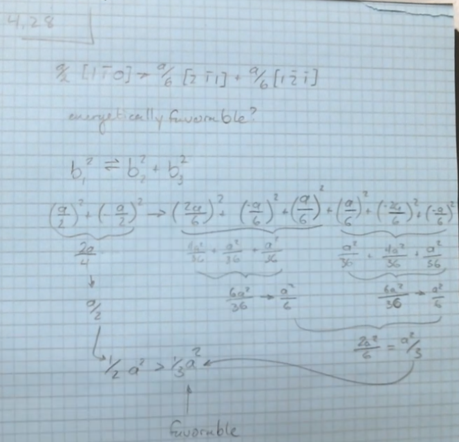 |
|:--:|
| To determine which is energetically favorable, simply plug-n-chug. $\|\vec{b}\| = \sqrt{b^{2}}$ #fig-problem_4_28_solution |

---

*Lecture: September 29, 2021*
##### Dislocation density, homogeneous nucleation
An annealed, polycrystalline metal may have a dislocation density of about $10^{7}cm^{-2}$, but after only 10% strain, the density increases three orders of magnitude. Intuitively, dislocations should be annihilated upon gliding on a free surface. Simplest way dislocations could be produced is through direst shear resulting in two dislocations of opposite signs forming, but the stress to do so is comparable to the theoretical strength (all bonds at once) and is therefore unlikely to contribute in a meaningful way. Dislocations sometimes get stuck and bogged down.

#### Dislocation Sources
Stress concentrations and higher energy are potential sources for dislocations to be formed. Grain boundaries, the irregular steps a ledges of the atoms along them act as dislocation sources: considered important to early dislocation emission at the early stages of deformation. Stress concentrations exist here. Free surfaces, with similarities to internal surface work similarly, but are not dominate in polycrystalline materials. Discontinuities in structures which nucleate dislocations. Precipitates or other phase discontinuities can also assist in dislocation emission.

#### Frank-Read Source
Dislocations can become immobilized by other dislocations or cross-slipped segments. With increasing stress, the pinned segment will bow out: recall that dislocations are defined as having a unit length energy or line tension. After sufficient stress, the dislocation bows out so far that the opposing segment ends meet and reconnect because of the their opposite signs. *Think of the lollipop in the balloon.*

|  |
|:--:|
| The semi-circle is the highest energy state, but if you can overcome that, then a [[Frank-Read-Source]] is activated and dislocations are nucleated. #fig-frank_read_source_example |

The radius of curvature reaches minimum when equal to one-half the length of the straight line segment (unbowed or spacing between pinned points), which is semi-circular. The [[Peach-Koehler-Equation]] applies here, with the value of $R$ being spacing of pinned points. **Formed dislocations create a back stress.** [[Frank-Read-Source]] are not common in real experiment.

#### Cross-Slip and Dislocation Multiplication
Standard [[Frank-Read-Source]] is unlikely route for dislocation multiplication. Many complicated interactions between dislocations in 3D, which create nodes and similar behavior. A screw dislocation may [[cross-slip]] to a parallel plane, thereby pinning the segment in [[Frank-Read-Source]] fashion. Dislocation may also be generated at interfaces with differing lattice parameters.

|  |
|:--:|
| Epitaxy includes other phase boundaries. #fig-dislocation_multiplication |

| 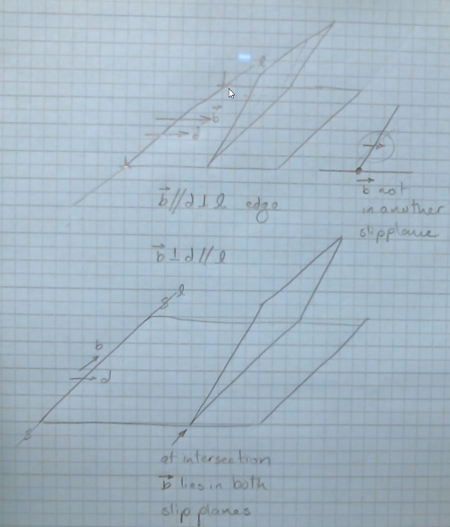 |
|:--:|
| [[bergers-vector]] in same direction as edge dislocation and perpendicular as screw dislocation. The edge dislocation tries to move the [[glide-plane]] out-of-plane to another [[glide-plane]]. The screw dislocation allows the [[glide-plane]] to move in-plane and [[cross-slip]]. #fig-cross_slip_summary |

#### Dislocation Pileup
[[dislocation-pileup]]
: Any boundary/barrier to [[dislocation-motion]] during [[glide]].

Force on any dislocation in pileup can be determined from its position in the pileup (think of Black Friday shoppers squeezing to get in line for a sale). Stress increases on the lead dislocation. Collective response of pileup may be thought of as a "[[super-dislocation]]", which can [[cross-slip]] or cross grain boundaries.

$$\tau b = \sum_{j = 0, i \neq j}^{n}\frac{Gb^{2}}{2\pi(1 - \nu)(x_{i} - x_{j}}$$ #eq-dislocation_pileup

where, $\tau_{lead~dsl}^{\star} = n\tau$ and $L_{length~of~pileup} = \frac{nGb}{\pi\tau}$.

| 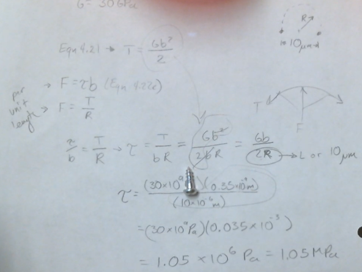 |
|:--:|
| bar #fig-dislocation_pileup_example |

#### Summary
Extensive dislocation occurs when dislocation are continuously produced within crystal.