<!-- output:
  pdf_document:
    latex_engine: xelatex
    includes:
      in_header: "C:/Users/jmanthony1/Documents/GitHub/JobyAnthonyIII/LaTeX/preamble.tex"
tags: 
bibliography: "biblio.bib"
link-citations: true -->

<!-- %%%%%%%% Document Metadata %%%%%%%% -->
# ENGR 839-001: Mechanical Metallurgy

- [ENGR 839-001: Mechanical Metallurgy](#engr-839-001-mechanical-metallurgy)
	- [Materials: Structure, Properties, and Performance](#materials-structure-properties-and-performance)
		- [Introduction](#introduction)
		- [Review](#review)
		- [Metallic Crystal Structure](#metallic-crystal-structure)
			- [Energy and Packing](#energy-and-packing)
			- [Crystalline (Periodic) Structure](#crystalline-periodic-structure)
		- [Density Comparison of Materials](#density-comparison-of-materials)
			- [Polycrystalline Materials](#polycrystalline-materials)
			- [Anistropy](#anistropy)
			- [Istropy](#istropy)
			- [Miller Indices](#miller-indices)
				- [1) Point coordinates Algorithm](#1-point-coordinates-algorithm)
				- [2) Crystallographic Directions Algorithm](#2-crystallographic-directions-algorithm)
				- [3) Crystallographic Planes Algorithm](#3-crystallographic-planes-algorithm)
			- [Crystal Structure and Deformation](#crystal-structure-and-deformation)
			- [Slip System (fcc)](#slip-system-fcc)
			- [Polycrystalline Slip](#polycrystalline-slip)
		- [Summary](#summary)
	- [Elasticity](#elasticity)
		- [Introduction](#introduction-1)
		- [Elastic](#elastic)
			- [Stress](#stress)
			- [Strain](#strain)
			- [Engineering vs True Stress](#engineering-vs-true-stress)
			- [Notation!](#notation)
			- [Strain Energy](#strain-energy)
			- [Shear/Torsion](#sheartorsion)
			- [Poisson's Ratio](#poissons-ratio)
			- [Summary](#summary-1)
		- [Elasticity: Polycrystalline Materials and Bulk Metals](#elasticity-polycrystalline-materials-and-bulk-metals)
			- [Introduction](#introduction-2)
			- [Stress Tensor Revisited](#stress-tensor-revisited)
			- [Hooke's Law Revisited](#hookes-law-revisited)
			- [Simplifications](#simplifications)
			- [#Mohrs-Circle Revisited](#mohrs-circle-revisited)
		- [Pure Shear](#pure-shear)
		- [Elasticity: Atomic Bonds](#elasticity-atomic-bonds)
			- [Introduction](#introduction-3)
			- [Atomic Bonding](#atomic-bonding)
			- [Bond Interaction and Force](#bond-interaction-and-force)
			- [Stress and Strain in Bonds](#stress-and-strain-in-bonds)
			- [Summary](#summary-2)
	- [Exam Review](#exam-review)
	- [Plasticity](#plasticity)
		- [Introduction](#introduction-4)
			- [Engineering and true stress and strain](#engineering-and-true-stress-and-strain)
			- [Work-Hardening Basics](#work-hardening-basics)
			- [Summary](#summary-3)
		- [Tensile Curve Parameters, Necking, and Strain Rate](#tensile-curve-parameters-necking-and-strain-rate)
			- [Introduction](#introduction-5)
			- [Necking](#necking)
			- [Stress-strain and Necking](#stress-strain-and-necking)
				- [Bridgman Correction](#bridgman-correction)
				- [State of Stress in Deformation](#state-of-stress-in-deformation)
			- [Strain Rate](#strain-rate)
			- [Summary](#summary-4)
		- [Compression and Hardness](#compression-and-hardness)
			- [Introduction](#introduction-6)
			- [Practical Considerations](#practical-considerations)
			- [Compression Curve](#compression-curve)
			- [Compression Failure](#compression-failure)
			- [Bauschinger Effect](#bauschinger-effect)
			- [Hardness Testing](#hardness-testing)
			- [Hardness-Yield Relationship](#hardness-yield-relationship)
			- [Micro-Indentation Testing](#micro-indentation-testing)
			- [Nano-Indentation Testing](#nano-indentation-testing)
		- [Summary](#summary-5)
	- [Defects](#defects)
		- [Introduction](#introduction-7)
		- [Theoretical Shear Strength](#theoretical-shear-strength)
		- [Point Defects](#point-defects)
			- [Interstitial Defects](#interstitial-defects)
				- [#fcc sites](#fcc-sites)
				- [#bcc sites](#bcc-sites)
				- [#hcp sites](#hcp-sites)
			- [Equilibrium Concentration](#equilibrium-concentration)
			- [Vacancy or Self-Interstitial?](#vacancy-or-self-interstitial)
			- [Equilibrium Concentration](#equilibrium-concentration-1)
			- [Vacancy Formation](#vacancy-formation)
			- [Effect on Mechanical Properties](#effect-on-mechanical-properties)
			- [Summary](#summary-6)
		- [Line Defects](#line-defects)
		- [Types of Dislocations](#types-of-dislocations)
			- [Edge and Screw Character](#edge-and-screw-character)
			- [Dislocation Motion](#dislocation-motion)
			- [Bubble Rafts](#bubble-rafts)
			- [Dislocation Confirmation](#dislocation-confirmation)
			- [Dislocation Looping](#dislocation-looping)
			- [Prismatic Loops](#prismatic-loops)
			- [Loop Expansion](#loop-expansion)
			- [Stress Around Dislocations](#stress-around-dislocations)
			- [Stress Equations for [[screw-dislocations]]](#stress-equations-for-screw-dislocations)
			- [Stress Equations for [[edge-dislocations]]](#stress-equations-for-edge-dislocations)
		- [Summary](#summary-7)
		- [Imperfections: Dislocation Energy and Bowing](#imperfections-dislocation-energy-and-bowing)
			- [Energy Around A Dislocation](#energy-around-a-dislocation)
			- [Deformation Energy](#deformation-energy)
			- [Screw Versus Edge Dislocations Energy](#screw-versus-edge-dislocations-energy)
			- [Dislocation Density](#dislocation-density)
			- [Dislocation Bowing](#dislocation-bowing)
			- [Peach-Koehler Equation](#peach-koehler-equation)
		- [Partial Dislocations](#partial-dislocations)
			- [Introduction](#introduction-8)
			- [Real Dislocations](#real-dislocations)
			- [Partial Dislocations in Close-Packed Planes](#partial-dislocations-in-close-packed-planes)
			- [Visualizing fcc Partial Dislocations](#visualizing-fcc-partial-dislocations)
			- [Determining the Partial Direction and Magnitude](#determining-the-partial-direction-and-magnitude)
			- [Decomposition of $\burgers_{1}$](#decomposition-of-burgers_1)
			- [Partial Dislocation Energy](#partial-dislocation-energy)
			- [Stacking Faults](#stacking-faults)
			- [Sessile Dislocations](#sessile-dislocations)
			- [Lomer-Cotrell Locks](#lomer-cotrell-locks)
			- [HCP Dislocations](#hcp-dislocations)
			- [BCC Dislocations](#bcc-dislocations)
			- [Summary](#summary-8)
				- [Dislocation density, homogeneous nucleation](#dislocation-density-homogeneous-nucleation)
			- [Dislocation Sources](#dislocation-sources)
			- [Frank-Read Source](#frank-read-source)
			- [Cross-Slip and Dislocation Multiplication](#cross-slip-and-dislocation-multiplication)
			- [Dislocation Pileup](#dislocation-pileup)
			- [Summary](#summary-9)
		- [Imperfections: Dislocation Interactions](#imperfections-dislocation-interactions)
			- [Introduction](#introduction-9)
			- [Intersection of Dislocations and Forest Dislocations](#intersection-of-dislocations-and-forest-dislocations)
			- [Jogs and Kinks](#jogs-and-kinks)
			- [Effects on [[dislocation-motion]]](#effects-on-dislocation-motion)
			- [Dislocation Looping](#dislocation-looping-1)
			- [Orowan Equation](#orowan-equation)
			- [Peirels-Nabarro Stress (Lattice Friction)](#peirels-nabarro-stress-lattice-friction)
			- [Kink Pair Nucleation](#kink-pair-nucleation)
			- [Temperature and Strain Rate](#temperature-and-strain-rate)
		- [Interfacial Defects](#interfacial-defects)
			- [Grain Boundary](#grain-boundary)
			- [Tilt Boundary](#tilt-boundary)
			- [Twist Boundary](#twist-boundary)
			- [Grain Boundary Energy](#grain-boundary-energy)
				- [Parameter A](#parameter-a)
			- [Grain Boundary Misorientation-Energy Relation](#grain-boundary-misorientation-energy-relation)
			- [Coincident Site Lattice Boundary](#coincident-site-lattice-boundary)
			- [Triple Junctions](#triple-junctions)
			- [Grain Boundary Dislocations and Ledges](#grain-boundary-dislocations-and-ledges)
			- [Summary](#summary-10)
		- [Twinning](#twinning)
			- [Crystallography](#crystallography)
			- [Difference from Slip](#difference-from-slip)
			- [Twinning and Slip](#twinning-and-slip)
			- [Effect of the c/a Ratio](#effect-of-the-ca-ratio)
			- [Mechanical Effects](#mechanical-effects)
			- [Effects of Stacking Fault Free Energy](#effects-of-stacking-fault-free-energy)
			- [Twinning and Slip Stress](#twinning-and-slip-stress)
			- [Summary](#summary-11)
		- [Grain-Size Boundaries](#grain-size-boundaries)
			- [Hall-Petch Equation](#hall-petch-equation)
			- [Theories Behind the Mechanisms](#theories-behind-the-mechanisms)
			- [Cottrell Theory](#cottrell-theory)
			- [Li Theory](#li-theory)
			- [Meyers-Ashworth](#meyers-ashworth)
			- [Summary](#summary-12)
		- [Obstacles to Deformation](#obstacles-to-deformation)
			- [Substructural Effects](#substructural-effects)
			- [Iron-Carbon System Considerations](#iron-carbon-system-considerations)
			- [Nanocrystalline Materials](#nanocrystalline-materials)
				- [Strengthening Mechanisms](#strengthening-mechanisms)
			- [Volumetric Defects](#volumetric-defects)
	- [Deformation and Work Hardening](#deformation-and-work-hardening)
		- [Introduction and Stereographic Projections](#introduction-and-stereographic-projections)
		- [Hot Work versus Cold Work](#hot-work-versus-cold-work)
		- [Work-Hardening](#work-hardening)
		- [Affects of Temperature](#affects-of-temperature)
		- [High Temperature (#DBTT)](#high-temperature-dbtt)
		- [Stereographic Projections](#stereographic-projections)
			- [In Cubic Crystals](#in-cubic-crystals)
			- [Cubic Projections](#cubic-projections)
			- [Resolved Shear Stress](#resolved-shear-stress)
		- [Finding Orientations](#finding-orientations)
		- [Schmid Factor](#schmid-factor)
		- [Easy Glide](#easy-glide)
		- [Summary](#summary-13)
		- [Strain and Slip Reorientation](#strain-and-slip-reorientation)
			- [Resolved Shear Strain](#resolved-shear-strain)
			- [Slip Systems Stereographically](#slip-systems-stereographically)
			- [Reorientation](#reorientation)
			- [Shear Stress-Strain Curves](#shear-stress-strain-curves)
			- [Polycrystalline Slip](#polycrystalline-slip-1)
			- [Summary Slip](#summary-slip)
		- [Polycrystalline Slip](#polycrystalline-slip-2)
			- [Introduction](#introduction-10)
			- [Work-Hardening in Polycrystals](#work-hardening-in-polycrystals)
			- [Modeling Defect Accumulation](#modeling-defect-accumulation)
			- [Taylor Theory](#taylor-theory)
			- [Limitations of Taylor Theory](#limitations-of-taylor-theory)
			- [Seeger Theory](#seeger-theory)
			- [Kuhlmann-Wilsdorf Theory](#kuhlmann-wilsdorf-theory)
			- [Summary](#summary-14)
		- [Softening and Texture](#softening-and-texture)
			- [Thermal Softening](#thermal-softening)
			- [Adiabatic Shear Bands](#adiabatic-shear-bands)
			- [Texture](#texture)
			- [Texture Effects](#texture-effects)
			- [Measuring Texture](#measuring-texture)
	- [Solution and Second-Phase Strengthening](#solution-and-second-phase-strengthening)
		- [Elastic Interactions](#elastic-interactions)
			- [Introduction](#introduction-11)
			- [Substitutionals versus Interstitials](#substitutionals-versus-interstitials)
			- [Elastic Misfit](#elastic-misfit)
			- [Stress Fields in Polar Coordinates](#stress-fields-in-polar-coordinates)
			- [Interaction Energy](#interaction-energy)
			- [Interaction Force](#interaction-force)
			- [Dislocation Pinning](#dislocation-pinning)
			- [Screw Dislocations and Interstitials](#screw-dislocations-and-interstitials)
			- [Example from Research](#example-from-research)
			- [Summary](#summary-15)
		- [Dislocation-Solute Interactions](#dislocation-solute-interactions)
			- [Introduction](#introduction-12)
			- [Upper/Lower Yield Phenomenon](#upperlower-yield-phenomenon)
			- [Luders Banding](#luders-banding)
			- [Strain Aging](#strain-aging)
			- [Dynamic Strain Aging](#dynamic-strain-aging)
			- [Stress-Strain Serration](#stress-strain-serration)
			- [Snoek Effect](#snoek-effect)
			- [Blue Brittleness](#blue-brittleness)
			- [Summary](#summary-16)
		- [Precipitation and Dispersion Strengthening](#precipitation-and-dispersion-strengthening)
			- [Precipitation Hardening](#precipitation-hardening)
			- [Precipitation Process](#precipitation-process)
			- [Precipitation Mechanisms](#precipitation-mechanisms)
			- [Composition and Temperature Effects](#composition-and-temperature-effects)
			- [Coherency](#coherency)
			- [Preferential Precipitate](#preferential-precipitate)
		- [Dispersion Strengthening](#dispersion-strengthening)
		- [Dislocation-Particle Interactions](#dislocation-particle-interactions)
			- [Introduction](#introduction-13)
			- [Dislocation (Orowan) Bowing](#dislocation-orowan-bowing)
			- [Particle Shearing](#particle-shearing)
			- [Shear Stress in Particle Cutting](#shear-stress-in-particle-cutting)
			- [Volume Fraction](#volume-fraction)
			- [Considerations in Precipitation](#considerations-in-precipitation)
			- [Summary](#summary-17)
	- [Martensitic Transformation](#martensitic-transformation)
		- [Structure and Morphology](#structure-and-morphology)
			- [Objectives](#objectives)
			- [Introduction](#introduction-14)
			- [Martensite Process](#martensite-process)
			- [Quick Review](#quick-review)
			- [Other Systems](#other-systems)
			- [Transformation](#transformation)
			- [Morphologies](#morphologies)
			- [Defects in Martensite](#defects-in-martensite)
			- [The Habit Plane](#the-habit-plane)
			- [Summary](#summary-18)
		- [Stress and Strain Effects](#stress-and-strain-effects)
			- [Introduction](#introduction-15)
			- [Martensite Strength](#martensite-strength)
			- [Grain Size and Solution Strengthening](#grain-size-and-solution-strengthening)
			- [Interstitial Hardening](#interstitial-hardening)
			- [Carbon Effects](#carbon-effects)
			- [The Whole Enchilada](#the-whole-enchilada)
			- [Stress-Martensite Interaction](#stress-martensite-interaction)
			- [Martensitic Transformations and Stress](#martensitic-transformations-and-stress)
			- [Mechanical Effect](#mechanical-effect)
			- [Strain-Induced Martensite](#strain-induced-martensite)
			- [Martensite Fracture](#martensite-fracture)
			- [Summary](#summary-19)
		- [Shape Memory](#shape-memory)
			- [Objectives](#objectives-1)
			- [Introduction](#introduction-16)
			- [Overview](#overview)
			- [SME and Martensite](#sme-and-martensite)
			- [Pseudo (Super) Elasticity](#pseudo-super-elasticity)
			- [Martensitic Variants and Pseudoelasticity](#martensitic-variants-and-pseudoelasticity)
			- [Strain Memory](#strain-memory)
			- [SMA Applications](#sma-applications)
			- [Summary](#summary-20)
	- [Intermetallics](#intermetallics)
		- [Objectives](#objectives-2)
		- [Introduction](#introduction-17)
		- [Ordered Structures](#ordered-structures)
		- [Stoichiometry and Formation](#stoichiometry-and-formation)
		- [Intermetallic Phase Diagrams](#intermetallic-phase-diagrams)
		- [Dislocations in Intermetallics](#dislocations-in-intermetallics)
		- [APB Energy](#apb-energy)
		- [Kear-Wilsdorf Lock](#kear-wilsdorf-lock)
		- [Order Parameters](#order-parameters)
		- [Mechanical Effects of Ordering](#mechanical-effects-of-ordering)
		- [Grain Size and Fatigue Performance](#grain-size-and-fatigue-performance)
		- [Second Phase Particles](#second-phase-particles)
		- [Temperature Effects](#temperature-effects)
		- [Ductility](#ductility)
			- [Microalloying](#microalloying)
			- [Macroalloying](#macroalloying)
			- [Composites and Environment](#composites-and-environment)
		- [Summary](#summary-21)
	- [Porous Materials](#porous-materials)
		- [Objectives](#objectives-3)
		- [Introduction](#introduction-18)
		- [Metal Foams Overview](#metal-foams-overview)
		- [Solid State Foams](#solid-state-foams)
		- [Some Power Methods](#some-power-methods)
		- [Precursor Porosity](#precursor-porosity)
		- [Composite Structures](#composite-structures)
		- [Mechanical Considerations](#mechanical-considerations)
		- [Elasticity of Cellular Materials](#elasticity-of-cellular-materials)
	- [Corrosion](#corrosion)
		- [Objectives](#objectives-4)
		- [Introduction](#introduction-19)
		- [Modes of Corrosion](#modes-of-corrosion)
		- [Will It Corrode?](#will-it-corrode)
		- [Corrosion Electrochemistry](#corrosion-electrochemistry)
		- [Polarization and Passivity](#polarization-and-passivity)
		- [Electrochemical Series](#electrochemical-series)
		- [Galvanic Corrosion](#galvanic-corrosion)
		- [Galvanic Protection](#galvanic-protection)
		- [Sacrificial Anodes](#sacrificial-anodes)
		- [Concentration Cell Corrosion](#concentration-cell-corrosion)
		- [Pitting](#pitting)
		- [Intergranular Corrosion](#intergranular-corrosion)
		- [Dealloying](#dealloying)
		- [Oxidation](#oxidation)
		- [Ellingham Diagram](#ellingham-diagram)
		- [Oxidation Effects](#oxidation-effects)
		- [Summary](#summary-22)
		- [Mechanical Effects](#mechanical-effects-1)
			- [Objectives](#objectives-5)
			- [Introduction](#introduction-20)
			- [Stress Corrosion Cracking](#stress-corrosion-cracking)
			- [SCC Process](#scc-process)
			- [Crack Growth](#crack-growth)
			- [SCC Examples and Controls](#scc-examples-and-controls)
			- [Hydrogen Damage and Sources](#hydrogen-damage-and-sources)
			- [Hydrogen Introduction](#hydrogen-introduction)
			- [Mechanisms](#mechanisms)
			- [Control Mechanisms](#control-mechanisms)
			- [Metal Induced Embrittlement](#metal-induced-embrittlement)
			- [Summary](#summary-23)
<!-- %%%%%%%%%%%%%%%%%%%%%%%%%%%%%% -->

<!-- START WRITING BELOW -->

<!-- %%%%%%%%%%%%%%%%%%%%%%%%%%%%%% -->
*Lecture: August 23, 2021*
## Materials: Structure, Properties, and Performance
### Introduction
**Objectives** The course content will enable students to set and meet expectations. All of this material, in its content and instruction, are new: so, leave room for error. Be inspired to tackle whatever comes our way.

|  |
|:--:|
| Creationeering diagram. $\tag{fig:creationeering_diagram} \label{fig:creationeering_diagram}$ |

|  |
|:--:|
| Cross-shaped Liberty University Creationeer. $\tag{fig:creationeering_t_diagram} \label{fig:creationeering_t_diagram}$ |

**Definitions**
*[CPSPP]: Chemistry-Process-Structure-Property-Performance
This class will make more familiar the "chemistry-process-structure" portion of the *chemistry-process-structure-property-performance*" (#CPSPP) relationship. LU seeks to apply these engineering disciplines into entrepreneurship.

Mechanical
: Force response of materials, which includes the underlying principles/effects of microstructure.

Metallurgy
: Microstructural transformations dictated by composition/processing that is the foundation.

Mechanical Metallurgy
: As a course, studies not *how* materials behave, by *why* they behave a certain way.

!!! info Syllabus
	Homeworks due only before the relevant exams, and graded for the good ol' college try. If you can do the homeworks, then you can do the tests. **Final Exam is cumulative.** Critical Review: "Reverse engineer" an article and explain it with additional comments or inferences. The accompanying presentation should explain the takeaway from the application articles/comments.

### Review
!!! summary #CPSPP
	Relationship for how some chemical composition (e.g: FeC) is processed to produce some structure, which has some property that allows some performance.

|  |
|:--:|
| Iron-Carbon phase diagram. $\tag{fig:iron_carbon_phase_diagram} \label{fig:iron_carbon_phase_diagram}$ |

|  |
|:--:|
| Microstructures in FeC phase diagram. [[phase-diagrams]] pack a lot of information for CPS of #CPSPP sequence. Lines denote what structure is found after some process with some chemical composition, which can be found by the *Lever Rule*. $\tag{fig:fec_with_microstructure} \label{fig:fec_with_microstructure}$ |

Lever Rule
: Ratio of phases proportional to weight percent distance to other phases.

| 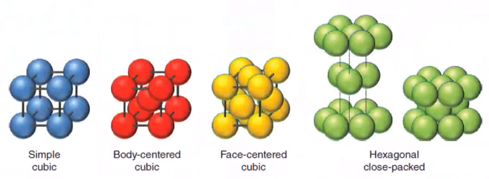 |
|:--:|
| Crystallographic examples. $\label{fig:crystallographic_types}$ |

!!! info Crystallographic Types
	Simple cubic (#sc), face-center cubic (#fcc), body-center cubic (#bcc), hexagonal close-packed (#hcp).
	- The atomic packing factor, #apf, the ratio lattice that is filled, increases down this list.
	- #fcc and #hcp are similar, but #hcp is more brittle.

*[sc]: Simple Cubic
*[fcc]: Face-Center Cubic
*[bcc]: Body-Center Cubic
*[hcp]: Hexagonal Close-Packed
*[apf]: Atomic Packing Factor

|  |
|:--:|
| Copper phase diagram. $\tag{fig:precipitation_hardening} \label{fig:precipitation_hardening}$ |

|  |
|:--:|
| The angle at which one stuffs at burger into his face. $\tag{fig:burgers_vector} \label{fig:burgers_vector}$ |

[[burgers-vector]], $\burgers$
: Lattice displacement by a dislocation;  vector of dislocation; location, magnitude, and direction of influence on lattice. Can weaken metals when many dislocations exist.

---

*Lecture: August 25, 2021*

|  |
|:--:|
| Pictographic way to visual CPSPP relationship according to processing techniques. $\label{fig:thomas_tetrahedron}$ |

!!! example #CPSPP
	Includes low-carbon steel; high-carbon steel; and, cast iron. All same chemistry with different composition ratios and examples of different processing techniques applied/able.
	|  |
	|:--:|
	| Common steels in automotive applications. $\label{fig:cpspp_example}$ |

**Monolithic** Previously explained as homogeneous or isotropic, but depends on length scale. Here, means the same crystal structure throughout: e.g. pearlite.

|  |
|:--:|
| Phase diagram for FeC with microstructure. $\tag{fig:pearlite_in_iron} \label{fig:pearlite_in_iron}$ |

**Materials Design** Exposed to variety of conditions, but can be designed to suit. More complex designs may have better performance. Composites have "rules-of-mixtures" to balance performance. Hierarchical materials vary structure/composition to enhance functional/structural properties at different length scales.

**Our Focus:** not on manufacturing techniques: e.g. ENGR 835. Will consider how manufacturing variables affect structure. We will move up length up from atomistics.

### Metallic Crystal Structure
#### Energy and Packing
|  |  |
|:--:|:--:|
| Non-dense, random packing. $\tag{fig:nondense_interatomic_potential_curve} \label{fig:nondense_interatomic_potential_curve}$ | Dense, ordered packing. $\tag{fig:dense_interatomic_potential_curve} \label{fig:dense_interatomic_potential_curve}$ |

Ordered structures tend to be nearer the minimum bonding energy and are more stable.

**Atomic Packing** Dense crystal structures for metals. Reasons for dense packing:
1. Bonds between metal atoms are non-directional; 
2. Nearest neighbor distances tend to be small in order to lower bond energy;
3. High degree of shielding (of ion cores) provided by free electron cloud; and,
4. Crystal structures for metals simpler than structures for ceramics and polymers.

#### Crystalline (Periodic) Structure
|  |
|:--:|
| Crystalline (Periodic) Structure. $\label{fig:crystalline_structure_example}$ |
|  |
| Simple Cubic (#sc) Crystal Structure: centers of atoms at corners and close packed along edges. $\label{fig:simple_cubic_structure}$ |
|  |
| Body-Centered Cubic (#bcc) Structure: atoms located at 8 cube corners with a single atom at cube center. $\label{fig:body_centered_cubic}$ |
|  |
| Face-Centered Cubic (#fcc) Structure: atoms located at 8 cube corners with half atoms at center of 6 cube faces. $\label{fig:face_centered_cubic}$ |
|  |
| Hexagonal Close-Packed (#hcp) Structure: only B or C positions can be filled in a single layer. $\label{fig:fcc_hcp_packing_sequence}$ |
|  |
| Interces in each layer can be filled only according to some pattern: "A" or "B". $\label{fig:hexagonal_close_packed_structure}$ |

**Structure** | **Coor. #** | **$\frac{atoms}{cell}$** | **#apf** | **[[slip-plane]]** | **[[slip-system]]**
|:-:|:-:|:-:|:-:|:-:|:-:|
#sc | 6 | 1
#bcc | 8 | 2 | 0.68 | 3 | 48
#fcc | 12 | 4 | 0.74 | 1 | 12
#hcp | 12 | 6 | 0.74 | 3 | 12

---

*Lecture: August 27, 2021*

### Density Comparison of Materials
|  |
|:--:|
| $\label{fig:density_comparison_of_materials}$ |

#### Polycrystalline Materials
|  |
|:--:|
| Higher cooling rates at edges make for smaller grains; whereas, slower cooling rate at center make for larger, directionally aligned grains. $\label{fig:polycrystalline_example}$ |

*Most* engineering materials are composed of many, small single crystals. Each "grain" is a single crystal. Grain sizes typically range from 1 nm to 2 cm. Smaller grains usually mean higher strength and lower ductility.

|  |
|:--:|
| Same crystal type that repeat in different orientations. $\label{fig:unit_cell_orientation_in_polycrystal}$ |

#### Anistropy
|  |
|:--:|
| Unit cell of #bcc ($\alpha$) iron. $\label{fig:anistropy_example}$ |

[[anistropy]]
: A property value that depends on crystallographic direction of measurement.

Properties depend on direction loading, because of linear density along that direction. Best observed in single crystals. The higher linear density means higher stiffness, usually.

#### Istropy

| 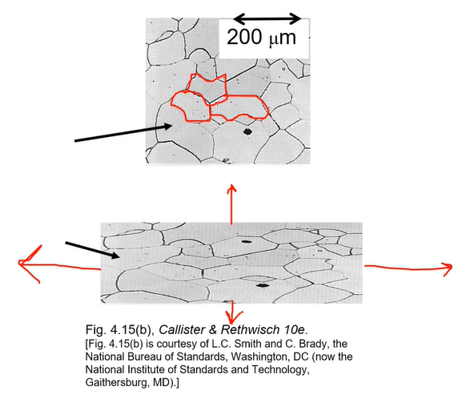 |
|:--:|
| Randomly oriented versus textured grains. $\label{fig:isotropy_comparisons}$ |

**Polycrystals:** properties may (not) vary with direction. If grains randomly oriented, properties are [[isotropic]]: independent of loading direction. If grains, "textured"--crystallographic orientation--properties are [[anistropic]]: dependent on loading direction.

#### Miller Indices
A method of assigning coordinate values to crystallographic lattice sites. Used to identify specific points, directions, and planes or families of these. Used to identify crystallographic information. Three ways to identify:

##### 1) Point coordinates Algorithm

!!! note
	A lattice position with a unit cell and determined as fractional multiples of unit cell edge lengths.

|  |  |
|:--:|:--:|
| Determined as fractional multiples of unit cell edge lengths. $\label{fig:point_coordinates_example}$ | $\label{fig:point_coordinate_example_with_annotations}$ |

1. Lattice position is a, b, c.
2. Divide by unit cell edge lengths and remove commas: $\frac{a}{a}\frac{b}{b}\frac{c}{c} = 111$

##### 2) Crystallographic Directions Algorithm

|  |
|:--:|
| $\label{fig:crystallographic_example}$ |

!!! note
	Remember from calculus the $tip - tail$ method to find vector direction and length.

1. Determine coordinates of vector head and tail: $(x_{2}, y_{2}, z_{2})$ and $(x_{1}, y_{1}, z_{1})$, respectively.
2. Subtract tail coordinates from head coordinates.
3. Normalize this subtraction by lattice parameters of unit cell edge length: $\frac{x_{2} - x_{1}}{a}\frac{y_{2} - y_{1}}{b}\frac{z_{2} - z_{1}}{c}$.
4. Multiply to smallest integer values.
5. Enclose in square brackets with no commas: `[uvw]`.

!!! note
	Negative indices represented with overbars: $-4, 1, 2 \implies [\bar{4}12]$
	A *[[family-of-directions]]* are crystallographically equivalent (same atomic spacing) and indicated by angle brackets, `<>`.

|  |
|:--:|
| Common crystallographic directions. $\label{fig:common_cystallographic_directions}$ |

##### 3) Crystallographic Planes Algorithm
1. If plane passes through origin, establish a new origin in another unit cell.
2. Read off values of intercepts of plane (designated $A, B, C$) with $x, y, z$ axes in terms of $a, b, c$.
3. Take reciprocals of intercepts.
4. Normalize reciprocals by multiplying lattice parameters $a, b, c$.
5. Reduce to smallest integer values.
6. Enclose resulting indices in parentheses without commas: i.e. `(hkl)`.

|  |
|:--:|
| Resulting Miller Indices: (110). $\label{fig:crystallographic_planes_example_1}$ |
|  |
| Resulting Miller Indices: (200). $\label{fig:crystallographic_planes_example_2}$ |

!!! note
	A [[family-of-planes]] cannot be reduced any simpler than LCM. Family may be parallel to other families and planar densities may be equivalent, but linear density will vary.

|  |
|:--:|
| Pay attention to origin! $\label{fig:plane_families}$ |

|  |
|:--:|
| Resulting Miller Indices: (634). $\label{fig:crystallographic_plane_example_3}$ |

!!! note
	A *[[family-of-planes]]* are crystallographically equivalent (same #apf) and are indicated by indices in braces, `{}`.

---

*Lecture: August 30, 2021*

!!! example
	For #hcp, determine intercepts with $a_{1}, a_{2}$ and $z$ axes, then determine the Miller-Bravais indices $h, k, i, l$.
	|  |
	|:--:|
	| Resulting Miller Indices: $(10\bar{1}1)$. $\label{fig:crystallographic_planes_example_4}$ |
	|  |
	| Projections are parallel to edge. $\label{fig:dk_question_of_hcp_projection}$ |

	|  |
	| *Planar Density (#pd) of Atoms*, $PD = \frac{\#~of~atoms~centered~on~plane}{area~of~plane}$. $\label{fig:planar_density_example}$ |

*[pd]: Planar Density

#### Crystal Structure and Deformation
Planar density determine [[slip-plane]]: the more dense, the easier to move. Unit cell represents single crystal, but the behavior of that structure is not equivalent in all directions. Permanently deforming materials requires that atoms must shift over one another: *[[slip-plane]]. Closely packed (high #apf) do not have to move as much to get by one another. Not all [[slip-directions]]... #fcc materials are generally ductile, because of few [[slip-system]] and one [[slip-plane]]. Not many preferred directions to slip and few preferred: e.g. 48 spoons to cut a steak does not equal cutting with a knife. More of a bad thing does not outweigh few good things. Coordination number is the number of nearest neighboring atoms.

#### Slip System (fcc)

|  |
|:--:|
| **Slip system is ${111}<110>$.** [[dislocation-motion]] on ${111}$ planes. [[dislocation-motion]] in $<110>$ directions. 12 independent [[slip-system]] for #fcc. $\label{fig:fcc_slip_system}$ |

|  |
|:--:|
| More force over more distance = more work to move #bcc than #fcc, which requires less distance because closely packed (dense). $\label{fig:visual_example_of_slip}$ |

#### Polycrystalline Slip
Many grains, often with random crystallographic directions. Orientation of [[slip-plane]] and [[slip-directions]], $(\phi, \lambda)$ vary from grain to grain. On application of stress, slip in each grain on most favorable slip system. With largest $T_{R}$. When $T_{R} > T_{crss}$.

| 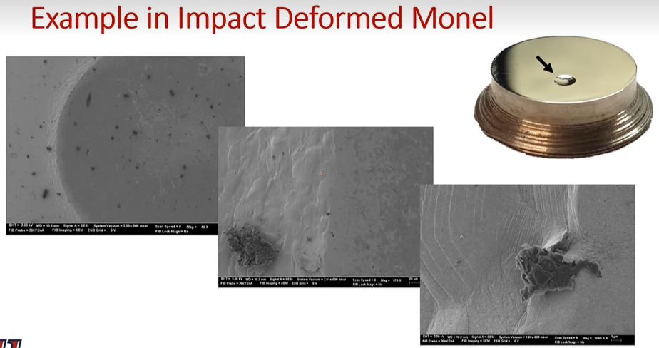 |
|:--:|
| Edge of indent shows texture from [[slip-plane]] from moving atoms out of the way of impact. Accumulates with amount of deformation applied. $\label{fig:impact_deformed_monel}$ |

### Summary
Important to have common understanding of vocabulary to describe crystal structure. We focus on *#bcc*, *#fcc*, and *#hcp* structures. Miller indices give exact orientation or active atoms/planes to determine the associated properties. The #apf is import to density and [[slip-system]], but it is not the only critical property.

---

*Lecture: September 01, 2021*

## Elasticity
### Introduction
Stresses occur at varying scales within a material. Macro-stresses include component design and assemblage. Micro-stresses are found within the material and include those from defects: dislocations, alloying elements. etcetera. Stresses at smallest scale act cumulatively to produce the response to the largest scale. This all relates to the **#CPSPP** relationship.

### Elastic
- Reverse deformation, that instantaneously recovers to its original dimensions after force is removed.
- Analogous to a spring, the relationship was conveniently described by Robert Hooke: $F = k\delta x$

#### Stress
- Stress is the result of applied force and response of material to balance external force.
	- Area resisting force is perpendicular to applied force line of action.
	- Material response is determined by atomic bonds and orientation relative to crystal lattice.
	- !!! note
			Polycrystalline materials assumed #anisotropic.
	- Component response dictated by design and material properties.
	- Tensile stress often positive in sign and compression is negative, by convention.

#### Strain
- Physical result of stress.
- Linear proportional to stress in Hookean material up to its elastic limit/yield stress.
- !!! note
		[[proportional-limit]] is that when the stress-strain deviates from linear and yield stress is at the 0.02% strain offset.
- Metals often Hookean in nature and assumed until otherwise stated.
- True strain: $\begin{equation}\epsilon = \frac{dl}{l}, \epsilon = \int_{l_{0}}^{l_{1}}\frac{dl}{l} = ln(\frac{l_{1}}{l_{0}})\label{
true_strain}\end{equation}$
- Engineering strain: $\begin{equation}\epsilon = \frac{\delta l}{l}\label{eq:engineering_strain}\end{equation}$

#### Engineering vs True Stress
- Comes from initial conditions and easily measured.
- !!! note
		Area does not change, so the initial area determines the stress throughout the entire deformation.
- True stress and strain are more accurate and use an instantaneous cross-section.
- In the elastic region for metals, deformation is typically small and engineering and true stress-strain values are comparable.
- $\sigma_{T} = \sigma(1 + \epsilon)$
- $\epsilon_{T} = ln(1 + \epsilon)$

|  |
|:--:|
| $\label{fig:stress_strain_curve}$ |

#### Notation!
Notation is not always the same.

$$\begin{equation}
\begin{bmatrix}
\sigma_{xx}, \tau_{xy}, \tau_{xz} \\\\
\tau_{yx}, \sigma_{yy}, \tau_{yz} \\\\
\tau_{zx}, \tau_{zy}, \sigma_{zz}
\end{bmatrix}\begin{bmatrix}
(x) \\\\
(y) \\\\
(z)
\end{bmatrix}\equiv\begin{bmatrix}
\sigma_{11}, \tau_{12}, \tau_{13} \\\\
\tau_{21}, \sigma_{22}, \tau_{23} \\\\
\tau_{31}, \tau_{32}, \sigma_{33}
\end{bmatrix}\begin{bmatrix}
(1) \\\\
(2) \\\\
(3)
\end{bmatrix}
\label{eq:tensor_notation}
\end{equation}$$

|  |
|:--:|
| $\label{fig:tensor_notation}$ |

#### Strain Energy
- Work done during deformation is converted to heat and internal energy.
- $W = Fd$, but $F$ is not constant!
- Elastic deformation does not typically produce much heat, so most is stored internally.
- $dU = dQ - dQ$
- $U = W$ (without heat)
- $W = \frac{1}{2}\sigma_{ij}\epsilon_{ij} = \frac{1}{2}E\epsilon_{ij}^{2} = \frac{1}{2E}\sigma_{ij}^{2}$

#### Shear/Torsion
- Shear and torsional stress are handled similarly, but vary by configuration.

|  |
|:--:|
| For a cylindrical punch, the average diameter of the punch and hole can be taken, and the area will be the circumference times the thickness of the material. $\label{fig:shear_stress_example}$ |

|  |
|:--:|
| For torsion of a rod, the stress and strain vary radially and axially. $\label{fig:torsional_stress_example}$ |

- $\tau = \frac{F}{A}$
- $\gamma = \frac{dl}{l} = tan\theta \cong \theta$
- $G = \frac{\tau}{\gamma}$

!!! question Why does $\gamma \cong \theta$?
	Small angle assumptions in radians mean that $sin\theta = \theta$.

#### Poisson's Ratio
$$\begin{equation}
\nu = -\frac{\epsilon_{11}}{\epsilon_{33}} = -\frac{\epsilon_{22}}{\epsilon_{33}}
\label{eq:poisson_ratio}
\end{equation}$$

|  |
|:--:|
| $\label{fig:poisson_ratio}$ |

- Describes the consequent strains orthogonal to an applied stress.
- Most metals are 0.3.
- For constant volume without lateral contraction, the ratio is 0.5 (plastic only).

#### Summary
- Elasticity affects everything, because it is initial response to stress.
- Material behavior in elastic region dictates behavior in application.
- Components rarely useful in plastic region, so they will spend their lifetime in the elastic range.
- Although elastic properties are commonly discussed at a continuum scale, we will find it important to atomic scale phenomena.

---

*Lecture: September 03, 2021*

### Elasticity: Polycrystalline Materials and Bulk Metals
#### Introduction
- Stress may be applied in any arrangement, and we can determine the overall conditions of strain.
- This is often reduced to two dimensions, but it does not have to be (it is just simpler).
- We can determine the state of stress as a point in any orientation (not just aligned with the applied stress) by using transformation techniques.
- Certain orientations will result in only normal or shear stresses, which can be important for determining the resulting performance.

#### Stress Tensor Revisited

|  |
|:--:|
| $\label{fig:cauchy_stress_tensor}$ |

- Cuachy stress tensor describes the complete state of stress in three dimensions.
- Valid for small deformations (Eq. \eqref{eq:tensor_notation}).

#### Hooke's Law Revisited
- Linear elastic response in homogeneous metals and alloys which allows us to relate stress and strain in three dimensions through the #poisson-ratio, $\nu$ \eqref{eq:poisson_ratio}.

$$\begin{split}
\epsilon_{11} &= \frac{1}{E}[\sigma_{11} - \nu(\sigma_{22} + \sigma_{33})] \\\\
\epsilon_{22} &= \frac{1}{E}[\sigma_{22} - \nu(\sigma_{11} + \sigma_{33})] \\\\
\epsilon_{33} &= \frac{1}{E}[\sigma_{33} - \nu(\sigma_{11} + \sigma_{22})] \\\\
\gamma_{12} &= \frac{\sigma_{12}}{G} \\\\
\gamma_{13} &= \frac{\sigma_{13}}{G} \\\\
\gamma_{23} &= \frac{\sigma_{23}}{G}
\end{split}$$

>**Example 1:** For the following stress tensor, what are the resulting normal strains if $E = 10e3 kip$ and $\nu = 0.3$?
$\sigma = \begin{bmatrix}5, 3, 2 \\\\ 3, -1, 0 \\\\ 2, 0, 4\end{bmatrix}kip$
$$\epsilon_{normal} = \begin{bmatrix}\frac{1}{10e3 ksi}[5 ksi - 0.3(-1 + 4)]ksi \\\\ \frac{1}{10e3 ksi}[1 ksi - 0.3(5 + 4)]ksi \\\\ \frac{1}{10e3 ksi}[4 ksi - 0.3(5 + (-1))]ksi\end{bmatrix}ksi = \begin{bmatrix}4.1e-4 \\\\ -3.7e-6 \\\\ 2.8e-6\end{bmatrix}$$

#### Simplifications
- To avoid complex tridimensional description of stress and strain, especially during plastic deformation, simplifications are possible.

[[plane-stress]]
: Strain and strain go to zero at free surface (normal and shear).

[[plane-strain]]
: One dimension is considered infinite.

- Conditions of [[pure-shear]] can also be considered, such that no normal forces are present.

$$\begin{bmatrix}
\sigma_{xx}, \tau_{xy} \\\\
\tau_{yx}, \sigma_{yy}
\end{bmatrix}\begin{bmatrix}
(x) \\\\
(y)
\end{bmatrix}$$

$$\begin{bmatrix}
\epsilon_{xx}, \gamma_{xy} \\\\
\gamma_{yx}, \epsilon_{yy}
\end{bmatrix}\begin{bmatrix}
(x) \\\\
(y)
\end{bmatrix}$$

#### #Mohrs-Circle Revisited
- A graphical way to represent stress transformation to alternative orientations.
- These are set of equations that describe stress transformation, but a graphical solution is often useful.

|  |
|:--:|
| $\label{fig:mohrs_circle_illustration}$ |

- Principal stress: maximum/minimum normal stresses (no shear)

|  |
|:--:|
| $\label{fig:mohrs_circle_transformation_equation_illustration}$ |

- $R = \sqrt{(\frac{\sigma_{11} + \sigma_{22}}{2})^{2} + \tau_{12}^{2}}$
- $\sigma_{11}' = \frac{\sigma_{11} + \sigma_{22}}{2} + \frac{\sigma_{11} - \sigma_{22}}{2}cos(2\theta) + \sigma_{12}sin(2\theta)$
- $\sigma_{12}' = -\frac{\sigma_{11} - \sigma_{22}}{2}sin(2\theta) + \sigma_{12}cos(2\theta)$

!!! example What is the stress state if rotated $30\degree$ CCW?
	|  |
	|:--:|
	| $\label{fig:mohrs_circle_example_problem_1}$ |
	*Given: $\sigma_{11} = -8 ksi, \sigma_{22} = 12 ksi, \sigma_{12} = -6 ksi$*
	Center point, $C = \sigma_{avg} = \frac{\sigma_{11} + \sigma_{22}}{2} = \frac{-8 + 12}{2} = 2 ksi$
	|  |
	| $\label{fig:mohrs_circle_example_1_problem_step_t_find_r}$ |
	$R = \sqrt{10^{2} + 6^{2}} = 11.66$
	|  |
	| $\label{fig:mohrs_cricle_example_1_problem_step_to_find_angle}$ |

	Use trig to find $\phi$ and $\psi$: $\phi = tan^{-1}(\frac{6}{10}) = 30.96\degree, \psi = 60 - \phi = 29.04\degree$
	$\sigma_{11}' = 2 - 11.66cos(29.04) = -8.2 ksi$
	$\sigma_{12}' = -11.66sin(29.04) = 5.66 ksi$

	|  |
	|:--:|
	| Slight drop increase of normal stress and slight decrease of shear stress. $\label{fig:mohrs_circle_example_1_complete}$ |
	|  |
	| Basic steps to find all stresses and strains at orientations relative to what you start with. $\label{fig:mohrs_circle_example_1_clean}$ |

---

*Lecture: September 06, 2021*

### Pure Shear
There exists a condition which has only shear stresses and no normal stress. This condition is called *[[pure-shear]]*, which means that $\sigma_{11} = -\sigma_{22}$. This implies that [[Mohrs-Circle]] is centered at the origin, because $\sigma_{avg} = 0$. Graphically, the maximum shear stress possible in this condition is the radius of [[Mohrs-Circle]] and at $90\degree$ from the horizontal. However, recall that angles in [[Mohrs-Circle]] are twice real angles: e.g. if $\theta_{Mohr} = 2*\theta_{real}$ and $\theta_{Mohr} = 90\degree$, then $\theta_{real} = 45\degree$.

|  |
|:--:|
| If a component experiences compression in one axis and tension in a perpendicular axis, then elements within the component experience [[pure-shear]]. $\label{fig:pure_shear_depicted}$ |

Using knowledge of this condition, we can find stress and strain information with the following relations:

$$\begin{split}
\epsilon_{11} &= \frac{1}{E}(\sigma_{1} - \nu\sigma_{2}) = \frac{\sigma_{1}}{E}(1 + \nu) \\\\
\tau &= -\sigma_{1} (on~circle,~with~sign~convention) \\\\
\tau &= G\gamma \\\\
\epsilon_{11} &= -\frac{G\gamma}{E}(1 + \nu) \\\\
2\epsilon_{11} &= -\gamma \\\\
G &= \frac{E}{2}(1 + \nu)
\end{split}$$

"(on circle, with sign convention)" holds true because the radius, $R$ of [[Mohrs-Circle]] is $\sigma_{1} = - \sigma_{1}$. Some of these relationships are not limited to [[pure-shear]], because $E, G \text{and} \nu$ are material properties.

Expressing three-dimensional stress is important, but can be achieved with tensor notation. Analysis of stress states can be reduced from three to two dimensions if assuming [[plane-stress]] (zero stress in third axis) or [[plane-strain]] (zero strain in third axis). This simplified analysis can be transformed to desired stress states by equations or [[Mohrs-Circle]].
Recall that [[Mohrs-Circle]] is a graphical representation of all possible stress states, but it must be drawn accurately that trigonometric functions might be used effectively.

### Elasticity: Atomic Bonds
#### Introduction
What preceded was continuum elasticity. What follows is observing the previously explored behaviors at the atomistic level. These behaviors determine the way force, stress, and strain occur. Characterizing these behaviors informs the results of bond strength in materials: we focus on metals. There exist competing behaviors of attraction and repulsion.

Continuum looks and homogeneous units wherein stress states are described without knowing the exact material makeup. Here, we can continue to ignore anisotropic conditions, but must observe the source of elasticity: atomic bonds. Strength of bonds determined by electronic characteristics, but can be influenced by external conditions: heat, magnetic fields, etcetera.

|  |
|:--:|
| We assume only planar, uniaxial attractions. $\label{fig:electronic_bonds_simplified}$ |

#### Atomic Bonding
Electronic bonds govern behavior of all material properties. All mechanical behavior first exhibits elastic behavior. These effects can be observed with a simple spring model between two atoms.

|  |
|:--:|
| Simplified spring model to visually show attractive and repulsive forces of electronic bonds between atoms. $\label{fig:simple_spring_model}$ |

#### Bond Interaction and Force
Two atoms will have an equilibrium separation, $r_{0}$. We assume this until some external influence is applied. The minimum bonding energy also occurs here. Repulsion is caused by the *[[Pauli-Exclusion-Principle]]* and attraction is *[[Coulombic-forces]]* in nature.

$$\begin{equation}
	U_{i} = -\frac{A}{r^{m}} + \frac{B}{R^{n}}
	\label{eq:bonding_energy}
\begin{equation}$$

|  |
|:--:|
| Electronic bonding occurs according to these two curves between any two atoms. $\label{fig:interaction_energy_and_force}$ |

!!! example
	Potential energy of $Na^{+}Cl^{-}$, an ionic pair, at distance $r$ where $q_{0} = 1.6e-19~[C]$, $\epsilon_{0} = 8.85e-12~[\frac{C}{N-m^{2}}]$, and $U_{i} = 1.12~[eV]$. If $r_{0} = 0.276~[nm]$, then find: **a)** the value of B; and **b)** the total, attractive, and repulsive forces at $r = 0.25 [nm]$.
	$$\begin{split}
	U_{i} &= -\frac{A}{r^{m}} + \frac{B}{r^{n}} \\\\
	U &= U_{i} - \frac{q^{2}}{4\pi\epsilon_{0}r} + \frac{B}{r^{9}}
	\end{split}$$
	Because $\frac{dU}{dr} = 0$ at $r_{0}$,
	$$\begin{split}
	\frac{dU}{dr} &= 0 = \frac{q^{2}}{4\pi\epsilon_{0}r^{2}} - \frac{9B}{r_{0}^{10}} \\\\
	\frac{q^{2}}{4\pi\epsilon_{0}r^{2}} &= \frac{9B}{r_{0}^{10}} \\\\
	\implies B &= \frac{r_{0}^{8}q^{2}}{36\pi\epsilon_{0}}
	\end{split} \\\\
	\begin{split}
	B &= 8.61e-106 [N-m^{10}]
	\end{split}$$
	$B$, then, is simply plugged into the following equations to find electronic bond forces at not the equilibrium distance, $r = 0.25 [nm]$.
	$$\begin{split}
	F &= \frac{dU}{dr} = F_{A} - F_{R} \\\\
	F &= \frac{q^{2}}{4\pi\epsilon_{0}r^{2}} - \frac{9B}{r_{0}^{10}}
	\end{split} \\\\
	\begin{split}
	F_{A} &= \frac{q^{2}}{4\pi\epsilon_{0}r^{2}} = 3.68e-4 [N] \\\\
	F_{B} &= \frac{9B}{r_{0}^{10}} = -8.13e-9 [N] \\\\
	\implies F &= 4.44e-9 [N]
	\end{split}$$

#### Stress and Strain in Bonds
Force is proportional to atomic displacement and change in energy. Stress requires number of atoms involved in some area by estimating atomic spacing at equilibrium, $r_{0}^{2}$. Strain, then, is the change in spacing divided by the equilibrium spacing. [[Youngs-modulus]] is a material property of stress over strain. These can be summarized by the following relations:

$$\begin{split}
F &= \frac{dU_{i}}{dr} \\\\
d\sigma &= NdF \\\\
d\sigma &= \frac{dF}{r_{0}^{2}} \\\\
d\epsilon &= \frac{dr}{r_{0}} \\\\
E &= \frac{Am(n-m)}{r_{0}^{m + 3}} \\\\
A &= \frac{q^{2}}{4\pi\epsilon_{0}} \\\\
E &= \frac{kq^{2}}{r_{0}^{4}}
\end{split}$$

|  |
|:--:|
| Stronger bonding can effect melting point, stiffness, etcetera. Understanding these effects informs how higher length scales behave under some condition. $\label{fig:outcomes_of_bonding}$ |

#### Summary
Bulk properties come from atomic bonds. Treatment of elasticity at atomic scale determines balances of attractive and repulsive forces; therefore, external forces cause a shift from the equilibrium state. Bond properties can be adjusted to preference with some processing technique: e.g. alloying.

---

*Lecture: September 09, 2021*

## Exam Review
**Miller Indices**
When drawing Miller indices--coordinates, vectors, and planes--keep to Fig. @fig-milled_index_axis convention. This makes grading quicker, because a different orientation is not necessarily wrong but are harder to grade.

|  |
|:--:|
| Keep cubes with z-vertical and #hcp with c-vertical. $\label{fig:milled_index_axis}$ |

#apf will be used in the exam (per the provided table from earlier lectures). **The content of the homework is the template for the exam: no new content on exams.** WRT to calculating unit cell mass, follow this algorithm example for iron (Fe):

$$\begin{split}
\rho &= \frac{nA}{V_{c}N_{A}}
\end{split} \\\\
\begin{split}
\rho_{Fe} &= (55 amu) (\frac{g}{mol}/1 amu) / (N_{A}) \\\\
\rho_{Fe} &= 3.053e-22 g/atom \\\\
\rho_{Fe, {\#bcc}} &= \rho_{Fe}*2/a_{0}^{3}
\end{split}$$

**Tensorial vs. Engineering Strain**

|  |
|:--:|
| Engineering strain keeps deformation in one axis. Actual strain is half that, but in two axes. $\label{fig:engineer_vs_tensor_strain}$ |

Because we know the relation, $\epsilon_{ij} = \frac{\gamma_{ij}}{2}$, we know $G = \frac{\tau}{\gamma} = \frac{E}{2(1 + \nu)}$. We can then know the deformation on some axis: e.g. $\gamma_{12} = \frac{\sigma_{12}}{G} = -37.1e-6$. But tensor notation for shear strain, $\gamma_{shear} = \frac{\gamma_{calc}}{2}$.

**Calculating Strains from Poisson's Ratio**
Because the compression test is performed in a single axis to squish some specimen, the other lateral strains can be calculated by assuming #plane-stress: zero stress in the direction normal to the thinnest dimension.

|  |
|:--:|
| $\label{fig:plane_stress_example}$ |

[[pure-shear]] occurs when $\sigma_{22} = -\sigma_{11}$. The shear stress, $\tau$ is the radius of [[Mohrs-Circle]]. The principal stress are the maximum and minimum of [[Mohrs-Circle]]. A stress tensor is the sum of the [[hydrostatic-stress]] and [[deviatoric-stress]] tensors: $[\sigma] = [\sigma_{hydro}] + [\sigma_{dev}]$, where [[hydrostatic-stress]], $\sigma_{hydro} = \frac{\sigma_{11} + \sigma_{22} + \sigma_{33}}{3}$ goes on the diagonal of the tensor and will cause a change volume, but not the object's shape. [[deviatoric-stress]]: (elements not on the diagonal) will change an object's shape, but not its volume.

|  |
|:--:|
| Remember that maximum shear on [[Mohrs-Circle]], at $90\degree$, is twice the angle in real space: i.e. [[pure-shear]] occurs $45\degree$ of the actual part. $\label{fig:pure_shear}$ |

---

*Lecture: September 13, 2021*

## Plasticity
### Introduction
Plasticity is sometimes involved with engineering design. It may also prove integral to performance. This chapter explores the importance the stress-strain behavior and the effects thereof.
Materials always follow elastic to plastic deformation before ultimate failure. Most applications will operate within the elastic region (ceramics with narrow elastic regimes), but accommodations for work-hardening may be considered. Not all materials work-harden the same way. Two yield points in materials: *first yield* is the elastic limit, and *ultimate strength* is ultimate plasticity. **Plasticity** is imperative for processing and performance of materials.

!!! tip
	Think of Dr. Atwater's lawn mower!

**Mechanical Testing** Determines mechanical properties for materials: such as various tension or compression. Tension is the most popular, but all give same information: *stress-strain* curve.

#### Engineering and true stress and strain
Recall that [[engineering-stress]] is from $A_{0}$ and [[true-stress]] uses $A_{i}$. *Plastic deformation is volume conservative*, which allows calculating [[true-stress]] and [[true-strain]] from the engineering values. Stress-strain curves relates initial conditions to overall performance.

|  |
|:--:|
| True stress-strain gives more accurate understanding of stress states, but can be more difficult to interpret. $\label{fig:stress_strain_curve_comparisons_true_to_engineering}$ |

!!! question Is conversion from engineering to true stress-strain meaningful with necking? <cite> DK
	It depends. We will discuss this later.

#### Work-Hardening Basics
*[[Ludwik-Hollomann]]* equations
: $$\begin{equation}\sigma = \sigma_{0} + K\epsilon^{n} \label{eq:ludwik_hollomann}\end{equation}$$ Where $\sigma_{0}$ is the yield stress, $K$ is experimentally found ($\frac{G}{100}-\frac{G}{1000}$); $\epsilon$ is true strain; and, $n$ is some work hardening coefficient (0.2-0.5).

!!! example Use the *[[Ludwik-Hollomann]]* equation (Eq. \eqref{eq:ludwik_hollomann}) to determine work hardening exponent, $n$ in an alloy of true strain at 0.1 and true stress = 415 MPa. Assume $K = 1035 MPa$ and $\sigma_{0} = 0$.
	$$\begin{split}
	\sigma &= \sigma_{0} + K\epsilon^{n} \\\\
	log[\sigma &= \sigma_{0} + K\epsilon^{n}] \\\\
	log(\sigma) &= log(K) + n*log(\epsilon) \\\\
	\frac{log(\sigma) - log(K)}{log(\epsilon)} &= n
	\end{split} \\\\
	\begin{split}
	\implies n &= \frac{log(415) - log(1035)}{log(0.1)} \\\\
	n &\approx 0.397
	\end{split}$$

	!!! note
		The greater, $n$, the more work-hardening can occur.

**Refined Methods**
*L=H* has limits; therefore, *Voce* equations adds asymmetry. *[[Johnson-Cook]]* expands with strain-rate and temperature dependence:

$$\begin{equation}
\sigma = (\sigma_{0} + K\epsilon^{n})\bigg(1 + C*ln(\frac{\dot{\epsilon}}{\dot{\epsilon_{0}}})\bigg)\bigg[1 - \bigg(\frac{T - T_{r}}{T_{m} - T_{r}}\bigg)^{m}\bigg]
\label{eq:johnson_cook}
\end{equation}$$

Each term in the *[[Johnson-Cook]]* equation represents a different failure mechanism.

**Volume Conservation**
Volume is assumed to be constant through deformation; however, volume is not always assumed constant in the elastic region. *[[poisson-ratio]]*, $\nu$ is constant in the elastic region, but varies in the plastic region. True and engineering stress-strains considered equivalent up to elastic limit.

|  |
|:--:|
| Steels have upper and lower yield limits to break dislocations apart. $\label{fig:stress_strain_jog}$ |

#### Summary
Plasticity introduces new requirements to calculate stress and strain. Elastic portion considered inconsequential and plastic deformation is volume constant.

---

*Lecture: September 15, 2021*

### Tensile Curve Parameters, Necking, and Strain Rate
Features of the stress-strain curve indicate when necking occurs, and give insight when correction factors apply: only when cylindrical samples neck. New equations for material behavior after necking. [[strain-rate]] affects material response as well.

#### Introduction
Tensile testing is the most basic form to determine material properties. Parameters of test affect outcome: temperature, etcetera.

|  |
|:--:|
| *A:* $0.2\%$ strain offset yield stress. *B:* #upper-yield. *C:* #lower-yield. *D:* #proportional-limit. *D`:* #ultimate-tensile-strength (UTS). *E:* #rupture-stress. *F:* non-uniform plastic strain limit. *G:* #rupture-strain (strain to failure). *H:* lower yield region. The area under the elastic region is the *#modulus-of-resilience* and *#toughness* is area under entire curve. $\label{fig:tensile_curve_features}$ |

The more dislocations/impurities, the more local stresses exist, and more global force is required to overcome the sum of the internal stress: this is true for plain carbon steels.

!!! note Items of Note
	1. Yielding is preceded by *micro-yielding*, where  [[dislocation-motion]] can occur below traditional yield stress.
	2. Upper-lower yield behavior is largely seen in plain, low-carbon steels.
	3. Vacancy and dislocation pinning resist initial yielding.
	4. [[strain-rate]] will modify the tensile curve and can obscure the upper-lower yield phenomenon when present.

#### Necking
Occurs when localized deformation begins to dominate the strain: *void nucleation, coalescence, and growth*. This is also known as *[[plastic-instability]]* and is defined by **[[Considere-Criterion]]**: increase in stress relative to strain (work-hardening) reaching a maximum in the engineering stress-strain curve. *The higher the strain exponent, the more strain you get out of the material.* Using this criterion, substituting true stress-strain into the derivative and apply Eq. \eqref{eq:ludwik_hollomann}, you get the relationship $\epsilon_{u} = n$, where $\epsilon_{n}$ is maximum, uniform plastic strain.

Work-hardening exponent from *engineering* stress-strain curve. [[work-hardening]] decreases during increase of plastic strain until that point at which necking occurs. A metal unable to work-harden immediately reaches the point of necking after yielding, which is consistent with equations.

[[work-softening]]
: The more it deforms, the easier it can be deformed (not necessarily from reduced area)--is possible under extreme conditions.

!!! tip
	Think of void nucleation, coalescence, and growth!

#### Stress-strain and Necking
After necking, instantaneous cross-sectional area must be continuously determined. Neck acts as a "second", miniature tensile specimen, so it's strain-rate is higher from shorter length. Irregular geometry of neck also introduces triaxial flow stress. Magnitude of transverse stresses depends on sample and neck geometry and strain-rate.

##### Bridgman Correction
This only applies to *cylindrical* samples, because sample area and neck radius must be known.

$$\begin{equation}
\sigma = \frac{\sigma_{avg}}{(1 + 2\frac{R}{r_{n}})ln(1 + \frac{r_{n}}{2R})}
\label{eq:bridgmann_correction}
\end{equation}$$

$R$ is radius of curvature of the neck, and $r_{n}$ is the cross-sectional radius at thinnest part of neck. The further away from necking (higher strains), this correction factor increases.

##### State of Stress in Deformation
Necking is onset of failure in a non-uniform fashion. Applies only to tensile testing, because compression samples *barrel*. Necking can be suppressed to achieve higher strains in more complex stress states.

|  |
|:--:|
| Wire drawing shows ability to achieve 7.4 true strain of copper. $\label{fig:wire_drawing_example}$ |

#### Strain Rate
Increasing [[strain-rate]] work-hardens faster: **void nucleation controls**!! This parameter is part of stress-strain-rate relationship: $\sigma = K\dot{\epsilon}^{m}$. $m$ can be found from a jump test between two strain-rates using the [[Ludwik-Hollomann]] equation: $m = \frac{ln(\frac{\sigma_{2}}{\sigma_{1}})}{ln(\frac{\dot{\epsilon_{2}}}{\dot{\epsilon_{1}}})}$.

**Strain-rate In Practice**
Strain-rate can vary from $10^{-6}s^{-1}$ to $10^{6}s^{-1}$. Tensile tests usually within $10^{-4}s^{-1}$ to $10^{-1}s^{-1}$. High [[strain-rate]] (Hoppy bar) and creep or stress relaxation tests invaluable to determine material behavior under extreme conditions. Creep and stress relaxation tests incorporate higher temperatures, which is important to material performance.

Strain-rate affects material behavior. Increasing [[strain-rate]] often increases yield stress and the [[work-hardening]] rate. Typically, $0.02<m<0.2$ for $0-0.9T_{H}$.

**Super-plastic Behavior** Effective [[strain-rate]] in necking area increases. Positive [[strain-rate]] sensitivity implies an increased stress and the yield point will shift to the weaker section. Same concept that assists in distributing strain across tensile specimen length in [[work-hardening]].

#### Summary
Stress-strain curve contains much information, but not all can be known from only the engineering curve. Necking changes specimen geometry, which affects test results. Stress states may control onset and progression of necking, which may allow for much higher strains before failure. [[strain-rate]] affects material response and is dependent on processing and performance applications.

---

*Lecture: September 17, 2021*

### Compression and Hardness
#### Introduction
Many applications use compressive stresses; therefore, testing for compression is more relevant. Some materials perform well under compression and not tension. Simpler and more cost-effective to perform compression tests; therefore, metal alloy research heavily utilizes this method.

#### Practical Considerations
Compression is simple but requires care to ensure good data. Plate alignment and sample parallelism and flatness are imperative. Lubricant between plates and sample reduce barreling. Machine compliance must be removed from measured stress-strain curve, especially at lower strains. Can also measure strain from video recordings and point markers on sample.

!!! tip
	Plates should be much harder than the sample.

#### Compression Curve
Stress-strain opposite from tensile curve. Barreling is source of non-uniform plastic strain.

|  |
|:--:|
| True stress-strain moves the curve down and to the right from the engineering stress-strain curve, which is opposite that seen for tension testing. $\label{fig:compression_stress_strain_curve_with_barreling}$ |

Effects of barreling most pronounced at strains exceeding 0.4; therefore, compression testing usually limited to less than that. Friction is very important when initial $\frac{height}{diameter}$ is reduced: if too tall and thin, the specimen will buckle first.

#### Compression Failure
If perfectly striked, stress state greatly varies through specimen. Although extreme, ductility allows for stress-strain behavior off the central axis. Non-uniform stress occurs, then, across top and bottom surfaces (friction hill).

$$\begin{equation}
p = \sigma_{0}\exp(\frac{2\mu(a - r)}{h})
\label{eq:friction_hill_pressure}
\end{equation}$$

$\mu$ is coefficient of friction, $r$ is distance from center, $a$ is radius of sample, and $h$ is height of sample.

|  |
|:--:|
| Friction hill seen at top and bottom surfaces of sample when barreling. $\label{fig:compression_failure_friction_hill}$ |

!!! example If $\frac{height}{diameter} = 2$, then what is $p_{max}$?
	$$\begin{split}
	\frac{l}{d} 	&= 2 \\
	p 	&= \sigma_{0}\exp(\frac{2\mu(a - r)}{h})
	\end{split} \\
	\begin{split}
	p &= \sigma_{0}\exp(2(0.15)(\frac{a}{h})), \frac{d}{h} = \frac{1}{2}(\frac{\frac{a}{2}}{h}) = \frac{1}{2} \longrightarrow \frac{a}{h} = \frac{1}{4} \\
	\implies p 	&= \sigma_{0}\exp(2(0.15)(\frac{1}{4})) \\
	&= \sigma_{0}\exp(\frac{0.3}{4})
	\end{split}$$

#### Bauschinger Effect
If you pull something in tension, then switch to compression, the yield point will lower from tension to compression. The strain in the material from tension weakens the material and causes a lower yield point: the *[[Bauschinger-Effect]]*.

#### Hardness Testing
**Hardness is a material's resistance to plastic flow by indentation.** Scale of indentation varies with load, which is standardized with the indenter while its displacement is measured.

Brinell
: Uses a hard sphere of known dimension and known force to measure the size of indent. Amount of applied force changes size of indention.
$$\begin{equation}
HB = \frac{P}{\pi Dh} = \frac{2P}{\pi D(D - \sqrt{D^{2} - d^{2}})}
\label{eq:brinell_hardness_number}
\end{equation}$$

Rockwell
: Testing is simple, provides direct, arbitrary hardness reading, but relatable to known values.
$$\begin{equation}
HB_{Meyer} = \frac{4P}{\pi d^{2}}
\label{eq:meyer_hardness_number}
\end{equation}$$
: Useful on a wide range of materials.
: *Testing Process:*
: - Apply pre-load.
: - Apply indentation load.
: - Remove "major" load from specific indenter and load.
: - Measure depth read on scale: 0-100.

Indenter geometry will determine scale: A, B, or C. *Rockwell-C* is best for harder steels and metals of similar properties. Superficial scales for thin samples with lower loads to avoid anvil effects.

Vickers
: Also known as *Diamond Pyramid*, because indenter is pyramid with $136\degree$, which is based on $d_{Brinell} = 0.375D$ relationship. Can be used on any material. Indentation size measured by average length across diagonals. Hardness computed by...
$$\begin{equation}
HV = \frac{2Psin(\frac{\alpha}{2})}{d^{2}} \approx = \frac{1.8544P}{d^{2}}
\label{eq:vickers_hardness}
\end{equation}$$

#### Hardness-Yield Relationship
For Vickers hardness, measured value is related to yield stress through Tabor's relation (Eq. \eqreftabor_relation{eq:tabor_relation}):

$$\begin{equation}
H = 3\sigma_{y}
\label{eq:tabor_relation}
\end{equation}$$

This assumes no [[work-hardening]]; therefore, use $\epsilon_{p} = \frac{d'}{5D} \approx 0.075$ for $d = 0.375D$ with a flow stress, $\tau = 8-10 \%$ in hardness conversions.	

#### Micro-Indentation Testing
Creates indent that 10's of microns in size.

!!! note
	Vickers is macro- and micro-indent test method: wherein, anything below $200g$ force is considered micro-testing.

Allows testing of small features: particles or areas of grain. Ability to probe microscale features limited if larger scale features dominate material.

$$\begin{equation}
KHN = \frac{14.228}{L}
\label{eq:knoop_hardness}
\end{equation}$$

#### Nano-Indentation Testing
Highly sensitive force-displacement device, which allows for general microstructural investigation at lowest length scales. Examine small volume of material with *Berkovich* indenter.

$$\begin{equation}
H = \frac{P_{max}}{A}
\label{eq:berkovich_hardness}
\end{equation}$$

### Summary
Compression testing is opposite tension. Equations of true stress-strain are same, but have different effects. Hardness provides simple means...

## Defects
### Introduction
Crystal structure assumes perfect patterns.

### Theoretical Shear Strength
If we consider material failure when a crystal fails, then we must shift the nearest neighbors of all atoms on a  [[slip-plane]] simultaneously. Each bond must be stretched and broken together, each of which has an associated unit of energy. According to [[Frenkel]], for two rows of atoms, shear stress follows a sinusoidal shear stress behavior that atoms in equilibrium, $a_{min}$ and metastable equilibrium, $a_{max}$.

**#fcc Strength**
Crystal structure...

### Point Defects
Affects a single lattice site. Can be a:
- [[vacancies]] : missing atoms.
- [[interstitials]]/self-interstitial: an extra atom between lattice sites.
- [[substitutionals]]: different atom in regular lattice.

[[vacancies]] introduces stress fields but are critical to diffusion processes. In compounds, [[vacancies]] introduce other non-equilibrium conditions: e.g. charge imbalance.

|  |
|:--:|
| $\label{fig:point_defect_examples}$ |

#### Interstitial Defects
Position of [[interstitials]] defects vary by crystal structure.
##### #fcc sites
##### #bcc sites
##### #hcp sites
#### Equilibrium Concentration
[[vacancies]] and self-[[interstitials]] are thermodynamically favorable. No work is done creating a point defect, so some heat is required. Configurational entropy is increased by defect formation but goes to 0 at $0 K$. Concentration determined by: $$\frac{n}{N} = \exp(-\frac{G_{f}}{kT}), k = 8.62e-5\frac{eV}{K} tag{eq:equilibrium_concentration} \label{eq:equilibrium_concentration}$$

!!! example Find equilibrium concentration of vacancies at $1000\degreeC$ for Cu, where $G_{f} = 0.9 \frac{eV}{atom}$, $A_{Cu} = 63.5 \frac{g}{mol}$, and $\rho_{Cu} = 8.4 \frac{g}{cm^{3}}$.
	
	$$\begin{split}
	\frac{n}{N} &= e^{-\frac{G_{f}}{kT}}, N = \frac{N_{A}\rho}{A_{Cu}} = 7.97e28 \\\\
	\implies n &= Ne^{-\frac{G_{f}}{kT}} \\\\
	&= 7.97e28e^{-\frac{0.9}{8.62e-5(1273)}} \\\\
	&= 2.2e25\big[\frac{1}{m^{3}}\big]
	\end{split}$$

#### Vacancy or Self-Interstitial?
Either [[vacancies]] or self-[[interstitials]] can be formed thermodynamically, but not equal in likelihood or concentration.
Formation energies related by $\frac{G_{i}}{G_{v}}$, but concentrations require calculation: $$\frac{X_{v}}{X_{i}} \approx \exp(\frac{G_{i} - G_{v}}{kT})$$

#### Equilibrium Concentration
[[vacancies]]

#### Vacancy Formation
High [[vacancies]] concentration occurs at elevated temperatures and rapidly quenched.
Retaining [[vacancies]] requires no significant sources of sinks to absorb them: grain boundaries, surface area, dislocation, etcetera...
Cold working increases defect concentration, as opposite sign dislocation combine to form rows of [[vacancies]] or [[interstitials]].
*[[climb]]* is [[dislocation-motion]] not on a [[glide]]-plane but at elevated temperatures.

#### Effect on Mechanical Properties
Point defects not created in isolation by deformation, but high concentration can be made by irradiation.
High-energy bombardments displace atoms to cause self- [[interstitials]], which produces [[vacancies]].
Single crystal strength increases orders of magnitude when [[vacancies]] are quenched.
Plastic deformation

#### Summary
Point defects exist in all crystals, but concentration is affected by processing and temperature.
Self-[[interstitials]] can be increased with plastic strain, which produces other types of defects.
High concentrations of defects...

### Line Defects
| 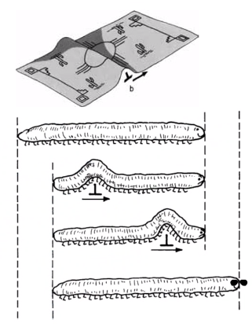 |
|:--:|
| [[dislocation-motion]] through material sometimes thought as pushing a kink through a rug, or a caterpillar crawling. $\label{fig:dislocation_caterpillar}$ |

### Types of Dislocations
Basic understanding of dislocation results in two options:
1. [[edge-dislocations]]
2. [[screw-dislocations]]

|  | 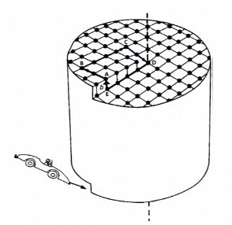 |
|:--:|:--:|
| Often thought as extra "half-plane" of atoms: the **[[burgers-vector]]**. $\label{fig:edge_dislocation_example}$ | Helical interruptions of the crystal lattice. $\label{fig:screw_dislocation_example}$ |

Continuous variations can exist in a material between these two types of dislocations.

#### Edge and Screw Character
If [[burgers-vector]], $\burgers$ is perpendicular to dislocation line, $l$, then it is an [[edge-dislocations]].
If [[burgers-vector]], $\burgers$ is parallel to dislocation line, $l$, then it is a [[screw-dislocations]].
i.e. dislocation character = $\begin{cases}\burgers \perp l,~edge \\\\ \burgers \parallel l,~screw\end{cases}$
Mixed dislocations are combinations of these.

#### Dislocation Motion
[[edge-dislocations]] and [[screw-dislocations]] achieve the same thing in various ways.
[[dislocation-motion]] along [[slip-plane]] is called [[glide]].
[[dislocation-motion]] perpendicular to [[slip-plane]] is called [[climb]].
Transfer of dislocation from one [[slip-plane]] to another is called [[cross-slip]].
Immobile dislocations are called [[sessile]], while mobile ones are called [[glissile]].

|  |
|:--:|
| Visualizing how dislocations move is not as important as knowing the equations. $\label{fig:dislocation_motion_types}$ |

#### Bubble Rafts
Dislocations were considered many years before experimentally validated.
|  |
|:--:|
| One means $\label{fig:bubble_raft_example}$ |

|  |
|:--:|
| *Video* Experiments with the bubble model of metal structure 1952 - sir lawrence bragg. |

---

*Lecture: September 24, 2021*
#### Dislocation Confirmation
#TEM microscope sends electrons to interact with the medium of material that the interaction might be viewed. Variety of characterization techniques reveal their presence, which causes [[crystal-lattice]] distortions. For seeing [[dislocation-motion]] [[glide]] watch EXbiEopDJ_g

*[TEM]: Transmission Electron Microscope

#### Dislocation Looping
Dislocations forms loops with both edge and [[screw-dislocations]] pairs of opposite signs. Positive edge: $\perp$; negative edge: $\top$; positive screw: $S$; negative screw; &#423;.

|  | 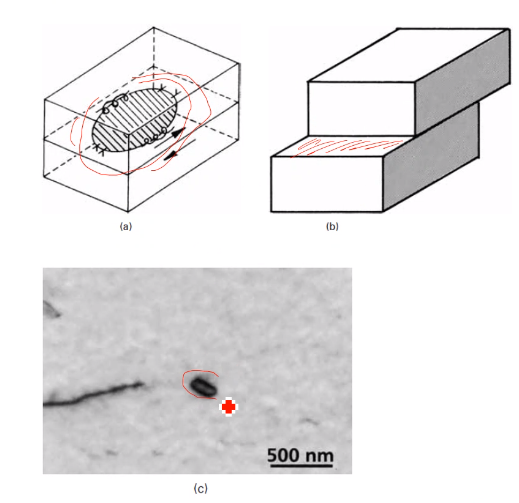 |
|:--:|:--:|
| Loops are not square in reality, because it is more energetically favorable to be elliptical. $\label{fig:dislocation_looping_examples}$ | Under shear, loop expands to all edges, which then produces the shear $\label{fig:dislocation_loop_example}$ |

#### Prismatic Loops
[[prismatic-loops]] occur when extra disc of atoms are inserted to the [[crystal-structures]] (or removed), and not [[glissile]] like a "common" loop.

|  |
|:--:|
| bar $\label{fig:prismatic_loop_example}$ |

#### Loop Expansion
| 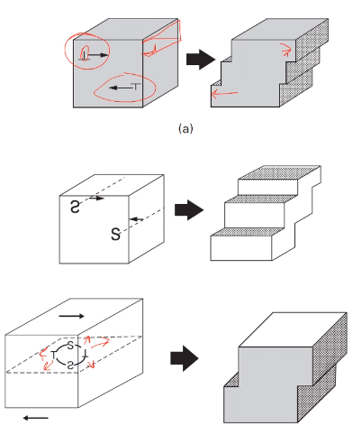 |
|:--:|
| Common dislocation loops have no incompatibility between dislocation moving in loop plane. Dislocation character allows expansion in each direction until loop eventually creates a unit step in the [[crystal-structures]]. $\label{fig:loop_expansion_example}$ |

#### Stress Around Dislocations
Defects introduce stress/strains due to imperfect lattice spacing. If continuum understanding for infinite, straight line is assumed, then calculation is greatly simplified, and a cylinder is sufficient to portray the concept.

|  |
|:--:|
| A hollow center is assumed to avoid infinite stress, and it is appropriate since real are not continuous but periodic. $\label{fig:stress_around_dislocations}$ |

#### Stress Equations for [[screw-dislocations]]
Relating stress and strain through [[Hookes-Law]]. $\sigma_{11} = \sigma_{22} = \sigma_{33} = \tau_{12} = \tau_{21} = 0$. $$\begin{split}\tau_{13} = \tau_{31} &= -\frac{Gbx_{2}}{2\pi(x_{1}^{2} + x_{2}^{2})} \\\\ \tau_{23} = \tau_{32} &= \frac{Gbx_{1}}{2\pi(x_{1}^{2} + x_{2}^{2})}\end{split} \label{eq:screw_dislocation_stress}$$

| 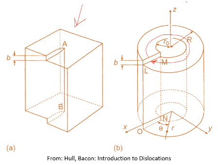 |
|:--:|
| Dislocation motion increments by 1 [[burgers-vector]]. $\label{fig:screw_dislocation_stress_example}$ |

#### Stress Equations for [[edge-dislocations]]
|  |
|:--:|
| $$\begin{split}\end{split}$$ $\label{fig:edge_dislocation_stress_equation_example}$ |

### Summary
Dislocations are critical to understanding macroscale deformation and strengthening mechanisms. Dislocations can interact to form loops, which result in same shear on crystal as a dislocation passes through, as long as loop is not prismatic. All of this discussion is for plastic deformation.

!!! attention Critical Review Topic
	==Due October 15==. Be thinking of a topic related to this material, which also correlates to your own research.*

### Imperfections: Dislocation Energy and Bowing
Quantify energy around dislocations and determines relationships...Take the energy at each dislocation and determine how difficult to move that dislocation. This correlates to [[dislocation-energy]] and [[dislocation-density]], etcetera. Dislocations act like a line, fixed in space and is allowed to bow out: like blowing a bubble.
Dislocations are never alone. Their relation determines their [[dislocation-energy]]. For some number of dislocation, [[volumetric-density]] can be found. Idealized [[dislocation-energy]] applies to a straight dislocation.

#### Energy Around A Dislocation
Each dislocation exhibits elastic deformation energy around it in three dimensions. Those energy distributions vary with orientation and type (normal vs. shear stress).

#### Deformation Energy
Elastic deformation related to magnitude of area displacement under a straight line (ideally). Stress-strain relationship according to [[Hookes-Law]]. Displacement dictated by [[burgers-vector]]. Displacement in-plane relates to distance from dislocation core: $\approx 5b$.

$$\begin{split}
U &= \frac{1}{2}\sigma_{ij}\epsilon_{ij} \\
	&= \frac{1}{2G}\bigl[\bigr] \\
\end{split}$$

| 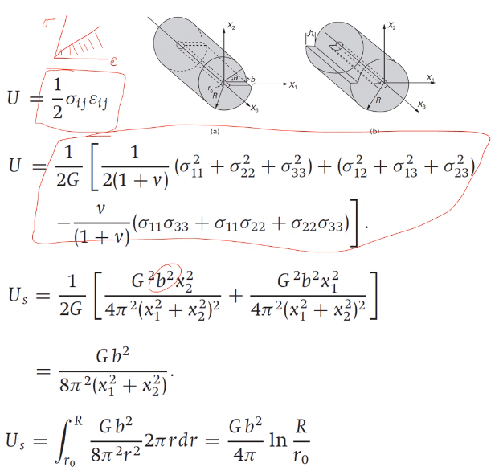 |
|:--:|
| bar $\label{fig:foo}$ |

#### Screw Versus Edge Dislocations Energy
Equations for stress around dislocation vary between screw and edge. Energy of [[screw-dislocations]] is $\approx\frac{2}{3}$ the [[edge-dislocations]] energy. $U\longrightarrow \infty~as~R\longrightarrow\infty$, but $R$ is average distance between dislocations.

|  |
|:--:|
| bar $\label{fig:foo}$ |

#### Dislocation Density
Unit area and volume considered to determine [[dislocation-density]] and interaction. The area/volume considered bounded by straight dislocations. From these densities, $R \approx \frac{1}{\sqrt{\rho_dsl}}$. Orientation matters! $$\alpha = \begin{cases}\frac{\pi}{2}, edge \\ 0, screw\end{cases}$$. Energy of core$\dots$

| 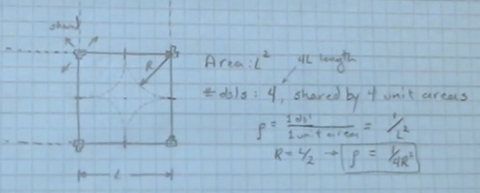 |  |
|:--:|:--:|
| Think of these as the "Internet *influencers*" of metals. Dislocations are counted in 4 squares; therefore, only 1 total dislocation: $\rho = \frac{1}{4R^{2}}$. $\label{fig:dislocation_radius_of_influence_example_1}$ | Each side of the cube is a dislocation line: $\rho = \frac{3}{4R^{3}} \implies R \approx \rho^{-\frac{1}{2}}$. $\label{fig:dislocation_radius_of_influence_example_cube}$ |

If these above examples are not helpful, just think of the equations.

#### Dislocation Bowing
|  |
|:--:|
| $F_{1}$ is the force to retain shape, and $F_{2}$ is the applied load to cause bowing. $\label{fig:dislocation_bowing_picture}$ |

Dislocations are not straight in practice, but understanding deformation is crucial to other factors: e.g. propogation. Dislocations can be thought to resist bowing by line tension, which is a function of unit length. Remember [[small-angle-assumption]]: $sin(\theta) = \theta,~sin(\frac{d\theta}{2}) = \frac{d\theta}{2}$

#### Peach-Koehler Equation
The [[Peach-Koehler-Equation]] converts force to stress. Considering a unit cube with a dislocation on $x_{1}$ moving some distance in $x_{2}$ in cube height of $x_{3}$. To get the work done, $F$, the force (per unit length) must be multiplied by length $x_{1}$ and distance $x_{2}$. Strain energy equal to work $\dots$

|  |
|:--:|
| bar $\label{fig:foo}$ |

|  |
|:--:|
| The book has a typo and actually refers to Eq. 4.22b! $\label{fig:peach_koehler_equation_example}$ |

---

*Lecture: September 27, 2021*
### Partial Dislocations
#### Introduction
Dislocations are not as simple as traditional imagery. There exist import energy considerations.

#### Real Dislocations
Traditional representation of [[dislocation-motion]] is simple, 2D cubic structure where movement of dislocation restores perfect crystal: $\mathbf{b} = a$ in $[100]$. Real crystals, especially #fcc, a dislocation may change the structure and is considered a partial/imperfect dislocation. To move from one dislocation to the next, atoms do not necessarily travel over each other, but between each other, to minimize work-energy of motion.

#### Partial Dislocations in Close-Packed Planes
| 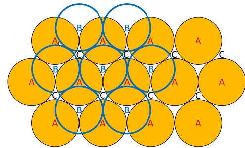 |
|:--:|
| Easier for atoms to move along $(111)$ in grooves between atomic positions, not over top. This requires two movements to restore original stacking pattern. $\label{fig:real_dislocation_in_close_packed_plane_example}$ |

|  |
|:--:|
| bar $\label{fig:real_dislocation_in_close_packed_plane_example_move1}$ |

|  |
|:--:|
| bar $\label{fig:real_dislocation_in_close_packed_plane_example_move2}$ |

Overall motion of one [[burgers-vector]], $\burgers$.

#### Visualizing fcc Partial Dislocations
|  |
|:--:|
| Translation of $\burgers_{1} = 2R$. The direction, $\burgers_{1} = [\bar{1}10]$, which, in vector notation, is $\burgers_{1} = a(i + i + 0k)$. $\|\burgers_{1}\| = 2R = \frac{a}{\sqrt{2}} = \frac{a}{2}[\bar{1}10] = \frac{1}{2}[\bar{1}10]$ $\label{fig:visualizing_fcc_partial_dislocations}$ |

$\burgers_{2}$ and $\burgers_{3}$ will be in same plane for energetically favorable motion.

!!! question Do partial dislocations stop forming in some metals?
	One partial can shift an row of atoms over; therefore, this changes the stacking pattern, which may be corrected later.

#### Determining the Partial Direction and Magnitude
|  |
|:--:|
| Moving from one interstitial site to the next. $\label{fig:partial_dislocation_direction_magnitude_example}$ |

#### Decomposition of $\burgers_{1}$
|  |
|:--:|
| [[burgers-vector]], $\burgers_{1}$ is mathematically equivalent to addition of two partial dislocations, $\burgers_{2}$ and $\burgers_{3}$. The scalar product should be zero in a single plane where $[111] \perp (111)$. $\label{fig:decomposition_of_burgers_vector}$ |

#### Partial Dislocation Energy
|  |
|:--:|
| Because $\burgers$ is lower $\dots$ $\tag{fig:partial_dislocation_energy_example} \label{fig:partial_dislocation_energy_example}$ |

#### Stacking Faults
Two partial dislocations repel one another, but the change in stacking sequence causes an increase in energy. Spacing of the partials, $d$ is determined by this energy balance. The [[stacking-fault-free-energy]] (#SFE) is strongly affected by composition, with alloys having a lower SFE than pure metals. Low #SFE metals will be dominated by [[stacking-faults]] with fewer dislocation cells or tangles. $\dots$

*[SFE]: Stacking Fault Energy

|  |
|:--:|
| Upper-right is a tangle of dislocation faults. Lower-right (plaid) is different stacking patterns in the stacking faults. $\tag{fig:stacking_fault_examples} \label{fig:stacking_fault_examples}$ |

#### Sessile Dislocations
Energetically favorable to have dislocations. Addition or subtraction of plane of material causes an immobile [[stacking-faults]], which is not energetically favorable. Removal of layer in *intrinsic*

#### Lomer-Cotrell Locks
|  |
|:--:|
| Two [[glissile]] dislocations may interact and produce a [[sessile]] dislocation if they start on intersecting planes. *Think of a headlock.* $\tag{fig:lomer_cotrell_lock_example} \label{fig:lomer_cotrell_lock_example}$ |

#### HCP Dislocations
Close-packed plane is [[basal-plane]], which form *intrinsic* [[stacking-faults]]. [[basal-plane]] is preferred plane$\dots$

#### BCC Dislocations
Not usually energetically favorable, so rarely seen.
|  |
|:--:|
| All share same [[slip-plane]]. $\tag{fig:bcc_dislocation_example} \label{fig:bcc_dislocation_example}$ |

#### Summary
Lowest energy portion is preferable mechanism for [[dislocation-motion]]$\dots$

|  |
|:--:|
| To determine which is energetically favorable, simply plug-n-chug. $\|\burgers\| = \sqrt{b^{2}}$ $\tag{fig:problem_4_28_solution} \label{fig:problem_4_28_solution}$ |

---

*Lecture: September 29, 2021*
##### Dislocation density, homogeneous nucleation
An annealed, polycrystalline metal may have a dislocation density of about $10^{7}cm^{-2}$, but after only 10% strain, the density increases three orders of magnitude. Intuitively, dislocations should be annihilated upon gliding on a free surface. Simplest way dislocations could be produced is through direst shear resulting in two dislocations of opposite signs forming, but the stress to do so is comparable to the theoretical strength (all bonds at once) and is therefore unlikely to contribute in a meaningful way. Dislocations sometimes get stuck and bogged down.

#### Dislocation Sources
Stress concentrations and higher energy are potential sources for dislocations to be formed. Grain boundaries, the irregular steps a ledges of the atoms along them act as dislocation sources: considered important to early dislocation emission at the early stages of deformation. Stress concentrations exist here. Free surfaces, with similarities to internal surface work similarly, but are not dominate in polycrystalline materials. Discontinuities in structures which nucleate dislocations. Precipitates or other phase discontinuities can also assist in dislocation emission.

#### Frank-Read Source
Dislocations can become immobilized by other dislocations or cross-slipped segments. With increasing stress, the pinned segment will bow out: recall that dislocations are defined as having a unit length energy or line tension. After sufficient stress, the dislocation bows out so far that the opposing segment ends meet and reconnect because of the their opposite signs. *Think of the lollipop in the balloon.*

| 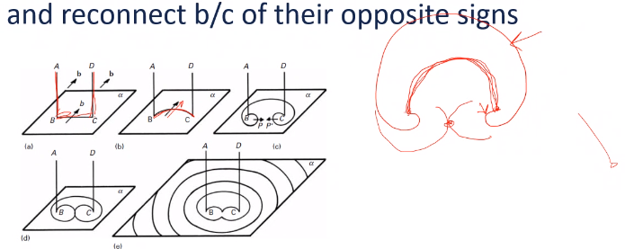 |
|:--:|
| The semi-circle is the highest energy state, but if you can overcome that, then a #FRS is activated and dislocations are nucleated. $\tag{fig:frank_read_source_example} \label{fig:frank_read_source_example}$ |

The radius of curvature reaches minimum when equal to one-half the length of the straight line segment (unbowed or spacing between pinned points), which is semi-circular. The [[Peach-Koehler-Equation]] applies here, with the value of $R$ being spacing of pinned points. **Formed dislocations create a back stress.** [[Frank-Read-Source]] (#FRS) are not common in real experiment.

*[FRS]: Frank Read Source

#### Cross-Slip and Dislocation Multiplication
Standard #FRS is unlikely route for dislocation multiplication. Many complicated interactions between dislocations in 3D, which create nodes and similar behavior. A [[screw-dislocations]] may [[cross-slip]] to a parallel plane, thereby pinning the segment in #FRS fashion. Dislocation may also be generated at interfaces with differing lattice parameters.

|  |
|:--:|
| Epitaxy includes other phase boundaries. $\tag{fig:dislocation_multiplication} \label{fig:dislocation_multiplication}$ |

|  |
|:--:|
| [[burgers-vector]] in same direction as [[edge-dislocations]] and perpendicular as [[screw-dislocations]]. The [[edge-dislocations]] tries to move the [[glide]]-plane out-of-plane to another [[glide]]-plane. The [[screw-dislocations]] allows the [[glide]]-plane to move in-plane and [[cross-slip]]. $\tag{fig:cross_slip_summary} \label{fig:cross_slip_summary}$ |

#### Dislocation Pileup
[[dislocation-pileup]]
: Any boundary/barrier to [[dislocation-motion]] during [[glide]].

Force on any dislocation in pileup can be determined from its position in the pileup (think of Black Friday shoppers squeezing to get in line for a sale). Stress increases on the lead dislocation. Collective response of pileup may be thought of as a "[[super-dislocation]]", which can [[cross-slip]] or cross grain boundaries.

$$\begin{equation}
\tau \burgers = \sum_{\substack{j = 0 \\\\ i \neq j}}^{n}\frac{G\burgers^{2}}{2\pi(1 - \nu)(x_{i} - x_{j})}
\label{eq:dislocation_pileup}
\end{equation}$$

where, $\tau_{lead~dsl}^{\star} = n\tau$ and $L_{length~of~pileup} = \frac{nGb}{\pi\tau}$.

|  |
|:--:|
| bar $\tag{fig:dislocation_pileup_example} \label{fig:dislocation_pileup_example}$ |

#### Summary
Extensive dislocation occurs when dislocation are continuously produced within crystal.

---

*Lecture: October 1, 2021*
This will be the last lecture for this topic. Today will be more conceptual with only a few equations.

### Imperfections: Dislocation Interactions
We purpose to look at the various length scales to understand how dislocations are formed, how they interact, and what that means. We move to dislocations from plasticity, which is [[dislocation-motion]]. We will also look at the [[ductile-brittle-transition-temperature]] (#DBTT).

*[DBTT]: Ductile-Brittle Transition Temperature

#### Introduction
Deformation introduces increasing [[dislocation-density]]. If dislocations immediately pass through crystal, [[dislocation-density]] would never increase and plasticity would not occur. There is a limit to their interactions: pinning, bowing, etcetera. Then fracture occurs at this limit, because the atoms can no longer move around. Failure can also occur if the dislocations cannot move faster than the strain-rate allows.

#### Intersection of Dislocations and Forest Dislocations
[[dislocation-motion]] by 1 [[burgers-vector]], but that motion introduces a [[kink]] or [[jog]] in the lattice structure. This creates a section of dislocations with varying behavior.

#### Jogs and Kinks

[[jog]]
: Shifted segment of "tree" transfers to another [[slip-plane]].

[[kink]]
: Shifted segment of "tree" stays in same plane.

Created the same way, but the only difference is to which [[slip-plane]] a dislocation moves to.

!!! example A [[kink]] dislocation forest at a [[screw-dislocations]] moves all the trees the same, plane direction: [[burgers-vector]].  when moving to another plane. Every piece of the tree has the same [[burgers-vector]].
|  |  |
|:--:|:--:|
| [[edge-dislocations]] moves parallel to [[burgers-vector]]. $\tag{fig:dislocation_forest_in_edge_dislocation} \label{fig:dislocation_forest_in_edge_dislocation}$ | [burgers-vector for [[screw-dislocations]] in line of dislocation (#right-hand-rule) $\tag{fig:dislocation_forest_in_screw_dislocation} \label{fig:dislocation_forest_in_screw_dislocation}$ |

#### Effects on [[dislocation-motion]]
When two dislocations intersect, the mobility of dislocations afterward is important for [[work-hardening]]. Segments on [[edge-dislocations]] do not hinder continued mobility. Segments on [[screw-dislocations]] are not conservative; therefore, hinder dislocation mobility.

| 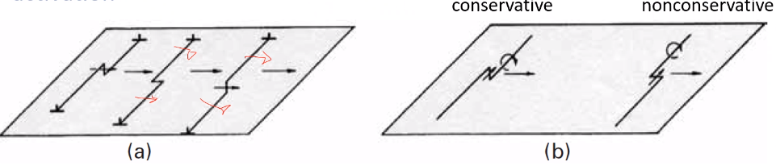 |  |
|:--:|:--:|
| Moving an out-of-plane [[jog]] in [[screw-dislocations]] requires [[climb]] and thermal activation. $\tag{fig:effects_on_dislocation_motion} \label{fig:effects_on_dislocation_motion}$ | Edge dislocations want to shove things forward; whereas, screw dislocations want to push things out of the way. $\tag{fig:edge_versus_screw_dislocation_example} \label{fig:edge_versus_screw_dislocation_example}$ |

| 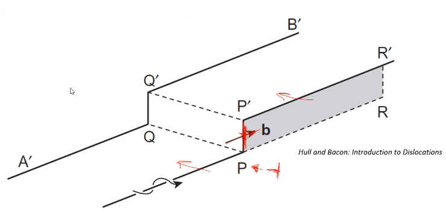 |
|:--:|
| Direction, line vector of dislocation, and [[burgers-vector]]. $\tag{fig:edge_versus_screw_dislocation_example_another_look} \label{fig:edge_versus_screw_dislocation_example_another_look}$ |

!!! quote <cite> Dr. Atwater
	A [[screw-dislocations]] with a [[jog]] must emit [[vacancies]] to allow climb, which may also produce dislocation bowing.

#### Dislocation Looping
If the jog does not move, advancing segments eventually form a loop. This occurs by the pinching of of the segments such that a dipole is formed. This is only for [[screw-dislocations]].

[[forest-hardening]]
: A hardening mechanism that increases immobility of dislocations.

#### Orowan Equation
Cumulative effect of dislocations can be modeled as a [[unit-cube]] with parallel dislocations moving in one direction with all contributing a step size of [[burgers-vector]]. The [[dislocation-density]], [[burgers-vector]], and average distance travelled will all affect the total strain, $\tau$. A constant, $k$ accounts for misalignment of the dislocations with the deformation. [[strain-rate]] is related to [[dislocation-velocity]] assuming a constant [[dislocation-density]].

|  |
|:--:|
| Not all dislocations are mobile, so the overall [[dislocation-density]] is much higher than that contributing to deformation. $\tag{fig:dislocation_unit_cube} \label{fig:dislocation_unit_cube}$ |

!!! question Is the [[dislocation-velocity]] dependent on temperature because temperature adds or removes electron energy to allow or restrict glide? <cite> JMA3
	Yes.

#### Peirels-Nabarro Stress (Lattice Friction)
The movement of dislocations follows a non-linear energy due to the atomic nature of the motion (non-continuum). The [[energy-barrier]] is related to the exchange of bonds and shifting of the atoms on the plane. The stress to move the dislocation is a sinusoidal: 

$$\begin{equation}
\tau_{PN} = \alpha\frac{Gb}{2c}e^{-\frac{\pi a}{c}sin(\frac{2\pi x}{c})}
\label{eq:peirels_nabarro_stress}
\end{equation}$$

$\alpha$ is dependent on barrier characteristics, $a$ is the [[lattice-parameter]], and $c$ is spacing of atoms in direction, $x$.

|  |
|:--:|
| Think of a Lay's Sun Chip. $\tag{fig:peirels_nabarro_stress_lattice_friction} \label{fig:peirels_nabarro_stress_lattice_friction}$ |

#### Kink Pair Nucleation
It is difficult for [[screw-dislocations]] to move in #bcc metals due to the Peirels [[energy-barrier]]. It is easier...

#### Temperature and Strain Rate
Temperature and [[strain-rate]] have similar effects, with low temperature and high [[strain-rate]] reducing [[dislocation-motion]] during deformation. Shear stress required for deformation dependent on mechanical and thermal conditions. #bcc metals are primarily restricted by the [[Peirels-Stress]], and #fcc metals are restricted by [[forest-hardening]] Thermal and [[strain-rate]] components of deformation, which dominate mechanical response. Above $0.5T_{m}$, creep becomes more important and [[dislocation-climb]] is activated.

$$\begin{equation}
v = A\tau^{m}e^{\frac{-Q}{RT}}
\label{eq:dislocation_velocity}
\end{equation}$$

[[dislocation-velocity]] restricted to real velocities, and is mostly related to the elastic shear wave.

---

*Lecture: October 04, 2021*

!!! summary Exam Review
	One-page formula sheet is permissible.
	Not looking for describing characterizing [[dislocation-motion]], but more so on the equations.
	Will also not focus on drawing [[edge-dislocations]] nor [[screw-dislocations]].
	If there is dislocation interaction of forces, then what is the [[burgers-vector]]? Refer to [[jog]] and [[kink]] concepts.
	If presented with labelled stress-strain curve, what are the different parts? Refer to Fig. @fig-stress_
	What is with the hardening equations for the subscripts? [[Ludwik-Hollomann]] equation (Eq. \eqref{eq:ludwik_hollomann}) has no $\sigma_{0}$. Just focus on this one equation: true uniform strain is [[work-hardening]] exponent, n, which occurs at the engineering #ultimate-tensile-strength (when the curve comes back down, which is aka [[Considere-Criterion]]).
	Know #FRS and its equations, which will likely come from the homeworks.
	Nothing foreign from the homework.
	#bcc more sensitive to temperature, because [[dislocation-motion]] aided by temperature.: double-kink nucleation easier to move slip systems with higher energies.
	How do vacancies affect electronegativity? Defects reduce electrical conductivity, but effects are negligible. Participants are electron sharing reduce with more inhibiting imperfections.
	|  |
	|:--:|
	| Gold-Schmidt radius related to coordination number and atomic radius; therefore, [[burgers-vector]] is twice that to move from atomic position to the next (p. 287). |

	*Bowing of dislocations will also be in exam.*

	|  |  |
	|:--:|:--:|
	| Favorable to nucleate more dislocations in crystal, because energy required of dislocation to move material infinitely increases with radius of material. | Energetically favorable if magnitude of vector addition of dislocations greater then or equal to that ask. Energy comparison is $\burgers^{2}$ (p. 292). $\ref{fig:homework_question_on_energetically_favorable_solution}$ |

	#bcc does not generate partial dislocations, because of high #SFE.

---

*Lecture: October 08, 2021*
### Interfacial Defects
#### Grain Boundary
Grain boundaries are areas where crystal grains of varying orientations meet.

Interfacial
: Two-dimensional discontinuity in structure and often not a flat plane.

Each grain is a single crystal, so the boundaries are simply orientation differences between grain is in three- dimensions. The degree of misalignment determines characteristic of the boundary.Low-angle grain boundaries can be described.

Grains are not circular, but are often simplified to having a diameter. #ASTM grain number indicates grains/$in^{2}$ at 100X magnification. $\bar{l} = \frac{L}{N_{l}M} = \frac{2}{S_{v}}$. $$S_{v} = \frac{2\pi r^{2}}{\frac{4}{3}\pi r^{3}} =\frac{3}{2r} = \frac{3}{D},~D = \frac{3}{2}\bar{l}$$ Relative grain size can also be determined by linear intercept method, where grain intersections, $N$ along a line of length, $L$ at magnification, $M$ are used to determine the grin sizeArea is then related to volume and grain size can be determined. [Image-J is a basic, free analysis software for grain size.](https://imagej.net)

*[ASTM]: American Society for Testing and Materials

#### Tilt Boundary
Sometimes called "edge boundary, because deformation occurs like if one lifted a table from its edge. Orientation of adjacent grains will determine this terminology. More dislocations may be necessary to accommodate the boundaries. A [[tilt-boundary]] occurs when two lattices intersect at an angle. Tilt boundaries are formed by [[edge-dislocations]]: $D = \frac{\frac{\burgers}{2}}{sin(\theta/2)} \approx \frac{\burgers}{\theta},~D = \frac{1.3a}{\theta \approx 7.8a}$.

#### Twist Boundary
Is an array of [[screw-dislocations]]: where two lattices have parallel faces, but are rotated relative to another such that they have different orientations (like turning a Rubik's cube). [[grain-boundary]] is often a network of edge and screw dislocations to accommodate the misorientation type and amount.

#### Grain Boundary Energy
Dislocation network concept of a low-angle [[grain-boundary]] means that the energy of that boundary can be determined by the cumulative effect of the dislocations. With [[dislocation-pileup]], the spacing is important, and at high angles the dislocations may only be a few atomic spaces from each other. Dislocation core energy should be considered as dislocation spacing decreases.

$$\begin{split}
\frac{\burgers}{D} &\approx \theta \leq 10\degree \approx \frac{1}{6} rad~\text{or}~D \approx 6\burgers \\\\
E &= E_{\perp}(\frac{1}{D}) = E_{\perp}\bigg(\frac{\theta}{\burgers}\bigg) = \frac{\theta}{\burgers}\bigg[\frac{G\burgers^{2}}{4\pi(1 - \nu)}\ln\big(\frac{D}{r_{0}}\big) + E_{core}\bigg]
\end{split}$$

##### Parameter A
Assuming a core radius of $5\burgers$, the [[dislocation-energy]] is equal to the [[core-energy]] when separated by $10\burgers$.

$$\begin{split}
E &= \theta\frac{G\burgers}{4\pi(1 - \nu)}(-\ln(\theta) + A) \\\\
U &= \frac{G\burgers^{2}}{10},~\text{for}~D = 10\burgers = \frac{\burgers}{\theta} \\\\
E &= \frac{G\burgers^{2}}{10D} = \frac{G\burgers^{2}}{100\burgers} = \frac{G\burgers}{100},~(\theta = 0.1) \\\\
\frac{G\burgers}{100} &= \frac{G\burgers*0.1}{4\pi(1 - \nu)}(A - ln(0.1)) \\\\
A &= \frac{4\pi(1 - \nu)}{10} + ln(0.1) = 0.866 - 2.30 \\\\
&= -1.436
\end{split}$$

#### Grain Boundary Misorientation-Energy Relation
At low angles, [[grain-boundary]] will have a linear increase in energy with angle (for isolated dislocations). As the angle increases, dislocation interaction cause the energy to maximize around $30\degree$. High angle [[grain-boundary]] have a combination of fit and misfit regions, and their energy is better understood as [[surface-tension]]. 

|  |
|:--:|
| Twins are actually high angle grains with low energies. $\tag{fig:special_grain_boundary_energy_relations} \label{fig:special_grain_boundary_energy_relations}$ |

#### Coincident Site Lattice Boundary
[[coincident-site]] is disordered in general, but has a period of alignment between lattice sites such that the sites are shared between grains. Energy of [[grain-boundary]] decreases with increasing frequency of coincident sites. 

| 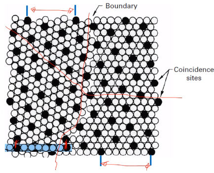 |
|:--:|
| Density of sites range from $\frac{1}{3}$ to $\frac{1}{9}$. Where the sites are $3-9$ atoms apart. $\tag{fig:coincident_site_boundary_example} \label{fig:coincident_site_boundary_example}$ |

Degree of [[coincident-site]] will affect overall [[grain-boundary]]-energy:
- Lower [[grain-boundary]] energy in pure metals.
- Lower diffusivity.
- Lower electrical resistivity.
- Greater resistance to [[grain-boundary]] sliding, fracture, etcetera.
- Greater resistance to corrosion.
- Higher mobility per energy.

!!! info
	For the *Critical Review* concept, perform the review over something practical with **5** of any of the listed topics. Be as specific as possible.

---

*Lecture: October 11, 2021*

!!! summary Exam Answer Key
	1. True stress-strain moves tension up-left and compression moves down-right.
	2. Necking is not uniform, but local, plastic strain.
	3. Only engineering decreases for increasing strain.
	4. [[Ludwik-Hollomann]] uses true stress-strain; therefore, the engineering stress-strain must be converted to true and that is the exponent. Then find the stress at the highest point of the engineering stress-strain curve in the true stress-strain regime and convert back to engineering.
	5. The "friction hill" is highest at the center of the specimen, which tapers off towards the edges. Can mitigate this with lubricant or ring.
	6. Load and indenter type are only parameters of Rockwell testing.
	7. Order of magnitude too large.
	8. $\gamma = \frac{G\burgers^{2}}{2\pi d}$. Solve for d.
	9. Use radius, not pinning distance.
	10. Simply use the information from (9) and plug into (10).
	11. 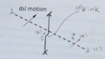
	12. Normal stresses and $\tau_{12}$ are 0; therefore, no volume changing.

#### Triple Junctions
Formed when three grain boundaries meet: have lower mobility and higher diffusivity than other grain boundaries. Comprise a larger fraction of the total boundary volume at smaller grain sizes. Grain growth is difficult at these junctions.

|  |
|:--:|
| Approximated by 14-sided polygons, which can perfectly fit together in 3D without gaps. $\tag{fig:triple_junction_example} \label{fig:triple_junction_example}$ |

#### Grain Boundary Dislocations and Ledges
A [[grain-boundary]] dislocation is path of the [[grain-boundary]] and not the parent lattice and may form steps on the [[grain-boundary]] interface. Dislocation passing through a [[grain-boundary]] can result in shearing and step formation. Ledges are accumulated steps, and they are common in high-angle [[grain-boundary]].

| 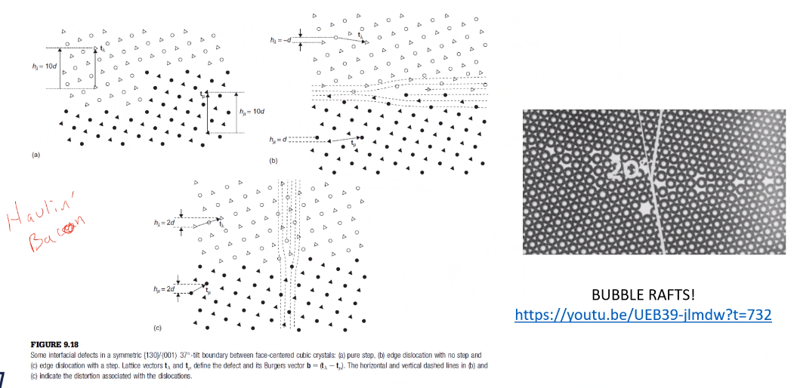 |
|:--:|
| Dislocation arrays want to remain align to minimize their cumulative stress field. $\tag{fig:step_example} \label{fig:step_example}$ |

#### Summary
Fundamental to structure of [[polycrystalline]] metal is [[grain-boundary]]. Characteristics of these boundaries inform the mechanical properties of the material.

!!! question Concerning the *Critical Review* assignment, do you want the article we want to review? <cite> Julian
	Share the article and outline what you will discuss. *Mechanical Testing* can include nano-indentation, hardness, etcetera. Explain enough of the material that you show comprehension of the subject matter.

---

*Lecture: October 13, 2021*
### Twinning
Very strange boundary, and may occur without or without [[slip]]. 

[[twinning]]
: Boundary that acts as a line of symmetry between mirroring grain structures. Is a deformation mechanism.</dd>
</dl>

[[twinning]] only exists in $\Sigma 3$ boundaries and is favored when [[slip]] is not: i.e. #hcp metals are very susceptible to [[twinning]]. Function of microstructure, temperature, and strain-rate.

#### Crystallography
Twinning can allow for more slip. Slip is more common, but twinning is an alternate route, especially when slip is restricted.
- #hcp: occurs at ambient temperatures from lack of [[slip-plane]].
- #bcc: sub-ambient temperature and slip is more difficult.
- #fcc: not common because slip is easy.

|  |
|:--:|
| Twins can only occur within a single grain. E.g. silver has a low #SFE and twins easily when annealed. $\tag{fig:twinning_example_depicted} \label{fig:twinning_example_depicted}$ |

#### Difference from Slip
[[twinning]] mechanisms and results vary significantly from slip.
- Twinning
  - Mirror image of lattice.
- Slip
  - foo
  - bar

#### Twinning and Slip
Stress required to initiate [[twinning]] is high, but low to propagate. More likely to occur after extensive [[work-hardening]], low-temperature, high strain-rates: e.g. tin cry when bending a piece of tin.

#### Effect of the c/a Ratio
- [[twinning]] occurs when stress state$= \begin{cases}\frac{c}{a} > \sqrt{3} &, \text{compression} \\\\ \frac{c}{a} < \sqrt{3} &, \text{tension}$
- An ideal $\frac{c}{a} = 1.633 \text{ and } \sqrt{3} = 1.732$.

| 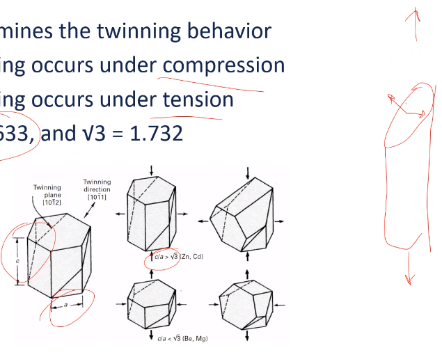 |
|:--:|
| If slip is not preferred, crystal may twin to accommodate deformation. $\tag{fig:stress_state_with_twinning_example} \label{fig:stress_state_with_twinning_example}$ |

#### Mechanical Effects
!!! quote <cite> Atwater
	If temperature drops, then [[twinning]] is more likely. If [[strain-rate]] decreases, then [[twinning]] is more likely.

|  |
|:--:|
| Competition between twinning and slip resolves to whichever is easier. Remember that twinning is mainly driven by the stress-state of the material. $\tag{fig:temperature_dependence_of_twinning} \label{fig:temperature_dependence_of_twinning}$ |

#### Effects of Stacking Fault Free Energy
| 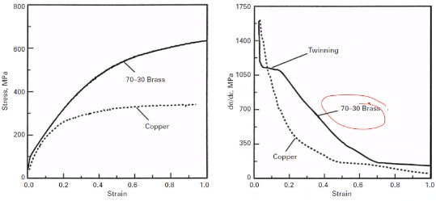 |
|:--:|
| As #SFE decreases, the propensity toward [[twinning]] increases. [[work-hardening]] rate drops in copper, but allows brass to stabilize its stress state. $\tag{fig:effects_of_stacking_fault_energy} \label{fig:effects_of_stacking_fault_energy}$ |

$$\begin{equation}
\sigma_{T} = K\sqrt{\big(\frac{\gamma_{sfe}}{G\burgers}\big)}
\label{eq:twinning_stress}
\end{equation}$$

Twins will act as slip barrier, which increases the [[work-hardening]] rate of the material.

#### Twinning and Slip Stress
Domains in which [[twinning]] or [[slip]] can be determined by setting their initiation stresses equal to one another: $\sigma_{T} = \sigma_{S}$.

| 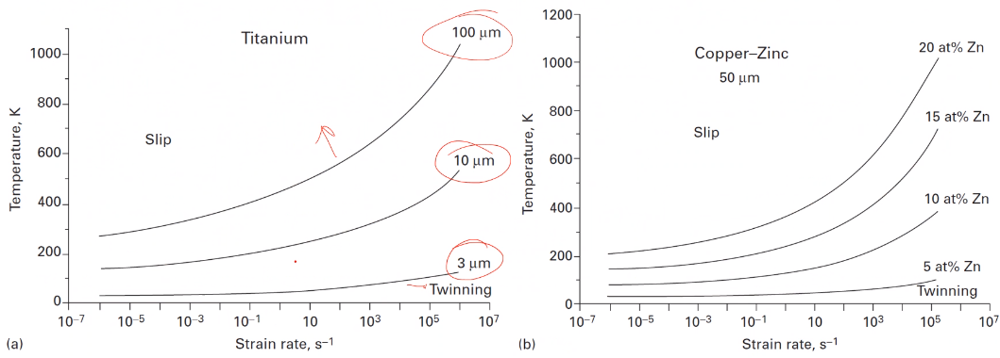 |
|:--:|
| More strain raises the curve: i.e. more area under the curve means more [[twinning]]. $\tag{fig:grain_size_temperature_strain_rate_and_twinning} \label{fig:grain_size_temperature_strain_rate_and_twinning}$ |

#### Summary
Primarily an #hcp thing and can occur in #fcc: not likely in #bcc. Deformation mechanism that allows for more strain, but this mechanism competes with [[slip]].

### Grain-Size Boundaries
Effect of [[grain-boundary]] on strength and bulk properties commonly characterized by the [[Hall-Petch-Equation]]. [[grain-boundary]] must maintain contact under deformation; therefore, [[slip]] must occur, which implies that [[work-hardening]] is proportional to [[grain-boundary]]-area. *This assumes that the material is not coming apart.*

Texture
: Alignment of grains along a particular direction.

We will focus on random orientation.

#### Hall-Petch Equation
| 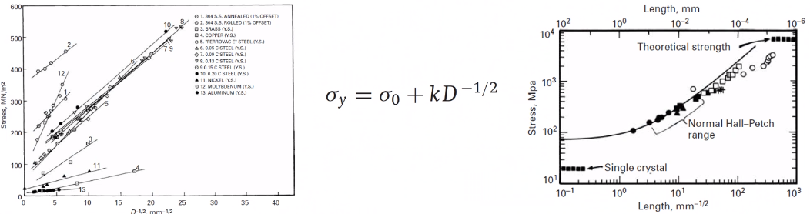 |
|:--:|
| Still used today to determine [[grain-size]]; however, is not as accurate for [[nanograins]] ($\lt 10 nm$). $\tag{fig:hall_petch_equation} \label{fig:hall_petch_equation}$ |

$$\begin{equation}
\sigma_{y} = \sigma_{0} + \frac{k}{\sqrt{D}}
\label{eq:hall_petch_equation}
\end{equation}$$

Much work today is starting to look at grain size strengthening through [[heterostructure]]. $\sigma_{0}$ is the [[lattice-friction]]: the stress to move a dislocation.

#### Theories Behind the Mechanisms
Based on [[dislocation-pileup]] crossing [[grain-boundary]] due to high stress on lead dislocation. What is the strength for a dislocation to move from one grain to another?

$$\begin{equation}
\begin{split}
L &= \frac{\alpha nG\burgers}{\pi\tau_{a}} \\\\
n\tau_{a} &\geq \tau_{c} \\\\
\frac{\alpha\pi D\tau_{a}^{2}}{2G\burgers} &\geq \tau_{c}
\end{split}
\label{eq:hall_petch_mechanisms}
\end{equation}$$

#### Cottrell Theory
Instead of assuming that dislocations pass through [[grain-boundary]], the [[stress-concentration]] does 

$$\begin{equation}
\begin{split}
\tau_{c} &= (\tau_{a} - \tau{0})\sqrt{\frac{D}{4r}} \\\\
\tau_{a} &= \tau_{0} + 2\tau_{c}\sqrt{r}D^{-\frac{1}{2}}
\end{split}
\label{eq:cottrell_theory_mechanisms}
\end{equation}$$

#### Li Theory
Rather than considering the approaching of [[grain-boundary]] as source for dislocations, where ledges act as [[stress-concentration]] to initial [[dislocation-initiation]]. These act as a forest near the [[grain-boundary]] and stress is related to that required to move dislocation through this forest. Therefore, flow stress, $\tau$ is often related to [[dislocation-density]], $\rho = \dots$

---

*Lecture: October 18, 2021*

#### Meyers-Ashworth
Incompatible stresses between grains generate [[anisotropy]]. This causes and interfacial shear stress 3 times higher than normal, applied stress, which may be homogeneous. Dislocations form at interfaces, rather than grain interior; therefore, dislocations do not propagate through the grain because nothing pushes them through from localized stresses at boundary and resolved stress elsewhere. Highly entangled dislocations form in higher density at [[grain-boundary]]. [[microyielding]] can occur in the [[grain-boundary]] region, which causes a composite behavior of harder [[grain-boundary]] network due to plastic incompatibility. When applied stress reaches the [[grain-boundary]] flow stress, then [[macroyielding]] occurs.

$$\begin{equation}
\begin{split}
\tau_{I} &= 1.37\sigma_{0} \\\\
\tau_{H} &= \dots
\end{split}
\label{eq:meyers-ashworth-equations}
\end{equation}$$

#### Summary
Grain size plays a crucial role in mechanical performance of materials. Mechanisms of strengthening$\dots$

### Obstacles to Deformation
Mechanisms of strengthening have focused on dislocation interactions thus far. Grains may be too small to even contain dislocations; alternatively, grains may have substructures within the grain.

|  |
|:--:|
| May not even cover these in the homeworks. \\(\tag{fig:obstacle_equations} \label{fig:obstacle_equations}\\) |

#### Substructural Effects
Dislocation Cells
: Formed during deformation and hinder continued deformation: e.g. twinning. Affect on flow stress by $\sigma_{f} = \sigma_{0} + K\Delta^{-m}, \text{ where } 0.5 \leq m \leq 1$.

To include [[grain-size]], the [[Hall-Petch-Equation]] (Eq. \eqref{eq:hall_petch_equation}) contribution is added.

$$\begin{equation}
\sigma_{f} = \sigma_{0} + K_{1}\sqrt{D} + K_{2}\Delta^{-m}
\label{eq:substructural_effects}
\end{equation}$$

**Very temperature-dependent.** *$\Delta$ is likely the strain.* Plotting the stress difference against the [[grain-size]] in a log-log plot gives an approximately linear behavior, which also depends on temperature.

|  |
|:--:|
| Slope of this depends on temperature, and can show recrystallization, which is a pre-cursor to recover. \\(\tag{fig:substructural_effect_loglog_plot_stress_grain_size} \label{fig:substructural_effect_loglog_plot_stress_grain_size}\\) |

#### Iron-Carbon System Considerations
Fe-C systems allow for various microstructures within single composition. Ratio of spacing of ferrite, $f_{\alpha}$ and cementite layers in pearlite, then composition grain size, D, lamellar spacing, S, and pearlite colony size, P will affect strength and ductility.

|  |
|:--:|
| Iron-carbon system considerations from multiple angles. \\(\tag{fig:iron_carbon_system_considerations} \label{fig:iron_carbon_system_considerations}\\) |

#### Nanocrystalline Materials
At lower limits of grain size, the strength of materials can be maximized. This comes with other challenges, such as brittleness in metals and thermal instability. Small amount of grain actually make up grain boundary volume (disordered regions). The [[Hall-Petch-Equation]] does not apply here or may invert.

##### Strengthening Mechanisms
Several possibilites exist in nature of nanocrystalline strengthening: [[dislocation-pileup]] no longer explains strengthing (too small); [[dislocation-network]] model required (similar to Meyers-Ashworth); and [[grain-boundary]] sliding (especially below 10 nm.) Higly disorded nature of nanocrystalline materials when taken to maximum.
A maxmimum in the strength of nanocrystalline copper Science 301.5638

#### Volumetric Defects
Voids and inclusions are stress concentrators that will weaken the material. Inclusion is often described as an unwanted impurity to the material: often from processing technique. Some second-phase additions may be desired, if properly controlled. Voids are empty spaces, often from entrapped gases: tpyical in casting or powder sintering, where diffusion of vacancies is required to produce full density.

---

*Lecture: October 20, 2021*
## Deformation and Work Hardening
### Introduction and Stereographic Projections
Metals rarely in equilibrium state. Processing history affects the present properties and performance. Majority of manufacturing processes will impose microstructural changes, some of which are extensive: e.g. rolling, forging, extruding, etcetera. Knowing the microstructure and stress orientation is important, because the behavior of a metal depends on the slip systems. No work-hardening occurs at evlvated temperatuers. 

### Hot Work versus Cold Work
Recrystallization temperature provides demarcation between hot and cold work regimes: below this threshold is [[cold-working]] and above is [[hot-working]]. [[hot-working]] is preferable for extensive strains because force is reduced and the potential for failure by overly [[cold-working]] also lowers. Finish processing can be done by [[cold-working]] to produce a stronger product, higher accuracy, and better surface finish. [[cold-working]] can make post-manufacturing processes easier and [[hot-working]] is great for reshaping some shape but not great for machining.

### Work-Hardening
Dislocations provide means for [[plastic-deformation]]. Accumulation of these defects causes entanglement and raises the [[flow-stress]]. Dislocation retained in material requires that future stress must again exceed the prior [[flow-stress]]. Annihilating defects makes a material deformation plastically before accumulating dislocations. Softening is experienced in force only (not stress) as deformation localizes.

### Affects of Temperature
High [[work-hardening]] a material can be softened by [[annealing]]. Temperature determines the outcome: [[yield-strength]] will decreases and [[ductility]] will increase with increasing the [[annealing]]-temperature, whereas, lowering the [[annealing]]-temperature has converse affects.

### High Temperature (#DBTT)
Brittle materials will increase in ductility...

### Stereographic Projections
Useful to display various crystallographic orientations in a compact way. Uses a sphere and projecting some plane onto a 2D plane on sphere. "Southern hemisphere" can contain al information of crystal, and each plane is a "great circle" that is projected onto the 2D plane below. *

!!! hint Recall projections from Calculus III.

| 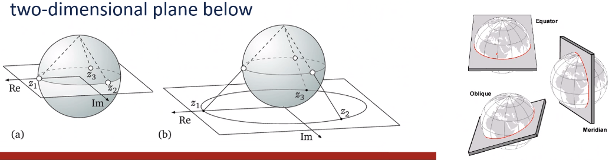 |
|:--:|
| Great circles are at the full diameter of the sphere; whereas, small circle can be at any other diameter and allowed to differ from the great circle. \\(\tag{fig:stereographic_projections_example} \label{fig:stereographic_projections_example}\\) |

#### In Cubic Crystals
We can represent any orientation and symmetry of crystal systems using normal directions and associated planes. [[stereographic-projection]] will vary from each crystal type and orientation, but common practice is to use the $\millerVector{1}{0}{0}$ direction as the "North Pole".

|  |
|:--:|
| Projections planes are made normal from the crystallographic vector at which the sphere is viewed. \\(\tag{fig:cubic_crystal_stereograph} \label{fig:cubic_crystal_stereograph}\\) |

!!! note
	A [Wulff Net](https://en.wikipedia.org/wiki/Stereographic_projection#Wulff_net) is another way to view a [[stereographic-projection]].

#### Cubic Projections
Some cubic systems have common directions of importance.

| 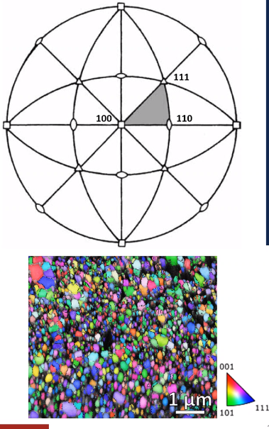 |
|:--:|
| The square, triangle, and elliptical symbols represent the number of fold required before reaching the next symmetric plane. All these [[stereographic-projection]] can be represented with a single, triangular colormap. \\(\tag{fig:cubic_projection_colormap} \label{fig:cubic_projection_colormap}\\) |

#### Resolved Shear Stress
Because the crystallographic orientation is rarely, perfectly aligned with shear stress: therefore, the actual (resolved) shear stress will be different: **dislocations only [[glide]] under shear stress**. This is important for polycrystalline materials. The orientation of the slip system relative to the applied stress (tension or compression) will determine the actual stress on that slip system.

|  |
|:--:|
| Resolving shear stress on the slip plane. \\(\tag{fig:resolved_shear_stress_example} \label{fig:resolved_shear_stress_example}\\) |

$$\begin{align*}
A &= A_{1}cos(\phi) \\\\
\tau &= \frac{P\cos(\lambda)}{A_{1}} = \frac{P}{A}\cos(\phi)\cos(\lambda) \\\\
\tau &= \sigma_{0}\cos(\phi)\cos(\lambda) \\\\
\dots
\end{align*}$$

### Finding Orientations
Scalar product of two directions can be used to determine the angle between them (use the Miller indices).

### Schmid Factor
Combination of slip direction and plane angles is known as the Schmid Factor, M

$$\begin{equation}
\begin{split}
\tau_{c} &= \sigma_{0}\sin(\chi)\cos(\lambda) = M\sigma_{0} \\\\
M &= \sin(\chi)\cos(\lambda) = \cos(\phi)\cos(\lambda)
\end{split}
\label{eq:schmid_factor}
\end{equation}$$

Yield stress is minimized at $45\degree$ for both angles: i.e. M = 0.5. This is good for #hcp because of few, ideal slip systems.

### Easy Glide
Easy Glide
: Single slip system active such that dislocation do not interact: dislocations may pileup but do not entangle.

Affected by the following:
1. Specimen size: specimens with small cross-sectional areas tend to have a more extended [[easy-glide]] region.
2. Temperature: [[easy-glide]] is more pronounced at lower temperatures and may vanish completely at high temperatures.
3. #SFE: #fcc metals with low #SFE tend to have more pronounced [[easy-glide]] regions with few slip systems.
4. Solute atoms: if dislocations are pinned, then they will shorten the mean path and extent of [[easy-glide]]. If solutes contribute to lowering the #SFE $\dots$.

[[easy-glide]] is interrupted when other things are allowed: i.e. if multiple slip systems are active, then [[easy-glide]] ceases to occur.

### Summary
Real conditions of processing will introduce defects that result in strengthening. Temperature can prevent or reverse defect accumulation, which eliminates [[work-hardening]]. Applied stress affects the microstructure and [[stereographic-projection]] allow us to standardize viewing these effects.

!!! question Is there a difference between work-hardening and strain-hardening? <cite> DK
	They are the same thing.

!!! question The book cites microfissures for work-softening? <cite> Fazzina
	Mostly attributed to necking, but we will look at the geometric considerations later.

---

*Lecture: October 22, 2021*
### Strain and Slip Reorientation
!!! example Let us say some stress of $5 kPa$ acts in the $\millerPlane{4}{3}{2}$ direction. What is the [[flow-stress]], $\tau$ on the $\millerVectorFamily{1}{1}{\bar{1}}\millerPlane{0}{1}{1}$?
	Recall Eq. \eqref{eq:schmid_factor}: $M = \cos{\phi}\cos{\lambda}$.

	$$\begin{split}
	\cos{\phi} &:= \frac{\vec{a}\burgers}{|\vec{a}||\burgers|} \\\\
	&= \frac{4(1) + 3(1) + 1(-1)}{\sqrt{4^{2} + 3^{2} + 1^{2}}\sqrt{1^{2} + 1^{2} + (-1)^{2}}} \\\\
	&= \frac{5}{\sqrt{29}\sqrt{3}} \\\\
	&= 0.536 \\\\
	\cos{\lambda} &= \frac{4(0) + 3(1) + 2(1)}{\sqrt{4^{2} + 3^{2} + 1^{2}}\sqrt{0^{2} + 1^{2} + 1^{2}}} \\\\
	&= \frac{5}{\sqrt{29}\sqrt{2}} \\\\
	&\approx 0.657 \\\\
	\implies M &= \cos(0.536)\cos(0.657) = 0.352 \\\\
	\therefore \tau &= M\sigma = 0.352(5 [kPa]) = 1.76 kPa
	\end{split}$$

An applied normal stress will have a resulting shear stress on the [[slip-plane]] and [[slip-direction]] as determined by the [[Schmid-Factor]] (Eq. \eqref{eq:schmid_factor}). The strain caused by that stress follows a similar relationship. The strain will result in a change to the crystal orientation, such that the and resolved shear stress.

#### Resolved Shear Strain
!!! note The book and pdf version of the book erroneously list $d\lambda$ and not $d\gamma$ for the strain related [[Schmid-Factor]] (Eq. \eqref{eq:schmid_factor}).

$$\begin{equation}
d\gamma = \frac{d\epsilon}{\sin{\chi}{\lambda}} = \frac{d\epsilon}{M}
\label{eq:resolved_shear_strain}
\end{equation}$$

#### Slip Systems Stereographically
Crystals reorient themselves during deformation, which causes a change in the resolved stress and potentially the [[slip-system]].

| 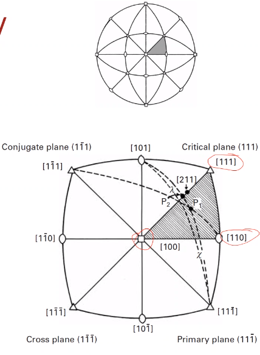 |
|:--:|
| Imagine the tensile axis is in the hatched triangle ($P_{1}$). \\(\tag{fig:slip_system_stereography} \label{fig:slip_system_stereography}\\) |

The idea here is that $P_{1}$, loading direction, can move around the stereograph. While in this hatched triangle, $P_{1}$ resides in only one [[slip-system]].

| 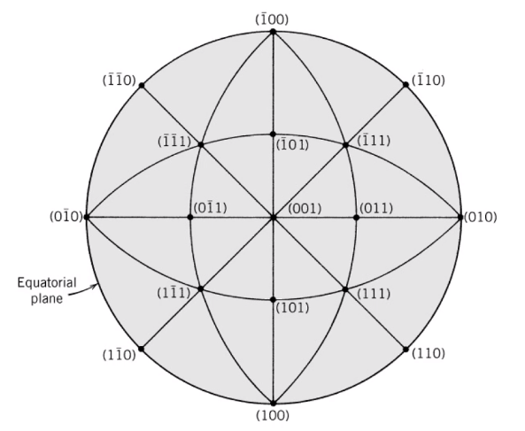 |
|:--:|
| Note that the $\millerPlane{1}{1}{1}$ moved to the bottom. \\(\tag{fig:primary_slip_system_stereogram} \label{fig:primary_slip_system_stereogram}\\) |

If living in the $\millerPlane{0}{0}{1} \text{, } \millerPlane{\bar{1}}{1}{1} \text{, and } \millerPlane{0}{1}{1}$ triangle, this [[slip-system]] can be flipped along any edge: i.e. a hinge. That hinged edge is the plane active in the [[slip-system]]. The path traced by the opposite corner is the ...

#### Reorientation
Primary [[slip-system]] can be found in the triangle; however, $P_{1}$ will move during deformation in the direction traced by the opposing corner hinging along some plane: [[easy-glide]]. As the crystal reorients itself, multiple [[slip-system]] become possible. Starting at a corner of four stereographic triangles activates four [[slip-system]]. If starting on an edge, then two [[slip-system]] are active. Deformation occurs not in the direction with the most [[slip-system]] but in the most favorable direction.

!!! question What if the crystal rotates? <cite> DK
	These stereograms are really limited to #sc. The crystal will reorient itself to some [[slip-system]].

|  |
|:--:|
| In the middle of the triangle, only one [[slip-system]] is active. More [[slip-system]] become active nearer the edge: [[conjugate-slip-plane]]. \\(\tag{fig:reorientation_stereogram} \label{fig:reorientation_stereogram}\\) |

#### Shear Stress-Strain Curves
Reorientation and resulting stress changes can be described by three stages:
1. Stage I, [[easy-glide]]: very little to no [[work-hardening]]; long slip lines; and does not exist in polycrystalline samples.
2. Stage II, linear hardening: high slope value
3. Stage III, cross-slip activation

>higher temperatures and lower #SFE go to Stage III faster. <cite> Atwater

#### Polycrystalline Slip
A single crystal should start slip in the primary plane, but its neighboring grains will affect the state of stress and deformation. Strain in the first grain must be compatible with that of the other grains. For deformation to occur in the bulk material, stress must be transferred from grain to grain via independent [[slip-system]] and no Stage I region is observed.

#### Summary Slip 
A dynamic process, the mechanisms and geometry of the system vary during the slipping process. The resolved stress and strain can be determined through the [[Schmid-Factor]] (Eq. \eqref{eq:schmid_factor}), but the angles are changed at each increment of strain. The reorientation of crystals to the applied force is only possible if not constrained. Polycrystalline materials will not exhibit the same mechanical behavior as single crystal, because they must accommodate their neighbors.

---

*Lecture: October 25, 2021*
### Polycrystalline Slip
- Theories of hardening.
- How this fits with single crystal theories.
- Highlight prominent theories and their limitations.

#### Introduction
3-stage slip/deformation curve in single crystals does not exist in polycrystals. The compatibility of grains requires multiple slip systems are initiated from earliest stages of deformation. [[work-hardening]] is immediate, then, without [[easy-glide]] region.

#### Work-Hardening in Polycrystals
Dislocation density is important measure of strain response of metal. More dislocations means more motion inhibition. As they are "pinned", their "free" segments shrink (higher stress needed to activate as sources). The entangled dislocations form cell structures and sub-boundaries. This is most evident in high #SFE metals because [[cross-slip]] is easier. [[dislocation-density]] increases from $sim 10^{6}$ to $\sim 10^{12} cm^{-2}$ during [[cold-working]] from the annealed condition. The general relationship between flow stress and [[dislocation-density]] is same as with single crystals.

$$\begin{equation}
\tau = \tau_{0} + \alpha G\burgers\sqrt{\rho}
\label{eq:flow_stress_work_hardening_polycrystals}
\end{equation}$$

#### Modeling Defect Accumulation
Stress is a *state function:* does not matter how it got there. Strain is a *path function*: does depend on how it got there. Knowing that there are defects does not tell us how they got there. A central challenge of [[work-hardening]] theory to develop models for how dislocations and related features are created and then to compare this with the observed microstructures. The mechanisms and interactions are sensitive to the parameters of crystal structure, #SFE, temperature, [[strain-rate]], etcetera.

#### Taylor Theory
Developed before the 3-stage single crystal concept of deformation was known. Relies on the concept of dislocations being "trapped" within the elastic stress field of other dislocations. The trapped dislocations raise the required stress to continue deformation. [[dislocation-density]] is critical to the overall resistance to deformation (revisit [Orowan Equation](#orowan-equation) concepts of obstacles).

$$\begin{equation}
\gamma = k\rho\burgers\ell
\label{eq:taylor_theory}
\end{equation}$$

| 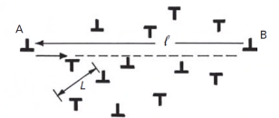 |
|:--:|
| Deformation is taken as resistance to a dislocation moving a distance $\ell$. \\(\tag{fig:taylor_theory_depicted} \label{fig:taylor_theory_depicted}\\) |

Taylor restricted consideration to edge dislocations, which have a shear stress field of: $$\sigma_{12} = \frac{G}{2\pi(1 - \nu)}\frac{x_{1}(x_{1}^{2} - x_{2}^{2})}{(x_{1}^{2} + x_{2}^{2})}$$ For a spacing of $\frac{L}{2}$ between dislocations ($x_{1} = \frac{L}{2}, x_{2} = 0$): $$\sigma_{12} = \frac{G\burgers}{\pi(1 - \nu)L} = \frac{KG\burgers}{L}$$ The shear stress must overcome this to move the dislocation. Substituting $\rho$ for $L$, as determined by Orowan hardening and simplifying: $$\tau = $$

#### Limitations of Taylor Theory
- Uniform distribution if dislocations, which is rarely observed.
- Excludes screw dislocations, which are prone to cross-slip.Two dislocations trapped on each other can still move in the presence of a third dislocation. #hcp and Stage II deformation for cubic crystals is now know to be linear, not parabolic as predicted. Relies on uniform distribution throughout the crystal when local concentrations of deformation are observed.

#### Seeger Theory
A

#### Kuhlmann-Wilsdorf Theory
*[KW]: Kuhlmann-Wilsdorf Theory
Dislocation bowing is primary concern. Microstructure develops [[dislocation-cell]] in medium to high #SFE metals, so the theory should include their contribution to the [[work-hardening]]. Increasing strain decreases the cell size and aligns their dimensions to the strain direction. Cell walls become more distinct. Eventually, cell walls exhibit increasing misalignments and form sub-boundaries during polygonization. Low #SFE metals will develop other features, such as twin bundles, shear bands, and stacking faults. #KW proposed the mesh-length theory based on stress required for [[dislocation-bowing]].

| 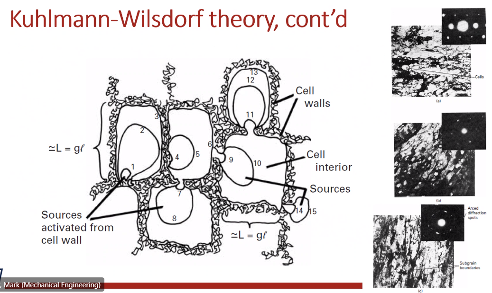 |
|:--:|
| Strains of 0.2, 0.4, and 0.8 strain of Ni. Clean areas in pictures are cell walls. \\(\tag{fig:kuhlmann_wilsdorf_example} \label{fig:kuhlmann_wilsdorf_example}\\) |

!!! question Are the cell walls the grain boundaries? <cite> Adam
	Eventually, they could form into grain boundaries. These could be thought of as low-angle grain boundaries until sufficient [[cold-working]] is applied to misalign them.

#### Summary
[[work-hardening]] happens with the introduction of defects to the crystal structure. 

!!! quote <cite> Atwater
	[[dislocation-density]] controls overall [[work-hardening]] capacity.

---

*Lecture: October 27, 2021*
### Softening and Texture
[[work-softening]]
: The weakening of a material under increasing strain can come from several sources:
: - *[[damage]] accumulation*: primarily in ceramics and composites where interfacial failure and microcracks weaken the structure.
: - *Radiation-hardened materials*: the high [[vacancy-concentration]] can aid in [[dislocation-motion]] causing the formation of [[dislocation-channels]].
: - *Geometric softening*: caused by grain rotation to favorable slip orientations such that the component of shear stress increases under a given applied stress (**different than necking**, which is an apparent softening caused by geometric constraint). This could like a decrease on the true stress-strain curve.
: - *Thermal softening*: internally generated heat from the work of deformation, not externally applied heat (e.g. [[hot-working]]).

!!! question Can [[fatigue-cracks]] be included to the [[damage]] accumulation? <cite> Adam
	Absolutely. Any microvoids near the end of the metal's service life would certainly be included.

#### Thermal Softening
Energy involved in deformation is mostly converted to heat: $ < 10%$ stored as defects. Accumulation of heat at sites of deformation is strongly influenced by the thermal conductivity and heat capacity of the material. This response is also sensitive to elevated temperatures, and high [[strain-rate]] will be fast enough to adversely affect mechanical performance.

|  |
|:--:|
| Not all tests will be in the ballistic regime, but increasing the [[strain-rate]] to as much as $1 s^{-1}$ is enough to affect performance. \\(\tag{fig:thermal_softening_curves} \label{fig:thermal_softening_curves}\\) |

Temperature effect can be determined from conversion of mechanical energy into heat in small increments as governed by

$$\begin{equation}
\Delta T = \frac{\beta}{\rho C_{p}}\sigma\Delta \epsilon
\label{eq:thermal_softening}
\end{equation}$$

, where $\beta$ is the conversion rate, $C_{p}$ is the heat capacity, and $\rho$ is the material density. Isothermal curves assume full heat dissipation and no [[work-softening]] and the adiabatic curve will be the isolated effect of heat on mechanical performance.

!!! attention
	Adiabatic conditions should be justified in the testing conditions!

#### Adiabatic Shear Bands
Adiabatic [[shear-bands]] are highly localized regions of deformation where softening occurs which results in overall softening and deformation along these orientations. The higher the [[strain-rate]], the more likely the formation of [[shear-bands]]: e.g. forging and ballistic impact. Inhomogeneous microstructures can be problematic for later use if not accounted for: i.e. forging more so than ballistics. High temperatures localized at these [[shear-bands]] can result in [[recrystallization]] within the region which causes grain-size strengthening. This deformation mechanism is *desirable* in armor-penetrating munitions.

#### Texture
Crystallographic reorientation of the microstructure can occur at large strains in a single direction. This type of strain is encountered in rolling, extruding, wire drawing, and other manufacturing processes. [[slip-planes]] will align to the rolling plane and the [[slip-directions]] will align to the rolling direction. Resulting properties of a textured component are [[anisotropic]] with greater strength along the major axes of the grain: e.g. in rolling, this would be the rolling direction.

|  |
|:--:|
| bar \\(\tag{fig:rolling_texture} \label{fig:rolling_texture}\\) |

#### Texture Effects
[[anisotropy]] must be considered for future processing and applications. A result will be variable [[yield-strength]] and [[ductility]] depending on direction. This could be beneficial when loading axis or other property is controlled during its use: e.g. magnetic properties of ...

!!! example Rolling a copper plate.
	If drawn into a cup shape, the deformation behavior will be markedly different depending on orientation.

| 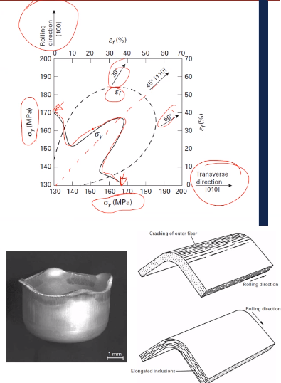 |
|:--:|
| bar \\(\tag{fig:texture_effects_from_rolling} \label{fig:texture_effects_from_rolling}\\) |

!!! question Does annealing remove texture effects? <cite> DK
	Annealing allows for [[recrystallization]] to "erase" the elongated, [[texture]] grains into smaller, equal sized grains.

#### Measuring Texture
|  |
|:--:|
| Characteristic pole figure from brass. \\(\tag{fig:measuring_texture} \label{fig:measuring_texture}\\) |

|  |
|:--:|
| The pyramid is actually a cube and these figures denote the orientation of only a single crystal. \\(\tag{fig:pole_figures} \label{fig:pole_figures}\\) |

| 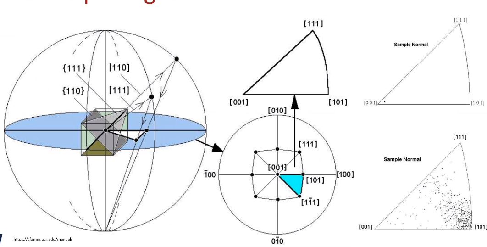 |
|:--:|
| This converts the pole figure back to the stereographic projections. \\(\tag{fig:inverse_pole_figures} \label{fig:inverse_pole_figures}\\) |

| 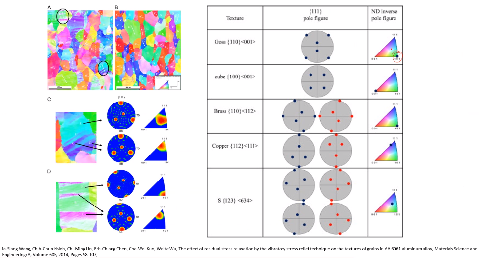 |
|:--:|
| This was looking at process of relieving stress in aluminum. If there is color concentration, then there is texture. \\(\tag{fig:example_of_texture_from_literature} \label{fig:example_of_texture_from_literature}\\) |

---

*Lecture: October 29, 2021*
## Solution and Second-Phase Strengthening
### Elastic Interactions
#### Introduction
Our treatment of metals and the defects within them has been primarily concerned with pure metals. The vast majority of "real" metals are alloys, and the role of alloying elements can be multi-faceted. The way alloying elements interact with dislocations depends on their size, what position they take in the lattice, and the amount (concentration) of those elements.

#### Substitutionals versus Interstitials
[[substitutionals]]
: The alloying element takes the lattice site of the matrix metal.
- Solvent: majority element in alloy.
- Solute: minority element(s) in alloy.
- |  |
|:--:|
| For example, in Cu-Zn, the zinc atoms, [[solute]] take the place of copper, [[solvent]]. \\(\tag{fig:substitutional_versus_interstitials} \label{fig:substitutional_versus_interstitials}\\) |

Alloying has a solid solution form, such that no precipitation of segregation of elements occur. [[Hume-Rothery-Rules]] apply in guiding whether elements stay in solution, practically speaking.

#### Elastic Misfit
$$\begin{equation}
\Delta V = \bigg(\frac{4}{3}\bigg)\pi r_{0}^{3}(1 + \epsilon)^{3} - \frac{4}{3}\pi r_{0}^{3} = \frac{4}{3}\pi r_{0}^{3}[(1 + \epsilon)^{3} - 1]
\label{eq:elastic_misfit}
\end{equation}$$

The insertion of an atom into an undersized [[lattice-site]] causes a volumetric expansion (spherical). If $\epsilon$ is small, then the total volume change can be estimated with Eq. \eqref{eq:elastic_misfit}: $$\Delta V \approx 4\pi r_{0}^{3}\epsilon$$ The reason for this approximation comes from squaring or cubing $\epsilon$ which becomes much smaller, $\require{cancel}\cancelto{0}{\epsilon^{n}} \text{, for } n \geq 2$.

| 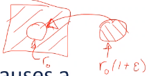 |
|:--:|
| The $\frac{4}{3}$ in these equations comes from the volume of a sphere, $\frac{4}{3}\pi R^{3}$. \\(\tag{fig:elastic_misfit} \label{fig:elastic_misfit}\\) |

#### Stress Fields in Polar Coordinates
Recalling Fig. \ref{fig:edge_dislocation_stress_equation_example} for [[edge-dislocations]]: $\stressTensor{-\frac{G\burgers\chi_{2}(3\chi_{1}^{2} + \chi_{2}^{2})}{2\pi(1 - \nu)(\chi_{1}^{2} + \chi_{2}^{2})^{2}}}{\frac{G\burgers\chi_{2}(\chi_{1}^{2} + \chi_{2}^{2})}{2\pi(1 - \nu)(\chi_{1}^{2} + \chi_{2}^{2})^{2}}}{-\frac{G\burgers\chi_{2}\nu}{\pi(1 - \nu)(\chi_{1}^{2} + \chi_{2}^{2})}}{\frac{G\burgers\chi_{1}(\chi_{1}^{2} + \chi_{2}^{2})}{2\pi(1 - \nu)(\chi_{1}^{2} + \chi_{2}^{2})^{2}}}$ yields:

$$\begin{split}
\sigma_{rr} = \sigma_{\theta\theta} &= -\frac{G\burgers}{2\pi(1 - \nu)}\frac{\sin(\theta)}{r} \\\\
\sigma_{zz} &= -\frac{\nu G\burgers}{\pi(1 - \nu)}{\sin(\theta)}{r} \\\\
\sigma_{r\theta} &= -\frac{G\burgers}{2\pi(1 - \nu)}\frac{\cos(\theta)}{r} \\\\
\sigma_{\theta z} &= \sigma_{zr} = 0 \\\\
\sigma_{p} &= \frac{1 + \nu}{1 - \nu}\frac{G\burgers}{3\pi}{\sni(\theta)}{r}
\end{split}$$

|  |
|:--:|
| Recall that the stress field is loosely related to $5\burgers$. If you can squish smaller atoms into the solute, then the smaller atoms want to rise to the top of the dislocation which minimizes the local stress to straighten the dislocation. \\(\tag{fig:stress_field_in_polar_coordinates} \label{fig:stress_field_in_polar_coordinates}\\) |

#### Interaction Energy
As described by Eshelby:

$$\begin{equation}
\begin{split}
U_{int} &= V\sigma_{ij}(\epsilon_{ij})_{T} \\\\
U_{misfit} &= \sigma_{p}\Delta V = \frac{1 + \nu}{1 - \nu}\frac{G\burgers}{3\pi}\frac{\sin(\theta)}{r}4\pi\epsilon r_{0}^{3} = A\frac{\sin(\theta)}{r} \\\\
A &= \frac{4}{3}\frac{1 + \nu}{1 - \nu}G\burgers\epsilon r_{0}^{3}
\end{split}
\label{eq:interaction_energy}
\end{equation}$$

#### Interaction Force
$$\begin{equation}
\begin{split}
F &= -\frac{\partial U_{misfit}}{\partial r} \\\\
 &= A\frac{\sin(\theta)}{r^{2}}
\end{split}
\label{eq:interaction_force}
\end{equation}$$

Force from derivative of energy wrt distance from dislocation (Eq. \eqref{eq:interaction_force}). This is true for the area surrounding the [[dislocation-core]]. !!! tip [[interaction-energy]] is positiv above the [[slip-plane]].

#### Dislocation Pinning
The number of [[solute]] atoms near the dislocation determines how strongly the dislocation is prevented from moving. Using the [[Peach-Koehler-Equation]] (Eq. \eqref{eq:peach_koehler_equation}) with solute spacing, $L$ and distance from dislocation, $b$, then $$\Delta\tau = \frac{F_{max}{bL}} = A\frac{\sin(\theta)}{r^{2}bL}$$ The linear dispersion of solute preferred along [[dislocation-density]], $\rho$... 

#### Screw Dislocations and Interstitials

!!! attention
	No [[hydrostatic-stress]] on [[screw-dislocations]].

$$\begin{equation}
U_{misfit} = \dots
\end{split}
\label{eq:screw_dislocation_misfit}
\end{equation}$$

[[interstitials]] do not dilate the structure like [[substitutionals]] where $\epsilon_{11} = \epsilon_{22} = \epsilon_{33} = 0$. Instead, interstitial misfit is found by ...

#### Example from Research
Dr. Atwater found by experiment that placing antimony at the grain boundary of copper lost the nanograins to the boundary near $400\degreeC$ and not the $900\degreeC$ from numerical simulations (Thermal Stability of Nanocrystalline Copper Alloyed with Antimony).

$$\begin{split}
\Delta H_{el, vol} &= \frac{-2N_{Av}K_{Sb}G_{Cu}(V_{Sb} - V_{Cu})^{2}}{3K_{Sb}V_{Cu} + 4G_{Cu}V_{Sb}} \\\\
\Delta H_{el, rad} &= \frac{-24\pi N_{Av}K_{Sb}G_{Cu}r_{Cu}r_{Sb}(r_{Sb} - r_{Cu})^{2}}{\dots 3K_{Sb}V_{Cu} + 4G_{Cu}V_{Sb}}
\end{split}$$

#### Summary
Solid solution strengthening is an important benefit of alloying. The concentration of solute ...

---

*Lecture: November 01, 2021*

!!! summary Homework Overview
	|  |
	|:--:|
	| $L = 200 \mu m = 12cm$ comes out to exactly 600 magnification. Recall that $\bar{l} = \frac{L}{N_{l}M}$, where $M$ is scale ratio of the depicted scalebar to its physical length and length of drawn lines. **Remember to multiply by $\frac{3}{2}$ to get the grain size!** \\(\tag{fig:problem_5_10_solution} \label{fig:problem_5_10_solution}\\) |
	|  |
	|:--:|
	| Looking at Table 5.3 does not give AISI 304 Stainless Steel properties. Refer to Fig. 5.23 for slopes of annealed and work-hardened AISI 304 to solve the [[Hall-Petch-Equation]] \\(\tag{fig:problem_5_xx_solution} \label{fig:problem_5_xx_solution}\\) |
	**When speaking on ASTM grain number, look to Example 5.1! $N = 2^{n - 1}$.**
	|  |
	|:--:|
	| Think of planes that are equal, but of opposite signs. Hint: $\ln(\theta_{1}\theta_{2}) = \ln(\theta_{1}) + \ln(\theta{2}) < \ln(\theta_{1} + \theta_{2})$ \\(\tag{fig:problem_5_5} \label{fig:problem_5_5}\\) |

!!! summary Exam Review
	- Lecture 16 (Grain-boundaries)-23 (asdf)
	- Dr. Atwater is not concerned with work equations. Recall the difference between [[tilt-boundary]] and twist dislocations and their dislocation spacing: $D \approx \frac{\burgers}{\theta}$.
	- [[Schmid-Factor]] would also be included (Eq. \eqref{eq:schmid_factor}).
	- Know the generics about stereographic triangles: e.g. knowing which [[slip-system]] is active. Remember that the lens, triangle, and square connote the number of symmetric axes wrt the projection. **There will be drawing of stereographic projections! Only know the basics.** Use $\cos(\theta) = \frac{h_{1}h_{2} + \dots}$ to find the angle between slip-systems.
	- Taylor Hardening, Schmid Factor, pretty much anything from the slides and math from the homeworks. **Eq. 6.5** for dislocation density.

---

*Lecture: November 05, 2021*
### Dislocation-Solute Interactions
Solutes affect [[dislocation-mobility]]. [[stress-strain]] curves may be useful to determine the bulk effect and importance to processing. Phenomena of [[dislocation-solute-interaction]] and their parameters determine the magnitude of their influence.

#### Introduction
Every impoerfection in a crystal has some stress field associated with it. Pure, single crystals are "perfect", but could still include other dislocations. Point defects are [[interstitials]]. Overall energy can be lowered by [[diffusion]] to tensile side of dislocation. This enriched area is a localized "atmosphere" that causes a dislocation to be "trapped". The usefuleness and drawbacks of this behavior can be understood through alloy and processing decisions.

#### Upper/Lower Yield Phenomenon
Low carbon steels exhibit a differential yield stress, characterized by a lower stress plateau (not a common curve). This is caused by a Cottrell atmosphere around a dislocation that locks the dislocation in place: [[interstitials]] diffuse to the [[dislocation-core]] to reduce stress. The effect is most pronounced when the mobility of solute atoms and dislocations is similar: modest temperature required for [[diffusion]] to occur, but not rapidly.

|  |
|:--:|
| The stress required to break them must exceed the yield strength; therefore, the stress will reduce once broken. However, this stress is higher than that required to move them. A solute will want to stick with the dislocation. This could be thought of as [[work-softening]]. \\(\tag{fig:solute_motion} \label{fig:solute_motion}\\) |

If they do are not locked together, then the yield would be the typical yield stress of material. The book often refers to "removing the yield point" does not mean there is no yielding, only that there is upper-yield point. ==Solutes pin dislocations because of overlapping stress fields.== Solutes need time to diffuse to dislocation for this to work. Once the solute breaks free, it will not immediately go to another dislocation during motion. Once stopped and given sufficient time, then the solute will diffuse.

Aging
: Typically means that some material was precipitate hardened.

The applied stress is greater than required to move dislocations, but is less than what is needed to unlock the dislocation from the solute: think similarly to other [[dislocation-obstacles]] where the dislocation would move if it could. The effect of [[substitutionals]] is limited in this regard and requires higher temperature to permit reasonable [[diffusion-rate]]. A solute "atmosphere" may also be called something similar: e.g. [[Cottrell-Bilby-Cloud]]. These solutes have no reason to remain orderly which is essentially an [[interstitials]] problem: think [[Second-Law-of-Thermodynamics]].

#### Luders Banding
The lower yield plateau exhibits an irregular stress, fluctuating around an average value. The strain during this stage is referred to as yield point elongations. This behavior is governed by the formation of [[deformation-bands]] ([[Luders-bands]]) where the material yields locally. As the strain increases, the bands multiply and the yielded volume extend through the sample. www.vimeo.com/4586024 *Starts off all clean, smooth, and polished, but these bands began to form under deformation along the preferential shear directions. These bands extend across the whole cross-section. Does not matter if angled down-left versus down-right: once one band forms, the stress field resolves to the same direction.*

Once fully accumulated, the [[stress-strain]] behavior takes a more normal [[strain-hardening]] character. This behavior is problematic for the geometrical perturbations it causes, especially in thin components. It can be reduced through 1) alloying: adding elements that will react with [[interstitials]] and bind them in a compound, or 2) pre-straining: deforming the material past the lower yield point so that is behaves uniformly in further deformation.

#### Strain Aging
When you break free of the solute but not quite totally. Dislocations have moved, but there is a hardening effect: usually in terms of precipitates present in alloys by heating and then giving time for diffusion of precipitation. This is the return of solutes through strain so far past the yield point, but then relax from loading. While the component sits on the shelf, carbon has time to diffuse to dislocations which hardens the material again. If held under constant stress, then this process happens much quicker to enhance diffusion. Pre-strained materials cannot be left that way for a long time: the material must be strained again.

#### Dynamic Strain Aging
Dislocations broke free, but carbon caught up over time. In this instance, the solute atoms can actually keep up with the dislocations: the dislocations are not moving that fast. The solutes have higher mobility than the dislocations which are repeatedly pinned hardening and leading to higher tensile strength. Higher temperatures for higher diffusion rates that the solute moves with the dislocation. This does not affect yield, per se, mainly the ultimate tensile strength.

!!! summary Solute-Dislocation Motion Relationships
	- Solutes are pinned to dislocations which break free at the lower yield.
	- Dislocations freed from pinning solutes, but the solutes return over time: strain aging.
	- Solutes keep up with dislocation: dynamic strain aging.
	- Or some mix of these.

#### Stress-Strain Serration
The "serrated" appearance in a [[stress-strain]] curve (sometimes seen in twinning experiments) can be described by various mechanisms of deformation: [[twinning]], martensitic transformation, and intermittent pinning of dislocations. This is known at the [[Portevin-Le-Chatelier-Effect]]. This depends on [[dislocation-density]], [[solute-concentration]], [[strain-rate]], etcetera.

#### Snoek Effect
This describes the effect of uniaxial stress on [[interstitials]] (internal friction). With [[poisson-ratio]] in mind, a stress on one axis will result in different stresses on the other axes. A *z-axis* stress will increase the *z-axis* [[interstitial-volume]] and contract the *x* and *y*. This only occurs for loading that results in differential effect: e.g. not for $\millerPlane{1}{1}{1}$ loading. [[interstitials]], which are regular site atoms and not those pinning dislocations, will then move to the more spacious location on *z*. Can be measured with torsional pendulum:

$$\begin{split}
\tan(\delta) &= \frac{\log(\text{decrement})}{\pi} = Q^{-1} \\\\
 &= \frac{\ln(\frac{1}{n})}{\pi vt}
\end{split}$$

|  |
|:--:|
| Contractions within the *xy-plane* forces [[interstitials]] to the larger spaces along the *z-axis*: internal friction. This is similar to [[hydrogen-embrittlement]] or cast metals. Distributions of carbon vary when material is stressed. The number of cycles and rate of decay goes into the $\ln(\text{decrement})$. \\(\tag{fig:snoek_effect_with_torsional_pendulum_example} \label{fig:snoek_effect_with_torsional_pendulum_example}\\) |

#### Blue Brittleness
Dislocations are moving and solutes pin them, but the dislocations break free (similar to dynamic aging). However, this is a special case: within a specific temperature range the solute atoms will outpace the dislocations and induce dynamic strain aging. This lowers the ductility and increases the yield strength by dynamically pinning the dislocations. This is a special case of [[Portevin-Le-Chatelier-Effect]].

#### Summary
Dislocation and solute interactions of alloys have decisive effects on the mechanical properties. Temperature affects diffusion rate and strain rate determine rate of dislocation motion versus solute motion. **If, in the formulation of your *Critical Review*, you make an outline of what you want to say, then you can simply plug-n-play.**

---

*Lecture: November 08, 2021*

!!!  summary Exam Answers
	1. The goal was supposed to be simple...however, the trick was to multiply by $\frac{3}{2}$. If wrong number used in next problem, minimal points lost.
	2. Energy increases with angle with more dislocations and more energy; however, modeled as surface tension for higher angles. The energy drops because coincident lattice sites boundaries are more coherent. $\Sigma$ values are indicative of the coincident lattice sites. $\Sigma3$ is a twin boundary and completely coherent.
	3. A mirror.
	4. Low temperature and high strain rate.
	5. Orowan hardening: twin boundaries block slip and glide.
	6. Simply use the table values: $\sigma_{y} \approx 806 MPa$, $\sigma_{y, twin} \approx 1763 MPa$.
	7. $\tau \approx 597.2 MPa$. Only getting the number really mattered and showed tracking of units.
	8. As long as processed was followed (if wrong number from previous problem), then all was fine; however, Hall-Petch stress was the resolved shear stress: did not need to bring in dislocation density or anything like that.
	Bonus. <100>, <110>, <111> and 4 slip systems at <110>.

	The overall average was $\sim 92$.

### Precipitation and Dispersion Strengthening
*(Absolutely no math in this section.)*

#### Precipitation Hardening
Formation of a second phase by the separation or concentration of elements from the homogeneous mixture. Only select alloys can precipitation hardene, and the most important commercial alloys are based on aluminum and nick Aluminum alloys yield lightweight yet strong structural materials, and nickel alloys provide strong, heat-resistant options. The way elements separate from the mix (size, shape, location, etcetera) is determined by chemistry and processing, and the mechanical properties follow suit.

#### Precipitation Process
Basic process of [[precipitation-hardening]] involves three steps:

1. Solutionizing (Solubilization)
2. Quenching
3. Aging: reheating after quenching.

The time and temperature of these steps is determined by the alloy system, and both are important to the maximum hardness.

#### Precipitation Mechanisms
The rejection of a solute from a super-saturated solution will progress through various stages. Using Al-Cu as the archetype, the Cu will first form in clusters along Al $\millerPlaneFamily{1}{0}{0}$ planes: aka [[Guinier-Preston-Zones]] (#GPZ). The zones do not have a distinct crystallographic structure at first and are coherent with the matrix lattice, though a stress field is introduced. As the zones grow, the lattice mismatch increases until the planes are no longer fully coherent, and this required the formation of dislocations to accommodate the structure. As the precipitates grow and assume a distinct crystallography, all coherency may be lost. High temperature treatment may rapidly progress growth, such that early stages are effectively skipped. **This will normally happen outside of our control!**

*[GPZ]: Guinier-Preston Zone

#### Composition and Temperature Effects
Additional Cu will result in more #GPZ. Higher temperatures will accelerate precipitation. #GPZ are quickly transformed to precipitates. Those precipitates grow and become larger and farther apart. This allows for [[dislocation-bowing]] around them more easily. ==Lower temperatures allow for more uniform distribution of precipitates.==

#### Coherency
A second phase can exhibit varying degrees of coherency with the matrix. The lattice spacing must be exact to exhibit full coherency (unlikely). The more similar the phases are, the greater the degree of coherency and the greater the elastic strain is.

#### Preferential Precipitate
To accommodate strain more readily, grain boundaries may be preferred sites for precipitation, thereby depleting the surrounding material from solute. This leads to variability in properties, possibly leading to enhanced grain boundary corrosion or loss of strength. An example is given of the consequences of solute depletion and plan ol' bad design with de Havilland Comet.

### Dispersion Strengthening
Unlike precipitates, dispersions are second particles added to a metal that are often completely different in properties and structures. Much like other composites, the amount and characteristics of the second phase will determine the overall properties. A dilute dispersion will maintain the metallic nature of the mixture, but it will have added strength through dislocation obstacles. These should be small and uniformly dispersed: can be mixed in or created in situ by chemical reaction. Dispersions...

---

*Lecture: November 10, 2021*
### Dislocation-Particle Interactions
Introducing basic concepts of [[dislocation-particle-interactions]] and determining the primary parameters that determine how dislocations will interact with particles. [[dislocation-bowing]] and [[dislocation-shearing]] have factors that determine the mode of passage. Processing considerations and variations within and across compositions may be relevant to [[dislocation-particle-interactions]].

#### Introduction
The inclusion of precipitates and particle dispersions is an effective way to strengthen an alloy (especially non-ferrous alloys). Form of particles is determined by composition and processing, and that will determine the mechanical performance. The primary factors that determine degree of strengthening are the [[particle-size]], [[volume-fraction]], and [[shear-strength]]. There is a way to minimize [[dislocation-motion]] by the presence and size of particles.

#### Dislocation (Orowan) Bowing
If particles are within [[slip-plane]] of a dislocation, the dislocation will be impeded by their presence. 

\eqlab

*insert image*

Assume particles are impenetrable obstacles as basis for Orowan-model of strengthening. Particles are incoherent with matrix such that dislocations cannot pass through any glide-plane. Total shear stress to yield the material is then a combination of the pure matrix strength, $\tau_{m}$ and the dislocation-pinning:

\eqlabe

A more explicit treatment was subsequently developed by Ashby, where the particle radius is considered and predicts strengthening of $\sim0.5$ of the Orowan value: 

\eqlabe

#### Particle Shearing
This mechanism of strengthening assumes [[dislocation-motion]] may pass through particles. This will occur if the stress necessary to pass a dislocation through the particle is less than the stress required to bow the dislocation around the particle: a function of the particle properties and the spacing of the particles.

\eqlab

This indicates that small, hard particles (e.g. oxides, carbides, nitrides, etcetera) within a softer, metallic matrix will be more likely to be controlled by particle spacing than particle shearing. Precipitation occurs....

#### Shear Stress in Particle Cutting
IF the dislocation-glide-plane is coherent with the precipitate, then the stress needed to shear the particle will be determined by the energy of the surface created by passage of the dislocation. Assuming a sphereical particle, the work to cut the particle in two is equivalent ot the creation of the new surface: 

\eqalign

*insert imgae*

#### Volume Fraction
The higher the concentrated of the second phase, the more volume fraction there will be. The volume fraction is determined by composition and precoessing, and size and spacing are inversley proportional. With a uniform, cubic distribution, the volume fraction , $f$ will: 

\eqalign

*insert image*

#### Considerations in Precipitation
During precipitation, there are various conformations as the solute phase(s) come out of the solution during aging. As more particles are formed and grow, the relative abundance of them at these stages will control overall performance. The general behavior follows the relationship: $\tau \propto \sqrt{rf}$. As aging progresses, the radii of particles increases and the balance between bowing and shear changes: i.e.g Ostwald ripening. The critical radius is that where the transition from shear to bowing occurs.

*insert image*

!!! note (The thermal stability of nanocrystalline copper cryogenically milled with tungsten)[https://www.sciencedirect.com/science/article/pii/S092150931201101X?via%3Dihub]
	With some leftover, "pure" copper, its hardness drops dramatically with greater annealing temperatures but less so when tungsten is allowed precipitate into the copper. The characterization class next fall goes into this.

	$$\begin{split}
	P &= \frac{2\gamma}{R} \\\\
	P_{z} &= \frac{3f\gamma}{2r} \\\\
	D &= \frac{4r}{3f}
	\end{split}$$

	The more heating, the more the particles want to grow. ==Particles directly contribute to hardness or through dislocation blocking.== Ideally, particles would be aligned along the major axis to the grain boundary.

#### Summary
Dislocations can bow between bow or shear through particles. Small particles and those with coherency are more likely to be sheared. Incoherent, very hard, and larger particles are less likely to be sheared. The spacing of particles is also critical, as bowing is easier around widely spaced particles. The process of precipitation hardening ... ==Particles will either shear or bow, whichever is more favorable.==

!!! tip Critical Review
	Any topic covered can be discussed more than the others: not all topics need the same amount of explanation. Demonstrate your knowledge in those topics.

---

*Lecture: November 12, 2021*

!!! example (10.16) An aluminum alloy is strengthened by diffused, alumina particles with radius, $d = 15 \mu m$ at $3\\% Al_{2}O_{3}$ (weight-percent). Estimate the strength if $G_{Al} = 28 GPa$, $\rho_{Al} = 2700 \frac{kg}{m^{3}}$, and $\rho_{Al_{2}O_{3}} = 3960 \frac{kg}{m^{3}}$. Assume that there is no particle cutting.

	We want to find [[volume-fraction]]. Recall $V = \frac{m^{\*}}{\rho}$.

	$$\begin{split}
	f &= \frac{(\frac{m^{\*}}{\rho})_{\text{solute}}}{(\frac{m^{\*}}{\rho})_{\text{solvent}} + (\frac{m^{\*}}{\rho})_{\text{solute}}} \\\\
	&= \frac{(\frac{0.03}{3.96})}{(\frac{0.97}{2.70}) + (\frac{0.03}{3.96})} = 0.0207 \\\\
	\text{Recall: } f &= \frac{4\pi}{3}\frac{r^{3}}{x^{3}} \\\\
	\implies x &= \bigg(\frac{4\pi}{3f}r^{3}\bigg)^{\frac{1}{3}} \\\\
	&= \bigg(\frac{4\pi}{3(0.0207)}(15e-6)^{3}\bigg)^{\frac{1}{3}} \\\\
	&= \bigg(6.83e-13)^{\frac{1}{3}} \\\\
	&= 8.81e-5 [m] \\\\
	\text{Recall: } \tau &= \frac{G\burgers}{x} = \frac{(28e9)(0.286e-9)}{8.81e-5} \\\\
	&= \frac{8.008}{8.81e-5} \\\\
	&= 9.09e4 Pa \\\\
	\boxed{\tau &\approx 91 kPa}
	\end{split}$$

	This $\tau$ is not necessarily the shear stress of the material, but is the contribution of the particles to the overall shear stress.

## Martensitic Transformation
### Structure and Morphology
#### Objectives
- Introduce the concepts of martensitic transformations
- Detail various morhpologies of martensite
- review the TTT curves

#### Introduction
Martensite forms through a diffusionless (or nearly) process. Martensitic transformations have three primary applications:

1. Strengthening
2. Toughening
3. Shape-memory

The mechanisms and microstructure can take different forms depending on the composition. Processing and outcome will also vary depending on the material system.

#### Martensite Process
Usually, we think of steels because of its significance. This technique is widely used to strengthen steel and is most often found [OQ5lViYssko]. Not based on time because it is a diffusionless process which does not restructure the atom, but the displacement. The relationships will be informed by other alloying elements, but the general process follows a general process [[austenization]] $\rightarrow$...

#### Quick Review
|  |
|:--:|
| We move from [[austenite]] (#fcc, also known as $\gamma$-iron) to [[martensite]] via temperature to erase the prior microstructures. \\(\tag{fig:quick_review_of_ttt_diagrams} \label{fig:quick_review_of_ttt_diagrams}\\) |

*[TTT]: Time-Temperature-Transformation

Quench does not need to be objectively rapid, but is a relative rate of cooling which depends on the material and its initial microstructure.

#### Other Systems
This analysis extends to material systems beyond steel and #BCT microstructures:
- #TRIP steel: retained austenite transformed during deformation
- Ausforming: deform metastable austenite and then 	quench
- Maraging: combination of martensite and intermetallic formation (think precipitation from martensite to austenite)

*[BCT]: Body Centered Tetragonal

#### Transformation
Martensitic transformation are (ideally) diffusionless, such that strain energy dominates the kinetics to make the material more brittle. The transformation may be competitive with diffusional elements, and cooling rate is important: diffusion will be favorable at high temperatures. Where austenite becomes unstable the #TTT diagram can map what phase(s) will form: high alloys will allow much more time for cooling.

|  |
|:--:|
| At higher temperatures, martensite requires much stress to form over austenite which is way martensite favors lower temperatures. \\(\tag{fig:martensite_austenite_competition} \label{fig:martensite_austenite_competition}\\) |

#### Morphologies
Martensitic phases take three general forms:

1. Lenticular
2. Lath
3. Acicular

The substructure of the lath is characterized by dislocations and/or twins. As these phases form, they block other formations which creates backstress. Lenticular is most common in high Ni (30%) and high C (0.6%) Fe alloys Lath martensite forms as "blocks" comprised of "laths" arranged in "packets" separated by low-angle grain boundaries: blocks are a few to tens of microns in size. Acicular martensite is needle-like and forms at the intersection of [[slip-bands]]: forms in austenitic stainless and has significant impact on strength, some steels can become tougher at cryogenic temperatures.

#### Defects in Martensite
Martensite will contain and interact with defects in the microstructure. Examples of twins inside and through martensite are given, but a combination of slip and twinning may occur. Dislocations may be introduced by the crystallographic reorientation and the consequent lattice differences. Twinned martensite (lenticular) will be more brittle than dislocation martensite (laths) due to the twins' blockage of slip.

#### The Habit Plane
All martensite has an undistorted, unrotated plane during transformation. This plane has the same indices in the parent and martensite phases: the plane does not move/change before to after transformation.

#### Summary
Martensitic transformations are diffusionless, but comes in many forms with many different impacts because of its dependence on temperature and the order in which the various phases form. The most common way to form martensite is through quenching.

---

*Lecture: November, 15, 2021*
### Stress and Strain Effects
Martensite in FeC has the biggest outcome to strengthening.

#### Introduction
Martensite is an effective way to increase strength in ferrous alloys. The composition determines the overall strengthening effect, by they share many commonalities. The formation of martensite creates dilation and distortion of the lattice, such that stress and strain results.

#### Martensite Strength
Ferrous martensitic phase provides the greatest strengthening effect. Formation of martensite in sufficient quantity will increase hardness from HRC (Rockwell Hardness, C-scale) 15 to 65. The mechanisms of hardening have been debated for decades, and are now attributed to a combination of factors:

- Dislocation density increases,
- Boundary strengthening,
- Solid Solution strengthening,
- Carbon clustering, etcetera.

#### Grain Size and Solution Strengthening
Hall-Petch hardening is reflected in martensite formation. Smaller grains produce finer martensitic lens. The slope of the Hall-Petch curve may not be affected, but it will be shifted up by increasing carbon content. Grain size is typically not a critical factor in hardened steels in the usual range: $> 100 \mu m$. Substitutional solid solution strengthening is also relatively *unimportant*, but interstitial is.

|  |
|:--:|
| Recall that the last two alloying number denote weight-percent carbon. The more carbon, the higher propensity for martensite hardening. \\(\tag{fig:grain_size_solution_curves} \label{fig:grain_size_solution_curves}\\) |

#### Interstitial Hardening
If martensite is considered as a supersaturated, interstitial solid solution, then it is the major contributor to strength. The strengthening, then, can be thought of as interactions between dislocations and single atoms, where the shear, yield stress is related to the maximum force, $F_\text{max}}$ dislocation line tension, $T$, solute concentration, $C$, and angle of displacement when passing through the solute, $\phi'$: $$\tau_{0} = \bigg(1 - \frac{\phi'}{5\pi}\bigg)C\bigg(\frac{F_{\text{max}}}{2T}\bigg)^{\frac{3}{2}}\sqrt{3C}$$ Strength increases with square root of the concentration. Snoek-ordering (single jump energy minimization) is quick; whereas, formaing a Cottrell atmosphere requires long-range diffusion.

#### Carbon Effects
Carbon causes lattice distortions and shear strain. They will move to regions around screw and edge dislocations that cancel these strains or reduce them. These Cottrell atomspheres will strengthen the alloy in static and dynamic "aging". Carbon may also cluster together and strengthen martensite (without changing its structure): this is most favorable at lower temperatures, as sufficient thermal energy will convert the phases to cementite or other structures. Precipitation can also occur, where some cementite particles are formed within martensite and is more effective at strengthening.

#### The Whole Enchilada
The presence of fine (nanoscale) twins within martensite will also prevent dislocation movement and aid strengthening even more effectively than the other solution or precipitation hardening mechanisms. High dislocation densities associated with martensite will also result in increased strength. Lattice stress (Peierels stress) also contributes to the total, and is highly temperature sensitive. Overall, the various strengthening mechanisms...

#### Stress-Martensite Interaction
The formation of the martensitic structure will induce a lattice stress and can be aided or inhibited by applied stress. Imagine a martensitic lath forming, such that, an initially straight line through it would be distorted. There are two strain: dilation (normal) and distortion (shear).

#### Martensitic Transformations and Stress
Because martensite induces stress to the lattice, stress can affect its formation (stress-assisted martensite). There is work required to transform the structure, both by normal and shear stress/strain. Uniaxial tensions and compression increases $M_{s}$. Hydrostatic stress lowers (suppresses) $M_{s}$. The martensitic transformation can be driven by stress at a temperature higher than it normally would occur.

#### Mechanical Effect
Martensitic transformation causes a distinct drop in load during tensile testing. In the elastic regime, the stress of formation is the yield stress. Grain size and pre-strain increase $M_{s}$.FU_{i}

#### Strain-Induced Martensite
#TRIP steels use strain-induced martensite formation to achieve high strength and ductility. Results in localized strengthening around necked regions, cracks, etcetera.

#### Martensite Fracture
Usually initiated at the martensite boundaries. The martensitic phase is harder in higher carbon alloys with cracks traversing the laths or plates. Microcracks form when one lens impinges another forming a stress concentration. Tempering can softern the overall structure, but impurities may segregate to boundaries and actually embrittle the material.

#### Summary
Martensite has important effects on the strength of materials....

---

*Lecture: November 17, 2021*
### Shape Memory
#### Objectives
Shape-memory effects from shape-memory alloys from certain, underlying principles: especially martensitic phase formation.

#### Introduction
Practical applications of shape memory alloys are numerous, and understanding the phenomena is critical to their control. A martensitic phase transformation is not for strengthening in this case, but rather it is used to exploit elasticity and plasticity effects.

#### Overview
Ti-Ni is a typical, shape-memory alloy. The shape-memory effect (#SME) is a mechanical response that restores a metal to its original shape after plastic deformation by heating: this is only possible if plastic deformation does not occur by slip. Other alloys have also been developed that exhibit this behavior: AgCd, AgZn, AuCd, CuAl, FeBe, NbTi, etcetera.

*[SME]: Shape-Memory Effect

|  |
|:--:|
| bar \\(\tag{fig:nickel_phase_diagram} \label{fig:nickel_phase_diagram}\\) |

#### SME and Martensite
Martensite is a diffusionless transformation: it can be induced or inhibited by applied stress/strain. In #SMA, the original shape is set at elevated temperature in a disordered state ($\beta$, #bcc). During cooling, the phase transforms to an ordered #bcc/orthorhombic structure. The formation of martensite occurs at "low" temperature or by applied stress.

*[SMA]: Shape-Memory Alloy

|  |
|:--:|
| bar \\(\tag{fig:formation_of_martensite_from_austenite} \label{fig:formation_of_martensite_from_austenite}\\) |

#### Pseudo (Super) Elasticity
[[pseudoelasticity]]
: Property where an alloy can undergo significant amounts of strain and return to its original dimensions.

Martensitic phase forms due to stress at a temperature above $M_{s}$. The austentite/martensite interfaces are [[glissile]], and move throughout the material with an increasing abundance of martensite. The transformation accommodates strain much greater than typically observed, because as stress is reduced, the martensite reverses (again, above $M_{s}$) and the sample returns to its original dimensions.

|  |
|:--:|
| bar \\(\tag{fig:pseudoelasticity} \label{fig:pseudoelasticity}\\) |

|  |
|:--:|
| Notice correlations with the martensite/austenite temperatures. Above $A_{s}$, the full [[pseudoelastic]]] effect is observed. Between $A_{s}$ and $M_{s}$, the deformation is permanent with little elastic recovery: austenite cannot be formed to reverse it. Below $M_{f}$, the structure is already fully martensitic, so the strain-memory effect is dominant. \\(\tag{fig:pseudoelasticity_example} \label{fig:pseudoelasticity_example}\\) |

#### Martensitic Variants and Pseudoelasticity
The structure of martensite is a "twinned" rhombehedral structure, such that it maintains the same shape. Strain occurs by straightening out these "kinks" such that one orientation (variant) is preferred. The preferred variant depends on applied stress resolved on the variants. There may be many variants, especially in polycrystalline materials, but the cumulative effect is to convert the martensite to a preferred one, until heating reverses the structural changes to a more uniform distribution.

|  |
|:--:|
| bar \\(\tag{fig:martensitic_variants} \label{fig:martensitic_variants}\\) |

#### Strain Memory
[[pseudoelasticity]] is reversed by the austenite phase being in equilibrium. In the more popular #SME, strain memory, the variants do not reverse after stress is released. Strain is retained until heating allows the multi-variant structure to return: overheating will result in an austentic transformation. Some variants will prefer to form under tension/compression, and the localized response will be determined by that.

#### SMA Applications
- Sensors
- Actuators
- Dental wires
- Orthopedic implants
- Shrink-fit compression assemblies

#### Summary
#SMA have unique properties that mediated by martensitic transformation. The creation, modification, and reversal of martensite within these alloys allows unusual elastic and plastic behavior. In [[pseudoelasticity]], the primary mechanism is stress-induced martensitic transformation. In strain-memory, the primary mechanisms is de-[[twinning]] and re-[[twinning]]...

---

*Lecture: November 19, 2021*
## Intermetallics
!!! question What is an [[intermetallic]]? <cite> Atwater
	Effectively, an [[intermetallic]] is sort of a metal: metalloid. It is a metal with some ionic form to drive phase transformations.

### Objectives
Introducing this categroy, we will consider the various features that make an [[intermetallic]] unique. Their crystallographic structure is similar to metals, but their order is different. We will also determine mechanisms responsible for the unique behavior, and the limitations of these materials and strategies to overcome them.

### Introduction
An [[intermetallic]] are ordered metal alloys. They are energetically favorable with a negative bonding energy which introduces new possibilities and complexities to mechanical phenomena. The passage of dislocations creates a higher energy an		tiphase boundary...

The ordered alloys take on specific arrangement in equilibrium. It is important what elements are mixed, as not all will...

|  |
|:--:|
| An [[intermetallic]] may have the same weight percentage of elements as a metal, but are well-ordered. \\(\tag{71} \label{fig:difference_between_intermetallic_and_metal}\\) |

### Ordered Structures
Crystallographic structures can be described by Strukturbericht or space group designations.

!!! example Ordered Structures
	- A pure #fcc crystal is A1 (Strukturbericht) or Fm3m (space group).
	- A rock salt structure (#fcc) is B1 (Strukturbericht) or Fm3m (space group).
	- $Cu_{3}Au$ [[intermetallic]] (also #fcc) is #L1_{2}$ (Strukturbericht) or Pm3m (space group).

	| 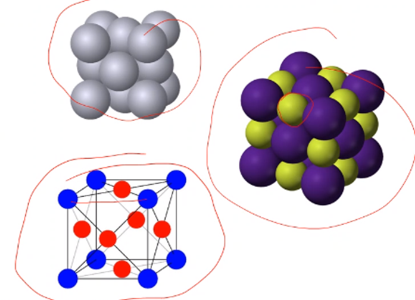 |
	|:--:|
	| Space groups care about symmetry, not atomic position. \\(\tag{72} \label{fig:ordered_structure_examples}\\) |

Space group is more general, but doesn't give alloy information. Lattice type (P, F, L) followed by symmetry wrt the x, y, and z axes, then the threefold symmetry of the body diagonals, followed, lastly, by any symmetry wrt the face diagonals, if present.

### Stoichiometry and Formation
The typical reference to an [[intermetallic]] category may be $AB$, $AB_{2}$, $A_{3}B$, etcetera. The concentration of elements A and B is critical to the properties but some deviation of the exact chemistry may occur. Intentional elemental substitution may be used to affect ordering and thereby...

negative enthalpy of mixing by ordering; otherwise, phase separation.

### Intermetallic Phase Diagrams

|  |
|:--:|
| Typically, an [[intermetallic]] is a binary, chemical composition. \\(\tag{73} \label{fig:intermetallic_phase_diagram_examples}\\) |

!!! note A Note on Silicides
	They are [[intermetallic]] with silicon, and they have relatively low densities and high melting points and high temperature strength, which sounds more like ceramics than metals.

### Dislocations in Intermetallics
Partial dislocations are a common feature in #fcc crystals, but they are not parellel to one anoth and cannot [[cross-slip]]. Recall that a high #SFE is characteristic of #bcc# metals and allows easy [[cross-slip]] because $\burgers$ lies in multiple [[slip-planes]] simultaneously. In an [[intermetallic]], two perfect dislocations are linked together by an #APB. The passage of the first dislocation disrupts the ordering, and the second dislocation restores it.

*[APB]: Anti-Phase Boundary

### APB Energy
Unlike partial dislocations, the leading dislocation and trailing dislocation are separated by a region of higher energy due to unfavorable order, but they are repelled by opposing stress fields. The combined dislocations are termed a [[super-dislocation]] since both are needed to fully translate the crystal structure: i.e. [[super-partials]].

|  |
|:--:|
| They have high strength because the energy penalty of disordering. \\(\tag{74} \label{fig:burgers_vector_in_multiple_planes}\\) |

|  |
|:--:|
| As a dislocation moves, there is a restoration from the #APB by the dislocation reordering the edge-dislocation. \\(\tag{75} \label{fig:antiphase_boundary_depicted}\\) |

Since each dislocation can thought to do half of the job, they can represented by $\frac{1}{2}\millerVectorFamily{0}{1}{0}$...

### Kear-Wilsdorf Lock
When [[super-partials]] cross-slip onto {100} it will inhibit mobility on {111}. When [cross-slip]] of a screw [[super-dislocation]] onto {100} planes occurs, [[glide]] of the remainder of the dislocation on the {111} system is restricted because the Peierels stress resisting [[glide]] on {100} is much higher than that on {111}.

|  |
|:--:|
| The energy separation is based on the balance between the dislocations and #APB. The result is a hardening effect and can be reduved through heating. \\(\tag{76} \label{fig:kear_wilsdord_lock}\\) |

### Order Parameters
Long-range order (#LRO) will produce different mechanical properties than short-range order (#SRO). #SRO has higher strength. The ordering parameter is given as a fraction, r, or the total atoms of A in the A positions and the total fraction of A atoms in the alloys is $f_{A}$: $$S = \frac{r - f_{A}}{1 - f_{A}}$$

*[LRO]: Long-Range Order
*[SRO]: Short-Range Order

### Mechanical Effects of Ordering
Ordering produces three stages in [[stress-strain]] curve:
1. well-defined yield point.
2. Linear [[work-hardening]].
3. No [[work-hardening]].

Disordered alloys do not exhibit stages 1 or 2, and have a gradual yield followed by stage 3. However, take these figures with a grain of salt because they are not likely going out to 70\% strain.

### Grain Size and Fatigue Performance
Ordered alloys also behave according to Hall-Petch Equation.

---

*Lecture: November 29, 2021*

!!! note Critical Review Presentation
	Discuss what the paper topic was and what your main takeaway from the paper was.
	You can go into one of your 5 topics.

!!! attention Final Exam
	Not cummulative, but from the previous exam...

### Second Phase Particles
This intermetallic plays a critical role in high-strength, high-temperature applications. It possesses low-coherency stress with the austenite matrix. Dislocation  passage must satisfy the energy considerations described earlier: distances between superpartials is dependent on particle size and spacing, and the interaction of the matrix and particle (elastic stresses).

### Temperature Effects
Some intermetallics increase in strength with temperature. in $\gamma'$, the strength increases with temperature and the austenite decreases, leading to nearly constant yield stress. While not all intermetallic display this, it is attributed to the change in dislocations mechanisms.

### Ductility
Limited by ordering and low-symmetry. High-temperature strength can be offset by a lack of low-temperature ductility for practical applications. Brittleness is caused by:

- Low symmetry in the crystal structure
- Grain boundaries as preferred....

#### Microalloying
Relatively ductile at RT in single crystal form--i.e. useless for polycrystalline materials--but has almost no ductility as a polycrystalline aggregate. Instead, it exhibits intergranular fracture. Intergranular fracture is often attributed to impurities such as S and from environmental effects such as moisture and hydrogen embrittlement. Boron can improve ductility from $0-50\%$.

#### Macroalloying
By exchanging some elements in the ordered structure for other, the symmetry may be increased for more ductility. $(Ni, Co, Fe)_{3}V$ can be modified in composition...

#### Composites and Environment
Combing intermetallics with metals accommodates the brittleness of the intermetallic. There are different modes of incorporating multiple phases, but the overall effect is similar. This isn't really increasing ductility in the intermetallic, just the overall...

### Summary
Intermetallics have range of unique properties: mechanical behavior...

## Porous Materials
### Objectives
- Introduce metal foams in general
- Highlight the diverse processing strategies and outcomes
- Determine the relevant modeling techniques for simplifying the structure
- Determine the behavior trends with changing density
- Discuss limitations of the treatments

### Introduction
Low density materials utilized for intrinsic properties or by introducing a low-density phase with a higher-density matrix. Most often air or otherwise "empty" space is the second-phase, which provides little to no mechanical support.

### Metal Foams Overview
The mostly widely available metal foams are aluminum, and those are created through liquid-state forming (introducing gas into a liquid). This can produce large sheets in low densities: meters across 10s of centimeters thick and $90\%$ porous.

### Solid State Foams

### Some Power Methods

### Precursor Porosity
|  |
|:--:|
| The constituents of the structure already contain open space. \\(\tag{77} \label{fig:precursor_porosity}\\) |

### Composite Structures
|  |
|:--:|
| Metal foams can be incorporated into solid structures to combine a high strength with impact absorption or increased stiffness. \\(\tag{78} \label{fig:composite_structures}\\) |

### Mechanical Considerations
Initial density will affect the elasticity as well as plastic behavior. Most notable among low-density metal foams is the plateau stress where the "pores" collapse until a high density is achieved and it begins to behave as a solid material. This makes metal foams particularly interesting for their energy absorption capabilities.

### Elasticity of Cellular Materials
Pores can be simplified to a series of interconnected beams, creating a 3D network. When force is applied under compression, the force is carried by beam bending. The beams are assumed to be of square cross-section and modeled by an end-loaded cantilever.

\eqalign_sans

The elastic modulus is reduced in square propoertion to the density:

\eqalign_sans

---

*Lecture: December 01, 2021*
## Corrosion
### Objectives
- Introduce concepts of corrosion
- Describe the electrochemical mechanisms in their general form
- Discuss various conditions for corrosion and practical work-arounds
- Determine the conditions of oxidation and the effects of it

==All very pressure/temperature dependent!!==

### Introduction
The affects of environment are universally important.
The temperature, moisture, acidity, ecetera will all play important roles determining the reactions that may occur with a metal or alloy.
The metal or alloy is equally important, and alloy design should at least consider corrosion, if not be thr primary consideration.
Practical consequences of environmental degradation are felt throughout daily life in the breakdown of materials: fading color, rusting metal, etcetera.

### Modes of Corrosion
Corrosion comes in many ofrms, with some being more troublesome than other.
All materials are subject to some environmental degradation, but metals are particularly susceptible because they are refined from their native state (ore) which is a ceramic and corrosion product.
The chemistry is critical, but other factors will influence corrosion type and rate as well.

|  |
|:--:|
|  \\(\tag{79} \label{fig:modes_of_corrosion}\\) |

### Will It Corrode?
The tendency of a metal to corrode depends on the environment.
The environment determines the reaction products.
The reaction products determine their stability/ability to prevent further corrosion.
For instance, a _passive_ metal will form a protective layer that prevents further corrosion.
An _active_ metal will continue corroding as the corrosion products are not protective, and may even increase the corrosion rate.
The behavior of a single metal and reactant will determine by the _potential_ of the system.

### Corrosion Electrochemistry
The corrosion of a single metal or homogeneous alloy is ditacted by the chemical reaction(s) available with the given reactants.
Corrosion of metals involves chemical reaction and the exchange of electrons.
The way this occurs can vary, but in the most general sense, corrosion proceeds by the loss of electrons.

!!! example
$$\begin{split}
M &\rightarrow M^{n+} + ne^{-} \\
2Al + 6HCl &\rightarrow 2AlCl_{3} + 3H_{2} \\
Al \rightarrow Al^{3+} + 3e^{-}
\end{split}$$

### Polarization and Passivity
The availability of electrons determines the reaction rate:

- A negative potential (too many electrons) is **cathodic polarization**.
- A positive potential (too few electrons) is **anodic polarization**.

|  |
|:--:|
| The steady-state potential is determined by the rate of electron exchange. Where a passive film is produced, the corrosion rate drops until extremely high potentials can break down passivity. \\(\tag{80} \label{fig:polarization_and_passivity}\\) |

### Electrochemical Series
Depending on the corrosion medium, there will be an associated order of activity or passivity for various metals.
The most active (**anodic**) metals will corrode  quickly, and the most passive (**cathodic**) metals will be stable.
When mixed, two metals of different activity will form a galvanic couple.
The more anodic metal will experience accelerated corrosion and the more cathodic will corrode evenly slower.
The magnitude of their difference will determine the rate of corrosion.

### Galvanic Corrosion
When dissimilar metals are in contact in an electrolyte (electron transfer can occur), the current flows from the anode to the cathode.
The anode continually corrodes, providing protection (electrons) to the cathode.
The current is equivalent, so area is critical where accelerated corrosion may be problematic.

### Galvanic Protection
The judicious use of a secondary metal can _improve_ the performance of the primary structural material.
Coating with a more active metal is common, such that the coating will uniformly first, or sacrificially, if the coating is damaged and the underlying metal is exposed.

### Sacrificial Anodes
Instead of coating a structure with an anodic metal, specific anodes can be electrically connected to the structure.
This is more practical for very large structures, those that are difficult to access with long service life expectations etcetera.
The anodes can be replaced as they are consumed to contiually provide protection.
An alternative method is to supply electrons to the structure by cathodic impression, such that it is artificially made cathodic.

### Concentration Cell Corrosion
A galvanic condition can be created in a structure where the conditions vary locally.
Certain areas become more anodic than others, even if they are the same metal alloy.
This is particularly problematic in normally passive metals/alloys where oxygen is needed to form an oxide layer.

|  |
|:--:|
| Where the oxygen is depleted (in a crevice, for instance) the passive layer cannot be formed, and this results in localized corrosion. \\(\tag{81} \label{fig:concentration_cell_corrosion}\\) |

### Pitting
Pitting is a similar phenomenon to concentration cell corrosion, but the localized corrosion is often caused by deposits on a surface that create local anodic conditions.
The break-in-coating method can apply as well, but an alternative mechanism is build-up on the surface, including prior corrosion products that change the local chemistry.
This is best avoided by maintained clean surfaces and avoiding highly corrosive environments.

### Intergranular Corrosion
Grain boundaries are high energy surfaces that can be susceptible to localized corrosion.
The processing or exposure conditions of certain alloys may _sensitize_ the grain boundaries to intergranular corrosion.

|  |
|:--:|
| Some stainless steel grades are a concern, especially when heated sufficiently to cause the chromium that normally passivates the metal to bond with $C$ and form carbides; thereby, lowering the effective $Cr$ concentration. \\(\tag{82} \label{fig:intergranular_corrosion}\\) |

!!! attention
==**No small anodes!!**==

### Dealloying
In certain alloys and corrosion media, one of the alloy components will be more active in the corrosion (even when fully mixed).
This causes preferential leaching of an element (e.g. zinc) from the alloy (e.g. brass).
This can actually be used to create nanoporous metals if the combination of metals and corrosion conditions are properly managed.

### Oxidation
The simplest corrosion reaction in metals is oxidation, where the metal bonds with oxygen in a dry environment: oxidation is a general chemistry term and does not need to involve $O_{2}$.
The number of oxygen atoms is determined by the valence number of the metal.

### Ellingham Diagram
Plots the free energy of formation of various oxides and conditions needed to reduce them.
Oxides lower on the diagram are more difficult to reduce, as their enthalpy of formation is very negative (large energy release upon formation).

### Oxidation Effects
As the metal oxidizes, the additional atoms, and more importatnly, the new crystal structure of the oxide will increase the volume of the metal.
This can cause goemetric issues (tolerances), but often the oxide layer is thin or unstable at increasing thickness.
Pilling-Bedworth Ratio: Equal ot 1, oxide is stable, <1 oxide cracks or forms pores; >> 1 oxides buckle or spall off.

### Summary

---

*Lecture: December 03, 2021*
### Mechanical Effects
#### Objectives
- Introduce stress corrosion cracking
- Discuss the conditions under whic it occurs and mechanisms of operation
- Describe hydrogen damage mechanisms and means to avoid it
- Highlight the potential for metal-induced embrittlement and special considerations

#### Introduction
- Corrosion has significant mechanical effects, even if the corrosion is not widespread
- Uneven stress or chemistry can cause localized corrosion rate to increase and failure to be much quicker than expected
- The environment, the material, and stress conditions must all be suitable for stress corrosion cracking to occur
- Other effects that will cause embrittlement include hydrogen and certain metal combinations
- These can be controlled through...

#### Stress Corrosion Cracking
*[SCC]: Stress Corrosion Cracking

Also referred to Environmentally Assisted Fracture: this occurs where loaclized corrosion weakens a metal and accelerates crack growth below the typical stress intensity required in an inert environment.
Particularly important in normally passivated alloys, where the protective film is broken, such that localized corrosion occurs.

|  |
|:--:|
| This may be initiated by local variation in chemical concentration, applied tensile stress, surface impingement, or inhomogenities in the structure/composition. \\(\tag{84} \label{fig:scc}\\) |

#### SCC Process
Under internal or applied stress, as the material corrodes, the crack propagates for the root of the pit.
Continued corrosion keeps the crack tip sharp and as the material cracks, fresh surface is exposed.
The crack tip becomes anodic and corrodes more.
The corrode-crack-corrode process occurs in steps.
Fracture can be transgranular (#TG) or intergranular (#IG) depending on the material and environment.
The crack will progress in a direction perpendicular to the stress: brancing is also characteristic...

#### Crack Growth
#SCC will occur below the typical stress determined through linear elastic fracture mechanics.
For a single edge notch (Y = 1.12): $K_{1} = Y\sigma\sqrt{\pi a}$.
$K_{1}$ is also represented as $K_{IC}$ and #SCC can be represented by $K_{ISCC}$.
Crack growth velocity ($\frac{da}{dt}$), varies with $K$, such that three regions may be observed during #SCC
1. Velocity depends on $K$ (bond attack)
2. Velocity is independent of $K$ (diffusion limited)
3. Rapid growth up to $K_{IC}$ (independent of environment)

|  |
|:--:|
|  \\(\tag{83} \label{fig:crack_growth}\\) |

#### SCC Examples and Controls
- 7079 Aluminum up to Region II: note that temperature increases crack velocity in a constant environment.
- Processing affects susceptibility:
	- TD and RD are less prone to #SCC than ND
	- Smaller grains are more resistant
	- Impurities ($N_{2}$ in SS) can accelerate #SCC dramatically
- Al-Li alloys with varying Cu/Li ratio:
	- Ratio changes the precipitation characteristics, and over-aging produces higher resistances to #SCC
	- High Li content switches to #TG fracture

|  |
|:--:|
|  \\(\tag{85} \label{fig:scc_examples_and_controls}\\) |

#### Hydrogen Damage and Sources
Hydrogen's small size allows it a rapid diffusion rate in metals.
It may be introduced during processing or service.
High temperature processes such as welding and casting in a moist environment can lead to the formation of ixes and the absorption of hydrogen.
Electroplating can also be a source of hydrogen, and it is used to create porous metals!
The generation of hydrogen during corrosion (nascent $H_{2}$, which is produced from a chemical reaction) can also be a source.
Hydrogen sulfide can also accelerate cracking in petroleum lines: e.g. natural gas.

#### Hydrogen Introduction
The rapid rate of diffusion ($10 \frac{\mu m}{s}$ in Fe at RT) allows hydrogen to quickly move through the structure.
Hydrogen will collect at areas of hydrostatic tension.
The steps include:

- Diffusion to the surface
- Absorption on the surface
- Dissociation at the surface
- Absorption into the surface
- Diffusion through the bulk

|  |
|:--:|
|  \\(\tag{86} \label{fig:hydrogen_introduction}\\) |

#### Mechanisms
Hydrogen acts in different ways depending on the material, environment, and stress.
Lattice decohesion: hydrogen diffuses to the triaxial tensile stress region at a crack top, and weakens the lattice.
Pressure theory: atomic hydrogen forms diatomic hydrogen within the material, causing it to precipitate and create an internal pressure that adds to any external tensile stress.

|  |
|:--:|
|  \\(\tag{87} \label{fig:mechanisms}\\) |

- The hydrogen tends to concentrate around defects such as inclusions or compositional heterogeneities (phase boundaries)
- Well annealed and high-purity steels holds much less hydrogen.
- Surface energy: hydrogen absorption decreases surface energy, making crack propagation easier.
- Enhanced plastic flow: the absorbed hydrogen can aid [[dislocation-motion]], making plastic deformation easier at the crack tip: this results in softening in the early stages and [[work-hardening]] in the later stages.
- Hybride formation: some metals form stable hybrides, and the hybride is brittle: the crack progresses through the hybride into the metal where is arrested until more hybride forms.

|  |
|:--:|
|  \\(\tag{88} \label{fig:mechanisms_continued}\\) |

#### Control Mechanisms
- Environment: removing chemical conditions where hydrogen exists or can be produced through reactions.
- Alloying: adding elements that reduce hydrogen solubility or prevent unwanted consequences.
- Purity: reduce the number of inclusions, amount of sulfur, and control inclusion geometry. Remove hydrogen before casting through the use of flux or use vacuum casting.

#### Metal Induced Embrittlement
Certain metals will embrittle others:

- Hg for brass and bronze
- Ga for aluminum
- Cd for low alloy steels

Occurs with no electrochemical dissolution, no stable intermetallics, one metals wets the surface of the other, little to no solubility.
Attributed to the lowering of surface nergy and bond wearking for crack initiation growth.

mEx4NuLn9Y

#### Summary
Metals may be obviously weakened through excessive corrosion through the mechanisms described last time, but they can also fail by less noticeable and more insidious means.
The accelerated corrosion...

---

*Lecture: December 06, 2021*

!!! summary Exam Topics to Review
	- Know any question from prior exams.
	- Mohr's circle.
	- Generalized Hooke's Law.
	- Etcetera.
	- Exams are the place to start studying.
		- Nothing about plotting.
		- Will be given any values/assumptions needed.
		- Equations should be on your formula sheet.
		- *Can have up to 4 formulas sheets: one for each prior exam.*
		- Ideally, FE should not take up whole time.
	- Be sure to finish the homeworks.
	- Homework 12.9: Eq. 12.22 and p.648, 650.
	- Dr. Atwater will likely focus on conceptual questions: e.g. stress-strain curves with upper/lower yielding by Cottrell atmosphere/cloud because solutes like to setup shop on dislocations.
	- To precipitate: solutionize, heat, quench. Over-aging is past the maximum of curve: softening past peak strength.
	- Bowing versus shearing in precipitate: will it bow or shear?
	- Dispersed (an alloy thrown in) versus precipitated (generated from alloying itself) phases.
	- Know how porous metals (foams) are formed.
	- Some introductory knowledge of adversion affects of passive layers and (an/cath)odic materials.