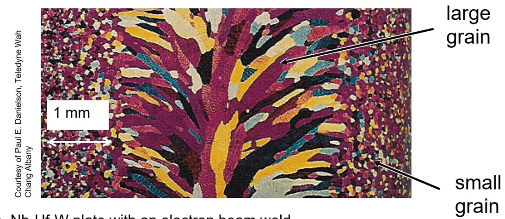
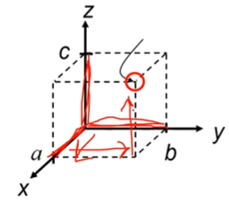
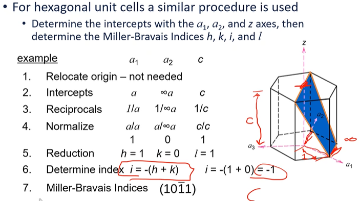

<!-- Document Metadata -->
# ENGR 839-001: Mechanical Metallurgy

- [ENGR 839-001: Mechanical Metallurgy](#engr-839-001-mechanical-metallurgy)
	- [Materials: Structure, Properties, and Performance](#materials-structure-properties-and-performance)
		- [Introduction](#introduction)
		- [Review](#review)
		- [Metallic Crystal Structure](#metallic-crystal-structure)
			- [Energy and Packing](#energy-and-packing)
			- [Crystalline (Periodic) Structure](#crystalline-periodic-structure)
		- [Density Comparison of Materials](#density-comparison-of-materials)
			- [Polycrystalline Materials](#polycrystalline-materials)
			- [Anistropy:](#anistropy)
			- [Istropy](#istropy)
			- [Miller Indices](#miller-indices)
				- [Point coordinates Algorithm](#point-coordinates-algorithm)
				- [Crystallographic Directions Algorithm](#crystallographic-directions-algorithm)
				- [Crystallographic Planes Algorithm](#crystallographic-planes-algorithm)
			- [Crystal Structure and Deformation](#crystal-structure-and-deformation)
			- [Slip Systems (fcc)](#slip-systems-fcc)
			- [Polycrystalline Slip](#polycrystalline-slip)
		- [Summary](#summary)
	- [Elasticity](#elasticity)
		- [Introduction](#introduction-1)
		- [Elastic](#elastic)
			- [Stress](#stress)
			- [Strain](#strain)
			- [Engineering vs True Stress](#engineering-vs-true-stress)
			- [Notation!](#notation)
			- [Strain Energy](#strain-energy)
			- [Shear/Torsion](#sheartorsion)
			- [Poisson's Ratio](#poissons-ratio)
			- [Summary](#summary-1)
		- [Elasticity: Polycrystalline Materials and Bulk Metals](#elasticity-polycrystalline-materials-and-bulk-metals)
			- [Introduction](#introduction-2)
			- [Stress Tensor Revisited](#stress-tensor-revisited)
			- [Hooke's Law Revisited](#hookes-law-revisited)
			- [Simplifications](#simplifications)
			- [Mohr's Circle Revisited](#mohrs-circle-revisited)
		- [Pure Shear](#pure-shear)
		- [Elasticity: Atomic Bonds](#elasticity-atomic-bonds)
			- [Introduction](#introduction-3)
			- [Atomic Bonding](#atomic-bonding)
			- [Bond Interaction and Force](#bond-interaction-and-force)
			- [Stress and Strain in Bonds](#stress-and-strain-in-bonds)
			- [Summary](#summary-2)
	- [Exam Review](#exam-review)
	- [Plasticity](#plasticity)
		- [Introduction](#introduction-4)
			- [Engineering and true stress and strain](#engineering-and-true-stress-and-strain)
			- [Work-Hardening Basics](#work-hardening-basics)
			- [Summary](#summary-3)
		- [Tensile Curve Parameters, Necking, and Strain Rate](#tensile-curve-parameters-necking-and-strain-rate)
			- [Introduction](#introduction-5)
			- [Necking](#necking)
			- [Stress-strain and Necking](#stress-strain-and-necking)
				- [Bridgman Correction](#bridgman-correction)
				- [State of Stress in Deformation](#state-of-stress-in-deformation)
			- [Strain Rate](#strain-rate)
			- [Summary](#summary-4)
		- [Compression and Hardness](#compression-and-hardness)
			- [Introduction](#introduction-6)
			- [Practical Considerations](#practical-considerations)
			- [Compression Curve](#compression-curve)
			- [Compression Failure](#compression-failure)
			- [Bauschinger Effect](#bauschinger-effect)
			- [Hardness Testing](#hardness-testing)
			- [Hardness-Yield Relationship](#hardness-yield-relationship)
			- [Micro-Indentation Testing](#micro-indentation-testing)
			- [Nano-Indentation Testing](#nano-indentation-testing)
		- [Summary](#summary-5)
	- [Defects](#defects)
		- [Introduction](#introduction-7)
	- [Theoretical Shear Strength](#theoretical-shear-strength)
	- [Point Defects](#point-defects)
		- [Interstitial Defects](#interstitial-defects)
			- [#fcc sites](#fcc-sites)
			- [#bcc sites](#bcc-sites)
			- [#hcp sites](#hcp-sites)
		- [Equilibrium Concentration](#equilibrium-concentration)
		- [Vacancy or Self-Interstitial?](#vacancy-or-self-interstitial)

<!-- START WRITING BELOW -->

<!-- %%%%%%%%%%%%%%%%%%%%%%%%%%%%%% -->
<!-- \lecture{23}{08}{2021} -->
## Materials: Structure, Properties, and Performance
### Introduction
**Objectives** The course content will enable students to set and meet expectations.
All of this material, in its content and instruction, are new: so, leave room for error.
Be inspired to tackle whatever comes our way.

{#fig:creationeering_diagram}

\begin{figure}
	\centerline{\includegraphics[width=10cm]{../../attachments/engr_839_001_mechanical_metallurgy/creationeering_diagram_210906_200723_EST.png}}
	\caption{\label{fig:creationeering_diagram} Creationeering diagram.}
\end{figure}

Figure \ref{fig:creationeering_diagram}.

<!-- \begin{wrapfigure}{O}{\FigureWidth\textwidth}
	\centering
	\includegraphics[width=\GraphicWidth\textwidth]{engr_839_001_mechanical_metallurgy/creationeering_diagram_210906_200723_EST.png}
	\caption{Creationeering diagram.}
	\label{fig:creationeering_diagram}
\end{wrapfigure} -->

{#fig:creationeering_t_diagram}

**Definitions**
This class will make more familiar the "chemistry-process-structure" portion of the \textit{chemistry-process-structure-property-performance}" relationship.
LU seeks to apply these engineering disciplines into entrepreneurship.
\textbf{Mechanical}: force response of materials, which includes the underlying principles/effects of microstructure.
\textbf{Metallurgy}: microstructural transformations dictated by composition/processing that is the foundation.
\textbf{Mechanical Metallurgy}, as a course, studies not \textit{how} materials behave, by \textit{why} they behave a certain way.

**Syllabus:** Homeworks due only before the relevant exams, and graded for the good ol' college try.
If you can do the homeworks, then you can do the tests.
\textbf{Final Exam is cummulative.}
Critical Review: "Reverse engineer" an article and explain it with additional comments or inferences.
The accompanying presentation should explain the takeaway from the application articles/comments.

### Review
**CPSPP:** Relationship for how some chemical composition (e.g: FeC) is processed to produce some structure, which has some property that allows some performance.

{#fig:iron_carbon_phase_diagram}

{#fig:fec_with_microstructure}

{#fig:crystallographic_types}

**Crystallographic Types:** simple cubic, face-center cubic (fcc), body-center cubic (bcc), hexagonal close-packed (hcp).
The atomic packing factor, apf--the ratio lattice that is filled--increases down this list.
fcc and #hcp are similar, but #hcp is more brittle.

{#fig:precipitation_hardening}

{#fig:bergers_vector}

**Berger's vector, $\vec{b}$:** lattice displacement by a dislocation;  vector of dislocation; location, magnitude, and direction of influence on lattice.
Can weaken metals when many dislocations exist.

<!-- \lecture{25}{08}{2021} -->

{#fig:thomas_tetrahedron}

**CPSPP Example:** includes low-carbon steel; high-carbon steel; and, cast iron.
All same chemistry with different composition ratios and examples of different processing techniques applied/able.

{#fig:cpspp_example}

**Monolithic** Previously explained homogeneous or isotropic, but depends on length scale.
Here, means the same crystal structure throughout: e.g. pearlite.

{#fig:pearlite_in_iron}

**Materials Design** Exposed to variety of conditions, but can be designed to suit.
More complex designs may have better performance.
Composites have "rules-of-mixtures" to balance performance.
Hierarchical materials vary structure/composition to enhance functional/structural properties at different length scales.

**Our Focus:** not on manufacturing techniques: e.g. ENGR 835.
Will consider how manufacturing variables affect structure.
We will move up length up from atomistics.

### Metallic Crystal Structure
#### Energy and Packing

{#fig:nondense_interatomic_potential_curve}

{#fig:dense_interatomic_potential_curve}

Ordered structures tend to be nearer the minimum bonding energy and are more stable.

**Atomic Packing** Dense crystal structures for metals.
Reasons for dense packing: \textit{1)}bonds between metal atoms are non-directional; \textit{2)} nearest neighbor distances tend to be small in order to lower bond energy; \textit{3)} high degree of shielding (of ion cores) provided by free electron cloud; and, \textit{4)} crystal structures for metals simpler than structures for ceramics and polymers.

#### Crystalline (Periodic) Structure

{#fig:crystalline_structure_example}

{#fig:simple_cubic_structure}

{#fig:body_centered_cubic}

{#fig:face_centered_cubic}

{#fig:fcc_hcp_packing_sequence}

{#fig:hexagonal_close_packed_structure}

<!-- \begin{table}[htp]
	
	\caption{Structure Table}
	\label{tab:structure_table}
	\begin{tabular}{ccccccc}
		\toprule
		\textbf{Structure} 	& \textbf{Coor.} 	& \textbf{atoms/cell} 	& \textbf{apf} 	& \textbf{Slip Planes} 	 \textbf{Slip Systems} \\
		\midrule
		sc 	& 6 	& 1 	& \\
		\midrule
		bcc 	& 8 	& 2 	& 0.68 	& 3 	& 48 \\
		\midrule
		fcc 	& 12 	& 4 	& 0.74 	& 1 	& 12 \\
		\midrule
		hcp 	& 12 	& 6 	& 0.74 	& 3 	& 12 \\
		\bottomrule
	\end{tabular}
\end{table} -->

<!-- \lecture{21}{08}{2021} -->
### Density Comparison of Materials

{#fig:density_comparison_of_materials}

#### Polycrystalline Materials

{#fig:polycrystalline_example}

\textit{Most} engineering materials are composed of many, small single crystals.
Each "grain" is a single crystal.
Grain sizes typically range from 1 nm to 2 cm.
Smaller grains usually mean higher strength and lower ductility.

{#fig:unit_cell_orientation_in_polycrystal}

#### Anistropy:

{#fig:anistropy_example}

A property value that depends on crystallographic direction of measurement.
Properties depend on direction loading, because of linear density along that direction.
Best observed in single crystals.
The higher linear density means higher stiffness, usually.

#### Istropy

{#fig:isotropy_comparisons}

**Polycrystals:** properties may (not) vary with direction.
If grains randomly oriented, properties are isotropic: independent of loading direction.
If grains, "textured"--crystallographic orientation--properties are anistropic: dependent on loading direction.

#### Miller Indices
A method of assigning coordinate values to crystallographic lattice sites.
Used to identify specific points, directions, and planes or families of these.
Used to identify crystallographic information.
Three ways to identify:

##### Point coordinates Algorithm

	**NOTE** A lattice position with a unit cell and determined as fractional multiples of unit cell edge lengths.

{#fig:point_coordinates_example}

{#fig:point_coordinate_example_with_annotations}

1. Lattice position is a, b, c.
2. Divide by unit cell edge lengths and remove commas: $\frac{a}{a}\frac{b}{b}\frac{c}{c} = 111$

##### Crystallographic Directions Algorithm

{#fig:crystallographic_example}

	**NOTE** Remember from calculus the $tip - tail$ method to find vector direction and length.

1. Determine coordinates of vector head and tail: $(x_{2}, y_{2}, z_{2})$ and $(x_{1}, y_{1}, z_{1})$, respectively.
2. Subtract tail coordinates from head coordinates.
3. Normalize this subtraction by lattice parameters of unit cell edge length: $\frac{x_{2} - x_{1}}{a}\frac{y_{2} - y_{1}}{b}\frac{z_{2} - z_{1}}{c}$.
4. Multiply to smallest integer values.
5. Enclose in square brackets with no commas: $[uvw]$.

	**NOTE** Negative indices represented with overbars: $-4, 1, 2 \implies [\bar{4}12]$
	A *family of directions* are crystallographically equivalent (same atomic spacing) and indicated by angle brackets, $<>$.

{#fig:common_cystallographic_directions}

##### Crystallographic Planes Algorithm
1. If plane passes through origin, establish a new origin in another unit cell.
2. Read off values of intercepts of plane (designated $A, B, C$) with $x, y, z$ axes in terms of $a, b, c$.
3. Take reciprocals of intercepts.
4. Normalize reciprocals by multiplying lattice parameters $a, b, c$.
5. Reduce to smallest integer values.
6. Enclose resulting indices in parentheses without commas: i.e. $(hkl)$.

{#fig:crystallographic_planes_example_1}

{#fig:crystallographic_planes_example_2}
	

	**NOTE** A family of planes cannot be reduced any simpler than LCM. Family may be parallel to other families and planar densities may be equivalent, but linear density will vary.

{#fig:plane_families}
	

{#fig:crystallographic_plane_example_3}
	

	**NOTE** A *family of planes* are crystallographically equivalent (same APF) and are indicated by indices in braces, $\{\}$.

<!-- \lecture{21}{08}{2021} -->
	**EXAMPLE** For #hcp, determine intercepts with $a_{1}, a_{2}$ and $z$ axes, then determine the Miller-Bravais indices $h, k, i, l$.

	
		
{#fig:crystallographic_planes_example_4}
	

	
		
{#fig:dk_question_of_hcp_projection}
	

	
		
{#fig:planar_density_example}
	

#### Crystal Structure and Deformation
Planar density determine slip planes: the more dense, the easier to move.
Unit cell represents single crystal, but the behavior of that structure is not equivalent in all directions.
Permanently deforming materials requires that atoms must shift over one another: \textit{slip planes}.
Closely packed (high apf) do not have to move as much to get by one another.
Not all slip directions...
fcc materials are generally ductile, because of few slip systems and one slip plane.
Not many preferred directions to slip and few preferred: e.g. 48 spoons to cut a steak does not equal cutting with a knife.
More of a bad thing does not outweigh few good things.
Coordination number is the number of nearest neighboring atoms.

#### Slip Systems (fcc)

	
{#fig:fcc_slip_system}

**Slip system is ${111}<110>$**
Dislocation motion on ${111}$ planes.
Dislocation motion in $<110>$ directions.
12 indepedent slip systems for #fcc.

	
{#fig:visual_example_of_slip}

#### Polycrystalline Slip
Many grains, often with random crystallographic directions.
Orientation of slip planes and slip directions, $(\phi, \lambda)$ vary from grain to grain.
On application of stress, slip in each grain on most favorable slip system.
With largest $T_{R}$.
When $T_{R} > T_{crss}$.

{#fig:example_of_polycrystal_slip}

	
{#fig:impact_deformed_monel}

### Summary
Important to have common understanding of vocabulary to describe crystal structure. We focus on *#bcc, #fcc,* and *#hcp* structures.
Miller indices give exact orientation or active atoms/planes to determine the associated properties.
The packing factor is import to density and slip systems, but it is not the only critical property.

<!-- \lecture{01}{09}{2021} -->
## Elasticity
### Introduction
Stresses occur at varying scales within a material.
Macro-stresses include component design and assemblage.
Micro-stresses are found within the material and include those from defects: dislocations, alloying elements. etcetera.
Stresses at smallest scale act cumulatively to produce the response to the largest scale.
This all relates to the \textbf{CPSPP} relationship.

### Elastic
- Reverse deformation, that instantaneously recovers to its original dimensions after force is removed.
- Analogous to a spring, the relationship was conveniently described by Robert Hooke: $F = k\delta x$

#### Stress
- Stress is the result of applied force and response of material to balance external force.
	- Area resisting force is perpendicular to applied force line of action.
	- Material response is determined by atomic bonds and orientation relative to crystal lattice. [NOTE] Polycrystalline materials assumed anisotropic.
	- Component response dictated by design and material properties.
	- Tensile stress often positive in sign and compression is negative, by convention.

#### Strain
- Physical result of stress.
- Linear proportional to stress in Hookean material up to its elastic limit/yield stress. [NOTE] Proportional limit is that when the sress-strain deviates from linear and yield stress is at the 0.02% strain offset.
- Metals often Hookean in nature and assumed until otherwise stated.
- True strain: $\epsilon = \frac{dl}{l}, \epsilon = \int_{l_{0}}^{l_{1}}\frac{dl}{l} = ln(\frac{l_{1}}{l_{0}})$
- Engineering strain: $\epsilon = \frac{\delta l}{l}$

#### Engineering vs True Stress
- Comes from initial conditions and easily measured. [NOTE] Area does not change, so the initial area determines the stress throughout the entire deformation.
- True stress and strain are more accurate and use an instantaneous cross-section.
- In the elastic region for metals, deformation is typically small and engineering and true stress-strain values are comparable.
- $\sigma_{T} = \sigma(1 + \epsilon)$
- $\epsilon_{T} = ln(1 + \epsilon)$

{#fig:stress_strain_curve}

#### Notation!
- Notation is not always the same.
- Tensor notation:
	<!-- - $\sigma_{xx}, \tau_{xy}, \tau_{xz}$$, [\tau_{yx}, \sigma_{yy}, \tau{yz}$$, [\tau_{zx}, \tau_{zy}, \sigma_{zz}$$$$((x), (y), (z))$
	- $\sigma_{11}, \tau_{12}, \tau_{13}$$, [\tau_{21}, \sigma_{22}, \tau{23}$$, [\tau_{31}, \tau_{32}, \sigma_{33}$$$$((1), (2), (3))$ -->

	
{#fig:tensor_notation}

#### Strain Energy
- Work done during deformation is converted to heat and internal energy.
- $W = Fd$, but $F$ is not constant!
- Elastic deformation does not typically produce much heat, so most is stored internally.
- $dU = dQ - dQ$
- $U = W$ (without heat)
- $W = \frac{1}{2}\sigma_{ij}\epsilon_{ij} = \frac{1}{2}E\epsilon_{ij}^{2} = \frac{1}{2E}\sigma_{ij}^{2}$

#### Shear/Torsion
- Shear and torsional stress are handled similarly, but vary by configuration.

	
{#fig:shear_stress_example}

	
{#fig:torsional_stress_example}

- $\tau = \frac{F}{A}$
- $\gamma = \frac{dl}{l} = tan\theta \cong \theta$
- $G = \frac{\tau}{\gamma}$

**Q&A** Why does $\gamma \cong \theta$?
Small angle assumptions in radians mean that $sin\theta = \theta$.

#### Poisson's Ratio
$\nu = -\frac{\epsilon_{11}}{\epsilon_{33}} = -\frac{\epsilon_{22}}{\epsilon_{33}}$

	
{#fig:poisson_ratio}

- Describes the consequent strains orthogonal to an applied stress.
- Most metals are 0.3.
- For constant volume without lateral contraction, the ratio is 0.5 (plastic only).

#### Summary
- Elasticity affects everything, because it is initial response to stress.
- Material behavior in elastic region dictates behavior in application.
- Components rarely useful in plastic region, so they will spend their lifetime in the elastic range.
- Although elastic properties are commonly discussed at a continuum scale, we will find it important to atomic scale phenomena.

<!-- \lecture{03}{09}{2021} -->
### Elasticity: Polycrystalline Materials and Bulk Metals
#### Introduction
- Stress may be applied in any arrangement, and we can determine the overall conditions of strain.
- This is often reduced to two dimensions, but it does not have to be (it is just simpler).
- We can determine the state of stress as a point in any orientation (not just aligned with the applied stress) by using transformation techniques.
- Certain orientations will result in only normal or shear stresses, which can be important for determining the resulting performance.

#### Stress Tensor Revisited

	
{#fig:cauchy_stress_tensor}

- Cuachy stress tensor describes the complete state of stress in three dimensions.
- Valid for small deformations.
<!-- - $\sigma_{xx}, \tau_{xy}, \tau_{xz}$$, [\tau_{yx}, \sigma_{yy}, \tau{yz}$$, [\tau_{zx}, \tau_{zy}, \sigma_{zz}$$$$((x), (y), (z))$ -->

#### Hooke's Law Revisited
- Linear elastic response in homogeneous metals and alloys which allows us to relate stress and strain in three dimensions through the Poisson ratio, $\nu$
- $\epsilon_{11} = \frac{1}{E}[\sigma_{11} - \nu(\sigma_{22} + \sigma_{33})]$
- $\epsilon_{22} = \frac{1}{E}[\sigma_{22} - \nu(\sigma_{11} + \sigma_{33})]$
- $\epsilon_{33} = \frac{1}{E}[\sigma_{33} - \nu(\sigma_{11} + \sigma_{22})]$
- $\gamma_{12} = \frac{\sigma_{12}}{G}$
- $\gamma_{13} = \frac{\sigma_{13}}{G}$
- $\gamma_{23} = \frac{\sigma_{23}}{G}$

**Example 1:** For the following stress tensor, what are the resulting normal strains if $E = 10e3 kip$ and $\nu = 0.3$?

$\sigma = 5, 3, 2$$, [3, -1, 0$$, [2, 0, 4$$$$kip$

$\epsilon_{normal} = [\frac{1}{10e3 ksi}[5 ksi - 0.3(-1 + 4)ksi]], [\frac{1}{10e3 ksi}[1 ksi - 0.3(5 + 4)ksi]$$, [\frac{1}{10e3 ksi}[4 ksi - 0.3(5 + (-1))ksi]\ = 4.1e-4$$, [-3.7e-6$$, [2.8e-6]\ $

#### Simplifications
- To avoid complex tridimensional description of stress and strain, especially during plastic deformation, simplifications are possible.
	- Plane stress: strain and strain go to zero at free surface (normal and shear).
	- Plane strain: one dimension is considered infinite.
- Conditions of pure shear can also be considered, such that no normal forces are present.
  <!-- - $\sigma = \sigma_{xx}, \tau_{xy}$$, [\tau_{xy}, \sigma_{yy}\$ -->
<!-- % $\epsilon = \epsilon_{xx}, \epsilon_{xy}$$, [\epsilon_{xy}, \epsilon_{yy}$$$-->

#### Mohr's Circle Revisited
- A graphical way to represent stress transformation to alternative orientations.
- These are set of equations that describe stress transformation, but a graphical solution is often useful.

	
{#fig:mohrs_circle_illustration}

- Principal stress: maximum/minimum normal stresses (no shear)

	
{#fig:mohrs_circle_transformation_equation_illustration}

- $R = \sqrt{(\frac{\sigma_{11} + \sigma_{22}}{2})^{2} + \tau_{12}^{2}}$
- $\sigma_{11}' = \frac{\sigma_{11} + \sigma_{22}}{2} + \frac{\sigma_{11} - \sigma_{22}}{2}cos(2\theta) + \sigma_{12}sin(2\theta)$
- $\sigma_{12}' = -\frac{\sigma_{11} - \sigma_{22}}{2}sin(2\theta) + \sigma_{12}cos(2\theta)$

**Example 1:** What is the stress state if rotated $30\text{\textdegree}$ CCW?

	
{#fig:mohrs_circle_example_problem_1}

*Given: $\sigma_{11} = -8 ksi, \sigma_{22} = 12 ksi, \sigma_{12} = -6 ksi$*

Center point, $C = \sigma_{avg} = \frac{\sigma_{11} + \sigma_{22}}{2} = \frac{-8 + 12}{2} = 2 ksi$

	
{#fig:mohrs_circle_example_1_problem_step_t_find_r}

$R = \sqrt{10^{2} + 6^{2}} = 11.66$

	
{#fig:mohrs_cricle_example_1_problem_step_to_find_angle}

Use trig to find $\phi$ and $\psi$: $\phi = tan^{-1}(\frac{6}{10}) = 30.96\text{\textdegree}, \psi = 60 - \phi = 29.04\text{\textdegree}$

- $\sigma_{11}' = 2 - 11.66cos(29.04) = -8.2 ksi$
- $\sigma_{12}' = -11.66sin(29.04) = 5.66 ksi$

	
{#fig:mohrs_circle_example_1_complete}

	
{#fig:mohrs_circle_example_1_clean}

<!-- \lecture{06}{09}{2021} -->
### Pure Shear
There exists a condition which has only shear stresses and no normal stress. This condition is called \textit{pure shear}, which means that $\sigma_{11} = -\sigma_{22}$. This implies that Mohr's circle is centered at the origin, because $\sigma_{avg} = 0$. Graphically, the maximum shear stress possible in this condition is the radius of Mohr's circle and at $90\text{\textdegree}$ from the horizontal. However, recall that angles in Mohr's circle are twice real angles: e.g. if $\theta_{Mohr} = 2*\theta_{real}$ and $\theta_{Mohr} = \text{\textdegree}90$, then $\theta_{real} = 45\text{\textdegree}$.

{#fig:pure_shear_depicted}

Using knowledge of this condition, we can find stress and strain information with the following relations:

\begin{align}
\epsilon_{11} &= \frac{1}{E}(\sigma_{1} - \nu\sigma_{2}) = \frac{\sigma_{1}}{E}(1 + \nu) \\
\tau &= -\sigma_{1} (on~circle,~with~sign~convention) \\
\tau &= G\gamma \\
\epsilon_{11} &= -\frac{G\gamma}{E}(1 + \nu) \\
2\epsilon_{11} &= -\gamma \\
G &= \frac{E}{2}(1 + \nu)
\end{align}

"(on circle, with sign convention)" holds true because the radius, $R$ of Mohr's circle is $\sigma_{1} = - \sigma_{1}$. Some of these relationships are not limited to pure shear, because $E, G \text{and} \nu$ are material properties.

Expressing three-dimensional stress is important, but can be achieved with tensor notation. Analysis of stress states can be reduced from three to two dimensions if assuming plane stress (zero stress in third axis) or plane strain (zero strain in third axis). This simplified analysis can be transformed to desired stress states by equations or Mohr's circle. Recall that Mohr's circle is a graphical representation of all possible stress states, but it must be drawn accurately that trigonometric functions might be used effectively.

### Elasticity: Atomic Bonds
#### Introduction
What preceded was continuum elasticity. What follows is observing the previously explored behaviors at the atomistic level. These behaviors determine the way force, stress, and strain occur. Characterizing these behaviors informs the results of bond strength in materials: we focus on metals. There exist competing behaviors of attraction and repulsion.

Continuum looks and homogeneous units wherein stress states are described without knowing the exact material makeup. Here, we can continue to ignore anisotropic conditions, but must observe the source of elasticity: atomic bonds. Strength of bonds determined by electronic characteristics, but can be influenced by external conditions: heat, magnetic fields, etcetera.

	
{#fig:electronic_bonds_simplified}

#### Atomic Bonding
Electronic bonds govern behavior of all material properties. All mechanical behavior first exhibits elastic behavior. These effects can be observed with a simple spring model between two atoms.

	
{#fig:simple_spring_model}

#### Bond Interaction and Force
Two atoms will have an equilibrium separation, $r_{0}$. We assume this until some external influence is applied. The minimum bonding energy also occurs here. Repulsion is caused by the \textit{Pauli Exclusion Principle} and attraction is \textit{Coulombic} in nature.$$U_{i} = -\frac{A}{r^{m}} + \frac{B}{R^{n}}$$

	
{#fig:interaction_energy_and_force}

**Example**
	Potential energy of $Na^{+}Cl^{-}$, an ionic pair, at distance $r$ where $q_{0} = 1.6e-19 [C]$, $\epsilon_{0} = 8.85e-12 [\frac{C}{N-m^{2}}]$, and $U_{i} = 1.12 [eV]$. If $r_{0} = 0.276 [nm]$, then find: \textbf{a]} the value of B; and \textbf{b]} the total, attractive, and repulsive forces at $r = 0.25 [nm]$.

	\begin{align}
		U_{i} &= -\frac{A}{r^{m}} + \frac{B}{r^{n}} \\
		U &= U_{i} - \frac{q^{2}}{4\pi\epsilon_{0}r} + \frac{B}{r^{9}}
	\end{align}

	\noindent Because $\frac{dU}{dr} = 0$ at $r_{0}$,

	\begin{align}
		\frac{dU}{dr} &= 0 = \frac{q^{2}}{4\pi\epsilon_{0}r^{2}} - \frac{9B}{r_{0}^{10}} \\
		\frac{q^{2}}{4\pi\epsilon_{0}r^{2}} &= \frac{9B}{r_{0}^{10}} \\
		\implies B &= \frac{r_{0}^{8}q^{2}}{36\pi\epsilon_{0}} \\
		B &= 8.61e-106 [N-m^{10}]
	\end{align}

	\noindent $B$, then, is simply plugged into the following equations to find electronic bond forces at not the equilibrium distance, $r = 0.25 [nm]$.

	\begin{align}
		F &= \frac{dU}{dr} = F_{A} - F_{R} \\
		F &= \frac{q^{2}}{4\pi\epsilon_{0}r^{2}} - \frac{9B}{r_{0}^{10}} \\
		F_{A} &= \frac{q^{2}}{4\pi\epsilon_{0}r^{2}} = 3.68e-4 [N] \\
		F_{B} &= \frac{9B}{r_{0}^{10}} = -8.13e-9 [N] \\
		\implies F &= 4.44e-9 [N]
	\end{align}

#### Stress and Strain in Bonds
Force is proportional to atomic displacement and change in energy. Stress requires number of atoms involved in some area by estimating atomic spacing at equilibrium, $r_{0}^{2}$. Strain, then, is the change in spacing divided by the equilibrium spacing. Young's modulus is a material property of stress over strain. These can be summarized by the following relations:

\begin{align}
	F &= \frac{dU_{i}}{dr} \\
	d\sigma &= NdF \\
	d\sigma &= \frac{dF}{r_{0}^{2}} \\
	d\epsilon &= \frac{dr}{r_{0}} \\
	E &= \frac{Am(n-m)}{r_{0}^{m + 3}} \\
	A &= \frac{q^{2}}{4\pi\epsilon_{0}} \\
	E &= \frac{kq^{2}}{r_{0}^{4}}
\end{align}

	
{#fig:outcomes_of_bonding}

#### Summary
Bulk properties come from atomic bonds. Treatment of elasticity at atomic scale determines balances of attractive and repulsive forces; therefore, external forces cause a shift from the equilibrium state. Bond properties can be adjusted to preference with some processing technique: e.g. alloying.

<!-- \lecture{08}{09}{2021} -->
## Exam Review
**Miller Indices**
When drawing Miller indices--coordinates, vectors, and planes--keep to Fig. \ref{#fig:milled_index_axis} convention. This makes grading quicker, because a different orientation is not necessarily wrong but are harder to grade.

{#fig:milled_index_axis}

Atomic packing factors will be used in the exam (per the provided table from earlier lectures). \textbf{The content of the homework is the template for the exam: no new content on exams.} WRT to calculating unit cell mass, follow this algorithm example for iron (Fe):

\begin{align}
\rho &= \frac{nA}{V_{c}N_{A}} \\
\rho_{Fe} &= (55 amu) (\frac{g}{mol}/1 amu) / (N_{A}) \\
\rho_{Fe} &= 3.053e-22 g/atom \\
\rho_{Fe, #bcc} &= \rho_{Fe}*2/a_{0}^{3}
\end{align}

**Tensorial vs. Engineering Strain**

{#fig:engineer_vs_tensor_strain}

Because we know the relation, $\epsilon_{ij} = \frac{\gamma_{ij}}{2}$, we know $G = \frac{\tau}{\gamma} = \frac{E}{2(1 + \nu)}$. We can then know the deformation on some axis: e.g. $\gamma_{12} = \frac{\sigma_{12}}{G} = -37.1e-6$. But tensor notation for shear strain, $\gamma_{shear} = \frac{\gamma_{calc}}{2}$.

**Calculating Strains from Poisson's Ratio**
Because the compression test is performed in a single axis to squish some specimen, the other lateral strains can be calculated by assuming plane stress: zero stress in the direction normal to the thinnest dimension.

{#fig:plane_stress_example}

Pure shear occurs when $\sigma_{22} = -\sigma_{11}$. The shear stress, $\tau$ is the radius of Mohr's circle. The principal stress are the maximum and minimum of Mohr's circle. A stress tensor is the sum of the hydrostatic and deviatoric stress tensors: $[\sigma] = [\sigma_{hydro}] + [\sigma_{dev}]$ Hydrostatic stress--$\sigma_{hydro} = \frac{\sigma_{11} + \sigma_{22} + \sigma_{33}}{3}$--goes on the diagonal of the tensor and will cause a change volume, but not the object's shape. Deviatoric stress--elements not on the diagonal--will change an object's shape, but not its volume.

{#fig:pure_shear}

<!-- \lecture{13}{09}{21} -->
## Plasticity
### Introduction
Plasticity is sometimes involved with engineering design.
It may also prove integral to performance.
This chapter explores the importance the stress-strain behavior and the effects thereof.

Materials always follow elastic to plastic deformation before ultimate failure.
Most applications will operate within the elastic region (ceramics with narrow elastic regimes), but accommodations for work-hardening may be considered.
Not all materials work-harden the same way.
Two yield points in materials: \textit{first yield} is the elastic limit, and \textit{ultimate strength} is ultimate plasticity.
\textbf{Plasticity} is imperative for processing and performance of materials.
Think of Dr. Atwater's lawn mower!

**Mechanical Testing** Determines mechanical properties for materials: such as various tension or compression.
Tension is the most popular, but all give same information: \textit{stress-strain} curve.

#### Engineering and true stress and strain
Recall that engineering stress is from $A_{0}$ and true uses $A_{i}$.
\textit{Plastic deformation is volume conservative}, which allows calculating true stress and strain from the engineering values.
Stress-strain curves relates initial conditions to overall performance.

{#fig:stress_strain_curve_comparisons_true_to_engineering}

**Q&A**
\textbf{DK: Is conversion from engineering to true stress-strain meaningful with necking?} \textit{It depends. We will discuss this later.}

#### Work-Hardening Basics
\textit{Ludwik-Hollomann} equations: $\sigma = \sigma_{0} + K\epsilon^{n}$.
$\sigma_{0}$ is the yield stress, $K$ is experimentally found ($\frac{G}{100}-\frac{G}{1000}$); $\epsilon$ is true strain; and, $n$ is some work hardening coefficient (0.2-0.5).

**Example** Use the \textit{Ludwik-Hollomann} equation to determine work hardening exponent, $n$ in an lloy of true strain at 0.1 and true stress = 415 MPa. Assume $K = 1035 MPa$ and $\sigma_{0} = 0$.

\begin{align*}
	\sigma &= \sigma_{0} + K\epsilon^{n} \\
	log[\sigma &= \sigma_{0} + K\epsilon^{n}] \\
	log(\sigma) &= log(K) + n*log(\epsilon) \\
	\frac{log(\sigma) - log(K)}{log(\epsilon)} &= n \\
	\implies n &= \frac{log(415) - log(1035)}{log(0.1)} \\
	n &\approx 0.397
\end{align*}

\textit{The greater, $n$, the more work-hardening can occur.}

**Refined Methods**
\textit{L=H} has limits; therefore, \textit{Voce} equations adds asymmetry.
\textit{Johnson-Cook} expands with strain-rate and temperature dependence: $\sigma = (\sigma_{0} + K\epsilon^{n})\bigl(1 + C*ln(\frac{\dot{\epsilon}}{\dot{\epsilon_{0}}})\bigr)\bigl[1 - \bigl(\frac{T - T_{r}}{T_{m} - T_{r}}\bigr)^{m}\bigr]$.
Each term in the \textit{Johnson-Cook} equation represents a different failure mechanism.

**Volume Conservation**
Volume is assumed to be constant through deformation; however, volume is not always assumed constant in the elastic region.
\textit{Poisson's Ratio}, $\nu$ is constant in the elastic region, but varies in the plastic region.
True and engineering stress-strains considered equivalent up to elastic limit.

{#fig:stress_strain_jog}

#### Summary
Plasticity introduces new requirements to calculate stress and strain.
Elastic portion considered inconsequential and plastic deformation is volume constant.

<!-- \lecture{15}{09}{21} -->
### Tensile Curve Parameters, Necking, and Strain Rate
Features of the stress-strain curve indicate when necking occurs, and give insight when correction factors apply: only when cylindrical samples neck. New equations for material behavior after necking. Strain-rate affects material response as well.

#### Introduction
Tensile testing is the most basic form to determine material properties.
Parameters of test affect outcome: temperature, etcetera.

{#fig:tensile_curve_features}

The more dislocations/impurities, the more local stresses exist, and more global force is required to overcome the sum of the internal stress: this is true for plain carbon steels.

**Items of Note**
Yielding is preceded by \textit{micro-yielding}, where dislocation motion can occur below traditional yield stress.
Upper-lower yield behavior is largely seen in plain, low-carbon steels. Vacancy and dislocation pinning resist initial yielding. Strain rate will modify the tensile curve and can obscure the upper-lower yield phenomenon when present.

#### Necking
Occurs when localized deformation begins to dominate the strain: \textit{void nucleation, coalescence, and growth}.
This is also known as \textit{plastic instability} and is defined by \textbf{Considere} criterion: increase in stress relative to strain (work-hardening) reaching a maximum in the engineering stress-strain curve.
\textit{The higher the strain exponent, the more strain you get out of the material.}
Using this criterion, substituting true stress-strain into the derivative and apply the Hollomann equation, you get the relationship $\epsilon_{u} = n$, where $\epsilon_{n}$ is maximum, uniform plastic strain.

Work-hardening exponent from \textit{engineering} stress-strain curve.
Work-hardening decreases during increase of plastic strain until that point at which necking occurs.
A metal unable to work-harden immediately reaches the point of necking after yielding, which is consistent with equations.
\textit{Work-softening}--the more it deforms, the easier it can be deformed (not necessarily from reduced area)--is possible under extreme conditions.
\textbf{Think of void nucleation, coalescence, and growth!}

#### Stress-strain and Necking
After necking, instantaneous cross-sectional area must be continuously determined.
Neck acts as a "second", miniature tensile specimen, so it's strain-rate is higher from shorter length.
Irregular geometry of neck also introduces triaxial flow stress.
Magnitude of transverse stresses depends on sample and neck geometry and strain-rate.

##### Bridgman Correction
	This only applies to \textit{cylindrical} samples, because sample area and neck radius must be known.

	$$\sigma = \frac{\sigma_{avg}}{(1 + 2\frac{R}{r_{n}})ln(1 + \frac{r_{n}}{2R})}$$

	\noindent $R$ is radius of curvature of the neck, and $r_{n}$ is the cross-sectional radius at thinnest part of neck.
	The further away from necking (higher strains), this correction factor increases.

##### State of Stress in Deformation
	Necking is onset of failure in a non-uniform fashion.
	Applies only to tensile testing, because compression samples \textit{barrel}.
	Necking can be suppressed to achieve higher strains in more complex stress states.

{#fig:wire_drawing_example}

#### Strain Rate
Increasing strain-rate work-hardens faster: \textbf{void nucleation controls}!!
This parameter is part of stress-strain rate relationship: $\sigma = K\dot{\epsilon}^{m}$.
$m$ can be found from a jump test between two strain-rates using the Hollomann equation: $m = \frac{ln(\frac{\sigma_{2}}{\sigma_{1}})}{ln(\frac{\dot{\epsilon_{2}}}{\dot{\epsilon_{1}}})}$.

**Strain-rate In Practice**
Strain-rate can vary from $10^{-6}s^{-1}$ to $10^{6}s^{-1}$.
Tensile tests usually within $10^{-4}s^{-1}$ to $10^{-1}s^{-1}$.
High strain-rate (Hoppy bar) and creep or stress relaxation tests invaluable to determine material behavior under extreme conditions.
Creep and stress relaxation tests incorporate higher temperatures, which is important to material performance.

Strain-rate affects material behavior.
Increasing strain-rate often increases yield stress and the work-hardening rate.
Typically, $0.02<m<0.2$ for $0-0.9T_{H}$.

**Super-plastic Behavior**
Effective strain-rate in necking area increases.
Positive strain-rate sensitivity implies an increased stress and the yield point will shift to the weaker section.
Same concept that assists in distributing strain across tensile specimen length in work-hardening.

#### Summary
Stress-strain curve contains much information, but not all can be known from only the engineering curve.
Necking changes specimen geometry, which affects test results.
Stress states may control onset and progression of necking, which may allow for much higher strains before failure.
Strain-rate affects material response and is dependent on processing and performance applications.

<!-- \lecture{17}{09}{21} -->
### Compression and Hardness
#### Introduction
Many applications use compressive stresses; therefore, testing for compression is more relevant.
Some materials perform well under compression and not tension.
Simpler and more cost-effective to perform compression tests; therefore, metal alloy research heavily utilizes this method.

#### Practical Considerations
Compression is simple but requires care to ensure good data.
Plate alignment and sample parallelism and flatness are imperative.
Lubricant between plates and sample reduce barreling.
\textit{Plates should be much harder than the sample.}
Machine compliance must be removed from measured stress-strain curve, especially at lower strains.
Can also measure strain from video recordings and point markers on sample.

#### Compression Curve
Stress-strain opposite from tensile curve.
Barreling is source of non-uniform plastic strain.

{#fig:compression_stress_strain_curve_with_barreling}

\noindent Effects of barreling most pronounced at strains exceeding 0.4; therefore, compression testing usually limited to less than that.
Friction is very important when initial $\frac{height}{diameter}$ is reduced: if too tall and thin, the specimen will buckle first.

#### Compression Failure
If perfectly striked, stress state greatly varies through specimen.
Although extreme, ductility allows for stress-strain behavior off the central axis.
Non-uniform stress occurs, then, across top and bottom surfaces (friction hill).

$$p = \sigma_{0}\exp{frac{2\mu(a - r)}{h}}$${#eq:friction_hill_pressure}

\noindent $\mu$ is coefficient of friction, $r$ is distance from center, $a$ is radius of sample, and $h$ is height of sample.

{#fig:compression_failure_friction_hill}

**Example** If $\frac{height}{diameter} = 2$, then what is $p_{max}$?

\begin{align*}
	\frac{l}{d}  	&= 2 \\
	p 	&= \sigma_{0}\exp{\frac{2\mu(a - r)}{h}} \\
	&= \sigma_{0}\exp{2(0.15)(\frac{a}{h})}, \frac{d}{h} = \frac{1}{2}(\frac{\frac{a}{2}}{h}) = \frac{1}{2} \longrightarrow \frac{a}{h} = \frac{1}{4}
	\implies p 	&= \sigma_{0}\exp{2(0.15)(\frac{1}{4})} \\
	&= \sigma_{0}\exp{\frac{0.3}{4}}
\end{align*}

#### Bauschinger Effect
If you pull something in tension, then switch to compression, the yield point will lower from tension to compression.
The strain in the material from tension weakens the material and causes a lower yield point: the \textit{Bauschinger effect}.

#### Hardness Testing
\textbf{Hardness is a material's resistance to plastic flow by indentation.}
Scale of indentation varies with load, which is standardized with the indenter while its displacement is measured.

**Brinell**
Uses a hard sphere of known dimension and known force to measure the size of indent.
Amount of applied force changes size of indention.

$$HB = \frac{P}{\pi Dh} = \frac{2P}{\pi D(D - \sqrt{D^{2} - d^{2}})}$${#eq:brinell_hardness_number}

$$HB_{Meyer} = \frac{4P}{\pi d^{2}}$${#eq:meyer_hardness_number}

**Rockwell**
Testing is simple, provides direct, arbitrary hardness reading, but relatable to known values.
Useful on a wide range of materials.

*Testing Process*
- Apply pre-load.
- Apply indentation load.
- Remove "major" load from specific indenter and load.
- Measure depth read on scale: 0-100.

Indenter geometry will determine scale: A, B, or C.
*Rockwell-C* is best for harder steels and metals of similar properties.
Superficial scales for thin samples with lower loads to avoid anvil effects.

**Vickers**
Also known as *Diamond Pyramid*, because indenter is pyramid with $136\text{\textdegree}$, which is based on $d_{Brinell} = 0.375D$ relationship.
Can be used on any material.
Indentation size measured by average length across diagonals.
Hardness computed by...

$$HV = \frac{2Psin(\frac{\alpha}{2})}{d^{2}}$${#eq:vickers_hardness}

#### Hardness-Yield Relationship
For Vickers hardness, measured value...

#### Micro-Indentation Testing
Creates indent that 10's of microns in size.
> Vickers is macro- and micro-indent test method: wherein, anything below $200g$ force is considered micro-testing.
Allows testing of small features: particles or areas of grain.
Ability to probe microscale features limited if larger scale features dominate material.
$$KHN = \frac{14.228}{L}$${#eq:knoop_hardness}

#### Nano-Indentation Testing
Highly sensitive force-displacement device, which allows for general microstructural investigation at lowest length scales.
Examine small volume of material with *Berkovich* indenter.
$$H = \frac{P_{max}}{A}$${#eq:}

### Summary
Compression testing is opposite tension.
Equations of true stress-strain are same, but have different effects.
Hardness provides simple means...

---

## Defects
### Introduction
Crystal structure assumes perfect patterns.

## Theoretical Shear Strength
If we consider material failure when a crystal fails, then we must shift the nearest neighbors of all atoms on a slip plane simultaneously.
Each bond must be stretched and broken together, each of which has an associated unit of energy.
According to #Frenkel, for two rows of atoms, shear stress follows a sinusoidal shear stress behavior that atoms in equilibrium, $a_{min}$ and metastable equilibrium, $a_{max}$.

**#fcc Strength**
Crystal structure...

## Point Defects
Affects a single lattice site.
Can be a:
- Missing atom (vacancy).
- An extra atom between lattice sites (interstitial/self-interstitial).
- Different atom in regular lattice (substitutional).

Vacancies introduce stress fields but are critical to diffusion processes.
In compounds, vacancies introduce other non-equilibrium conditions: e.g. charge imbalance.

{#fig:point_defect_examples}

### Interstitial Defects
Position of interstitial defects vary by crystal structure.
#### #fcc sites
#### #bcc sites
#### #hcp sites
### Equilibrium Concentration
Vacancies and self-interstitial are thermodynamically favorable.
No work is done creating a point defect, so some heat is required.
Configurational entropy...

### Vacancy or Self-Interstitial?
Either a vacancy or self-interstitial can be formed thermodynamically, but not equal in likelihood or concentration.
Formation energies related by $\frac{G_{i}}{G_{v}}$, but concentrations require calculation: $$\frac{X_{v}}{X_{i}} \approx \exp{\frac{G_{i} - G_{v}}{\dots}}$$