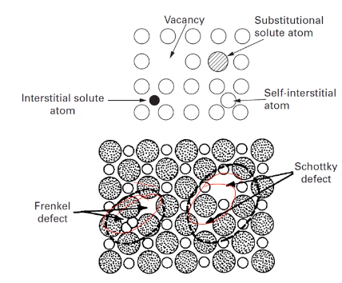

<!-- 210913 -->
# Defects

## Introduction
Crystal structure assumes perfect patterns.

## Theoretical Shear Strength
If we consider material failure when a crystal fails, then we must shift the nearest neighbors of all atoms on a  [slip planes](slip-plane.md) simultaneously.
Each bond must be stretched and broken together, each of which has an associated unit of energy.
According to [[Frenkel]], for two rows of atoms, shear stress follows a sinusoidal shear stress behavior that atoms in equilibrium, $a_{min}$ and metastable equilibrium, $a_{max}$.

**#fcc Strength**
Crystal structure...

## Point Defects
Affects a single lattice site.
Can be a:
- #vacancies : missing atoms.
- #interstitials/self-interstitial: an extra atom between lattice sites.
- #substitutionals: different atom in regular lattice.

#vacancies introduces stress fields but are critical to diffusion processes.
In compounds, #vacancies introduce other non-equilibrium conditions: e.g. charge imbalance.

### Interstitial Defects
Position of #interstitials defects vary by crystal structure.

#### #fcc sites
#### #bcc sites
#### #hcp sites

### Equilibrium Concentration
#vacancies and self-#interstitials are thermodynamically favorable.
No work is done creating a point defect, so some heat is required.
Configurational entropy is increased by defect formation but goes to 0 at $0 K$.
Concentration determined by: $$\frac{n}{N} = \exp(-\frac{G_{f}}{kT}), k = 8.62e-5\frac{eV}{K}$$ \label{eq:equilibrium_concentration}

!!! example Find equilibrium concentration of vacancies at $1000^{\circ}C$ for Cu, where $G_{f} = 0.9 \frac{eV}{atom}$, $A_{Cu} = 63.5 \frac{g}{mol}$, and $\rho_{Cu} = 8.4 \frac{g}{cm^{3}}$.

    $$\begin{split}
    \frac{n}{N} &= e^{-\frac{G_{f}}{kT}}, N = \frac{N_{A}\rho}{A_{Cu}} = 7.97e28 \\
    \implies n &= Ne^{-\frac{G_{f}}{kT}} \\
    &= 7.97e28e^{-\frac{0.9}{8.62e-5(1273)}} \\
    &= 2.2e25\big[\frac{1}{m^{3}}\big]
    \end{split}$$

### Vacancy or Self-Interstitial?
Either #vacancies or self-#interstitials can be formed thermodynamically, but not equal in likelihood or concentration.
Formation energies related by $\frac{G_{i}}{G_{v}}$, but concentrations require calculation: $$\frac{X_{v}}{X_{i}} \approx \exp(\frac{G_{i} - G_{v}}{kT})$$

### Equilibrium Concentration
#vacancies

### Vacancy Formation
High #vacancies concentration occurs at elevated temperatures and rapidly quenched.
Retaining #vacancies requires no significant sources of sinks to absorb them: grain boundaries, surface area, dislocation, etcetera...
Cold working increases defect concentration, as opposite sign dislocation combine to form rows of #vacancies or #interstitials.
*#climb* is #dislocation-motion not on a #glide-plane but at elevated temperatures.

### Effect on Mechanical Properties
Point defects not created in isolation by deformation, but high concentration can be made by irradiation.
High-energy bombardments displace atoms to cause self- #interstitials, which produces #vacancies.
Single crystal strength increases orders of magnitude when #vacancies are quenched.
Plastic deformation

### Summary
Point defects exist in all crystals, but concentration is affected by processing and temperature.
Self-#interstitials can be increased with plastic strain, which produces other types of defects.
High concentrations of defects...

## Line Defects
|  |
|:--:|
| #dislocation-motion through material sometimes thought as pushing a kink through a rug, or a caterpillar crawling. |

## Types of Dislocations
Basic understanding of dislocation results in two options:
1. #edge-dislocations
2. #screw-dislocations

|  |  |
|:--:|:--:|
| Often thought as extra "half-plane" of atoms: the **[[burgers-vector]]**. | Helical interruptions of the crystal lattice. |

Continuous variations can exist in a material between these two types of dislocations.

### Edge and Screw Character
If [[burgers-vector]], $\vec{b}$ is perpendicular to dislocation line, $l$, then it is an #edge-dislocations.
If [[burgers-vector]], $\vec{b}$ is parallel to dislocation line, $l$, then it is a #screw-dislocations.
i.e. dislocation character = $\begin{cases}\vec{b} \perp l,~edge \\ \vec{b} \parallel l,~screw\end{cases}$
Mixed dislocations are combinations of these.

### Dislocation Motion
#edge-dislocations and #screw-dislocations achieve the same thing in various ways.
#dislocation-motion along [slip planes](slip-plane.md) is called #glide.
#dislocation-motion perpendicular to [slip planes](slip-plane.md) is called #climb.
Transfer of dislocation from one [slip planes](slip-plane.md) to another is called #cross-slip.
Immobile dislocations are called #sessile, while mobile ones are called #glissile.

|  |
|:--:|
| Visualizing how dislocations move is not as important as knowing the equations. |

### Bubble Rafts
Dislocations were considered many years before experimentally validated.
|  |
|:--:|
| One means |

|  |
|:--:|
| *Video* Experiments with the bubble model of metal structure 1952 - sir lawrence bragg. |

<!-- 210924 -->
### Dislocation Confirmation
#TEM microscope sends electrons to interact with the medium of material that the interaction might be viewed.
Variety of characterization techniques reveal their presence, which causes #crystal-lattice distortions.
For seeing #dislocation-motion #glide watch EXbiEopDJ_g

*[TEM]: Transmission Electron Microscope

### Dislocation Looping
Dislocations forms loops with both edge and #screw-dislocations pairs of opposite signs.
Positive edge: $\perp$; negative edge: $\top$; positive screw: $S$; negative screw; &#423;.

|  |  |
|:--:|:--:|
| Loops are not square in reality, because it is more energetically favorable to be elliptical. | Under shear, loop expands to all edges, which then produces the shear |

### Prismatic Loops
#prismatic-loops occur when extra disc of atoms are inserted to the #crystal-structure (or removed), and not #glissile like a "common" loop.

### Loop Expansion
|  |
|:--:|
| Common dislocation loops have no incompatibility between dislocation moving in loop plane. Dislocation character allows expansion in each direction until loop eventually creates a unit step in the #crystal-structure. |

### Stress Around Dislocations
Defects introduce stress/strains due to imperfect lattice spacing. If continuum understanding for infinite, straight line is assumed, then calculation is greatly simplified, and a cylinder is sufficient to portray the concept.

|  |
|:--:|
| A hollow center is assumed to avoid infinite stress, and it is appropriate since real are not continuous but periodic. |

### Stress Equations for #screw-dislocations
Relating stress and strain through [[Hookes-Law]].
$\sigma_{11} = \sigma_{22} = \sigma_{33} = \tau_{12} = \tau_{21} = 0$.
$$\begin{split}
\tau_{13} = \tau_{31} &= -\frac{Gbx_{2}}{2\pi(x_{1}^{2} + x_{2}^{2})} \\ \tau_{23} = \tau_{32} &= \frac{Gbx_{1}}{2\pi(x_{1}^{2} + x_{2}^{2})}
\end{split}$$
\label{eq:screw_dislocation_stress}

|  |
|:--:|
| Dislocation motion increments by 1 [[burgers-vector]]. |

### Stress Equations for #edge-dislocations
|  |
|:--:|
| $$\begin{split}\end{split}$$ |

### Summary
Dislocations are critical to understanding macroscale deformation and strengthening mechanisms.
Dislocations can interact to form loops, which result in same shear on crystal as a dislocation passes through, as long as loop is not prismatic.
All of this discussion is for plastic deformation.

## Imperfections: Dislocation Energy and Bowing
Quantify energy around dislocations and determines relationships...
Take the energy at each dislocation and determine how difficult to move that dislocation.
This correlates to #dislocation-energy and #dislocation-density, etcetera.
Dislocations act like a line, fixed in space and is allowed to bow out: like blowing a bubble.
Dislocations are never alone.
Their relation determines their #dislocation-energy.
For some number of dislocation, #volumetric-density can be found.
Idealized #dislocation-energy applies to a straight dislocation.

### Energy Around A Dislocation
Each dislocation exhibits elastic deformation energy around it in three dimensions.
Those energy distributions vary with orientation and type (normal vs. shear stress).

### Deformation Energy
Elastic deformation related to magnitude of area displacement under a straight line (ideally).
Stress-strain relationship according to [[Hookes-Law]]. Displacement dictated by [[burgers-vector]].
Displacement in-plane relates to distance from dislocation core: $\approx 5b$.

$$\begin{split}
U &= \frac{1}{2}\sigma_{ij}\epsilon_{ij} \\
    &= \frac{1}{2G}\bigl[\bigr] \\
\end{split}$$

### Screw Versus Edge Dislocations Energy
Equations for stress around dislocation vary between screw and edge.
Energy of #screw-dislocations is $\approx\frac{2}{3}$ the #edge-dislocations energy.
$U\longrightarrow \infty~as~R\longrightarrow\infty$, but $R$ is average distance between dislocations.

### Dislocation Density
Unit area and volume considered to determine #dislocation-density and interaction.
The area/volume considered bounded by straight dislocations.
From these densities, $R \approx \frac{1}{\sqrt{\rho_dsl}}$. Orientation matters! $$\alpha = \begin{cases}\frac{\pi}{2}, edge \\ 0, screw\end{cases}$$.
Energy of core$\dots$

|  |  |
|:--:|:--:|
| Think of these as the "Internet *influencers*" of metals. Dislocations are counted in 4 squares; therefore, only 1 total dislocation: $\rho = \frac{1}{4R^{2}}$. | Each side of the cube is a dislocation line: $\rho = \frac{3}{4R^{3}} \implies R \approx \rho^{-\frac{1}{2}}$. |
If these above examples are not helpful, just think of the equations.

### Dislocation Bowing
|  |
|:--:|
| $F_{1}$ is the force to retain shape, and $F_{2}$ is the applied load to cause bowing. |

Dislocations are not straight in practice, but understanding deformation is crucial to other factors: e.g. propogation.
Dislocations can be thought to resist bowing by line tension, which is a function of unit length.
Remember #small-angles-assumption: $sin(\theta) = \theta,~sin(\frac{d\theta}{2}) = \frac{d\theta}{2}$

### Peach-Koehler Equation
The #Peach-Koehler-Equation converts force to stress.
Considering a unit cube with a dislocation on $x_{1}$ moving some distance in $x_{2}$ in cube height of $x_{3}$.
To get the work done, $F$, the force (per unit length) must be multiplied by length $x_{1}$ and distance $x_{2}$.
Strain energy equal to work $\dots$

|  |
|  |
|:--:|
| The book has a typo and actually refers to Eq. 4.22b! |

<!-- 210927 -->
## Partial Dislocations
### Introduction
Dislocations are not as simple as traditional imagery.
There exist import energy considerations.

### Real Dislocations
Traditional representation of #dislocation-motion is simple, 2D cubic structure where movement of dislocation restores perfect crystal: $\mathbf{b} = a$ in $[100]$.
Real crystals, especially #fcc, a dislocation may change the structure and is considered a partial/imperfect dislocation.
To move from one dislocation to the next, atoms do not necessarily travel over each other, but between each other, to minimize work-energy of motion.

### Partial Dislocations in Close-Packed Planes
|  |
|:--:|
| Easier for atoms to move along $(111)$ in grooves between atomic positions, not over top. This requires two movements to restore original stacking pattern. |

|  |
|  |

Overall motion of one [[burgers-vector]], $\vec{b}$.

### Visualizing fcc Partial Dislocations
|  |
|:--:|
| Translation of $\vec{b}_{1} = 2R$. The direction, $\vec{b}_{1} = [\bar{1}10]$, which, in vector notation, is $\vec{b}_{1} = a(i + i + 0k)$. $\|\vec{b}_{1}\| = 2R = \frac{a}{\sqrt{2}} = \frac{a}{2}[\bar{1}10] = \frac{1}{2}[\bar{1}10]$ |

$\vec{b}_{2}$ and $\vec{b}_{3}$ will be in same plane for energetically favorable motion.

!!! question Do partial dislocations stop forming in some metals?
    One partial can shift an row of atoms over; therefore, this changes the stacking pattern, which may be corrected later.

### Determining the Partial Direction and Magnitude
|  |
|:--:|
| Moving from one interstitial site to the next. |

### Decomposition of $\vec{b}_{1}$
|  |
|:--:|
| [[burgers-vector]], $\vec{b}_{1}$ is mathematically equivalent to addition of two partial dislocations, $\vec{b}_{2}$ and $\vec{b}_{3}$. The scalar product should be zero in a single plane where $[111] \perp (111)$. |

### Partial Dislocation Energy
|  |
|:--:|
| Because $\vec{b}$ is lower $\dots$ |

### Stacking Faults
Two partial dislocations repel one another, but the change in stacking sequence causes an increase in energy. Spacing of the partials, $d$ is determined by this energy balance. The #SFE (#SFE) is strongly affected by composition, with alloys having a lower SFE than pure metals. Low #SFE metals will be dominated by [[stacking-faults]] with fewer dislocation cells or tangles. $\dots$

*[SFE]: Stacking Fault Energy

|  |
|:--:|
| Upper-right is a tangle of dislocation faults. Lower-right (plaid) is different stacking patterns in the stacking faults. |

### Sessile Dislocations
Energetically favorable to have dislocations.
Addition or subtraction of plane of material causes an immobile [[stacking-faults]], which is not energetically favorable.
Removal of layer in *intrinsic*

### Lomer-Cotrell Locks
|  |
|:--:|
| Two #glissile dislocations may interact and produce a #sessile dislocation if they start on intersecting planes. *Think of a headlock.* |

### HCP Dislocations
Close-packed plane is #basal-plane, which form *intrinsic* [[stacking-faults]].
#basal-plane is preferred plane$\dots$

### BCC Dislocations
Not usually energetically favorable, so rarely seen.
|  |
|:--:|
| All share same [slip planes](slip-plane.md). |

### Summary
Lowest energy portion is preferable mechanism for #dislocation-motion$\dots$

|  |
|:--:|
| To determine which is energetically favorable, simply plug-n-chug. $\|\vec{b}\| = \sqrt{b^{2}}$ |

<!-- 210929 -->
#### Dislocation density, homogeneous nucleation
An annealed, polycrystalline metal may have a dislocation density of about $10^{7}cm^{-2}$, but after only 10% strain, the density increases three orders of magnitude.
Intuitively, dislocations should be annihilated upon gliding on a free surface.
Simplest way dislocations could be produced is through direst shear resulting in two dislocations of opposite signs forming, but the stress to do so is comparable to the theoretical strength (all bonds at once) and is therefore unlikely to contribute in a meaningful way.
Dislocations sometimes get stuck and bogged down.

### Dislocation Sources
Stress concentrations and higher energy are potential sources for dislocations to be formed.
Grain boundaries, the irregular steps a ledges of the atoms along them act as dislocation sources: considered important to early dislocation emission at the early stages of deformation.
Stress concentrations exist here.
Free surfaces, with similarities to internal surface work similarly, but are not dominate in polycrystalline materials.
Discontinuities in structures which nucleate dislocations.
Precipitates or other phase discontinuities can also assist in dislocation emission.

### Frank-Read Source
Dislocations can become immobilized by other dislocations or cross-slipped segments.
With increasing stress, the pinned segment will bow out: recall that dislocations are defined as having a unit length energy or line tension.
After sufficient stress, the dislocation bows out so far that the opposing segment ends meet and reconnect because of the their opposite signs.
*Think of the lollipop in the balloon.*

|  |
|:--:|
| The semi-circle is the highest energy state, but if you can overcome that, then a #FRS is activated and dislocations are nucleated. |

The radius of curvature reaches minimum when equal to one-half the length of the straight line segment (unbowed or spacing between pinned points), which is semi-circular.
The #Peach-Koehler-Equation applies here, with the value of $R$ being spacing of pinned points.
**Formed dislocations create a back stress.** #FRS (#FRS) are not common in real experiment.

*[FRS]: Frank Read Source

### Cross-Slip and Dislocation Multiplication
Standard #FRS is unlikely route for dislocation multiplication.
Many complicated interactions between dislocations in 3D, which create nodes and similar behavior.
A #screw-dislocations may #cross-slip to a parallel plane, thereby pinning the segment in #FRS fashion.
Dislocation may also be generated at interfaces with differing lattice parameters.

|  |
|:--:|
| Epitaxy includes other phase boundaries. |

|  |
|:--:|
| [[burgers-vector]] in same direction as #edge-dislocations and perpendicular as #screw-dislocations. The #edge-dislocations tries to move the #glide-plane out-of-plane to another #glide-plane. The #screw-dislocations allows the #glide-plane to move in-plane and #cross-slip. |

### Dislocation Pileup
#dislocation-pileup
: Any boundary/barrier to #dislocation-motion during #glide.

Force on any dislocation in pileup can be determined from its position in the pileup (think of Black Friday shoppers squeezing to get in line for a sale).
Stress increases on the lead dislocation.
Collective response of pileup may be thought of as a "#super-dislocation", which can #cross-slip or cross grain boundaries.

$$\begin{equation}
\tau \vec{b} = \sum_{\substack{j = 0 \\ i \neq j}}^{n}\frac{G\vec{b}^{2}}{2\pi(1 - \nu)(x_{i} - x_{j})}
\end{equation}$$
\label{eq:dislocation_pileup}

where, $\tau_{lead~dsl}^{\star} = n\tau$ and $L_{length~of~pileup} = \frac{nGb}{\pi\tau}$.

### Summary
Extensive dislocation occurs when dislocation are continuously produced within crystal.

<!-- 211001 -->
## Imperfections: Dislocation Interactions
!!! note
    This will be the last lecture for this topic.
    Today will be more conceptual with only a few equations.

We purpose to look at the various length scales to understand how dislocations are formed, how they interact, and what that means.
We move to dislocations from plasticity, which is #dislocation-motion.
We will also look at the #DBTT (#DBTT).

*[DBTT]: Ductile-Brittle Transition Temperature

### Introduction
Deformation introduces increasing #dislocation-density.
If dislocations immediately pass through crystal, #dislocation-density would never increase and plasticity would not occur.
There is a limit to their interactions: pinning, bowing, etcetera.
Then fracture occurs at this limit, because the atoms can no longer move around.
Failure can also occur if the dislocations cannot move faster than the strain-rate allows.

### Intersection of Dislocations and Forest Dislocations
#dislocation-motion by 1 [[burgers-vector]], but that motion introduces a [[kink]] or [[jog]] in the lattice structure.
This creates a section of dislocations with varying behavior.

### Jogs and Kinks
[[jog]]
: Shifted segment of "tree" transfers to another [slip planes](slip-plane.md).

[[kink]]
: Shifted segment of "tree" stays in same plane.

Created the same way, but the only difference is to which [slip planes](slip-plane.md) a dislocation moves to.

!!! example A [[kink]] dislocation forest at a #screw-dislocations moves all the trees the same, plane direction: [[burgers-vector]]. When moving to another plane. Every piece of the tree has the same [[burgers-vector]].

|  |  |
|:--:|:--:|
| #edge-dislocations moves parallel to [[burgers-vector]]. | [burgers-vector for #screw-dislocations in line of dislocation (#right-hand-rule) |

### Effects on #dislocation-motion
When two dislocations intersect, the mobility of dislocations afterward is important for #work-hardening.
Segments on #edge-dislocations do not hinder continued mobility.
Segments on #screw-dislocations are not conservative; therefore, hinder dislocation mobility.

|  |  |
|:--:|:--:|
| Moving an out-of-plane [[jog]] in #screw-dislocations requires #climb and thermal activation. | Edge dislocations want to shove things forward; whereas, screw dislocations want to push things out of the way. |

|  |
|:--:|
| Direction, line vector of dislocation, and [[burgers-vector]]. |

!!! quote <cite> Dr. Atwater
    A #screw-dislocations with a [[jog]] must emit #vacancies to allow climb, which may also produce dislocation bowing.

### Dislocation Looping
If the jog does not move, advancing segments eventually form a loop.
This occurs by the pinching of of the segments such that a dipole is formed.
This is only for #screw-dislocations.

#forest-hardening
: A hardening mechanism that increases immobility of dislocations.

### Orowan Equation
Cumulative effect of dislocations can be modeled as a #unit-cube with parallel dislocations moving in one direction with all contributing a step size of [[burgers-vector]].
The #dislocation-density, [[burgers-vector]], and average distance travelled will all affect the total strain, $\tau$.
A constant, $k$ accounts for misalignment of the dislocations with the deformation.
#strain-rate is related to #dislocation-velocity assuming a constant #dislocation-density.

|  |
|:--:|
| Not all dislocations are mobile, so the overall #dislocation-density is much higher than that contributing to deformation. |

!!! question Is the #dislocation-velocity dependent on temperature because temperature adds or removes electron energy to allow or restrict glide? <cite> JMA3
    Yes.

### Peirels-Nabarro Stress (Lattice Friction)
The movement of dislocations follows a non-linear energy due to the atomic nature of the motion (non-continuum).
The #energy-barrier is related to the exchange of bonds and shifting of the atoms on the plane.
The stress to move the dislocation is a sinusoidal: 
$$\begin{equation}
\tau_{PN} = \alpha\frac{Gb}{2c}e^{-\frac{\pi a}{c}sin(\frac{2\pi x}{c})}
\end{equation}$$
\label{eq:peirels_nabarro_stress}

$\alpha$ is dependent on barrier characteristics, $a$ is the [[lattice-parameter]], and $c$ is spacing of atoms in direction, $x$.

|  |
|:--:|
| Think of a Lay's Sun Chip. |

### Kink Pair Nucleation
It is difficult for #screw-dislocations to move in #bcc metals due to the Peirels #energy-barrier.
It is easier...

### Temperature and Strain Rate
Temperature and #strain-rate have similar effects, with low temperature and high #strain-rate reducing #dislocation-motion during deformation.
Shear stress required for deformation dependent on mechanical and thermal conditions.
#bcc metals are primarily restricted by the #Peirels-Stress, and #fcc metals are restricted by #forest-hardening
Thermal and #strain-rate components of deformation, which dominate mechanical response.
Above $0.5T_{m}$, creep becomes more important and #dislocation-climb is activated.

$$\begin{equation}
v = A\tau^{m}e^{\frac{-Q}{RT}}
\end{equation}$$
\label{eq:dislocation_velocity}

#dislocation-velocity restricted to real velocities, and is mostly related to the elastic shear wave.

<!-- 211008 -->
## Interfacial Defects
### Grain Boundary
Grain boundaries are areas where crystal grains of varying orientations meet.

Interfacial
: Two-dimensional discontinuity in structure and often not a flat plane.

Each grain is a single crystal, so the boundaries are simply orientation differences between grain is in three- dimensions.
The degree of misalignment determines characteristic of the boundary.Low-angle grain boundaries can be described.

Grains are not circular, but are often simplified to having a diameter.
#ASTM grain number indicates grains/$in^{2}$ at 100X magnification.
$\bar{l} = \frac{L}{N_{l}M} = \frac{2}{S_{v}}$.

$$S_{v} = \frac{2\pi r^{2}}{\frac{4}{3}\pi r^{3}} =\frac{3}{2r} = \frac{3}{D},~D = \frac{3}{2}\bar{l}$$

Relative grain size can also be determined by linear intercept method, where grain intersections, $N$ along a line of length, $L$ at magnification, $M$ are used to determine the grin sizeArea is then related to volume and grain size can be determined.
[Image-J is a basic, free analysis software for grain size.](https://imagej.net)

*[ASTM]: American Society for Testing and Materials

### Tilt Boundary
Sometimes called "edge boundary, because deformation occurs like if one lifted a table from its edge.
Orientation of adjacent grains will determine this terminology.
More dislocations may be necessary to accommodate the boundaries. A #tilt-boundary occurs when two lattices intersect at an angle.
Tilt boundaries are formed by #edge-dislocations: $D = \frac{\frac{\vec{b}}{2}}{sin(\theta/2)} \approx \frac{\vec{b}}{\theta},~D = \frac{1.3a}{\theta \approx 7.8a}$.

### Twist Boundary
Is an array of #screw-dislocations: where two lattices have parallel faces, but are rotated relative to another such that they have different orientations (like turning a Rubik's cube).
#grain-boundary is often a network of edge and screw dislocations to accommodate the misorientation type and amount.

### Grain Boundary Energy
Dislocation network concept of a low-angle #grain-boundary means that the energy of that boundary can be determined by the cumulative effect of the dislocations.
With #dislocation-pileup, the spacing is important, and at high angles the dislocations may only be a few atomic spaces from each other.
Dislocation core energy should be considered as dislocation spacing decreases.

$$\begin{split}
\frac{\vec{b}}{D} &\approx \theta \leq 10^{\circ} \approx \frac{1}{6} rad~\text{or}~D \approx 6\vec{b} \\
E &= E_{\perp}(\frac{1}{D}) = E_{\perp}\bigg(\frac{\theta}{\vec{b}}\bigg) = \frac{\theta}{\vec{b}}\bigg[\frac{G\vec{b}^{2}}{4\pi(1 - \nu)}\ln\big(\frac{D}{r_{0}}\big) + E_{core}\bigg]
\end{split}$$

#### Parameter A
Assuming a core radius of $5\vec{b}$, the #dislocation-energy is equal to the #core-energy when separated by $10\vec{b}$.

$$\begin{split}
E &= \theta\frac{G\vec{b}}{4\pi(1 - \nu)}(-\ln(\theta) + A) \\
U &= \frac{G\vec{b}^{2}}{10},~\text{for}~D = 10\vec{b} = \frac{\vec{b}}{\theta} \\
E &= \frac{G\vec{b}^{2}}{10D} = \frac{G\vec{b}^{2}}{100\vec{b}} = \frac{G\vec{b}}{100},~(\theta = 0.1) \\
\frac{G\vec{b}}{100} &= \frac{G\vec{b}*0.1}{4\pi(1 - \nu)}(A - ln(0.1)) \\
A &= \frac{4\pi(1 - \nu)}{10} + ln(0.1) = 0.866 - 2.30 \\
&= -1.436
\end{split}$$

### Grain Boundary Misorientation-Energy Relation
At low angles, #grain-boundary will have a linear increase in energy with angle (for isolated dislocations).
As the angle increases, dislocation interaction cause the energy to maximize around $30^{\circ}$.
High angle #grain-boundary have a combination of fit and misfit regions, and their energy is better understood as #surface-tension. 

|  |
|:--:|
| Twins are actually high angle grains with low energies. |

### Coincident Site Lattice Boundary
[[coincident-site]] is disordered in general, but has a period of alignment between lattice sites such that the sites are shared between grains.
Energy of #grain-boundary decreases with increasing frequency of coincident sites. 

|  |
|:--:|
| Density of sites range from $\frac{1}{3}$ to $\frac{1}{9}$. Where the sites are $3-9$ atoms apart. |

Degree of [[coincident-site]] will affect overall #grain-boundary-energy:
- Lower #grain-boundary energy in pure metals.
- Lower diffusivity.
- Lower electrical resistivity.
- Greater resistance to #grain-boundary sliding, fracture, etcetera.
- Greater resistance to corrosion.
- Higher mobility per energy.

<!-- 211011 -->
### Triple Junctions
Formed when three grain boundaries meet: have lower mobility and higher diffusivity than other grain boundaries.
Comprise a larger fraction of the total boundary volume at smaller grain sizes.
Grain growth is difficult at these junctions.

|  |
|:--:|
| Approximated by 14-sided polygons, which can perfectly fit together in 3D without gaps. |

### Grain Boundary Dislocations and Ledges
A #grain-boundary dislocation is path of the #grain-boundary and not the parent lattice and may form steps on the #grain-boundary interface.
Dislocation passing through a #grain-boundary can result in shearing and step formation.
Ledges are accumulated steps, and they are common in high-angle #grain-boundary.

|  |
|:--:|
| Dislocation arrays want to remain align to minimize their cumulative stress field. |

### Summary
Fundamental to structure of [[polycrystalline]] metal is #grain-boundary.
Characteristics of these boundaries inform the mechanical properties of the material.

<!-- 211013 -->
## Twinning
Very strange boundary, and may occur without or without #slip.

#twinning
: Boundary that acts as a line of symmetry between mirroring grain structures.
Is a deformation mechanism.

#twinning only exists in $\Sigma 3$ boundaries and is favored when #slip is not: i.e. #hcp metals are very susceptible to #twinning.
Function of microstructure, temperature, and strain-rate.

### Crystallography
Twinning can allow for more slip.
Slip is more common, but twinning is an alternate route, especially when slip is restricted.
- #hcp: occurs at ambient temperatures from lack of [slip planes](slip-plane.md).
- #bcc: sub-ambient temperature and slip is more difficult.
- #fcc: not common because slip is easy.

|  |
|:--:|
| Twins can only occur within a single grain. E.g. silver has a low #SFE and twins easily when annealed. |

### Difference from Slip
#twinning mechanisms and results vary significantly from slip.
- Twinning
  - Mirror image of lattice.
- Slip
  - foo
  - bar

### Twinning and Slip
Stress required to initiate #twinning is high, but low to propagate.
More likely to occur after extensive #work-hardening, low-temperature, high strain-rates: e.g. tin cry when bending a piece of tin.

### Effect of the c/a Ratio
- #twinning occurs when stress state$= \begin{cases}\frac{c}{a} > \sqrt{3} &, \text{compression} \\ \frac{c}{a} < \sqrt{3} &, \text{tension}$
- An ideal $\frac{c}{a} = 1.633 \text{ and } \sqrt{3} = 1.732$.

|  |
|:--:|
| If slip is not preferred, crystal may twin to accommodate deformation. |

### Mechanical Effects
!!! quote <cite> Atwater
    If temperature drops, then #twinning is more likely. If #strain-rate decreases, then #twinning is more likely.

|  |
|:--:|
| Competition between twinning and slip resolves to whichever is easier. Remember that twinning is mainly driven by the stress-state of the material. |

### Effects of Stacking Fault Free Energy
|  |
|:--:|
| As #SFE decreases, the propensity toward #twinning increases. #work-hardening rate drops in copper, but allows brass to stabilize its stress state. |

$$\begin{equation}
\sigma_{T} = K\sqrt{\big(\frac{\gamma_{sfe}}{G\vec{b}}\big)}
\end{equation}$$
\label{eq:twinning_stress}

Twins will act as slip barrier, which increases the #work-hardening rate of the material.

### Twinning and Slip Stress
Domains in which #twinning or #slip can be determined by setting their initiation stresses equal to one another: $\sigma_{T} = \sigma_{S}$.

|  |
|:--:|
| More strain raises the curve: i.e. more area under the curve means more #twinning. |

### Summary
Primarily an #hcp thing and can occur in #fcc: not likely in #bcc.
Deformation mechanism that allows for more strain, but this mechanism competes with #slip.

## Grain-Size Boundaries
Effect of #grain-boundary on strength and bulk properties commonly characterized by the #Hall-Petch-Equation.
#grain-boundary must maintain contact under deformation; therefore, #slip must occur, which implies that #work-hardening is proportional to #grain-boundary-area.
*This assumes that the material is not coming apart.*

Texture
: Alignment of grains along a particular direction.

We will focus on random orientation.

### Hall-Petch Equation
|  |
|:--:|
| Still used today to determine #grain-size; however, is not as accurate for #nanograins ($\lt 10 nm$). |

$$\begin{equation}
\sigma_{y} = \sigma_{0} + \frac{k}{\sqrt{D}}
\end{equation}$$
\label{eq:hall_petch_equation}

Much work today is starting to look at grain size strengthening through [[heterostructure]].
$\sigma_{0}$ is the [[lattice-friction]]: the stress to move a dislocation.

### Theories Behind the Mechanisms
Based on #dislocation-pileup crossing #grain-boundary due to high stress on lead dislocation.
What is the strength for a dislocation to move from one grain to another?

$$\begin{equation}
\begin{split}
L &= \frac{\alpha nG\vec{b}}{\pi\tau_{a}} \\
n\tau_{a} &\geq \tau_{c} \\
\frac{\alpha\pi D\tau_{a}^{2}}{2G\vec{b}} &\geq \tau_{c}
\end{split}
\end{equation}$$
\label{eq:hall_petch_mechanisms}

### Cottrell Theory
Instead of assuming that dislocations pass through #grain-boundary, the [stress concentration](stress-concentration.md) does 

$$\begin{equation}
\begin{split}
\tau_{c} &= (\tau_{a} - \tau{0})\sqrt{\frac{D}{4r}} \\
\tau_{a} &= \tau_{0} + 2\tau_{c}\sqrt{r}D^{-\frac{1}{2}}
\end{split}
\end{equation}$$
\label{eq:cottrell_theory_mechanisms}

### Li Theory
Rather than considering the approaching of #grain-boundary as source for dislocations, where ledges act as [stress concentration](stress-concentration.md) to initial #dislocation-initiation.
These act as a forest near the #grain-boundary and stress is related to that required to move dislocation through this forest.
Therefore, flow stress, $\tau$ is often related to #dislocation-density, $\rho = \dots$

<!-- 211018 -->
### Meyers-Ashworth
Incompatible stresses between grains generate [anisotropy](anistropy.md).
This causes and interfacial shear stress 3 times higher than normal, applied stress, which may be homogeneous.
Dislocations form at interfaces, rather than grain interior; therefore, dislocations do not propagate through the grain because nothing pushes them through from localized stresses at boundary and resolved stress elsewhere.
Highly entangled dislocations form in higher density at #grain-boundary.
#microyielding can occur in the #grain-boundary region, which causes a composite behavior of harder #grain-boundary network due to plastic incompatibility.
When applied stress reaches the #grain-boundary flow stress, then #macroyielding occurs.

$$\begin{equation}
\begin{split}
\tau_{I} &= 1.37\sigma_{0} \\
\tau_{H} &= \dots
\end{split}
\end{equation}$$
\label{eq:meyers-ashworth-equations}

### Summary
Grain size plays a crucial role in mechanical performance of materials.
Mechanisms of strengthening$\dots$

## Obstacles to Deformation
Mechanisms of strengthening have focused on dislocation interactions thus far.
Grains may be too small to even contain dislocations; alternatively, grains may have substructures within the grain.

|  |
|:--:|
| May not even cover these in the homeworks. |

### Substructural Effects
Dislocation Cells
: Formed during deformation and hinder continued deformation: e.g. twinning.
Affect on flow stress by $\sigma_{f} = \sigma_{0} + K\Delta^{-m}, \text{ where } 0.5 \leq m \leq 1$.

To include #grain-size, the #Hall-Petch-Equation (Eq. \eqref{eq:hall_petch_equation}) contribution is added.

$$\begin{equation}
\sigma_{f} = \sigma_{0} + K_{1}\sqrt{D} + K_{2}\Delta^{-m}
\end{equation}$$
\label{eq:substructural_effects}

**Very temperature-dependent.** *$\Delta$ is likely the strain.*
Plotting the stress difference against the #grain-size in a log-log plot gives an approximately linear behavior, which also depends on temperature.

|  |
|:--:|
| Slope of this depends on temperature, and can show recrystallization, which is a pre-cursor to recover. |

### Iron-Carbon System Considerations
Fe-C systems allow for various microstructures within single composition.
Ratio of spacing of ferrite, $f_{\alpha}$ and cementite layers in pearlite, then composition grain size, D, lamellar spacing, S, and pearlite colony size, P will affect strength and ductility.

|  |
|:--:|
| Iron-carbon system considerations from multiple angles. |

### Nanocrystalline Materials
At lower limits of grain size, the strength of materials can be maximized.
This comes with other challenges, such as brittleness in metals and thermal instability.
Small amount of grain actually make up grain boundary volume (disordered regions).
The #Hall-Petch-Equation does not apply here or may invert.

#### Strengthening Mechanisms
Several possibilites exist in nature of nanocrystalline strengthening: #dislocation-pileup no longer explains strengthing (too small); #dislocation-network model required (similar to Meyers-Ashworth); and #grain-boundary sliding (especially below 10 nm.)
Higly disorded nature of nanocrystalline materials when taken to maximum.
A maxmimum in the strength of nanocrystalline copper Science 301.5638

### Volumetric Defects
Voids and inclusions are stress concentrators that will weaken the material.
Inclusion is often described as an unwanted impurity to the material: often from processing technique.
Some second-phase additions may be desired, if properly controlled.
Voids are empty spaces, often from entrapped gases: tpyical in casting or powder sintering, where diffusion of vacancies is required to produce full density.