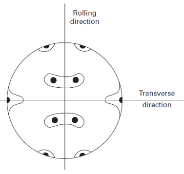

<!-- 211020 -->
# Deformation and Work-Hardening

## Introduction and Stereographic Projections
Metals rarely in equilibrium state.
Processing history affects the present properties and performance.
Majority of manufacturing processes will impose microstructural changes, some of which are extensive: e.g. rolling, forging, extruding, etcetera.
Knowing the microstructure and stress orientation is important, because the behavior of a metal depends on the slip systems.
No work-hardening occurs at evlvated temperatuers.

## Hot Work versus Cold Work
Recrystallization temperature provides demarcation between hot and cold work regimes: below this threshold is #cold-working and above is #hot-working.
#hot-working is preferable for extensive strains because force is reduced and the potential for failure by overly #cold-working also lowers.
Finish processing can be done by #cold-working to produce a stronger product, higher accuracy, and better surface finish.
#cold-working can make post-manufacturing processes easier and #hot-working is great for reshaping some shape but not great for machining.

## Work-Hardening
Dislocations provide means for #plastic-deformation.
Accumulation of these defects causes entanglement and raises the #flow-stress.
Dislocation retained in material requires that future stress must again exceed the prior #flow-stress.
Annihilating defects makes a material deformation plastically before accumulating dislocations.
Softening is experienced in force only (not stress) as deformation localizes.

## Affects of Temperature
High #work-hardening a material can be softened by [[annealing]].
Temperature determines the outcome: #yield-strength will decreases and [[ductility]] will increase with increasing the [[annealing]]-temperature, whereas, lowering the [[annealing]]-temperature has converse affects.

## High Temperature (#DBTT)
Brittle materials will increase in ductility...

## Stereographic Projections
Useful to display various crystallographic orientations in a compact way.
Uses a sphere and projecting some plane onto a 2D plane on sphere.
"Southern hemisphere" can contain al information of crystal, and each plane is a "great circle" that is projected onto the 2D plane below. *

!!! hint Recall projections from Calculus III.

|  |
|:--:|
| Great circles are at the full diameter of the sphere; whereas, small circle can be at any other diameter and allowed to differ from the great circle. |

### In Cubic Crystals
We can represent any orientation and symmetry of crystal systems using normal directions and associated planes.
#stereographic-projection will vary from each crystal type and orientation, but common practice is to use the $<100>$ direction as the "North Pole".

|  |
|:--:|
| Projections planes are made normal from the crystallographic vector at which the sphere is viewed. |

!!! note
    A [Wulff Net](https://en.wikipedia.org/wiki/Stereographic_projection#Wulff_net) is another way to view a #stereographic-projection.

### Cubic Projections
Some cubic systems have common directions of importance.

|  |
|:--:|
| The square, triangle, and elliptical symbols represent the number of fold required before reaching the next symmetric plane. All these #stereographic-projection can be represented with a single, triangular colormap. |

### Resolved Shear Stress
Because the crystallographic orientation is rarely, perfectly aligned with shear stress: therefore, the actual (resolved) shear stress will be different: **dislocations only #glide under shear stress**.
This is important for polycrystalline materials.
The orientation of the slip system relative to the applied stress (tension or compression) will determine the actual stress on that slip system.

|  |
|:--:|
| Resolving shear stress on the slip plane. |

$$\begin{align*}
A &= A_{1}cos(\phi) \\
\tau &= \frac{P\cos(\lambda)}{A_{1}} = \frac{P}{A}\cos(\phi)\cos(\lambda) \\
\tau &= \sigma_{0}\cos(\phi)\cos(\lambda) \\
\dots
\end{align*}$$

## Finding Orientations
Scalar product of two directions can be used to determine the angle between them (use the Miller indices).

## [Schmid Factor](schmid-factor.md)

## Easy Glide
Easy Glide
: Single slip system active such that dislocation do not interact: dislocations may pileup but do not entangle.

Affected by the following:
1. Specimen size: specimens with small cross-sectional areas tend to have a more extended #easy-glide region.
2. Temperature: #easy-glide is more pronounced at lower temperatures and may vanish completely at high temperatures.
3. #SFE: #fcc metals with low #SFE tend to have more pronounced #easy-glide regions with few slip systems.
4. Solute atoms: if dislocations are pinned, then they will shorten the mean path and extent of #easy-glide. If solutes contribute to lowering the #SFE $\dots$.

#easy-glide is interrupted when other things are allowed: i.e. if multiple slip systems are active, then #easy-glide ceases to occur.

### Summary
Real conditions of processing will introduce defects that result in strengthening.
Temperature can prevent or reverse defect accumulation, which eliminates #work-hardening.
Applied stress affects the microstructure and #stereographic-projection allow us to standardize viewing these effects.

!!! question Is there a difference between work-hardening and strain-hardening? <cite>#Daniel-Kenney
    They are the same thing.

!!! question The book cites microfissures for work-softening? <cite> Fazzina
    Mostly attributed to #necking, but we will look at the geometric considerations later.

<!-- 211022 -->
## Strain and Slip Reorientation
!!! example Let us say some stress of $5 kPa$ acts in the $(432)$ direction. What is the #flow-stress, $\tau$ on the $\{11\bar{1}\}(011)$?
    Recall Eq. \eqref{eq:schmid_factor}: $M = \cos{\phi}\cos{\lambda}$.

    $$\begin{split}
    \cos{\phi} &:= \frac{\vec{a}\vec{b}}{|\vec{a}||\vec{b}|} \\
    &= \frac{4(1) + 3(1) + 1(-1)}{\sqrt{4^{2} + 3^{2} + 1^{2}}\sqrt{1^{2} + 1^{2} + (-1)^{2}}} \\
    &= \frac{5}{\sqrt{29}\sqrt{3}} \\
    &= 0.536 \\
    \cos{\lambda} &= \frac{4(0) + 3(1) + 2(1)}{\sqrt{4^{2} + 3^{2} + 1^{2}}\sqrt{0^{2} + 1^{2} + 1^{2}}} \\
    &= \frac{5}{\sqrt{29}\sqrt{2}} \\
    &\approx 0.657 \\
    \implies M &= \cos(0.536)\cos(0.657) = 0.352 \\
    \therefore \tau &= M\sigma = 0.352(5 [kPa]) = 1.76 kPa
    \end{split}$$

An applied normal stress will have a resulting shear stress on the [slip planes](slip-plane.md) and [slip direction](slip-direction.md) as determined by the [[Schmid-Factor]] (Eq. \eqref{eq:schmid_factor}).
The strain caused by that stress follows a similar relationship.
The strain will result in a change to the crystal orientation, such that the and resolved shear stress.

### Resolved Shear Strain
!!! note The book and pdf version of the book erroneously list $d\lambda$ and not $d\gamma$ for the strain related [[Schmid-Factor]] (Eq. \eqref{eq:schmid_factor}).

$$\begin{equation}
d\gamma = \frac{d\epsilon}{\sin{\chi}{\lambda}} = \frac{d\epsilon}{M}
\end{equation}$$

### Slip Systems Stereographically
Crystals reorient themselves during deformation, which causes a change in the resolved stress and potentially the #slip-system.

|  |
|:--:|
| Imagine the tensile axis is in the hatched triangle ($P_{1}$). |

The idea here is that $P_{1}$, loading direction, can move around the stereograph.
While in this hatched triangle, $P_{1}$ resides in only one #slip-system.

|  |
|:--:|
| Note that the $(111)$ moved to the bottom. |

If living in the $(001) \text{, } (\bar{1}11) \text{, and } (011)$ triangle, this #slip-system can be flipped along any edge: i.e. a hinge.
That hinged edge is the plane active in the #slip-system.
The path traced by the opposite corner is the ...

### Reorientation
Primary #slip-system can be found in the triangle; however, $P_{1}$ will move during deformation in the direction traced by the opposing corner hinging along some plane: #easy-glide.
As the crystal reorients itself, multiple #slip-system become possible.
Starting at a corner of four stereographic triangles activates four #slip-system.
If starting on an edge, then two #slip-system are active.
Deformation occurs not in the direction with the most #slip-system but in the most favorable direction.

!!! question What if the crystal rotates? <cite>#Daniel-Kenney
    These stereograms are really limited to #sc. The crystal will reorient itself to some #slip-system.

|  |
|:--:|
| In the middle of the triangle, only one #slip-system is active. More #slip-system become active nearer the edge: #conjugate-slip-plane. |

### Shear Stress-Strain Curves
Reorientation and resulting stress changes can be described by three stages:
1. Stage I, #easy-glide: very little to no #work-hardening; long slip lines; and does not exist in polycrystalline samples.
2. Stage II, linear hardening: high slope value
3. Stage III, cross-slip activation

>higher temperatures and lower #SFE go to Stage III faster. <cite> Atwater

### Polycrystalline Slip
A single crystal should start slip in the primary plane, but its neighboring grains will affect the state of stress and deformation.
Strain in the first grain must be compatible with that of the other grains.
For deformation to occur in the bulk material, stress must be transferred from grain to grain via independent #slip-system and no Stage I region is observed.

### Summary
Slip: a dynamic process, the mechanisms and geometry of the system vary during the slipping process.
The resolved stress and strain can be determined through the [[Schmid-Factor]] (Eq. \eqref{eq:schmid_factor}), but the angles are changed at each increment of strain.
The reorientation of crystals to the applied force is only possible if not constrained.
Polycrystalline materials will not exhibit the same mechanical behavior as single crystal, because they must accommodate their neighbors.

<!-- 211025 -->
## Polycrystalline Slip
- Theories of hardening.
- How this fits with single crystal theories.
- Highlight prominent theories and their limitations.

### Introduction
3-stage slip/deformation curve in single crystals does not exist in polycrystals.
The compatibility of grains requires multiple slip systems are initiated from earliest stages of deformation.
#work-hardening is immediate, then, without #easy-glide region.

### Work-Hardening in Polycrystals
Dislocation density is important measure of strain response of metal.
More dislocations means more motion inhibition.
As they are "pinned", their "free" segments shrink (higher stress needed to activate as sources).
The entangled dislocations form cell structures and sub-boundaries.
This is most evident in high #SFE metals because #cross-slip is easier.
#dislocation-density increases from $sim 10^{6}$ to $\sim 10^{12} cm^{-2}$ during #cold-working from the annealed condition.
The general relationship between flow stress and #dislocation-density is same as with single crystals.

$$\begin{equation}
\tau = \tau_{0} + \alpha G\vec{b}\sqrt{\rho}
\end{equation}$$
\label{eq:flow_stress_work_hardening_polycrystals}

### Modeling Defect Accumulation
Stress is a *state function:* does not matter how it got there.
Strain is a *path function*: does depend on how it got there.
Knowing that there are defects does not tell us how they got there.
A central challenge of #work-hardening theory to develop models for how dislocations and related features are created and then to compare this with the observed microstructures.
The mechanisms and interactions are sensitive to the parameters of crystal structure, #SFE, temperature, #strain-rate, etcetera.

### [Taylor Theory](taylor-theory.md)
Developed before the 3-stage single crystal concept of deformation was known.
Relies on the concept of dislocations being "trapped" within the elastic stress field of other dislocations.
The trapped dislocations raise the required stress to continue deformation.
#dislocation-density is critical to the overall resistance to deformation (revisit [Orowan Equation](#orowan-equation) concepts of obstacles).

$$\begin{equation}
\gamma = k\rho\vec{b}\ell
\end{equation}$$

|  |
|:--:|
| Deformation is taken as resistance to a dislocation moving a distance $\ell$. |

Taylor restricted consideration to edge dislocations, which have a shear stress field of: $$\sigma_{12} = \frac{G}{2\pi(1 - \nu)}\frac{x_{1}(x_{1}^{2} - x_{2}^{2})}{(x_{1}^{2} + x_{2}^{2})}$$
For a spacing of $\frac{L}{2}$ between dislocations ($x_{1} = \frac{L}{2}, x_{2} = 0$): $$\sigma_{12} = \frac{G\vec{b}}{\pi(1 - \nu)L} = \frac{KG\vec{b}}{L}$$
The shear stress must overcome this to move the dislocation.
Substituting $\rho$ for $L$, as determined by Orowan hardening and simplifying: $$\tau = $$

### Limitations of Taylor Theory
- Uniform distribution if dislocations, which is rarely observed.
- Excludes screw dislocations, which are prone to cross-slip.Two dislocations trapped on each other can still move in the presence of a third dislocation. #hcp and Stage II deformation for cubic crystals is now know to be linear, not parabolic as predicted. Relies on uniform distribution throughout the crystal when local concentrations of deformation are observed.

### Seeger Theory
A

### #Kuhlmann-Wilsdorf-Theory
Dislocation bowing is primary concern. Microstructure develops #dislocation-cell in medium to high #SFE metals, so the theory should include their contribution to the #work-hardening.
Increasing strain decreases the cell size and aligns their dimensions to the strain direction.
Cell walls become more distinct.
Eventually, cell walls exhibit increasing misalignments and form sub-boundaries during polygonization. Low
#SFE metals will develop other features, such as twin bundles, shear bands, and stacking faults.
KW proposed the mesh-length theory based on stress required for #dislocation-bowing.

*[KW]: Kuhlmann-Wilsdorf Theory

|  |
|:--:|
| Strains of 0.2, 0.4, and 0.8 strain of Ni. Clean areas in pictures are cell walls. |

!!! question Are the cell walls the grain boundaries? <cite> Adam
    Eventually, they could form into grain boundaries. These could be thought of as low-angle grain boundaries until sufficient #cold-working is applied to misalign them.

### Summary
#work-hardening happens with the introduction of defects to the crystal structure. 

!!! quote <cite> Atwater
    #dislocation-density controls overall #work-hardening capacity.

<!-- 211027 -->
## Softening and Texture
#work-softening
: The weakening of a material under increasing strain can come from several sources:
: - *#damage accumulation*: primarily in ceramics and composites where interfacial failure and microcracks weaken the structure.
: - *Radiation-hardened materials*: the high #vacancy-concentration can aid in #dislocation-motion causing the formation of #dislocation-channels.
: - *Geometric softening*: caused by grain rotation to favorable slip orientations such that the component of shear stress increases under a given applied stress (**different than #necking**, which is an apparent softening caused by geometric constraint). This could like a decrease on the true stress-strain curve.
: - *Thermal softening*: internally generated heat from the work of deformation, not externally applied heat (e.g. #hot-working).

!!! question Can #fatigue-cracks be included to the #damage accumulation? <cite> Adam
    Absolutely.
    Any microvoids near the end of the metal's service life would certainly be included.

### [Thermal Softening](thermal-softening.md)
Energy involved in deformation is mostly converted to heat: $ < 10%$ stored as defects.
Accumulation of heat at sites of deformation is strongly influenced by the thermal conductivity and heat capacity of the material.
This response is also sensitive to elevated temperatures, and high #strain-rate will be fast enough to adversely affect mechanical performance.

|  |
|:--:|
| Not all tests will be in the ballistic regime, but increasing the #strain-rate to as much as $1 s^{-1}$ is enough to affect performance. |

Temperature effect can be determined from conversion of mechanical energy into heat in small increments as governed by:
$$\begin{equation}
\Delta T = \frac{\beta}{\rho C_{p}}\sigma\Delta \epsilon
\end{equation}$$
where $\beta$ is the conversion rate, $C_{p}$ is the heat capacity, and $\rho$ is the material density.
Isothermal curves assume full heat dissipation and no #work-softening and the adiabatic curve will be the isolated effect of heat on mechanical performance.

!!! attention
    Adiabatic conditions should be justified in the testing conditions!

### Adiabatic Shear Bands
Adiabatic [shear bands](shear-bands.md) are highly localized regions of deformation where softening occurs which results in overall softening and deformation along these orientations.
The higher the #strain-rate, the more likely the formation of [shear bands](shear-bands.md): e.g. forging and ballistic impact.
Inhomogeneous microstructures can be problematic for later use if not accounted for: i.e. forging more so than ballistics.
High temperatures localized at these [shear bands](shear-bands.md) can result in #recrystallization within the region which causes grain-size strengthening.
This deformation mechanism is *desirable* in armor-penetrating munitions.

### Texture
Crystallographic reorientation of the microstructure can occur at large strains in a single direction.
This type of strain is encountered in rolling, extruding, wire drawing, and other manufacturing processes.
[slip planes](slip-plane.md) will align to the rolling plane and the [slip direction](slip-direction.md) will align to the rolling direction.
Resulting properties of a textured component are [anisotropic](anistropy.md) with greater strength along the major axes of the grain: e.g. in rolling, this would be the rolling direction.

### Texture Effects
[anisotropy](anistropy.md) must be considered for future processing and applications.
A result will be variable #yield-strength and [[ductility]] depending on direction.
This could be beneficial when loading axis or other property is controlled during its use: e.g. magnetic properties of ...

!!! example Rolling a copper plate.
    If drawn into a cup shape, the deformation behavior will be markedly different depending on orientation.

!!! question Does annealing remove texture effects? <cite>#Daniel-Kenney
    Annealing allows for #recrystallization to "erase" the elongated, #texture grains into smaller, equal sized grains.

### Measuring Texture
|  |
|:--:|
| Characteristic pole figure from brass. |

|  |
|:--:|
| The pyramid is actually a cube and these figures denote the orientation of only a single crystal. |

|  |
|:--:|
| This converts the pole figure back to the stereographic projections. |

|  |
|:--:|
| This was looking at process of relieving stress in aluminum. If there is color concentration, then there is texture. |