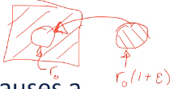

# Elastic Misfit

$$\begin{equation}
\Delta V = \bigg(\frac{4}{3}\bigg)\pi r_{0}^{3}(1 + \epsilon)^{3} - \frac{4}{3}\pi r_{0}^{3} = \frac{4}{3}\pi r_{0}^{3}[(1 + \epsilon)^{3} - 1]
\end{equation}$$

The insertion of an atom into an undersized [[lattice-site]] causes a volumetric expansion (spherical).
If $\epsilon$ is small, then the total volume change can be estimated with Eq. \eqref{eq:elastic_misfit}: $$\Delta V \approx 4\pi r_{0}^{3}\epsilon$$
The reason for this approximation comes from squaring or cubing $\epsilon$ which becomes much smaller, $\require{cancel}\cancelto{0}{\epsilon^{n}} \text{, for } n \geq 2$.

|  |
|:--:|
| The $\frac{4}{3}$ in these equations comes from the volume of a sphere, $\frac{4}{3}\pi R^{3}$. |