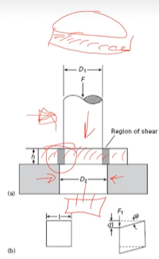
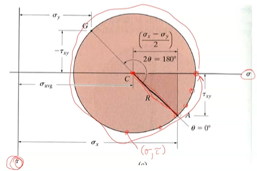
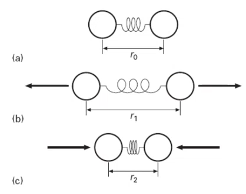
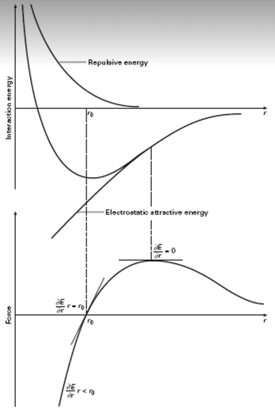

<!-- 210901 -->
# Elasticity

## Introduction
Stresses occur at varying scales within a material.
Macro-stresses include component design and assemblage.
Micro-stresses are found within the material and include those from [defects](defects.md): #dislocations, alloying elements. etcetera.
Stresses at smallest scale act cumulatively to produce the response to the largest scale.
This all relates to the **#CPSPP** relationship.

## Elastic
- Reverse deformation, that instantaneously recovers to its original dimensions after force is removed.
- Analogous to a spring, the relationship was conveniently described by [Robert Hooke: $F = k\delta x$](../engr-727-001-advanced-mechanics-of-materials/hookes-law.md)

### Stress
- Stress is the result of applied force and response of material to balance external force.
    - Area resisting force is perpendicular to applied force line of action.
    - Material response is determined by atomic bonds and orientation relative to crystal lattice.
    - !!! note
            Polycrystalline materials assumed [anisotropic](anistropy.md).
    - Component response dictated by design and material properties.
    - Tensile stress often positive in sign and compression is negative, by convention.

### Strain
- Physical result of stress.
- Linear proportional to stress in Hookean material up to its #elastic-elastic/ #yield-stress.
- !!! note
        #proportional-limit is that when the #stress-strain deviates from linear and #yield-stress is at the 0.02% strain offset.
- Metals often Hookean in nature and assumed until otherwise stated.
- [True strain](true-strain.md)
- [Engineering strain](engineering-strain.md)

### Engineering vs True Stress
- Comes from initial conditions and easily measured.
- !!! note
        Area does not change, so the initial area determines the stress throughout the entire #deformation.
- True stress and [strain](true-strain.md) are more accurate and use an instantaneous cross-section.
- In the elastic region for metals, #deformation is typically small and engineering and true stress-strain values are comparable.
- $\sigma_{T} = \sigma(1 + \epsilon)$
- $\epsilon_{T} = ln(1 + \epsilon)$

### Notation!
[Notation](tensor-notation.md) is not always the same.

### Strain Energy
- Work done during deformation is converted to heat and #internal-energy.
- $W = Fd$, but $F$ is not constant!
- Elastic deformation does not typically produce much heat, so most is stored internally.
- $dU = dQ - dQ$
- $U = W$ (without heat)
- $W = \frac{1}{2}\sigma_{ij}\epsilon_{ij} = \frac{1}{2}E\epsilon_{ij}^{2} = \frac{1}{2E}\sigma_{ij}^{2}$

### Shear/Torsion
- Shear and torsional stress are handled similarly, but vary by configuration.

|  |
|:--:|
| For a cylindrical punch, the average diameter of the punch and hole can be taken, and the area will be the circumference times the thickness of the material. |

|  |
|:--:|
| For torsion of a rod, the stress and strain vary radially and axially. |

- $\tau = \frac{F}{A}$
- $\gamma = \frac{dl}{l} = tan\theta \cong \theta$
- $G = \frac{\tau}{\gamma}$

!!! question Why does $\gamma \cong \theta$?
    #small-angles-assumption in radians mean that $sin\theta = \theta$.

### [Poisson's Ratio](../engr-727-001-advanced-mechanics-of-materials/poissons-ratio.md)
$$\begin{equation}
\nu = -\frac{\epsilon_{11}}{\epsilon_{33}} = -\frac{\epsilon_{22}}{\epsilon_{33}}
\end{equation}$$

- Describes the consequent strains #orthogonal to an applied stress.
- Most metals are 0.3.
- For constant volume without lateral contraction, the ratio is 0.5 (plastic only).

### Summary
- Elasticity affects everything, because it is initial response to stress.
- Material behavior in elastic region dictates behavior in application.
- Components rarely useful in plastic region, so they will spend their lifetime in the elastic range.
- Although elastic properties are commonly discussed at a #continuum-length-scale , we will find it important to #atomistic-length-scale phenomena.

<!-- 210903 -->
## Polycrystalline Materials and Bulk Metals

### Introduction
- Stress may be applied in any arrangement, and we can determine the overall conditions of strain.
- This is often reduced to two dimensions, but it does not have to be (it is just simpler).
- We can determine the #stress-state as a point in any orientation (not just aligned with the applied stress) by using #transformation techniques.
- Certain orientations will result in only normal or shear stresses, which can be important for determining the resulting performance.

### Stress Tensor Revisited

- #Cauchy-Stress-Tensor describes the complete #stress-state in three dimensions.
- Valid for [small deformations](tensor-notation.md).

### [Hooke's Law](../engr-727-001-advanced-mechanics-of-materials/hookes-law.md) Revisited
- Linear elastic response in #homogeneous metals and alloys which allows us to relate stress and strain in three dimensions through the [Poisson's Ratio](../engr-727-001-advanced-mechanics-of-materials/poissons-ratio.md), $\nu$.

$$\begin{split}
\epsilon_{11} &= \frac{1}{E}[\sigma_{11} - \nu(\sigma_{22} + \sigma_{33})] \\
\epsilon_{22} &= \frac{1}{E}[\sigma_{22} - \nu(\sigma_{11} + \sigma_{33})] \\
\epsilon_{33} &= \frac{1}{E}[\sigma_{33} - \nu(\sigma_{11} + \sigma_{22})] \\
\gamma_{12} &= \frac{\sigma_{12}}{G} \\
\gamma_{13} &= \frac{\sigma_{13}}{G} \\
\gamma_{23} &= \frac{\sigma_{23}}{G}
\end{split}$$

>**Example 1:** For the following stress tensor, what are the resulting normal strains if $E = 10e3 kip$ and $\nu = 0.3$?
$\sigma = \begin{bmatrix}5, 3, 2 \\ 3, -1, 0 \\ 2, 0, 4\end{bmatrix}kip$
$$\epsilon_{normal} = \begin{bmatrix}\frac{1}{10e3 ksi}[5 ksi - 0.3(-1 + 4)]ksi \\ \frac{1}{10e3 ksi}[1 ksi - 0.3(5 + 4)]ksi \\ \frac{1}{10e3 ksi}[4 ksi - 0.3(5 + (-1))]ksi\end{bmatrix}ksi = \begin{bmatrix}4.1e-4 \\ -3.7e-6 \\ 2.8e-6\end{bmatrix}$$

### Simplifications
- To avoid complex tridimensional description of stress and strain, especially during plastic deformation, simplifications are possible.

[Plane Stress](../engr-727-001-advanced-mechanics-of-materials/plane-stress.md)
: Stress and strain go to zero at free surface (normal and shear).

[Plane Strain](../engr-727-001-advanced-mechanics-of-materials/plane-strain.md)
: One dimension is considered infinite.

- Conditions of [pure shear](../engr-743-001-damage-and-fracture/pure-shear.md) can also be considered, such that no normal forces are present.

$$\begin{bmatrix}
\sigma_{xx}, \tau_{xy} \\
\tau_{yx}, \sigma_{yy}
\end{bmatrix}\begin{bmatrix}
(x) \\
(y)
\end{bmatrix}$$

$$\begin{bmatrix}
\epsilon_{xx}, \gamma_{xy} \\
\gamma_{yx}, \epsilon_{yy}
\end{bmatrix}\begin{bmatrix}
(x) \\
(y)
\end{bmatrix}$$

### [Mohr's Circle](../engr-727-001-advanced-mechanics-of-materials/mohrs-circle.md) Revisited
- A graphical way to represent stress transformation to alternative orientations.
- These are set of equations that describe stress transformation, but a graphical solution is often useful.

- Principal stress: maximum/minimum #normal-stresses (no shear)

- $R = \sqrt{(\frac{\sigma_{11} + \sigma_{22}}{2})^{2} + \tau_{12}^{2}}$
- $\sigma_{11}' = \frac{\sigma_{11} + \sigma_{22}}{2} + \frac{\sigma_{11} - \sigma_{22}}{2}cos(2\theta) + \sigma_{12}sin(2\theta)$
- $\sigma_{12}' = -\frac{\sigma_{11} - \sigma_{22}}{2}sin(2\theta) + \sigma_{12}cos(2\theta)$

!!! example What is the stress state if rotated $30\degree$ CCW?
    

    *Given: $\sigma_{11} = -8 ksi, \sigma_{22} = 12 ksi, \sigma_{12} = -6 ksi$*
    Center point, $C = \sigma_{avg} = \frac{\sigma_{11} + \sigma_{22}}{2} = \frac{-8 + 12}{2} = 2 ksi$

    

    $R = \sqrt{10^{2} + 6^{2}} = 11.66$

    

    Use trig to find $\phi$ and $\psi$: $\phi = tan^{-1}(\frac{6}{10}) = 30.96\degree, \psi = 60 - \phi = 29.04\degree$
    $\sigma_{11}' = 2 - 11.66cos(29.04) = -8.2 ksi$
    $\sigma_{12}' = -11.66sin(29.04) = 5.66 ksi$

    |  |
    |:--:|
    | Slight drop increase of #normal-stress and slight decrease of #shear-stress. |
    |  |
    | Basic steps to find all stresses and strains at orientations relative to what you start with. |

<!-- 210906 -->
## [Pure Shear](../engr-743-001-damage-and-fracture/pure-shear.md)
There exists a condition which has only shear stresses and no #normal-stress.
This condition is called *[pure shear](../engr-743-001-damage-and-fracture/pure-shear.md)*, which means that $\sigma_{11} = -\sigma_{22}$.
This implies that [Mohr's Circle](../engr-727-001-advanced-mechanics-of-materials/mohrs-circle.md) is centered at the origin, because $\sigma_{avg} = 0$.
Graphically, the maximum #shear-stress possible in this condition is the radius of [Mohr's Circle](../engr-727-001-advanced-mechanics-of-materials/mohrs-circle.md) and at $90\degree$ from the horizontal.
However, recall that angles in [Mohr's Circle](../engr-727-001-advanced-mechanics-of-materials/mohrs-circle.md) are twice real angles: e.g. if $\theta_{Mohr} = 2*\theta_{real}$ and $\theta_{Mohr} = 90\degree$, then $\theta_{real} = 45\degree$.

|  |
|:--:|
| If a component experiences compression in one axis and tension in a perpendicular axis, then elements within the component experience [pure shear](../engr-743-001-damage-and-fracture/pure-shear.md). |

Using knowledge of this condition, we can find stress and strain information with the following relations:

$$\begin{split}
\epsilon_{11} &= \frac{1}{E}(\sigma_{1} - \nu\sigma_{2}) = \frac{\sigma_{1}}{E}(1 + \nu) \\
\tau &= -\sigma_{1} (on~circle,~with~sign~convention) \\
\tau &= G\gamma \\
\epsilon_{11} &= -\frac{G\gamma}{E}(1 + \nu) \\
2\epsilon_{11} &= -\gamma \\
G &= \frac{E}{2}(1 + \nu)
\end{split}$$

"(on circle, with sign convention)" holds true because the radius, $R$ of [Mohr's Circle](../engr-727-001-advanced-mechanics-of-materials/mohrs-circle.md) is $\sigma_{1} = - \sigma_{1}$.
Some of these relationships are not limited to [[pure-shear]], because $E, G \text{and} \nu$ are material properties.

Expressing three-dimensional stress is important, but can be achieved with [tensor notation](tensor-notation.md).
Analysis of #stress-state can be reduced from three to two dimensions if assuming [plane stress](../engr-727-001-advanced-mechanics-of-materials/plane-stress.md) (zero stress in third axis) or [plane strain](../engr-727-001-advanced-mechanics-of-materials/plane-strain.md) (zero strain in third axis).
This simplified analysis can be transformed to desired #stress-state by equations or [Mohr's Circle](../engr-727-001-advanced-mechanics-of-materials/mohrs-circle.md).
Recall that [Mohr's Circle](../engr-727-001-advanced-mechanics-of-materials/mohrs-circle.md) is a graphical representation of all possible stress states, but it must be drawn accurately that trigonometric functions might be used effectively.

## Atomic Bonds

### Introduction
What preceded was continuum elasticity.
What follows is observing the previously explored behaviors at the #atomistic-length-scale.
These behaviors determine the way force, stress, and strain occur.
Characterizing these behaviors informs the results of bond strength in materials: we focus on metals.
There exist competing behaviors of attraction and repulsion.

#continuum-length-scale looks at #homogeneous units wherein #stress-state is described without knowing the exact material makeup.
Here, we can continue to ignore #anisotropic conditions, but must observe the source of elasticity: #atomic-bonds.
Strength of #atomic-bonds determined by electronic characteristics, but can be influenced by external conditions: heat, magnetic fields, etcetera.

|  |
|:--:|
| We assume only planar, uniaxial attractions. |

### Atomic Bonding
Electronic bonds govern behavior of all material properties.
All mechanical behavior first exhibits elastic behavior.
These effects can be observed with a simple spring model between two atoms.

|  |
|:--:|
| Simplified spring model to visually show attractive and repulsive forces of electronic bonds between atoms. |

### Bond Interaction and Force
Two atoms will have an equilibrium separation, $r_{0}$.
We assume this until some external influence is applied.
The minimum bonding energy also occurs here.
Repulsion is caused by the *#Pauli-Exclusion-Principle* and attraction is *#Coulombic-forces* in nature.

[Bonding Energy](bonding-energy.md)
: ~$$\begin{equation}
U_{i} = -\frac{A}{r^{m}} + \frac{B}{R^{n}}
\end{equation}$$

|  |
|:--:|
| Electronic bonding occurs according to these two curves between any two atoms. |

!!! example
    Potential energy of $Na^{+}Cl^{-}$, an ionic pair, at distance $r$ where $q_{0} = 1.6e-19~[C]$, $\epsilon_{0} = 8.85e-12~[\frac{C}{N-m^{2}}]$, and $U_{i} = 1.12~[eV]$.
    If $r_{0} = 0.276~[nm]$, then find: **a)** the value of B; and **b)** the total, attractive, and repulsive forces at $r = 0.25 [nm]$.
    $$\begin{split}
    U_{i} &= -\frac{A}{r^{m}} + \frac{B}{r^{n}} \\
    U &= U_{i} - \frac{q^{2}}{4\pi\epsilon_{0}r} + \frac{B}{r^{9}}
    \end{split}$$
    Because $\frac{dU}{dr} = 0$ at $r_{0}$,
    $$\begin{split}
    \frac{dU}{dr} &= 0 = \frac{q^{2}}{4\pi\epsilon_{0}r^{2}} - \frac{9B}{r_{0}^{10}} \\
    \frac{q^{2}}{4\pi\epsilon_{0}r^{2}} &= \frac{9B}{r_{0}^{10}} \\
    \implies B &= \frac{r_{0}^{8}q^{2}}{36\pi\epsilon_{0}}
    \end{split} \\
    \begin{split}
    B &= 8.61e-106 [N-m^{10}]
    \end{split}$$
    $B$, then, is simply plugged into the following equations to find electronic bond forces at not the equilibrium distance, $r = 0.25 [nm]$.
    $$\begin{split}
    F &= \frac{dU}{dr} = F_{A} - F_{R} \\
    F &= \frac{q^{2}}{4\pi\epsilon_{0}r^{2}} - \frac{9B}{r_{0}^{10}}
    \end{split} \\
    \begin{split}
    F_{A} &= \frac{q^{2}}{4\pi\epsilon_{0}r^{2}} = 3.68e-4 [N] \\
    F_{B} &= \frac{9B}{r_{0}^{10}} = -8.13e-9 [N] \\
    \implies F &= 4.44e-9 [N]
    \end{split}$$

### Stress and Strain in Bonds
Force is proportional to atomic displacement and change in energy.
Stress requires number of atoms involved in some area by estimating atomic spacing at equilibrium, $r_{0}^{2}$. Strain, then, is the change in spacing divided by the equilibrium spacing.
[Young's Modulus](engr-743-damage-and-fracture/youngs-modulus.md) is a material property of stress over strain.
These can be summarized by the following relations:
$$\begin{split}
F &= \frac{dU_{i}}{dr} \\
d\sigma &= NdF \\
d\sigma &= \frac{dF}{r_{0}^{2}} \\
d\epsilon &= \frac{dr}{r_{0}} \\
E &= \frac{Am(n-m)}{r_{0}^{m + 3}} \\
A &= \frac{q^{2}}{4\pi\epsilon_{0}} \\
E &= \frac{kq^{2}}{r_{0}^{4}}
\end{split}$$

|  |
|:--:|
| Stronger #atomic-bonds can effect #melting-point, #stiffness, etcetera. Understanding these effects informs how higher length scales behave under some condition. |

### Summary
Bulk properties come from #atomic-bonds.
Treatment of elasticity at #atomistic-length-scale determines balances of attractive and repulsive forces; therefore, external forces cause a shift from the equilibrium state.
Bond properties can be adjusted to preference with some processing technique: e.g. alloying.