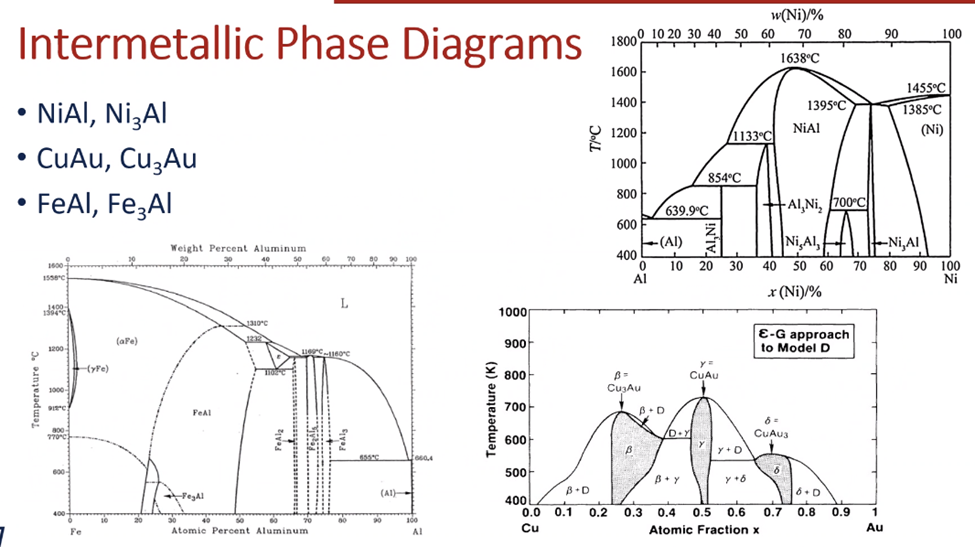
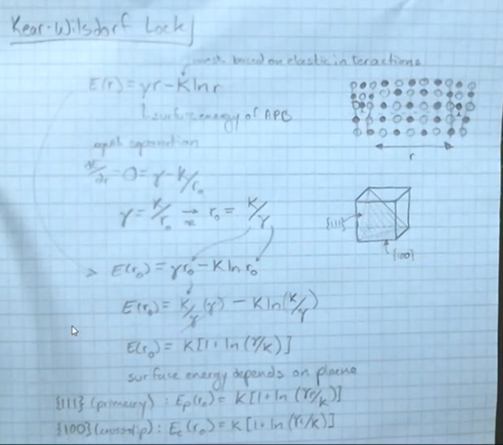

<!-- 211119 -->
# Intermetallics

!!! question What is an [intermetallic](intermetallic.md)? <cite> Atwater
    Effectively, an [intermetallic](intermetallic.md) is sort of a metal: metalloid.
    It is a metal with some ionic form to drive phase transformations.

## Objectives
Introducing this categroy, we will consider the various features that make an [intermetallic](intermetallic.md) unique.
Their crystallographic structure is similar to metals, but their order is different.
We will also determine mechanisms responsible for the unique behavior, and the limitations of these materials and strategies to overcome them.

## Introduction
An [intermetallic](intermetallic.md) are ordered metal alloys.
They are energetically favorable with a negative bonding energy which introduces new possibilities and complexities to mechanical phenomena.
The passage of dislocations creates a higher energy an tiphase boundary...

The ordered alloys take on specific arrangement in equilibrium.
It is important what elements are mixed, as not all will...

|  |
|:--:|
| An [intermetallic](intermetallic.md) may have the same weight percentage of elements as a metal, but are well-ordered. |

## Ordered Structures
Crystallographic structures can be described by Strukturbericht or space group designations.

!!! example Ordered Structures
    - A pure #fcc crystal is A1 (Strukturbericht) or Fm3m (space group).
    - A rock salt structure (#fcc) is B1 (Strukturbericht) or Fm3m (space group).
    - $Cu_{3}Au$ [intermetallic](intermetallic.md) (also #fcc) is #L1_{2}$ (Strukturbericht) or Pm3m (space group).

    |  |
    |:--:|
    | Space groups care about symmetry, not atomic position. |

Space group is more general, but doesn't give alloy information.
Lattice type (P, F, L) followed by symmetry wrt the x, y, and z axes, then the threefold symmetry of the body diagonals, followed, lastly, by any symmetry wrt the face diagonals, if present.

## Stoichiometry and Formation
The typical reference to an [intermetallic](intermetallic.md) category may be $AB$, $AB_{2}$, $A_{3}B$, etcetera.
The concentration of elements A and B is critical to the properties but some deviation of the exact chemistry may occur.
Intentional elemental substitution may be used to affect ordering and thereby...

negative enthalpy of mixing by ordering; otherwise, phase separation.

## Intermetallic Phase Diagrams
|  |
|:--:|
| Typically, an [intermetallic](intermetallic.md) is a binary, chemical composition. |

!!! note A Note on Silicides
    They are [intermetallic](intermetallic.md) with silicon, and they have relatively low densities and high melting points and high temperature strength, which sounds more like ceramics than metals.

## Dislocations in Intermetallics
Partial dislocations are a common feature in #fcc crystals, but they are not parellel to one anoth and cannot #cross-slip.
Recall that a high #SFE is characteristic of #bcc# metals and allows easy #cross-slip because $\burgers$ lies in multiple [slip planes](slip-plane.md) simultaneously.
In an [intermetallic](intermetallic.md), two perfect dislocations are linked together by an #anti-phase-boundary.
The passage of the first dislocation disrupts the ordering, and the second dislocation restores it.

*[APB]: Anti-Phase Boundary

## #anti-phase-boundary-energy
Unlike partial dislocations, the leading dislocation and trailing dislocation are separated by a region of higher energy due to unfavorable order, but they are repelled by opposing stress fields.
The combined dislocations are termed a #super-dislocation since both are needed to fully translate the crystal structure: i.e. #super-partials.

|  |
|:--:|
| They have high strength because the energy penalty of disordering. |

|  |
|:--:|
| As a dislocation moves, there is a restoration from the #anti-phase-boundary by the dislocation reordering the edge-dislocation. |

Since each dislocation can thought to do half of the job, they can represented by $\frac{1}{2}\millerVectorFamily{0}{1}{0}$...

## Kear-Wilsdorf Lock
When #super-partials cross-slip onto {100} it will inhibit mobility on {111}.
When [cross-slip]] of a screw #super-dislocation onto {100} planes occurs, #glide of the remainder of the dislocation on the {111} system is restricted because the Peierels stress resisting #glide on {100} is much higher than that on {111}.

|  |
|:--:|
| The energy separation is based on the balance between the dislocations and #anti-phase-boundary. The result is a hardening effect and can be reduved through heating. |

## Order Parameters
Long-range order (#LRO) will produce different mechanical properties than short-range order (#SRO).
#SRO has higher strength.
The ordering parameter is given as a fraction, r, or the total atoms of A in the A positions and the total fraction of A atoms in the alloys is $f_{A}$: $$S = \frac{r - f_{A}}{1 - f_{A}}$$

*[LRO]: Long-Range Order
*[SRO]: Short-Range Order

## Mechanical Effects of Ordering
Ordering produces three stages in #stress-strain curve:
1. well-defined yield point.
2. Linear #work-hardening.
3. No #work-hardening.

Disordered alloys do not exhibit stages 1 or 2, and have a gradual yield followed by stage 3.
However, take these figures with a grain of salt because they are not likely going out to 70\% strain.

## Grain Size and Fatigue Performance
Ordered alloys also behave according to Hall-Petch Equation.

<!-- 211129 -->
## Second Phase Particles
This intermetallic plays a critical role in high-strength, high-temperature applications.
It possesses low-coherency stress with the austenite matrix.
Dislocation passage must satisfy the energy considerations described earlier: distances between superpartials is dependent on #particle-size and spacing, and the interaction of the matrix and particle (elastic stresses).

## Temperature Effects
Some intermetallics increase in strength with temperature.
in $\gamma'$, the strength increases with temperature and the austenite decreases, leading to nearly constant yield stress.
While not all intermetallic display this, it is attributed to the change in dislocations mechanisms.

## Ductility
Limited by ordering and low-symmetry.
High-temperature strength can be offset by a lack of low-temperature ductility for practical applications.
Brittleness is caused by:

- Low symmetry in the crystal structure
- Grain boundaries as preferred....

### Microalloying
Relatively ductile at RT in single crystal form--i.e. useless for polycrystalline materials--but has almost no ductility as a polycrystalline aggregate.
Instead, it exhibits intergranular fracture.
Intergranular fracture is often attributed to impurities such as S and from environmental effects such as moisture and hydrogen embrittlement.
Boron can improve ductility from $0-50\%$.

### Macroalloying
By exchanging some elements in the ordered structure for other, the symmetry may be increased for more ductility.
$(Ni, Co, Fe)_{3}V$ can be modified in composition...

### Composites and Environment
Combing intermetallics with metals accommodates the brittleness of the intermetallic.
There are different modes of incorporating multiple phases, but the overall effect is similar.
This isn't really increasing ductility in the intermetallic, just the overall...

## Summary
Intermetallics have range of unique properties: mechanical behavior...