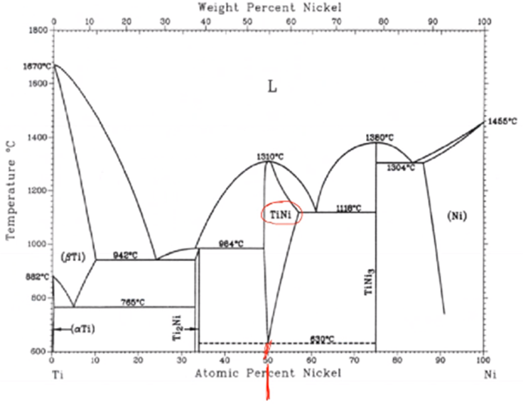
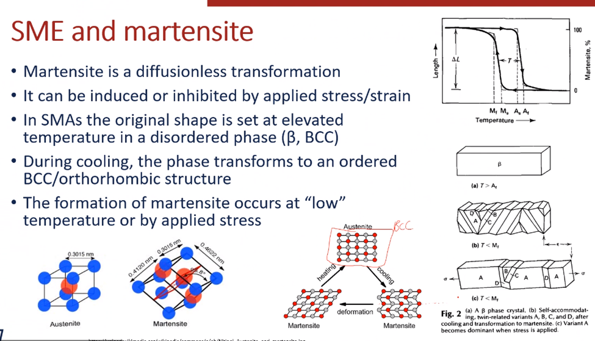
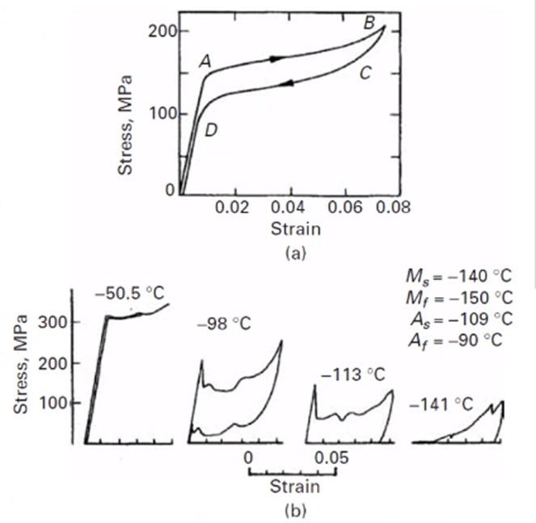

<!-- 211108 -->
# Martensitic Transformation

## Structure and Morphology
### Objectives
- Introduce the concepts of martensitic transformations
- Detail various morhpologies of martensite
- review the TTT curves

### Introduction
Martensite forms through a diffusionless (or nearly) process.
Martensitic transformations have three primary applications:

1. Strengthening
2. Toughening
3. Shape-memory

The mechanisms and microstructure can take different forms depending on the composition.
Processing and outcome will also vary depending on the material system.

### Martensite Process
Usually, we think of steels because of its significance.
This technique is widely used to strengthen steel and is most often found [OQ5lViYssko]. Not based on time because it is a diffusionless process which does not restructure the atom, but the displacement.
The relationships will be informed by other alloying elements, but the general process follows a general process [[austenization]] $\rightarrow$...

### Quick Review
|  |
|:--:|
| We move from [[austenite]] (#fcc, also known as $\gamma$-iron) to [[martensite]] via temperature to erase the prior microstructures. |

*[TTT]: Time-Temperature-Transformation

Quench does not need to be objectively rapid, but is a relative rate of cooling which depends on the material and its initial microstructure.

### Other Systems
This analysis extends to material systems beyond steel and #BCT microstructures:
- #TRIP steel: retained austenite transformed during deformation
- Ausforming: deform metastable austenite and then 	quench
- Maraging: combination of martensite and intermetallic formation (think precipitation from martensite to austenite)

*[BCT]: Body Centered Tetragonal

### Transformation
Martensitic transformation are (ideally) diffusionless, such that strain energy dominates the kinetics to make the material more brittle.
The transformation may be competitive with diffusional elements, and cooling rate is important: diffusion will be favorable at high temperatures.
Where austenite becomes unstable the #TTT diagram can map what phase(s) will form: high alloys will allow much more time for cooling.

|  |
|:--:|
| At higher temperatures, martensite requires much stress to form over austenite which is way martensite favors lower temperatures. |

### Morphologies
Martensitic phases take three general forms:
1. Lenticular
2. Lath
3. Acicular

The substructure of the lath is characterized by dislocations and/or twins.
As these phases form, they block other formations which creates backstress.
Lenticular is most common in high Ni (30%) and high C (0.6%) Fe alloys Lath martensite forms as "blocks" comprised of "laths" arranged in "packets" separated by low-angle grain boundaries: blocks are a few to tens of microns in size.
Acicular martensite is needle-like and forms at the intersection of [[slip-bands]]: forms in austenitic stainless and has significant impact on strength, some steels can become tougher at cryogenic temperatures.

### Defects in Martensite
Martensite will contain and interact with defects in the microstructure.
Examples of twins inside and through martensite are given, but a combination of slip and twinning may occur.
Dislocations may be introduced by the crystallographic reorientation and the consequent lattice differences.
Twinned martensite (lenticular) will be more brittle than dislocation martensite (laths) due to the twins' blockage of slip.

### The Habit Plane
All martensite has an undistorted, unrotated plane during transformation.
This plane has the same indices in the parent and martensite phases: the plane does not move/change before to after transformation.

### Summary
Martensitic transformations are diffusionless, but comes in many forms with many different impacts because of its dependence on temperature and the order in which the various phases form.
The most common way to form martensite is through quenching.

<!-- 211115 -->
## Stress and Strain Effects
Martensite in FeC has the biggest outcome to strengthening.

### Introduction
Martensite is an effective way to increase strength in ferrous alloys.
The composition determines the overall strengthening effect, by they share many commonalities.
The formation of martensite creates dilation and distortion of the lattice, such that stress and strain results.

### Martensite Strength
Ferrous martensitic phase provides the greatest strengthening effect.
Formation of martensite in sufficient quantity will increase hardness from HRC (Rockwell Hardness, C-scale) 15 to 65.
The mechanisms of hardening have been debated for decades, and are now attributed to a combination of factors:
- Dislocation density increases,
- Boundary strengthening,
- Solid Solution strengthening,
- Carbon clustering, etcetera.

### Grain Size and Solution Strengthening
Hall-Petch hardening is reflected in martensite formation. Smaller grains produce finer martensitic lens.
The slope of the Hall-Petch curve may not be affected, but it will be shifted up by increasing carbon content.
Grain size is typically not a critical factor in hardened steels in the usual range: $> 100 \mu m$.
Substitutional solid solution strengthening is also relatively *unimportant*, but interstitial is.

|  |
|:--:|
| Recall that the last two alloying number denote weight-percent carbon. The more carbon, the higher propensity for martensite hardening. |

### Interstitial Hardening
If martensite is considered as a supersaturated, interstitial solid solution, then it is the major contributor to strength.
The strengthening, then, can be thought of as interactions between dislocations and single atoms, where the shear, yield stress is related to the maximum force, $F_\text{max}}$ dislocation line tension, $T$, solute concentration, $C$, and angle of displacement when passing through the solute, $\phi'$: $$\tau_{0} = \bigg(1 - \frac{\phi'}{5\pi}\bigg)C\bigg(\frac{F_{\text{max}}}{2T}\bigg)^{\frac{3}{2}}\sqrt{3C}$$
Strength increases with square root of the concentration.
Snoek-ordering (single jump energy minimization) is quick; whereas, formaing a Cottrell atmosphere requires long-range diffusion.

### Carbon Effects
Carbon causes lattice distortions and shear strain.
They will move to regions around screw and edge dislocations that cancel these strains or reduce them.
These Cottrell atomspheres will strengthen the alloy in static and dynamic "aging".
Carbon may also cluster together and strengthen martensite (without changing its structure): this is most favorable at lower temperatures, as sufficient thermal energy will convert the phases to cementite or other structures.
Precipitation can also occur, where some cementite particles are formed within martensite and is more effective at strengthening.

### The Whole Enchilada
The presence of fine (nanoscale) twins within martensite will also prevent dislocation movement and aid strengthening even more effectively than the other solution or precipitation hardening mechanisms.
High dislocation densities associated with martensite will also result in increased strength.
Lattice stress (Peierels stress) also contributes to the total, and is highly temperature sensitive.
Overall, the various strengthening mechanisms...

### Stress-Martensite Interaction
The formation of the martensitic structure will induce a lattice stress and can be aided or inhibited by applied stress.
Imagine a martensitic lath forming, such that, an initially straight line through it would be distorted.
There are two strain: dilation (normal) and distortion (shear).

### Martensitic Transformations and Stress
Because martensite induces stress to the lattice, stress can affect its formation (stress-assisted martensite).
There is work required to transform the structure, both by normal and shear stress/strain.
Uniaxial tensions and compression increases $M_{s}$.
Hydrostatic stress lowers (suppresses) $M_{s}$.
The martensitic transformation can be driven by stress at a temperature higher than it normally would occur.

### Mechanical Effect
Martensitic transformation causes a distinct drop in load during tensile testing.
In the elastic regime, the stress of formation is the yield stress.
Grain size and pre-strain increase $M_{s}$.FU_{i}

### Strain-Induced Martensite
#TRIP steels use strain-induced martensite formation to achieve high strength and ductility.
Results in localized strengthening around necked regions, cracks, etcetera.

### Martensite Fracture
Usually initiated at the martensite boundaries.
The martensitic phase is harder in higher carbon alloys with cracks traversing the laths or plates.
Microcracks form when one lens impinges another forming a stress concentration.
Tempering can softern the overall structure, but impurities may segregate to boundaries and actually embrittle the material.

### Summary
Martensite has important effects on the strength of materials....

<!-- 211117 -->
## Shape Memory
### Objectives
Shape-memory effects from shape-memory alloys from certain, underlying principles: especially martensitic phase formation.

### Introduction
Practical applications of shape memory alloys are numerous, and understanding the phenomena is critical to their control.
A martensitic phase transformation is not for strengthening in this case, but rather it is used to exploit elasticity and plasticity effects.

### Overview
Ti-Ni is a typical, shape-memory alloy.
The shape-memory effect (#SME) is a mechanical response that restores a metal to its original shape after plastic deformation by heating: this is only possible if plastic deformation does not occur by slip.
Other alloys have also been developed that exhibit this behavior: AgCd, AgZn, AuCd, CuAl, FeBe, NbTi, etcetera.

*[SME]: Shape-Memory Effect

### SME and Martensite
Martensite is a diffusionless transformation: it can be induced or inhibited by applied stress/strain.
In #SMA, the original shape is set at elevated temperature in a disordered state ($\beta$, #bcc).
During cooling, the phase transforms to an ordered #bcc/orthorhombic structure.
The formation of martensite occurs at "low" temperature or by applied stress.

*[SMA]: Shape-Memory Alloy

### Pseudo (Super) Elasticity
[[pseudoelasticity]]
: Property where an alloy can undergo significant amounts of strain and return to its original dimensions.

Martensitic phase forms due to stress at a temperature above $M_{s}$.
The austentite/martensite interfaces are [[glissile]], and move throughout the material with an increasing abundance of martensite.
The transformation accommodates strain much greater than typically observed, because as stress is reduced, the martensite reverses (again, above $M_{s}$) and the sample returns to its original dimensions.

|  |
|:--:|
| Notice correlations with the martensite/austenite temperatures. Above $A_{s}$, the full [[pseudoelastic]]] effect is observed. Between $A_{s}$ and $M_{s}$, the deformation is permanent with little elastic recovery: austenite cannot be formed to reverse it. Below $M_{f}$, the structure is already fully martensitic, so the strain-memory effect is dominant. |

### Martensitic Variants and Pseudoelasticity
The structure of martensite is a "twinned" rhombehedral structure, such that it maintains the same shape. Strain occurs by straightening out these "kinks" such that one orientation (variant) is preferred.
The preferred variant depends on applied stress resolved on the variants.
There may be many variants, especially in polycrystalline materials, but the cumulative effect is to convert the martensite to a preferred one, until heating reverses the structural changes to a more uniform distribution.

### Strain Memory
[[pseudoelasticity]] is reversed by the austenite phase being in equilibrium.
In the more popular #SME, strain memory, the variants do not reverse after stress is released.
Strain is retained until heating allows the multi-variant structure to return: overheating will result in an austentic transformation.
Some variants will prefer to form under tension/compression, and the localized response will be determined by that.

### SMA Applications
- Sensors
- Actuators
- Dental wires
- Orthopedic implants
- Shrink-fit compression assemblies

### Summary
#SMA have unique properties that mediated by martensitic transformation.
The creation, modification, and reversal of martensite within these alloys allows unusual elastic and plastic behavior.
In [[pseudoelasticity]], the primary mechanism is stress-induced martensitic transformation.
In strain-memory, the primary mechanisms is de-[[twinning]] and re-[[twinning]]...