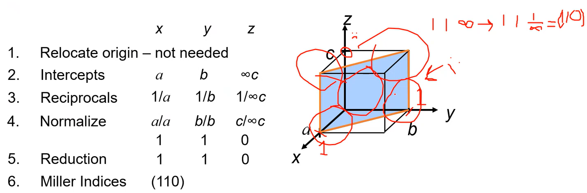
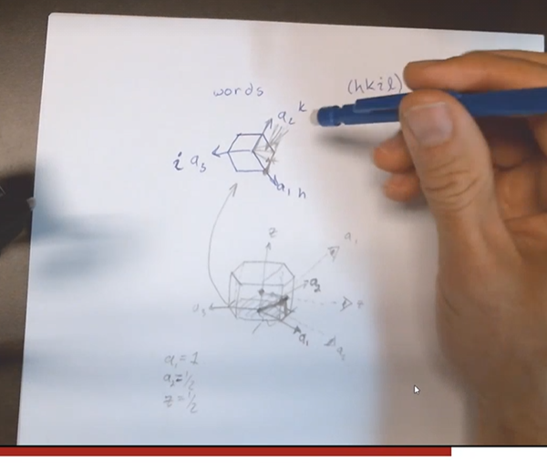
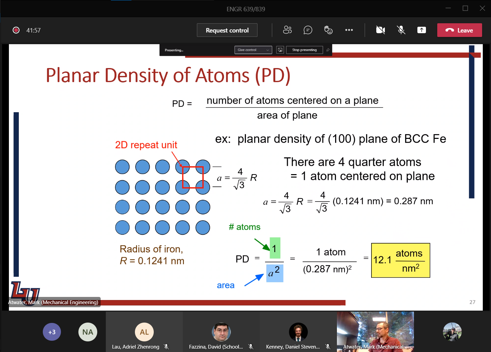

<!-- 210823 -->
# Materials: Structure, Properties, and Performance

## Introduction
**Objectives**
The course content will enable students to set and meet expectations.
All of this material, in its content and instruction, are new: so, leave room for error.
Be inspired to tackle whatever comes our way.

|  |
|:--:|
| Creationeering diagram. |

|  |
|:--:|
| Cross-shaped Liberty University Creationeer. |

*[CPSPP]: Chemistry-Process-Structure-Property-Performance

**Definitions**
This class will make more familiar the "chemistry-process-structure" portion of the *chemistry-process-structure-property-performance*" (#CPSPP) relationship.
LU seeks to apply these engineering disciplines into entrepreneurship.

Mechanical
: Force response of materials, which includes the underlying principles/effects of microstructure.

Metallurgy
: Microstructural transformations dictated by composition/processing that is the foundation.

Mechanical Metallurgy
: As a course, studies not *how* materials behave, by *why* they behave a certain way.

!!! info Syllabus
    Homeworks due only before the relevant exams, and graded for the good ol' college try.
    If you can do the homeworks, then you can do the tests.
    **Final Exam is cumulative.**
    Critical Review: "Reverse engineer" an article and explain it with additional comments or inferences.
    The accompanying presentation should explain the takeaway from the application articles/comments.

## Review
!!! summary #CPSPP
    Relationship for how some chemical composition (e.g: FeC) is processed to produce some structure, which has some property that allows some performance.

|  |
|:--:|
| Iron-Carbon phase diagram. |

|  |
|:--:|
| Microstructures in FeC phase diagram. [[phase-diagrams]] pack a lot of information for CPS of #CPSPP sequence. Lines denote what structure is found after some process with some chemical composition, which can be found by the *Lever Rule*. |

Lever Rule
: Ratio of phases proportional to weight percent distance to other phases.

|  |
|:--:|
| Crystallographic examples. |

!!! info Crystallographic Types
    Simple cubic (#sc), face-center cubic (#fcc), body-center cubic (#bcc), hexagonal close-packed (#hcp).
    - The atomic packing factor, #apf, the ratio lattice that is filled, increases down this list.
    - #fcc and #hcp are similar, but #hcp is more brittle.

*[sc]: Simple Cubic
*[fcc]: Face-Center Cubic
*[bcc]: Body-Center Cubic
*[hcp]: Hexagonal Close-Packed
*[apf]: Atomic Packing Factor

|  |
|:--:|
| Copper phase diagram. |

|  |
|:--:|
| The angle at which one stuffs at burger into his face. |

[[burgers-vector]], $\vec{b}$
: Lattice displacement by a dislocation; vector of dislocation; location, magnitude, and direction of influence on lattice.
Can weaken metals when many dislocations exist.

<!-- 210825 -->

|  |
|:--:|
| Pictographic way to visual CPSPP relationship according to processing techniques. |

!!! example #CPSPP
    Includes low-carbon steel; high-carbon steel; and, cast iron.
    All same chemistry with different composition ratios and examples of different processing techniques applied/able.
    |  |
    |:--:|
    | Common steels in automotive applications. |

**Monolithic**
Previously explained as homogeneous or isotropic, but depends on length scale.
Here, means the same crystal structure throughout: e.g. pearlite.

|  |
|:--:|
| Phase diagram for FeC with microstructure. |

**Materials Design**
Exposed to variety of conditions, but can be designed to suit.
More complex designs may have better performance.
Composites have "rules-of-mixtures" to balance performance.
Hierarchical materials vary structure/composition to enhance functional/structural properties at different length scales.

**Our Focus:**
not on manufacturing techniques: e.g. ENGR 835.
Will consider how manufacturing variables affect structure.
We will move up length up from atomistics.

## Metallic Crystal Structure
### Energy and Packing
|  |  |
|:--:|:--:|
| Non-dense, random packing. | Dense, ordered packing. |

Ordered structures tend to be nearer the minimum bonding energy and are more stable.

**Atomic Packing**
Dense crystal structures for metals.
Reasons for dense packing:
1. Bonds between metal atoms are non-directional; 
2. Nearest neighbor distances tend to be small in order to lower bond energy;
3. High degree of shielding (of ion cores) provided by free electron cloud; and,
4. Crystal structures for metals simpler than structures for ceramics and polymers.

### Crystalline (Periodic) Structure
|  |
|:--:|
| Crystalline (Periodic) Structure. |
|  |
| Simple Cubic (#sc) Crystal Structure: centers of atoms at corners and close packed along edges. |
|  |
| Body-Centered Cubic (#bcc) Structure: atoms located at 8 cube corners with a single atom at cube center. |
|  |
| Face-Centered Cubic (#fcc) Structure: atoms located at 8 cube corners with half atoms at center of 6 cube faces. |
|  |
| Hexagonal Close-Packed (#hcp) Structure: only B or C positions can be filled in a single layer. |
|  |
| Interces in each layer can be filled only according to some pattern: "A" or "B". |

**Structure** | **Coor. #** | **$\frac{atoms}{cell}$** | **#apf** | **[[slip-plane]]** | **[[slip-system]]**
|:-:|:-:|:-:|:-:|:-:|:-:|
#sc | 6 | 1
#bcc | 8 | 2 | 0.68 | 3 | 48
#fcc | 12 | 4 | 0.74 | 1 | 12
#hcp | 12 | 6 | 0.74 | 3 | 12

<!-- 210827 -->

## Density Comparison of Materials
|  |
|:--:|
| In general, $\rho_{metals} > \rho_{ceramics} > \rho_{polymers}$ |

### Polycrystalline Materials
|  |
|:--:|
| Higher cooling rates at edges make for smaller grains; whereas, slower cooling rate at center make for larger, directionally aligned grains. |

*Most* engineering materials are composed of many, small single crystals.
Each "grain" is a single crystal.
Grain sizes typically range from 1 nm to 2 cm.
Smaller grains usually mean higher strength and lower ductility.

|  |
|:--:|
| Same crystal type that repeat in different orientations. |

### Anistropy
|  |
|:--:|
| Unit cell of #bcc ($\alpha$) iron. |

[[anistropy]]
: A property value that depends on crystallographic direction of measurement.

Properties depend on direction loading, because of linear density along that direction. Best observed in single crystals. The higher linear density means higher stiffness, usually.

### Istropy
|  |
|:--:|
| Randomly oriented versus textured grains. |

**Polycrystals:** properties may (not) vary with direction.
If grains randomly oriented, properties are [[isotropic]]: independent of loading direction.
If grains, "textured"--crystallographic orientation--properties are [[anistropic]]: dependent on loading direction.

### Miller Indices
A method of assigning coordinate values to crystallographic lattice sites.
Used to identify specific points, directions, and planes or families of these.
Used to identify crystallographic information.
Three ways to identify:

#### 1) Point coordinates Algorithm
!!! note
    A lattice position with a unit cell and determined as fractional multiples of unit cell edge lengths.

|  |  |
|:--:|:--:|
| Determined as fractional multiples of unit cell edge lengths. |  |

1. Lattice position is a, b, c.
2. Divide by unit cell edge lengths and remove commas: $\frac{a}{a}\frac{b}{b}\frac{c}{c} = 111$

#### 2) Crystallographic Directions Algorithm

!!! note
    Remember from calculus the $tip - tail$ method to find vector direction and length.

1. Determine coordinates of vector head and tail: $(x_{2}, y_{2}, z_{2})$ and $(x_{1}, y_{1}, z_{1})$, respectively.
2. Subtract tail coordinates from head coordinates.
3. Normalize this subtraction by lattice parameters of unit cell edge length: $\frac{x_{2} - x_{1}}{a}\frac{y_{2} - y_{1}}{b}\frac{z_{2} - z_{1}}{c}$.
4. Multiply to smallest integer values.
5. Enclose in square brackets with no commas: `[uvw]`.

!!! note
    Negative indices represented with overbars: $-4, 1, 2 \implies [\bar{4}12]$
    A *[[family-of-directions]]* are crystallographically equivalent (same atomic spacing) and indicated by angle brackets, `<>`.

|  |
|:--:|
| Common crystallographic directions. |

#### 3) Crystallographic Planes Algorithm
1. If plane passes through origin, establish a new origin in another unit cell.
2. Read off values of intercepts of plane (designated $A, B, C$) with $x, y, z$ axes in terms of $a, b, c$.
3. Take reciprocals of intercepts.
4. Normalize reciprocals by multiplying lattice parameters $a, b, c$.
5. Reduce to smallest integer values.
6. Enclose resulting indices in parentheses without commas: i.e. `(hkl)`.

|  |
|:--:|
| Resulting Miller Indices: (110). |
|  |
| Resulting Miller Indices: (200). |

!!! note
    A [[family-of-planes]] cannot be reduced any simpler than LCM.
    Family may be parallel to other families and planar densities may be equivalent, but linear density will vary.

|  |
|:--:|
| Pay attention to origin! |

|  |
|:--:|
| Resulting Miller Indices: (634). |

!!! note
    A *[[family-of-planes]]* are crystallographically equivalent (same #apf) and are indicated by indices in braces, `{}`.

<!-- 210830 -->

!!! example
    For #hcp, determine intercepts with $a_{1}, a_{2}$ and $z$ axes, then determine the Miller-Bravais indices $h, k, i, l$.
    |  |
    |:--:|
    | Resulting Miller Indices: $(10\bar{1}1)$.  |
    |  |
    | Projections are parallel to edge. |

    |  |
    | *Planar Density (#pd) of Atoms*, $PD = \frac{\#~of~atoms~centered~on~plane}{area~of~plane}$. |

*[pd]: Planar Density

### Crystal Structure and Deformation
Planar density determine [[slip-plane]]: the more dense, the easier to move.
Unit cell represents single crystal, but the behavior of that structure is not equivalent in all directions.
Permanently deforming materials requires that atoms must shift over one another: *[[slip-plane]].
Closely packed (high #apf) do not have to move as much to get by one another.
Not all [[slip-directions]]...
#fcc materials are generally ductile, because of few [[slip-system]] and one [[slip-plane]].
Not many preferred directions to slip and few preferred: e.g. 48 spoons to cut a steak does not equal cutting with a knife.
More of a bad thing does not outweigh few good things.
Coordination number is the number of nearest neighboring atoms.

### Slip System (fcc)
|  |
|:--:|
| **Slip system is ${111}<110>$.** [[dislocation-motion]] on ${111}$ planes. [[dislocation-motion]] in $<110>$ directions. 12 independent [[slip-system]] for #fcc. |

|  |
|:--:|
| More force over more distance = more work to move #bcc than #fcc, which requires less distance because closely packed (dense). |

### Polycrystalline Slip
Many grains, often with random crystallographic directions.
Orientation of [[slip-plane]] and [[slip-directions]], $(\phi, \lambda)$ vary from grain to grain.
On application of stress, slip in each grain on most favorable slip system.
With largest $T_{R}$. When $T_{R} > T_{crss}$.

|  |
|:--:|
| Edge of indent shows texture from [[slip-plane]] from moving atoms out of the way of impact. Accumulates with amount of deformation applied. |

## Summary
Important to have common understanding of vocabulary to describe crystal structure.
We focus on *#bcc*, *#fcc*, and *#hcp* structures.
Miller indices give exact orientation or active atoms/planes to determine the associated properties.
The #apf is import to density and [[slip-system]], but it is not the only critical property.