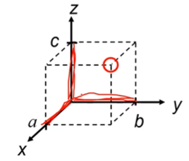
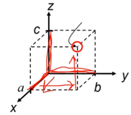
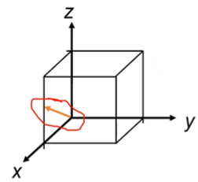
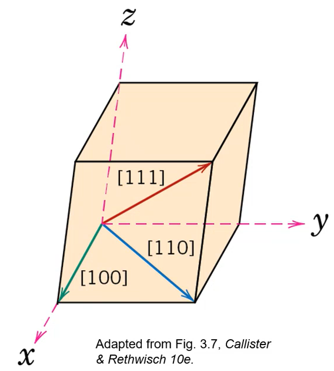
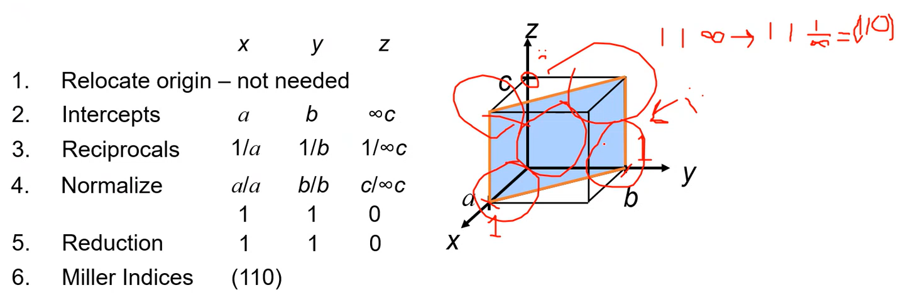
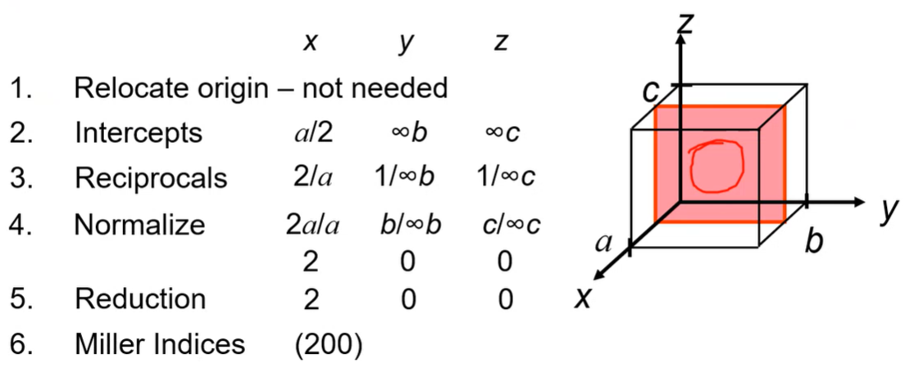
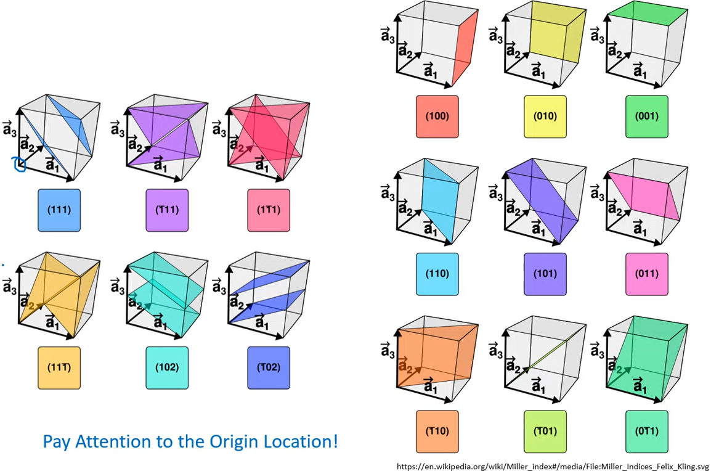
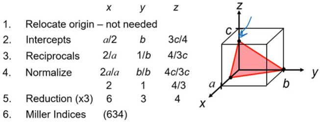
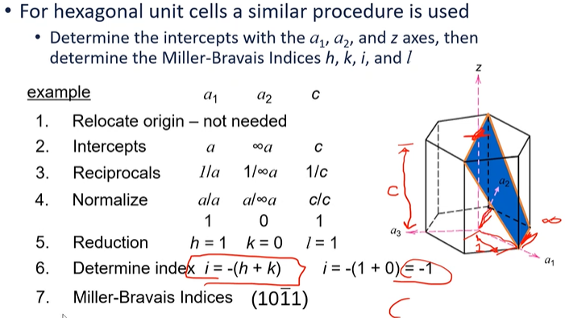
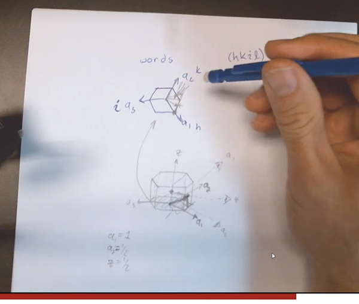

<!-- 210827 -->
# Miller Indices

A method of assigning coordinate values to #crystallographic lattice sites.
Used to identify specific points, directions, and planes or families of these.
Used to identify #crystallographic information.
Three ways to identify:

## 1) Point coordinates Algorithm
!!! note
    A lattice position with a #unit-cell and determined as fractional multiples of #unit-cell edge lengths.

|  |  |
|:--:|:--:|
| Determined as fractional multiples of #unit-cell edge lengths. |  |

1. Lattice position is a, b, c.
2. Divide by #unit-cell edge lengths and remove commas: $\frac{a}{a}\frac{b}{b}\frac{c}{c} = 111$

## 2) Crystallographic Directions Algorithm

!!! note
    Remember from calculus the #Tip-to-Tail-Method to find vector direction and length.

1. Determine coordinates of vector head and tail: $(x_{2}, y_{2}, z_{2})$ and $(x_{1}, y_{1}, z_{1})$, respectively.
2. Subtract tail coordinates from head coordinates.
3. Normalize this subtraction by lattice parameters of #unit-cell edge length: $\frac{x_{2} - x_{1}}{a}\frac{y_{2} - y_{1}}{b}\frac{z_{2} - z_{1}}{c}$.
4. Multiply to smallest integer values.
5. Enclose in square brackets with no commas: `[uvw]`.

!!! note
    Negative indices represented with overbars: $-4, 1, 2 \implies [\bar{4}12]$
    A *#family-of-directions* are #crystallographic equivalent (same atomic spacing) and indicated by angle brackets, `<>`.

|  |
|:--:|
| Common #crystallographic directions. |

## 3) Crystallographic Planes Algorithm
1. If plane passes through origin, establish a new origin in another #unit-cell.
2. Read off values of intercepts of plane (designated $A, B, C$) with $x, y, z$ axes in terms of $a, b, c$.
3. Take reciprocals of intercepts.
4. Normalize reciprocals by multiplying lattice parameters $a, b, c$.
5. Reduce to smallest integer values.
6. Enclose resulting indices in parentheses without commas: i.e. `(hkl)`.

|  |
|:--:|
| Resulting Miller Indices: (110). |
|  |
| Resulting Miller Indices: (200). |

!!! note
    A #family-of-planes cannot be reduced any simpler than LCM.
    Family may be parallel to other families and #planar-density may be equivalent, but #linear-density will vary.

|  |
|:--:|
| Pay attention to origin! |

|  |
|:--:|
| Resulting Miller Indices: (634). |

!!! note
    A *#family-of-planes* are #crystallographic equivalent (same #apf) and are indicated by indices in braces, `{}`.

<!-- 210830 -->

!!! example
    For #hcp, determine intercepts with $a_{1}, a_{2}$ and $z$ axes, then determine the Miller-Bravais indices $h, k, i, l$.
    |  |
    |:--:|
    | Resulting Miller Indices: $(10\bar{1}1)$.  |
    |  |
    | Projections are parallel to edge. |

    |  |
    | *#planar-density of Atoms*, $PD = \frac{\#~of~atoms~centered~on~plane}{area~of~plane}$. |