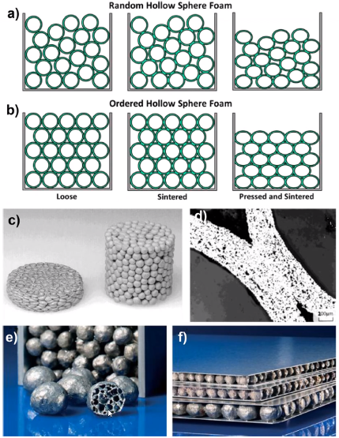
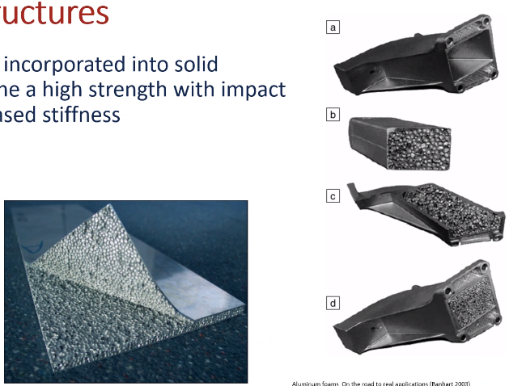

<!-- 211129 -->
# Porous Materials

## Objectives
- Introduce metal foams in general
- Highlight the diverse processing strategies and outcomes
- Determine the relevant modeling techniques for simplifying the structure
- Determine the behavior trends with changing density
- Discuss limitations of the treatments

## Introduction
Low density materials utilized for intrinsic properties or by introducing a low-density phase with a higher-density matrix.
Most often air or otherwise "empty" space is the second-phase, which provides little to no mechanical support.

## Metal Foams Overview
The mostly widely available metal foams are aluminum, and those are created through liquid-state forming (introducing gas into a liquid).
This can produce large sheets in low densities: meters across 10s of centimeters thick and $90\%$ porous.

## Solid State Foams
## 
## 

## Precursor Porosity
|  |
|:--:|
| The constituents of the structure already contain open space. |

## Composite Structures
|  |
|:--:|
| Metal foams can be incorporated into solid structures to combine a high strength with impact absorption or increased stiffness. |

## Mechanical Considerations
Initial density will affect the elasticity as well as plastic behavior.
Most notable among low-density metal foams is the plateau stress where the  #pores" collapse until a high density is achieved and it begins to behave as a solid material.
This makes metal foams particularly interesting for their energy absorption capabilities.

## Elasticity of Cellular Materials
Pores can be simplified to a series of interconnected beams, creating a 3D network.
When force is applied under compression, the force is carried by beam bending.
The beams are assumed to be of square cross-section and modeled by an end-loaded cantilever.

\eqalign_sans

The elastic modulus is reduced in square propoertion to the density:

\eqalign_sans