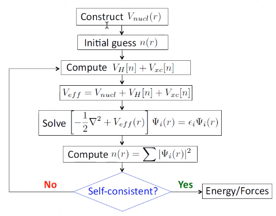
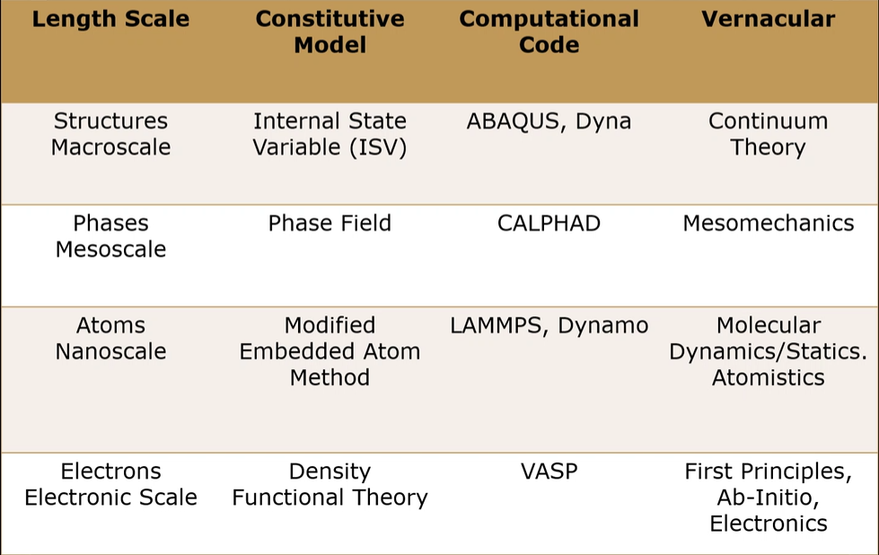

# ENGR 851-001: Integrated Computational Materials Engineering

!!! abstract Course Description
    Survey course of various length scale computational analysis related to materials modeling.
    Emphasis upon projects and exercises.

- [ENGR 851-001: Integrated Computational Materials Engineering](#engr-851-001-integrated-computational-materials-engineering)
  - [Course Introduction](#course-introduction)
  - [Multiscale Modeling](#multiscale-modeling)
  - [Constitutive Behavior Classification of Stress-Strain Response in Materials](#constitutive-behavior-classification-of-stress-strain-response-in-materials)
  - [Verification and Validation of Simulations (Uncertainty Analysis)](#verification-and-validation-of-simulations-uncertainty-analysis)
  - [Density Functional Theory](#density-functional-theory)
  - [MEAM](#meam)
  - [MPC Lab](#mpc-lab)
  - [Nanomechanics: Atomistic Modeling](#nanomechanics-atomistic-modeling)
  - [Dislocation Dynamics Methods](#dislocation-dynamics-methods)
  - [Crystal Plasticity](#crystal-plasticity)
  - [Macroscopic: ISV](#macroscopic-isv)
  - [Summary](#summary)


---


*Lecture: January 11, 2022*
## Course Introduction
This is Dr. Cho’s first time teaching this course, and he is still learning this first-hand so he will do his best.
This course is brand new to the university.

**Computing Challenges**
We have not yet had an HPC system for the department; therefore, we will tackle this as we go.
Dr. Tuzi has been teaching an HPC course and purchases small clusters.
We will utilize these clusters to use Quantum Espresso to solve simple dislocation dynamics and Lammps to solve molecular dynamics.
We can solve plasticity directly with a binary.
Abaqus will be installed (by Dr. Cho) directly to those clusters.

**Course Assignments**
There will be an individual project as related to your own research as possible.
We will discuss this later.
There will be 2 presentations: an introductory proposal and a final presentation of work completed.
This will generate a research project report.
Apply this ICME process to your research, choose a project that is a subset of that ICME outline that can be completed in this course, and, hopefully, publish the results of that work to a journal.

!!! attention Exams
    There will be no Mid-Term.

Feb. 1 will be project proposal presentation.
This is a formal presentation of what will be studied: what is your idea and scheme.
In this time, find your topic.
The project provides an overview of the length scales within the ICME framework; however, the project need only examine a sub-set of the ICME process.
The homeworks will cover all the length scales.
Look at those length scales likely most helpful for your research.

!!! example#Maria-Lee's research needs to find interfacial energy between grain boundaries.
    Therefore, she can do molecular dynamics and present found parameters into the phase-field theory (not covered in this course).
    Studying the molecular dynamics requires knowledge of the interatomic potential energy.
    This process can take an entire year; therefore, you could study a material for whom its properties are known to lay down the process before studying a new material.

!!! warning Semester Project
    Do not think too ambitious nor impossible.

**Course Objectives**
Students will learn to bridge length scales to process and understand computational tools to solve problems at these scales.
This means to bring information up from electrons, atoms, microns, hundreds of microns, mesoscale, and macroscale.
The material length scale observed varies its properties.
Macroscale length scale is affected by all length scales below it.

Some properties may be very important at a certain length scale but may disappear altogether at higher length scales.
The idea, then, is to integrated all this information from lower to higher length scales: e.g. plasticity, damage, or deformation.
The case studies given provide real world examples of the ICME process.

**Course Schedule**
Dr. Cho will teach us introductory Linux commands.
We may learn to apply the machine learning package for molecular dynamics.

!!! question What softwares do we need? <cite> Noel
    Dr. Cho will install many softwares on our HPC cluster that we, students, may use them.
    Quantum Espresso for DFT (electronic principles), LAMMPS for molecular dynamics, dislocation dynamics by MDDP, crystal plasticity with Abaqus and material model codes and ISV model.


## Multiscale Modeling
[[multiscale-modeling]]


---


*Lecture: January 13, 2022*


---


*Lecture: January 18, 2022*

!!! note VPN Access
    To access the cluster, we would have to hardwire in through a LAN port.
    There seems to be some confusion whether students are allowed VPN access.
    Dr. Tuzi informed Dr. Cho that students need a Liberty-owned machine or access via LAN.

!!! tip Class Attendance
    Physically attending is better for our education.


---


*Lecture: January 20, 2022*

!!! note Linux Lectures
    Dr. Tuzi will give a guest lecture to introduce working in the Linux operating system(s) schemes and basic understanding of working with remote clusters.

!!! info Required Softwares
    Quantum Espresso is free for Windows and Mac.
    We will also need MATLAB to use the MPC Calibration tool.
    LAMMPS is for molecular dynamics which can be installed on our local machines, but this will also be installed to the cluster for higher resolution simulations.
    We must install Abaqus on our own machine because installing to Linux cluster may not allow software **X** to visualize the data.


---


*Lecture: January 25, 2022*

!!! info Class Thursday (220125)
    Dr. Tuzi will be teaching during this time on high-performance computing and introduce Linux.

!!! info Computing Cluster
    Dr. Cho has decided to use Rescale instead of the local cluster because Rescale already has Abaqus and LAMMPS.


## Constitutive Behavior Classification of Stress-Strain Response in Materials
[[constitutive-behavior-classification-of-stress-strain-response-in-materials]]


---


*Lecture: February 01, 2022*
## Verification and Validation of Simulations (Uncertainty Analysis)
[[verification-and-validation-of-simulations-uncertainty-analysis]]


---


*Lecture: February 08, 2022*
## Density Functional Theory
[[density-functional-theory]]


---


*Lecture: February 10, 2022*

!!! note Homework 1
    Bring Ubuntu to next class to install Quantum Espresso.
    Dr. Cho will give Homework 1 after that.


---


*Lecture: February 15, 2022*

!!! example Looking at Quantum Espresso
    First, perform `sudo apt-get update`.
    Next, `sudo apt-get install build-essential`.
    Copy/paste the tar file to a working directory in virtual machine.
    Navigate to this directory and enter the command `tar -xzvf qeX.X.X.tar.gz` wherein the `X` represents the version number.
    `cd` into that extracted folder.
    Lastly, `./configure` then `make all`.

    To run:
    - set path to `pw.x` by: `cd ~ && gedit .bashrc && export PATH=/to/your/QE_bin/folder/: $PATH`
    - `source .bashrc`
    - `mkdir` and `cd` to a directory for testing the installation.
    - After locating the `Cu.in` and `Cu.UPF` input files, attempt to run: `pw.x -in Cu.in > Cu.out`
    - Simulation results are contained in `Cu.out` file.

!!! error If Build Error in `make` of Missing Directory
    Do not include space characters in directory names.
    Linux does not like this.

!!! error Floating-Point Errors
    This error is thrown from leftover divisions in calculations.
    This warning can be generally ignored.


---


*Lecture: February 17, 2022*

**Using Quantum Espresso**

!!! example [Inputs to Quantum Espresso](https://www.quantum-espresso.org/Doc/INPUT_CP.html)
    Typically, the outline a simple input file will look like
    ```
     &control
        calculation = 'scf',
        prefix = 'Si_exc1',
     /
     &system
        ibrav = 2,
        celldm(1) = 10.26,
        nat = 2,
        ntyp = 1,
        ecutwfc = 20
     /
     &electrons
        mixing_beta = 0.7
     /
    ATOMIC_SPECIES
     Si 28.086 Si.pbe-rrkj.UPF
    ATOMIC_POSITIONS (alat)
     Si 0.0 0.0 0.0
     Si 0.25 0.25 0.25
    K_POINTS (automatic)
     6 6 6 1 1 1
    ```

    |  |
    |:--:|
    | Iterative solution of KS equations <a href="#eq-kohn_sham_potential">Eq. 5-10</a>. |

    Explanation of basic parameters
    1. `ibrav`: type of crystal structure
    2. `celldm(1)`
    3. `nat`: number of atoms
    4. `ntyp`: number of typical atoms (referred to in `ATOMIC_SPECIES` section)
    5. `ecutwfc`: cutoff energy [$1 Ry = 13.6057 eV$]
    6. `ATOMIC_SPECIES`: contains the element, its atomic weight, and path to input file
    7. `ATOMIC_POSITION`: (alat, bohr, angstrom, crystal)

    Typically, a cutoff density, `ecutrho`, must also be provided for ultrasoft pseudopotentials.

!!! info Homework 1
    Dr. Cho will upload the homework tonight.
    The problem may not ask for it, but be sure to include k-point refinement.

!!! example Playing with Dr. Cho's input files
    `Cu.in`:
    ```
    &control
        prefix=''
        outdir='temp'
        pseudo_dir = '.',
    /
    &system
        ibrav=  2, celldm(1) =6.824, nat=  1, ntyp=  1,
        ecutwfc =30.0,
        occupations='smearing', smearing='mp', degauss=0.06
    /
    &electrons
    /
    ATOMIC_SPECIES
    Cu  63.546 Cu.upf
    ATOMIC_POSITIONS
    Cu 0.00 0.00 0.00
    K_POINTS automatic
    8 8 8 0 0 0
    ```

    From the terminal in the working directory, execute: `pw.x < Cu.in > Cu.out` To use the information from the `Cu.out` file, an energy-volume curve is needed.
    The optimal lattice parameter occurs at the minimum of this curve; therefore, this curve is the calibration for the input file.
    The `ev_curve` shell runs the `evfit.f`, which is Fortran code, file and Quantum Espresso.
    This fits the DFT curve to the lattice parameter points with some equations of state: Birch (1 and 2 order), Mumagham (4 order), and BM.
    The BM equations of state are more popular.

    Compile the `evfit.f` file by: `gfortran -O2 evfit.f -o evfit`.
    *Ignore the warnings.* This output `ev_curve` file is not yet executable; therefore, `chmod +x ev_curve`.
    Copy the input file to the appropriate filename to be read by `ev_curve`: `cp Cu.in fcc.ev.in`.
    Now we are ready to run: `./ev_curve fcc 3.628`.
    *Ignore the `rm` commands on first runs: this removes previous output files.* Within the `evfit.4` file, the `K0` is the bulk modulus at equilibrium.
    Now execute the Python script to plot the output data: `python3 EvA_EvV_plot.py`.
    The `energy_offset = 2858.8298734` variable is a correction factor intrinsic to the data which was  ≈  − 6000 and now is  ≈  − 3000.
    Dr. Cho does not remember why this correction factor is included, but he will find out.


## MEAM
[[meam]]


---


*Lecture: February 24, 2022*

!!! info Homework 1
    We have already performed the first part for DFT calculations.
    Today, we are looking at plotting the generalized stacking fault energy and calculating MEAM potentials.
    Next week, we will have another lab to install and use MPC to solve MEAM potentials.
    Of the two groups (FCC or BCC), we can work together to solve the problem; however, we each submit our own report.
    Make your own channel in Teams because our records will inform the next class instruction.

!!! example Plotting GSFE Curves
    [In Linux, ensure use of Python 2:](https://linuxize.com/post/how-to-install-pip-on-ubuntu-20.04/)
    - `sudo add-apt-respository universe`
    - `sudo apt update`
    - `sudo apt install python2`
    - `sudo apt install curl`
    - `curl https://bootstrap.pypa.io/pip/2.7/get-pip.py --output get-pip.py`
    - `sudo python2 get-pip.py`
    - `pip2 --version`
    - `pip2 install numpy`
    - Navigate to the working directory with the `gsfe_curve.py` and open with `gedit`
    - Once satisfied, execute: `python2 gsfe_curve.py fcc 3.615 partial &` which is the crystal structure, lattice parameter $a [\AA]$, what type of block motion.

    Because `bcc` has three direction options, Dr. Cho recommends to stick to the `'full'` direction.


---


*Lecture: March 01, 2022*

!!! attention Homework 1 Materials
    Dr. Cho is changing aluminum to nickel because of excess of existing data. Team iron (bcc) will be comprised of Joby, Noel,#Daniel-Kenney, and#Maria-Lee.


---


*Lecture: March 03, 2022*
## MPC Lab
**Installing**
Unzip the `MPCv4.zip` and `MPCv4_Win7_MATLAB_R2016b_Installer_web.zip` folders into some working directory.
In the `MPCv4_Win7_MATLAB_R2016b_Installer_web` folder, execute `MPCv4_Win7_MATLAB_R2016b_Installer_web.exe`, hit next, and use `C:\MPCv4` as the directory.
Leave the MATLAB Runtime default as set, accept the EULA, and install.

**Testing**
Navigate to `C:\MPCv4\application` and launch the `MPCv4.exe` as *Administrator*.
Ignore the "No MEAM Library" warning and go to "File>MEAM Library" to load the `C:\MPCv4\application\library.meam` file.
Any `*.meam` library file is possible.
New meam potentials can be loaded here.
The first hump in the pink curve is dislocation-based and the second is twinning.


---


*Lecture: March 08, 2022*
## Nanomechanics: Atomistic Modeling
[[nanomechanics-atomistic-modeling]]

!!! tip Homework 1
    Individual reports can be written succintly to avoid repetition.


## Dislocation Dynamics Methods
#dislocation-dynamics-methods


---


*Lecture: March 29, 2022*

!!! example LAMMPS on Rescale Lab
    From Linux terminal, run `ssh-keygen` and hit `Enter` until completed.
    Navigate to `~/.ssh/id_rsa.pub` and copy all the contents.
    Paste this into Rescale "User Profile Settings/Job Settings".
    Change the Transfer type from "Basic" to "Enhanced", leave the port to the default 22, and change Access REstriction to Everywhere.
    Push Save.

    Create a New Job.
    Select the appropriate project.
    Upload "library.meam", "DisVelocity.in", "Dislocation.f90", "Cu.meam", and "Cu.compress.Size3.in".
    Add the 29Oct2020 (AMD) and change all the command terminal to `sleep inf` Add the GCC software with the same command terminal `sleep inf` Change the Hardware settings to Jasper to 60 cores for 1 node on Priority Economy for 24 hrs walltime.
    Submit.

    Navigate to OVITO to download Ovito basic onto Linux.
    The pro version includes a python script to get the dislocation velocities very easily; however, we must do this manually in the basic version.

    Once the job has finished starting up the cluster, copy the ssh command and paste into a terminal.
    Now you are on the Rescale cluster according to job id.
    `cd ~/work/shared`


---


*Lecture: March 31, 2022*

!!! example LAMMPS on Rescale Lab (Part 2)
    Clone the previous job but replace the input files as appropriate.
    `ssh` onto cluster.

    **`Dislocation.f90` is a Fortran file to create atom shape in plane and apply some shear forces onto the plane.**

    Do not need to change anything in this program.
    This creates the `atoms.fcc.edge.pad` file which is named according to reference structure and dislocation type: edge or screw.
    This file has the atomic positions according to crystal structure.

    **`DisVelocity.in` is the LAMMPS input file.**
    This does a relaxation , equilirbataiont, and deformation (sehar) simulations.
    `initTemp` is 300K.
    `sigma` is in bar.
    `atom_file` uses as input the output file from the `Dislocation.f90` code.
    `equilTime` is 10,000 ps and `runTime` is 100,000 ps.

    **Compiling the Fortran code**
    Execute `gfortran -O3 Dislocation.f90 -o atom-dislocation`.
    Execute `` ./atom-dislocation 1 2 ` for FCC and Cu.
    On the command line, enter `40 20 2 `` for the number of atoms in plane and stacking layers.
    `1` for edge dislocation.
    Ignore `Fortran runtime error`.
    Execute `nohup mpirun -np 50 lmp_rescale-amd-userlib -in DisVelocity.in &`.
    `tail -f nohup.out`.

    When finished, exit the Rescale cluster: `exit`.
    Navigate to working folder on local machine.
    Copy the shell command from the Rescale cluster and replace with `scp` with `:~/work/shared/dump.* .` at the end.
    This copies `dump.*` files from the Rescale cluster to local, working directory.

    **Opening OVITO**
    "Load file" and select the `dump.shear.unwrap` file.
    Select the Centrosymmetry modification with color coding.
    Add the polyhedral modifier.
    Add in modifications the expression selection and input the following Boolean: `StructureType != 1 && StructureType != 0`.
    Delete selected.
    Copy/paste the time-based position of the dislocation particles by adding a modification onto the polyhedral atoms to compute some property which is "Time" to compute for only selected atoms for `Timestep` in the expression.

    **LibreOfficeCalc (Microsoft Excel)**
    Copy/paste the appropriate columns at each timestep into Excel.
    Use the average x-position at each timestep to calculate the dislocation kinematics.
    These are still in $\AA$.

    **Download contents of MDDP folder from Teams.**
    Go into the "Examples" folder.
    "(M/S)FRS" = multiple/single FRS and copy/paste that into the "Windows" folder.
    Also copy/paste `datain` file to this folder from Teams.
    This "Windows" folder is the working directory for the executables contained therein.
    Modify the `datain` file as necessary.
    Execute either the `fcc.exe` or `bcc.exe` and enter input arguments as appropriate.
    The MDDP manual describes all these inputs.
    `sidex`, y and z must be same numbers for cell size as in `datain` file.
    Run `mddp08.exe` and allow for this to run for some time.
    The resulting stress-strain curve provides the hardening coefficient for the next length scale up.


---


*Lecture: April 05, 2022*
## Crystal Plasticity
[[crystal-plasticity]]

!!! note Homework 2
    Run LAMMPS (molecular dynamics) on MEAM potential that we had fit from the last homework.
    Last lab, we saw how to find the dislocation velocity using Ovito.
    From this dislocation velocity, use Fig. 9.7 and Eq. 9.2 from the ICME textbook Dr. Cho had shared to find the drag coefficient.
    This drag coefficient is used in dislocation dynamics.
    This MDDP simulation of a single FRS can generate a stress-strain curve from the MEAM potential and drag coefficient.
    We must show the FRS animating using [Tecplot](https://www.tecplot.com/products/tecplot-360/free-trial-software/).

    All this information is eventually used in crystal plasticity in Abaqus codes which is the third homework and today’s lecture.
    That will look at single crystal stress-strain behaviors which gets expanded into the convoluted polycrystal behavior which is captured in the ISV codes.


---


*Lecture: April 07, 2022*


---


*Lecture: April 12, 2022*

!!! attention Class Announcements
    Too much remains in the course to complete the Final Research Projects; therefore, write a Literature Review of your topic.
    There will some extra credit given to any research effort actually completed.
    **Do not be perfect!** Simply focus on the elements that should be included into a journal.

    Submit Homework 1 by end of this week.
    Homework 2 should be turned in as soon as possible.
    These first two were not supposed to be so involved.
    The third homework will naturally be due before the final.

!!! example CPFEM Lab
    Starting Rescale in VM, upload all the input files except for the PDF.
    Select Abaqus 2020 Golden (FlexNet Licensing) in Software Settings.
    In license tab: `27000@10.253.128.57`.
    In command tab: `sleep inf` and uncheck the "Validate Command" box.
    Select one or two Amber processors.
    Submit the "Basic" job.

    `umat_xtal.f` is a Fortran subroutine to define user material model properties because the Abaqus default behavior is not very accurate.
    Abaqus solves virtual work equilibrium equation.
    The constitutive equation solves for stress-strain relationship: e.g. such as in ISV codes.
    `vumat` is the same thing, but for explicit Abaqus problems.

    `texture.txti` defines the initial texture and orientations of the grains.
    `fcc.sx` defines the slip systems within fcc and finds orientation matrix for calculations which also includes the twin directions.
    `test.xtali` defines the structure and how many orientations for grains to use in the simulation.
    `params_xtal.inc` includes various, other parameters which assume 3D structure by default.
    `numbers.inc` includes other constants used in `(v)umats`.

    Copy/paste the "Copy SSH Command" into terminal.
    `cd ~/work/shared/`.
    `mkdir ./tension`.
    `cp .
    ./tension/` (This copies only files within the directory and not other directories).
    `cd tension/`.
    `nano rev.single.inp`.

    Within `rev.single.inp`: `incrmt` is number of discrete points; `rate` is decimal form of $10^{n}$; `strain` is total times of elongation.
    Change these last two to negative for compression tests.
    The convention for comments is `*` at the beginning of the line and `</emphasis>` defines a boundary followed by that boundary’s value.

    Within the `umat` file, change the `filePath` to the current working directory: `pwd`.
    Near the end of the file, change `RATE` to the same as in the Abaqus input file.

    `abaqus job=icme.cpfem.single.tension input=rve.single.inp user=umat_xtal.f cpus=2 double`.
    "standard" at top of `top` is the Abaqus job.
    `tail -f icme.cpfem.single.tension.sta`.
    Abaqus output is `*.odb` file.
    Visualize this in Abaqus on your local machine.
    `texture.txto` has the texture after deformation and its pole figure can be visualized using `MTEX` which is a MATLAB program (this will take time).


---


*Lecture: April 14, 2022*
## Macroscopic: ISV
[[macroscopic-isv]]


---


*Lecture: April 19, 2022*

!!! info Homework 3
    Homework 2 gives you the kinematic hardening coefficients.
    This can be used to generate stress-strain curves for tension, compression, and shear directions.


---


*Lecture: April 21, 2022*

!!! attention Final Exam
    May ## @ 10:30-12:30.
    If you can do the homeworks, then you can do the Final Exam.
    There will be no math solved, but be able to answer the concepts at each length scale and the key equation to be solved.
    Be able to do the homeworks.


---


*Lecture: April 26, 2022*

!!! info Final Thoughts
    Keep the homeworks to less than 2500 words.
    Do the homeworks to study for the exam.
    The exam will include NO calculations.
    Review the slides.
    Refer to article guidelines for homeworks and final project literature review.
    This literature review is due May 8 and should be in the format of a target journal of your choice.


## Summary
**Six Advantages of Employing ICME in Design**
1. ICME can reduce the product development time by alleviating costly trial-and-error physical design iterations (design cycles) and facilitate far more cost-effective virtual design optimization.
2. ICME can reduce product costs through innovations in material, product, and process designs.
3. ICME can reduce the number of costly large systems scale experiments.
4. ICME can increase product quality and performance by providing more accurate predictions of response to design loads.
5. ICME can help develop new materials.
6. ICME can help medical practice in making diagnostic…​

**Eight Guidelines for Multiscale Bridging**
Always move from higher to lower length scales: downscale first.
Then bring key information up the length scales.
The whole purpose of this approach is to collect experimental data without the physical experiment.

|  |
|:--:|
| We used Quantum Espresso instead of VASP because of price. This is a few angstroms. We move up to nanoscale, which is hundreds of angstroms wherein we used MEAM potentials. Dislocation dyanmics and micronscale. Mesoscale is multiple grains. And ISV at macroscale. |