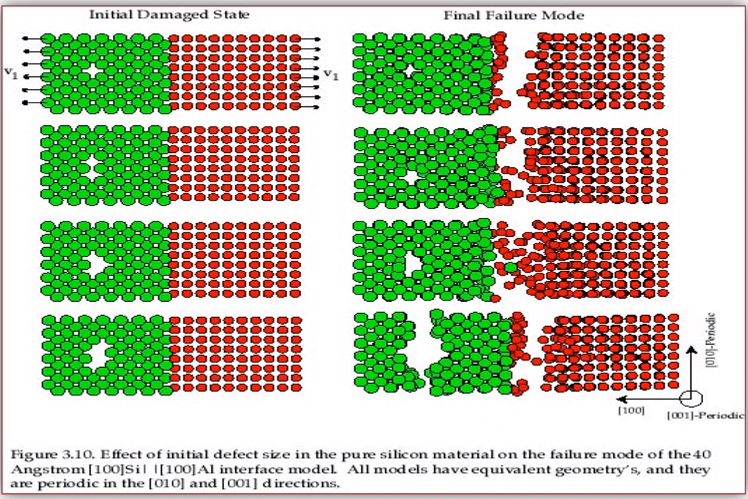
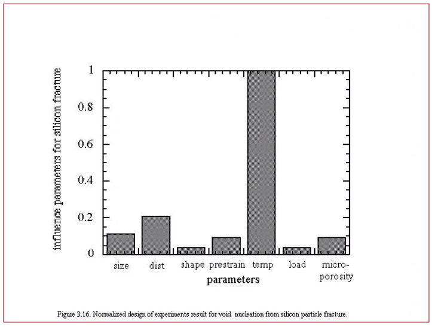
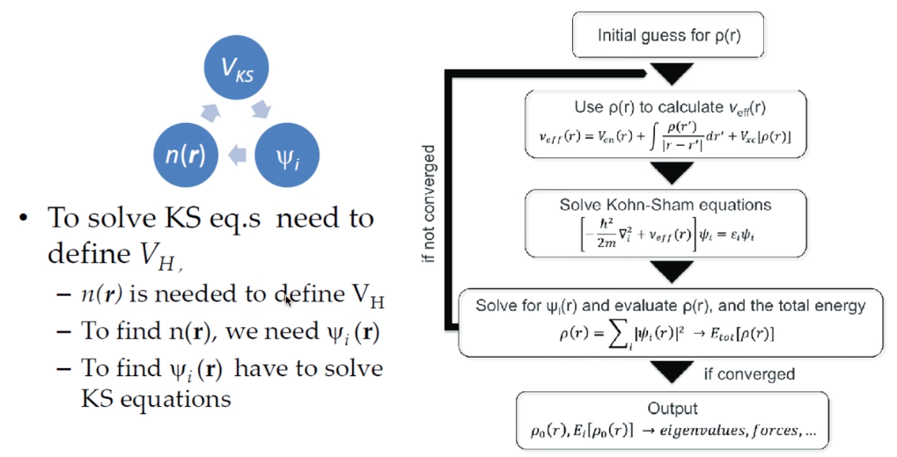
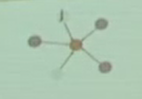
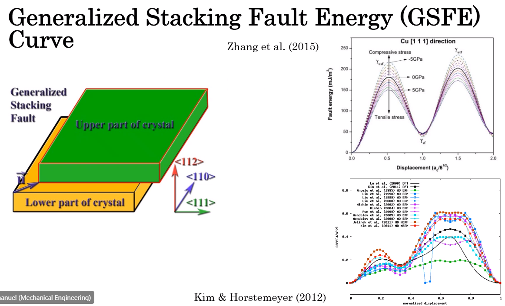
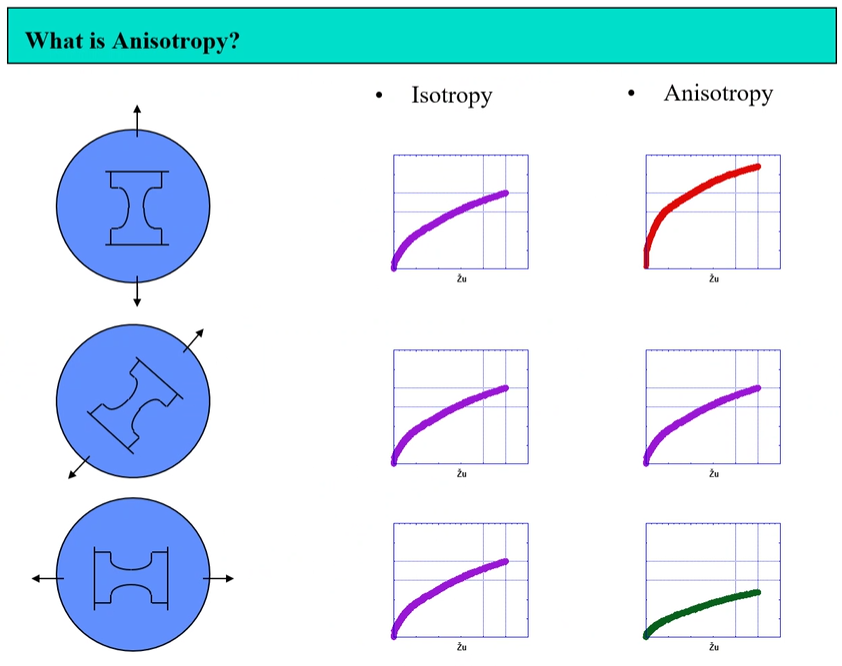

# ENGR 851-001: Integrated Computational Materials Engineering

Description:
> Survey course of various length scale computational analysis related to materials modeling. Emphasis upon projects and exercises.

Abstract: Survey course of various length scale computational analysis related to materials modeling. Emphasis upon projects and exercises.

*Lecture: January 11, 2022*

# Course Introduction

This is Dr. Cho’s first time teaching this course, and he is still learning this first-hand so he will do his best.

## Syllabus

This course is brand new to the university.

**Computing Challenges**

We have not yet had an HPC system for the department; therefore, we will tackle this as we go. Dr. Tuzi has been teaching an HPC course and purchases small clusters. We will utilize these clusters to use Quantum Espresso to solve simple dislocation dynamics and Lammps to solve molecular dynamics. We can solve plasticity directly with a binary. Abaqus will be installed (by Dr. Cho) directly to those clusters.

**Course Assignments**

There will be an individual project as related to your own research as possible. We will discuss this later. There will be 2 presentations: an introductory proposal and a final presentation of work completed. This will generate a research project report. Apply this ICME process to your research, choose a project that is a subset of that ICME outline that can be completed in this course, and, hopefully, publish the results of that work to a journal.

Exams

There will be no Mid-Term.

Feb. 1 will be project proposal presentation. This is a formal presentation of what will be studied: what is your idea and scheme. In this time, find your topic. The project provides an overview of the length scales within the ICME framework; however, the project need only examine a sub-set of the ICME process. The homeworks will cover all the length scales. Look at those length scales likely most helpful for your research.

Therefore, she can do molecular dynamics and present found parameters into the phase-field theory (not covered in this course). Studying the molecular dynamics requires knowledge of the interatomic potential energy. This process can take an entire year; therefore, you could study a material for whom its properties are known to lay down the process before studying a new material.

Semester Project

Do not think too ambitious nor impossible.

**Course Objectives**

Students will learn to bridge length scales to process and understand computational tools to solve problems at these scales. This means to bring information up from electrons, atoms, microns, hundreds of microns, mesoscale, and macroscale. The material length scale observed varies its properties. Macroscale length scale is affected by all length scales below it.

Some properties may be very important at a certain length scale but may disappear altogether at higher length scales. The idea, then, is to integrated all this information from lower to higher length scales: e.g. plasticity, damage, or deformation. The case studies given provide real world examples of the ICME process.

**Course Schedule**

Dr. Cho will teach us introductory Linux commands. We may learn to apply the machine learning package for molecular dynamics.

**Q:** What softwares do we need?

**A:**  — Noel A. Dr. Cho will install many softwares on our HPC cluster that we, students, may use them. Quantum Espresso for DFT (electronic principles), LAMMPS for molecular dynamics, dislocation dynamics by MDDP, crystal plasticity with Abaqus and material model codes and ISV model.

# Multiscale Modeling

Much of this class material has been developed by Dr. Horstemeyer himself.

ICME  
Integrated Computational Materials Engineering

1.  Simulation-based design affords virtual optimization instead of many, costly, physical design iterations by trial-and-error.

2.  ICME can reduce product costs through innovation in material, product, and process designs.

3.  ICME can reduce number of costly, large-scale systems experiments.

4.  ICME can increase product quality and performance by providing more accurate predictions of response to design loads.

5.  ICME can help develop new materials.

6.  ICME can help medical practice in making diagnostic and prognostic evaluations related to the human body.

<figure><figcaption aria-hidden="true">This is the ICME diagram. Our proposal should include a similar depiction of our project.</figcaption></figure>

The ISV codes are based in physics. At the electronic (angstrom) level, we can find the elastic moduli with DFT calculations: i.e. with Quantum Espresso. Atomistics can find the interatomic energy potentials: i.e. found with MEAM by LAMMPS. Molecular dynamics can find mobility—​i.e. dislocation mobility—​which varies for each material to solve dislocation dynamics by MDDP codes. Microscopic motion for dislocation motions and their interactions which work-hardens the material by pinning dislocations: solved by hardening rules and parameters in ISV. This bridges up to crystal plasticity which requires these hardening parameters within ISV codes to capture grain orientation, slip system interactions, texture, etcetera of polycrystalline materials to build stress-strain behavior curves. Particle-void interactions can be implemented in ISV-damage model with elastic moduli and interfacial energies found at lower length-scales.

If problem is about deformation and damage, then you need ISV model. Homeworks will require ISV. Otherwise, ISV is not needed.

Finally, continuum calculations with ISV codes in softwares—​such as Abaqus—​can run the appropriate simulations according to the prescribed boundary conditions.

1.  Downscaling and upscaling: only use the minimum required degree(s) of freedom necessary for the type of problem considered.

2.  Downscaling and upscaling: energy consistency between the scales.

3.  Downscaling and upsaling: verify the numerical model’s implementation before starting calculations.

4.  Downscaling: start with downscaling before upscaling to help make clear the final goal, requirements, and constraints at the highest length scales.

5.  Downscaling: find the pertinent variable and associated equation(s) to be the repository of the structure-property relationship from sub-scale information.

6.  Upscaling: find the pertinent "effect" for the next higher scale by applying ANOVA methods.

7.  Upscaling: validate the "effect" by an experiment before using it in the next higher length-scale.

8.  Upscaling: quantify the uncertainty (error) bands (upper and lower values) of the particular "effect" before using it in the next higher length-scale, and then use those limits to help determine the "effects" at the next higher length-scale.

<figure><figcaption aria-hidden="true">We need to find the parameters required for the problem and look to lower length-scales to provide the information.</figcaption></figure>

<figure><figcaption aria-hidden="true">Design options (variables) are defined for some product: e.g. material, geometry, boundary conditions, etcetera. Observing behaviors at the highest length-scales requires knowledge of behavior and uncertainty at the lower length-scales. Find the optimal variables according to design objectives and constraints.</figcaption></figure>

*Lecture: January 13, 2022*

Structure  
In materials science, this could be dislocations, textures, twins, recrystallization, etcetera.

Properties  
Stress, hardness, strain, etcetera. COMETMAN

Using understanding of processing some chemistry to make certain structure yields some properties to deliver certain performance of material. Within some limitations, we can validate atomistic simulations of models for greater confidence of phenomenological behaviors at higher length scales. The ICME paradigm allows us to use information from lower length scales at higher ones by minimizing the number of computations required to model actual behavior of every atom within an FEA simulation.

**Hierarchial Structure Leads to Hierarchial Multiscale Modeling**

ICME can be used to study almost any solid-state materials. This course should give us the understanding to study our own material topic.

**Atomic Defect Accumulation**

Hardened materials will increase in density and damage will accumulate. Eventually, after the maximum stress, necking and ultimate fracture will occur.

ISV  
Internal State Variables (somtimes called constitutive model) are inherent variable, such as change in energy under deformation, unable to be derived. Temperature or stress in a material might be obsverved under deformation, but certain things within material should also be considered: such as void damage.

Dr. Horstemeyer was responsible to formulate the damage kinetics in this model; wherein, fracture occurs at an upper limit of a rapidly increasing volume fraction. The ISV variable of interest could be damage, volume fraction of free volume, etcetera.

-   Stress is inversely propoertional to Burger’s vector (Frank, Nabarro), $\\sigma \\propto \\frac{1}{\\vec{b}}$

-   Diffusion rate, $e \\propto \\frac{1}{d^{2}}$

-   Hall-Petch Effect, $\\sigma = \\frac{K}{\\sqrt{d}}$

-   Dislocation density (Ashby), *r*…

-   Dislocation bowing (Frank-Read Source), $T = \\frac{G\\vec{b}}{L - 2r}$

-   Geometrically necessary boundary spacing decreases with applied strain

-   Strain gradients reflect length scales in plasticity

-   Yield…​

<figure><figcaption aria-hidden="true">Certain length scale effects become negligible or decrease for higher length scales.</figcaption></figure>

## Case Studies

If we know the history of a material, we can predict near-future performance.

<figure><figcaption aria-hidden="true">Baumann’s ISV model can capture the changing boundary conditions of the same specimen when strained at 800∘<em>C</em> up to some deformation, stopped, and further strained under 20∘<em>C</em>. Conventional models cannot fit this experimental data, but ISV can.</figcaption></figure>

Integrated Computational Materials Engineering

ICME starts with requirements at highest length scales. After downscaling these requirements down to lower length scales, those results are upscaled to higher length scales for validation by experiment.

<figure><figcaption aria-hidden="true">Make this slide as your project proposal and abstract and emphasize which parts your work will focus on.</figcaption></figure>

<figure><figcaption aria-hidden="true">This is Dr. Cho’s own ICME chart for his mantle convection problem.</figcaption></figure>

### Modeling Steel Molding and Stamping

<figure><figcaption aria-hidden="true">The purpose of ICME is to do the modeling without experimental data at every stage in the process.</figcaption></figure>

For example, Julian could do **Molecular Dynamic** calculations for oxide reduction in copper foams without experimental data which is almost non-existent throughout literature. **Density Functional Theory** is one such a tool to simplify the number of calculations from 1023 atoms and their interactions to the excited state of ground electrons as visualized through some dense field in the *Schrodinger* equation.

*Lecture: January 18, 2022*

When we have the requirements for energies and elastic moduli of Al, then we can look down to the *Electronics* scale with DFT simulations of Al to determine how that length scale affects the properties of interest. First principles calculations do not require external parameters and are self-contained.

**Schrodinger Equation (1926)**

Famous partial differential equations (PDE) to solve wave equation.

$$\\begin{equation}
i\\hbar\\frac{\\partial\\Psi}{\\partial t} = -\\frac{\\hbar^{2}}{2m}{\\partial^{2} \\Psi}{\\partial x^{2}} + V\\Psi,
\\end{equation}$$

where $\\hbar = \\frac{h^{2}}{2\\pi} = 1.054572e-34~J-s$

**Molecular Dynamics**

Calculates the thermal fluctations of the atoms to find the bond strength and interfacial energies between atoms. Approximating these behaviors at higher length scales minimizes the number of calculations needed to perform down from *n**A*, where *A* is Avagaddro’s Number. By applying external loading and boundary conditions, dislocation dynamics (MDDP) can observed dislocation mobility where MEAM governs material behavior.

$$\\begin{equation}
E = \\sum\_{i}F^{i}\\bigg(\\sum\_{j \\neq i}\\rho^{i}(r^{ij})\\bigg) + \\frac{1}{2}\\sum\_{ij}\\phi^{ij}(r^{ij}),
\\end{equation}$$

where *F**i* is the embedding energy of atom, *i*; *ρ**i* is the electronic density of atom *i*; *r**i**j* is separation distance between atom *i* and *j*; and, *ϕ**i**j* is the pair potential of atom *i* and *j*. These simulations only last a few femtoseconds; therefore, pick a strain-rate you can actually solve!

$$\\begin{equation}
\\begin{split}
E &= \\sum\_{\\alpha}\\Big( F(\\bar{\\rho\_{\\alpha}}) + \\frac{1}{2}\\sum\_{\\gamma \\neq \\alpha}\\big(\\phi(r^{\\alpha\\gamma})\\big) \\Big) \\\\
f^{\\alpha} &= -\\nabla\_{\\alpha}E \\\\
\\beta\_{ij}^{\\alpha} &= -\\frac{1}{v}(mv\_{i}v\_{j})^{\\alpha} - \\frac{1}{2V}\\sum\_{\\gamma \\neq \\alpha}r^{ij}f\_{j}^{\\alpha\\gamma} \\\\
\\bar{\\rho\_{\\alpha}} &= \\rho\_{\\text{free surfaces}} + \\rho\_{\\text{shear}} + \\rho\_{\\text{crystal asymmetry}}
\\end{split}
\\end{equation}$$

**Comparison of DFT and MEAM**

Many potentials of pure materials have been found so you do not need to discover them. However, we will still perform these calculations as an exercise for the homeworks. **Finding these MEAM parameters to fit the DFT data can take up to 6 months.**

<figure><figcaption aria-hidden="true">Comparison of DFT and MEAM parameters for Al.</figcaption></figure>

The required parameter is dislocation mobility in dislocation dynamics. E.g. we can find hardening parameters within single crystals. These calculations can also handle point defects and vacancies.

<figure><figcaption aria-hidden="true">We use the steady-state behavior in the forest <em>α</em> at higher length-scales.</figcaption></figure>

Critical Resolved Shear Stress (CRSS)  
The minimum stress required to cause slip within a crystal.

Each grain has its own orientation (CRSS) that must interact with other crystals. The *Crystal Plasticity* calculations approximate these interactions at the **Macroscale**.

<figure><figcaption aria-hidden="true"><em>Crystal Plasticity</em> codes well captured the experimental behavior which validates the codes.</figcaption></figure>

Now we can upscale from the **Microscale** *Crystal Plasticity* calculations up to the **Macroscale** *Continuum* level. This later produces the ISV-model parameters.

VPN Access

To access the cluster, we would have to hardwire in through a LAN port. There seems to be some confusion whether students are allowed VPN access. Dr. Tuzi informed Dr. Cho that students need a Liberty-owned machine or access via LAN.

Class Attendance

Physically attending is better for our education.

*Lecture: January 20, 2022*

Linux Lectures

Dr. Tuzi will give a guest lecture to introduce working in the Linux operating system(s) schemes and basic understanding of working with remote clusters.

Required Softwares

Quantum Espresso is free for Windows and Mac. We will also need MATLAB to use the MPC Calibration tool. LAMMPS is for molecular dynamics which can be installed on our local machines, but this will also be installed to the cluster for higher resolution simulations. We must install Abaqus on our own machine because installing to Linux cluster may not allow software **X** to visualize the data.

<figure><figcaption aria-hidden="true">Polycrstalline CP calculations with 180 grains with the four DD constant sets using the volume average. The strain of these polycrystalline materials is afforded by the grains slipping past each other.</figcaption></figure>

The *Critical Resolved Shear Stress* (CRSS) in polycrystalline materials vary with each grain and their orientation with respect to the applied loading and neighboring grains. Single crystals do not have this limitation to allow deformation. The **Inelasticity** class will focus on the constitutive equations for this deformation in the ISV paradigm. In the damage-sensitive ISV model, damage increases as deformation increasing by tracking the increasing volume fraction of void free surface. After calibrating the constants in the ISV model, we can move up to the **Mesoscale** *Continuum* scale.

<figure><figcaption aria-hidden="true">Our proposal should follow a process similar to this and generate a similar graph.</figcaption></figure>

## Integrated Physical Motivations for Modeling Pore/Void Coalescence in Ductil Materials: A Multiscale Fracture Approach

### Introduction

<figure><figcaption aria-hidden="true">Point C had the most void inclusions and was predicted to fail there before examining through ISV to determine failure actually occurs at point A with most damage.</figcaption></figure>

<figure><figcaption aria-hidden="true">This process was performed by Dr. Horstemeyer.</figcaption></figure>

Voids easily nucleate at interfaces between matrix and secondary phases. This happens by debonding between matrix and second phase particle. This can also happen by the second phase particles fracturing. Damage increases with more abundant voids and larger voids. Voids coalesce when within a certain distance to each other when they reach a critical size.

-   Electronc Principles: gave bi-material elastic interfacial energy and moduli

-   Atomistic: gave critical stress for interface debonding

-   Microscale: gave temperature dependence on void-crack nucleation and microstructural morphological effects such as particle size, shape, and spacing

-   …​

<figure><figcaption aria-hidden="true">Debonding begins to occur between bi-material structures at sufficient strains.</figcaption></figure>

<figure><figcaption aria-hidden="true">If given an initial void in the silicon, then the failure mode can be tracked given some strain rate. Failure occurs at the interface.</figcaption></figure>

<figure><figcaption aria-hidden="true">If the void is put in the aluminum, then failure occurs in the aluminum.</figcaption></figure>

<figure><figcaption aria-hidden="true">By playing with various configurations of void geometry and relation within some material of varying temperatures, temperature was found to be the most important parameter. From this, lower temperature means increased void nucleation and higher temperatures increase the void coalescence.</figcaption></figure>

**Q:** If two identical cars were made in Alaska and Arizona and are later driven to the other location, then which car fails first? The Alaska to Arizona or the Arizona to Alaska? --Dr. Cho

**A:** The Alaska to Arizona fails first for quickly nucleating voids in the lower temperatures and then coalescing them at elevated temperatures.

*Lecture: January 25, 2022*

Class Thursday (220125)

Dr. Tuzi will be teaching during this time on high-performance computing and introduce Linux.

Computing Cluster

Dr. Cho has decided to use Rescale instead of the local cluster because Rescale already has Abaqus and LAMMPS.

### Physical Observations of Ductile Fracture and the Role of Pore/Void Coalescence

1.  Void Nucleation

2.  Void Growth

3.  Void Coalescence

Each of these mechanisms are accounted for in the ISV codes. The purpose of numerical experiments at the lower length scales was to determine which of these mechanisms dominated and what allowed that mechanism to do so. After voids nucleate, they coalesce together by "bonding" shear bands once grown to a critical size and in close proximity to other voids.

Triaxiality  
The ratio between the hydrostatic and deviatoric stresses.

# Constitutive Behavior Classification of Stress-Strain Response in Materials

## Elastic

**Q:** Why do we need the elastic behavior? — Dr. Cho

**A:** The main laws of physics and equations are not always well represented in codes. Therefore, encoded equations need some correction parameter. For example, Dr. Cho had to quantify the viscosity of Earth’s mantle during the flood.

*Lecture: February 01, 2022*

# Verification and Validation of Simulations (Uncertainty Analysis)

Verification  
Doing things right. The mathematical models are consistent.

Validation  
Doing the right thing. Connecting experimental results to numerical ones.

The ISV codes include constitutive equations for governing, phenomenological behaviors of materials with parameters for certain unknowns to find the tangent modulus while the material work-hardens. The codes must be consistent within themselves and in relation to other equilibrium and compatibility equations and everything has the correct units: i.e. this verifies the codes. With these parameters, the ISV codes can very closely match the experimental results of stress-strain data which validates the codes.

<figure><figcaption aria-hidden="true">Consider the comparison between a simulation result and experimental data.</figcaption></figure>

The *Verification & Validation (V&V) Process* can answer this question. Uncertainties determine: - the scale at which meaningful comparisons can be made. - the lowest level of validation which is possible: i.e. the noise level. Thus, the uncertainties in the data and the simulation must be considered if meaningful conclusions are to be drawn.

<figure><figcaption aria-hidden="true">Graphical depiction of uncertainty analysis in validation.</figcaption></figure>

-   *δ**S*, simulation composed of:

    -   *δ**S**N*, numerical errors of equations

    -   *δ**S**P**D*, errors from implementing previous, experimental data

    -   *δ**S**M**A*, errors accrued from simulation modeling assumptions Therefore, the comparison error, *E* = *D* − *S* = *δ**D* − *δ**S* or *E* = *δ**D* − *δ**S**N* − *δ**S**P**D* − *δ**S**M**A*. A primary objective of a validation effort is to assess the simulation modeling error, *δ**S**M**A*. When we do not know the value of an error, we estimate an uncertainty interval,  ± *U* that bounds that error. Then work can progress with this uncertainty band rather than direct errors. The uncertainty interval,  ± *U**E*, which bounds the comparison error, *E* = *D* − *S*, is given by (assuming no correlations among the errors):

\\begin{equation} U\_{E}^{2} = \\Bigl(\\frac{\\partial E}{\\partial D}\\Bigr)^{2}U\_{D}^{2} + \\Bigl(\\frac{\\partial E}{\\partial S}\\Bigr)^{2}U\_{S}^{2} \\end{equation}

The leading, partial derivatives are the respective sensitivies for the experimental and simulation errors. Typically, this is taken to be the gradient. *U**D* can be estimated using well-accepted experimental uncertainty analysis techniques. The estimation of *U**S**N* is the objective of verification: e.g. grid convergence studies, stability, convergence, etcetera. Estimating *U**S**P**D* for a case in which the simulation uses previous (input) data for *m* variables where the *U**d**i* are the uncertainties associated with the input data. Comparison of simulation predication and benchmark experimental data can be used to estimate *U**S**M**A* which is the primary objective of validation. For example, $U\_{SPD}^{2} = \\sum\_{i = 1}^{m}\\Bigl(\\frac{\\partial S}{\\partial d\_{i}}\\Bigr)^{2}(U\_{d\_{i}})^{2}$.

We define a validation uncertainty, *U**V**A**L* given by:

(*U**V**A**L*)2 = (*U**E*)2 − (*U**S**M**A*)2 = (*U**D*)2 + (*U**S**N*)2 + (*U**S**P**D*)2

By [Eq. 5](#eq-validation_uncertainty):

$$|E| \\begin{cases}
&lt; U\_{VAL} &, \\text{ level of validation is equal to } U\_{VAL} \\\\\\
&gt; U\_{VAL} &, \\text{ the level of validation is equal to } |E|
\\end{cases}$$

If |*E*| &gt;  &gt; *U**V**A**L*, then the level of validation is equal to |*E*| *and* one can argue that *δ**S**M**A* ≈ *E* since  ± *U**V**A**L* should contain the resultant of all errors except *δ**S**M**A*. The important metric is the required level of validation, *U**r**e**q**d*, which is set by program objectives.

<figure><figcaption aria-hidden="true">Schematic of verification and validation of a simulation.</figcaption></figure>

There exist many types of uncertainty analysis

-   Monte Carlo

-   First Order Taylor Series

-   Univariate Dimension Reduction Extended Generalized Lambda Distribution (probability distribution function)

-   Random Field Karhunen-Loeve Expansion of Random Field

-   Uncertainty Propagation

[see this reference](https://www.sciencedirect.com/science/article/pii/S0020768309003679)

-   Preparation: specify validation variables, set points, etcetera. Experimentalist and modeler must work together.

-   Verification: doings things right to estimate *U**S**N*.

-   Validation: doing the right thing to assess *δ**S**M**A*.

# Density Functional Theory

*Lecture: February 08, 2022*

## Introduction

$$\\begin{equation}
-\\frac{\\plank^{2}}{2m}\\frac{\\partial^{2}\\Psi}{\\partial x^{2}} + V\\Psi = E\\Psi(x)
\\end{equation}$$

*Lecture: February 10, 2022*

## Summary of QM

One of the most important length scales is the eletrons to measure electromagnetic effects. There are probability waves associated with all particles: \* The **wave function (*Ψ*)** is used to represent probability wave. \* The state of the system is completely specified by *Ψ*. \* |*Ψ*(*x*, *t*)|2*d**x* = probability of the particle being at *x* ± *d**x*.

Measurement of *Â* will yield one of the values, *a**i*. \* Each **eigenvalue, *a**i*** has an eigenvalue, *Ψ**i* associated with it: *Â**Ψ**i* = *a**i**Ψ**i*. \* The state of the system can be expanded as: $\\Psi = \\sum\_{i}^{n}c\_{i}\\Psi\_{i}$. \* For particles in a time-independent potential, Schrodinger’s Equation can be used: stem:

At ground state, electron behavior is time-independent. Schrodinger’s Equation [Eq. 6](#eq-schrodinger_equation) can represent ground and excited states of electrons, but we focus on the ground-state.

-   1927: Introduction of Thomas-Fermi model (statistics of electrons).

-   1964: Hohenberg-Kohn paper proving existence of exact Density Function.

-   1965: Kohn-Sham scheme introduced.

-   1970s and early 80’s: Local Density Approximation (LDA) and DFT becomes useful.

-   1985: DFT incorporate to Molecular Dynamics (MD); one of PRL’s top 10 cited papers.

## Theoretical Background: From many-body Hamilitonian to Kohn-Sham equations

*DFT Sholl Steckel*

*Eletronc basic structure*

**Electronic n-body Problem**

Materials are composed of nuclei ${Z\_{\\alpha}, M\_{\\alpha}, R\_{\\alpha}$ and electrons *r**i*: interactions are known.

$$\\begin{split}
H &= -\\sum\_{\\alpha}\\frac{\\plank^{2}\\nabla\_{i}^{2}}{2m} \\text{~Kinetic energy of nuclei} \\\\\\
 &\\quad -\\sum
\\end{split}$$

-   Hamiltonian of the coupled electron-ion system: ℋ = *T**I* + *T**e* + *V**I**I* + *V**e**e* + *V**e**I*.

-   Many-body Schrodinger Equation: ℋ*Φ*()

-   Decoupled wave function: stem:\[\]

We can ignore the potential energy of the nuclei because the electron energy dominates. The nucleus may have much more mass but moves very slowly. Therefore, nuclei are assumed to have a fixed position.

-   Adiabatic Approximation

    -   First, we solve, for fixed position of the atomic nuclei, the equations that describe the electron motion.

    -   For a given set of electrons moving in the field of a set of nuclei, we find the lowest energy configuration: ground state.

    -   For set of *M* nuclei, the ground-state energy, *E*, as a function of the position of these nuclei, *E*(*R*1, …, *R**M*): *adiabatic potential energy surface*.

    -   asdf

<!-- -->

-   We need to know the erngy and how energy changes if the atoms move around.

-   Electrons respond instantaneously to changes in their surroundings compared to nuclei.

-   If we have *M* nuclei at positions *R*1, *R*2, …, *R**M*, then we can express the ground-state energy, *E*, as a function of the positions of these nuclei, *E*(*R*1, …, *R**M*).

<!-- -->

-   Hamiltonian for electrons:

\\begin{equation} \\mathcal{H} = -\\sum\_{i}\\frac{\\plank^{2}}{2m\_{e}}\\nabla^{2}r\_{i} + \\sum\_{i}V\_{ion}(r\_{i}) + \\frac{e^{2}}{2}\\sum\_{j \\neq 1}\\frac{1}{|r\_{i} - r\_{j}|} \\end{equation}

-   The electronic wave function has 3*N* variables.

-   Consider electrons as independent—​moving in an effective potential (of ions)--stem:\[\] this has been proven!

-   Still solving for the electronic wave function is a challenge.

    -   E.g. for *C**O*2, the full wave function has 66 dimensions.

    -   For 100 pt atom cluster has 23,000 dimensions.

<!-- -->

-   For ground-state energy, the Schrodinger Equation is time-independent.

-   *Ψ*, the set of solutions for the wave function, can be approximated as a product of individual electron wave functions (Hartree Product): $\\Psi = \\prod\_{i}^{N}\\Psi\_{i}(r)$

-   Electrons are identical particles.

**Relevance of Charge Density**

Although solving Schrodinger’s Equation ([Eq. 6](#eq-schrodinger_equation)) can be viewed as the fundamental problem of quantum mechanics, the wave function for any particular set of coordinates cannot be directly observed. Quantity that measured is the probability that the *N* electrons are at a particular set of coordinates, *r**i*. Do not care which electron in the material is labeled electron 1, 2, and so on. A closely related quantity is the density of electrons *n*(*r*):

*n*(*r*) = 2∑*i*|*Ψ*|2

where *Ψ**i* are single-electron wave functions. *n*(*r*) is a function of only 3 variables.

**First Hohenberg-Kohn Theorem**

The ground state density, *r*(*n*) of a many-electron system determines, uniquely, the external potential *V*(*r*).

Proof by contradiction: suppose two external potentials *V*(*r*) and *V*′(*r*) give the same density (*n*)

The ground-state energy is a unique functional of the electron density. *n**G**S*(*r*) uniquely determines all properties, including the energy and wave function of the ground-state: problem with 3*N* variables reduced to problem with 3 variables. A functional takes a function and defines a single number from the function:

*F*\[*f*\] = ∫ − 11*f*(*x*)*d**x*

*f*(*x*) = *x*2 + 1, we get $F\[f\] = \\frac{8}{3}$. *E**G**S* can be expressed as *E*\[*n**G**S*(*r*)\].

**Second Hohenberg-Kohn Theorem**

For a given *V*(*r*), the correct *n**G**S*(*r*) minimizes the energy functional and this minumum is the ground-state energy. The electron density (*n**G**S*(*r*)) that minimizes the erngy of the overall functional is the true electron density corresponding to the full solution of the shrodinger equation.

-   "Density" "Functional" Theory

    -   Density: electron density

    -   Functional: there exists a 1-1 mapping between energy and electron density.

-   A useful to write down the functional is in terms of the single-electron wave functions.

**Energy Functional**

In terms of the single-electron wave functions The known terms include four contributions. . Kinetic energy . Coulomb interactions (electrons-nuclei) . Coulomb interactions (electrons-electrons) . Coulomb interactions (nuclei-nuclei)

-   Exchange: adheres to **Pauli’s Exclusion Principle (PEP)**

-   Correlation: A measure of how much the movement of one electron is influenced by the presence of all other electrons. This keeps electrons away from each other due to Coulomb forces which can be calculated by substracting the exchange energy from the total energy.

    1.  Finding exact *E**X**C* is a great challenge: sure to win a Nobel Peace Prize.

    2.  Approximate functionals work:

        1.  LDA

        2.  GGA

        3.  meta-GGA

        4.  hyper-GGA

        5.  hybrid

        6.  and dozens of other functionals

## Kohn-Sham Equations

[Self-Consistent Equations Including Exchange and Correlation Effects by W. Kohn and L. J. Sham cite:\[kohnSelfConsistentEquationsIncluding1965](https://journals.aps.org/pr/abstract/10.1103/PhysRev.140.A1133)\]

Map interacting system to non-interacting system. *n**G**S*(*r*) can be found by solving a set of equations in which each equation only involves a single electron wave function (KS orbital): \* *V*(*r*): electron-nuclei interaction \* *V**H*(*r*): electron-electron density interaction

*V**K**S* = *V*(*r*) + *V**H*(*r*) + *V**X**C*(*r*)

*V**K**S* is such that…​

<figure><figcaption aria-hidden="true">To solve KS, equations need to define <em>V</em><em>H</em>. <em>n</em>(<em>r</em>) is needed to define <em>V</em><em>H</em>; we need <em>Ψ</em><em>i</em>(<em>r</em>) to find <em>n</em>(<em>r</em>); and, we need to solve KS equations to find <em>Ψ</em><em>r</em>(<em>r</em>).</figcaption></figure>

**Output from KS Equations**

We have solved the Kohn-Sham equations and found the KS orbitals (wave-function, *Ψ**i*) and respective energies (*ϵ**i*), then what? Well, we can obtain the ground-state total energy; forces acting on atoms; and, charge density. Kohn-Sham eigenvalues and orbitals have no physical meaning: they are of the equivalent…​.

**Local Density Approximation (LDA)**

The exchange-correlation energy at each point in the system is the same as that of an uniform electron gas of the same density. Set teh *V**X**C* at each position to *V**X**C**e**l**e**c**t**r**o**n**g**a**s* for *n*(*r*) at that position: *E**X**C**L**D**A*\[*n*\] = ∫*n*(*r*)*ϵ**X**C*(*n*)*d**r*. Here, *ϵ*(*n*) is the exchange-correlation energy per electron in homoegenous gas at density, *n*, which can be calculated. **Does not exactly solve the true Schrodinger Equation.** This is the only case…​

**Generalized Gradient Approximation (GGA)**

Uses information about the local electron density and the local gradient in the elctron density. Take the value of the density at each point as well as the magnitude of the gradient of the density: *E**X**C**G**G**A*\[*n*\] = ∫*n*(*r*)*ϵ**X**C*(*n*, ∇*n*)*d**r*. Improves over LDA for many properties: binding energies, lattice constants, bulk modulus, etcetera. Many ways in which information from the gradient of the electron density.

-   Works well for crystalline materials: works best for metallic system.

-   Not an empirical theory:

    -   Derived from first principles.

    -   No fitting of parameters.

    -   (Under/Over)estimation…​

<!-- -->

-   Overbinding

    -   LDA gives large cohesive energies and high bulk moduli.

    -   GGA ocrrects overbdining to a large extent.

-   Neglects van der Waals forces: not included in any functional.

-   Limited to number of atoms…​

Homework 1

Bring Ubuntu to next class to install Quantum Espresso. Dr. Cho will give Homework 1 after that.

*Lecture: February 15, 2022*

## DFT Convergence

**What do we mean by convergence?**

The ground-state electron density of a configuration of atoms is defined by the solution to a complicated set of equations ([Kohn-Sham Equations](#sec-dft-kohn_sham)). To actually solve this problem on a computer, we must make a series of numerical approximations.

-   Integrals in multi-dimensional space must be evaluated by examining the function to be integrated at a finite collection of points.

-   Solutions that formally are expressed as infinite sums must be truncated to finite sums.

In each numerical approximation, it is possible to find a solution that is closer and closer to the exact solution by using more and more computational resources. A "well-converged" calculation is one in which the numerically derived solution accurately approximates the true solution. E.g. Fast-Fourier Transforms of moving the *N* data points into a 2*N* frequency domain and back to *N*.

For a periodic system, the solutions to the Schrodinger equation can be expressed a sum of terms with the form:

$$\\phi\_{k}(r) = \\exp(\\i k \\cdot r)u\_{k}(r)$$

*u**k*(*r*) is periodic in space: *u**k*(*r* + *n*1*a*1 + *n*2*a*2 + *n*3*a*3) = *u**k*(*r*), where *n*1, *n*2, and *n*3 are any integer. This can solve the Schrodinger equation for value of *k* independently. Functions of the form $\\exp(\\i k \\cdot r)$ are called **plane waves**. The space vectors, *r⃗* are the

k-points Concepts

Think of k-points as a mesh or grid in the reciprocal space.

**Integrals in k-space**

Many quantities require integration over Brillouin zone (BZ): e.g. charge density, total energy, etcetera.

<figure><figcaption aria-hidden="true">Perform k-point convergence test and mention the k-point grid when referring to calculations.</figcaption></figure>

By the convergence test (Fig. [Fig. 5-2](#fig-choosing_k-points_in_bz)), a k-point of 7 will be used for best accuracy and quickest solution time.

<figure><figcaption aria-hidden="true">This process can be thought as similar to that in Fast-Fourier Transforms for converting, manipulating, and re-converting from, in, and back to the solution, frequency, and solution domains.</figcaption></figure>

$$\\begin{equation}
\\begin{split}
\\phi\_{k}(r) &= \\exp(\\i k \\cdot r)u\_{k}(r) \\\\\\
u\_{k}(r) &= \\sum\_{G}c\_{G}\\exp(\\i G \\cdot r) \\\\\\
G &= m\_{1}b\_{1} + m\_{2}b\_{2} + m\_{3}b\_{3} \\\\\\
\\implies \\phi\_{k}(r) &= \\sum\_{G}c\_{k + G}\\exp(\\i(k + G)r) \\\\\\
E &= \\frac{h^{2}}{2m}\\Bigl\[k + G\\Bigr\]^{2} \\quad E\_{cut} = \\frac{h^{2}}{2m}G\_{cut}^{2} \\\\\\
\\dots
\\end{split}
\\end{equation}$$

**Pseudopotential Approximations**

Wave functions are written as the sum of plane waves: $\\Phi\_{i}(r) = \\sum\_{i}^{n}c\_{i}\\exp(\\i G\_{i} \\cdot r)$. To represent all electron states:

-   The number of plane waves would be very large ( &gt; 106).

-   Replace nucleus and core electrons by a fixed, effective potential.

-   Only valence electrons are taken into account in the calculations.

<figure><figcaption aria-hidden="true">foo</figcaption></figure>

Various types of pseudopotentials exist; e.g.:

-   Ultra-soft (US): *fast but inaccurate*

-   Projector augmented wave (PAW)

1.  Pseudopotential

2.  Basis Set

3.  k-points

4.  foo

**Summary**

Total energy…​

First, perform `sudo apt-get update`. Next, `sudo apt-get install build-essential`. Copy/paste the tar file to a working directory in virtual machine. Navigate to this directory and enter the command `` tar -xzvf qe`X.X.X.tar.gz `` wherein the `X` represents the version number. `cd` into that extracted folder. Lastly, `./configure` then `make all`.

To run:

-   set path to `pw.x` by: `cd ~ && gedit .bashrc && export PATH=/to/your/QE_bin/folder/: $PATH`

-   `source .bashrc`

-   `mkdir` and `cd` to a directory for testing the installation.

-   After locating the `Cu.in` and `Cu.UPF` input files, attempt to run: `pw.x -in Cu.in > Cu.out`

-   Simulation results are contained in `Cu.out` file.

If Build Error in `make` of Missing Directory

Do not include space characters in directory names. Linux does not like this.

Floating-Point Errors

This error is thrown from leftover divisions in calculations. This warning can be generally ignored.

*Lecture: February 17, 2022*

## Using Quantum Espresso

Typically, the outline a simple input file will look like

     &control
        calculation = 'scf',
        prefix = 'Si_exc1',
     /
     &system
        ibrav = 2,
        celldm(1) = 10.26,
        nat = 2,
        ntyp = 1,
        ecutwfc = 20
     /
     &electrons
        mixing_beta = 0.7
     /
    ATOMIC_SPECIES
     Si 28.086 Si.pbe-rrkj.UPF
    ATOMIC_POSITIONS (alat)
     Si 0.0 0.0 0.0
     Si 0.25 0.25 0.25
    K_POINTS (automatic)
     6 6 6 1 1 1

<figure><figcaption aria-hidden="true">Iterative solution of KS equations <a href="#eq-kohn_sham_potential">Eq. 5-10</a>.</figcaption></figure>

1.  `ibrav`: type of crystal structure

2.  `celldm(1)`

3.  `nat`: number of atoms

4.  `ntyp`: number of typical atoms (referred to in `ATOMIC_SPECIES` section)

5.  `ecutwfc`: cutoff energy \[1 *R**y* = 13.6057 *e**V*\]

6.  `ATOMIC_SPECIES`: contains the element, its atomic weight, and path to input file

7.  `ATOMIC_POSITION`: (alat, bohr, angstrom, crystal)

Typically, a cutoff density, `ecutrho`, must also be provided for ultrasoft pseudopotentials.

Homework 1

Dr. Cho will upload the homework tonight. The problem may not ask for it, but be sure to include k-point refinement.

`Cu.in`:

     &control
        prefix=''
        outdir='temp'
        pseudo_dir = '.',
     /
     &system
        ibrav=  2, celldm(1) =6.824, nat=  1, ntyp=  1,
        ecutwfc =30.0,
        occupations='smearing', smearing='mp', degauss=0.06
     /
     &electrons
     /
    ATOMIC_SPECIES
     Cu  63.546 Cu.upf
    ATOMIC_POSITIONS
     Cu 0.00 0.00 0.00
    K_POINTS automatic
     8 8 8 0 0 0

From the terminal in the working directory, execute: `pw.x < Cu.in > Cu.out` To use the information from the `Cu.out` file, an energy-volume curve is needed. The optimal lattice parameter occurs at the minimum of this curve; therefore, this curve is the calibration for the input file. The `ev_curve` shell runs the `evfit.f`, which is Fortran code, file and Quantum Espresso. This fits the DFT curve to the lattice parameter points with some equations of state: Birch (1 and 2 order), Mumagham (4 order), and BM. The BM equations of state are more popular.

Compile the `evfit.f` file by: `gfortran -O2 evfit.f -o evfit`. *Ignore the warnings.* This output `ev_curve` file is not yet executable; therefore, `chmod +x ev_curve`. Copy the input file to the appropriate filename to be read by `ev_curve`: `cp Cu.in fcc.ev.in`. Now we are ready to run: `./ev_curve fcc 3.628`. *Ignore the `rm` commands on first runs: this removes previous output files.* Within the `evfit.4` file, the `K0` is the bulk modulus at equilibrium. Now execute the Python script to plot the output data: `python3 EvA_EvV_plot.py`. The `energy_offset = 2858.8298734` variable is a correction factor intrinsic to the data which was  ≈  − 6000 and now is  ≈  − 3000. Dr. Cho does not remember why this correction factor is included, but he will find out.

## Upscaling from DFT to Interatomic Potential

This information goes into the MEAM potential by finding the parameters: e.g. cohesive energy. LAMMPS performs this MEAM potential calculation for molecular dynamics. This is the first homework.

# MEAM

## Some Concepts

**Bond Energy**

Every pair of atoms is connected by a bond (think of springs). The bond energy depends on the separation of the atoms. The potential energy of a material is the sum of bond energies.

**Many Body Effects**

Not all bonds are equal. There is a correlation between them.

**Transferability**

Models need to be accurate for any atomic environments: solid mechanics, fluids, etcetera. \* Volume: nearest neighbor distances. \* Coordination: crystal structures \* Defects: loss of symmetries

**Reference State**

This may be fcc, bcc, hcp, etcetera. We can measure these from experiments or first principles calculations. These states have high symmetry. We start off knowing properties from this base structure into defective solid volumes or volumes under boundary conditions.

Reference paths connect 2 reference structures. Properties along this path can be obtained from first principles (VASP). This affords more information into the model for lower symmetry states (moving from fcc to bcc). This imporves transferability.

**Screening**

ATomic interactions have a finite range. Radial screening cutoffs the interactions to zero above some distance. Independent of local geometries: e.g. higher compression would increases number of bonds; however, this is does not make sense. Therefore, there is an angle screening to "break" the bonds and "make" others for changes in geometry. This screening process is more important for more atoms in a simulation.

## Models

**Pair potentials represent only distance dependent bonds**

Needs to be accurate for any atomic environment and must be calculable on most systems.

$$\\begin{equation}
U = \\frac{1}{2}\\sum\_{i, j}\\phi(R\_{ij})S(R\_{j})
\\end{equation}$$

i = all atoms j = neighbors of atom i *Φ* is independent of environment. *S* is the radial screening. Screening is necessary to limit calculation time.

Only two independent elastic constants exist. A real, cubic material has three. Pair potentials cannot reproduce this third constant. In equilibrium, two are related. Cauchy discrepancy may be defined…​ A way around this is "volume dependent" pair potentials, but these do not work very well for non-uniform systems.

$$\\begin{equation}
U = \\frac{1}{2}\\sum\_{ij}\\phi(R\_{ij}) + F(V)
\\end{equation}$$

Where V is volume. But how does one define volume for non-homogeneous systems?

**Lennard-Jones Potential**

Initially used to model rare gases where Cauchy Discrepancy is 0. If we apply the same ideas laid out above, then the pair potential accounts for diatomic atoms of some bond energy *E*0 at some equilibrium distance *r*0.

$$\\begin{equation}
\\phi(R) = 4\\epsilon\_{0}\[(\\frac{\\sigma}{R})^{12} - (\\frac{\\sigma}{R})^{6}\] = E\_{0}\[(\\frac{r\_{0}}{R})^{12} - 2(\\frac{r\_{0}}{R})^{6}\]
\\end{equation}$$

**Morse Potential**

Conventional, functional form for diatomic atoms of some bond energy *E*0 at some equilibrium distance *r*0 to relate some force constant *α*.

*ϕ*(*R*) = *E*0\[*e*2*α*(*r*0 − *R*) − 2*e**α*(*r*0 − *R*)\]

**Simple Analytical Expressions for the Bulk Modulus with LJ or Morse Interactions**

For only nearest neighbor (1NN) interactions in fcc:

$$\\begin{split}
U &= 6\\phi(R)N \\\\\\
r\_{i} &= r\_{0} \\\\\\
K &= \\frac{1}{9V\_{i}}\\frac{\\partial^{2}E}{\\partial(\\frac{R}{r\_{0}})^{2}} = \\begin{cases}\\frac{48E\_{0}}{\\Omega\_{i}} &, LJ \\\\\\ (\\frac{4E\_{0}}{\\Omega\_{i}})(\\frac{\\alpha^{2}r\_{0}^{2}}{3}) &, Morse\\end{cases}
\\end{split}$$

where *Ω**i* is the volme per atom. Thus for a Morse potetnal the experiemental bulk modulus may be reporoduced by an appropriate choice of the parameter, *α*. This is only a prediction.

From an initial experiement, the LJ constants and bond energies are 3 times greater than the real material. Only the cohesive energy is close. The melting point is about 2 as much (~35:00).

How can we improve the accuracy and transferability of pair potentials? Include many body effects…​

**DFT proves that the energy is a functional of the electron density**

If we know the electron density everywhere, then the potential energy is determined: *U* = *f*\[*ρ*(*R⃗*)\]; some unkonwn functional of the electron deesnsit.

<figure><figcaption aria-hidden="true">an atom is embedded into a homogensou electron gas. What is the difference of energy between these states?</figcaption></figure>

**The electron density in a crystal is not homoegenous**

Replace the backgounr dleectron density by the electron density at an atom. Supplement the embedding energy by a repulsive pair potential to represent core-core interactions.

<figure><figcaption aria-hidden="true">${selectedText}</figcaption></figure>

<figure><figcaption aria-hidden="true">Atom j is a neighbor of atom i and does not include atom i in the sum.</figcaption></figure>

$$\\bar{\\rho\_{i}} = \\sum\_{j} \\rho\_{j}^{a}(R\_{ij})$$

**EAM is semi-empirical**

is obtained from a linear supoerposition of atomic densisites F and *ϕ* are obtained by fitting the folowing porpeorties: Universal Binding Energy Relationship (UBER: lattice constant, bulk modulus, cohesive energy), Shear moduli, Vacancy formation energy, and structural energy differnces (hcp/fcc, bcc/fcc). $E = \\sum\_{i}F(\\bar{\\rho\_{i}}) + \\frac{1}{2}\\sum\\phi\_{i}(R\_{i})$. As it turns out, any and all matter interactions follow the shape of the same curve.

$$\\begin{split}
U\_{B}(R) &= -E\_{0}(1 + a\*)e^{-a\*} \\\\\\
a\* &= \\alpha(\\frac{R}{r\_{o}} - 1) \\\\\\
\\alpha &= \\sqrt{\\frac{9K\\Omega\_{0}}{E\_{0}}}
\\end{split}$$

**A functional form is chosne for the pair potential**

For the EAM functions: $\\phi\_{0}(R\_{0}) = \\frac{Z\_{i}(R\_{0})Z\_{j}(R\_{0})}{R\_{0}}$. various forms for Z have been chosen: e.g. cubic splines. Ohter functional forms have been used.

### Summary

Based on DFT for more reliable results. Experience shows it to be reliable. Fit to "Real" material properties: experiemental and first principles. Equivalent in compouter time to pair potiential methods. Includes "many body interactions." Predictive: once the fitting is done, there are no more konbs.

## Dislocation Motion

*Lecture: February 24, 2022*

Homework 1

We have already performed the first part for DFT calculations. Today, we are looking at plotting the generalized stacking fault energy and calculating MEAM potentials. Next week, we will have another lab to install and use MPC to solve MEAM potentials. Of the two groups (FCC or BCC), we can work together to solve the problem; however, we each submit our own report. Make your own channel in Teams because our records will inform the next class instruction.

## Requirements by Downscaling

-   Lattice parameter

-   Elastic moduli

-   Cohesive energy

-   Volume

-   Exponential decay factor for MEAM potential

<!-- -->

-   Surface formation energies (damage)

-   Generalized stacking fault curve (shearing)

-   Vacancy formation energy (diffusion)

-   Atomic forces

-   Lattice ratio

-   Crystal energy difference

**Calibration**

Cohesive Energies Cohesive energy:: heat formation per atom when these atoms are assembled into a crystal structure. I.e. the 2850 offset parameter in the codes is from the atomic energy in a vacuum.

When plotting cohesive energy versus the lattice parameter, the minimum of the cohesive energy curve determines the equilibrium lattice constant, *a*0.

Elastic Constants Number of elastic constants varies with crystal structures. hcp has 5; whereas, cubic has only 3. These are calculated numerically by applying small strains to the lattice.

**Verification**

Surface Formation Energy

$$\\begin{equation}
\\gamma = \\frac{E\_{tot} - N\\epsilon}{A}
\\end{equation}$$

where *E**t**o**t* is the total energy of the system with a surface; *N* is the number of atoms in the system; *ϵ* is the total energy per atom in the bulk; and, *A* is the surface area. Effectively, this is the energy of those atoms that do not comprise the immediate surface.

Vacuum Energy

*E**v**a**c* = *E**t**o**t*\[*N* − 1\] − *E**t**o**t*\[*N*\]

wherein *E**v**a**c* is the energy cost to create a vacancy; *E**t**o**t* is the total energy of the system with *N* atoms contained no vacancy; and

Surface Adsorption Energies

*E**a**d**s* = *E**t**o**t* − *E**s**u**r**f* − *E**a**t**o**m*

Stacking Fault Energy

$$\\begin{equation}
E\_{sf} = \\frac{E\_{tot} - N\\epsilon}{A}
\\end{equation}$$

wherein

**Generalized Stacking Fault Energy (GSFE) Curve**

This curve will typically have two maximums and one minimum. Sometimes these are called the extrinsic and intrinsic stacking fault energies, respectively. A measure of the energy penalty between two adjacent planes during shear deformation in a specific slip direction on a given slip plane. This represents the nature of slip and involved the stable (local minima) and unstable (local maxima) stacking and twin fault energies. The GSFE curve and the associated energy properties can be used to model a vast number of phenomena linked to dislocations, plastic deformation, crystal growth, phase transition, and twin-twin interactions (Shang et al., 2014). The nature of slip in crystalline metals cannot be described in temers of an absolute value of the stacking fault energy. A correct interpretation requires the GFSE curve involving both stable and unstable stacking fault energies.

<figure><figcaption aria-hidden="true">In the codes, one makes two blocks of atoms and defines shear in the slip direction.</figcaption></figure>

[In Linux, ensure use of Python 2:](https://linuxize.com/post/how-to-install-pip-on-ubuntu-20.04/)

-   `sudo add-apt-respository universe`

-   `sudo apt update`

-   `sudo apt install python2`

-   `sudo apt install curl`

-   `curl https://bootstrap.pypa.io/pip/2.7/get-pip.py --output get-pip.py`

-   `sudo python2 get-pip.py`

-   `pip2 --version`

-   `pip2 install numpy`

-   Navigate to the working directory with the `gsfe_curve.py` and open with `gedit`

-   Once satisfied, execute: `python2 gsfe_curve.py fcc 3.615 partial &` which is the crystal structure, lattice parameter $a \[\\AA\]$, what type of block motion.

Because `bcc` has three direction options, Dr. Cho recommends to stick to the `'full'` direction.

*Lecture: March 01, 2022*

## How To Develop MEAM Potentials

Mike Baskes developed these methods; however, for this course, we will focus on MEAM. The first homework assignment will demonstrate how to do this process.

Homework 1 Materials

Dr. Cho is changing aluminum to nickel because of excess of existing data. Team iron (bcc) will be comprised of Joby, Noel, Daniel K., and Maria.

### EAM is Semi-Empirical

$$\\begin{equation}
E = \\sum\_{i}(F\_{i}(\\bar{\\rho\_{i}}) + \\frac{1}{2}\\sum\_{j \\neq 1}\\Phi\_{ij}(R\_{ij}))\_{\\bar{\\rho}}
\\end{equation}$$

This had to be written because the existing Leanord-Jones model only worked for two atoms in a gas: this model did well account for interatomic interactions in multi-atom systems or to the boundary conditions. This new equation can handle the inclusions of additional atoms to the system. In [Eq. 2](#eq-eam), $\\bar{\\rho}}$ is obtained by linear superposition of atomic densities for the *host electron density*; *F* (embedding energy) and *Φ* (pair interaction) are obtained by fitting to certain properties…​

### Complex Materials Require Addition of Angular Forces

EAM uses linear superposition of spherically averaged electron densities and is good for fcc materials. MEAM allows the background electron density to depend on the local symmetry.

### MEAM Equations

$$\\begin{equation}
\\begin{split}
E^{u}(R) &= -E\_{c}(1 + a^{\*} + \\delta a^{\*}^{3}\\frac{r\_{e}}{R})e^{-a^{\*}} \\\\\\
a^{\*} &= \\alpha(\\frac{R}{r\_{e}} - 1) \\quad alpha = \\sqrt{\\frac{9\\Omega B}{E\_{c}}}
\\end{split}
\\end{equation}$$

$$\\begin{equation}
\\begin{split}
\\bar{\\rho} &=  \\\\\\
 &=
\\end{split}
\\end{equation}$$

Reference Structure

This paper refers to "reference structure" by default as "fcc".

In *Φ*(*R*), *Z* is the coordination number of the crystal structure because the 1NN atoms have greater effects on their neighbors than 2NN. *E**u*(*R*) =  − *E**c*(1 + *a*\*)*e* − *a*\* is essentially given because *E**c* is the minimum of the cohesive energy versus radius graph which occurs at the equilibrium distance, *r**e*. $a^{\*} = \\alpha(\\frac{R}{r\_{e}} - 1)$ with $\\alpha = \\sqrt{\\frac{9\\Omega B}{E\_{c}}}$ where *Ω* is the atomic volume and *B* is the bulk modulus.

In $F(\\bar{\\rho}) = AE\_{c}\\frac{\\bar{\\rho}}{\\rho\_{0}}\\ln(\\frac{\\bar{\\rho}}{\\rho\_{0}})$, *A* is an adjustable parameter and *ρ*0 is a density scaling (here *ρ*0 = *Z**f**c**c* = 12). Background electron density includes information for angular depends of atoms: *ρ*(0) = ∑*i**ρ**a*(0)(*r**i*). This angular depends is described by three equations:

$$\\begin{split}
(\\rho^{(1)})^{2} &= \\sum\_{\\alpha}\[\\sum\_{i}\\rho\] \\\\\\
 &=
\\end{split}$$

Electron density decreases as distance increases. Each equation above looks at the exponentially decaying dependence of only one atom and its angles to its neighbors in the three coordinate directions. *ρ*(0) is the background electron density from the EAM method and is spherically symmetric. MEAM modifies on EAM by scaling the background electron density by the angular dependence of the atom, *G*(*Γ*).

Difference between EAM and MEAM

MEAM handles locally embedded energies with respect to a reference structure because of the angular dependence at each site; whereas, EAM assumes spherical symmetry with all nearest neighbors.

### Screening

Only a certain atomic radius from each atom is considered which can increase or decrease interatomic behaviors because of the valence electrons dominate this behavior while the inner electrons contribute little. This cuts down on computing requirements by calculating at each sites only those atoms within the screening distance. The further atoms are apart from each other, the less their correlative effects. The pseudopotential in DFT models do not include the interatomic forces below the equilibrium separation distance; therefore, there is a minimum cutoff distance for screening. Effectively, this neglects the electrons that are not the valence electrons interacting between two atoms.

*Lecture: March 03, 2022*

# MPC Lab

**Installing**

Unzip the `MPCv4.zip` and `MPCv4_Win7_MATLAB_R2016b_Installer_web.zip` folders into some working directory. In the `MPCv4_Win7_MATLAB_R2016b_Installer_web` folder, execute `MPCv4_Win7_MATLAB_R2016b_Installer_web.exe`, hit next, and use `C:\MPCv4` as the directory. Leave the MATLAB Runtime default as set, accept the EULA, and install.

**Testing**

Navigate to `C:\MPCv4\application` and launch the `MPCv4.exe` as *Administrator*. Ignore the "No MEAM Library" warning and go to "File&gt;MEAM Library" to load the `C:\MPCv4\application\library.meam` file. Any `*.meam` library file is possible. New meam potentials can be loaded here. The first hump in the pink curve is dislocation-based and the second is twinning.

*Lecture: March 08, 2022*

# Nanomechanics: Atomistic Modeling

Homework 1

Individual reports can be written succintly to avoid repetition.

## Introduction

**Downscaling Issues**

Stress, strain, plasticity, strain rate effects, temperature effects, Bauschinger effects.

<table><caption>Methods used depend on the entity being modeled</caption><colgroup><col style="width: 33%" /><col style="width: 33%" /><col style="width: 33%" /></colgroup><thead><tr class="header"><th style="text-align: left;">Method</th><th style="text-align: left;">Entity</th><th style="text-align: left;">Example</th></tr></thead><tbody><tr class="odd"><td style="text-align: left;">
Cell 1, row 1
</td><td style="text-align: left;">
Cell 2, row 1
</td><td style="text-align: left;">
Cell 3, row 1
</td></tr></tbody></table>

Methods used depend on the entity being modeled

## Energy

Observing the relationship defined in [Eq. 2](#eq-eam) can be expanded into [Eq. 3](#eq-meam) by accounting for angular dependence of atoms within a background electron density.

1.  Molecular dynamics (MD): based on *F* = *m**a* at finite temperatures

2.  Molecular Statics (MS): quasi-static, rate-independent at absolute zero

3.  Monte Carlo Simulations (MCS): quasi-static with random distributions at finite temperatures (e.g. Dr. Cho’s Earth mantle simulations)

**Determination of Atomic Stress Tensor**

We recall that Cauchy observed *traction forces* through vectors acting over some area to define *traction stress* within a **continuum** of material. Atomistic simulations are dis-continuous in nature; therefore, stresses must be defined slightly differently. (M)EAM potentials determined by $E = \\sum\_{\\alpha}\\Biggl(F(\\bar{\\rho\_{\\alpha}}) + \\frac{1}{2}\\sum\_{\\gamma \\neq \\alpha}\\phi(r^{\\alpha\\gamma})\\Biggr)$ ([Eq. 2](#eq-eam), [Eq. 3](#eq-meam)) with local forces ([Eq. 8-23](#eq-local_force)) determined from energy.

*f**α* =  − ∇*α**E*

$$\\begin{equation}
\\beta\_{ij}^{\\alpha} = -\\frac{1}{V}m^{\\alpha}v\_{i}^{\\alpha}v\_{j}^{\\alpha} - \\frac{1}{2V}\\sum\_{\\gamma \\neq \\alpha r\_{i}^{\\alpha\\gamma}f\_{j}^{\\alpha\\gamma}}
\\end{equation}$$

The *V* here is the atomic volume. Note the difference between (M)EAM is the added degree of angular rotations that affect the electron density cloud $\\bar{\\rho\_{\\alpha}}$. For EAM, this quantity is simply a scalar, but for MEAM it includes three terms that are physically motivated: $\\bar{\\rho\_{\\alpha}}$

## Kinetics

## Kinematics

# Dislocation Dynamics Methods

This gives insight to plasticity of dislocation motion.

## Introduction

Dislocations can be broken down into 3 categories: point (0D), line (1D), and volume defects (2D). Edge and screw dislocations cause dislocations to move parallel and perpendicular to the burgers vector. Critically resolved shear stress relies on the schmidt factor to calculate the shear stress required in plane to cause local yielding from some applied, external loading condition. Dislocations typically move by either glide (plasticity/dynamic recovery) or climb (thermal/static recovery/creep).

## Molecular Dynamics

Strain hardening and ultimate failure comes form dislocations multiplying together. This requires short time scale because of the thermal vibrations of atoms: in the order of femtoseconds. Molecular dynamics operates at the microscale for single crystals to bridge the difficulty of the time scale limitations.

### Basic Geometry

Typically, dislocations are taught to be linear in shape, but, in actuality, dislocations are round. *ξ* is the sense of the dislocation velocity: solved by balancing Newton Laws of Motion during dislocation motion.

### Equation of Motion

This uses basis functions (think PDE) to solve for behavior between nodal points in the discretized space on the dislocation line.

$$\\begin{equation}
\\begin{split}
m\_{s}\\dot{v} + \\frac{1}{M\_{s}(T, P)}v &= F\_{s} \\\\\\
\\frac{1}{M\_{s}} &= B \\text{, Drag Coefficient} \\\\\\
F\_{s} &= F\_{Peierls} + F\_{d} + F\_{self} + F\_{external} + F\_{obstacle} + F\_{image} + F\_{osmotic} + F\_{thermal}
\\end{split}
\\end{equation}$$

Dislocations do not actually have mass, but dislocation lines are assumed to be an entity of some effective mass per line length. The drag coefficient is what is upscaled into MD. As the lattice vibrates, **phonons** (a pseudoparticle) block dislocation motion. Peierls stress is the residual stress (effectively is friction) at 0 *K* because some force is required to overcome this limit. This is not equivalent to yield stress; although, they are similar, Peierls stress does not into account local defects and is largely based on slip in pure crystals.

$$\\begin{equation}
\\begin{split}
m\_{s, screw} &= \\frac{W\_{0}}{asdf} \\\\\\
 &=
\\end{split}
\\end{equation}$$

**Dislocation Stress and Force Field**

Stress induced by any dislocation at a point *P* can be computed by the Peach-Koehler integral equation. This will not be on the exam: Dr. Cho simply wants us to know what gets upscaled and what the big picture is.

$$\\begin{equation}
\\sigma\_{ij}^{d} = \\sum\_{l = 1}^{N\_{l}}\\sum\_{s = 1}^{N\_{s}^(l)}\\Biggl{-\\frac{G}{8\\pi}\\intb\_{p}\\in\_{mpi}\\frac{\\partial}{\\partial x\_{m}'}\\nabla'^{2}...\\Biggr}
\\end{equation}$$

Stress as each nodal point, *P* can be decomposed. Locals forces can be found between nodes which are needed because this is the solution to *A**x* = *b*.

### Upscaling for Plasticity

$$\\begin{equation}
\\dot{\\epsilon}^{p} = \\sum\_{s = 1}^{N\_{s}}\\frac{l\_{s}v\_{s}}{2V}(n\_{s}\\otimes b\_{s} + b\_{s}\\otimes n\_{s})
\\end{equation}$$

$$\\begin{equation}
\\begin{split}
\\dot{\\kappa} &= h\_{0}(\\frac{\\kappa\_{s} - \\kappa}{\\kappa\_{s} - \\kappa\_{0}}) \\\\\\
\\kappa &= \\begin{cases}
\\kappa\_{s} - (\\kappa\_{s} - \\kappa\_{0})\\exp(-\\frac{h\_{0}}{\\kappa\_{s} - \\kappa\_{0}}Ct) & \\text{Palm and Voce} \\\\\\
\\alpha\\mu b\\sqrt{\\rho\_{f}}
\\end{cases}
\\end{split}
\\end{equation}$$

### Downscaling to Atomistics

Dislocation velocity according to distlocation:

$$\\begin{equation}
v = \\begin{cases}
0 & \\text{, if } \\tau\* \\leq 0 \\\\\\
sign(\\tau\*)\\frac{\\tau\*b}{B} & \\text{, if } \\tau\* &gt; 0
\\end{cases}
\\end{equation}$$

*Lecture: March 29, 2022*

From Linux terminal, run `ssh-keygen` and hit `Enter` until completed. Navigate to `~/.ssh/id_rsa.pub` and copy all the contents. Paste this into Rescale "User Profile Settings/Job Settings". Change the Transfer type from "Basic" to "Enhanced", leave the port to the default 22, and change Access REstriction to Everywhere. Push Save.

Create a New Job. Select the appropriate project. Upload "library.meam", "DisVelocity.in", "Dislocation.f90", "Cu.meam", and "Cu.compress.Size3.in". Add the 29Oct2020 (AMD) and change all the command terminal to `sleep inf` Add the GCC software with the same command terminal `sleep inf` Change the Hardware settings to Jasper to 60 cores for 1 node on Priority Economy for 24 hrs walltime. Submit.

Navigate to OVITO to download Ovito basic onto Linux. The pro version includes a python script to get the dislocation velocities very easily; however, we must do this manually in the basic version.

Once the job has finished starting up the cluster, copy the ssh command and paste into a terminal. Now you are on the Rescale cluster according to job id. `cd ~/work/shared`

*Lecture: March 31, 2022*

Clone the previous job but replace the input files as appropriate. `ssh` onto cluster.

**`Dislocation.f90` is a Fortran file to create atom shape in plane and apply some shear forces onto the plane.**

Do not need to change anything in this program. This creates the `atoms.fcc.edge.pad` file which is named according to reference structure and dislocation type: edge or screw. This file has the atomic positions according to crystal structure.

**`DisVelocity.in` is the LAMMPS input file.**

This does a relaxation , equilirbataiont, and deformation (sehar) simulations. `initTemp` is 300K. `sigma` is in bar. `atom_file` uses as input the output file from the `Dislocation.f90` code. `equilTime` is 10,000 ps and `runTime` is 100,000 ps.

**Compiling the Fortran code**

Execute `gfortran -O3 Dislocation.f90 -o atom-dislocation`. Execute `` ./atom-dislocation 1 2 ` for FCC and Cu.
On the command line, enter `40 20 2 `` for the number of atoms in plane and stacking layers. `1` for edge dislocation. Ignore `Fortran runtime error`. Execute `nohup mpirun -np 50 lmp_rescale-amd-userlib -in DisVelocity.in &`. `tail -f nohup.out`.

When finished, exit the Rescale cluster: `exit`. Navigate to working folder on local machine. Copy the shell command from the Rescale cluster and replace with `scp` with `:~/work/shared/dump.* .` at the end. This copies `dump.*` files from the Rescale cluster to local, working directory.

**Opening OVITO**

"Load file" and select the `dump.shear.unwrap` file. Select the Centrosymmetry modification with color coding. Add the polyhedral modifier. Add in modifications the expression selection and input the following Boolean: `StructureType != 1 && StructureType != 0`. Delete selected. Copy/paste the time-based position of the dislocation particles by adding a modification onto the polyhedral atoms to compute some property which is "Time" to compute for only selected atoms for `Timestep` in the expression.

**LibreOfficeCalc (Microsoft Excel)**

Copy/paste the appropriate columns at each timestep into Excel. Use the average x-position at each timestep to calculate the dislocation kinematics. These are still in $\\AA$.

**Download contents of MDDP folder from Teams.**

Go into the "Examples" folder. "(M/S)FRS" = multiple/single FRS and copy/paste that into the "Windows" folder. Also copy/paste `datain` file to this folder from Teams. This "Windows" folder is the working directory for the executables contained therein. Modify the `datain` file as necessary. Execute either the `fcc.exe` or `bcc.exe` and enter input arguments as appropriate. The MDDP manual describes all these inputs. `sidex`, y and z must be same numbers for cell size as in `datain` file. Run `mddp08.exe` and allow for this to run for some time. The resulting stress-strain curve provides the hardening coefficient for the next length scale up.

*Lecture: April 05, 2022*

# Crystal Plasticity

Homework 2

Run LAMMPS (molecular dynamics) on MEAM potential that we had fit from the last homework. Last lab, we saw how to find the dislocation velocity using Ovito. From this dislocation velocity, use Fig. 9.7 and Eq. 9.2 from the ICME textbook Dr. Cho had shared to find the drag coefficient. This drag coefficient is used in dislocation dynamics. This MDDP simulation of a single FRS can generate a stress-strain curve from the MEAM potential and drag coefficient. We must show the FRS animating using [Tecplot](https://www.tecplot.com/products/tecplot-360/free-trial-software/).

All this information is eventually used in crystal plasticity in Abaqus codes which is the third homework and today’s lecture. That will look at single crystal stress-strain behaviors which gets expanded into the convoluted polycrystal behavior which is captured in the ISV codes.

-   On macroscale:

    -   Homogeneous material point

    -   Continuous plastic flow behavior

-   On the mesoscale:

    -   Material exhibits inhomogenity or structure

    -   Plastic flow occurs on discrete slip planes

    -   Flow is anisotropic and orientation-dependent

    -   The structure evolves with deformation

<figure><figcaption aria-hidden="true">If the crystal is titled or the background coordinate system is adversely aligned, then the critically resolved shear stress changes how the crystal interacts with other crystals.</figcaption></figure>

Gradients along the output curves within FEA codes give this information down to single crystal, constitutive models which then upscale the net behavior back up to the continuum length scale. Essentially, this a tangent matrix to the stress strain at each node in an FEA simulation.

<figure><figcaption aria-hidden="true">Most materials are anistropic.</figcaption></figure>

<figure><figcaption aria-hidden="true">Grains rotate under global shear deformation. Material scientists call this texture and mechanists call this plastic spin and other may call it LPL.</figcaption></figure>

**The Material Behavior is Inherited by the Lower Length Scale and Averaged to the Macroscopic Scale**

Local stresses area averaged into stress fields.

$$\\begin{equation}
\\begin{split}
\\sigma^{c} &= C^{c}D^{c} \\\\\\
&lt;\\sigma^{c}&gt; &= &lt;C^{c}D^{c}&gt; \\\\\\
\\sigma &= &lt;C^{c}&gt;D
\\end{split}
\\end{equation}$$

This is an upper bound of strain within the aggregate material which assumes homogeneous strains. However, stresses vary greatly with local, critically resolved shear stresses; therefore, not equilibrium.

$$\\begin{equation}
\\begin{split}
D^{c} &= C^{c}^{-1}\\sigma^{c} \\\\\\
&lt;D^{c}&gt; &= &lt;C^{c}^{-1}\\sigma^{c}&gt; \\\\\\
D &= &lt;C^{c}^{-1}&gt;\\sigma \\\\\\
\\sigma &= &lt;C^{c}^{-1}&gt;^{-1}D
\\end{split}
\\end{equation}$$

This is homogeneous stress, but strain is different in each grain; therefore, compatibility is not conserved.

**The real stress-strain curve must be between these two.** These models impose certain stress components at the crystal level equal their respective…​ Self-consistent methods are limited in their compatibility.

*Lecture: April 07, 2022*

Abaqus relies on an ISV calibration routine for hardening parameters. Current codes incorporate twinning.

1.  Take an incremental strain step

2.  Assemble a stiffness matrix

3.  Compute the stress corresponding to the imposed strain increment

4.  The stress is handed back to the FE code to see if the weak form of equilibrium or linear momentum balance is satisfied

    1.  If not, adjust the strain step and compute a new stress increment

    2.  Repeat until the weak form converges

5.  Increment the time step

<figure><figcaption aria-hidden="true">How a constitutive model interacts with FE codes.</figcaption></figure>

-   Isotropic constitutive laws relate the magnitude of strain rate to the magnitude of stress

-   Anistropy ⇒ stress tensor components vary independently

-   Crystal plasticity models relate the rate of slip along a slip plane (scalar) to the shear stress acting on the plane (another scalar)

-   Anistropy arises because the crystals and their respective slip systems can be oriented

*Lecture: April 12, 2022*

Class Announcements

Too much remains in the course to complete the Final Research Projects; therefore, write a Literature Review of your topic. There will some extra credit given to any research effort actually completed. **Do not be perfect!** Simply focus on the elements that should be included into a journal.

Submit Homework 1 by end of this week. Homework 2 should be turned in as soon as possible. These first two were not supposed to be so involved. The third homework will naturally be due before the final.

Strain rates and stresses are averaged out from all local values at each grain for the whole system. Texture, which is grain directionality, is measured using *pole figures* to project and visualize those grains with the same direction as each other. Think of stereographic projections from **Mechanical Metallurgy**. Initially, these figures will be rather random until deformation aligns grains.

**Some Methods to Create Digital Microstructures with Embedded Mesh**

**Voronoi Tessellation** to generate initial microstructure with texture. **Dream3D** from Carnegie Melon is another software to do the same. This falls under the same limitations of discretizing a continuum material into some mesh.

Starting Rescale in VM, upload all the input files except for the PDF. Select Abaqus 2020 Golden (FlexNet Licensing) in Software Settings. In license tab: `27000@10.253.128.57`. In command tab: `sleep inf` and uncheck the "Validate Command" box. Select one or two Amber processors. Submit the "Basic" job.

`umat_xtal.f` is a Fortran subroutine to define user material model properties because the Abaqus default behavior is not very accurate. Abaqus solves virtual work equilibrium equation. The constitutive equation solves for stress-strain relationship: e.g. such as in ISV codes. `vumat` is the same thing, but for explicit Abaqus problems.

`texture.txti` defines the initial texture and orientations of the grains. `fcc.sx` defines the slip systems within fcc and finds orientation matrix for calculations which also includes the twin directions. `test.xtali` defines the structure and how many orientations for grains to use in the simulation. `params_xtal.inc` includes various, other parameters which assume 3D structure by default. `numbers.inc` includes other constants used in `(v)umats`.

Copy/paste the "Copy SSH Command" into terminal. `cd ~/work/shared/`. `mkdir ./tension`. `cp . ./tension/` (This copies only files within the directory and not other directories). `cd tension/`. `nano rev.single.inp`.

Within `rev.single.inp`: `incrmt` is number of discrete points; `rate` is decimal form of 10*n*; `strain` is total times of elongation. Change these last two to negative for compression tests. The convention for comments is `*` at the beginning of the line and `</emphasis>` defines a boundary followed by that boundary’s value.

Within the `umat` file, change the `filePath` to the current working directory: `pwd`. Near the end of the file, change `RATE` to the same as in the Abaqus input file.

`abaqus job=icme.cpfem.single.tension input=rve.single.inp user=umat_xtal.f cpus=2 double`. "standard" at top of `top` is the Abaqus job. `tail -f icme.cpfem.single.tension.sta`. Abaqus output is `*.odb` file. Visualize this in Abaqus on your local machine. `texture.txto` has the texture after deformation and its pole figure can be visualized using `MTEX` which is a MATLAB program (this will take time).

*Lecture: April 14, 2022*

# Macroscopic: ISV

## MSU DMG Plasticity-Damage Theory 1.0

### Background

Constitutive Laws  
Mathematical descriptions of material behavior to satisfy continuum theory relating stress and strain.

<table><colgroup><col style="width: 50%" /><col style="width: 50%" /></colgroup><thead><tr class="header"><th style="text-align: left;">Law</th><th style="text-align: left;">Number of Equations</th></tr></thead><tbody><tr class="odd"><td style="text-align: left;">
Conservation of mass
</td><td style="text-align: left;">
1
</td></tr><tr class="even"><td style="text-align: left;">
Balance of linear momentum
</td><td style="text-align: left;">
3
</td></tr><tr class="odd"><td style="text-align: left;">
Balance of angular momentum
</td><td style="text-align: left;">
3
</td></tr><tr class="even"><td style="text-align: left;">
Balance of energy
</td><td style="text-align: left;">
1
</td></tr></tbody></table>

To satisfy thermodyanmic conditions, ISV’s are needed for dissipating energy.

*Lecture: April 19, 2022*

Homework 3

Homework 2 gives you the kinematic hardening coefficients. This can be used to generate stress-strain curves for tension, compression, and shear directions.

**Physical Admissibility of ISVs**

ISVs are useful to model collective effects of changing material structure involving multiple mechanisms at multiple length scales.

<figure><figcaption aria-hidden="true">These ISV models are based on either phenomenonological or physics-based data.</figcaption></figure>

There exists few dislocations below and near yielding, but this density rapidly increases near fracture. There are two, competing effects: dislocation density and dislocation motion. Increasing dislocation density increases the stress by reducing ability for dislocations to move; however, the material softens itself to accommodate the stress, which allows for deformation by dislocations annihilating each other. There is a positive and negative stress rate: increasing dislocation density and annihilating dislocations. At dyanmic equilibrium, these rates equal other: requiring no change in applied stress to cause changes in length.

Dislocations nucleate, grow, and then coalesce. The sizes and locations of these dislocations at each stage of dislocation growth are ISVs.

*Lecture: April 21, 2022*

Final Exam

May \#\# @ 10:30-12:30. If you can do the homeworks, then you can do the Final Exam. There will be no math solved, but be able to answer the concepts at each length scale and the key equation to be solved. Be able to do the homeworks.

*Lecture: April 26, 2022*

Final Thoughts

Keep the homeworks to less than 2500 words. Do the homeworks to study for the exam. The exam will include NO calculations. Review the slides. Refer to article guidelines for homeworks and final project literature review. This literature review is due May 8 and should be in the format of a target journal of your choice.

# Summary

1.  ICME can reduce the product development time by alleviating costly trial-and-error physical design iterations (design cycles) and facilitate far more cost-effective virtual design optimization.

2.  ICME can reduce product costs through innovations in material, product, and process designs.

3.  ICME can reduce the number of costly large systems scale experiments.

4.  ICME can increase product quality and performance by providing more accurate predictions of response to design loads.

5.  ICME can help develop new materials.

6.  ICME can help medical practice in making diagnostic…​

**Eight Guidelines for Multiscale Bridging**

Always move from higher to lower length scales: downscale first. Then bring key information up the length scales. The whole purpose of this approach is to collect experimental data without the physical experiment.

<figure><figcaption aria-hidden="true">We used Quantum Espresso instead of VASP because of price. This is a few angstroms. We move up to nanoscale, which is hundreds of angstroms wherein we used MEAM potentials. Dislocation dyanmics and micronscale. Mesoscale is multiple grains. And ISV at macroscale.</figcaption></figure>

# Bibliography

bibliography::\[\]
