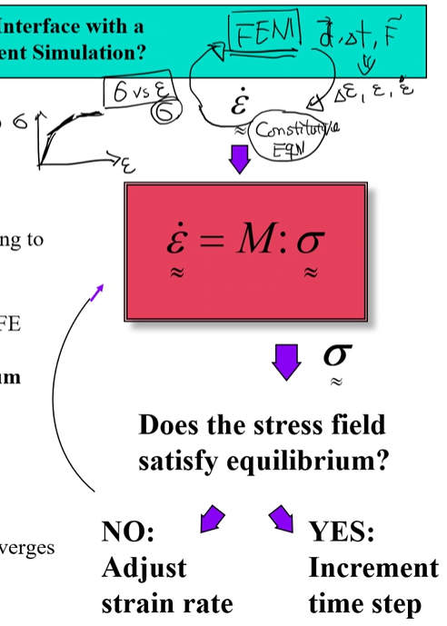

<!-- 220405 -->
# Crystal Plasticity

**Why investigate crystal plasticity?**
- On macroscale:
  - Homogeneous material point
  - Continuous plastic flow behavior
- On the mesoscale:
  - Material exhibits inhomogenity or structure
  - Plastic flow occurs on discrete slip planes
  - Flow is anisotropic and orientation-dependent
  - The structure evolves with deformation

|  |
|:--:|
| If the crystal is titled or the background coordinate system is adversely aligned, then the critically resolved shear stress changes how the crystal interacts with other crystals. |

Gradients along the output curves within#FEA codes give this information down to single crystal, constitutive models which then upscale the net behavior back up to the continuum length scale.
Essentially, this a tangent matrix to the stress strain at each node in an#FEA simulation.

|  |
|:--:|
| Most materials are anistropic. |

|  |
|:--:|
| Grains rotate under global shear deformation. Material scientists call this texture and mechanists call this plastic spin and other may call it LPL. |

**The Material Behavior is Inherited by the Lower Length Scale and Averaged to the Macroscopic Scale**
Local stresses area averaged into stress fields.

**Approximate Polycrystal Models**
$$\begin{equation}
\begin{split}
\sigma^{c} &= C^{c}D^{c} \\
<\sigma^{c}> &= <C^{c}D^{c}> \\
\sigma &= <C^{c}>D
\end{split}
\end{equation}$$

This is an upper bound of strain within the aggregate material which assumes homogeneous strains.
However, stresses vary greatly with local, critically resolved shear stresses; therefore, not equilibrium.

$$\begin{equation}
\begin{split}
D^{c} &= C^{c}^{-1}\sigma^{c} \\
<D^{c}> &= <C^{c}^{-1}\sigma^{c}> \\
D &= <C^{c}^{-1}>\sigma \\
\sigma &= <C^{c}^{-1}>^{-1}D
\end{split}
\end{equation}$$

This is homogeneous stress, but strain is different in each grain; therefore, compatibility is not conserved.

**The real stress-strain curve must be between these two.** These models impose certain stress components at the crystal level equal their respective…​ Self-consistent methods are limited in their compatibility.

<!-- 220407 -->

Abaqus relies on an ISV calibration routine for hardening parameters.
Current codes incorporate twinning.

**How Does a Constitutive Model Interface with a Displacement-Based Finite Element Solution?**
1. Take an incremental strain step
2. Assemble a stiffness matrix
3. Compute the stress corresponding to the imposed strain increment
4. The stress is handed back to the FE code to see if the weak form of equilibrium or linear momentum balance is satisfied
   1. If not, adjust the strain step and compute a new stress increment
   2. Repeat until the weak form converges
5. Increment the time step

|  |
|:--:|
| How a constitutive model interacts with FE codes. |

**Many Tensor Constitutive Equations are Reduced to a Set of Equivalent Scalar Equations to be Solved**
- Isotropic constitutive laws relate the magnitude of strain rate to the magnitude of stress
- Anistropy $\implies$ stress tensor components vary independently
- Crystal plasticity models relate the rate of slip along a slip plane (scalar) to the shear stress acting on the plane (another scalar)
- Anistropy arises because the crystals and their respective slip systems can be oriented

<!-- 220412 -->
Strain rates and stresses are averaged out from all local values at each grain for the whole system.
Texture, which is grain directionality, is measured using *pole figures* to project and visualize those grains with the same direction as each other.
Think of stereographic projections from **Mechanical Metallurgy**.
Initially, these figures will be rather random until deformation aligns grains.

**Some Methods to Create Digital Microstructures with Embedded Mesh**
**Voronoi Tessellation** to generate initial microstructure with texture.
**Dream3D** from Carnegie Melon is another software to do the same.
This falls under the same limitations of discretizing a continuum material into some mesh.