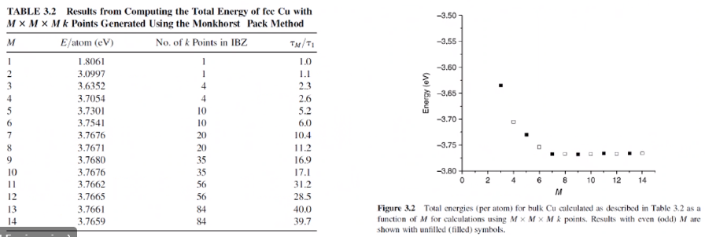

<!-- 220108 -->
# Density Functional Theory

## Introduction
$$\begin{equation}
-\frac{\hbar^{2}}{2m}\frac{\partial^{2}\Psi}{\partial x^{2}} + V\Psi = E\Psi(x)
\end{equation}$$

<!-- 220210 -->
## Summary of QM
One of the most important length scales is the eletrons to measure electromagnetic effects.
There are probability waves associated with all particles: * The **wave function ($\Psi$)** is used to represent probability wave.
* The state of the system is completely specified by $\Psi$.
* $|\Psi(x, t)|_{2}dx$ = probability of the particle being at $x \pm dx$.

Measurement of $\hat{A}$ will yield one of the values, $a_{i}$.
* Each **eigenvalue, $a_{i}$** has an eigenvalue, $\Psi_{i}$ associated with it: $\hat{A}\Psi_{i} = a_{i}\Psi_{i}$.
* The state of the system can be expanded as: $\Psi = \sum_{i}^{n}c_{i}\Psi_{i}$.
* For particles in a time-independent potential, Schrodinger’s Equation can be used: stem:

At ground state, electron behavior is time-independent.
Schrodinger’s Equation [Eq. 6](#eq-schrodinger_equation) can represent ground and excited states of electrons, but we focus on the ground-state.

**Timeline**
- 1927: Introduction of Thomas-Fermi model (statistics of electrons).
- 1964: Hohenberg-Kohn paper proving existence of exact Density Function.
- 1965: Kohn-Sham scheme introduced.
- 1970s and early 80’s: Local Density Approximation (LDA) and DFT becomes useful.
- 1985: DFT incorporate to Molecular Dynamics (MD); one of PRL’s top 10 cited papers.

## Theoretical Background: From many-body Hamilitonian to Kohn-Sham equations
**DFT Sholl Steckel**

**Eletronc basic structure**

**Electronic n-body Problem**
Materials are composed of nuclei $\{Z_{\alpha}, M_{\alpha}, R_{\alpha}\}$ and electrons $r_{i}$: interactions are known.

$$\begin{split}
H &= -\sum_{\alpha}\frac{\hbar^{2}\nabla_{i}^{2}}{2m} \text{~Kinetic energy of nuclei} \\
 &\quad -\sum
\end{split}$$

**Born-Oppenheimer Approximation I**
- Hamiltonian of the coupled electron-ion system: $\mathscr{H} = T_{I} + T_{e} + V_{II} + V_{ee} + V_{eI}$.
- Many-body Schrodinger Equation: $\mathscr{H}\phi()$
- Decoupled wave function: stem:\[\]

We can ignore the potential energy of the nuclei because the electron energy dominates.
The nucleus may have much more mass but moves very slowly.
Therefore, nuclei are assumed to have a fixed position.

- Adiabatic Approximation
  - First, we solve, for fixed position of the atomic nuclei, the equations that describe the electron motion.
  - For a given set of electrons moving in the field of a set of nuclei, we find the lowest energy configuration: ground state.
  - For set of $M$ nuclei, the ground-state energy, $E$, as a function of the position of these nuclei, $E(R_{1}, \dots, R_{M})$: *adiabatic potential energy surface*.
  - asdf

**Key Points**
- We need to know the erngy and how energy changes if the atoms move around.
- Electrons respond instantaneously to changes in their surroundings compared to nuclei.
- If we have $M$ nuclei at positions $R_{1}$, $R_{2}$, $\dots$, $R_{M}$, then we can express the ground-state energy, $E$, as a function of the positions of these nuclei, $E(R_{1}, R_{2}, \dots, R_{M})$.

**Hartree Approximation**
- Hamiltonian for electrons: $$\begin{equation} \mathcal{H} = -\sum_{i}\frac{\hbar^{2}}{2m_{e}}\nabla^{2}r_{i} + \sum_{i}V_{ion}(r_{i}) + \frac{e^{2}}{2}\sum_{j \neq 1}\frac{1}{|r_{i} - r_{j}|} \end{equation}$$
- The electronic wave function has $3N$ variables.
- Consider electrons as independent—​moving in an effective potential (of ions)--stem:\[\] this has been proven!
- Still solving for the electronic wave function is a challenge.
  - E.g. for $CO_{2}$, the full wave function has 66 dimensions.
  - For 100 pt atom cluster has 23,000 dimensions.

**Some Helpful Points**
- For ground-state energy, the Schrodinger Equation is time-independent.
- $\Psi$, the set of solutions for the wave function, can be approximated as a product of individual electron wave functions (Hartree Product): $\Psi = \prod_{i}^{N}\Psi_{i}(r)$
- Electrons are identical particles.

**Relevance of Charge Density**
Although solving Schrodinger’s Equation ([Eq. 6](#eq-schrodinger_equation)) can be viewed as the fundamental problem of quantum mechanics, the wave function for any particular set of coordinates cannot be directly observed.
Quantity that measured is the probability that the $N$ electrons are at a particular set of coordinates, $r_{i}$.
Do not care which electron in the material is labeled electron 1, 2, and so on.
A closely related quantity is the density of electrons $n(r)$:

$$n(r) = 2\sum_{i}|\Psi|^{2}$$

where $\Psi_{i}$ are single-electron wave functions.
$n(r)$ is a function of only 3 variables.

**First Hohenberg-Kohn Theorem**
The ground state density, $r(n)$ of a many-electron system determines, uniquely, the external potential $V(r)$.

!!! info First Hohenberg-Kohn Theorem
    Proof by contradiction: suppose two external potentials $V(r)$ and $V'(r)$ give the same density $(n)$.

The ground-state energy is a unique functional of the electron density.
$n_{GS}(r)$ uniquely determines all properties, including the energy and wave function of the ground-state: problem with $3N$ variables reduced to problem with 3 variables.
A functional takes a function and defines a single number from the function:

$$F[f] = \int_{-1}^{1}f(x)dx$$

$f(x) = x^{2} + 1$, we get $F[f] = \frac{8}{3}$.
$E_{GS}$ can be expressed as $E[n_{GS}(r)]$.

**Second Hohenberg-Kohn Theorem**
For a given $V(r)$, the correct $n_{GS}(r)$ minimizes the energy functional and this minumum is the ground-state energy.
The electron density ($n_{GS}(r)$) that minimizes the erngy of the overall functional is the true electron density corresponding to the full solution of the shrodinger equation.

!!! note Second Hohenberg-Kohn Theorem
    

**Some Helpful Points**
- "Density" "Functional" Theory
  - Density: electron density
  - Functional: there exists a 1-1 mapping between energy and electron density.
- A useful to write down the functional is in terms of the single-electron wave functions.

**Energy Functional**
In terms of the single-electron wave functions The known terms include four contributions.
1. Kinetic energy
2. Coulomb interactions (electrons-nuclei)
3. Coulomb interactions (electrons-electrons)
4. Coulomb interactions (nuclei-nuclei)

**Exchange-Correlation Functional, $E_{XC}$**
- Exchange: adheres to **Pauli’s Exclusion Principle (PEP)**
- Correlation: A measure of how much the movement of one electron is influenced by the presence of all other electrons. This keeps electrons away from each other due to Coulomb forces which can be calculated by substracting the exchange energy from the total energy.
    1. Finding exact $E_{XC}$ is a great challenge: sure to win a Nobel Peace Prize.
    2. Approximate functionals work:
        1. LDA
        2. GGA
        3. meta-GGA
        4. hyper-GGA
        5. hybrid
        6. and dozens of other functionals

## Kohn-Sham Equations
[Self-Consistent Equations Including Exchange and Correlation Effects by W. Kohn and L. J. Sham cite:\[kohnSelfConsistentEquationsIncluding1965](https://journals.aps.org/pr/abstract/10.1103/PhysRev.140.A1133)\]

Map interacting system to non-interacting system.
$n_{GS}(r)$ can be found by solving a set of equations in which each equation only involves a single electron wave function (KS orbital):
- $V(r)$: electron-nuclei interaction
- $V_{H}(r)$: electron-electron density interaction

$$V_{KS} = V(r) + V_{H}(r) + V_{XC}(r)$$

$V_{KS}$ is such that…​

|  |
|:--:|
| To solve KS, equations need to define $V_{H}$. $n(r)$ is needed to define $V_{H}$; we need $\Psi_{i}(r)$ to find $n(r)$; and, we need to solve KS equations to find $\Psi_{r}(r)$. |

**Output from KS Equations**
We have solved the Kohn-Sham equations and found the KS orbitals (wave-function, $\Psi_{i}$) and respective energies ($\epsilon_{i}$), then what?
Well, we can obtain the ground-state total energy; forces acting on atoms; and, charge density.
Kohn-Sham eigenvalues and orbitals have no physical meaning: they are of the equivalent…​.

**Local Density Approximation (LDA)**
The exchange-correlation energy at each point in the system is the same as that of an uniform electron gas of the same density.
Set teh $V_{XC}$ at each position to $V_{XC}^{\text{electron gas}}$ for $n(r)$ at that position: $E_{XC}^{LDA}[n] = \int n(r)\epsilon_{XC}(n)dr$.
Here, $\epsilon(n)$ is the exchange-correlation energy per electron in homoegenous gas at density, $n$, which can be calculated.
**Does not exactly solve the true Schrodinger Equation.** This is the only case…​

**Generalized Gradient Approximation (GGA)**
Uses information about the local electron density and the local gradient in the elctron density.
Take the value of the density at each point as well as the magnitude of the gradient of the density: $E_{XC}^{GGA}[n] = \int n(r)\epsilon_{XC}(n, \nabla n)dr$.
Improves over LDA for many properties: binding energies, lattice constants, bulk modulus, etcetera.
Many ways in which information from the gradient of the electron density.

**Advantages of DFT**
- Works well for crystalline materials: works best for metallic system.
- Not an empirical theory:
  - Derived from first principles.
  - No fitting of parameters.
  - (Under/Over)estimation…​

**Limitations of DFT**
- Overbinding
  - LDA gives large cohesive energies and high bulk moduli.
  - GGA ocrrects overbdining to a large extent.
- Neglects van der Waals forces: not included in any functional.
- Limited to number of atoms…​

<!-- 220215 -->
## DFT Convergence
**What do we mean by convergence?**
The ground-state electron density of a configuration of atoms is defined by the solution to a complicated set of equations ([Kohn-Sham Equations](#sec-dft-kohn_sham)).
To actually solve this problem on a computer, we must make a series of numerical approximations.
- Integrals in multi-dimensional space must be evaluated by examining the function to be integrated at a finite collection of points.
- Solutions that formally are expressed as infinite sums must be truncated to finite sums.

In each numerical approximation, it is possible to find a solution that is closer and closer to the exact solution by using more and more computational resources.
A "well-converged" calculation is one in which the numerically derived solution accurately approximates the true solution.
E.g. Fast-Fourier Transforms of moving the $N$ data points into a $2N$ frequency domain and back to $N$.

!!! info Bloch's Theorem
    For a periodic system, the solutions to the Schrodinger equation can be expressed a sum of terms with the form:
    $$\phi_{k}(r) = \exp(ik \cdot r)u_{k}(r)$$
    $u_{k}(r)$ is periodic in space: $u_{k}(r + n_{1}a_{1} + n_{2}a_{2} + n_{3}a_{3}) = u_{k}(r), where $n_{1}$, $n_{2}$, and $n_{3}$ are any integer.
    This can solve the Schrodinger equation for value of $k$ independently.
    Functions of the form $\exp(ik \cdot r)$ are called **plane waves**.
    The space vectors, $\vec{r}$ are the

!!! tip k-points Concepts
    Think of k-points as a mesh or grid in the reciprocal space.

**Integrals in k-space**
Many quantities require integration over Brillouin zone (BZ): e.g. charge density, total energy, etcetera.

|  |
|:--:|
| Perform k-point convergence test and mention the k-point grid when referring to calculations. |

By the convergence test (Fig. [Fig. 5-2](#fig-choosing_k-points_in_bz)), a k-point of 7 will be used for best accuracy and quickest solution time.

|  |
|:--:|
| This process can be thought as similar to that in Fast-Fourier Transforms for converting, manipulating, and re-converting from, in, and back to the solution, frequency, and solution domains. |

$$\begin{equation}
\begin{split}
\phi_{k}(r) &= \exp(ik \cdot r)u_{k}(r) \\
u_{k}(r) &= \sum_{G}c_{G}\exp(iG \cdot r) \\
G &= m_{1}b_{1} + m_{2}b_{2} + m_{3}b_{3} \\
\implies \phi_{k}(r) &= \sum_{G}c_{k + G}\exp(\i(k + G)r) \\
E &= \frac{h^{2}}{2m}\Bigl\[k + G\Bigr\]^{2} \quad E_{cut} = \frac{h^{2}}{2m}G_{cut}^{2} \\
\dots
\end{split}
\end{equation}$$

**Pseudopotential Approximations**
Wave functions are written as the sum of plane waves: $\Phi_{i}(r) = \sum_{i}^{n}c_{i}\exp(iG_{i} \cdot r)$.
To represent all electron states:
- The number of plane waves would be very large ( $> 10^{6}$).
- Replace nucleus and core electrons by a fixed, effective potential.
- Only valence electrons are taken into account in the calculations.

|  |
|:--:|
| foo |

Various types of pseudopotentials exist; e.g.:
- Ultra-soft (US): *fast but inaccurate*
- Projector augmented wave (PAW)

**Running a Calculation**
1. Pseudopotential
2. Basis Set
3. k-points
4. foo

**Summary**
Total energy…​

<!-- 220217 -->
## Upscaling from DFT to Interatomic Potential
This information goes into the MEAM potential by finding the parameters: e.g. cohesive energy.
LAMMPS performs this MEAM potential calculation for molecular dynamics.
This is the first homework.