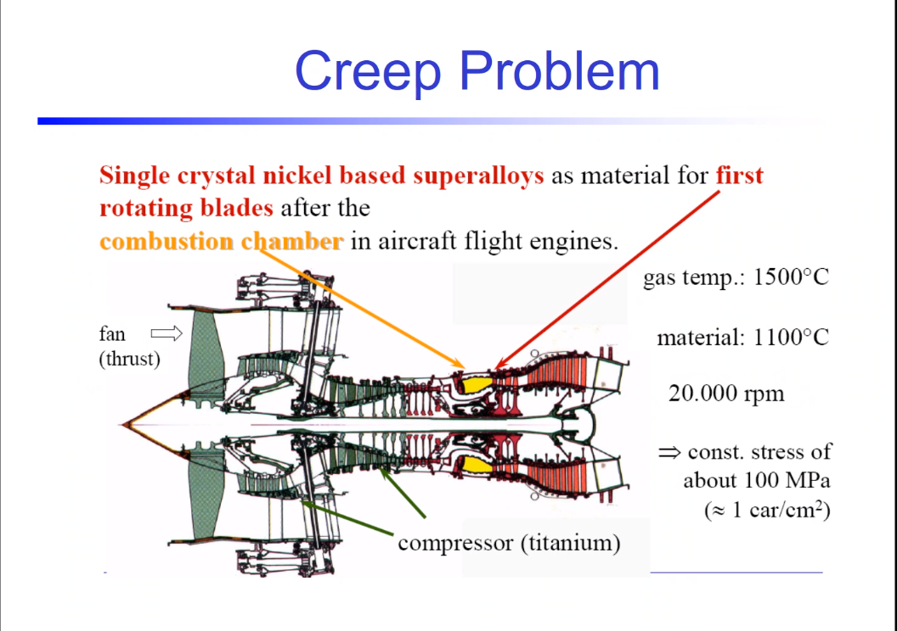
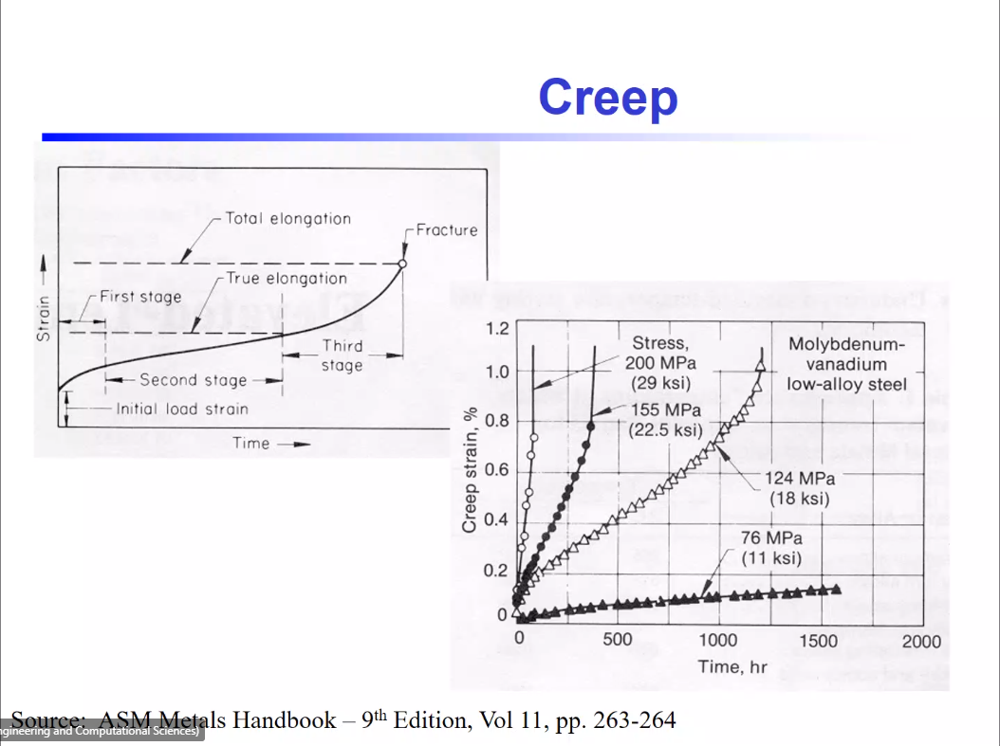
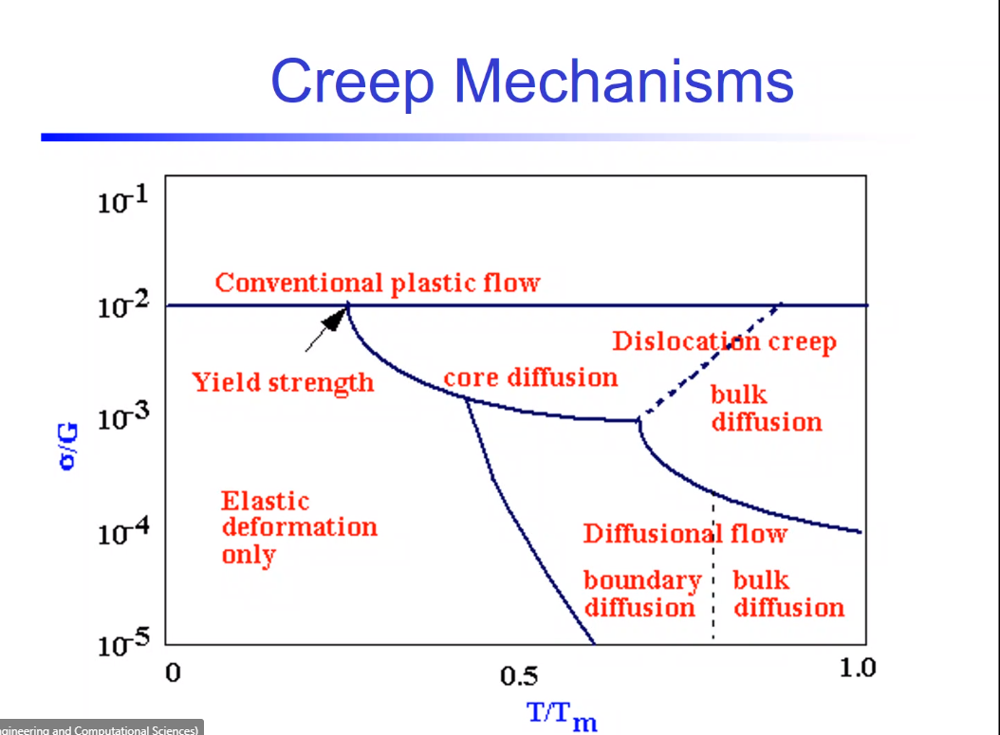
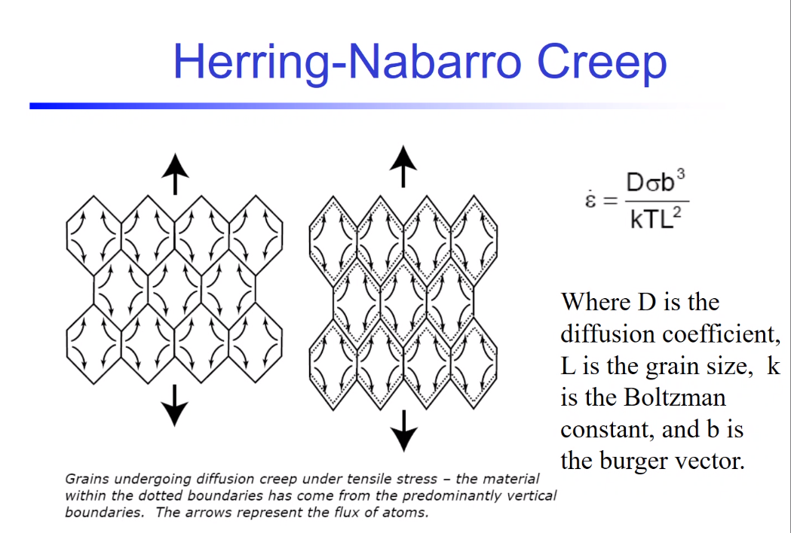
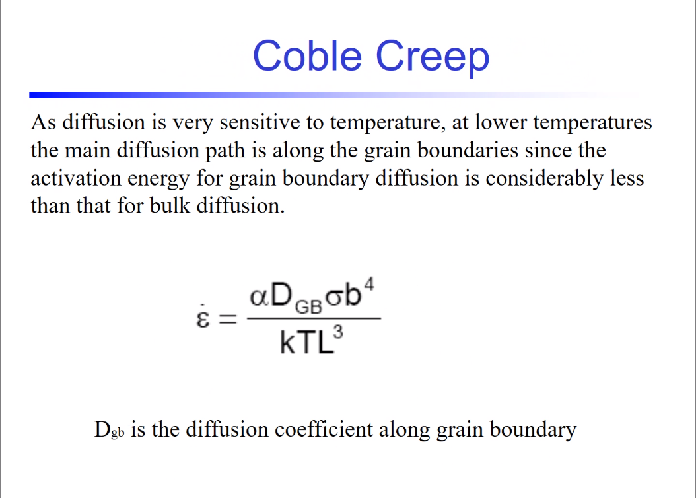

# lesson-31-elevated-temperature-failures-creep

1. Typically at elevated temperatures some ratio to the melting temperature of the material.
   1. Absolute temperature.
   2. Modeling uses absolute temperature, but reported in scaled temperature for legibility.
2. Tension induces a mean stress, which is worse for fatigue life. 
   1. $R = \frac{\sigma_{min}}{\sigma_{max}}$. 
   2. When less than 1, reported as -1.
   3. Mean stress increases the R-ratio.

3. Coefficient of efficiency is rather low for most combustion engines. 
4. Creep:= time-dependent strain under constant stress.
   1. Primary: imperfections align. Dominated by nucleation.
   2. Secondary: equilibrium work-hardening.
   3. Tertiary: cracking override, work-hardening. Dominated by coalescence.
   4. Not all stages may occur. Though all stages include nucleation and coalescence.
   5. Unified-Creep Plasticity (UCP): ISV-damage for plasticity maps to the stages of creep.
5. Creep tests can be stress or strain controlled.
   1. **Strain-controlled is a relaxation test.**
   2. Dynamic (glide) and static (climb) recovery in ISV hardening.

6. Plastic-rate of deformation.
   1. Creep curve changes for different loads.

7. Ashby maps creep for shear strain and melting temperature to ascertain dominating mechanism in creep.
   1. Elevated temperatures reduce the activation energy of chemical bonding, which allows plastic flow.
   2. Creep climbs in dislocations, plasticity glides along planes.
   3. Because this chart is quasi-static, increasing strain-rate moves the y-axis down.

8. Herring-Nabarro: $$\dot{\epsilon} = \frac{D\sigma b^{3}}{kTL^{2}}$$.

9. Coble Creep: 

10. Idealization of creep: constant applied stress in constant temperature.
    1.  Applied load will cause creep to a point.
    2.  In the strictest sense of the definition, is not fatigue/creep-fatigue, because the load must be constant, not oscillatory as in fatigue.
11. Arrhenius form of dependence on temperature.
    1.  Damage nucleates and coalesces just as with plasticity, fatigue, and corrosion.
12. Stress rupture
    1.  Ultimate failure is fracture, even though stress is constant, because strain is increasing.
    2.  Trans/Intergranular depends on temperature and strain-rate: lower creep rates and temperatures.
    3.  Brittle
        1.  Usually intergranular.
        2.  Initiates at triple-points of grains
        3.  No elongation of grains (even after visible plasticity).
    4.  Ductile
        1.  Transgranular
        2.  Initiated at intergranular cracks.
        3.  Elongated grains.
    5.  Irregular and discontinuous fracture surfaces.
13. Creep model
    1.  Two ISV variables:
        1.  H: hardening
        2.  $R_{d}$: dynamic glide
        3.  $R_{s}$: static climb
    2.  If integrate damage (creep rate), then time becomes important.
    3.  $\dot{\phi}_{pores}$ is the same equation used in the high-rate phenomena. Same underlying mechanism.

