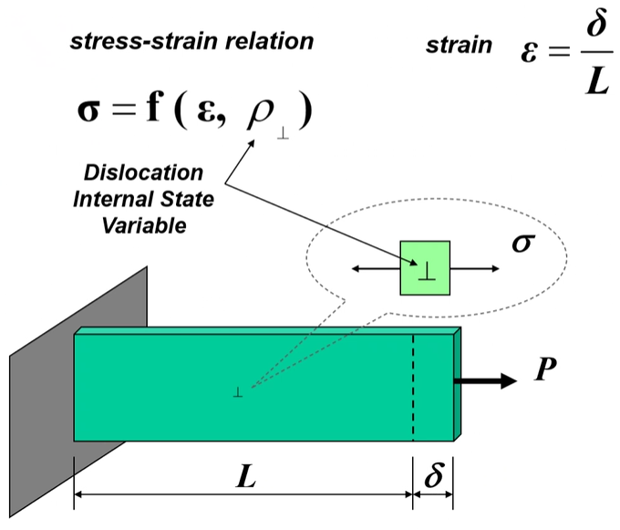

<!-- 220414 -->
# Macroscopic: ISV

## MSU DMG Plasticity-Damage Theory 1.0

### Background
Constitutive Laws
: Mathematical descriptions of material behavior to satisfy continuum theory relating stress and strain.

| Law | Number of Equations |
|:--:|:--:|
| Conservation of Mass | 1 |
| Balance of Linear Momentum | 3 |
| Balance of Angular Momentum | 3 |
| Balance of Energy | 1 |

To satisfy thermodyanmic conditions, ISV’s are needed for dissipating energy.

<!-- 220419 -->

**Physical Admissibility of ISVs**
ISVs are useful to model collective effects of changing material structure involving multiple mechanisms at multiple length scales.

|  |
|:--:|
| These ISV models are based on either phenomenonological or physics-based data. |

There exists few dislocations below and near yielding, but this density rapidly increases near fracture.
There are two, competing effects: dislocation density and dislocation motion.
Increasing dislocation density increases the stress by reducing ability for dislocations to move; however, the material softens itself to accommodate the stress, which allows for deformation by dislocations annihilating each other.
There is a positive and negative stress rate: increasing dislocation density and annihilating dislocations.
At dyanmic equilibrium, these rates equal other: requiring no change in applied stress to cause changes in length.

Dislocations nucleate, grow, and then coalesce.
The sizes and locations of these dislocations at each stage of dislocation growth are ISVs.

<!-- 220421 -->
<!-- 220426 -->