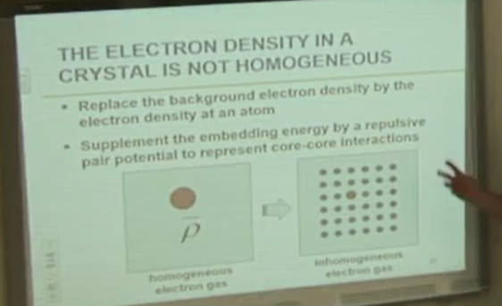

<!-- 220217 -->
# MEAM

## Some Concepts
**Bond Energy**
Every pair of atoms is connected by a bond (think of springs).
The bond energy depends on the separation of the atoms.
The potential energy of a material is the sum of bond energies.

**Many Body Effects**
Not all bonds are equal.
There is a correlation between them.

**Transferability**
Models need to be accurate for any atomic environments: solid mechanics, fluids, etcetera.
* Volume: nearest neighbor distances.
* Coordination: crystal structures
* Defects: loss of symmetries

**Reference State**
This may be fcc, bcc, hcp, etcetera.
We can measure these from experiments or first principles calculations.
These states have high symmetry.
We start off knowing properties from this base structure into defective solid volumes or volumes under boundary conditions.

Reference paths connect 2 reference structures.
Properties along this path can be obtained from first principles (VASP).
This affords more information into the model for lower symmetry states (moving from fcc to bcc).
This imporves transferability.

**Screening**
ATomic interactions have a finite range.
Radial screening cutoffs the interactions to zero above some distance.
Independent of local geometries: e.g. higher compression would increases number of bonds; however, this is does not make sense.
Therefore, there is an angle screening to "break" the bonds and "make" others for changes in geometry.
This screening process is more important for more atoms in a simulation.

## Models
**Pair potentials represent only distance dependent bonds**
Needs to be accurate for any atomic environment and must be calculable on most systems.

$$\begin{equation}
U = \frac{1}{2}\sum_{i, j}\phi(R_{ij})S(R_{j})
\end{equation}$$

i = all atoms j = neighbors of atom i $\phi$ is independent of environment.
$S$ is the radial screening.
Screening is necessary to limit calculation time.

Only two independent elastic constants exist.
A real, cubic material has three.
Pair potentials cannot reproduce this third constant.
In equilibrium, two are related.
Cauchy discrepancy may be defined…​ A way around this is "volume dependent" pair potentials, but these do not work very well for non-uniform systems.

**Real materials have a Cauchy Discrepancy**
$$\begin{equation}
U = \frac{1}{2}\sum_{ij}\phi(R_{ij}) + F(V)
\end{equation}$$

Where V is volume.
But how does one define volume for non-homogeneous systems?

**Lennard-Jones Potential**
Initially used to model rare gases where Cauchy Discrepancy is 0.
If we apply the same ideas laid out above, then the pair potential accounts for diatomic atoms of some bond energy $E_{0}$ at some equilibrium distance $r_{0}$.

$$\begin{equation}
\phi(R) = 4\epsilon_{0}\[(\frac{\sigma}{R})^{12} - (\frac{\sigma}{R})^{6}\] = E_{0}\[(\frac{r_{0}}{R})^{12} - 2(\frac{r_{0}}{R})^{6}\]
\end{equation}$$

**Morse Potential**
Conventional, functional form for diatomic atoms of some bond energy $E_{0}$ at some equilibrium distance $r_{0}$ to relate some force constant $\alpha$.

$$\phi(R) = E_{0}[e^{2\alpha(r_{0} - R)} - 2e^{\alpha(r_{0} - R)}]$$

**Simple Analytical Expressions for the Bulk Modulus with LJ or Morse Interactions**
For only nearest neighbor (1NN) interactions in fcc:

$$\begin{split}
U &= 6\phi(R)N \\
r_{i} &= r_{0} \\
K &= \frac{1}{9V_{i}}\frac{\partial^{2}E}{\partial(\frac{R}{r_{0}})^{2}} = \begin{cases}\frac{48E_{0}}{\Omega_{i}} &, LJ \\ (\frac{4E_{0}}{\Omega_{i}})(\frac{\alpha^{2}r_{0}^{2}}{3}) &, Morse\end{cases}
\end{split}$$

where $\Omega_{i}$ is the volme per atom.
Thus for a Morse potetnal the experiemental bulk modulus may be reporoduced by an appropriate choice of the parameter, $\alpha$.
This is only a prediction.

From an initial experiement, the LJ constants and bond energies are 3 times greater than the real material.
Only the cohesive energy is close.
The melting point is about 2 as much (~35:00).

How can we improve the accuracy and transferability of pair potentials? Include many body effects…​

**DFT proves that the energy is a functional of the electron density**
If we know the electron density everywhere, then the potential energy is determined: *U* = *f*\[*ρ*(*R⃗*)\]; some unkonwn functional of the electron deesnsit.

|  |
|:--:|
| an atom is embedded into a homogensou electron gas. What is the difference of energy between these states? |

**The electron density in a crystal is not homoegenous**
Replace the backgounr dleectron density by the electron density at an atom.
Supplement the embedding energy by a repulsive pair potential to represent core-core interactions.

|  |
|:--:|
| ${selectedText} |

|  |
|:--:|
| Atom j is a neighbor of atom i and does not include atom i in the sum. |

$$\bar{\rho_{i}} = \sum_{j} \rho_{j}^{a}(R_{ij})$$

**EAM is semi-empirical**
is obtained from a linear supoerposition of atomic densisites $F$ and $\phi$ are obtained by fitting the folowing porpeorties: Universal Binding Energy Relationship (UBER: lattice constant, bulk modulus, cohesive energy), Shear moduli, Vacancy formation energy, and structural energy differnces (hcp/fcc, bcc/fcc).
$E = \sum_{i}F(\bar{\rho_{i}}) + \frac{1}{2}\sum\phi_{i}(R_{i})$.
As it turns out, any and all matter interactions follow the shape of the same curve.

**UBER extends equilibrium behavior**
$$\begin{split}
U_{B}(R) &= -E_{0}(1 + a*)e^{-a*} \\
a* &= \alpha(\frac{R}{r_{o}} - 1) \\
\alpha &= \sqrt{\frac{9K\Omega_{0}}{E_{0}}}
\end{split}$$

**A functional form is chosne for the pair potential**
For the EAM functions: $\phi_{0}(R_{0}) = \frac{Z_{i}(R_{0})Z_{j}(R_{0})}{R_{0}}$.
various forms for Z have been chosen: e.g. cubic splines.
Ohter functional forms have been used.

**Summary**
Based on DFT for more reliable results.
Experience shows it to be reliable.
Fit to "Real" material properties: experiemental and first principles.
Equivalent in compouter time to pair potiential methods.
Includes "many body interactions." Predictive: once the fitting is done, there are no more konbs.

<!-- 220224 -->
## Dislocation Motion

## Requirements by Downscaling
**First Order Requirements for EAM/MEAM Potentials (for calibration)**
- Lattice parameter
- Elastic moduli
- Cohesive energy
- Volume
- Exponential decay factor for MEAM potential

**Objectives for Optimization of Parameters for EAM/MEAM Potentials (for validation)**
- Surface formation energies (damage)
- Generalized stacking fault curve (shearing)
- Vacancy formation energy (diffusion)
- Atomic forces
- Lattice ratio
- Crystal energy difference

**Calibration**
Cohesive Energies Cohesive energy:: heat formation per atom when these atoms are assembled into a crystal structure.
I.e. the 2850 offset parameter in the codes is from the atomic energy in a vacuum.

When plotting cohesive energy versus the lattice parameter, the minimum of the cohesive energy curve determines the equilibrium lattice constant, $a_{0}$.

Elastic Constants Number of elastic constants varies with crystal structures.
hcp has 5; whereas, cubic has only 3.
These are calculated numerically by applying small strains to the lattice.

**Verification**
Surface Formation Energy
$$\begin{equation}
\gamma = \frac{E_{tot} - N\epsilon}{A}
\end{equation}$$
where $E_{tot}$ is the total energy of the system with a surface; $N$ is the number of atoms in the system; $\epsilon$ is the total energy per atom in the bulk; and, $A$ is the surface area.
Effectively, this is the energy of those atoms that do not comprise the immediate surface.

Vacuum Energy
$$\begin{equation}
E_{vac} = E_{tot}[N - 1] - E_{tot}[N]
\end{equation}$$
wherein $E_{vac}$ is the energy cost to create a vacancy; $E_{tot}$ is the total energy of the system with $N$ atoms contained no vacancy; and

Surface Adsorption Energies
$$\begin{equation}
E_{ads} = E_{tot} - E_{surf} - E_{atom}
\end{equation}$$

Stacking Fault Energy
$$\begin{equation}
E_{sf} = \frac{E_{tot} - N\epsilon}{A}
\end{equation}$$

wherein

**Generalized Stacking Fault Energy (GSFE) Curve**
This curve will typically have two maximums and one minimum.
Sometimes these are called the extrinsic and intrinsic stacking fault energies, respectively.
A measure of the energy penalty between two adjacent planes during shear deformation in a specific slip direction on a given slip plane.
This represents the nature of slip and involved the stable (local minima) and unstable (local maxima) stacking and twin fault energies.
The GSFE curve and the associated energy properties can be used to model a vast number of phenomena linked to dislocations, plastic deformation, crystal growth, phase transition, and twin-twin interactions (Shang et al., 2014).
The nature of slip in crystalline metals cannot be described in temers of an absolute value of the stacking fault energy.
A correct interpretation requires the GFSE curve involving both stable and unstable stacking fault energies.

|  |
|:--:|
| In the codes, one makes two blocks of atoms and defines shear in the slip direction. |

<!-- 220301 -->
## How To Develop MEAM Potentials
Mike Baskes developed these methods; however, for this course, we will focus on MEAM.
The first homework assignment will demonstrate how to do this process.

### EAM is Semi-Empirical
$$\begin{equation}
E = \sum_{i}(F_{i}(\bar{\rho_{i}}) + \frac{1}{2}\sum_{j \neq 1}\Phi_{ij}(R_{ij}))_{\bar{\rho}}
\end{equation}$$

This had to be written because the existing Leanord-Jones model only worked for two atoms in a gas: this model did well account for interatomic interactions in multi-atom systems or to the boundary conditions.
This new equation can handle the inclusions of additional atoms to the system.
In [Eq. 2](#eq-eam), $\bar{\rho}$ is obtained by linear superposition of atomic densities for the *host electron density*; $F$ (embedding energy) and $\phi$ (pair interaction) are obtained by fitting to certain properties…​

### Complex Materials Require Addition of Angular Forces
EAM uses linear superposition of spherically averaged electron densities and is good for fcc materials.
MEAM allows the background electron density to depend on the local symmetry.

### MEAM Equations
$$\begin{equation}
\begin{split}
E^{u}(R) &= -E_{c}(1 + a^{*} + \delta a^{*}^{3}\frac{r_{e}}{R})e^{-a^{*}} \\
a^{*} &= \alpha(\frac{R}{r_{e}} - 1) \quad alpha = \sqrt{\frac{9\Omega B}{E_{c}}}
\end{split}
\end{equation}$$

$$\begin{equation}
\begin{split}
\bar{\rho} &=  \\
 &=
\end{split}
\end{equation}$$

!!! tip Reference Structure
    This paper refers to "reference structure" by default as "fcc".

In $\phi(R)$, $Z$ is the coordination number of the crystal structure because the 1NN atoms have greater effects on their neighbors than 2NN.
$E^{u}(R) = -E_{C}(1 + a^{*})e^{-a^{*}}$ is essentially given because $E_{C}$ is the minimum of the cohesive energy versus radius graph which occurs at the equilibrium distance, $r_{e}$.
$a^{*} = \alpha(\frac{R}{r_{e}} - 1)$ with $\alpha = \sqrt{\frac{9\Omega B}{E_{c}}}$ where $\Omega$ is the atomic volume and $B$ is the bulk modulus.

In $F(\bar{\rho}) = AE_{c}\frac{\bar{\rho}}{\rho_{0}}\ln(\frac{\bar{\rho}}{\rho_{0}})$, $A$ is an adjustable parameter and $\rho_{0}$ is a density scaling (here $\rho_{0} = Z_{fcc} = 12$).
Background electron density includes information for angular depends of atoms: $\rho^(0) = \sum_{i}\rho^{a(0)}(r^{i})$.
This angular depends is described by three equations:

$$\begin{split}
(\rho^{(1)})^{2} &= \sum_{\alpha}\[\sum_{i}\rho\] \\
 &=
\end{split}$$

Electron density decreases as distance increases.
Each equation above looks at the exponentially decaying dependence of only one atom and its angles to its neighbors in the three coordinate directions.
$\rho^{(0)}$ is the background electron density from the EAM method and is spherically symmetric.
MEAM modifies on EAM by scaling the background electron density by the angular dependence of the atom, $G(\Gamma)$.

!!! info Difference between EAM and MEAM
    MEAM handles locally embedded energies with respect to a reference structure because of the angular dependence at each site; whereas, EAM assumes spherical symmetry with all nearest neighbors.

### Screening
Only a certain atomic radius from each atom is considered which can increase or decrease interatomic behaviors because of the valence electrons dominate this behavior while the inner electrons contribute little.
This cuts down on computing requirements by calculating at each sites only those atoms within the screening distance.
The further atoms are apart from each other, the less their correlative effects.
The pseudopotential in DFT models do not include the interatomic forces below the equilibrium separation distance; therefore, there is a minimum cutoff distance for screening.
Effectively, this neglects the electrons that are not the valence electrons interacting between two atoms.