<!-- 220111 -->
# Multiscale Modeling

Much of this class material has been developed by Dr. Horstemeyer himself.

ICME
: Integrated Computational Materials Engineering

*[ICME]: Integrated Computational Materials Engineering

**Six Advantages of Employing ICME in Design**
1. Simulation-based design affords virtual optimization instead of many, costly, physical design iterations by trial-and-error.
2. ICME can reduce product costs through innovation in material, product, and process designs.
3. ICME can reduce number of costly, large-scale systems experiments.
4. ICME can increase product quality and performance by providing more accurate predictions of response to design loads.
5. ICME can help develop new materials.
6. ICME can help medical practice in making diagnostic and prognostic evaluations related to the human body.

| 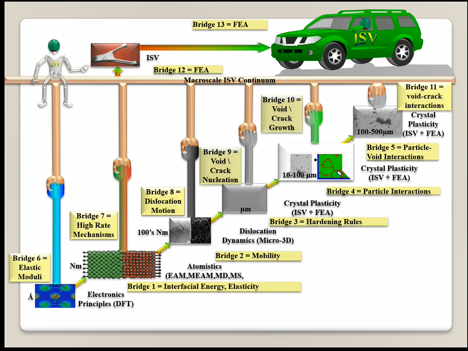 |
|:--:|
| This is the ICME diagram. Our proposal should include a similar depiction of our project. |

The ISV codes are based in physics.
At the electronic (angstrom) level, we can find the elastic moduli with DFT calculations: i.e. with Quantum Espresso.
Atomistics can find the interatomic energy potentials: i.e. found with MEAM by LAMMPS.
Molecular dynamics can find mobility—​i.e. dislocation mobility—​which varies for each material to solve dislocation dynamics by MDDP codes.
Microscopic motion for dislocation motions and their interactions which work-hardens the material by pinning dislocations: solved by hardening rules and parameters in ISV.
This bridges up to crystal plasticity which requires these hardening parameters within ISV codes to capture grain orientation, slip system interactions, texture, etcetera of polycrystalline materials to build stress-strain behavior curves.
Particle-void interactions can be implemented in ISV-damage model with elastic moduli and interfacial energies found at lower length-scales.

If problem is about deformation and damage, then you need ISV model.
Homeworks will require ISV.
Otherwise, ISV is not needed.

Finally, continuum calculations with ISV codes in softwares—​such as Abaqus—​can run the appropriate simulations according to the prescribed boundary conditions.
1. Downscaling and upscaling: only use the minimum required degree(s) of freedom necessary for the type of problem considered.
2. Downscaling and upscaling: energy consistency between the scales.
3. Downscaling and upsaling: verify the numerical model’s implementation before starting calculations.
4. Downscaling: start with downscaling before upscaling to help make clear the final goal, requirements, and constraints at the highest length scales.
5. Downscaling: find the pertinent variable and associated equation(s) to be the repository of the structure-property relationship from sub-scale information.
6. Upscaling: find the pertinent "effect" for the next higher scale by applying ANOVA methods.
7. Upscaling: validate the "effect" by an experiment before using it in the next higher length-scale.
8. Upscaling: quantify the uncertainty (error) bands (upper and lower values) of the particular "effect" before using it in the next higher length-scale, and then use those limits to help determine the "effects" at the next higher length-scale.

| 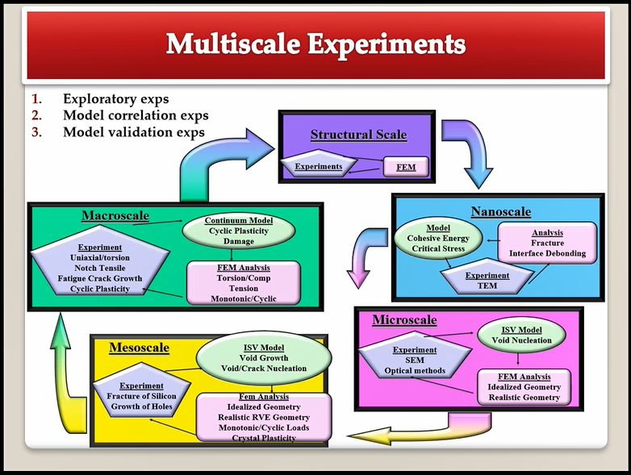 |
|:--:|
| We need to find the parameters required for the problem and look to lower length-scales to provide the information. |

| 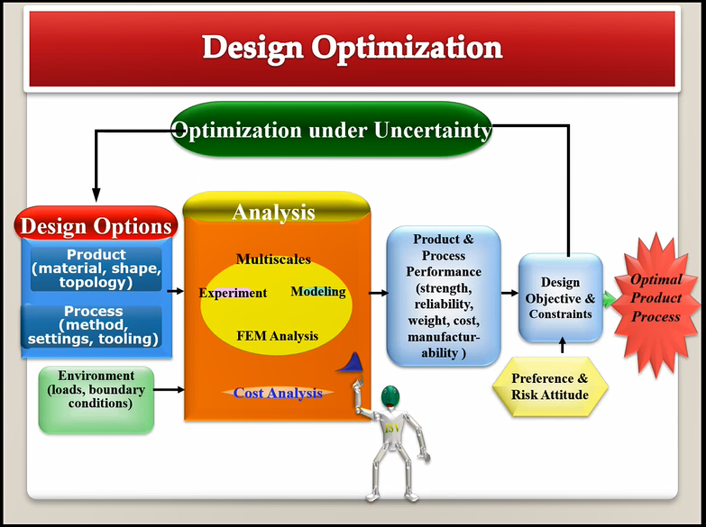 |
|:--:|
| Design options (variables) are defined for some product: e.g. material, geometry, boundary conditions, etcetera. Observing behaviors at the highest length-scales requires knowledge of behavior and uncertainty at the lower length-scales. Find the optimal variables according to design objectives and constraints. |

<!-- 220113 -->

Structure
: In materials science, this could be dislocations, textures, twins, recrystallization, etcetera.

Properties
: Stress, hardness, strain, etcetera. COMETMAN

Using understanding of processing some chemistry to make certain structure yields some properties to deliver certain performance of material.
Within some limitations, we can validate atomistic simulations of models for greater confidence of phenomenological behaviors at higher length scales.
The ICME paradigm allows us to use information from lower length scales at higher ones by minimizing the number of computations required to model actual behavior of every atom within an#FEA simulation.

**Hierarchial Structure Leads to Hierarchial Multiscale Modeling**
ICME can be used to study almost any solid-state materials.
This course should give us the understanding to study our own material topic.

**Atomic Defect Accumulation**
Hardened materials will increase in density and damage will accumulate.
Eventually, after the maximum stress, #necking and ultimate fracture will occur.

ISV
: Internal State Variables (somtimes called constitutive model) are inherent variable, such as change in energy under deformation, unable to be derived.
Temperature or stress in a material might be obsverved under deformation, but certain things within material should also be considered: such as void damage.

Dr. Horstemeyer was responsible to formulate the damage kinetics in this model; wherein, fracture occurs at an upper limit of a rapidly increasing volume fraction.
The ISV variable of interest could be damage, volume fraction of free volume, etcetera.

**Plasticity: Dislocation nucleation, propagation, and interaction have several length scales.**
- Stress is inversely propoertional to Burger’s vector (Frank, Nabarro), $\sigma \propto \frac{1}{\vec{b}}$
- Diffusion rate, $e \propto \frac{1}{d^{2}}$
- Hall-Petch Effect, $\sigma = \frac{K}{\sqrt{d}}$
- Dislocation density (Ashby), $r$…
- Dislocation bowing (Frank-Read Source), $T = \frac{G\vec{b}}{L - 2r}$
- Geometrically necessary boundary spacing decreases with applied strain
- Strain gradients reflect length scales in plasticity
- Yield…​

| 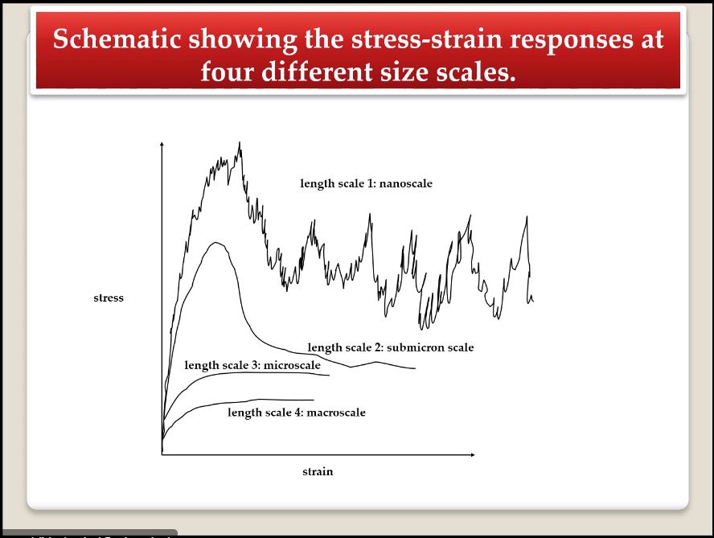 |
|:--:|
| Certain length scale effects become negligible or decrease for higher length scales. |

## Case Studies
If we know the history of a material, we can predict near-future performance.

| 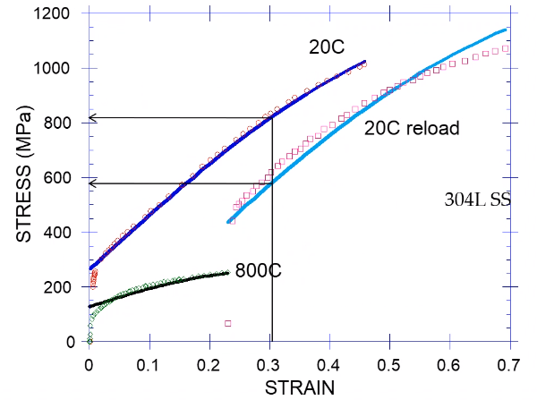 |
|:--:|
| Baumann’s ISV model can capture the changing boundary conditions of the same specimen when strained at $800^{\circ}C$ up to some deformation, stopped, and further strained under $20^{\circ}C$. Conventional models cannot fit this experimental data, but ISV can. |

!!! info Integrated Computational Materials Engineering
    ICME starts with requirements at highest length scales.
    After downscaling these requirements down to lower length scales, those results are upscaled to higher length scales for validation by experiment.

| 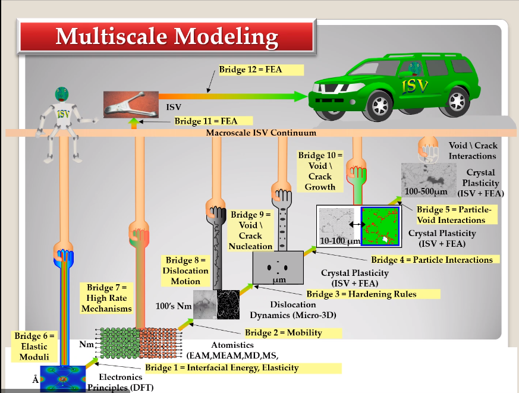 |
|:--:|
| Make this slide as your project proposal and abstract and emphasize which parts your work will focus on. |

| 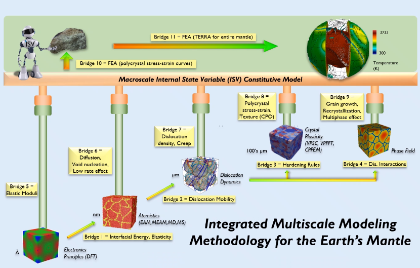 |
|:--:|
| This is Dr. Cho’s own ICME chart for his mantle convection problem. |

### Modeling Steel Molding and Stamping
| 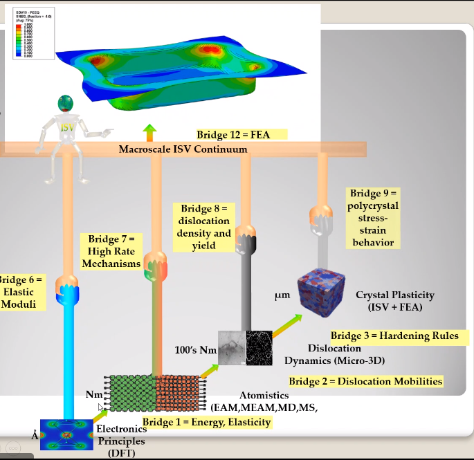 |
|:--:|
| The purpose of ICME is to do the modeling without experimental data at every stage in the process. |

For example, Julian could do **Molecular Dynamic** calculations for oxide reduction in copper foams without experimental data which is almost non-existent throughout literature.
**Density Functional Theory** is one such a tool to simplify the number of calculations from $10^{23}$ atoms and their interactions to the excited state of ground electrons as visualized through some dense field in the *Schrodinger* equation.

<!-- 220118 -->
## ICME Background
When we have the requirements for energies and elastic moduli of Al, then we can look down to the *Electronics* scale with DFT simulations of Al to determine how that length scale affects the properties of interest.
First principles calculations do not require external parameters and are self-contained.

**Schrodinger Equation (1926)**
Famous partial differential equations (PDE) to solve wave equation.
Solves $x(t) = \Psi(\phi, t)$ by solving $F = ma$.

$$\begin{equation}
i\hbar\frac{\partial\Psi}{\partial t} = -\frac{\hbar^{2}}{2m}{\partial^{2} \Psi}{\partial x^{2}} + V\Psi,
\end{equation}$$

where $\hbar = \frac{h^{2}}{2\pi} = 1.054572e-34~J-s$

**Molecular Dynamics**
Calculates the thermal fluctations of the atoms to find the bond strength and interfacial energies between atoms.
Approximating these behaviors at higher length scales minimizes the number of calculations needed to perform down from $nA$, where $A$ is Avagaddro’s Number.
By applying external loading and boundary conditions, dislocation dynamics (MDDP) can observed dislocation mobility where MEAM governs material behavior.

**Energy: Embedded Atom Method (EAM)**
$$\begin{equation}
E = \sum_{i}F^{i}\bigg(\sum_{j \neq i}\rho^{i}(r^{ij})\bigg) + \frac{1}{2}\sum_{ij}\phi^{ij}(r^{ij}),
\end{equation}$$

where $F^{i}$ is the embedding energy of atom, $i$; $\rho^{i}$ is the electronic density of atom $i$; $r^{ij}$ is separation distance between atom $i$ and $j$; and, $\phi^{ij}$ is the pair potential of atom $i$ and $j$.
These simulations only last a few femtoseconds; therefore, pick a strain-rate you can actually solve!

**Determination of Atomic Stress Tensor**
$$\begin{equation}
\begin{split}
E &= \sum_{\alpha}\Big( F(\bar{\rho_{\alpha}}) + \frac{1}{2}\sum_{\gamma \neq \alpha}\big(\phi(r^{\alpha\gamma})\big) \Big) \\
f^{\alpha} &= -\nabla_{\alpha}E \\
\beta_{ij}^{\alpha} &= -\frac{1}{v}(mv_{i}v_{j})^{\alpha} - \frac{1}{2V}\sum_{\gamma \neq \alpha}r^{ij}f_{j}^{\alpha\gamma} \\
\bar{\rho_{\alpha}} &= \rho_{\text{free surfaces}} + \rho_{\text{shear}} + \rho_{\text{crystal asymmetry}}
\end{split}
\end{equation}$$

**Comparison of DFT and MEAM**
Many potentials of pure materials have been found so you do not need to discover them.
However, we will still perform these calculations as an exercise for the homeworks.
**Finding these MEAM parameters to fit the DFT data can take up to 6 months.**

| 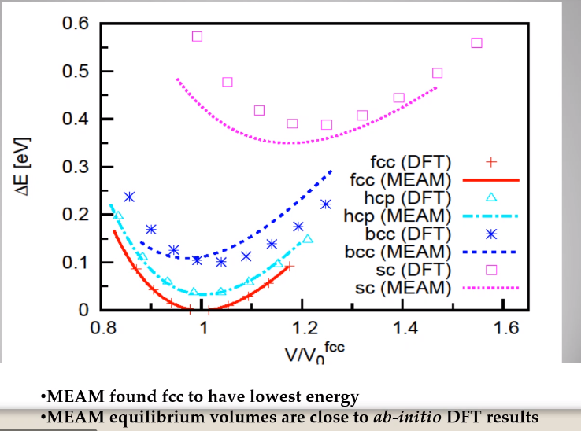 |
|:--:|
| Comparison of DFT and MEAM parameters for Al. |

The required parameter is dislocation mobility in dislocation dynamics.
E.g. we can find hardening parameters within single crystals.
These calculations can also handle point defects and vacancies.

| 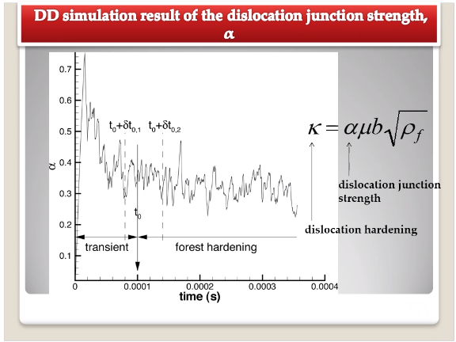 |
|:--:|
| We use the steady-state behavior in the forest $\alpha$ at higher length-scales. |

Critical Resolved Shear Stress (CRSS)
: The minimum stress required to cause slip within a crystal.

Each grain has its own orientation (CRSS) that must interact with other crystals.
The *Crystal Plasticity* calculations approximate these interactions at the **Macroscale**.

| 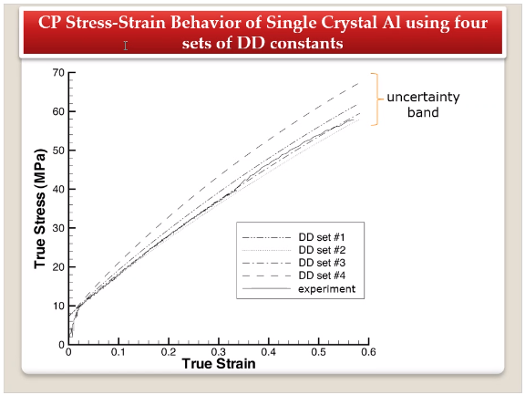 |
|:--:|
| *Crystal Plasticity* codes well captured the experimental behavior which validates the codes. |

Now we can upscale from the **Microscale** *Crystal Plasticity* calculations up to the **Macroscale** *Continuum* level.
This later produces the ISV-model parameters.

<!-- 220120 -->

| 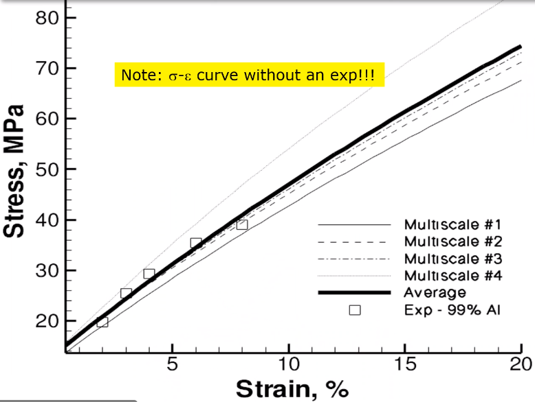 |
|:--:|
| Polycrstalline CP calculations with 180 grains with the four DD constant sets using the volume average. The strain of these polycrystalline materials is afforded by the grains slipping past each other. |

The *Critical Resolved Shear Stress* (CRSS) in polycrystalline materials vary with each grain and their orientation with respect to the applied loading and neighboring grains.
Single crystals do not have this limitation to allow deformation.
The **Inelasticity** class will focus on the constitutive equations for this deformation in the ISV paradigm.
In the damage-sensitive ISV model, damage increases as deformation increasing by tracking the increasing volume fraction of void free surface.
After calibrating the constants in the ISV model, we can move up to the **Mesoscale** *Continuum* scale.

| 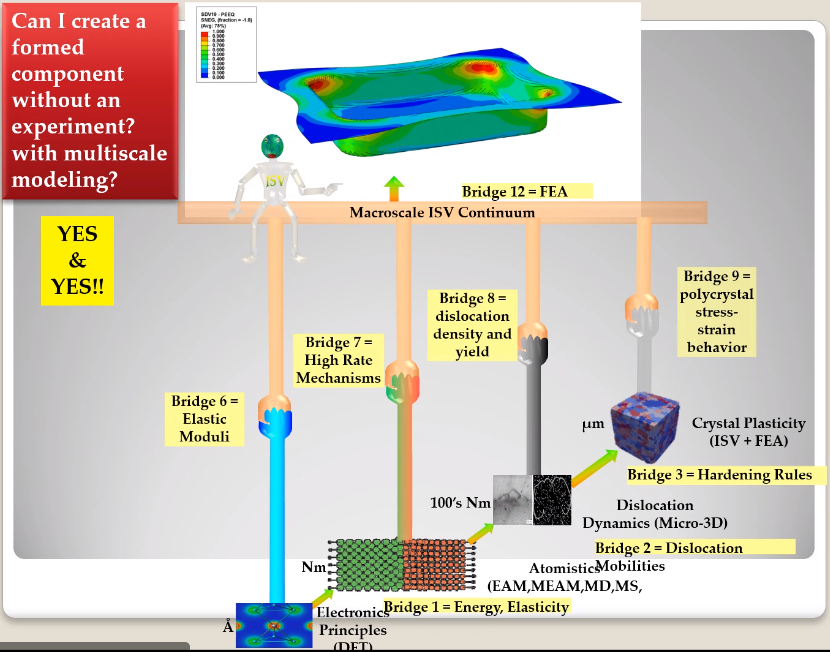 |
|:--:|
| Our proposal should follow a process similar to this and generate a similar graph. |

## Integrated Physical Motivations for Modeling Pore/Void Coalescence in Ductil Materials: A Multiscale Fracture Approach
### Introduction
| 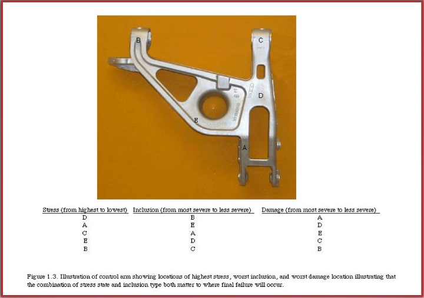 |
|:--:|
| Point C had the most void inclusions and was predicted to fail there before examining through ISV to determine failure actually occurs at point A with most damage. |

| 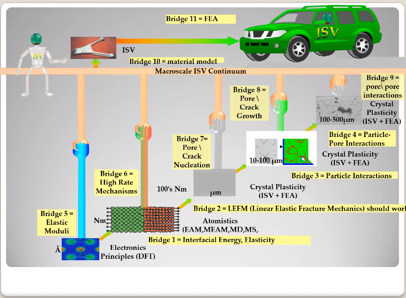 |
|:--:|
| This process was performed by Dr. Horstemeyer. |

Voids easily nucleate at interfaces between matrix and secondary phases.
This happens by debonding between matrix and second phase particle.
This can also happen by the second phase particles fracturing.
Damage increases with more abundant #voids and larger #voids.
Voids coalesce when within a certain distance to each other when they reach a critical size.

**Scales of Importance**
- Electronic Principles: gave bi-material elastic interfacial energy and moduli
- Atomistic: gave critical stress for interface debonding
- Microscale: gave temperature dependence on void-crack nucleation and microstructural morphological effects such as particle size, shape, and spacing
- …​

| 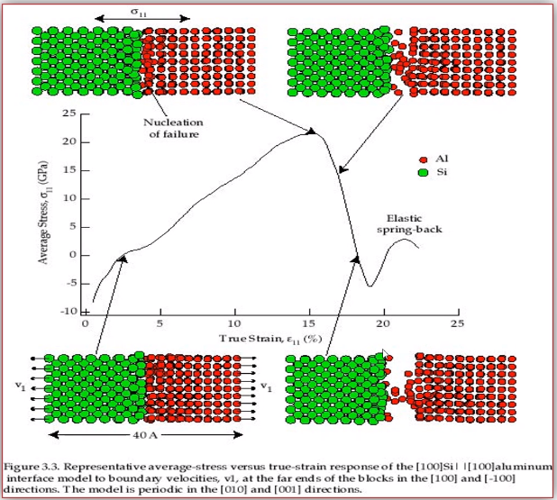 |
|:--:|
| Debonding begins to occur between bi-material structures at sufficient strains. |

| 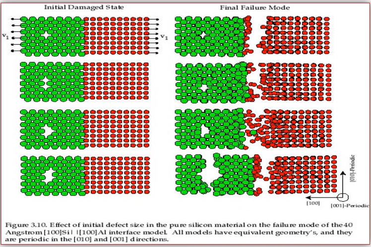 |
|:--:|
| If given an initial void in the silicon, then the failure mode can be tracked given some strain rate. Failure occurs at the interface. |

| 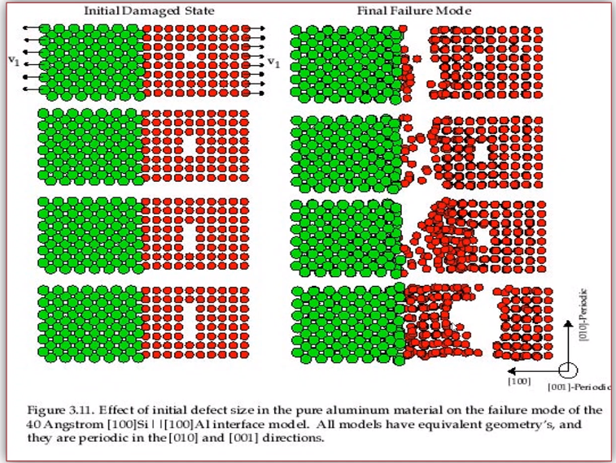 |
|:--:|
| If the void is put in the aluminum, then failure occurs in the aluminum. |

| 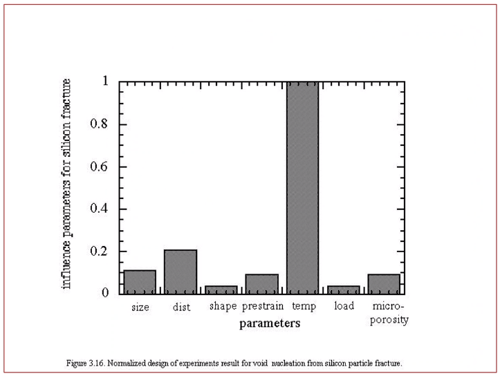 |
|:--:|
| By playing with various configurations of void geometry and relation within some material of varying temperatures, temperature was found to be the most important parameter. From this, lower temperature means increased void nucleation and higher temperatures increase the void coalescence. |

!!! question If two identical cars were made in Alaska and Arizona and are later driven to the other location, then which car fails first? The Alaska to Arizona or the Arizona to Alaska?? <cite> Dr. Cho
    The Alaska to Arizona fails first for quickly nucleating #voids in the lower temperatures and then coalescing them at elevated temperatures.

<!-- 220125 -->
### Physical Observations of Ductile Fracture and the Role of Pore/Void Coalescence
Three mechanisms of damage under deformation
1. Void Nucleation
2. Void Growth
3. Void Coalescence

Each of these mechanisms are accounted for in the ISV codes.
The purpose of numerical experiments at the lower length scales was to determine which of these mechanisms dominated and what allowed that mechanism to do so.
After #voids nucleate, they coalesce together by "bonding" shear bands once grown to a critical size and in close proximity to other #voids.

Triaxiality
: The ratio between the hydrostatic and deviatoric stresses.