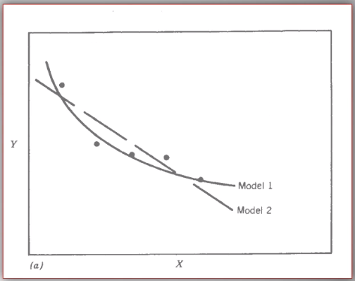
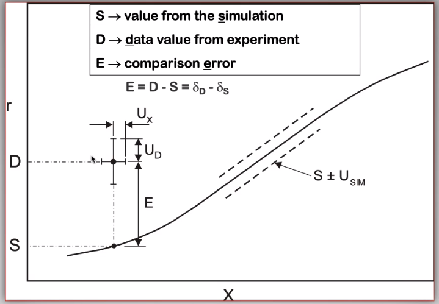

<!-- 220201 -->
# Verification and Validation of Simulations (Uncertainty Analysis)

Verification
: Doing things right.
    The mathematical models are consistent.

Validation
: Doing the right thing.
    Connecting experimental results to numerical ones.

!!! example Example
    The ISV codes include constitutive equations for governing, phenomenological behaviors of materials with parameters for certain unknowns to find the tangent modulus while the material work-hardens.
    The codes must be consistent within themselves and in relation to other equilibrium and compatibility equations and everything has the correct units: i.e. this verifies the codes.
    With these parameters, the ISV codes can very closely match the experimental results of stress-strain data which validates the codes.

|  |
|:--:|
| Consider the comparison between a simulation result and experimental data. |

The *Verification & Validation (V&V) Process* can answer this question.
Uncertainties determine:
- the scale at which meaningful comparisons can be made.
- the lowest level of validation which is possible: i.e. the noise level.
Thus, the uncertainties in the data and the simulation must be considered if meaningful conclusions are to be drawn.

|  |
|:--:|
| Graphical depiction of uncertainty analysis in validation. |

**Uncertainty Definitions**
- $\delta_{s}$, simulation composed of:
  - $\delta_{SN}$, numerical errors of equations
  - $\delta_{SPD}$, errors from implementing previous, experimental data
  - $\delta_{SMA}$, errors accrued from simulation modeling assumptions Therefore, the comparison error, $E = D - S = \delta_{D} - \delta_{S}$ or $E = \delta_{D} - \delta_{SN} - \delta_{SPD} - \delta_{SMA}$. A primary objective of a validation effort is to assess the simulation modeling error, $\delta_{SMA}$. When we do not know the value of an error, we estimate an uncertainty interval, $\pm U$ that bounds that error. Then work can progress with this uncertainty band rather than direct errors. The uncertainty interval, $\pm U_{E}$, which bounds the comparison error, $E = D - S$, is given by (assuming no correlations among the errors): $$\begin{equation}
U_{E}^{2} = \Bigl(\frac{\partial E}{\partial D}\Bigr)^{2}U_{D}^{2} + \Bigl(\frac{\partial E}{\partial S}\Bigr)^{2}U_{S}^{2}
\end{equation}$$

The leading, partial derivatives are the respective sensitivies for the experimental and simulation errors.
Typically, this is taken to be the gradient.
$U_{D}$ can be estimated using well-accepted experimental uncertainty analysis techniques.
The estimation of $U_{SN}$ is the objective of verification: e.g. grid convergence studies, stability, convergence, etcetera.
Estimating $U_{SPD}$ for a case in which the simulation uses previous (input) data for $m$ variables where the $U_{d_{i}}$ are the uncertainties associated with the input data.
Comparison of simulation predication and benchmark experimental data can be used to estimate $U_{SMA}$ which is the primary objective of validation.
For example, $U_{SPD}^{2} = \sum_{i = 1}^{m}\Bigl(\frac{\partial S}{\partial d_{i}}\Bigr)^{2}(U_{d_{i}})^{2}$.

We define a validation uncertainty, $U_{VAL}$ given by: $$(U_{VAL})^{2} = (U_{E})^{2} - (U_{SMA})^{2} = (U_{D})^{2} + (U_{SN})^{2} + (U_{SPD})^{2}$$

By [Eq. 5](#eq-validation_uncertainty):

$$|E| \begin{cases}
< U_{VAL} &, \text{ level of validation is equal to } U_{VAL} \\
> U_{VAL} &, \text{ the level of validation is equal to } |E|
\end{cases}$$

If $|E| >> U_{VAL}$, then the level of validation is equal to $|E|$ *and* one can argue that $\delta_{SMA} \approx E$ since $\pm U_{VAL}$ should contain the resultant of all errors except $\delta_{SMA}$.
The important metric is the required level of validation, $U_{reqd}$, which is set by program objectives.

|  |
|:--:|
| Schematic of verification and validation of a simulation. |

!!! info There exist many types of uncertainty analysis
    - Monte Carlo
    - First Order Taylor Series
    - Univariate Dimension Reduction Extended Generalized Lambda Distribution (probability distribution function)
    - Random Field Karhunen-Loeve Expansion of Random Field
    - Uncertainty Propagation

    [see this reference](https://www.sciencedirect.com/science/article/pii/S0020768309003679)

**Summary**
- Preparation: specify validation variables, set points, etcetera.
Experimentalist and modeler must work together.
Verification: doings things right to estimate $U_{SN}$.
Validation: doing the right thing to assess $\delta_{SMA}$.