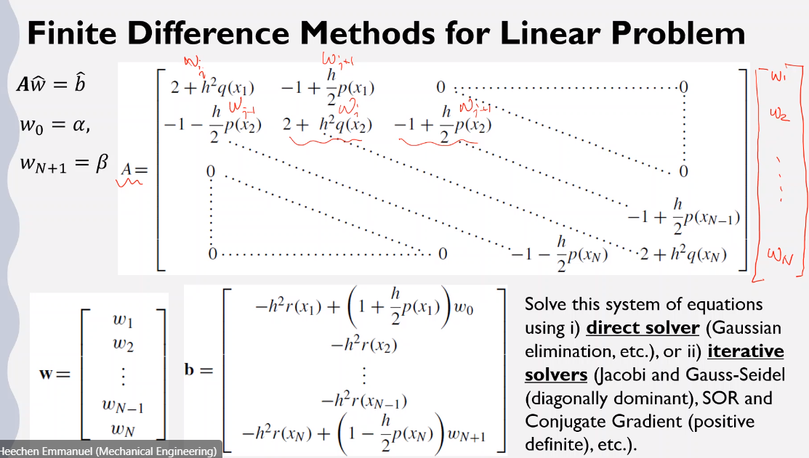

# finite-difference-method

Differs from the #FEM and #FVM.
Example of #dirichlet-boundary-condition.
Approximates #BVP with first-order equations requiring only one initial condition and second-order requiring two initial conditions.
Recall a linear, second-order #BVP: $y'' = p(x)y' + q(x)y + r(x)~\text{for}~a \leq x \leq b$, where $y(a) = \alpha$ and $y(b) = \beta$.
Using a #Taylor-polynomial about a point $x_{i}$ evaluated at $x_{i - 1}$ and $x_{i +1}$ and adding these two equations together, we find an approximation for for $y''$, $$\begin{split}y(x_{i - 1}) &= y(x_{i} + h) \approx y(x_{i}) + hy'(x_{i}) + \frac{h^{2}}{2}y''(x_{i}) + \frac{h^{3}}{3!}y'''(x_{i}) + \frac{h^{4}}{4!}y''''(x_{i}) \\\\ y(x_{i + 1}) &= y(x_{i} - h) \approx y(x_{i}) - hy'(x_{i}) + \frac{h^{2}}{2}y''(x_{i}) - \frac{h^{3}}{3!}y'''(x_{i}) + \frac{h^{4}}{4!}y''''(x_{i})\end{split}$$ When adding together and using a #centered-difference-method, $$\implies y''(x_{i}) \approx \frac{y(x_{i} + h) - 2y(x_{i}) + y(x_{i} - h)}{h^{2}} - 2\big(\frac{h^{2}}{4!}\big)y''''(x_{i})$$ Subtracting in the similar can approximate $y'(x_{i})$.
$$y'(x_{i}) \approx \frac{y(x_{i} + h) - y(x_{i} - h)}{2h} - \big(\frac{h^{2}}{3!}\big)y'''(x_{i})$$ These converge $\converge{h^{2}}$.

*[FVM]: Finite Volume Method

Plugging these into the general form: $$\begin{split}y'' &= p(x)y' + q(x)y + r(x) \\\\ \implies -r(x_{i}) &= -\frac{w_{i + 1} - 2w_{i} + w_{i - 1}}{h^{2}} + p(x_{i})\frac{w_{i + 1} - w_{i - 1}}{2h} + q(x_{i})w_{i}\end{split}$$ where $w_{0} = \alpha,~w_{N+1} = \beta$. Finally, these equations can be represented in $\mathbb{R}^{N}$ with $\mathbf{A}\hat{w} = \hat{b}$

|  |
|:--:|
| Be careful of indeces! The first and last elements of $\hat{b} = \alpha,~\beta$, respectively. |

#direct-solver or #iterative-solver can be used to solve system of equations, $\mathbf{A}\hat{w} = \hat{b}$.