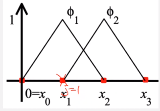

# finite-element-method

Sometimes called the #variational-formulation. Often used when needing to minimize the free energy in systems. However, this method differs from what we have learned:
- #Linear-Shooting-Method: uses entire domain to solve #BVP with pair of #IVP.
- #FDM: discretizes domain and finds the finite differences.

*[FDM]: Finite Difference Method

Differential Equation (two-point #BVP)
: $\begin{cases}-\frac{d}{dx}\bigg(p(x)\frac{du}{dx}\bigg) = f(x) &, 0 \leq x \leq 1 \\\\ u(0) = 0 &, u(1) = 0\end{cases}$

Linear Space
: $\require{amssymb} V = \{\mathcal{v} \colon \mathcal{v} \in \mathcal{C}^{0}[0, 1]\}$ , $\mathcal{v}'$ is piecewise continuous on $[0,1],~\text{and}~\mathcal{v}(0) = \mathcal{v}(1) = 0$.

This space can be solved by multiplying both sides by $\mathcal{v}$ and #integration-by-parts over the domain $(0 \leq x \leq 1)$,

$$\begin{split}
\int_{0}^{1}-(pu')'\mathcal{v}dx &= \int_{0}^{1}f\mathcal{v}dx \\\\
 &= \require{cancel}\cancelto{0}{-pu'\mathcal{v}\big\rvert_{x = 0}^{x = 1}} + \int_{0}^{1}pu'\mathcal{v}'dx = \int_{0}^{1}pu'\mathcal{v}'dx \\\\
\int_{0}^{1}pu'\mathcal{v}'dx &= \int_{0}^{1}f\mathcal{v}dx
\end{split}$$

#FEM is better for #Lagrangian problems: solid mechanic where the domain changes with deformation. Fluids likes #FDM for fixed volume and nodal spacing: #Eulerian.

Minimization Problem
: The function $u$ is the unique solution to the differential equation iff $u$ is the unique function that minimizes the following integral:

$$\begin{equation}
I(\mathcal{v}) = \int_{0}^{1}\big[p(x)(\mathcal{v}'(x))^{2} - 2f(x)\mathcal{v}(x)\big]dx
\label{eq:minimization_problem}
\end{equation}$$

Equation \eqref{eq:minimization_problem} formed by substituting $\mathcal{v}$ for $u$: $\int_{0}^{1} pu'\mathcal{v}'dx = \int_{0}^{1}f\mathcal{v}dx$ wherein the #basis-function is $\mathcal{v}$. The function is $C^{n}$.

## Formulation of FEM
- Partitioning: domain is partitioned into a collection of elements of the mesh size, $h$.
- Sub-space and #basis-function ($\phi_{j}$): A finite-dimensional sub-space ($u_{h}$) is set to represent the numerical solution as a linear combination of #basis-function: $$\begin{equation}u_{h}(x) = \sum_{j = 1}^{n}c_{j}\phi_{j}(x)\label{eq:basis_function}\end{equation}$$ Common use of #basis-function are polynomials: linear, quadratic, cubic, #Lagrangian-Polynomial.
- Application of variational principles: Different #FEM are formulated with various variational principles: e.g. minimization principle for #Rayleigh-Ritz, weighted residual for #Galerkin, #least-squares, collocation evaluation, etcetera.

Linear FEM (k = 1)
: The nodal points coincide with the grid points $\{x_{j}\}$. The #basis-function associated with $x_{j}$ is defined as:
$$\begin{equation}
\phi_{j}(x) = \begin{cases}
0 &, x < x_{j - 1} \\\\
\frac{1}{h_{j}}(x - x_{j - 1}) &, x \in [x_{j - 1}, x_{j}] \\\\
\frac{1}{h_{j + 1}}(x_{j + 1} - x) &, x \in [x_{j}, x_{j + 1}] \\\\
0 &, x_{j + 1} < x
\end{cases}
\label{eq:linear_fem}
\end{equation}$$

|  |
|:--:|
| Piecewise continuous within grid points. $\phi$ is only valid at node points to left and right of that examined. All other nodes are set to $0$. |

Quadratic #FEM (k = 2)
: On each sub-interval, the #basis-function is a quadratic polynomial, which requires to determine three coefficients: three points must be set on each sub-interval. The two endpoints are nodal points, and the middle point is an extra point. Higher #basis-function are more precise but require more calculations.

|  |
|:--:|
| Recall #Lagrangian-Polynomials, which are most common #basis-function. |

#Rayleigh-Ritz
: The solution $u$ is approximated by minimizing the integral not over all the functions, but over the piecewise set of functions (#basis-function). The #basis-function are linearly independent and satisfy $\phi_{i}(0) = \phi{i}(1) = 0$.
$$\begin{equation}
\begin{split}
\mathcal{v}(x) &= \sum_{j = 1}^{n}c_{j}\phi_{j}(x) \\\\
I(\mathcal{v}) &= \int_{0}^{1}[p(x)(\mathcal{v}'(x))^{2} - 2f(x)\mathcal{v}(x)]dx \\\\
\frac{dI}{dc_{i}} &= \int_{0}^{1}2p(x)\big(\sum_{j = 1}^{n}c_{j}\phi_{j}'\big)\phi_{j}'dx - \int_{0}^{1}2f(x)\phi_{j}(x)dx = 0
\end{split}
\label{eq:rayleigh_ritz_method}
\end{equation}$$

For a minimum to occur, it is necessary when considering $I$ as a function of $c_{j}$ to have $\frac{dI}{dc_{j}} = 0$, where $c_{j}$ is the coefficient to the #basis-function.

$$\begin{equation}
\sum_{j = 1}^{n}\bigg[\int_{0}^{1}p(x)\phi_{j}'(x)\phi_{i}'(x)dx\bigg]c_{j} = \int_{0}^{1}f(x)\phi_{i}(x)dx, \\\\ \text{for each } i \in [1, n]
\label{eq:rayleigh_ritz_method_coefficient}
\end{equation}$$

If $a_{ij} = \int_{0}^{1}p(x)\phi_{j}'(x)\phi_{i}'(x)dx$ and $b_{i} = \int_{0}^{1}f(x)\phi_{i}(x)dx$, then Eq. \eqref{eq:rayleigh_ritz_method} can be expressed as $\mathbf{A}\vec{c} = \vec{b}$ which is an $n \text{ x } n$, linear system of equations.

Now we assemble all pieces into one matrix, $\mathbf{A}$, which is #positive-definite, and $\vec{b}$. Recall #numerical-quadrature to solve the integrals. Let us first consider the simplest case for linear #FEM:

$$\begin{split}
\phi_{j}(x) &= \begin{cases}\frac{1}{h_{j}}(x - x_{j - 1}) &, x \in [x_{j - 1}, x_{j}] \\\\ \frac{1}{h_{j + 1}}(x_{j + 1} - x) &, x \in[x_{j}, x_{j +1}] \\\\ 0 &, \text{elsewhere}\end{cases} \\\\
\phi_{j}'(x) &= \begin{cases}\frac{1}{h_{j}} &, x \in [x_{j - 1}, x_{j}] \\\\ -\frac{1}{h_{j + 1}} &, x \in[x_{j}, x_{j +1}] \\\\ 0 &, \text{elsewhere}\end{cases}
\end{split}$$

$\\{x \in (x_{j - 1}, x_{j + 1}) | \phi_{j}(x) \neq 0 \text{ and } \phi_{j}'(x) \neq 0\\}$.

Recall Eq. \eqref{eq:rayleigh_ritz_method}: $$\sum_{j = 1}^{n}\bigg[\int_{0}^{1}p(x)\phi_{j}'(x)\phi_{i}'(x)dx\bigg]c_{j} = \int_{0}^{1}f(x)\phi_{i}(x)dx, \\\\ \text{for each } i \in [1, n]$$ which is the definition of the #Rayleigh-Ritz, and the substitutions, $a_{ij} = \int_{0}^{1}p(x)\phi_{j}'(x)\phi_{i}'(x)dx$ and $b_{i} = \int_{0}^{1}f(x)\phi_{i}(x)dx$. Non-zero entries in $i$-th row of $\mathbf{A}$ are $a_{i, i-1}$, $a_{i, i}$, and $a_{i, i + 1}$. $$a_{i,i} = \int_{0}^{1}p(x)\phi'(x)\phi'(x)dx = \bigg(\frac{1}{h_{i}}\bigg)^{2}\int_{x_{i - 1}}^{x_{i}}p(x)dx + \bigg(-\frac{1}{h_{i + 1}}\bigg)^{2}\int_{x_{i}}^{x_{i + 1}}p(x)dx$$ For the integration, we will use the #Trapezoidal-Rule (Eq. \eqref{eq:trapezoidal_quadrature}).

|  |
|:--:|
| Use the #Trapezoidal-Rule to approximate the area under the curve of some function. **Assumes equal spacing for $x$.** |

$$\begin{equation}
\int_{a}^{b}f(x)dx = \frac{h}{2}[f(x_{0}) + f(x_{1})] - \frac{h^{3}}{12}f''(\xi)
\label{eq:trapezoidal_quadrature}
\end{equation}$$

Following the form of Eq. \eqref{eq:trapezoidal_quadrature} with $$\phi_{j}'(x) = \begin{cases}\frac{1}{h_{j}} &, x \in [x_{j - 1}, x_{j}] \\\\ -\frac{1}{h_{j + 1}} &, x \in[x_{j}, x_{j +1}] \\\\ 0 &, \text{elsewhere}\end{cases}$$ yields:

$$\begin{split}
a_{i, i} &= \int_{0}^{1}p(x)\phi_{i}'\phi_{i}'dx \\\\
 &= \bigg(\frac{1}{h_{i}}\bigg)^{2}\int_{x_{i - 1}}^{x_{i}}p(x)dx + \bigg(-\frac{1}{h_{i + 1}}\bigg)^{2}\int_{x_{i}}^{x_{i + 1}}p(x)dx \\\\
 &= \bigg(-\frac{1}{h_{i}}\bigg)\bigg(\frac{1}{h_{i}}\bigg)(p(x_{i - 1}) + p(x_{i})) + \bigg(-\frac{1}{h_{i + 1}}\bigg)^{2}\frac{h_{i + 1}}{2}(p(x_{i}) + p(x_{i + 1})) \\\\
a_{i, i} &\approx \frac{p(x_{i - 1}) + p(x_{i})}{2h_{i}} + \frac{p(x_{i}) + p(x_{i + 1})}{2h_{i + 1}} \\\\
a_{i, i - 1} &= \int_{0}^{1}p(x)\phi_{i - 1}'\phi_{i}'dx \\\\
 &= \int_{x_{i - 2}}^{x_{i - 1}}p(x)\phi_{i - 1}'\phi_{i}'dx + \int_{x_{i - 1}}^{x_{i}}p(x)\phi_{i - 1}'\phi_{i}'dx \\\\
 &= \bigg(-\frac{1}{h_{i}}\bigg)\bigg(\frac{1}{h_{i}}\bigg)\int_{x_{i - 1}}^{x_{i}}p(x)dx \\\\
a_{i, i - 1} &\approx -\frac{1}{h_{i}^{2}}\frac{h_{i}}{2}(p(x_{i - 1}) + p(x_{i})) = -\frac{p(x_{i - 1}) + p(x_{i})}{2h_{i}} \\\\
a_{i, i + 1} &= \int_{0}^{1}p(x)\phi_{i + 1}'\phi_{i}'dx \\\\
 &= \int_{x_{i}}^{x_{i + 1}}p(x)\phi_{i + 1}'\phi_{i}'dx + \int_{x_{i + 1}}^{x_{i + 2}}p(x)\phi_{i + 1}'\phi_{i}'dx \\\\
 &= \bigg(-\frac{1}{h_{i + 1}}\bigg)\bigg(\frac{1}{h_{i + 1}}\bigg)\int_{x_{i}}^{x_{i + 1}}p(x)dx \\\\
a_{i, i + 1} &\approx -\frac{1}{h_{i + 1}^{2}}\frac{h_{i + 1}}{2}(p(x_{i}) + p(x_{i + 1})) = -\frac{p(x_{i}) + p(x_{i + 1})}{2h_{i + 1}}
\end{split}$$

Similarly, we can find $b_{i}$:

$$\begin{split}
b_{i} &= \int_{0}^{1}f(x)\phi_{i}dx \\\\
 &= \int_{x_{i - 1}}^{x_{i}}f(x)\phi_{i}dx + \int_{x_{i}}^{x_{i + 1}}f(x)\phi_{i}dx \\\\
 &= \bigg(\frac{1}{h_{i}}\bigg)\int_{x_{i - 1}}^{x_{i}}f(x)(x - x_{i - 1})dx + \bigg(\frac{1}{h_{i + 1}}\bigg)\int_{x_{i}}^{x_{i + 1}}f(x)(x_{i + 1} - x)dx \\\\
b_{i} &\approx \frac{1}{h_{i}}\frac{h_{i}}{2}(f(x_{i - 1})0 + f(x_{i})(x_{i} - x_{i - 1})) + \frac{1}{h_{i + 1}}\frac{h_{i + 1}}{2}(f(x_{i + 1} - x_{i}) + f(x_{i + 1})0) \\\\
b_{i} &\approx \frac{h_{i}}{2}f(x_{i}) + \frac{h_{i + 1}}{x}f(x_{i}) = \frac{1}{2}f(x_{i})(h_{i} + h_{i + 1})
\end{split}$$

Finally, assemble $\mathbf{A}\vec{x} = \vec{b}$ with $b_{i} = a_{i, i - 1}c_{i - 1} + a_{i, i}c_{i} + a_{i, i + 1}c_{i + 1}$.

!!! hint
	$\vec{c} \equiv \vec{x}$, which is the solution vector requiring an initial guess.

!!! example Use the linear #Rayleigh-Ritz to approximate the solution to the following #BVP: $$-\frac{d}{dx}\bigg((x + 1)\frac{du}{dx}\bigg) + 6u = -12x^{4} + 44x^{3} - 2x + 1 \text{, where } 0 \leq x \leq 1 \text{ and } u(0) = u(1) = 0$$ using $x_{0} = 0$, $x_{1} = 0.3$, $x_{2} = 0.7$, and $x_{3} = 1$ Compare to exact solution: $u(x) = \dots.
	|  |
	|:--:|
	| Determine $\phi$, which is the #basis-function, at each nodal point from the left and right sides.. |

	Recalling $h_{j} = x_{j} - x_{j - 1}$, $u_{h} = \sum_{j = 1}^{2}c_{j}\phi_{j}$ implies $u_{1} = c_{1}\phi_{1} + c_{2}\phi_{2}$ ($u(x_{0}) = 0; u(x_{3}) = 0$). Recall the #basis-function (Eq. \eqref{eq:basis_function}).

	By definition: $\phi_{1} = \frac{x - x_{2}}{x_{1} - x_{2}}$ and $\phi_{2} = \frac{x - x_{1}}{x_{2} - x_{1}}$ which are linear #Lagrangian-Polynomial. This follows that $\phi_{1, left}' = \frac{1}{h_{1}}$ and $\phi_{1, right}' = -\frac{1}{h_{2}}$. To find $a_{i, j}$ and $b_{i}$: $$\begin{split}a_{i, j} &= \int_{0}^{1}(x + 1)\phi_{j}'\phi_{i}' + 6\phi_{j}\phi_{i}dx \\\\ b_{i} &= \int_{0}^{1}(-12x^{4} + 44x^{3} - 2x + 1)\phi_{i}dx\end{split}$$ Non-zero entries in $i$-th row of $\mathbf{A}$ are $a_{i, i - 1}$ and $a_{i, i + 1}$.

	- $i = 1$:
		- $$\begin{split}a_{i, i} &= a_{1, 1} \\\\ &= \int_{0}^{1}(x + 1)\phi_{1}'\phi_{1}' + 6\phi_{1}\phi_{1}dx \\\\ &= \bigg(\frac{1}{h_{1}}\bigg)^{2}\int_{0}^{0.3}(x + 1)dx + \frac{6}{h_{1}^{2}}\int_{0}^{0.3}x^{2}dx + \bigg(-\frac{1}{h_{2}}\bigg)^{2}\int_{0.3}^{0.7}(x + 1)dx + \frac{6}{h_{2}^{2}}\int_{0.3}^{0.7}(x - 0.7)^{2}dx \\\\ &= \frac{2.3}{2h_{1}} - \frac{6(0.09)}{2h_{1}} + \frac{3}{2h_{2}} + \frac{6(0.16)}{2h_{2}} \\\\ &= -3.833\end{split}$$ and $$\begin{split}b_{i} &= b_{1} \\\\ &= \int_{0}^{1}(-12x^{4} + 44x^{3} - 2x + 1)\phi_{1}dx \\\\ &= \frac{1}{h_{1}}\int_{0}^{0.3}(-12x^{5} + 44x^{4} - 2x^{2} + x)dx + \bigg(-\frac{1}{h_{2}}\bigg)\int_{0.3}^{0.7}(-12x^{4} + 44x^{3} - 2x + 1)(x - 0.7)dx\end{split}$$
		- Furthermore, we must find $a_{i, i - 1}$ and $a_{i, i + 1}$: $$\begin{split}a_{i, i - 1} &= a_{1, 0} \\\\ &= \int_{0}^{1}(x + 1)\phi_{0}'\phi_{1}' + 6\phi_{0}\phi_{1}dx \\\\ &= -\bigg(\frac{1}{h_{1}}\bigg)^{2}\int_{0}^{0.3}(x + 1)dx - \frac{6}{h_{1}^{2}}\int_{0}^{0.3}(x - 0.3)xdx \\\\ &= -\frac{2.3}{h_{1}}\end{split}$$ and $$\begin{split}a_{i, i + 1} &= a_{1, 2} \\\\ &= \int_{2}^{1}(x + 1)\phi_{0}'\phi_{1}' + 6\phi_{2}\phi_{1}dx \\\\ &= -\bigg(\frac{1}{h_{2}}\bigg)^{2}\int_{0.3}^{0.7}(x + 1)dx - \frac{6}{h_{2}^{2}}\int_{0.3}^{0.7}(x - 0.3)(x - 0.7)dx \\\\ &= -\frac{3}{2h_{2}}\end{split}$$

Weigthed-Residual Approach (#Galerkin)
: This starts with residual of the differential equations. Approximate the solution with piecewise continuous #basis-function.
$$\begin{split}
-\frac{d}{dx}\bigg(p(x)\frac{du}{dx}\bigg) &= f(x) \\\\
-\frac{d}{dx}\bigg(p(x)\frac{du}{dx}\bigg) &= P(u) \\\\
R(u) &= P(u) - f \\\\
u_{h}(x) &= \sum_{j = 1}^{n}c_{j}\phi_{j}(x) \\\\
R(u_{h}) &= P(u_{h}) - f \neq 0
\end{split}$$

#Galerkin approach seeks an approximate solution, $u_{h} = \sum_{j = 1}^{n}c_{j}\phi_{j}(x)$ (Eq. \eqref{eq:basis_function}) that satisfies $\int_{0}^{1}R(u_{h})w(x)dx = 0$ for a sequence of weighted functions, $w(x)$ which are also called #trial-functions.

To solve the #Galerkin method:
$$\begin{split}
R(u_{h}) &= -\frac{d}{dx}\bigg(p(x)\frac{d}{dx}u_{h}(x)\bigg) - f(x) \\
 &= -\frac{d}{dx}\bigg(p(x)\frac{d}{dx}\sum_{j = 1}^{n}c_{j}\phi_{j}(x)\bigg) - f(x) \\\\
\int_{0}^{1}R(u_{h})w(x)dx &= \int_{0}^{1}R(u_{h})\phi_{i}(x)dx = 0
\end{split}$$

!!! note
	Eventually this will equal the #Rayleigh-Ritz method if linear system of equations.