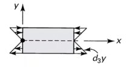

# fundamentals-of-elasticity

**Elasticity**

This chapter differs from others because of how we approach problems. Previously, we assume the stress/strain state and the mode of failure axiomatically by uniform distributions and average stress/strains. However, in most design studies, machines/equipment is much more complex; therefore, we need the principles of this chapter for more accurate designs. Typically, these are presented as partial differential equations (PDE). This requires two or more variables in the problems. Finite Element Analysis (FEA) allows one to solve for much more complex geometries for the compatibility equations.

1.  The general equilibrium equations from a free body diagram (FBD) of a differential, rectenagular element taken from a structural body of any shape/material;

2.  The strain-displacement equations and the equivalent compatibility equations from the geometry of the deformation of the same element; and,

3.  Constitutive equations for isotropic and orthotropic linearly elastic material models.

*insert math*

The 3 sets of equations available apply over the interioir of the structual body and are called the *field* or *domain equations*. Additionally, …​

Plane Elastic Problems  
Complex, 3D problems can be reduces to 2D problems.

Geometry  
A plane body consists of a region of uniform thickness *t*, bounded by two parallele planes, parallel to the *x**y*-plane, and by any closed surface.

Plane Stress Problem  
The thickness *t* is small compared to the dimensions in the parallel surfaces.

Plane Strain  
The thickness is large compared to the dimenions in the parallel planes.

|  |
|:--:|
| The strain depends on <em>x</em> and <em>y</em> only. |

Thus the equations are:

$$\[\epsilon\] = \begin{vmatrix}\frac{\partial u}{\partial x} & \frac{\partial u}{\partial y} + \frac{\partial v}{\partial x} & \frac{\partial w}{\partial x} + \frac{\partial u}{partial z} \\\
0 &  &  \\\
  &  & \end{vmatrix}$$

The stress relations: *insert math*

**Reduction to Stress Equations**

The stress/strain state and geometry must be determined so as to satisfy the strain equations, the stress-strain relationships, and the equilibrium equations as well as the boundary conditions. The compatibility equation, $\frac{\partial^{2}\gamma_{xy}}{\partial x\partial y} = \frac{\partial^{2}\epsilon_{x}}{\partial y^{2}} + \frac{\partial^{2}\epsilon_{y}}{\partial x^{2}}$, must be satisfied for the strain equations. This equation can be transformed into one equations involving the stress components by subsitituing the stress-strain relationships and equilibrium equations. *insert math* Next, the equilibrim equations are differentiated with respect to *x* and *y*, respectively, and added to yield: *insert math*

|  |
|:--:|
| This applies to very thin elements or components. |

The stress-strain relationships for plane stress: *insert math* The compatibility equations of interest: *insert math* The equilibrium equations: *insert math*

**Comparison of 2D Isotropic Problems**

A solution satisfying all these equations is, for a given problem, unique: that is, it is the *only* solution to the problem. In the absence of body forces or in the case.

Of the following table, you could solve the problem using one method and transform to the other.

Stress Function Technique  
Many engineering, plane-elastic problems can be solved by some method that employs the **Airy Stress Function** to reduce the general formulation to a single governing equation in terms of a single unknown.

In this approach, the underlying question is: "What if this was dependent on the second derivative of some function?" These equations still satisfy the equations of equilibrium and are substituted into the compatibility equations.

$$\begin{equation}
\frac{\partial^{4}\Phi}{\partial x^{4}} + \frac{\partial^{4}\Phi}{\partial x^{2}\partial y^{2}} + \frac{\partial^{4}\Phi}{\partial y^{4}} = \nabla^{4}\Phi = 0
\end{equation}$$

-   **Inverse method** assumes a solution which must be proven. Best solved by people with much experience with the problem.

-   **Semi-inverse method** solves PDE to satsify all conditions of the problem.

Many problems can be solved with *polynomials* which are much easier to work with. These assumed polynomials must satisfy the biharmonic equation ([Eq. 6-8](#eq-biharmonic)) and be of second degree or higher to yield a non-zero stress solution.

**Polynomial Solutions**

Solutions of the biharmonic equation using polynomial functions of various degress with unknown coefficients. .A second order polynomial function

$$\Phi_{2} &= \frac{a_{2}}{2}x^{2} + b_{2}xy + \frac{c_{2}}2}y^{2}$$

wherein, the corresponding stresses are: *σ**x* = *c*2, *σ**y* = *a*2, and *τ**x**y* =  − *b*2.

|  |
|:--:|
| All three stress components are <em>constant</em> throughout the body. |

|  |
|:--:|
| This can represent <em>pure bending</em>. |

**Fifth Order Polynomial**

Problems of practical importance may be solved by combining function second to fifth order polynomials.