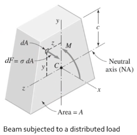
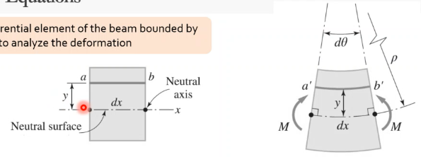
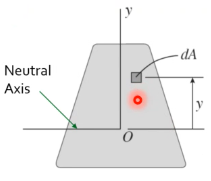
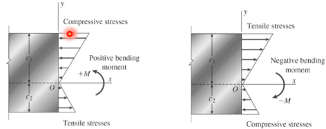
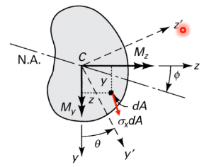
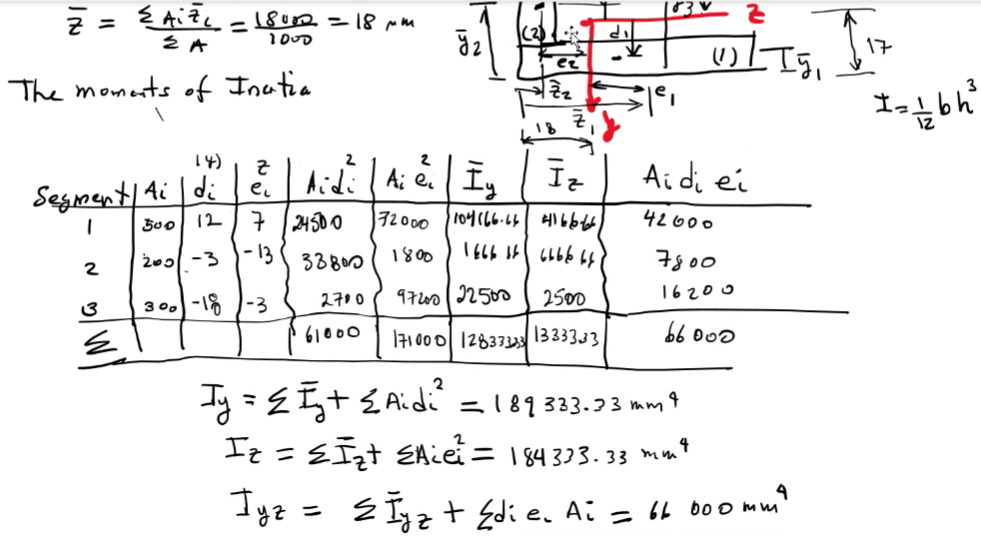
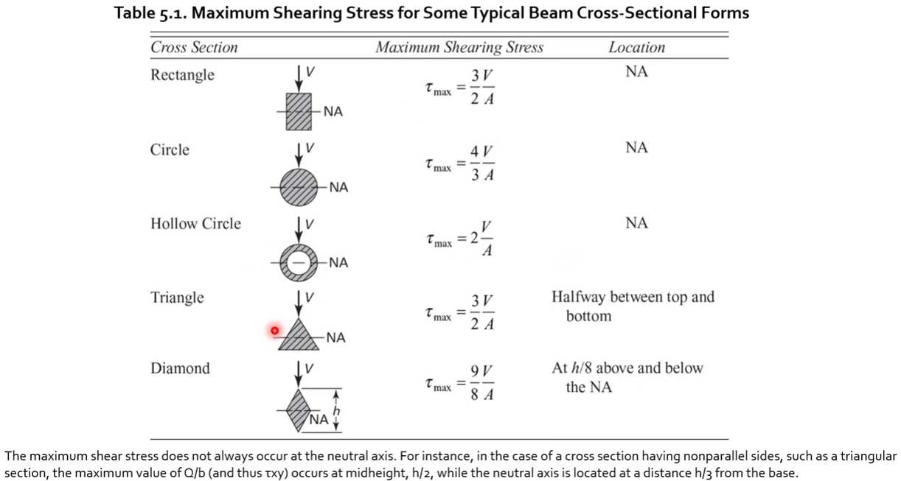

# pure-bending-of-beams-of-symmetrical-and-asymmetrical-cross-section

Developed by Euler and some other dude many years ago. The idea is to quantify how transverse loads affect a body via bending and shear stresses. Typically, we consider a prismatic, symmetric beam. **Most imperative is to assume planes remain plane.**

We apply the same methodoligies to solve these *statically indeterminate* problems:

1.  Equilibrium equations

2.  Compatibility equations

3.  Constitutive equations

|  |
|:--:|
| If we pass a section through the member <em>A</em><em>B</em>, the conditions of equilibrium can be applied. |

|  |
|:--:|
| We consider a differential element of the beam bounded by two cross-sections to analyze the deformation which warps due to the moments at either end. |

Be sure to remember to assign some convention for positive and negative directions. Typically, bending is assumed positive if bent as shown in [Fig. 8-2](#fig-compatibility_cross-section).

**Constitutive**

It is assumed that the material behaves elastically, and the yield strength is not exceeded. *The neutral axis must pass through the centroid of the area.*

|  |
|:--:|
| It shows that the stresses are directly proportional to the bending moment M and inversely proportional to the moment of inertia I of the cross-section. Also, the stresses vary linearly with the distance y from the neutral axis. |

|  |
|:--:|
| The maximum tensile and compressive bending stresses acting at any given cross-section occur at points located farthest from the neutral axis. |

**Symmetric Bending**

. image::engr-727-001-advanced-mechanics-of-materials/symmetric_bending_principles_220308_134422_EST.png\[caption="Figure {secs}-1. ", reftext="Fig. {secs}-1"\]

|  |
|:--:|
| Transverse loads do not act on the longitudinal plane of symmetry. |

|  |
|:--:|
| Now it is considered the general case in which a beam of arbitrary cross-section is subjected to end couples My and Mz about the y and z axes. |

Assume:

-   Plane section remain plane.

-   Normal stresses sx acting at a point within dA is a linear funciton of the y and z coordinates of the point.

-   The remaining stresses are zero.

**Stress Distribution**

Referring to [Fig. 8-6](#fig-pure_bending_in_asymmetrical_cross-section), we can apply the **Law of Superposition** to find moments of inertias about reference axes with respect to the neutral axis.

**Problem 1**

A timber member…​ Mz = -59.08 kN-m My = -10.42 kN-m

tan theta = (MyIz + MzIyz)/(MyIy + MzIy) = MyIz/MzIy = 14.25 deg

There exist critical points at the upper right and lower left corners of the elemental cross-section

$\sigma_{xa} = \frac{M_{y}I_{z}z_{a} - M_{z}I_{y}y_{a}}{I_{y}I_{z}}$ sxa=-10.034 MPa Hunter go -19.09 MPa.

|  |
|:--:|
| foo |

|  |
|:--:|
| foo |

### Bending in Composite Beams

These beams are fabricated of more than one material, but these beams still adhere to the methodologies postulated thus far.

**Strains and Stresses**

We assume the cross-sections remain plain during bending, regardless of the nature of the material.

**Neutral Axis**

The position of the neutral axis is found from the condition that the resultant axial force acting on the cross-section is zero. Since the curvature is a constant at any given cross-section, thus, the equation for locating the neutral axis becomes: *E*1∫1*y**d**A* + *E*2∫2*y**d**A* = 0.

**Moment-Curvature Relationship**

The moment-curvature relationship for a composite beam of two materials may be determined from the condition that the moment resultant of the benind stresses si equal to the bedming moment, *M* acting at the cross-section.

$$\begin{split}
M &= -\int_{A}\sigma_{x}ydA = -\int_{1}\sigma_{x1}ydA - \int_{2}\sigma_{x2}ydA \\\
 &= kE_{i}\int_{1}y^{2}dA + kE_{2}\int_{2}y^{2}dA
\end{split}$$

This last equation relates the second moments of the area (the moments of inertia) with respect to the neutral axis.

**Normal Stresses (Flexure Formulas)**

Normal stresses in the beam are obtained by substituting the expression for curvature into the expressions for *σ**x*1 and *σ**x*2: \eqalign_sans These expressions are known as the flexure formulas for a composite beam. While these expressions are direct and straightforward, civil and aerospace engineers typically use the transform.

#### Transformed Section Method

The method consists of transforming the cross-section of a composite beam into an equivalent cross-section of an imaginary beam that is composed of only one material. If the transformed beam is to be equivalent to the original beam, its neutral axis must be located in the same place, and its moment-resisting capacity must be the same.

**Normal Stresses**

The moment of inertia of the transformed section is related to the moment

#### Reinforced Concrete Beams

-   Concrete is very susceptible to cracking when it is in tension, thus, by itself is not suitable for resisting a bending moment.

-   When subjected to negative bending moments, are reinforced by steel rods placed a short distance above their lower face.

-   In the transformed section of a reinforced concrete beam, it is replaced the total cross-sectional area of the steel bars be an equivalent area.

-   Only the portion of the cross-section located above the neutral axis should be used in the transformed section.

-   To obtain *h*, it sirequired that the centroid C of the cross-sectional area of the transformed section to lie on the neutral axis: solve the following system of equations for *h*.

\begin{split} bh(\frac{h}{2}) - nA_{s}(d - h) &= 0 \\\ \frac{b}{2}h^{2} + nA_{s}h - nA_{s}d &= 0 \end{split}

### Shear Stresses in Thin-Walled Members and Shear Center in Beams

$$\begin{split}
\tau &= \frac{VQ}{It} \\\
\tau_{max} &= \frac{3}{2}\frac{V}{A}
\end{split}$$

**Shear Stress in a Circular Cross Section**

When a beam has a circular cross-section, we can no longer assume that the shear stresses act parallel to the y-axis. Theory or Elasticity explains that there exists shear stresses parallel to the surface instead of perpendicular.

$$\tau_{max} = \frac{4V}{3A}$$

|  |
|:--:|
| foo |

**Shear Stress in the Webs of Beams with Flanges**

When a beam of wide-flange shape is subjected to shear forces as well as bending moments, both normal and shear stresses are developed on the cross-sections.

$$\begin{split}
\tau &= \frac{V}{8It}\[b(h^{2} - h_{1}^{2}) + t(h_{1}^{2} - 4y_{1}^{2})\] \\\
\tau_{max} &= \frac{V}{8It}(bh^{2} - bh_{1}^{2} + th_{1}^{2}) \\\
\tau_{min} &= \frac{Vb}{8It}(h^{2} - h_{1}^{2}) \\\
\tau &= \frac{V}{A_{web}}
\end{split}$$

**Shearing Stresses in Thin-Walled Members**

Now we consider that the flanges of an I-beam are thin. An infinitesimal segment of a wide-flange beam is isolated for equilibrium analysis.

**The Concept of Shear Flow**

For thin-walled members, the concept of **shear flow** is used because this refers to a\*force per unit length\*. In terms of the shear stress, *τ* and wall thickness, *t*, the shear flow is: $q = \tau t = \frac{VQ}{I}$. The shear flow distribution in the flanges of wide-flange and channel sections can be determined: $q = \frac{VQ}{I} = \frac{V(\frac{d}{2})(\frac{b}{2} - x)t}{I} = \frac{Vt}{2I}(\frac{b}{2} - x)$.

.Shear Center To prevent twisting, the load P must be located at an eccentric distance, e from the web of the cross-section.

#### Shear Center in Thin-Walled Members: General

**Moments of Inertia for an Area about Inclined Axes**

It is sometimes necessary to calculate the moments and product of inertia *I**u*, *I**v*, and *I**u**v* when the values for *θ*, *I**x*, *I**y*, and *I**x**y* are known. Equilibrium equations transformation equations or tensors to relate the *x*, *y* and *u*, *v* axes. Principal moments of inertia equations are similar to those for principal stresses/strains.

1.  Determine the principal axes of inertia.

2.  Evaluate the shear flow acting on the cross-section when bending occurs about one of the principal axes.

3.  Determine the resultant of those forces.

4.  The shear center is located on the lin eof action of the resultant. Take the summation of moements with respect to a convenient point.

5.  Repeat the process for the other axis.

### Bending of Curved Beams

**Q:** What happens when a beam is curved? — Many of the same things that happen in a straight beam.

**A:** .Curved Beam Formula: Winkler’s Theory Stress distribution is non-linear because the neutral axis is non-linear. The centroid is not the neutral axis in a curved beam as was true in a straight beam. We make the following assumptions:

1.  All cross-sections possess a certical axis of symmetry lying in the plane of the centroidal axis passing through *C*.

2.  The beam is subjected to end couples, *M*. The bending moment vector if everywhere normal to the plane of symmetry of the beam. Sections originally plane and perpendicular to the centroidal beam axis remain so subsequent to bending.

3.  The influence of transverse shear on beam deformation is not taken into account.

    -   Lines *b**c* and *e**f* represent the plane sections before…​.