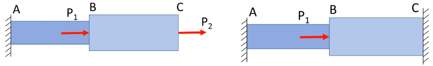
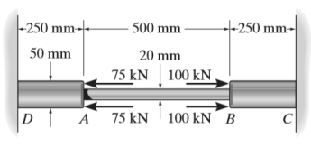

# strain-deformation-and-mechanical-properties

**Introduction**

Most bodies undergo some amount of elastic deformation under some external loading.

Strain  
A geometric quantity that measures the deformation of a body.

This is one of the most important topics in solid mechanics because strain quantifies the changes in geometry during deformation from applied stresses.

Normal Strain, *ϵ*  
In a direction *n̂*, this is defined as the change in length per unit length of the fibers oriented in the *n*-direction.

$$\begin{equation}
\epsilon_{\text{avg}} = \frac{\Delta s' - \Delta s}{\Delta s}
\end{equation}$$

In solid mechanics, if we consider the deformation of a prismatic bar, then we represent average strain as $\epsilon_{\text{avg}} = \frac{L - L_{0}}{L_{0}} = \frac{\delta}{L_{0}}$.

**Pure Shear**

Shear strain is allowed by the shear forces balancing each other out on each face of differential elements.

Shear Strain, *γ*  
The change in angles between two originally perpendicular line segments.

**Q:** Why are there two different notations for normal strain? — dk

**A:** If you do not have enough information to perform the integral, then you assume the average strain.

**Tension Testing: Mechanical Properties of Materials**

This is most important test for us. Slowly applying axial loads unto a cylindrical bar, the specimen, the strain can be measure for some strain-rate. Typically, the yield point of a specimen is determined the 0.2%-offset Method.

**Q:** How do we know the difference between brittle and ductile materials? — Dr. Lugo

**A:** This distinction is subjective, but in general, ductile materials undergo much more plastic strain (absorb more energy) before failure than "brittle" materials. Typically, this defining limit is held as 5% strain.

If we unload the specimen before the applied stress exceeds the yield point, then the material will elastically return to its original length. This holds true to viscoelastic materials; however, "visco-" connotes some time-dependence, but, ultimately, the specimen does return to its original geometry.

**Linear Elasticity and Hooke’s Law**

Most engineering materials have an initially, linear elastic region on the stress-strain diagram. This linear relationship between stress and strain for a material in simple tension can be expressed by:

*σ* = *E**ϵ*

This constitutive relationship is to us what Newton’s Second Law of Motion is to physics.

**True Stress-Strain Curve**

This differs from engineering strain, which considers that the cross-sectional area remains constant, by considering that the cross-sectional area changes with changes in overall length.

$$\begin{equation}
s = \frac{F}{A_{0}}
\end{equation}$$

$$\begin{equation}
\sigma = \frac{F}{A}
\end{equation}$$

In Advanced Mechanics of Materials, we consider only the elastic region; therefore, *s* and *σ* are considered equivalent which is true until sufficient plastic deformation. *s* and *σ* are related by:

$$\begin{split}
\sigma &= s(1 + e) \\\
\epsilon &= \ln(1 + e)
\end{split}$$

Strain-Hardening  
True stress increases continuously until sufficient plastic strain allows for the material to begin necking.

<!-- -->

Axial Deformation  
When axial loads are applied to a member.

We must make key assumptions:

-   asdf

By these, we get an equilibrium equation: $\delta = \frac{PL}{AE}$. If the member has regions of different cross-sectional areas and loads applied not only at the ends of the body, then the Law of Superposition can be applied to find total elongation: $\delta = \sum\frac{PL}{AE}$.

|  |
|:--:|
| Considering these two structures, we can solve the left-hand figure by summation of the forces to find the overall deformation. However, the right-hand figure is <em>statically indeterminate</em>. |

Reactions for the left-hand can be calculated from equilibrium equations, but left-hand cannot be solved this way. We must also include compatibility equations.

-   Equilibrium equations: ∑*F**x* = *R**A* + *R**c*

-   Constitutive equations: $\delta = \frac{PL}{AE}$

-   Compatibility equations: *δ**T* = 0

|  |
|:--:|
| We can also use Law of Superposition. We temporarily remove one of the fixed points and consider each region of the body separately with constitutive equations that are coupled together with equilibrium and compatibility equations. |

**Thermal Effects on Axial Deformation**

Considering a homogeneous bar $\bar{AB}$ of uniform cross-section on a smooth, horizontal surface, there is a change in length with change in temperature.

$$\begin{equation}
\begin{split}
\delta &=  \\\
 &=
\end{split}
\end{equation}$$

|  |
|:--:|
| The rigid beam is supported by a pin at <em>A</em> and wires $\bar{BD}$ and $\bar{CE}$. If the load P on the beam causes the end <em>C</em> to be displaced 10 <em>m</em><em>m</em> downward, determine the normal strain developed in wires $\bar{CE}$ and $\bar{BD}$. |

We are given *δ**c* = 10 *m**m*, and we want to find *ϵ**B**D* and *ϵ**C**E*. Using a Law of Similar Triangles:

$$\begin{split}
\frac{\delta_{B}}{3} &= \frac{\delta_{c}}{7} \\\
\delta_{B} &= \frac{3}{7}(10~mm) = ${round(3\*10/7, 6)}~mm
\end{split}$$

The length of each cable is *L* = 4 *m*. To find $\epsilon_{BD} = \frac{\delta_{B}}{L} = ${round(30/7/4000, 6)}~\frac{mm}{mm}$. To find $\epsilon_{CE} = \frac{\delta_{C}}{L} = ${engr(10/4000)}~\frac{mm}{mm}$.

|  |
|:--:|
| The 2014-T6 aluminum rod of ⌀20 <em>m</em><em>m</em> is subjected to the uniform distributed axial load. Determine the displacement of end <em>A</em>. |

We are given *d* = 20 *m**m* and that the rod is 2014-T6 aluminum.

$$\begin{split}
\delta &= \int\frac{P(x)dx}{A(x)E} \\\
 &= \frac{1}{AE}\int_{0}^{0.9}30xdx \\\
 &= \frac{30}{AE}\frac{x^{2}}{2}\biggr\]_{0}^{0.9} \\\
 &= ${round((30e3\*0.9\*\*2)/(2\*np.pi/4\*0.02\*\*2\*70e9), 6)}~m
\end{split}$$

|  |
|:--:|
| The piece of rubber is originally rectangular. Determine the average shear strain, <em>γ</em><em>x</em><em>y</em> at <em>A</em> if the corners <em>B</em> and <em>D</em> are subjected to the displacements that cause the rubber to distort as shown by the dashed lines. |

We are given the displacements and we want to find *γ**x**y*; therefore, we must find *θ*1 = ∠*A**B* and *θ*2 = ∠*A**D*.

$$\begin{split}
\theta_{1} &= \tan^{-1}\Bigl(\frac{u_{B}}{L_{AB}}\Bigr) = \tan^{-1}\Bigl(\frac{2~mm}{300~mm}\Bigr) = ${engr(np.arctan(2/300))}~rad \\\
\theta_{2} &= \tan^{-1}\Bigl(\frac{u_{D}}{L_{AD}}\Bigr) = \tan^{-1}\Bigl(\frac{3~mm}{400~mm}\Bigr) = ${engr(np.arctan(3/400))}~rad
\end{split}$$

Thus the shear strain at *A* is the sum of these two angles: $\gamma_{xy} = ${engr(np.arctan(2/300) + np.arctan(3/400))}~rad$

|  |
|:--:|
| The timber member has a cross-sectional area of 1750 <em>m</em><em>m</em>2 and its modulus of elasticity, <em>Y</em> = 12 <em>G</em><em>P</em><em>a</em>. Compute the change in the total length of the member after the loads shown are applied. |

We are given the area and elastic modulus, and we want to find the total deformation, *δ**T*. We must apply the equilibrium equations to find the reaction force at point *A*, *R**A*:

$$\begin{split}
\rightarrow\sum F_{x} = 0 := -R_{A} + 40 - 35 + 20 &= 0 \\\
\implies R_{A} &= 25~kN \\\
\end{split}$$

|  |
|:--:|
| Force diagram of beam. |

By examining shear-moment diagrams, we can find the total deformation, $\delta_{T} = \sum_{i} \frac{P_{i}L_{i}}{A_{i}E_{i}}$:

|  |
|:--:|
| The composite bar consists of a ⌀20 <em>m</em><em>m</em> A-36 steel segment, <em>A</em><em>B</em> and ⌀50 <em>m</em><em>m</em> red brass C83400 end segments <em>D</em><em>A</em> and <em>C</em><em>B</em>. Determine the average normal stress in each segment due to the applied load. |

We are given the diameter and length of each segment of the bar. The elastic modulus of steel is commonly 200 *G**P**a* and for brass is 101 *G**P**a*. We need to find *σ**s**t* and *σ**b**r*, but this problem is *statically indeterminate*. We can use the **Law of Superposition** with compatibility and constitutive equations to find the reaction forces at points *C* and *D*.

$$\begin{split}
\delta_{P_{1}} &= \frac{P_{1}L_{AD}}{A_{AD}E_{br}} + \frac{P_{1}L_{AB}}{A_{AB}E_{st}} \\\
 &= \frac{(200~kN)(250~mm)}{(\frac{1}{4}\pi(50~mm)^{2})(101~GPa)} + \frac{(200~kN)(500~mm)}{(\frac{1}{4}\pi(20~mm)^{2})(200~GPa)} \\\
\implies \delta_{P_{1}} &= ${engr((200e3)\*(250e-3)/(0.25\*np.pi\*((50e-3)\*\*2)\*(101e9)) + (200e3)\*(500e-3)/(0.25\*np.pi\*((25e-3)\*\*2)\*200e9))}~m \\\
\delta_{P_{2}} &= \frac{P_{2}L_{AD}}{A_{AD}E_{br}} \\\
 &= ${engr((-150e3)\*(250e-3)/(0.25\*np.pi\*((50e-3)\*\*2)\*(101e9)))} \\\
 &= 0.00018909~m \\\
\delta_{R_{C}} &= 2\Bigl(\frac{R_{C}L_{AD}}{A_{AD}E_{br}}\Bigr) + \frac{R_{C}L_{AB}}{A_{AB}E_{st}} \\\
 &= 0.00000001048 R_{C}
\end{split}$$

By the compatibility equations, *δ**T* = 0, because both ends of the bar are fixed which is *statically indeterminate*.

$$\begin{split}
\therefore \delta_{T} = 0 := \delta_{P_{1}} + \delta_{P_{2}} + \delta_{R_{C}} &= 0 \\\
0.0018436 - 0.00018909 + 0.00000001048 R_{c} &= 0 \\\
\implies R_{C} &= 157.88~kN
\end{split}$$

By sum of the forces, we can find *R**D* = 107.88 *k**N*. Therefore, {*σ**A**D*, *σ**A**B*, *σ**B**C*} = {54.96, 134.025, 80.4} *M**P**a*.

|  |
|:--:|
| The assembly consists of two red brass C83400 copper rods <em>A</em><em>B</em> and <em>C</em><em>D</em> of diameter, ⌀30 <em>m</em><em>m</em>, a stainless 304 steel alloy rod <em>E</em><em>F</em> of diameter, ⌀40 <em>m</em><em>m</em>, and a rigid gap <em>G</em>. If the supports at <em>A</em>, <em>C</em>, and <em>F</em> are rigid, then determine the average, normal stress developed in the rods. |

|  |
|:--:|
| Three bars each made of different…​ |

The temperature differences affects each bar segment differently: i.e. each bar will deform a certain length. However, this problem is *statically indeterminate*, so we can use the **Law of Superposition**. Recall: *δ* = *α**Δ**T**L*.

$$\begin{split}
\delta_{T} &= \sum_{i}\delta_{T_{i}} \\\
 &= \alpha_{st}\Delta TL_{st} + \alpha_{br}\Delta TL{br} \\\
 &\qquad + \alpha_{cu}\Delta TL_{cu}
\end{split}$$

By the compatibility equations: *δ**T* = *δ**F**C*.

$$\begin{split}
F_{C} &= 4.2~kN \\\
\sigma_{st} &= 21.01~MPa \\\
\sigma_{br} &= 9.3~MPa \\\
\sigma_{cu} &= 8.16~MPa
\end{split}$$