# stress-analysis-of-a-state-of-plane-stress

Related:
- [[internal-forces]]

Tags:
- #internal-forces
- #principal-stress
- #Shear-and-Moment-Diagram
- #stress-state
- #stress-transformation

**Resistance of a Material**

| 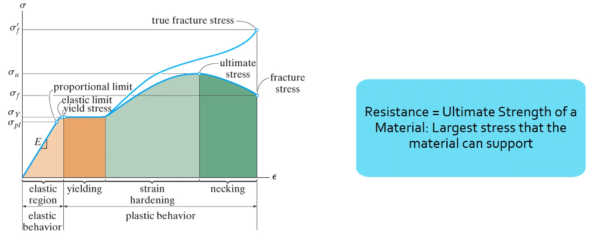 |
|:--:|
| Usually we design for the *yield stress* of a material because we like linear. Failure depends on your criterion. |

**Allowable Stress and Factor of Safety**

For example, a home is a multi-physics problem with many design constraints and variables to accomplish the objectives and satisfy the goals that allow one to live in the home.

The **nuclear industry** uses a factor of safety, $FOS = 5$.

**Internal Forces**

See: [[internal-forces]]

**General State of Stress**

The #stress-state of a point is defined by the stress components acting on this sides of a differential volume that encloses the point.

- The faces of the element are designated by the directions of their normal.
- The single subscript on the normal stress indicates the face on which it acts.

| 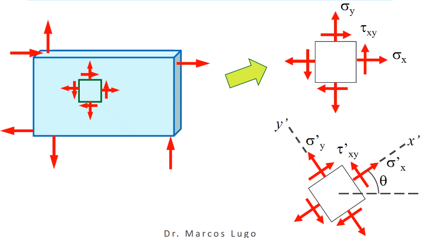 |
|:--:|
| The stresses are acting on one plane. In this state, two faces are of stress. |

#eq-transformation_equations
$$\begin{equation}
\begin{split}
\sigma_{x}' &= \frac{\sigma_{x} + \sigma_{y}}{2} + \frac{\sigma_{x} + \sigma_{y}}{2}\cos(2\theta) + \tau_{xy}\sin(2\theta) \\
\sigma_{y}' &= \frac{\sigma_{x} + \sigma_{y}}{2} + \frac{\sigma_{x} - \sigma_{y}}{2}\cos(2\theta) - \tau_{xy}\sin(2\theta) \\
\tau_{xy}' &= -\frac{\sigma_{x} + \sigma_{y}}{2}\sin(2\theta) + \tau_{xy}\cos(2\theta) \\
\tan(2\theta_{p}) &= \frac{\tau_{xy}}{\frac{\sigma_{x} - \sigma_{y}}{2}} \\
\tan(2\theta_{s}) &= \frac{\frac{\sigma_{x} - \sigma_{y}}{2}}{\tau_{xy}}
\end{split}
\end{equation}$$

These lead to **#principal-stress** which are $180^{\circ}$ apart (see [Fig. 2-4](#fig-mohrs_circle)):

#eq-principal_stress
$$\begin{equation}
\begin{split}
\sigma_{1, 2} &= \frac{\sigma_{x} + \sigma_{y}}{2} \pm \sqrt{\bigg( \frac{\sigma_{x} - \sigma_{y}}{2} \bigg)^{2} + \tau_{xy}^{2}} \\
\tau_{xy} &= \sqrt{\bigg( \frac{\sigma_{x} - \sigma_{y}}{2} \bigg)^{2} + \tau_{xy}^{2}} \\
\sigma_{avg} &= \frac{\sigma_{x} + \sigma_{y}}{2}
\end{split}
\end{equation}$$

| 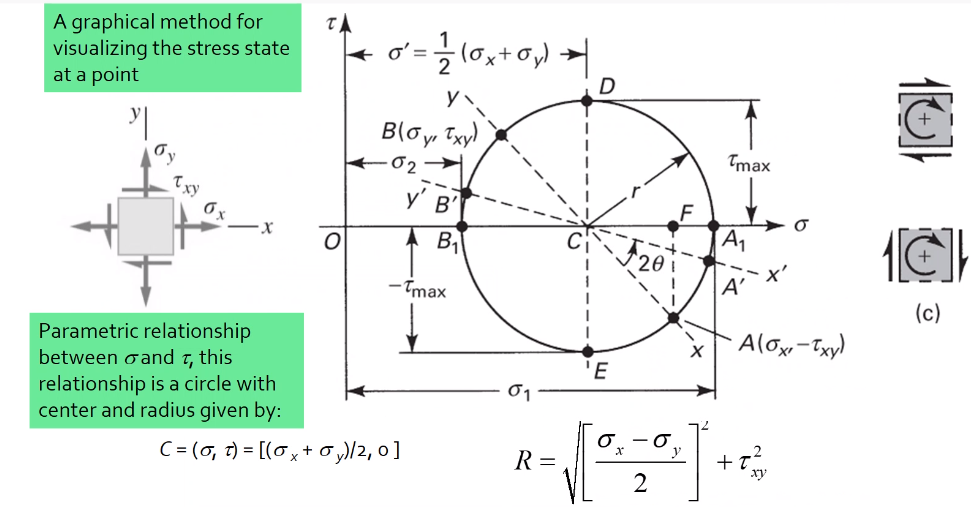 |
|:--:|
| Mohr’s Circle is a common way to represent these transformation equations. The center point, $C = (\sigma, \tau) = (\sigma_{avg}, 0)$ and the radius, $R = \sqrt{[ \frac{\sigma_{x} - \sigma_{y}}{2} ]^{2} + \tau_{xy}^{2}}$. |

!!! example Problem Set: 1-1
    **Problem 1**
    | 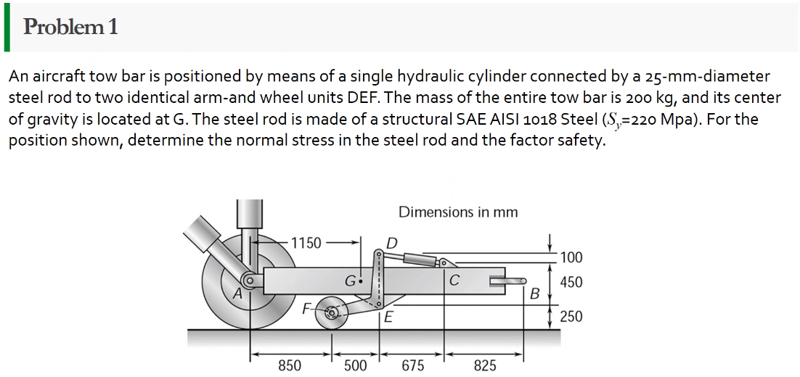 |
    |:--:|
    | Problem 1: What kind of stresses act on the depicted bar? |

    | 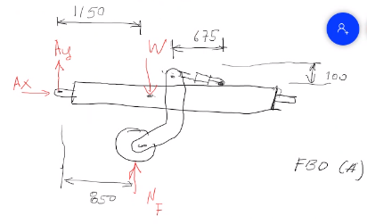 |
    |:--:|
    | FBD-A |

    **Solution of FBD-A**
    $$\begin{split}
    \sum F_{x} = 0 := A_{x} &= 0 \\
    \implies A_{x} &= 0 \\
    \sum \mathcal{M}_{A} = 0 := N_{F}*r_{A-N} - W*r_{A-W} &= 0 \\
    N_{F}*850 - 200*9.81*1150 &= 0 \\
    \implies N_{f} &= 2654.47~N \\
    \sum F_{y} = 0 := A_{y} + N_{F} - W &= 0 \\
    \implies A_{y} &= asdf~MPa
    \end{split}$$

    | 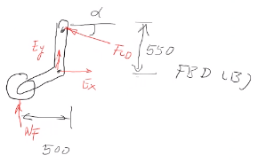 |
    |:--:|
    | FBD-B |

    **Solution of FBD-B**
    $$\begin{split}
    \alpha = \tan^{-1}(\frac{100}{675}) &= 8.43^{\circ} \\
    \sum \mathcal{M}_{E} = 0 := -N_{F}*r_{E-N} + F_{CD}*r_{E-CD} &= 0 \\
    \implies F_{CD} &= 2439.5~N
    \end{split}$$

    Because the bar $\bar{CD}$ is subjected to compressive stresses: $\sigma_{CD} = \frac{F_{CD}}{A} = \frac{2439.5 N}{\frac{\pi}{4}(25 mm)^{2}} = 4.96 MPa$. The factor of safety, $FOS = \frac{\sigma_{y}}{\sigma_{CD}} = \frac{220 MPa}{4.96 MPa} = 44.35$ is well above the typical $FOS = 2$; therefore, this piston $\bar{CD}$ is over-designed.

    ---

    **Problem 2**

    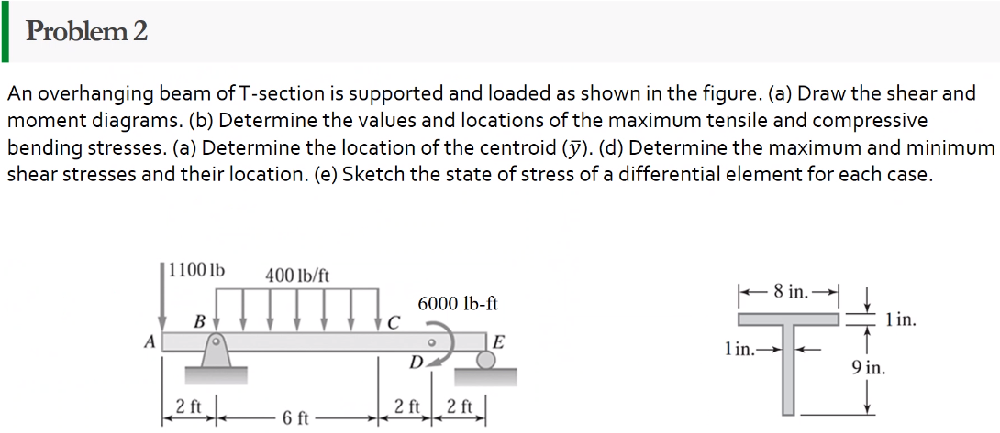

    | 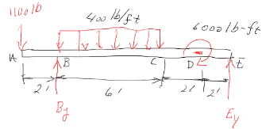 |
    |:--:|
    | FBD |

    **Solution of FBD**
    $$\begin{split}
    \sum \mathcal{M}_{B} = 0 := 1100(2) - 400(6)(2) - 6000 + E_{y}(10) &= 0 \\
    \implies E_{y} &= 1160~lb \\
    \sum F_{y} = 0 := -1100 - 400(6) + E_{y} + B_{y} &= 0
    \end{split}$$

    We draw the #Shear-and-Moment-Diagram: $\frac{x'}{1300} = \frac{6}{2400} \implies x' = 3.25'$.

    $$\begin{split}
    \Delta M &= \frac{1}{2}(3.25)(1300) \\
    M_{C'} &= -2200 + \frac{1}{2}(3.25)(1300) \\
    &= -87.5~lb-ft \\
    M_{C} &= M_{C'} + \Delta M = -87.5 - \frac{1}{2}(2.75)(1100) \\
    &= -1600~lb-ft \\
    M_{D} &= -1600 - 1100(2) \\
    &= -3800~lb-ft
    \end{split}$$

    | 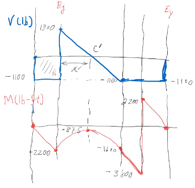 |
    |:--:|
    | Shear and Moment Diagram |

    | 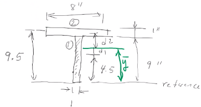 |
    |:--:|
    | Finding the centroid and moment of inertia of cross-section. |

    The **centroid** and **Moment of Inertia** is determined by:

    $$\begin{split}
    \bar{y} &= \frac{A_{1}\bar{y_{1}} + A_{2}\bar{y_{2}}}{A_{1} + A_{2}} \\
    &= \frac{1(9)(4.5) + 8(1)(9.5)}{9 + 8} \\
    &= 6.853~in \\
    I &= \frac{1}{12}bh^{3} + Ad^{2} \\
    &= \frac{1}{12}(1)(9)^{3} + 9(6.853 - 4.5)^{2} + \frac{1}{12}(8)(1)^{3} + 8(9.5 - 6.853)^{2} \\
    &= 167.3~in^{4}
    \end{split}$$

    Next, we find the **Bending** stresses:
    - Point B
      - Top: $\sigma_{B} = \frac{M_{B}C_{1}}{I} = \frac{(2200~lb-ft)(10 - 6.853)~in (12~\frac{in}{ft})}{167.3~in^{4}} = 496.6~psi$
      - Bottom: $\sigma_{D} = \frac{M_{D}{C_{2}}}{I} = \frac{(2200~lb-ft)(12~\frac{in}{ft})(6.583~in)}{167.3~in^{4}} = 1081.4~psi$
    - Point D
      - Top: $\sigma = \frac{M_{D}c_{1}}{I} = \frac{(3800~lb-ft)(12~\frac{in}{ft})(10 - 6.853)~in}{167.3~in^{4}} = 0.858~ksi$
      - Bottom: $\sigma = \frac{M_{D}c_{2}}{I} = \frac{(3800~lb-ft)(12~\frac{in}{ft})(6.853~in)}{167.3~in^{4}} = 1.868~ksi$

    Finally, we find the **Shear** stresses:

    | 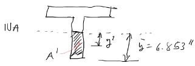 |
    |:--:|
    | The maximum shear stress occurs at the distance furthest from the centroid. We will use the lower part of the cross-section for simpler calculations. |

    **Point B**
    $$\begin{split}
    \tau &= \frac{VQ}{It} \\
    \text{where, } Q &= A'\bar{y}' = (1)(6.853)~in^{2}(\frac{6.853}{2}~in^{2}) \\
    &= 23.48~in^{4} \\
    \implies \tau &= \frac{(1300~lb)(23.48~in^{3})}{167.3~in^{4}} \\
    &= 0.182~ksi
    \end{split}$$

    ---

    **Problem 3**

    | 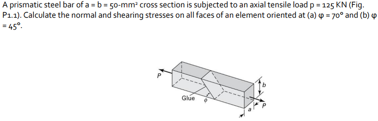 |
    |:--:|
    | Problem 3: Using the given forces, solve either by equilibrium equations or the transformation equations [Eq. 1](#eq-transformation_equations) |

    ---

    **Problem 4**

    | 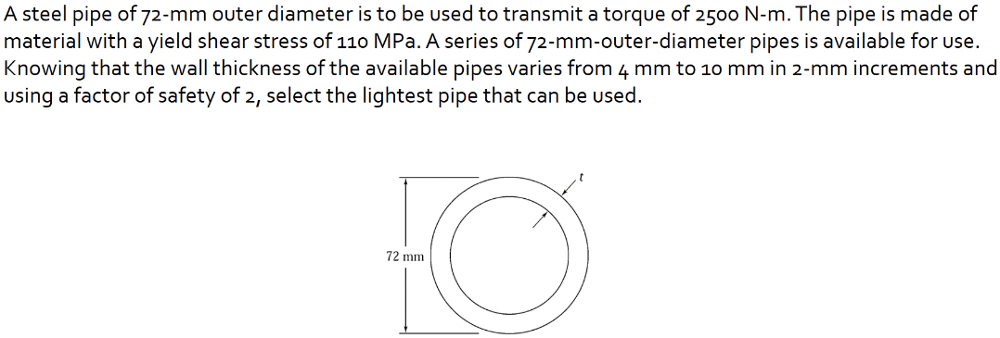 |
    |:--:|
    | Problem 4: Simply use hoop stress equations. |

    ---

    **Problem 5**

    | 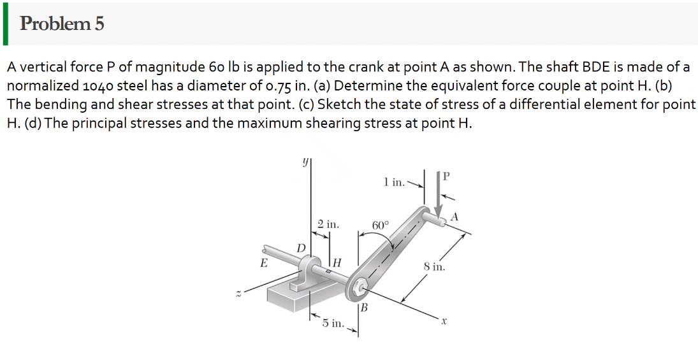 |
    |:--:|
    | Problem 5: What are the critical points in the components, and what are the Principal Stresses at point $H$? |

    | 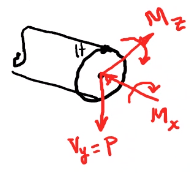 |
    |:--:|
    | By drawing a cross-sectional element from along bar $\bar{DHB}$ of section $\bar{DH}$, we see two internal moments and one shear force about the shaft. |

    $$\begin{split}
    V_{y} &= P = 60~lb \\
    M_{x} &= (60~lb)(8~in \sin(60^{\circ})) \\
    &= 415.642~lb-in \\
    M_{z} &= (60~lb)(4~in) \\
    &= 240~lb-in
    \end{split}$$

    From these moments and shear, we can find the principal stresses at point, $H$. We need the moment of inertia, $I = \frac{\pi d^{4}}{64} = \frac{\pi (0.75~in)^{4}}{64} = 0.0155~in^{4}$. We need, also, the polar moment of inertia, $J = \frac{\pi d^{4}}{32} = 2I = 0.03106~in^{4}$. Therefore, the following applies:
    - Bending: $\sigma_{H_{1}} = \frac{M_{z}r}{I} = \frac{(240~lb-in)(\frac{0.75}{2}~in)}{0.0155~in^{4}} = 5.795~ksi$
    - Shear: $\tau = \frac{M_{x}r}{J} = \frac{(415.642~lb-in)(\frac{0.75}{2}~in)}{0.03106~in^{4}} = 5.018~ksi$

    | 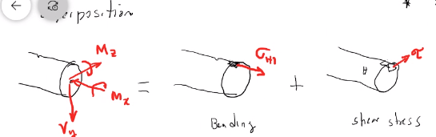 |
    |:--:|
    | We must apply the **Method of Superposition** to find $M_{z}$ which completes the #stress-state in the cross-section of point $H$. |

    | 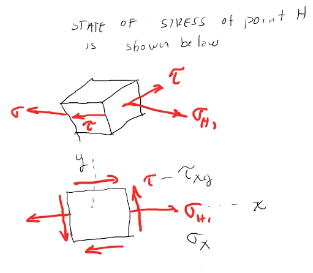 |
    |:--:|
    | The #stress-state of point $H$ can be described by finding the in-plane principal stresses. |

    $$\begin{split}
    \sigma_{1, 2} &= \frac{\sigma_{x} + \sigma_{y}}{2} \pm \sqrt{(\frac{\sigma_{x} - \sigma_{y}}{2})^{2} + \tau_{xy}^{2}} \\
    &= \frac{5.715}{2} \pm \sqrt{(\frac{5.745}{2})^{2} + (5.018)^{2}} \\
    &= 8.692~ksi, -2.897~ksi \\
    \tau_{max} = \sqrt{(\frac{\sigma_{x} - \sigma_{y}}{2})^{2} + \tau_{xy}^{2}} \\
    &= \sqrt{(\frac{5.745}{2})^{2} + (5.018)^{2}} \\
    &= 5.782~ksi
    \end{split}$$

**Internal Forces**

If we cut a body/element along some plane, then we can look at the forces that act within that plane due to external loadings to observe how the material of the component itself reacts to those loadings. Moments cause the element to bend, and we assume the planes remain plane. Shear causes the faces of the element to pass laterally to other faces, and we assume that planes remain vertical. Normal stresses causes the element to change length, and we assume constant volume (Poisson’s Ratio).