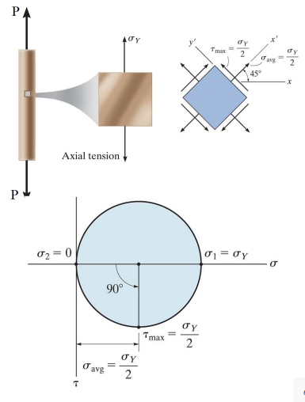

# theories-of-failure-of-materials

### Introduction

**Static Load**

Most parts today are designed by people of vast experience with tried and true methods; however, failures still occur. Designs must take into account mechanical limitations by considering uncertainties in measured data and applied loads. Typically, this is quantified with a factor of safety. *insert math*

**Designing Under Multi-Axial Stresses**

Most materials will have reported elastic moduli and ultimate strengths; therefore, these are simple parameters to include in designs.

Failure Theories  
proposed, appropriate means of comparing multi-axial stress states to single strength parameters.

Failure Criterion  
Domain by which a material’s performance of yield or fracture within some stress state. Which domain is defined by the constraints of the design: yield point, necking, ultimate, etcetera. 3 types of mechanical failure:

1.  Elastic

2.  Plastic deformation

3.  Creep deformation

Because these stress state so quickly convolutes the yield point, performing comprehensive experiments to predict every behavior of a material is impossible by the infinite size of the domain.

### Failure Criterion

When applying a yield criterion, the resistance of a material is given by its yield strength, *σ**y**p*, for **ductile materials**. For **brittle materials**, the typical failure criterion, *σ**u**t* and *σ**u**c*, is used. Therefore, a function of these stresses could be made: *f*(*σ*1, *σ*2, *σ*3) = *σ**f* wherein the failure function, *f* can be related to the failure strength, *σ**f*. If *f* = *σ**f* = *σ**f*, then failure will occur. A factor of safety can scale down the stress state by emphasizing (restricting) the allowed stress state: *σ**e**q**n* = *σ**f*. In general, a complete plasticity theory has three components: . Yield criterion: yield function. . A flow rule that relates the plastic strain increments to the stress increments after initiation of yielding. . A hardening rule that predicts changes in the yield surface.

Tresca  
Yielding begins when the *maximum shear stress* in a stress element exceeds the maximum shear stress in a tension test specimen of the same material.

$$\begin{equation}
f(\sigma_{1}, \sigma_{2}, \sigma_{3}) = max{|\frac{\sigma_{1} - \sigma_{2}}{2}|, |\frac{\sigma_{1} - \sigma_{3}}{2}|, |\frac{\sigma_{2} - \sigma_{3}}{2}|}}
\end{equation}$$

|  |
|:--:|
| This can be visualized in <strong>Mohr’s Circle</strong>. |

von Mises  
Yielding occurs when the *distortion strain energy* per unit volume reaches the distortion strain energy per unit volume for yield in simple tension or compression of the same material.

$$\begin{equation}
f(\sigma_{1}, \sigma_{2}, \sigma_{3}) = \frac{1}{6}\[(\sigma_{1} - \sigma_{2})^{2} + (\sigma_{2} - \sigma_{3})^{2} + (\sigma_{1} - \sigma_{3})^{2}\] = \frac{1}{3}\sigma_{yp}^{2}
\end{equation}$$

If $\sigma_{eq} = \sqrt{\frac{1}{2}(\sigma_{1} - \sigma_{2})^{2} + (\sigma_{2} - \sigma_{3})^{2} + (\sigma_{2} - \sigma_{3})^{2}} &gt; \sigma_{yp}$, then yielding is predicted.

Rankine  
Yielding will occur whenever the greatest tensile stress tends to exceed the uniaxial tensile strength, or whenever the largest compressive stress tends to exceed the uniaxial compressive strength.

$$\begin{equation}
\begin{split}
n &= \frac{S_{ut}}{\sigma_{1}} \\\
 &=
\end{split}
\end{equation}$$

Mohr  
Three simple tests—​tension, compression, and shear—​define the stress in the body. Failure occurs when one of the circles becomes tangent to the envelope.

|  |
|:--:|
| This theory is suggested for brittle materials for which the compressive strength far exceeds the tensile strength. |

$$\begin{equation}
n = \frac{\sigma_{ut}|\sigma_{uc}|}{\sigma_{1}|\sigma_{uc}| - \sigma_{ut}(\sigma_{1} + \sigma_{3})}
\end{equation}$$

**Problem 1**

A bar made of AISI 1020, hot-rolled steel (*σ**y**p* = 350 *M**P**a*) is subjected to the following plane stress state: *σ**x* = 100 *M**P**a*, *σ**t* = 20 *M**P**a*, and *τ**x**y* =  − 20 *M**P**a*. (a) Determine the equivalent stress and the factor of safety using the **Maximum Shear Stress Theory** and (b) using the **Distortion Energy Theory**.

We solve the principal stresses:

$$\begin{split}
\sigma_{1, 2} &= \frac{\sigma_{x} + \sigma_{y}}{2} \pm \sqrt{(\frac{\sigma_{x} - \sigma_{y}}{2})^{2} + \tau_{xy}^{2}} \\\
 &= \frac{100 + 20}{2} \pm \sqrt{(\frac{100 - 20}{2})^{2} + (-20)^{2}} \\\
 &= ${(100+20)/2} \pm ${np.array(\[1, -1\])\*np.sqrt(((100-20)/2)\*\*2 + (-20)\*\*2)}~MPa
\end{split}$$

1.  Using the **Tresca Criterion**, the equivalent stress, $\sigma_{eq} := |\sigma_{1} - \sigma_{3}| = ${np.abs((100+20)/2 + np.sqrt(((100-20)/2)\*\*2 + (-20)\*\*2))}~MPa$ .By **Tresca Criterion**, the factor of safety is $${engr(350/104.721)}$. image::engr-727-001-advanced-mechanics-of-materials/4-1-1-yield_surfaces_220222_142019_EST.png\[caption="Figure {secs}-1. ", reftext="Fig. {secs}-1"\]

<!-- -->

1.  Using the **von Mises Criterion**, the equivalent stress, $\sigma_{eq} := \sqrt{\frac{1}{2}\[(\sigma_{1} - \sigma_{2})^{2} + (\sigma_{1} - \sigma_{3})^{2} + (\sigma_{2} - \sigma_{3})^{2}\]} = ${np.sqrt(0.5\*((104.721 - 15.27)\*\*2 + (104.721 - 0)\*\*2 + (15.27 - 0)\*\*2))}~MPa$. From this, the factor of safety, $n = ${engr(350/97.98)}$.

Conclusion, **von Mises** is the most conservative criterion by definition which can be seen by having the larger factor of safety.

**Problem 2**

Determine the equivalent stress and the factor of safety (a) suing the **Tresca Criterion**, and (b) using the **von Mises Criterion**. The material is an SAE 1045 CD steel alloy.

$$\sigma_{prob} = \begin{bmatrix}12 & 60 & 60 \\\
60 & 12 & -60 \\\
60 & -60 & 10\end{bmatrix}~ksi$$

The stress invariants and principal stresses:

$$\begin{split}
I_{1} &= 34~ksi \\\
I_{2} &= -10460~ksi^{2} \\\
I_{3} &= ${sp.det(sp.Matrix(np.array(\[\[12, 60, 60\], \[60, 12, -60\], \[10, -60, 10\]\])))}~ksi^{3} \\\
\implies \sigma_{p} := \sigma_{p}^{3} - I_{1}\sigma_{p}^{2} + I_{2}\sigma_{p} - I_{3} = 0 \rightarrow \sigma_{p} = -108.67~ksi
\end{split}$$

Assume the *σ**y**p* = 91 *k**s**i*. Therefore, the factor of safety, $n = ${round(91/180.67, 4)}$ implies the material will yield. If this is unacceptable, then we can play with the geometry or processing and treatment of the material.

By **von Mises**, the equivalent stress, $\sigma_{eq} = \sqrt{\frac{1}{2}\bigl\[(\sigma_{1} - \sigma_{2})^{2} + (\sigma_{1} - \sigma_{3})^{2} + (\sigma_{2} - \sigma_{3})^{2}\bigr\]} = ${engr(np.sqrt(0.5\*((72-(-70.67))\*\*2 + (72-(-108.67))\*\*2 + (-70.67 - (-108.67))\*\*2)))}~ksi$. This implies the factor of safety, $n_{Mises} = \pyline$. This means the material will still yield just as found by **Tresca** criterion.

**Problem 3**

A brittle material has the properties *S**u**t* = 30 *k**s**i* and *S**u**c* = 90 *k**s**i*. Using the brittle **Coulomb-Mohr** and **Modified-Mohr** theories, determine the factor of safety for the following state of plane stress: *σ**x* =  − 35 *k**s**i*, *σ**y* = 13 *k**s**i*, and *τ**x**y* =  − 10 *k**s**i*.

The principal stresses $\sigma_{1, 2} := \frac{\sigma_{x} + \sigma_{y}}{2} \pm \sqrt{\Bigl(\frac{\sigma_{x} - \sigma_{y}}{2}\Bigr)^{2} + (\tau_{xy})^{2}} = ${engr((-35+13)/2)} + ${np.array(\[1, -1$)**np.sqrt(((-35-13)/2)**2 + (-10)**2)}~ksi\]. By \*Modified-Mohr**, $n = ${engr((30\*-90)/(15\*90 - 37\*(15-37)))}$.