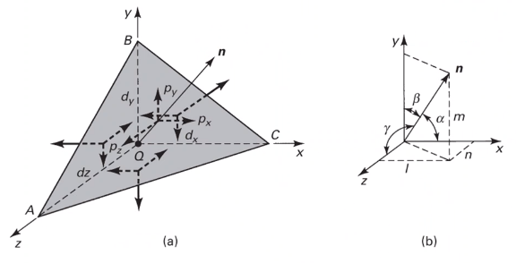

# three-dimensional-stress-analysis-and-equilibrium

|  |
|:--:|
| Consider an element of sides <em>d</em><em>x</em> and <em>d</em><em>y</em> of some unit thickness. It is assumed that <em>σ</em><em>x</em>, <em>σ</em><em>y</em>, <em>τ</em><em>x</em><em>y</em>, and <em>τ</em><em>y</em><em>x</em> are functions of <em>x</em> and <em>y</em>. Assume that the <em>x</em> and <em>y</em> components of the body forces per unit volume, <em>F</em><em>x</em> and <em>F</em><em>y</em>. |

In mechanics, there are 2 types of forces: external and internal loads. We often describe these as body forces and remote forces ([Fig. 3-1](#fig-stress_equilibrium_equations_2d)). If we take the sum of the moments about the lower-left corner, then $\sum M_{z} = 0 := (\frac{\partial\sigma_{y}}{\partial y}dxdy)\frac{dx}{2} - (\frac{\partial\sigma_{x}}{\partial x}dxdy)\frac{dy}{2} + (\tau_{xy} + \frac{\partial\tau_{xy}}{\partial x}dx)dxdy - (\tau_{yx} + \frac{\partial\tau_{yx}}{\partial y}dy)dxdy + F_{y}dxdy\frac{dx}{2} - F_{x}dxdy\frac{dy}{2} = 0$. This reduces to *τ**x**y* = *τ**y**x*. Similarly, in 3 dimensions, the following can be found *τ**y**z* = *τ**z**y* and *τ**x**z* = *τ**z**x*. From sum of the *x* forces: $\sum F_{x} = 0 := (\sigma_{x} + \frac{\partial\sigma_{x}\tau_{x}}dx)dy - \sigma_{x}dy + (\tau_{xy} + \frac{\partial\tau_{xy}}{\partial y}dy)dx + \tau_{xy}dx - F_{x}dxdy = 0$. This simplifies to: $(\frac{\partial\sigma_{x}}{\partial x} + \frac{\partial\sigma_{x}}{\partial y} + F_{x})dxdy = 0$. Because *d**x* and *d**y* are non-zero:

$$\begin{split}
\frac{\partial\sigma_{x}}{\partial x} + \frac{\partial\sigma_{x}}{\partial y} + F_{x} &= 0 \\\
\frac{\partial\sigma_{y}}{\partial y} + \frac{\partial\sigma_{y}}{\partial x} + F_{y} &= 0
\end{split}$$

By expanding to 3 dimensions:

$$\begin{split}
\frac{\partial\sigma_{x}}{\partial x} + \frac{\partial\tau_{xy}}{\partial y} + \frac{\partial\tau_{xz}}{\partial z} + F_{x} &= 0 \\\
\frac{\partial\sigma_{y}}{\partial x} + \frac{\partial\tau_{xy}}{\partial y} + \frac{\partial\tau_{xz}}{\partial z} + F_{x} &= 0 \\\
\frac{\partial\sigma_{z}}{\partial x} + \frac{\partial\tau_{xy}}{\partial y} + \frac{\partial\tau_{xz}}{\partial z} + F_{x} &= 0
\end{split}$$

|  |
|:--:|
| The stress state of a point is defined by the stress components acting on the sides of a differential volume that encloses the point which requires 9 forces in total. |

Often times, we use a matrix to represent these 9 forces: $\[\sigma_{ij}\] = \\[\tau_{ij}\] = \mathbf{\tau}_{ij} = \bmatrix{\sigma_{x}, \tau_{xy}, \tau_{xz} \\ \tau_{yx}, \sigma_{y}, \tau_{yz} \\ \tau_{zx}, \tau_{zy}, \sigma_{z}}\bmatrix$\]. However, we must remember that this matrix is *symmetric*.

|  |
|:--:|
| The equations governing the transformation of the stress in 3D are obtained using a similar approach to that applied to the 2D case. Therefore, we can follow a similar manner to consider a tetrahedron isolated from a continuous medium subjected to a general state of stress. |

The orientation of plane *A**B**C* is defined in terms of angles between a unit normal, *n* to the plane and the *x*, *y*, and *z* directions. The directions cosines associated with these angles are:

$$\begin{split}
\cos(\alpha) &= \cos(\mathbf{n}, ) \\\
 &=
\end{split}$$

The equilibrium forces can be obtained after canceling the area, *A*. The areas of perpendicular planes *Q**A**B*, *Q**A**C*, and *Q**B**C* can be expressed in terms of *A*, the area of *A**B**C* and the direction cosines:

$$\begin{split}
A_{AQB} &= A_{x} = \mathbf{A} \cdot \mathbf{i} = A(l\mathbf{i} + m\mathbf{j} + n\mathbf{k}) \cdot \mathbf{i} = Al \\\
 &= Al \\\
\implies A_{QAC} &= Am \\\
\implies A_{QBC} &= An
\end{split}$$

Using the stress tensor, we can represent these equilibrium equations by:

$$\begin{split}
p_{x} &= \sigma_{x}l + \tau_{xy}m + \tau_{xz}n \\\
 &=
\end{split}$$

Using matrix notation:

$$\bmatrix{p_{x} \\ p_{y} \\ p_{z}} = {\mathbf{p}} = \bmatrix{\dots}$$

|  |
|:--:|
| foo |

The normal stress, *σ* is the projection of the vector, *p⃗* in the direction of **n**.

$$\begin{split}
\sigma &= \vec{p} \cdot \mathbf{n} = \vec{p} \cdot \vec{n} \\\
\sigma &= p_{x}l + p_{y}m + p_{z}n \\\
\sigma &= \sigma_{x}l^{2} + \sigma_{y}m^{2} + \sigma_{z} + n^{2} + 2(\tau_{xy}lm + \tau_{yz}mn + \tau_{xz}ln)
\end{split}$$

The magnitude of the shear stress, *τ* on plane *A**B**C* can be computed by geometry:

$$\begin{split}
\tau &= \sqrt{p^{2} - \sigma^{2}} \\\
\tau &= \sqrt{p_{x}^{2} + p_{y}^{2} + p_{z}^{2} - \sigma^{2}} \\\
\tau &= \sqrt{(\sigma_{x}l + \tau_{xy}m + \tau_{xz}n)^{2} + (\tau_{xy}l + \sigma_{y}m + \tau_{yz}n)^{2} + (\tau_{xz}l + \tau_{yz}m + \sigma_{z}n)^{2} - \sigma^{2}}
\end{split}$$

|  |
|:--:|
| The variance of the stress with respect to surface orientation. |

The transformation matrix is composed by the direction cosines: *l*1 = cos (*x*′, *x*), *m*1 = cos (*x*′, *y*), and so on. The complete set of direction cosines is:

<table><colgroup><col style="width: 25%" /><col style="width: 25%" /><col style="width: 25%" /><col style="width: 25%" /></colgroup><thead><tr class="header"><th style="text-align: left;"></th><th style="text-align: left;">x</th><th style="text-align: left;">y</th><th style="text-align: left;">z</th></tr></thead><tbody><tr class="odd"><td style="text-align: left;">
x'
</td><td style="text-align: left;">
<em>l</em>1
</td><td style="text-align: left;">
<em>m</em>1
</td><td style="text-align: left;">
<em>n</em>1
</td></tr><tr class="even"><td style="text-align: left;">
y'
</td><td style="text-align: left;">
<em>l</em>2
</td><td style="text-align: left;">
<em>m</em>2
</td><td style="text-align: left;">
<em>n</em>2
</td></tr><tr class="odd"><td style="text-align: left;">
z'
</td><td style="text-align: left;">
<em>l</em>3
</td><td style="text-align: left;">
<em>m</em>3
</td><td style="text-align: left;">
<em>n</em>3
</td></tr></tbody></table>

In tensor notation: …​

|  |
|:--:|
| Using these transformation equations for stresses acting on a new axis, <em>p⃗</em> = [<em>τ</em><em>i</em><em>j</em>]<em>n⃗</em> on an oblique plane in this new coordinate system becomes $\vec{}' = [\tau_{ij}']\vec{n'}$. |

These vectors can be related by: *p⃗*′ = *T⃗* ⋅ *p⃗*. This can be combined with the transformed stress tensor into: \[*τ**i**j*′\vec{n}' = \vec{T}\[\tau_{ij}\]\vec{n}\]. The relationship between *n⃗* and *n⃗*′ can be obtained by the inversion of *n⃗*′ = *T⃗**n⃗* which is *n⃗* = *T⃗**T**n⃗*′.

$$\begin{split}
\vec{T_{ij}}\vec{n}' &= \ \\\
 &=
\end{split}$$

The book performs the same derivations with different notation. Ultimately, these two expressions are equivalent, but the book’s notation is longer and more expressive.

**Principal Stress in 3D**

Planes with zero shear stress are mutually perpendicular and have a (min)maximum which are called **principal stresses**. Therefore, the stress vector on principal planes is given by *p⃗* = *σ**p**n⃗* where *σ**p* is the magnitude of the stress vector, *p⃗* and *n̂* = *l**î* + *m**ĵ* + *n**k̂* is the unit normal to a principal plane. By projecting *p⃗* along each axis and substituting into $\vec{p} = \vec{\tau_{ij}}\hat{n}$, we arrive to the identity matrix:

…​

This becomes an *eigenvalue problem*. A non-trivial solution for the direction cosines requires that the characteristics stress determinant vanish; therefore, we set this equal to zero.

…​

This gives the characteristic equation: *σ**p*3 − *I*1*σ**p*2 + *I*2*σ**p* − *I*3 = 0; wherein, *I*1, *I*2, *I*3 are the stress invariants.

$$\begin{split}
I_{1} &= \sigma_{x} + \sigma_{y} + \sigma_{z} \\\
I_{2} &= \sigma_{x}\sigma_{y} + \sigma_{x}\sigma_{z} + \sigma_{y}\sigma_{z} - \tau_{xy}^{2} - \tau_{yz}^{2} - \tau_{xz}^{2} \\\
I_{3} &= \dots
\end{split}$$

|  |
|:--:|
| In general, using <strong>Mohr’s Circle</strong> is not helpful for 3D analyses but can helpful to double check work. |

$$\begin{split}
\sigma_{x} &= x^{2} + 2y \\\
\sigma_{y} &= xy - y^{2}z \\\
\sigma_{z} &= x^{2} - z^{2} \\\
\tau_{xy} &= -xy^{2} + 1 \\\
\tau_{yz} &= 0 \\\
\tau_{xz} &= xz - 2x^{2}y
\end{split}$$

These forces are body, not surface forces; therefore, we are findings forces per volume.

1.  First, we find the partials.

$$\begin{split}
\frac{\sigma_{x}}{\partial x} &= 2x \\\
\frac{\sigma_{y}}{\partial y} &= z - 2yz \\\
\frac{\sigma_{z}}{\partial z} &= -2z \\\
\frac{\tau_{xy}}{\partial x} &= -y^{2} \\\
\frac{\tau_{xy}}{\partial y} &= -2xy \\\
\frac{\tau_{yz}}{\partial y} &= 0 \\\
\frac{\tau_{yz}}{\partial z} & = 0 \\\
\frac{\tau_{xz}}{\partial x} &= z - 4xy \\\
\frac{\tau_{xz}}{\partial z} &= x
\end{split}$$

1.  Next, with these derivations and summing the forces in the *x*-direction, we find: $F_{x} := 2(-10) + (-2)(-10)(30) + (-10) + F_{x} = 0 \\ \implies F_{x} = 570~\frac{N}{m^{3}}$ Similarly: $F_{y} = 14.5~\frac{kN}{m^{3}}$ and $F_{z} = 50.8~\frac{N}{m^{3}}$.

<!-- -->

1.  To find the solution vector, *n⃗*:

\begin{split} \vec{n} &= \frac{1}{\sqrt{i^{2} + j^{2} + k^{2}}}(\hat{i} + 2\hat{j} + \hat{k}) \\\ &= \frac{1}{\sqrt{6}}(\hat{i} + 2\hat{j} + \hat{k}) \end{split}

Find *p⃗* according to appropriate equations…​

1.  Principal Stresses We find the stress invariants to be *I*1 = 160 *M**P**a*, *I*2 = 5500 *M**P**a*2, and *I*3 = 0. ∴, we plug these into the characteristic, cubic equations. $\sigma_{p}^{3} - 160\sigma_{p}^{2} + 5500\sigma_{p} - 0 = 0 \\ \implies \sigma_{p} = \{0, 110, 50\}~MPa$. We check that *σ*1 ≥ *σ*2 ≥ *σ*3 which maps $\vec{\sigma_{p}}$ to {110, 50, 0} *M**P**a*.

<!-- -->

1.  From these, we can draw Mohr’s Circle.

|  |
|:--:|
| Therefore, <em>τ</em><em>m</em><em>a</em><em>x</em> = 55 <em>M</em><em>P</em><em>a</em>. |

1.  Invariants of **T**

\begin{split} I_{1} &= 18~MPa \\\ I_{2} &= 99~MPa^{2} \\\ I_{3} &= 160~MPa^{3} \end{split}

1.  Finding the stress components in the new coordinate system .We must build the table of cosines.

<table><colgroup><col style="width: 25%" /><col style="width: 25%" /><col style="width: 25%" /><col style="width: 25%" /></colgroup><thead><tr class="header"><th style="text-align: left;"></th><th style="text-align: left;">x</th><th style="text-align: left;">y</th><th style="text-align: left;">z</th></tr></thead><tbody><tr class="odd"><td style="text-align: left;">
x'
</td><td style="text-align: left;">
$\frac{\sqrt{2}}{2}$
</td><td style="text-align: left;">
$\frac{\sqrt{2}}{2}$
</td><td style="text-align: left;">
0
</td></tr><tr class="even"><td style="text-align: left;">
y'
</td><td style="text-align: left;">
$\frac{\sqrt{2}}{2}$
</td><td style="text-align: left;">
$-\frac{\sqrt{2}}{2}$
</td><td style="text-align: left;">
0
</td></tr><tr class="odd"><td style="text-align: left;">
z'
</td><td style="text-align: left;">
0
</td><td style="text-align: left;">
0
</td><td style="text-align: left;">
1
</td></tr></tbody></table>

Therefore, the stress tensor in the new coordinate system can be found by: \[*τ**i**j*′\] = \[*T*\]\[*τ**i**j*\]\[*T*\]*T*. This yields, $\[\tau_{ij}'\] = \begin{bmatrix}6 & 1 & \sqrt{2} \\ 1 & 4 & -\sqrt{2} \\ \sqrt{2} & -\sqrt{2} & 8\end{bmatrix}~MPa$.