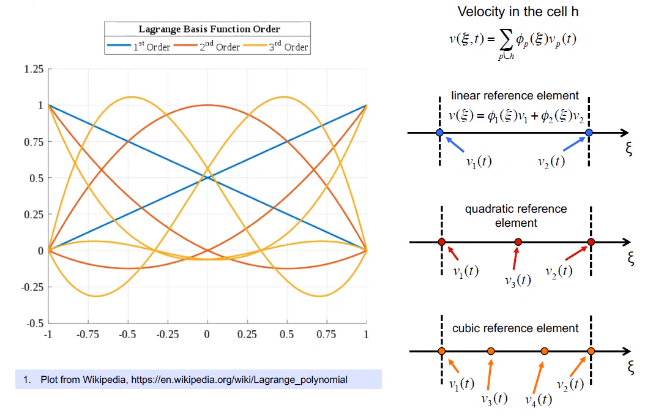
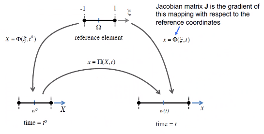
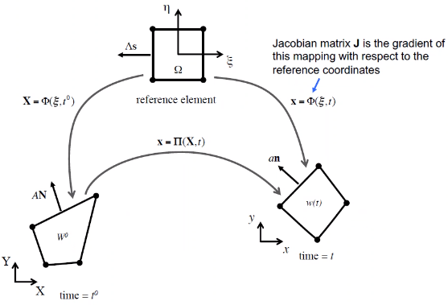
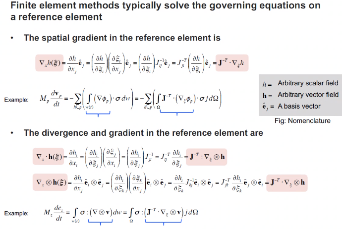
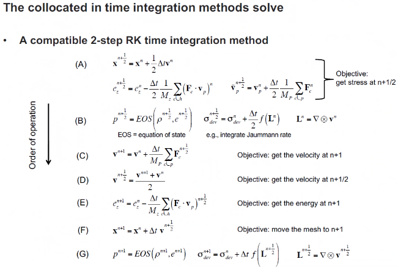

# asdf
*Lecture: October 08, 2021*
>**Special Lecture**: *Dr. Nathaniel Morgan*
Solving Physics for Lagrangian Solid Dynamics
- Fluids is typically Eulerian reference frame, which is a fixed mesh with fluid passing through it.
- Lagrangian reference frame moves with the body.
- Some mesh free methods exist, but this method uses a mesh to map pressure or expansion of a body through stress tensors.

Position, displacement, and velocity in the cell (aka zone or element) are approximated with interpolation polynomials.
- This model uses the [[Runge-Kutta-Method]] to solve discretized elements.
- Position: $\vec{x} = \sum_{p \neq h}\vec{x}_{p}\phi_{p}(\xi, \eta, \zeta)$
- Displacement: $\vec{u} = \sum_{p \neq h}\vec{u}_{p}\phi_{p}(\xi, \eta, \zeta)$
- Velocity in cell: $\vec{x} = \sum_{p \new h}\vec{v}_{p}\phi_{p}(\xi, \eta, \zeta)$
- The advantage of these is conservation, clean nomenclature, and [[finite-element-model]] minimizes issues sometimes seen in #FVM.

|  |
|:--:|
| Discrete values--e.g. position--can be solved in location to the order of the interpolation: these are also called [[degrees-of-freedom]]. [[finite-element-method]] does not evaluate the derivative at every point, such as in [[finite-difference-method]]. \\(\tag{fig:morgan2021_lagrangian_polynomial_examples} \label{fig:morgan2021_lagrangian_polynomial_examples}\\) |

Taking partials in the local reference similar to Calc 3 converting to another coordinate system to perform integrals.

>Perfect land is from -1 to 1. This makes calculations easier and the domain becomes square. <cite> Morgan

|  |
|:--:|
| This is a spacial map between coordinates. Changes between these points is displacement: not just in solids. Gradient of this map is deformation: the #Jacobian-matrix Determinant of the #Jacobian-matrix calculates volume of each element box. \\(\tag{fig:morgan2021_conversion_to_perfect_land_functions} \label{fig:morgan2021_conversion_to_perfect_land_functions}\\) |

|  |
|:--:|
| bar \\(\tag{fig:morgan2021_mapping_curved_surface_to_flat_plane} \label{fig:morgan2021_mapping_curved_surface_to_flat_plane}\\) |

#Jacobian-matrix allows to convert from physical space into the 

[[finite-element-method]] typically solve governing equations on a reference element.

|  |
|:--:|
| bar \\(\tag{fig:morgan2021_f_equals_m_a} \label{fig:morgan2021_f_equals_m_a}\\) |

#Gaussian-Quadrature sometimes solves single points in the center of a face: surface. However, performing this over a volume, which becomes the quadrature weight. This also has #Conservation-of-Mass qualities.

Solving momentum equations generates global, sparse matrices by using integration by parts that sum to zero, which cancels out the surface. This is all an explicit, transient process, which can be accomplished with the lumped mass approaches. This always conserve the total energy of the system, whether dumped into other "energy reservoirs."

|  |
|:--:|
| [[RK2]] for second-order accuracy. \\(\tag{fig:morgan2021_finite_element_steps} \label{fig:morgan2021_finite_element_steps}\\) |

Information of spatial derivatives constraint the time step size: i.e. equation stability. Too large a time step, and the solution quickly diverges.

[[finite-element-method]] with MARS for deformation solid mechanics and shock-drive flows. See [Fierro](https://github.com/lanl/Fierro) for free access to these codes.

>**Q: Are there parellel to staggered grid from leap-frogging?** <cite>#Reid-Prichard. P
*A: Introduce higher order viscocities is susceptible to square-wave, plus-minus solutions.*