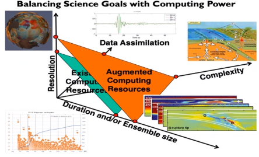
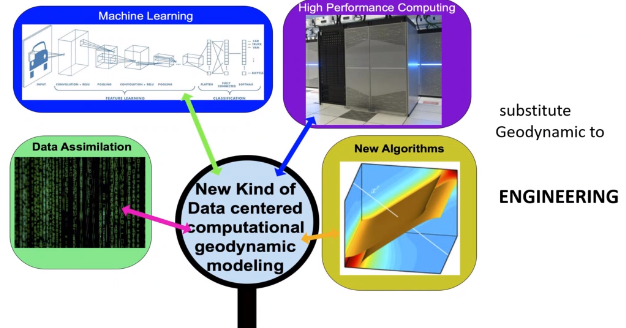

# asdf
*Lecture: November 08, 2021*
>**Special Lecture**: *Dr. Yuen*

## History of Supercomputing from World War II
#supercomputing, which humbly began with cracking encoded, German transmissions, is influential in many, modern problems. E.g. simulating earthquakes (2000's). Has greatly progressed from 100 megaflops (19070'2), gigaflop (1980's), teraflop (1998), and petaflop (2008) up to exaflop (2022). From its conception to today, #supercomputing is commonly used to solve geophysics problems. The fastest computer today *Perlmutter* delivers **4 exaflops**, but limits its precision to `16-bit`.

|  |
|:--:|
| Integrations and data assimilations drive up computing costs and time to solve. \\(\tag{fig:computational_balances} \label{fig:computational_balances}\\) |

Building #HPC is more common today because the materials are easily acquired; however, constructing one with a strong infrastructure is much more difficult. Many opportunities in many companies to work on #supercomputing.

*[HCP]: High-Performance Computer

## What comes in the future
- [[machine-learning]]
- [[artificial-intelligence]]
- modeling

## Applications of HPC in engineering
- Numerical modeling of automobiles and civil engineering
- Modeling building with high-resolution #FEM.
- Robotics and computer vision: Nvidia and Jensen Huang.

## Over the last 5 years
- Private industry playing larger role than governments and universities.
- Tesla, Amazon, Nvidia, SpaceX, etcetera.
- Jeff Bezos and Elon Musk are very creative and innovative because they always read and ask questions.

## In 2021
- Several computers in China and America have broken the **exaflop** barrier.
- Pan Jian Wei (Chinese Einstein) leading quantum computing in China.
- Accelerated pace from innovative, private companies.
- What is needed is more teachers of technological advances: #HPC, [[3D-printing]], hardware design, and craftsmanship.

|  |
|:--:|
| Need persons skilled in coding for new algorithms. These skills could put mathematicians out of a job because the first two years are unnecessary. \\(\tag{fig:skills_needed_in_supercomputing} \label{fig:skills_needed_in_supercomputing}\\) |

## Future opportunities for engineering
- Important for all universities to have local #supercomputing resources, like a police of fire department without relying on the #NSF.
- Necessary to have a cluster of a few hundred clusters to learn how to write, compile, and deploy own codes in several languages.
- Better today to be an engineer than geoscience, botany, archaeology, geography, etcetera because these other disciplines practically only train future professors.

*[NSF]: National Science Foundation

## Questions
Contact: daveyuen@gmail.com

!!! question Why not go to the large corporations like the National Guard over a local police department? <cite> Tate
	Because those companies will not answer you and will attempt to suck you into their environment to make money.

!!! question What is reasonable for university level #supercomputing? <cite>#Daniel-Kenney
	Ideally, you would have 15-20 trained people for scheduling, training, and community engagement: city, county, and state.

!!! note
	Most of these supercomputers sit idle. Much difficulty in developing more is a global chip shortage; therefore, we should buy chips in small increments.

!!! question How long before the equipment is obsolete? <cite> Tate
	2-3 years before new hardware becomes attractive; however, existing hardware could still operate for 4-5. If hardware is added incrementally, then old hardware could be replaced incrementally.

!!! question When would quantum computing become viable? <cite> Tate
	Within the next 4-5 years, Fortran, C++, or Python implemented codes could deliver quantum computers.

!!! question What is this Technological Cold War? <cite> Tate
	The United States is afraid that China will lead because China is still behind on many other fronts. Supercomputers can be devoted to with resources to solve many national problems. Many issues with building supercomputers is building a capable infrastructure.

!!! question Are there global regulations on supercomputer capabilities? <cite> Tate
	No. However, #supercomputing has revolutionized problem solving techniques. Engineers with the skillset in #supercomputing will be the ones leading the way into many new solutions and ventures.