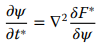
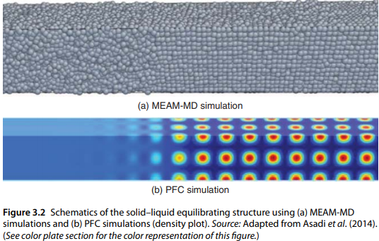

<!-- %%%%%%%% Document Metadata %%%%%%%% -->
# [ICME](https://onlinelibrary.wiley.com/doi/pdf/10.1002/9781119018377)

- [ICME]([[ICME]])
  - [Chapter 1: Definition of [[ICME]]](#chapter-1-definition-of-icme)
    - [[[ICME]]:=]([[ICME]]-1)
    - [It is...](#it-is)
    - [Industrial Perspective](#industrial-perspective)
    - [Summary](#summary)
    - [Keywords](#keywords)
  - [Section 1: Body-Centered Materials (#BCC)](#section-1-body-centered-materials-bcc)
    - [Chapter 2: From Electrons to Atoms: Designing an Interatomic Potential for Fe-C Alloys](#chapter-2-from-electrons-to-atoms-designing-an-interatomic-potential-for-fe-c-alloys)
      - [Introduction](#introduction)
      - [Methods](#methods)
      - [Construction of Fe-C Alloy Potential](#construction-of-fe-c-alloy-potential)
      - [Structural and Elastic Properties of Cementite](#structural-and-elastic-properties-of-cementite)
      - [Properties of Hypothetical Crystal Structures](#properties-of-hypothetical-crystal-structures)
      - [Thermal Properties of Cementite](#thermal-properties-of-cementite)
      - [Summary and Conclusions](#summary-and-conclusions)
      - [Keywords](#keywords-1)
    - [Chapter 3: Phase-Field Crystal Modeling: Integrating Density Functional Theory, Molecular Dynamics, and Phase-Field Modeling](#chapter-3-phase-field-crystal-modeling-integrating-density-functional-theory-molecular-dynamics-and-phase-field-modeling)
      - [Introduction to Phase-Field and Phase-Field Crystal Modeling](#introduction-to-phase-field-and-phase-field-crystal-modeling)
      - [Governing Equations of [[phase-field]] Crystal ([[PFC]]) Models Derived from Density Functional Theory ([[DFT]])](#governing-equations-of-phase-field-crystal-pfc-models-derived-from-density-functional-theory-dft)
      - [[[PFC]] Model Parameters by [[MD]] Simulations]([[PFC]]-model-parameters-by-md-simulations)
      - [Case Study: Solid-Liquid Interface Properties of Fe](#case-study-solid-liquid-interface-properties-of-fe)
      - [Case Study: Grain Boundary Free Energy of Fe at Its Melting Point](#case-study-grain-boundary-free-energy-of-fe-at-its-melting-point)
      - [Summary and Future Directions](#summary-and-future-directions)
    - [Simulating Dislocation Plasticity in BCC Metals by Integrating Fundamental Concepts with Macroscale Models](#simulating-dislocation-plasticity-in-bcc-metals-by-integrating-fundamental-concepts-with-macroscale-models)
      - [Introduction](#introduction-1)
<!-- %%%%%%%%%%%%%%%%%%%%%%%%%%%%%% -->

<!-- START WRITING BELOW -->

<!-- %%%%%%%%%%%%%%%%%%%%%%%%%%%%%% -->

---

## Chapter 1: Definition of [[ICME]]
### [[ICME]]:= 
- It is not...
  - ...adding defects into mechanical theory.
  - _Defects in continuum theory is necessary for [[ICME]], but not sufficient._
  - adding microstructures to FEA.
  - _microstructure sensitive FEA at multiple length scales is sort of [[ICME]]._
  - ...comparing model results to structure-property experimental results.
  - _The #scientific-method: 1) Observing, 2) Hypothesis, 3) Attempt to falsify hypothesis, and 4) Validating the hypothesis into theory and then law--is necessary to [[ICME]], but is not [[ICME]], strictly._
  - ...computational materials (see Yip, 2005 for _Handbook of Materials Modeling_).
  - _Necessary to [[ICME]], but is only observation of what exists, which does not create (engineer) new models. That is [[ICME]], which is insufficiently represented by computational materials._
  - ...a simple process-structure-property [[PSP]] relationship model.
    - Computer-aided Design (CAD)
    - Computer-aided Manufacturing (CAM)
    - Virtual Machining
    - Simulation-based design
    - Virtual prototyping
  - _Adding microstructure and texture sensitivities in CAD and FEA typify PSP, but is not really [[ICME]]._
  - ...simulating multiple steps of manufacturing process.
  - _While important to understand the history of the material through manufacturing, lack of informing the design of the component and without extrapolation to in-service life performance disqualifies manufacturing simulation form [[ICME]]._

### It is...
- dated to Olson in '98, which served to incorporate a holistic [[PSP]] relationship, but was devoid of driving mechanics.
- Horstemeyer expands [[PSP]] to [[PSP-performance]].
- [[ICME]] is [[PSP]] with performance evaluation and multi-objective optimization.
- Starts with the end in mind to make requirements for simulations.
- the bridging of information of two or more experimentally validated models or simulation codes where [[PSP]] is passed from one to another.
  - Horizontal: sequence of materials processes at associated length scales.

|  |
|:--:|
| *Step 1)* Engineering design requirements applied to previous step in manufacturing process (similar to downscaling). *Step 2)* Evaluate [[PSP-performance]] at previous step. Calibrate and validate to pass good information to next step. *Step 3)* Upscale results for next manufacturing step: initialized by information from previous step. *Step 4)* Repeat _1_-_3_. |

  - Vertical: multi-length scale causes and effects embedded into simulation codes.

|  |
|:--:|
| *Step 1)* Downscale effects from higher length scale. *Step 2)* Use calibrated experiments to obtain lower length scale, simulation results. *Step 3)* Engineering judgment and initial requirements inform driving effect selections to calibrate higher-length scale simulation. *Step 4)* Validate higher length scale. |

  - Hybrid: integration of above two.
- Validation of results:= when the uncertainty of simulation results is less than the experimental error. _[[PSP]] quantification obtained by experiment to validate._
- (Cyberinfrastructure)[https://icme.hpc.msstate.edu/mediawiki/index.php.1.html]

### Industrial Perspective
3 questions about [[ICME]]:
1. What is [[ICME]]?
2. Can [[ICME]] mature into manufacturing and business?
3. How do we identify opportunities for [[ICME]]?

|  |
|:--:|
|  |

- **[[ICME]] is a computational framework, which integrates design, materials, and manufacturing during product development and creates value at their junction point.**
- A matured framework exists at an inflection when a technology push becomes a business pull.
  - FEA is an easy example, because it greatly reduces time and cost of prototyping and validation.
  - six-sigma is moving this way, but requires more specialization.
- [[ICME]] is still in the "technology-push" mode.

|  |
|:--:|
|  |

- Some conferences highlight [[ICME]], but many examples lack specific case-studies.
- For long-term goals:
1. Developing [[ICME]] platform to automate and enable [[ICME]].
2. Couple simulation tools for product development.
- Short-term goals:
1. Bootstrap existing methods and tools, but forget the legacy methodologies and re-examine the models.
2. Constraint-free designs should be adapted for rapid prototyping to disallow a disruption in design.
3. #additive-manufacturing [[AM]] expedites [[ICME]] process, but thermo-mechanical couplings need more work.
4. It is at this junction to require newer manufacturing methods and materials where [[ICME]] can truly shine.
5. The true bottleneck is the silo-ed, experience based engineers in industry with little skill in [[ICME]].

### Summary
- Long-run goals:
  - Co-adoption of new materials, structures, manufacturing techniques, and breakthrough designs.
  - Formal tool to integrate all these steps.
- Short-term goals:
  - Great value can be added to a design with [[ICME]].
  - Implement performance-based designs.
- Both require skilled professionals and identified opportunities to practice [[ICME]].

### Keywords
- Modified Embedded Atom Method [[MEAM]]: 
- Process-Structure-Property relationship [[PSP]]: 
- Integrated Computational Materials Engineering [[ICME]]: 

---

## Section 1: Body-Centered Materials [[bcc]]
- Chapters 2-7 deal only with [[bcc]] materials.
- Primarily steels in horizontal and vertical [[ICME]] frameworks.

|  |
|:--:|
|  |

### Chapter 2: From Electrons to Atoms: Designing an Interatomic Potential for Fe-C Alloys
#### Introduction
- Bridging two lowest length scales in [[ICME]]: electronic and atomistic. This relationship will be used later.
- Steels often used for all-purpose applicability and low cost.
- Primary carbide is cementite, which forms a precipitate.
  - Thus the need for a nanoscale observation of cementite.
  - Observed by [[MD]].
  - This is limited by number of computations, because of the high element count. This can be abridged using information from the higher length scale.
- A predictive model is required to predicted behavior for all alloy phases. [[MEAM]] does this well when looking at the second nearest neighbor [[2NN]].

|  |
|:--:|
| Validated [[MEAM]] parameterization by predicting melting temperature through [[MD]] simulations within a few Kelvin of the experiment from depicted calibration. |

#### Methods
- [[MEAM]] is used to describe interactions of millions of atoms: $$E = \sum_{i} F^{i} \big(\sum_{i \neq j} \rho^{i}[r^{ij}]\big) + \frac{1}{2}\sum_{ij} \psi^{ij}[r^{ij}]$$
  - Neighboring atoms: $i$ and $j$.
  - Separation: $r^{ij}$.
  - [[MEAM]] potential: $\psi^{ij}$.
- Because this model relies on cohesive energy and equilibrium neighbor distance with elastic constants and defect energies, downscaling to atomistic level requires material property information from higher length-scales validated by experiment.
- _[[MEAM]]potential model must predict all phases of material._

|  |
|:--:|
|  |

|  |
|:--:|
|  |

- Cohesive energy, equilibrium lattice constants, and bulk moduli for bcc by:
  - $E_{i}^{u} = \big(1 + a^{*} + a_{3}\frac{a^{*^{3}}}{\frac{R}{R_{i}^{0}}}\big)e^{-a^{*}}$
  - $a^{*} = \alpha_{i}\big(\frac{R}{R_{i}^{0}} - 1\big)$
  - $\alpha_{i}^{2} = 9B_{i}\frac{\Omega_{i}}{E_{i}^{0}}$
  - $R_{i}^{0} =$ equilibrium nearest neighbor distance.
  - $E_{i}^{0} =$ cohesive energy.
  - $B_{i} =$ bulk modulus.
  - $\Omega_{i} =$ equilibrium atomic volume.
  - $a_{3} =$ coefficient of the cubic term. Set to zero when curve fitting for MEAM.

#### Construction of Fe-C Alloy Potential
- Framework for [[MEAM]] in two stages:
  - Global approach [[GA]] for course refinement of parameter space by sensitivity analysis.
  - Local approach [[LA]] evaluates sensitivity by stratified samplings and analytical experiments.

|  |
|:--:|
| If #GA shows a parameter insensitive, that parameter is left constant as its default value through optimization. |

- The previous picture suggests the existence of non-linear correlations between the parameters. 
- The #LA stage uses stratified sampling to determine the bounds of these non-linear relationships.

|  |
|:--:|
| Using [[LHS]] to evaluate thousands of combinations of parameters is very computationally intensive. Objective function made from [[MEAM]] weighted differences to meet experiment goal values or [[DFT]] values. Constrained by non-linear optimizing procedure to minimize objective function. |

- Each set of parameters created a new potential, because the constraining function can traverse the whole range of possibilities.
- Validated by the melting temperature of cementite.

#### Structural and Elastic Properties of Cementite
|  |
|:--:|
|  |

- [[MEAM]] predicted Fe-C potentials to be stable and well-matched [[DFT]] results.
- Using $Y = \frac{9BG}{3B + G}$ and $\nu = \frac{\frac{3B}{2} - G}{3B + G}$, [[MEAM]] matched well the experiment for all three interatomic potentials.
- [[MEAM]] gave the wrong order of stability for <001>, <010>, and <100> surfaces, but not a total loss as this lower length-scale is to predict bulk properties of Fe-C alloys.

|  |
|:--:|
|  |

#### Properties of Hypothetical Crystal Structures
|  |
|:--:|
|  |

#### Thermal Properties of Cementite
- Using [[MD]], cementite remained stable from 300K to 1400K. A comparison to the [[MEAM]] potential is made.
- Melting point of cementite not well defined.
- Therefore, melting point defined as that when cementite transitions to random collection of Fe and C atoms.
- Examined with two-phase simulation [[TPS]] to minimize superheating from an over-estimate by lack of interface effects.
- This box prepared in [[NPT]] to create one half solid cementite at 1200K and the other half liquid cementite at 1500K.

|  |
|:--:|
| Explored by [[MD]] simulations for [[NPT]], the box was heated in 100K intervals and again from initial state in 10K intervals for both halves of the box until the whole box was one phase. |

|  |
|:--:|
| From this melting point of cementite thought to be $1425 \pm 5K$. |

#### Summary and Conclusions
- Bridged electronic scale to atomic scales to form [[MEAM]] potential from first principles: [[DFT]].
- This well predicts crystal formations of Fe and C.
- Validated by predicting thermal stability of cementite and its melting temperature. Cementite's specific heat and volume was within variation wrt to temperature of two-phase [[MD]] simulations.
- Predicted the melting temperature of cementite to be: $1425 \pm 5 K$.
- This [[MEAM]] potential can now calculate constants at higher length scales.
- The process outlined here must be repeated for other metal alloys.

#### Keywords
- Molecular Dynamics [[MD]]: atomistic simulations of nanoscale mechanics for cementite.
- Screened second-Nearest Neighbor [[2NN]]: interactions between alloy phase elements.
- Density Functional Theory [[DFT]]: method to calculate electron structures and their attributes.
- Projector Augmented Wave [[PAW]]: describes interaction between valence electrons and positive ions as protected by inner, core electrons; necessary for the rigorous first-principles [[DFT]] calculations and requires no optimization.
- Latin Hypercube Sample [[LHS]]: stratified, random sampling method.
- Two-Phase Simulation [[TPS]]: a method to determine melting temperature of cementite instead of single-phase to minimize superheating from an over-estimate by lack of interface effects.
- Isothermal-Isobaric [[NPT]]

---

### Chapter 3: Phase-Field Crystal Modeling: Integrating Density Functional Theory, Molecular Dynamics, and Phase-Field Modeling
#### Introduction to Phase-Field and Phase-Field Crystal Modeling
- Bridging length scales from electrons to atoms to phases.
- >"Multiscale heterogeneous structures within materials, such as inclusions
and grain boundaries, control the mechanical properties of materials." <cite> [[ICME]]
  - Chemical-Process-Structure-Property [[PSP]] relationship.
  - Evolution of microstructure through processing and life cycle will change mechanical properties.
  - Numerical modeling required to study these various conditions.
  - Computational models approach in 2 different ways:
    - [[sharp-interface]]
      - The traditional method to capture microstructure evolution separates the regions/structure fields such that one or more variables (or their derivatives) are discontinuous at the interface.
      - Interface motion is explicitly calculated from local velocities or boundary conditions.
      - These explicit computations become expensive for more complex systems.
    - [[diffusive-interface]] [[phase-field]]
      - Interfaces are considered to have some thickness and act as diffusion areas.
      - Smooth transitions of variables and produces non-zero gradients for variables at the interfaces.
      - [[phase-field]] eliminates explicitly tracking interface region motion by summing the gradients to the total free energy domain.

|  |
|:--:|
| $f(\phi)$: free energy density. $\kappa$: gradient energy coefficient related to interface energy between neighboring phases. |

  - [[phase-field]] creates 2 problems:
    - Non-conserved variables: e.g. solidification and melting problems.
    - Structural phase transformations assume to evolve by "first-order relaxation".

|  |
|:--:|
| Rate of change of phase variable proportional to variational derivative of free energy. PDE of [[phase-field]] variable: $B$: kinetic mobility. $\frac{\delta F}{\delta\phi}$ (#chemical potential): variational derivative of $F$ wrt to $\phi$. |

|  |
|:--:|
| Conserved [[phase-field]] variable rates proportional to divergence of flux, which is proportional to potential gradient. The evolution of this [[PDE]] is 4th order. Typically coupled with 2nd order: stress, heat, etcetera. E.g. elastic strains in lattice continuity across interface at mismatched phase boundaries in solid-state transformations. |

- [[sharp-interface]] and [[phase-field]] models rely on kinetics, thermodynamics, and crystallography.
  - These parameters usually from experiment or lower-scale models: [[DFT]] or [[MD]].
  - Some parameters are phenomenological with relation to actual, physical phenomena.
- [[PFC]] seeks to overcome these limitations by deriving from quantum mechanics.
  - Nano- and micro-structures and properties of materials are simulated at atomistic scale on diffusive timescales, which relies on material density: whether constant for liquid or periodic function for solid phases.
  - Different periodic function yield the different crystallographic structures of solids.
  - (El)Plasticity, dislocation, and grain boundary formations naturally induced.
  - Most interesting application is modeling co-existence of solid-liquid structures and grain growth.
  - However, few works include quantitative modeling, because of requirement to determine certain properties by experiment. Measuring these properties can prove very challenging.
  - Can be overcome by [[vertical-bridging]] in [[ICME]].
  - 3 challenges to accuracy:
    - Choice of free energy function;
    - Accurate [[MD]] simulations; and,
    - Calibrating procedures for [[PFC]] parameters.

|  |
|:--:|
|  |

#### Governing Equations of [[phase-field]] Crystal ([[PFC]]) Models Derived from Density Functional Theory ([[DFT]])
- One-Mode PFC Model
  - Free energy functional of [[PFC]] based on Swift-Hohenberg, which simulates thermal fluctuations.

|  |
|:--:|
|  $\phi :=$ spatial positions of density field; $\alpha$, $\lambda$, $q_{0}$, and $g$ are constants; $\grad^{2} :=$ Laplacian operator; $\mathbf{r} :=$ spatial coordinates |

  - $\phi$ minimized be constant (liquid) or periodic function (solid).
  - Examines and inhibits only one wavelength.

|  |
|:--:|
| $\epsilon = -\frac{\alpha}{\lambda q_{0}^{4}}$; $\mathbf{x} = q_{0}\mathbf{r}$; $F^{*} = \frac{g}{\lambda^{2}q_{0}^{5}}F$; $\psi = \phi\sqrt{\frac{g}{\lambda q_{0}^{4}}}$ |

|  |
|:--:|
|  |

  - Because density is a conserved field, where $t^{*} = M\lambda q_{0}^{6}t$ is dimensionless time, $t$ is actual time, and $M$ is mobility constant.
  - [[PFC]] can be derived directly from [[DFT]]; therefore, including calibration parameters $a$ and $b$ improves accuracy.
  - [[PFC]] can also be derived from simplified dynamic [[DFT]] and coarse graining of [[MD]] methods.
  - Modified [[PFC]] [[MPFC]] includes inertia: $\frac{\partial^{2}\psi}{\partial {t^{*}}^{2}}$.
  - This inclusion has little variation for lower dynamic events--vacancy diffusion, grain boundary energy, or dislocation climb--but becomes important for higher rate events: e.g. deformation under high strain rate.
- Two-Mode [[PFC]] Model
  - >The one-mode PFC model explained in the preceding subsection was only used to quantitatively study two-phase solid–liquid phenomenon of bcc metals. While the one-mode PFC model calculates properties such as solid–liquid interface free energy and grain boundary free energy in fair agreement with experiments, it gives a much higher expansion in melting than experiment does. <cite>MFH

|  |
|:--:|
| $q_{0}$ and $q_{1}$ are magnitudes of first and second-mode wave vectors. $\alpha$, $\lambda$, $g$, and $r_{1}$ are constants. |

  - Removing $r_{1}$ makes two-mode [[PFC]] identical to Faraday waves with two-frequency forcing.
  - >However, it results in a free energy with eighth-order spatial derivatives, which significantly increases the computational cost in solving the PFC governing equations in real space. <cite>MFH

|  |
|:--:|
| $R_{1} = \frac{r_{1}}{q_{0}^{8}}$; $\epsilon = -\frac{\alpha}{\lambda q_{0}^{8}}$; $\psi = \phi\sqrt{\frac{g}{\lambda q_{0}^{8}}}$; $t^{*} = M\lambda q_{0}^{7}t$; $F^{*} = \frac{g}{\lambda^{2}q_{0}^{13}F}$ |

  - >Wu et al. (2010a) showed that as the parameter $R_{1}$ increased, the amplitude of the second mode decreased, such that the two-mode PFC model is equivalent to the one-mode PFC model for $R_{1} = 0$. <cite>MFH
  - Improving accuracy caused computational costs to grow exponentially, because of the order of spatial derivatives.

#### [[PFC]] Model Parameters by [[MD]] Simulations
|  |
|:--:|
|  |

#### Case Study: Solid-Liquid Interface Properties of Fe
|  |
|:--:|
| Required input properties from [[MD]] simulations. Allowed to vary for interatomic potentials. One-mode [[PFC]] model parameters (above table) from [[EAM]] and [[MEAM]] potentials in [[MD]] simulations. |

|  |
|:--:|
| Set 1 uses Eq. 3.26. Set 2 from iterations of [[MEAM]]-[[MD]] input properties. Three equilibrating solid-liquid structures to calculate solid-liquid interface free energy and surface anisotropy: [001], [110], and [111]. |

|  |
|:--:|
| [[MEAM]]-[[MD]] run in **[[LAMMPS]]**. |

- >Generally, the PFC model integrates over the fluctuations of atoms in the MD model, and, therefore, requires a less number of atoms for simulations; this renders the PFC model capable of simulations in diffusive timescales. However, the PFC model requires the discretization of the spatial domain to solve its PDEs numerically, which confines the size of the model. <cite> [[ICME]]

|  |
|:--:|
|  |

#### Case Study: Grain Boundary Free Energy of Fe at Its Melting Point
|  |
|:--:|
| [[PFC]] simulations a little greater than previous work, but is in closer agreement to experiment. |

|  |
|:--:|
|  |

#### Summary and Future Directions
- [[PFC]] can fill the gap between [[DFT]], [[MD]], and [[PFM]]
- >In the past decade, different PFC models were developed to simulate nano- and microstructures of solidification from pure, binary, and ternary metallic alloys, grain growth, solid–vapor coexistence, structural phase transformations, and so on. (see recent reviews on PFC modeling (Asadi and Zaeem, 2015c; Emmerich et al., 2012) for the complete list of references). However, most of the current PFC models are not quantitative to calculate properties such as elastic constants, solid–liquid interface free energy, surface anisotropy, grain boundary free energy, stacking fault energies. <cite> [[ICME]]
- > Progress in the development of quantitative PFC models depends on providing more accurate input properties from MD simulations; therefore, more accurate interatomic potentials are needed. <cite> [[ICME]]
- >Another unique feature of PFC modeling is that the length scale of PFC models can be extended to the mesoscale by exposing them to renormalization groups or multiscale expansion techniques, which also has not been explored quantitatively. This is especially important because it has a great potential to bridge the gap between PFC models and traditional  phase-field models that have been well-developed in the past decades. <cite> [[ICME]]

---

### Simulating Dislocation Plasticity in BCC Metals by Integrating Fundamental Concepts with Macroscale Models
#### Introduction
- 