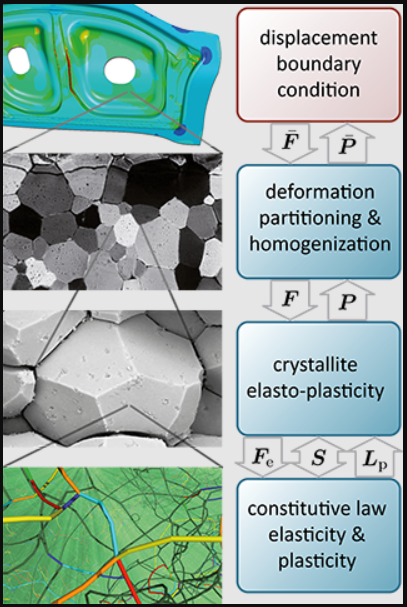

<!-- %%%%%%%% Document Metadata %%%%%%%% -->
# PhD Literature Review

- [PhD Literature Review](#phd-literature-review)
	- [September 30, 2021](#september-30-2021)
		- [Sources](#sources)
		- [Conclusions](#conclusions)
		- [Figures](#figures)
	- [Mechanical Aspects of Residual Stress Development in Shot Peening](#mechanical-aspects-of-residual-stress-development-in-shot-peening)
		- [Conclusions](#conclusions-1)
		- [Figures](#figures-1)
<!-- %%%%%%%%%%%%%%%%%%%%%%%%%%%%%% -->

<!-- START WRITING BELOW -->

<!-- %%%%%%%%%%%%%%%%%%%%%%%%%%%%%% -->
## September 30, 2021
### Sources
- [Mechanical properties are function of microstructure.](https://www.mse.ncsu.edu/zhu/wp-content/uploads/sites/27/2020/03/YF-Liu-HS-structure.pdf)
- [Nanocrystalline layers near surface make for a harder surface](https://www.jstage.jst.go.jp/article/matertrans/44/7/44_7_1488/_article/-char/ja/), which is separated from adjacent, deformed morphology by sharp boundaries. Annealing these layers show slow grain growth and no [[recrystallization]], which is similar to ball milling/drop deformation favoring higher strain rates and lower temperatures.
- [[nanocrystalline-volume]] larger for air blast shot peening than other [types](https://www.jstage.jst.go.jp/article/matertrans/45/2/45_2_376/_article/-char/ja/).
- In [[single-crystal]], causing [[recrystallization]] in surface layers affected a shorter stress rupture life at elevated temperatures and fracture by [[void-coalescence]]. [[void-coalescence]] to cracking was reason for short stress rupture life. *[link](https://www.sciencedirect.com/science/article/pii/S092150931200682X)*
- [[recrystallization]] depth increases with increasing the annealing temperature for [[single-crystal]]. [[recrystallization]] at surface of ball peening similar to wrought material: [[recrystallization-nucleation]], [[recrystallization-growth]], and [[recrystallization-coalescence]]. *[link](https://www.sciencedirect.com/science/article/pii/S1006706X10600313)*
- Dynamic rotation [[recrystallization]] in [[stress-shot-peening]] responsible for formation of nanograins by forming smaller grains, severe lattice distortions, and higher-density dislocations. *[link](https://www.sciencedirect.com/science/article/pii/S2238785420320524)*

[[stress-shot-peening]]
: Loading a specimen (tension, compression, or bending) and peens the surface while under load before unloading. *[link](https://www.researchgate.net/publication/333902882_Stress_Peening_-_a_Sophisticated_Way_of_normal_Shot_Peening)*

- Austenite volume fraction increases at surface under elevated temperatures when shot peened, which is [[reversed-phase-transformation]] from martensite. More temperature is more [[reversed-phase-transformation]] during peening. *[link](https://www.sciencedirect.com/science/article/pii/S2214785315006252)*

[[reversed-phase-transformation]]
: A phenomenon during annealing that causes a grain phase to move to one which precluded the quenching. E.g. In steel, austenite forms to martensite/pearlite when quenched; thus when annealed, formed martensite/pearlite could transform to austenite.

- [Reversed austenite retains a large extent of plasticity inherited from martensite.](https://www.researchgate.net/publication/260529444_Reverse_phase_transformation_of_martensite_to_austenite_in_stainless_steels_A_3D_phase-field_study)
- Nanocrystals with high twinning density improved corrosion resistance by providing more [[nucleation-sites]], adhesion work, and homogeneous capillary force between material and passive film. *[link](http://www.programmaster.org/PM/PM.nsf/ApprovedAbstracts/0399C4D57F51ACC085258711004C1CD6?OpenDocument)*
- [DAMASK](https://damask.mpie.de/) code used to efficiently calculate FEM codes to develop and test fine, course, and heterograin structures, which are independent variable in material strength and ductility. *[link](http://www.programmaster.org/PM/PM.nsf/ApprovedAbstracts/2F1C8E2BDDA892F7852587060010FBB9?OpenDocument)*
- [[ISV]] with [[recrystallization]] captures history sensitive, sequential BVP. [[ISV]] constitutive model accounts for static/dynamic [[recrystallization]] and [[grain-size]] wrt mechanical behavior, which is dependent on strain rate and temperature. Model includes [[recrystallization-volume-fraction]]. *[link](https://www.sciencedirect.com/science/article/pii/S0749641918303139)*

### Conclusions
Mechanical properties are function of microstructure. This microstructure might be changed through the air blast shot peening process, which is typically a high strain rate and non-elevated temperature process. Near the surface of the metal, nanocrystalline volume is increased. If annealed at sufficient temperature, recrystallization occurs, which can also reduce stress rupture life at elevated temperatures by void coalescence. Dynamic rotation of shot forms nanograins with smaller domains, severe lattice distortions, high dislocation densities. If shot peened at elevated temperature, reversed phase transformation changes ferritic martensite into austenite, which causes the steel to be ductile. Higher twinning density in nanocrystals improve corrosion resistance by enhancing chemical bond with corrosion resistant film to metal. [DAMASK](https://damask.mpie.de/) and ISV both claim to test material with varying grain structures as dependent on temperature and damage.

### Figures
|  |
|:--:|
| DAMASK is explicitly [[vertical-bridging]] ICME-esque process, which does not include the manufacturing history of the component. |

---

## Mechanical Aspects of Residual Stress Development in Shot Peening
[Al-Hassani (1980)](https://www.shotpeener.com/library/pdf/1981050.pdf)
  - Analytical expressions for [[residual-stress]] and [[plastic-zone]] during [[single-impact]] as function of shot velocity and shot and target hardness.
  - Validated with experiment.

### Conclusions

### Figures