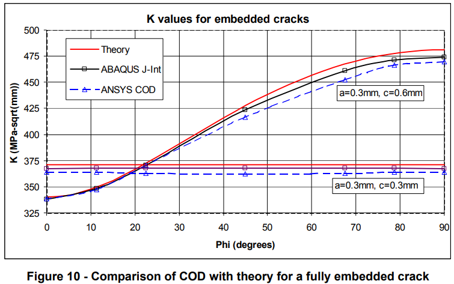
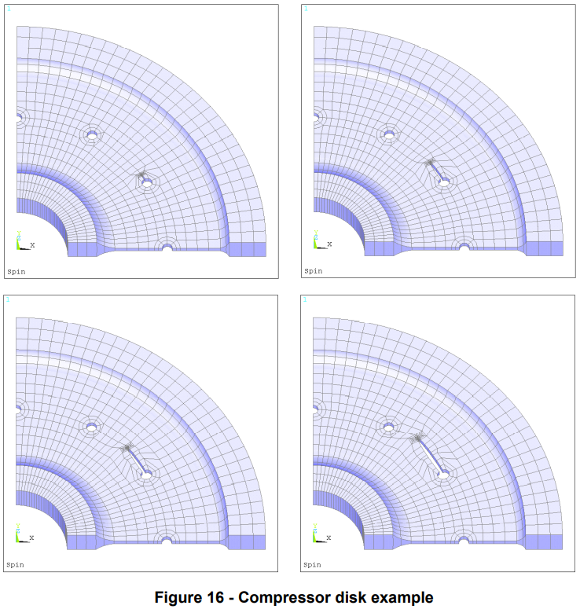

tags: computational-model ansys cracks

<!-- %%%%%%%% Document Metadata %%%%%%%% -->
# 3D Fracture Mechanics in ANSYS

- [3D Fracture Mechanics in ANSYS](#3d-fracture-mechanics-in-ansys)
	- [Annotations](#annotations)
	- [Figures](#figures)
	- [Abstract](#abstract)
	- [Notes](#notes)
<!-- %%%%%%%%%%%%%%%%%%%%%%%%%%%%%% -->

<!-- START WRITING BELOW -->

<!-- %%%%%%%%%%%%%%%%%%%%%%%%%%%%%% -->
*Reading: September 16, 2021*
## Annotations
COD obtained stress intensity factors. A general crack growth scheme allows crack advancement and non-planar crack growth.

## Figures
|  |
|:--:|
| Figure 10 - Comparison of COD with theory for a fully embedded crack. \\(\tag{fig:k_values_for_embedded_cracks} \label{fig:k_values_for_embedded_cracks}\\) |

|  |
|:--:|
| Figure 16 - Compressor disk example. \\(\tag{fig:compressor_disk_example} \label{fig:compressor_disk_example}\\) |

## Abstract
This paper will address methods of performing truly three-dimensional fracture mechanics analyses in [[ANSYS]]. Generally available fracture mechanics techniques and their implementation and use with [[ANSYS]] for 3D analysis will be briefly discussed. Techniques include the crack opening displacement (COD) method for LEFM, crack tip opening displacement (CTOD) method for EPFM, and the [[J-Integral]] method. A software implementation using the COD method in conjunction with [[ANSYS]] will be presented. This implementation addresses generation of cracked 3D meshes and crack growth prediction. Examples will demonstrate large-scale crack growth under generalised mixed-mode loading and the development of complex 3D crack surfaces.

## Notes
*ZENCRACK* (1990) apparently calculates crack initiation and growth. New software validated by *[[J-Integral]]* (1960). Verified with stress intensity factor calculations.
<!-- %%%%%%%%%%%%%%%%%%%%%%%%%%%%%% -->

<!-- %%%%%%%% End Document %%%%%%%% -->