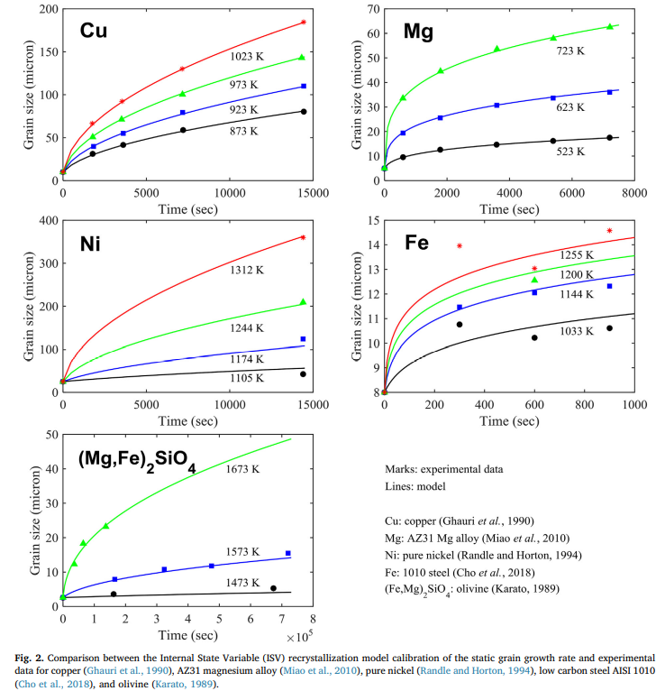
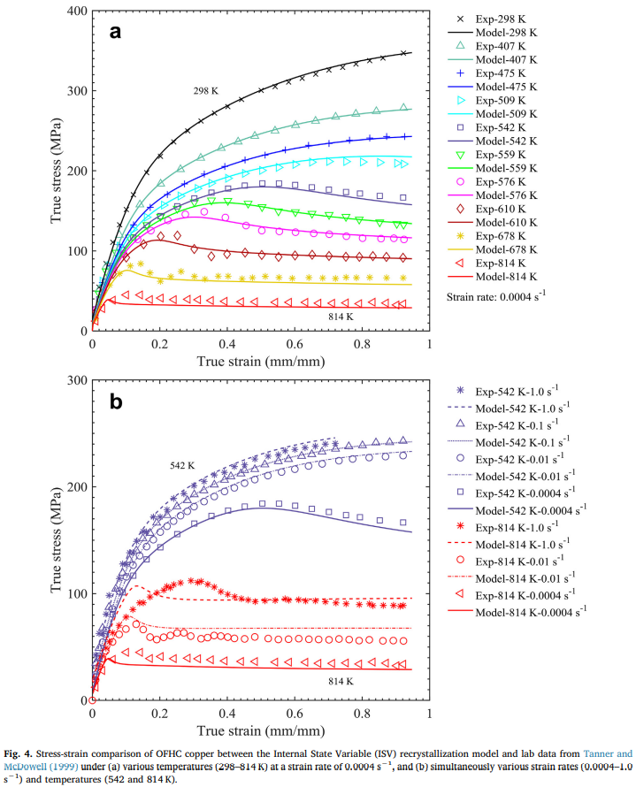
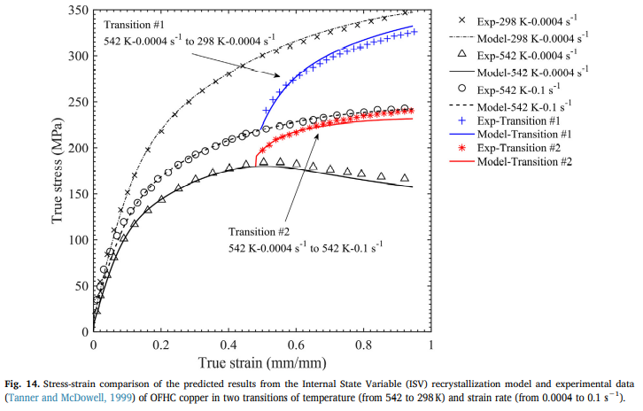

<!-- %%%%%%%% Document Metadata %%%%%%%% -->
# A Unified Static and Dynamic Recyrstallization Internal State Variable (ISV) Coupled with Grain Size Evolution for Metals and Mineral Aggregates

Date Created: October 5, 2012

- [A Unified Static and Dynamic Recyrstallization Internal State Variable (ISV) Coupled with Grain Size Evolution for Metals and Mineral Aggregates](#a-unified-static-and-dynamic-recyrstallization-internal-state-variable-isv-coupled-with-grain-size-evolution-for-metals-and-mineral-aggregates)
	- [Annotations](#annotations)
	- [Figures](#figures)
	- [Abstract](#abstract)
	- [Notes](#notes)
		- [Source Subtitle](#source-subtitle)
<!-- %%%%%%%%%%%%%%%%%%%%%%%%%%%%%% -->

<!-- START WRITING BELOW -->

<!-- %%%%%%%%%%%%%%%%%%%%%%%%%%%%%% -->
## Annotations
[[ISV]] with static and dynamic [[recrystallization]] quantifies [[grain-size]] and validated by stress-strain behavior experiment of copper, AZ31 magnesium alloy, pure nickel, and 1010 steel. Historical dependence captures complex [[BVP]] through manufacturing. **Deformation energy into [[grain-size]] not included, because of dependence on [[dislocation-density]] and [[grain-growth]]. [[anisotropic]] of [[recrystallization-volume-fraction]] may be important to [[kinematic-hardening]] and [[texture]].** [[recrystallization]] driven by:
1. [[work-hardening]] and [[recovery]]
2. [[grain-size]] evolution
3. Stored energy of plastic deformation.

[[recrystallization]]
: >Process by which high-angle grain boundaries form and/or grow because of plastically stored deformation energy <cite> Doherty (1997)

Models to date do not include yield surface for elastic-plastic transition by focusing only on certain [[recrystallization]] mechanisms under some thermomechanical conditions and over-simplified. These have limited use in industry for lack of accurate prediction of material behavior at current state for polycrystalline materials. Models also exclude potential [[dislocation-energy]] and evolution of [[grain-size]].

Sources of Note:
- *insert text here$\dots$*

## Figures
|  |
|:--:|
| Figure 2: Comparison between the [[ISV-recrystallization]] model calibration of the static grain growth rate and experimental data for copper, AZ31 magnesium alloy, pure nickel, low carbon steel AISI 1010, and olivine. \\(\label{fig:cho2019_fig2_isv_model_predictions_of_grain_size_under_temperature}\\) |

|  |
|:--:|
| Stress-strain comparison of OFHC copper between the [[ISV-recrystallization]] model and lab data under (a) various temperatures (298-814 K) at a strain rate of $0.0004s^{-1}$, and (b) simultaneously various strain rates ($0.0004-1.0 s^{-1}$) and temperatures (542 and 814 K). \\(\label{fig:cho2019_fig4_stress_strain_for_copper_from_isv_and_experiment}\\) |

|  |
|:--:|
| Figure 14: Stress-strain comparison of the predicted results from the [[ISV-recrystallization]] model and experimental data in two transitions of temperature (from 542 to 298 K) and strain rate (from $0.0004$ to $0.1 s^{-1}$). \\(\label{fig:cho2019_fig14_copper_stress_strain_for_strain_rate_and_temperature_isv_to_experiment}\\) |

## Abstract
A history dependent and physically-motivated Internal State Variable (ISV) constitutive model is presented that simultaneously accounts for the effects of static recrystallization, dynamic recrystallization, and grain size with respect to the mechanical behavior under different strain rates, temperatures, and pressures. A unique aspect of our ISV constitutive model is that grain size and recrystallized volume fraction can be directly included along with its associated rate of change under deformation and time in a coupled manner. The present ISV constitutive model was calibrated to several metals (oxygen-free high conductivity copper, AZ31 magnesium alloy, pure nickel, and 1010 low carbon steel) and geological materials (olivine and clinopyroxene). The model calibration shows good agreement with the experimental stress-strain behavior and average grain size data. Validation of the ISV constitutive model was accomplished by applying complex and history sensitive thermomechanical problems once the model was calibrated: i) sequential transitions of different loading conditions and ii) a multistage tubing process. The history dependence naturally provided by ISVs enabled the present model to effectively capture the complex boundary value problems with changing boundary conditions.

## Notes
*insert text here$\dots$*
### Source Subtitle
*insert text here$\dots$*
<!-- %%%%%%%%%%%%%%%%%%%%%%%%%%%%%% -->

<!-- %%%%%%%% End Document %%%%%%%% -->