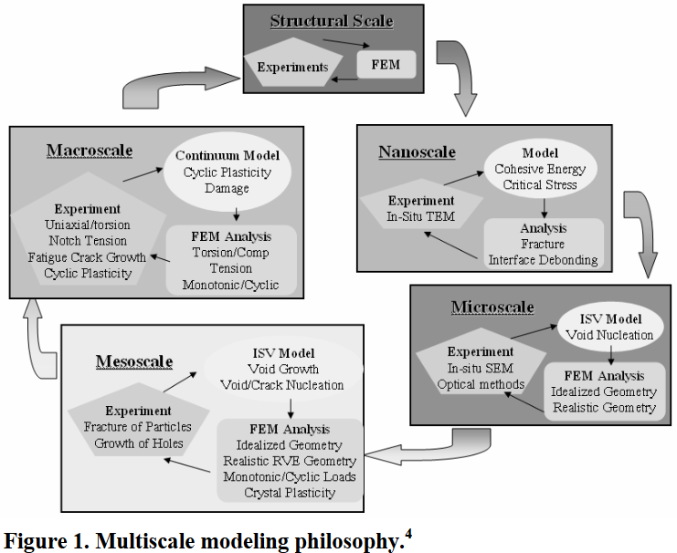

<!-- %%%%%%%% Document Metadata %%%%%%%% -->
# Reliability-Based Structural Optimization Using a Multiscale Material Model

Date Created: April 12, 2023

- [Reliability-Based Structural Optimization Using a Multiscale Material Model](#reliability-based-structural-optimization-using-a-multiscale-material-model)
  - [Annotations](#annotations)
  - [Figures](#figures)
  - [Abstract](#abstract)
<!-- %%%%%%%%%%%%%%%%%%%%%%%%%%%%%% -->

<!-- START WRITING BELOW -->

<!-- %%%%%%%%%%%%%%%%%%%%%%%%%%%%%% -->
## Annotations
This paper extends the concepts of #ISV to capture historical effects into the realm that **#von-Mises** stresses and #factor-of-safety are good, first approximations, but that more optimal designs exist.
Playing with the #design-variables in a #metamodeling scheme for component size and shape revealed an appropriate approximation by a #Gaussian-Process before plunging into a #mesh-refinement study on the found, optimal design (also seen in a #Linear-Response-Surface).
**Table 1** contains #ISV constants $C_{1}$ - $C_{18}$ for #A356-T6 #Al.
==**Contains great summary of #ISV equations with #damage.**==
Calls out that #Monte-Carlo-Simulation for so large a design of experiments is impractical.

Sources of Note:
- [4] From Atoms to Autos, A New Design Paradigm Using Microstructure Property Modeling, Part 1: Monotonic Loading Conditions

## Figures

## Abstract
In this paper, we present a methodology for reliability-based design optimization ( #RBDO ) of structural components using a #multiscale-material-model.
Our methodology focuses on the quantification of uncertainties in multiscale material models, their influence on constitutive relationships at different strain rates, and the integration of such models into #RBDO of structural components subject to multiple #failure-criterion.
To reduce the computational cost of #RBDO with #multiscale-material-model, appropriate metamodels based on #Gaussian-Process are developed.
Accuracy of these metamodels is compared with those of several other non-parametric and parametric metamodels.
Through the application of this methodology to #design-optimization of A356 cast aluminum alloy component, the effect of #multiscale-modeling is investigated.
The results show that for the same component weight, a design based on #von-Mises #failure-criterion is more than two times greater #damage index than that based on the #multiscale-material-model.
<!-- %%%%%%%%%%%%%%%%%%%%%%%%%%%%%% -->

<!-- %%%%%%%% End Document %%%%%%%% -->